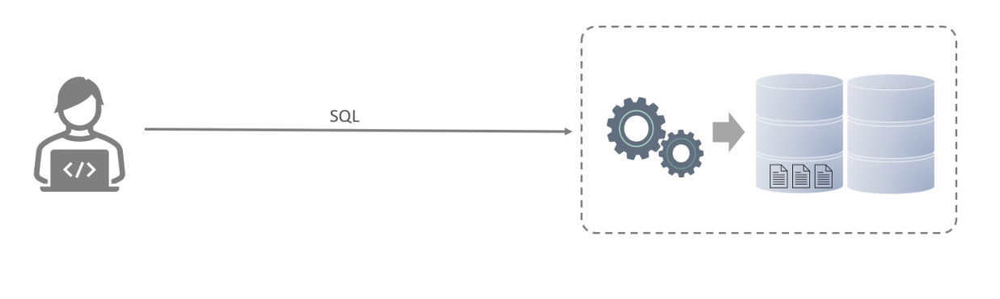
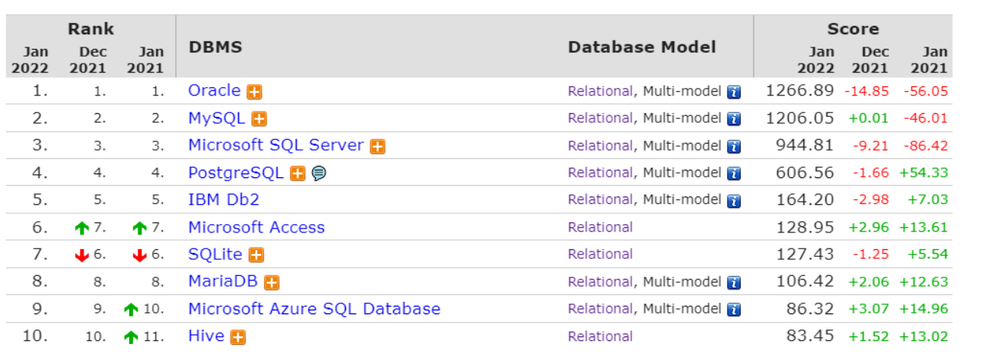
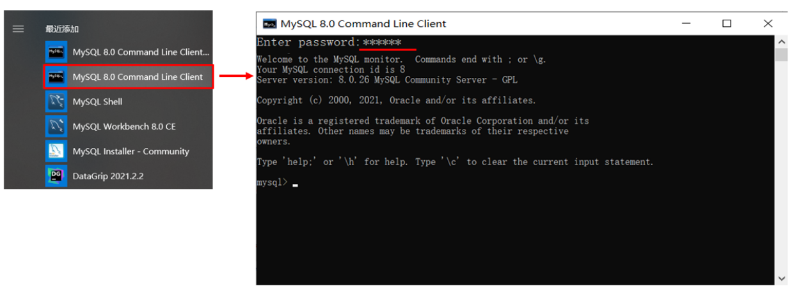
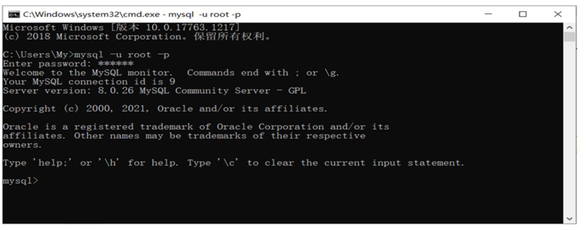
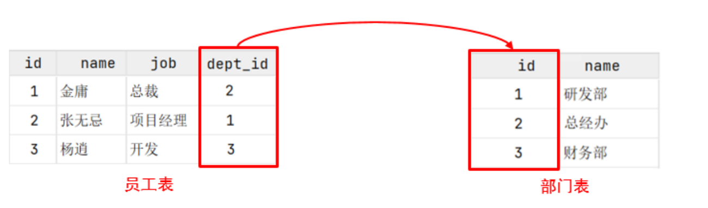
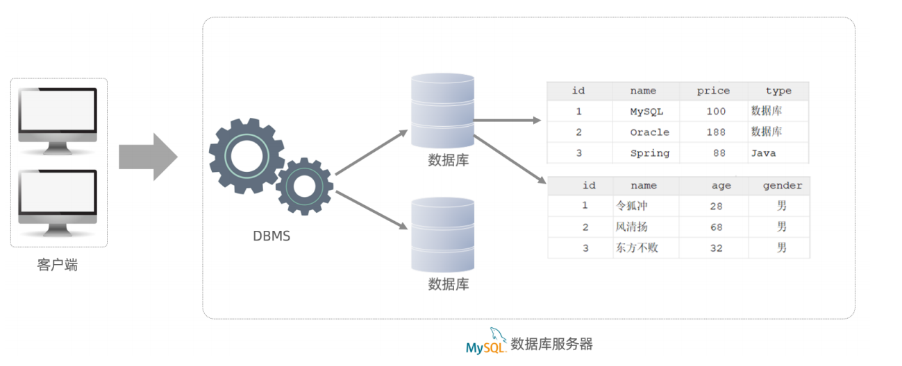

**<font style="color:#DF2A3F;">笔记来源：</font>**[**<font style="color:#DF2A3F;">黑马程序员 MySQL数据库入门到精通，从mysql安装到mysql高级、mysql优化全囊括</font>**](https://www.bilibili.com/video/BV1Kr4y1i7ru/?spm_id_from=333.337.search-card.all.click&vd_source=e8046ccbdc793e09a75eb61fe8e84a30)

## 1 数据库相关概念
我们先来讲解三个概念：数据库、数据库管理系统、SQL。

| 名称 | 全称 | 简称 |
| --- | --- | --- |
| 数据库 | 存储数据的仓库，数据是有组织的进行存储 | DataBase（DB） |
| 数据库管理系统 | 操纵和管理数据库的大型软件 | DataBase Management System (DBMS) |
| SQL | 操作关系型数据库的编程语言，定义了一套操作关系型数据库统一标准 | Structured Query Language (SQL) |


  
而目前主流的关系型数据库管理系统的市场占有率排名如下：  


+ Oracle：大型的收费数据库，Oracle公司产品，价格昂贵。
+ MySQL：开源免费的中小型数据库，后来Sun公司收购了MySQL，而Oracle又收购了Sun公司。
+ 目前Oracle推出了收费版本的MySQL，也提供了免费的社区版本。
+ SQL Server：Microsoft 公司推出的收费的中型数据库，C#、.net等语言常用。
+ PostgreSQL：开源免费的中小型数据库。
+ DB2：IBM公司的大型收费数据库产品。
+ SQLLite：嵌入式的微型数据库。Android内置的数据库采用的就是该数据库。
+ MariaDB：开源免费的中小型数据库。是MySQL数据库的另外一个分支、另外一个衍生产品，与
+ MySQL数据库有很好的兼容性。

而不论我们使用的是上面的哪一个关系型数据库，最终在操作时，都是使用SQL语言来进行统一操作，因为我们前面讲到SQL语言，是操作关系型数据库的统一标准 。所以即使我们现在学习的是MySQL，使用的是别的关系型数据库，如：Oracle、DB2、SQLServer，也完全不用担心，因为操作的方式都是一致的。

## 2 客户端连接
### 2.1 使用docker安装MySQL
1. 拉取镜像

```bash
docker pull mysql
```

2. 安装

```bash
docker run -d -p 3306:3306 -v /Users/admin/Desktop/docker-container/mysql/conf:/etc/mysql/conf.d -v /Users/admin/Desktop/docker-container/mysql/data:/var/lib/mysql -e MYSQL_ROOT_PASSWORD=123456 --name mysql mysql:latest

# 1. /Users/admin/Desktop/docker-container/mysql/conf
# 2. /Users/admin/Desktop/docker-container/mysql/data
#都是本地的文件夹
# 3. 用户是root，密码是123456
```

**<font style="color:#E8323C;"></font>**

**<font style="color:#E8323C;">方式一</font>**：使用MySQL提供的客户端命令行工具

  
**<font style="color:#E8323C;">方式二</font>**：使用系统自带的命令行工具执行指令

```sql
mysql [-h 127.0.0.1] [-P 3306] -u root -p 
--     参数：
--      -h : MySQL服务所在的主机IP 
--      -P : MySQL服务端口号， 默认3306 
--      -u : MySQL数据库用户名 
--      -p ： MySQL数据库用户名对应的密码
```

[ ]内为可选参数，如果需要连接远程的MySQL，需要加上这两个参数来指定远程主机IP、端口，如果连接本地的MySQL，则无需指定这两个参数。  


> 注意： 使用这种方式进行连接时，需要安装完毕后配置PATH环境变量。
>

## 3  数据模型
### 3.1 关系型数据库
<font style="color:#DF2A3F;">概念</font>：建立在关系模型基础上，由多张相互连接的二维表组成的数据库。

而所谓二维表，指的是由行和列组成的表，如下图（就类似于Excel表格数据，有表头、有列、有行，还可以通过一列关联另外一个表格中的某一列数据）。我们之前提到的MySQL、Oracle、DB2、SQLServer这些都是属于关系型数据库，里面都是基于二维表存储数据的。简单说，基于二维表存储数据的数据库就成为关系型数据库，不是基于二维表存储数据的数据库，就是非关系型数据库。  
  
**特点**：

+ 使用表存储数据，格式统一，便于维护。
+ 使用SQL语言操作，标准统一，使用方便。

### 3.2 数据模型
MySQL是关系型数据库，是基于二维表进行数据存储的，具体的结构图下:  


> 我们可以通过MySQL客户端连接数据库管理系统DBMS，然后通过DBMS操作数据库。  
可以使用SQL语句，通过数据库管理系统操作数据库，以及操作数据库中的表结构及数据。  
一个数据库服务器中可以创建多个数据库，一个数据库中也可以包含多张表，而一张表中又可以包含多行记录。
>

