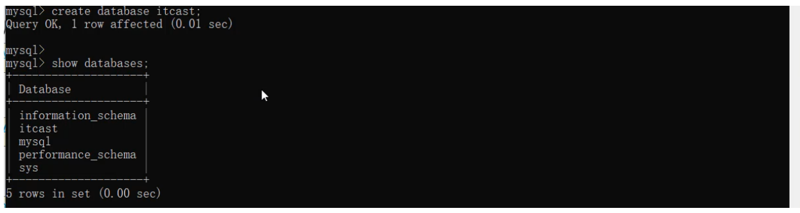
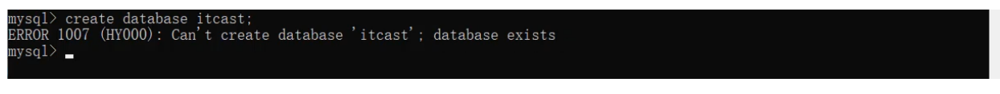
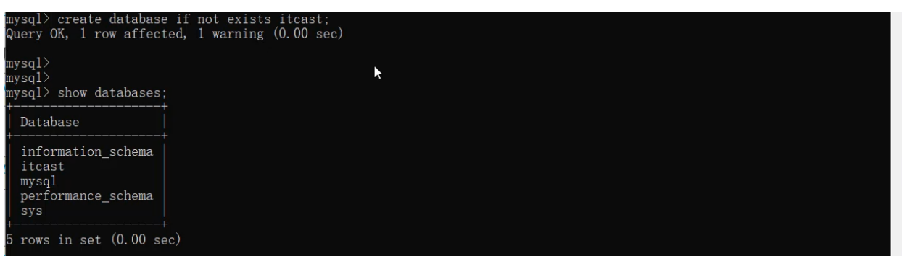
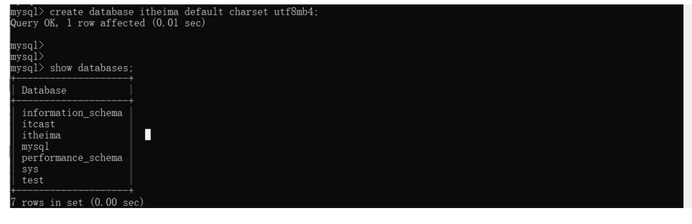
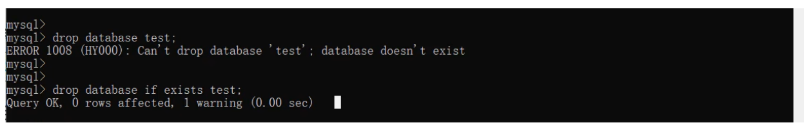
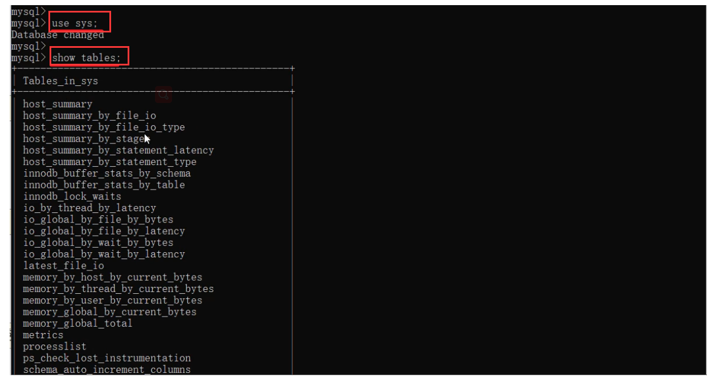
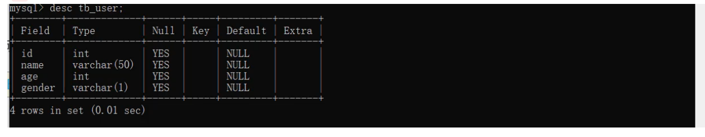
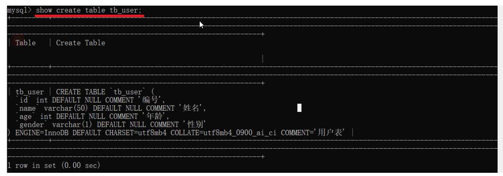
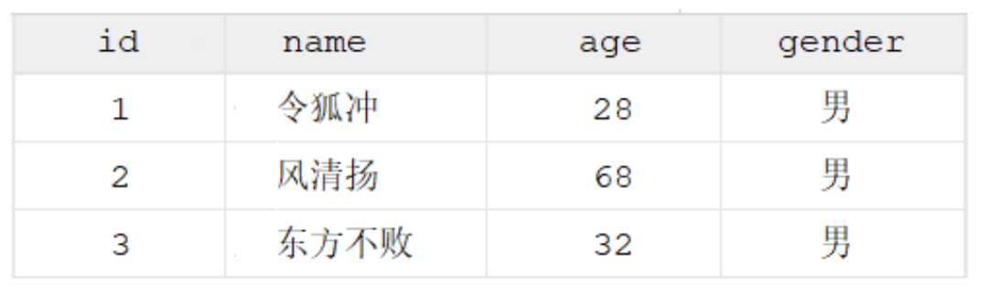
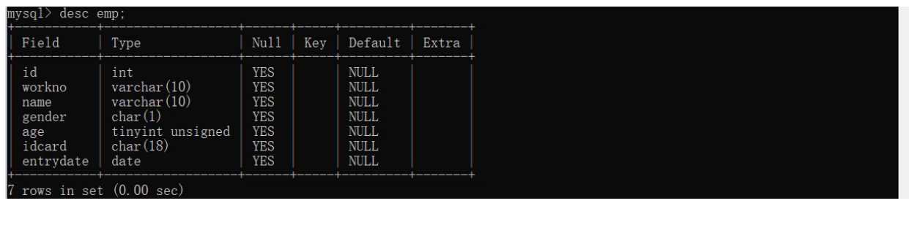

**<font style="color:#DF2A3F;">笔记来源：</font>**[**<font style="color:#DF2A3F;">黑马程序员 MySQL数据库入门到精通，从mysql安装到mysql高级、mysql优化全囊括</font>**](https://www.bilibili.com/video/BV1Kr4y1i7ru/?spm_id_from=333.337.search-card.all.click&vd_source=e8046ccbdc793e09a75eb61fe8e84a30)

# 1 SQL简介
SQL：全称 Structured Query Language，结构化查询语言。操作关系型数据库的编程语言，定义了一套操作关系型数据库统一**标准** 。

## 1.1 SQL通用语法
在学习具体的SQL语句之前，先来了解一下SQL语言的同于语法。

+ SQL语句可以单行或多行书写，以分号结尾。
+ SQL语句可以使用空格/缩进来增强语句的可读性。
+ MySQL数据库的SQL语句不区分大小写，关键字建议使用大写。
+ 注释： 
    - 单行注释：`<font style="color:#E8323C;">--</font>`<font style="color:#E8323C;"> </font>注释内容 或 `<font style="color:#E8323C;">#</font>`<font style="color:#E8323C;"> </font>注释内容
    - 多行注释：`<font style="color:#E8323C;">/</font>_<font style="color:#E8323C;"> </font>_<font style="color:#E8323C;">注释内容 /</font>`

## 1.2 SQL分类
SQL语句，根据其功能，主要分为四类：DDL、DML、DQL、DCL。

+ **<font style="color:#E8323C;">DDL</font>**：Data Definition Language，数据定义语言，用来定义数据库对象(数据库，表，字段)
+ **<font style="color:#E8323C;">DML</font>**：Data Manipulation Language，数据操作语言，用来对数据库表中的数据进行增删改
+ **<font style="color:#E8323C;">DQL</font>**：Data Query Language，数据查询语言，用来查询数据库中表的记录
+ **<font style="color:#E8323C;">DCL</font>**：Data Control Language，数据控制语言，用来创建数据库用户、控制数据库的访问权限


# 2 DDL
Data Definition Language，数据定义语言，用来定义数据库对象(数据库，表，字段) 。

## 2.1 数据库操作


**<font style="color:#E8323C;">查询所有数据库</font>**

```sql
show databases;
```

**<font style="color:#E8323C;"></font>**

**<font style="color:#E8323C;">查询当前数据库</font>**

```sql
select database();
```


**<font style="color:#E8323C;">创建数据库</font>**

```sql
-- [ ]中的可以不写
create database [ if not exists ] 数据库名 [ default charset 字符集 ] [ collate 排序规则 ] ;
```

  
**<font style="color:#E8323C;">案例一</font>**. 创建一个itcast数据库, 使用数据库默认的字符集。

```plsql
create database itcast;
```

  
在同一个数据库服务器中，不能创建两个名称相同的数据库，否则将会报错。  
  
可以通过if not exists 参数来解决这个问题，数据库不存在, 则创建该数据库，如果存在，则不创建。

```plsql
create database if not extists itcast;
```



**<font style="color:#E8323C;">案例二</font>**. 创建一个itheima数据库，并且指定字符集

```plsql
create database itheima default charset utf8mb4;
```



**<font style="color:#E8323C;">删除数据库</font>**

```plain
drop database [ if exists ] 数据库名 ;
```

如果删除一个不存在的数据库，将会报错。此时，可以加上参数 if exists ，如果数据库存在，再执行删除，否则不执行删除。  


**<font style="color:#E8323C;">切换数据库</font>**

```sql
use 数据库名 ;
```

我们要操作某一个数据库下的表时，就需要通过该指令，切换到对应的数据库下，否则是不能操作的。  
比如，切换到itcast数据，执行如下SQL：<font style="color:#E8323C;">use itcast</font>;

## 2.2 表操作
### 2.2.1 表操作-查询创建
**<font style="color:#E8323C;">查询当前数据库所有表</font>**

```plain
show tables;
```

比如,我们可以切换到sys这个系统数据库,并查看系统数据库中的所有表结构。

```plsql
use sys;
show tables;
```




**<font style="color:#E8323C;">查看指定表结构</font>**

```sql
desc 表名;
```

通过这条指令，我们可以查看到指定表的字段，字段的类型、是否可以为NULL，是否存在默认值等信息。  



**<font style="color:#E8323C;">查询指定表的建表语句</font>**

```sql
show create table 表名 ;
```

通过这条指令，主要是用来查看建表语句的，而有部分参数我们在创建表的时候，并未指定也会查询到，因为这部分是数据库的默认值，如：存储引擎、字符集等。  



**<font style="color:#E8323C;">创建表结构</font>**

```sql
CREATE TABLE 表名( 
  字段1 字段1类型 [ COMMENT 字段1注释 ], 
  字段2 字段2类型 [COMMENT 字段2注释 ], 
  字段3 字段3类型 [COMMENT 字段3注释 ], 
  ...... 
  字段n 字段n类型 [COMMENT 字段n注释 ] 
) [ COMMENT 表注释 ] ;
```

> 注意: [...] 内为可选参数，最后一个字段后面没有逗号
>

比如，我们创建一张表 tb_user ，对应的结构如下，那么建表语句为：  


```plsql
create table tb_user( 
  id int comment '编号', 
  name varchar(50) comment '姓名', 
  age int comment '年龄', 
  gender varchar(1) comment '性别' 
) comment '用户表';
```


### 2.2.2 表操作-数据类型
在上述的建表语句中，我们在指定字段的数据类型时，用到了int ，varchar，那么在MySQL中除了以上的数据类型，还有哪些常见的数据类型呢？ 接下来,我们就来详细介绍一下MySQL的数据类型。  
MySQL中的数据类型有很多，主要分为三类：数值类型、字符串类型、日期时间类型。

**<font style="color:#E8323C;">数值类型</font>**

| 类型 | 大小 | 有符号(SIGNED)范围 | 无符号(UNSIGNED)范围 | 描述 |
| --- | --- | --- | --- | --- |
| TINYINT | 1byte | (-128，127) | (0，255) | 小整数值 |
| SMALLINT | 2bytes | (-32768，32767) | (0，65535) | 大整数值 |
| MEDIUMINT | 3bytes | (-8388608，8388607) | (0，16777215) | 大整数值 |
| INT/INTEGER | 4bytes | (-2147483648， 2147483647) | (0，4294967295) | 大整数值 |
| BIGINT | 8bytes | (-2^63 ，2^63-1) | (0，2^64-1) | 极大整数值 |
| FLOAT | 4bytes | (-3.402823466 E+38， 3.402823466351 E+38) | 0 和 (1.175494351 E- 38，3.402823466 E+38) | 单精度浮点数值 |
| DOUBLE | 8bytes | (-1.7976931348623157 E+308， 1.7976931348623157 E+308) | 0 和 (2.2250738585072014 E-308， 1.7976931348623157 E+308) | 双精度浮点数值 |
| DECIMAL |  | 依赖于M(精度)和D(标度) 的值 | 依赖于M(精度)和D(标度)的 值 | 小数值(精确定点数) |


```sql
--如: 1). 年龄字段 -- 不会出现负数, 而且人的年龄不会太大 
age tinyint unsigned
--    2). 分数 -- 总分100分, 最多出现一位小数 
score double(4,1)
```


**<font style="color:#E8323C;">字符串类型</font>**

| 类型 | 大小 | 描述 |
| --- | --- | --- |
| CHAR | 0-255 bytes | 定长字符串(需要指定长度) |
| VARCHAR | 0-65535 bytes | 变长字符串(需要指定长度) |
| TINYBLOB | 0-255 bytes | 不超过255个字符的二进制数据 |
| TINYTEXT | 0-255 bytes | 短文本字符串 |
| BLOB | 0-65 535 bytes | 二进制形式的长文本数据 |
| TEXT | 0-65 535 bytes | 长文本数据 |
| MEDIUMBLOB | 0-16 777 215 bytes | 二进制形式的中等长度文本数据 |
| MEDIUMTEXT | 0-16 777 215 bytes | 中等长度文本数据 |
| LONGBLOB | 0-4 294 967 295 bytes | 二进制形式的极大文本数据 |
| LONGTEXT | 0-4 294 967 295 bytes | 极大文本数据 |


char 与 varchar 都可以描述字符串，char是定长字符串，指定长度多长，就占用多少个字符，和字段值的长度无关 。而varchar是变长字符串，指定的长度为最大占用长度 。相对来说，char的性能会更高些。

```sql
--如： 1). 用户名 username ------> 长度不定, 最长不会超过50 
username varchar(50) 
--     2). 性别 gender ---------> 存储值, 不是男,就是女 
gender char(1) 
--     3). 手机号 phone --------> 固定长度为11 
phone char(11)
```


**<font style="color:#E8323C;">日期时间类型</font>**

| 类型 | 大小 | 范围 | 格式 | 描述 |
| --- | --- | --- | --- | --- |
| DATE | 3 | 1000-01-01 至 9999-12-31 | YYYY-MM-DD | 日期值 |
| TIME | 3 | -838:59:59 至 838:59:59 | HH:MM:SS | 时间值或持续时间 |
| YEAR | 1 | 1901 至 2155 | YYYY | 年份值 |
| DATETIME | 8 | 1000-01-01 00:00:00 至 9999-12-31 23:59:59 | YYYY-MM-DD HH:MM:SS | 混合日期和时间值 |
| TIMESTAMP | 4 | 1970-01-01 00:00:01 至 2038-01-19 03:14:07 | YYYY-MM-DD HH:MM:SS | 混合日期和时间值，时间戳 |


```sql
--如: 1). 生日字段 
birthday birthday date 
--    2). 创建时间 
createtime createtime datetime
```


**<font style="color:#E8323C;">案例</font>**  
设计一张员工信息表，要求如下：

> 1. 编号（纯数字）
> 2. 员工工号 (字符串类型，长度不超过10位)
> 3. 员工姓名（字符串类型，长度不超过10位）
> 4. 性别（男/女，存储一个汉字）
> 5. 年龄（正常人年龄，不可能存储负数）
> 6. 身份证号（二代身份证号均为18位，身份证中有X这样的字符）
> 7. 入职时间（取值年月日即可）
>

对应的建表语句如下:

```plsql
create table emp( 
  id int comment '编号', 
  workno varchar(10) comment '工号',
  name varchar(10) comment '姓名', 
  gender char(1) comment '性别', 
  age tinyint unsigned comment '年龄', 
  idcard char(18) comment '身份证号', 
  entrydate date comment '入职时间' 
) comment '员工表';
```


SQL语句编写完毕之后，就可以在MySQL的命令行中执行SQL，然后也可以通过 `desc` 指令查询表结构信息：  


表结构创建好了，里面的name字段是varchar类型，最大长度为10，也就意味着如果超过10将会报错，如果我们想修改这个字段的类型 或 修改字段的长度该如何操作呢？接下来再来讲解DDL语句中，如何操作表字段。


**<font style="color:#E8323C;">表操作-修改</font>**

**① 添加字段**

```plsql
ALTER TABLE 表名 ADD 字段名 类型 (长度) [ COMMENT 注释 ] [ 约束 ];
```

  
**<font style="color:#000000;">案例:</font>**

```sql
-- 为emp表增加一个新的字段”昵称”为nickname，类型为varchar(20)
ALTER TABLE emp ADD nickname varchar(20) COMMENT '昵称';
```

**② 修改数据类型**

```sql
ALTER TABLE 表名 MODIFY 字段名 新数据类型 (长度);
```

**③ 修改字段名和字段类型:**

```sql
ALTER TABLE 表名 CHANGE 旧字段名 新字段名 类型 (长度) [ COMMENT 注释 ] [ 约束 ];
```

```sql
-- 将emp表的nickname字段修改为username，类型为varchar(30)
ALTER TABLE emp CHANGE nickname username varchar(30) COMMENT '昵称';
```

**④ 删除字段:**

```sql
ALTER TABLE 表名 DROP 字段名;
```

**案例:**

```sql
-- 将emp表的字段username删除
ALTER TABLE emp DROP username;
```


**⑤ 表名:**

```sql
ALTER TABLE 表名 RENAME TO 新表名;
```

**案例:**

```sql
-- 将emp表的表名修改为 employee
ALTER TABLE emp RENAME TO employee;
```


**<font style="color:#E8323C;">表操作-删除</font>**

**① 删除表**

```plsql
DROP TABLE [ IF EXISTS ] 表名;
```

可选项 IF EXISTS 代表，只有表名存在时才会删除该表，表名不存在，则不执行删除操作(如果不加该参数项，删除一张不存在的表，执行将会报错)。  
案例:

```sql
-- 如果tb_user表存在，则删除tb_user表
DROP TABLE IF EXISTS tb_user;
```


**② 删除指定表, 并重新创建表**

```sql
TRUNCATE TABLE 表名;
```

> 注意: 在删除表的时候，表中的全部数据也都会被删除。
>

