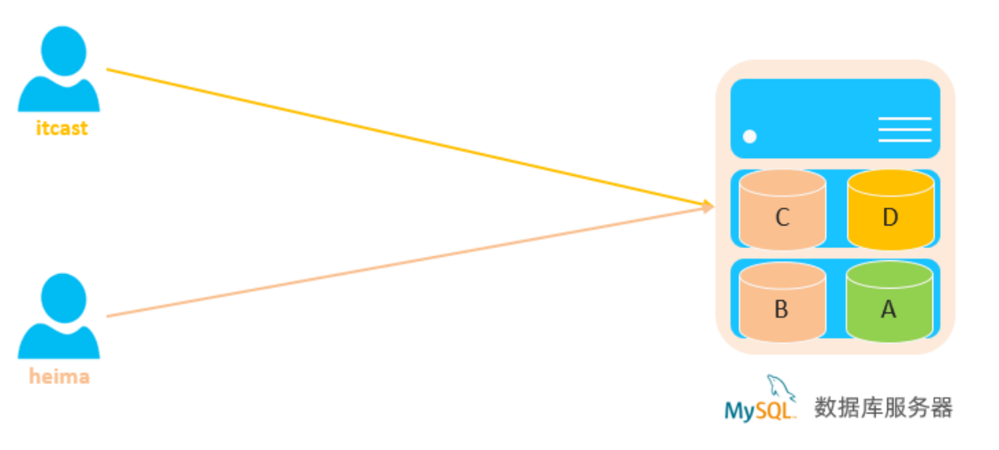
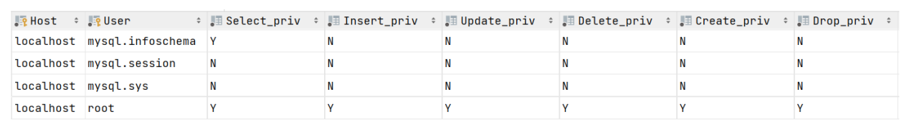

**<font style="color:#DF2A3F;">笔记来源：</font>**[**<font style="color:#DF2A3F;">黑马程序员 MySQL数据库入门到精通，从mysql安装到mysql高级、mysql优化全囊括</font>**](https://www.bilibili.com/video/BV1Kr4y1i7ru/?spm_id_from=333.337.search-card.all.click&vd_source=e8046ccbdc793e09a75eb61fe8e84a30)


# 5. 前言
DCL英文全称是Data Control Language(数据控制语言)，用来管理数据库用户、控制数据库的访问权限。  


# 1 管理用户
**<font style="color:#DF2A3F;">查询用户</font>**

```plsql
select * from mysql.user;
```

查询的结果如下:  
  
其中 Host代表当前用户访问的主机, 如果为localhost, 仅代表只能够在当前本机访问，是不可以远程访问的。 User代表的是访问该数据库的用户名。在MySQL中需要通过Host和User来唯一标识一个用户。  


**<font style="color:#DF2A3F;">创建用户</font>**

```plsql
CREATE USER '用户名'@'主机名' IDENTIFIED BY '密码';
```

  
**<font style="color:#DF2A3F;">修改用户密码</font>**

```plsql
ALTER USER '用户名'@'主机名' IDENTIFIED WITH mysql_native_password BY '新密码' ;
```

  
**<font style="color:#DF2A3F;">删除用户</font>**

```plsql
DROP USER '用户名'@'主机名';
```


注意事项:

> 在MySQL中需要通过用户名@主机名的方式，来唯一标识一个用户。  
主机名可以使用 % 通配。  
这类SQL开发人员操作的比较少，主要是DBA（ Database Administrator 数据库管理员）使用。
>


案例：

```sql
--A. 创建用户itcast, 只能够在当前主机localhost访问, 密码123456;
create user 'itcast'@'localhost' identified by '123456';

--B. 创建用户heima, 可以在任意主机访问该数据库, 密码123456;
create user 'heima'@'%' identified by '123456';

--C. 修改用户heima的访问密码为1234;
alter user 'heima'@'%' identified with mysql_native_password by '1234';

--D. 删除 itcast@localhost 用户
drop user 'itcast'@'localhost';
```

# 2 权限控制
MySQL中定义了很多种权限，但是常用的就以下几种：

| 权限 | 说明 |
| --- | --- |
| ALL, ALL PRIVILEGES | 所有权限 |
| SELECT | 查询数据 |
| INSERT | 插入数据 |
| UPDATE | 修改数据 |
| DELETE | 删除数据 |
| ALTER | 修改表 |
| DROP | 删除数据库/表/视图 |
| CREATE | 创建数据库/表 |


上述只是简单罗列了常见的几种权限描述，其他权限描述及含义，可以直接参考[官方文档](https://dev.mysql.com/doc/refman/8.0/en/privileges-provided.html)。  
**<font style="color:#DF2A3F;">查询权限</font>**

```sql
SHOW GRANTS FOR '用户名'@'主机名' ;
```

  
**<font style="color:#DF2A3F;">授予权限</font>**

```sql
GRANT 权限列表 ON 数据库名.表名 TO '用户名'@'主机名';
```

  
**<font style="color:#DF2A3F;">撤销权限</font>**

```sql
REVOKE 权限列表 ON 数据库名.表名 FROM '用户名'@'主机名';
```

  
注意事项：

> 多个权限之间，使用逗号分隔  
授权时， 数据库名和表名可以使用 * 进行通配，代表所有。
>


案例:

```sql
--A. 查询 'heima'@'%' 用户的权限
show grants for 'heima'@'%';

--B. 授予 'heima'@'%' 用户itcast数据库所有表的所有操作权限
grant all on itcast.* to 'heima'@'%';

--C. 撤销 'heima'@'%' 用户的itcast数据库的所有权限
revoke all on itcast.* from 'heima'@'%';
```

