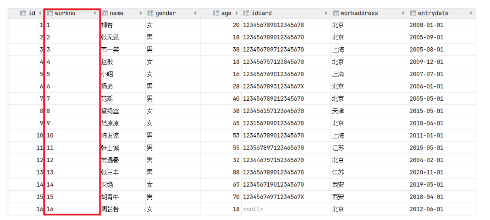
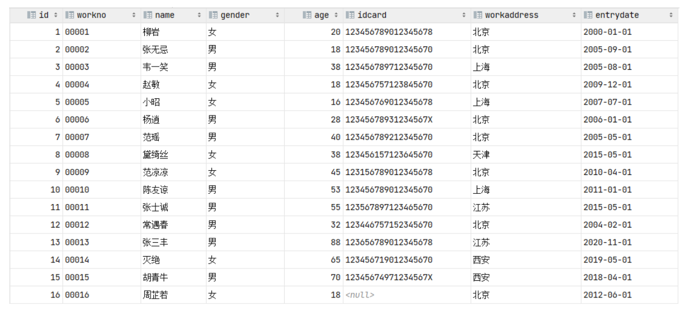

**<font style="color:#DF2A3F;">笔记来源：</font>**[**<font style="color:#DF2A3F;">黑马程序员 MySQL数据库入门到精通，从mysql安装到mysql高级、mysql优化全囊括</font>**](https://www.bilibili.com/video/BV1Kr4y1i7ru/?spm_id_from=333.337.search-card.all.click&vd_source=e8046ccbdc793e09a75eb61fe8e84a30)

****

**函数：**是指一段可以直接被另一段程序调用的程序或代码。 也就意味着，这一段程序或代码在MySQL中已经给我们提供了，我们要做的就是在合适的业务场景调用对应的函数完成对应的业务需求即可。 那么，函数到底在哪儿使用呢？

我们先来看两个场景：  


1. 在企业的OA或其他的人力系统中，经常会提供的有这样一个功能，每一个员工登录上来之后都能够看到当前员工入职的天数。 而在数据库中，存储的都是入职日期，如 2000-11-12，那如果快速计算出天数呢？
2. 在做报表这类的业务需求中,我们要展示出学员的分数等级分布。而在数据库中，存储的是学生的分数值，如98/75，如何快速判定分数的等级呢？

其实，上述的这一类的需求呢，我们通过MySQL中的函数都可以很方便的实现 。MySQL中的函数主要分为以下四类：

+ 字符串函数
+ 数值函数
+ 日期函数
+ 流程函数

## 1 字符串函数
MySQL中内置了很多字符串函数，常用的几个如下：

| 函数 | 功能 |
| --- | --- |
| CONCAT(S1,S2,...Sn) | 字符串拼接，将S1，S2，... Sn拼接成一个字符串 |
| LOWER(str) | 将字符串str全部转为小写 |
| UPPER(str) | 将字符串str全部转为大写 |
| LPAD(str,n,pad) | 左填充，用字符串pad对str的左边进行填充，达到n个字符串长度 |
| RPAD(str,n,pad) | 右填充，用字符串pad对str的右边进行填充，达到n个字符串长度 |
| TRIM(str) | 去掉字符串头部和尾部的空格 |
| SUBSTRING(str,start,len) | 返回从字符串str从start位置起的len个长度的字符串 |


案例一：

```sql
-- A. concat : 字符串拼接
select concat('Hello' , ' MySQL');
-- B. lower : 全部转小写
select lower('Hello');
-- C. upper : 全部转大写
select upper('Hello');
-- D. lpad : 左填充
select lpad('01', 5, '-');
-- E. rpad : 右填充
select rpad('01', 5, '-');
-- F. trim : 去除空格
select trim(' Hello MySQL ');
-- G. substring : 截取子字符串
select substring('Hello MySQL',1,5);
```


案例二:  
  
由于业务需求变更，企业员工的工号，统一为5位数，目前不足5位数的全部在前面补0。比如： 1号员工的工号应该为00001。

```sql
update emp set workno = lpad(workno, 5, '0');
```

处理完毕后, 具体的数据为:  


## 2 数值函数
常见的数值函数如下：

| 函数 | 功能 |
| --- | --- |
| CEIL(x) | 向上取整 |
| FLOOR(x) | 向下取整 |
| MOD(x,y) | 返回x/y的模 |
| RAND() | 返回0~1内的随机数 |
| ROUND(x,y) | 求参数x的四舍五入的值，保留y位小数 |


演示如下：

```sql
-- A. ceil：向上取整
select ceil(1.1);
-- B. floor：向下取整
select floor(1.9);
-- C. mod：取模
select mod(7,4);
-- D. rand：获取随机数
select rand();
-- E. round：四舍五入
select round(2.344,2);
```

案例：通过数据库的函数，生成一个六位数的随机验证码。

思路： 获取随机数可以通过rand()函数，但是获取出来的随机数是在0-1之间的，所以可以在其基础上乘以1000000，然后舍弃小数部分，如果长度不足6位，补 0

```sql
select lpad(round(rand()*1000000 , 0), 6, '0');
```

## 3 日期函数
常见的日期函数如下：

| 函数 | 功能 |
| --- | --- |
| CURDATE() | 返回当前日期 |
| CURTIME() | 返回当前时间 |
| NOW() | 返回当前日期和时间 |
| YEAR(date) | 获取指定date的年份 |
| MONTH(date) | 获取指定date的月份 |
| DAY(date) | 获取指定date的日期 |
| DATE_ADD(date, INTERVAL exprtype) | 返回一个日期/时间值加上一个时间间隔expr后的时间值 |
| DATEDIFF(date1,date2) | 返回起始时间date1 和 结束时间date2之间的天数 |


演示如下：

```sql
-- A. curdate：当前日期
select curdate();

-- B. curtime：当前时间
select curtime();

-- C. now：当前日期和时间
select now();

-- D. YEAR , MONTH , DAY：当前年、月、日
select YEAR(now()); 
select MONTH(now()); 
select DAY(now());

-- E. date_add：增加指定的时间间隔
select date_add(now(), INTERVAL 70 YEAR );

-- F. datediff：获取两个日期相差的天数
select datediff('2021-10-01', '2021-12-01');
```

案例：查询所有员工的入职天数，并根据入职天数倒序排序。

思路： 入职天数，就是通过【当前日期 - 入职日期】，所以需要使用 datediff 函数来完成。

```sql
select name, datediff(curdate(), entrydate) as 'entrydays' from emp order by entrydays desc;
```

## 4 流程函数
流程函数也是很常用的一类函数，可以在SQL语句中实现条件筛选，从而提高语句的效率。

| 函数 | 功能 |
| --- | --- |
| IF(value , t , f) | 如果value为true，则返回t，否则返回f |
| IFNULL(value1 , value2) | 如果value1不为空，返回value1，否则返回value2 |
| CASE WHEN [ val1 ] THEN [res1] ... ELSE [ default ] END | 如果val1为true，返回res1，... 否则返回default默认值 |
| CASE [ expr ] WHEN [ val1 ] THEN [res1] ... ELSE [ default ] END | 如果expr的值等于val1，返回res1，... 否则返回default默认值 |


演示如下：

```sql
-- A. if
select if(false, 'Ok', 'Error');

-- B. ifnull
select ifnull('Ok','Default'); 
select ifnull('','Default'); 
select ifnull(null,'Default');

-- C. case when then else end
-- 需求: 查询emp表的员工姓名和工作地址 (北京/上海 ----> 一线城市 , 其他 ----> 二线城市)，此处用的是第四种
select
  name, 
  ( case workaddress when '北京' then '一线城市' when '上海' then '一线城市' 
  else '二线城市' end ) as '工作地址' 
from emp;
```


案例二:

```sql
create table score( 
    id int comment 'ID', 
    name varchar(20) comment '姓名', 
    math int comment '数学', 
    english int comment '英语', 
    chinese int comment '语文' 
) comment '学员成绩表';

insert into score(id, name, math, english, chinese) VALUES (1, 'Tom', 67, 88, 95 ), (2, 'Rose' , 23, 66, 90),(3, 'Jack', 56, 98, 76);
```


具体的SQL语句如下:

```sql
-- 此处用的是第三种case then
select
    id, 
    name,
    (case when math >= 85 then '优秀' when math >=60 then '及格' else '不及格' end ) '数学',
    (case when english >= 85 then '优秀' when english >=60 then '及格' else '不及格' end ) '英语',
    (case when chinese >= 85 then '优秀' when chinese >=60 then '及格' else '不及格' end ) '语文'
from score;
```

