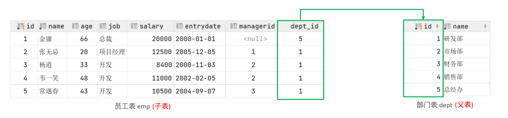
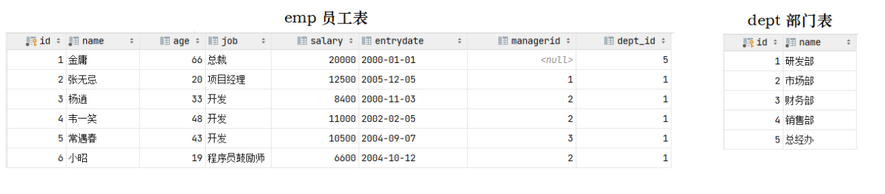
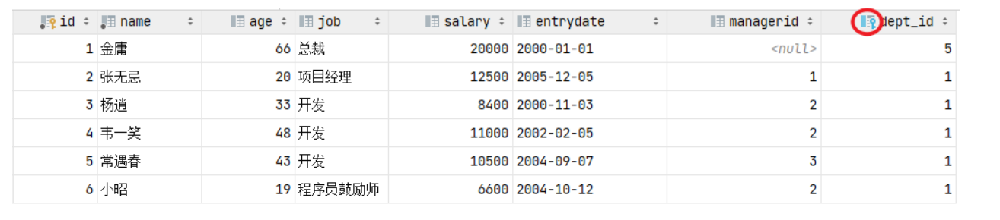
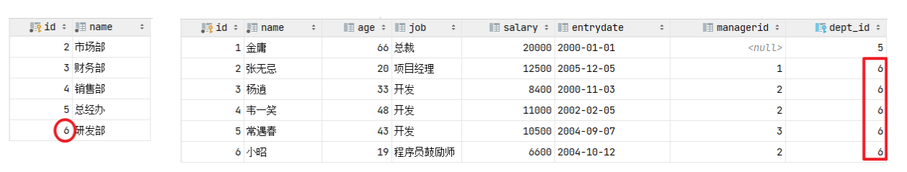
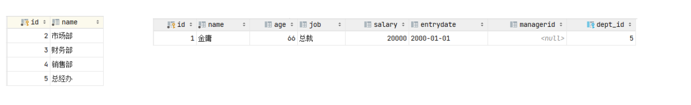
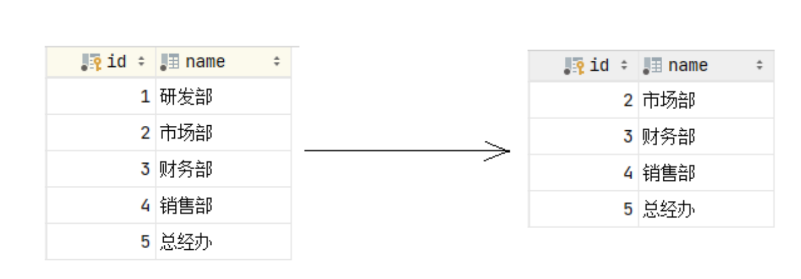
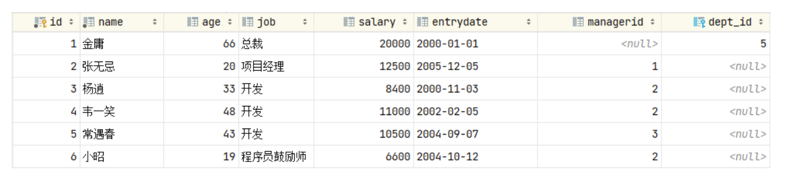

**<font style="color:#DF2A3F;">笔记来源：</font>**[**<font style="color:#DF2A3F;">黑马程序员 MySQL数据库入门到精通，从mysql安装到mysql高级、mysql优化全囊括</font>**](https://www.bilibili.com/video/BV1Kr4y1i7ru/?spm_id_from=333.337.search-card.all.click&vd_source=e8046ccbdc793e09a75eb61fe8e84a30)

## 1 概述
概念：约束是作用于表中字段上的规则，用于限制存储在表中的数据。

目的：保证数据库中数据的正确、有效性和完整性。

  
分类：

| 约束 | 描述 | 关键字 |
| --- | --- | --- |
| 非空约束 | 限制该字段的数据不能为null | NOT NULL |
| 唯一约束 | 保证该字段的所有数据都是唯一、不重复的 | UNIQUE |
| 主键约束 | 主键是一行数据的唯一标识，要求非空且唯一 | PRIMARY KEY |
| 默认约束 | 保存数据时，如果未指定该字段的值，则采用默认值 | DEFAULT |
| 检查约束(8.0.16版本之后) | 保证字段值满足某一个条件 | CHECK |
| 外键约束 | 用来让两张表的数据之间建立连接，保证数据的一致性和完整性 | FOREIGN KEY |


> 注意：约束是作用于表中字段上的，可以在创建表/修改表的时候添加约束。
>


案例需求： 根据需求，完成表结构的创建。需求如下：

| 字段名 | 字段含义 | 字段类型 | 约束条件 | 约束关键字 |
| --- | --- | --- | --- | --- |
| id | ID唯一标识 | int | 主键，并且自动增长 | PRIMARY KEY, AUTO_INCREMENT |
| name | 姓名 | varchar(10) | 不为空，并且唯一 | NOT NULL , UNIQUE |
| age | 年龄 | int | 大于0，并且小于等于120 | CHECK |
| status | 状态 | char(1) | 如果没有指定该值，默认为1 | DEFAULT |
| gender | 性别 | char(1) | 无 | |


对应的建表语句为：

```sql
CREATE TABLE tb_user( 
    id int AUTO_INCREMENT PRIMARY KEY COMMENT 'ID唯一标识', 
    name varchar(10) NOT NULL UNIQUE COMMENT '姓名' , 
    age int check (age > 0 && age <= 120) COMMENT '年龄' , 
    status char(1) default '1' COMMENT '状态', 
    gender char(1) COMMENT '性别' 
);
```

在为字段添加约束时，我们只需要在字段之后加上约束的关键字即可，需要关注其语法。我们执行上面的SQL把表结构创建完成，然后接下来，就可以通过一组数据进行测试，从而验证一下，约束是否可以生效。

```sql
insert into tb_user(name,age,status,gender) values ('Tom1',19,'1','男'), ('Tom2',25,'0','男'); 
insert into tb_user(name,age,status,gender) values ('Tom3',19,'1','男'); 
insert into tb_user(name,age,status,gender) values (null,19,'1','男'); 
insert into tb_user(name,age,status,gender) values ('Tom3',19,'1','男');
insert into tb_user(name,age,status,gender) values ('Tom4',80,'1','男'); 
insert into tb_user(name,age,status,gender) values ('Tom5',-1,'1','男'); 
insert into tb_user(name,age,status,gender) values ('Tom5',121,'1','男'); 
insert into tb_user(name,age,gender) values ('Tom5',120,'男');
```


## 2 外键约束
### 2.1 介绍
外键：用来让两张表的数据之间建立连接，从而保证数据的一致性和完整性。我们来看一个例子：  
  
左侧的emp表是员工表，里面存储员工的基本信息，包含员工的ID、姓名、年龄、职位、薪资、入职日期、上级主管ID、部门ID，在员工的信息中存储的是部门的ID dept_id，而这个部门的ID是关联的部门表dept的主键id，那emp表的dept_id就是外键,关联的是另一张表的主键。

> 注意：目前上述两张表，只是在逻辑上存在这样一层关系；在数据库层面，并未建立外键关联，所以是无法保证数据的一致性和完整性的。
>


没有数据库外键关联的情况下，能够保证一致性和完整性呢，我们来测试一下。

```sql
create table dept( 
    id int auto_increment comment 'ID' primary key, 
    name varchar(50) not null comment '部门名称' 
)comment '部门表'; 
INSERT INTO dept (id, name) VALUES (1, '研发部'), (2, '市场部'),(3, '财务部'), (4, '销售部'), (5, '总经办');

create table emp( 
    id int auto_increment comment 'ID' primary key, 
    name varchar(50) not null comment '姓名', 
    age int comment '年龄', 
    job varchar(20) comment '职位', 
    salary int comment '薪资', 
    entrydate date comment '入职时间', 
    managerid int comment '直属领导ID', 
    dept_id int comment '部门ID' 
)comment '员工表';

INSERT INTO emp (id, name, age, job,salary, entrydate, managerid, dept_id) 
VALUES (1, '金庸', 66, '总裁',20000, '2000-01-01', null,5),
(2, '张无忌', 20, '项目经理',12500, '2005-12-05', 1,1), 
(3, '杨逍', 33, '开发', 8400,'2000-11-03', 2,1),
(4, '韦一笑', 48, '开 发',11000, '2002-02-05', 2,1), 
(5, '常遇春', 43, '开发',10500, '2004-09-07', 3,1),
(6, '小昭', 19, '程 序员鼓励师',6600, '2004-10-12', 2,1);
```


  
接下来，我们可以做一个测试，删除id为1的部门信息。  
  
结果，我们看到删除成功，而删除成功之后，部门表不存在id为1的部门，而在emp表中还有很多的员工，关联的为id为1的部门，此时就出现了数据的不完整性。 而要想解决这个问题就得通过数据库的外键约束。

### 2.2 语法
**<font style="color:#DF2A3F;">添加外键</font>**

```sql
CREATE TABLE 表名( 
    字段名 数据类型, 
    ... 
    [CONSTRAINT] [外键名称] FOREIGN KEY (外键字段名) REFERENCES 主表 (主表列名) );
```

`<font style="color:#F5222D;">ALTER TABLE 表名 ADD CONSTRAINT 外键名称 FOREIGN KEY (外键字段名) REFERENCES 主表 (主表列名) ;</font>`


案例：为emp表的dept_id字段添加外键约束,关联dept表的主键id。

```sql
alter table emp add constraint fk_emp_dept_id foreign key (dept_id) references dept(id);
```


  
添加了外键约束之后，我们再到dept表(父表)删除id为1的记录，然后看一下会发生什么现象。 此时将会报错，不能删除或更新父表记录，因为存在外键约束。  


**<font style="color:#DF2A3F;">删除外键</font>**

```sql
ALTER TABLE 表名 DROP FOREIGN KEY 外键名称;
```

案例：删除emp表的外键fk_emp_dept_id。

```sql
alter table emp drop foreign key fk_emp_dept_id;
```

### 2.3 删除/更新行为
添加了外键之后，再删除父表数据时产生的约束行为，我们就称为删除/更新行为。具体的删除/更新行为有以下几种:

| 行为 | 说明 |
| --- | --- |
| NO ACTION | 当在父表中删除/更新对应记录时，首先检查该记录是否有对应外键，如果有则不允许删除/更新。 (与 RESTRICT 一致) 默认行为 |
| RESTRICT | 当在父表中删除/更新对应记录时，首先检查该记录是否有对应外键，如果有则不允许删除/更新。 (与 NO ACTION 一致) 默认行为 |
| CASCADE | 当在父表中删除/更新对应记录时，首先检查该记录是否有对应外键，如果有，则也删除/更新外键在子表中的记录。 |
| SET NULL | 当在父表中删除对应记录时，首先检查该记录是否有对应外键，如果有则设置子表中该外键值为null（这就要求该外键允许取null）。 |
| SET DEFAULT | 父表有变更时，子表将外键列设置成一个默认的值 (Innodb不支持) |


具体语法为:

```sql
ALTER TABLE 表名 ADD CONSTRAINT 外键名称 FOREIGN KEY (外键字段) REFERENCES 主表名 (主表字段名) ON UPDATE CASCADE ON DELETE CASCADE;
```

演示如下：  
由于NO ACTION 是默认行为，我们前面语法演示的时候，已经测试过了，就不再演示了，这里我们再演示其他的两种行为：CASCADE、SET NULL。  


**<font style="color:#DF2A3F;">CASCADE行为：</font>**

```plsql
alter table emp add constraint fk_emp_dept_id foreign key (dept_id) references dept(id) on update cascade on delete cascade ;
```


A. 修改父表id为1的记录，将id修改为6  
  
我们发现，原来在子表中dept_id值为1的记录，现在也变为6了，这就是cascade级联的效果。

> 在一般的业务系统中，不会修改一张表的主键值。
>


B. 删除父表id为6的记录  
  
我们发现，父表的数据删除成功了，但是子表中关联的记录也被级联删除了。


**<font style="color:#DF2A3F;">SET NULL行为</font>**  
在进行测试之前，我们先需要删除上面建立的外键 fk_emp_dept_id。然后再通过数据脚本，将emp、dept表的数据恢复了。

```plsql
alter table emp add constraint fk_emp_dept_id foreign key (dept_id) references dept(id) on update set null on delete set null ;
```

接下来，我们删除id为1的数据，看看会发生什么样的现象。  
  
我们发现父表的记录是可以正常的删除的，父表的数据删除之后，再打开子表 emp，我们发现子表emp的dept_id字段，原来dept_id为1的数据，现在都被置为NULL了。  
  
这就是SET NULL这种删除/更新行为的效果。

