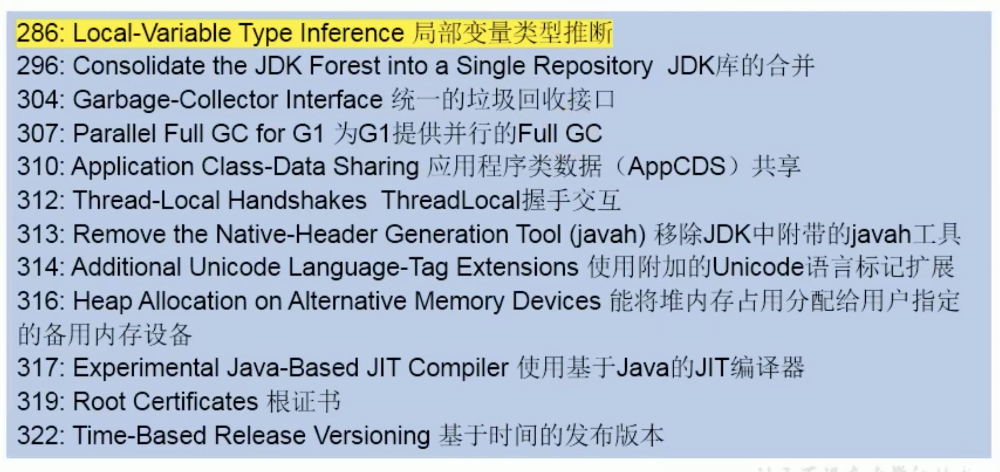

2018年3月21日，Oracle官方宣布Java10正式发布。

需要注意的是Java 9和Java 10都不是LTS（Long-Term-Support）版本。和过去的Java大版本升级不同，这两个只有半年左右的开发和维护期。而未来的Java11也是18.9 LTS，才是Java8之后第一个LTS版本。

Java10一共定义了109个新特性，其中包含12个JEP（对于程序员来说，真正的新特性其实就一个），还有一些新API和JVM规范以及JAVA语言规范上的改动。



# 1 局部变量类型推断
产生背景：开发者经常抱怨Java中引用代码的程度。局部变量的现实类型声明，常常被认为是不必须的，给一个好听的名字经常可以很清楚的表达出下面应该怎样继续。

优点：减少了啰嗦和形式的代码，避免了信息冗余，而且对齐了变量名，更容易阅读

场景一：类实例化时

作为Java开发者，在声明一个变量时，我们总是习惯了敲打两次变量类型，第一次用于声明变量类型，第二次用于构造器

```java
ArrayList<String> list = new ArrayList<>();
```

场景二：返回值类型含复杂泛型结构

变量的声明类型书写复杂且较长，尤其是加上泛型的使用

```java
 Iterator<Map<Integer, String>> iterator = set.iterator();
```

场景三：我们也经常声明一种变量，它只会被使用一次，而且是用在下一行代码中，比如：

```java
URL url = new URL("www.baidu.com");
URLConnection urlConnection = url.openConnection();
Reader reader = new BufferedReader(new InputStreamReader(urlConnection.getInputStream()));
```

尽管IDEA可以帮我们自动完成这些代码，但当变量总是跳来跳去的时候，可读性还是会受到影响，因为变量类型的名称由各种不同长度的字符组成。而且，有时候开发人员会尽力避免声明中间变量，因为太多的类型声明只会分散注意力，不会带来额外的好处。

可以用类型推断的情况

```java
package com.bean;

import java.util.ArrayList;
import java.util.function.Consumer;
import java.util.function.Supplier;

public class Test6 {

    public static void main(String[] args) {
        //1.声明变量时候，根据所附的值，推断变量的类型
        var num =10;

        var list = new ArrayList<Integer>();
        list.add(123);

        //2.遍历操作
        for (var i : list) {
            System.out.println(i);
            System.out.println(i.getClass());
        }

        //3.普通的遍历操作
        for (var i = 0; i < 100; i++) {
            System.out.println(i);
        }
    }
}

```

不可用类型推断的情况

```java
package com.bean;

import java.util.ArrayList;
import java.util.function.Consumer;
import java.util.function.Supplier;

public class Test6 {

    //以下代码不能用类型推断
    public void test(){
        //1.局部变量不赋值，就不能实现类型推断
        //var num;

        //2.lambda表达式中，左边的函数式接口不能声明为var
        Supplier<Double> supplier=()->Math.random();
        //var sup=()->Math.random();

        //3.方法引用中，左边的函数式接口不能声明为var
        Consumer<String> consumer=System.out::println;
        //var con=System.out::println;

        //4.数组的静态初始化中，注意如下的情况也不可以
        int [] arr={1,2,3};
        //var arr1= {1,2,3};
    }

    //1.方法的返回值类型
	//    public var test1(){
	//        return 0;
	//    }

    //2.方法的参数类型
   	// public void method(var num){}

    //3构造器的参数类型
    //public Test6(var i){}

    //4.成员变量
    //var num=10;

    //5.catch块
    //	public void test3(){
	//   	try{
	//   	}catch (var e){
	//   	}
    //	}
}

```

工作原理：在处理var时候，编译器先是查看表达式右边部分，并根据右边变量值的类型进行推断，作为左边变量的类型，然后将该类型写入字节码当中。

注意：

+ var不是一个关键字：你不需要担心变量名或者方法名会与var发生冲突，因为var实际上并不是一个关键字，而是一个类型名，只有在编译器需要知道类型的地方才需要用到它，除此之外，它就是一个普通合法的标识符，也就是说，除了不能用它当作类名，其他的都可以，但是极少人会用它作为类名
+ 这不是JavaScript：首先要说明的是，var并不会改变Java是一门静态类型语言的事实，编译器负责推断出类型，并把结果写入字节码文件，就好像是开发人员自己敲入类型一样，下面使用IDEA反编译器编译出来的代码

源码

```java
package com.bean;

import java.io.BufferedReader;
import java.io.IOException;
import java.io.InputStreamReader;
import java.net.URL;


public class Test7 {
    public static void main(String[] args) throws IOException {
        var url = new URL("http://www.baidu.com");
        var urlConnection = url.openConnection();
        var reader = new BufferedReader(new InputStreamReader(urlConnection.getInputStream()));
    }
}

```

字节码反编译出来的代码

```java
//
// Source code recreated from a .class file by IntelliJ IDEA
// (powered by FernFlower decompiler)
//

package com.bean;

import java.io.BufferedReader;
import java.io.IOException;
import java.io.InputStreamReader;
import java.net.URL;
import java.net.URLConnection;

public class Test7 {
    public Test7() {
    }

    public static void main(String[] args) throws IOException {
        URL url = new URL("http://www.baidu.com");
        URLConnection urlConnection = url.openConnection();
        new BufferedReader(new InputStreamReader(urlConnection.getInputStream()));
    }
}

```

# 2 集合新增copyof方法
自Java9开始，JDK里面为集合（List/Set/Map）都添加了of（jdk9新增）和copyOf（jdk10新增）方法，他们都用来创建不可变的集合，来看他们的使用和区别

```java
package com.bean;

import java.util.ArrayList;
import java.util.List;

public class Test8 {
    public static void main(String[] args) {
        var list = List.of("java", "php", "c++");
        var copy = List.copyOf(list);
        System.out.println(list==copy);//true

        var list2 = new ArrayList<String>();
        var copy2 = List.copyOf(list2);
        System.out.println(list2==copy2);//false
    }
}
```

第一个是true的原因是因为原来的list就是一个不可变的，所以两个是公用一个；第二个是false的原因，是因为`new ArrayList<String>()`是一个可变，而copyOf之后是一个不可变的，所以会创建一个新的不可变集合，所以两个不是一样的。

