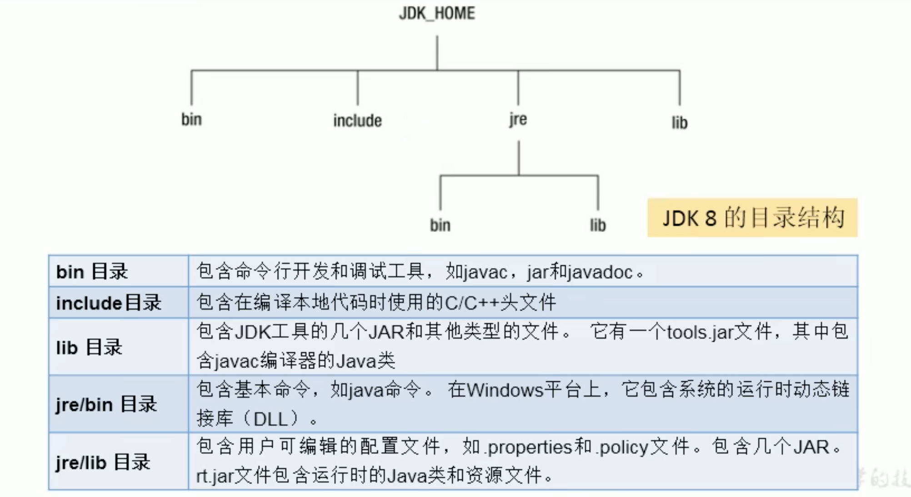
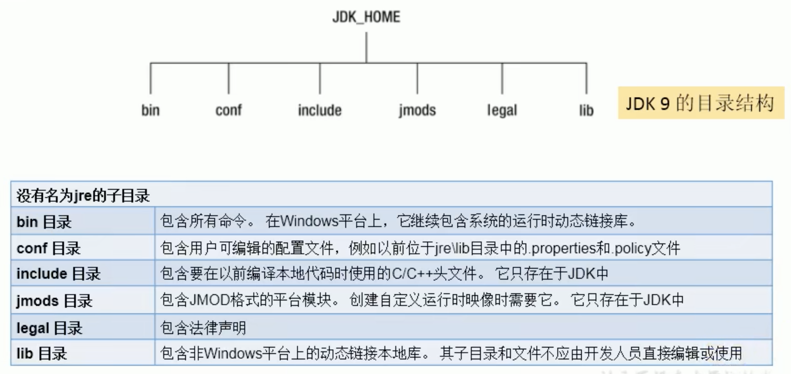
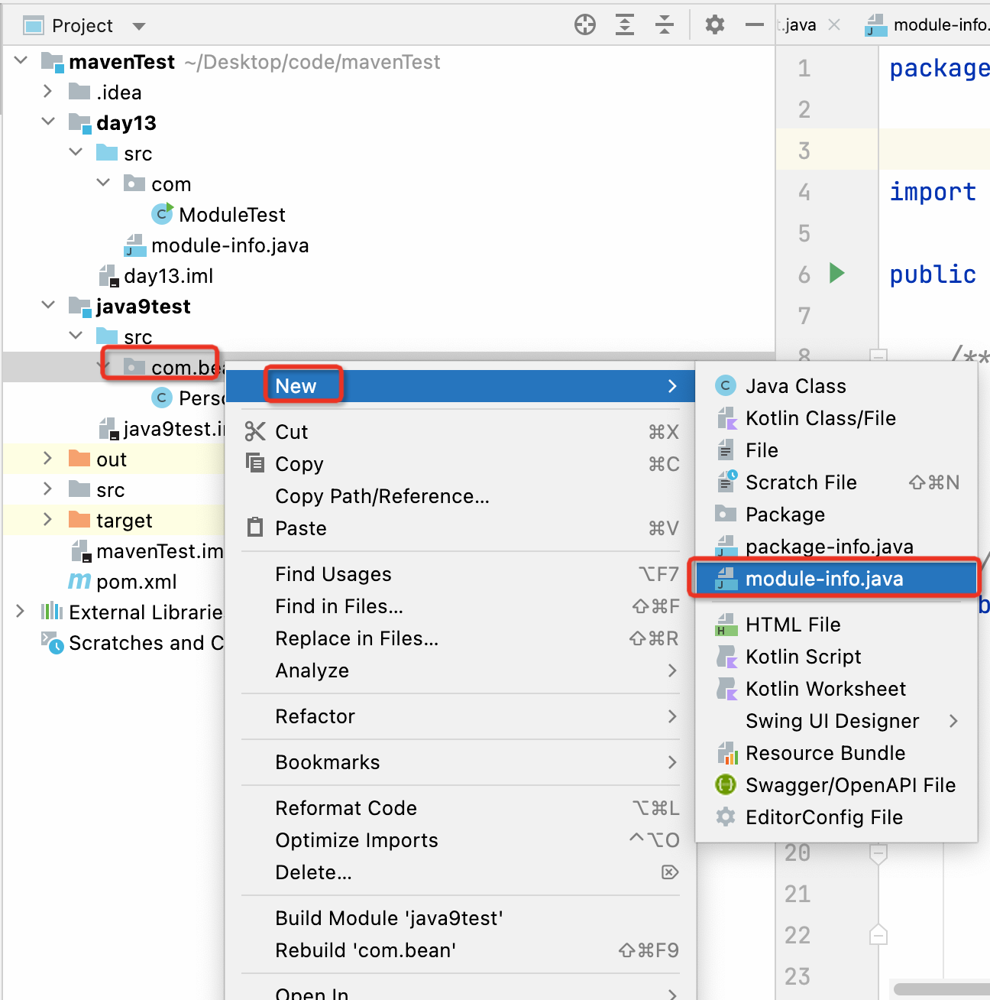
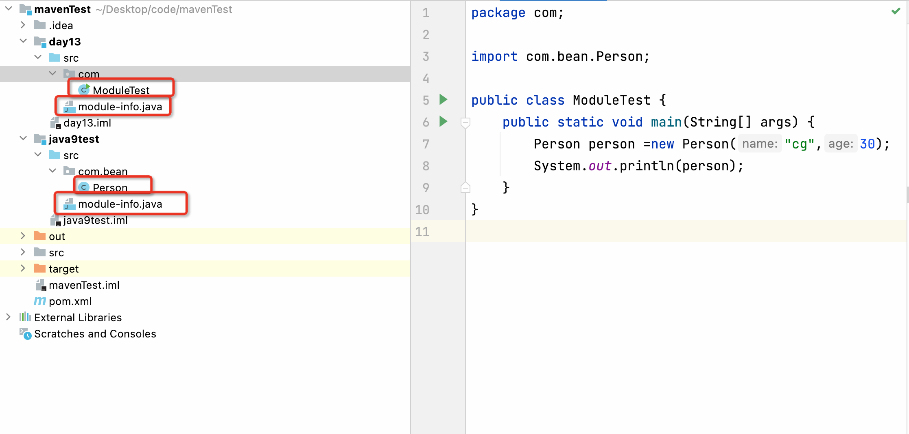
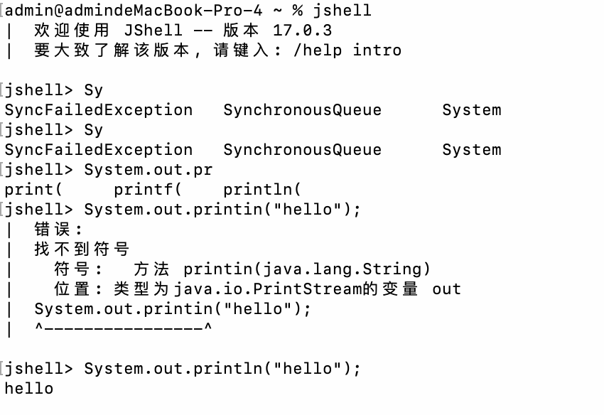
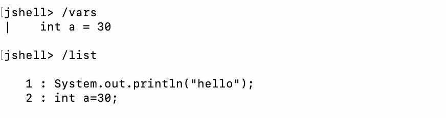
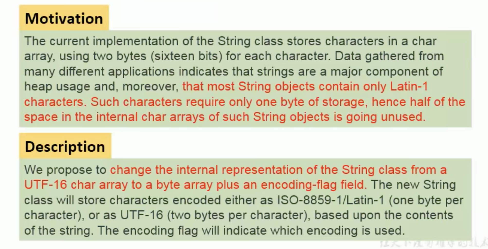
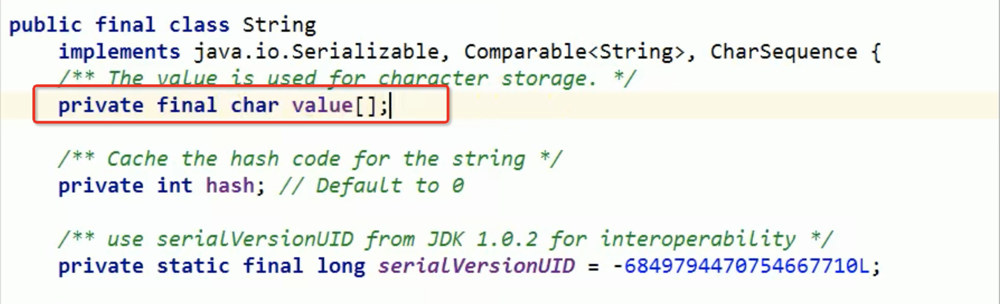
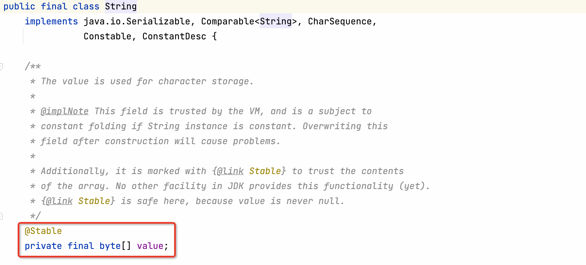
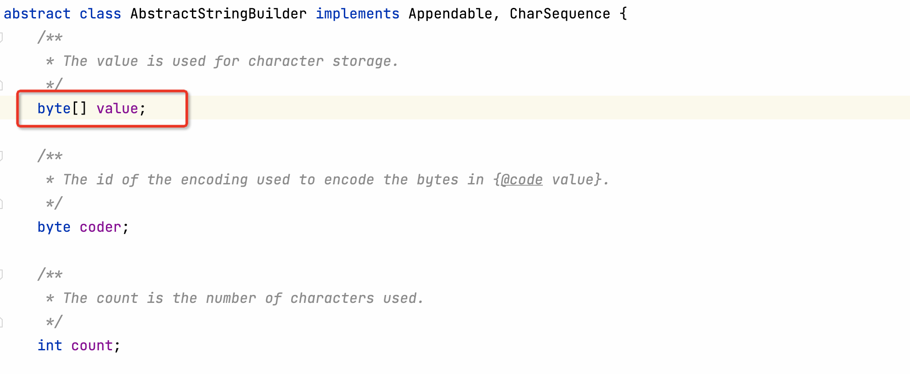

# 1 目录结构变化

JDK8的目录结构

```java
JDK_HOME
		bin
		inclue
		jre
				bin
				legal
				lib
		lib
		legal
		man
```



JDK9以后的目录结构（包括11等等）



# 2 模块化系统
谈到Java9大家往往第一个想到的就是Jigsaw项目。众所周知，Java发展超过20年（95年最初发布），Java和相关生态在不断丰富的同时也越来暴露出一些问题：

+ Java运行环境的膨胀和臃肿。每次JVM启动的时候，至少会有30～60MB的内存加载，主要原因是JVM需要加载`rt.jar`，不管其中的类是否被classloader加载，第一步整个jar都会被JVM加载到内存当中去（而模块化可以根据模块的需要，去加载程序的class）
+ 当代码库越来越大，创建复杂，盘根错节的“意大利面条式代码”的几率呈指数级的增长。不同版本的类库交叉依赖导致让人头疼的问题，这些都阻碍了Java开发和运行效率的提升。
+ 很难真正的对代码进行封装，而系统并没有对不同部分（也就是JAR文件）之间的依赖关系有个明确的概念。每一个公共类都可以被类路径之下任何其他的公共类访问到，这样就会导致无意中使用了并不想被公开访问的API。

本质上讲，模块（module）的概念，其实就是package外再裹一层，也就是说，用模块来管理各个package，通过生命某个package暴露，不声明默认就是隐蔽，因此模块化使得代码组织上更安全，因为它可以指定哪些部分可以暴露，哪些部分隐蔽。

实现目标：

+ 模块化的主要目的在于减少内存的开销
+ 只需必要模块，而非全部jdk模块，可简化各种类库和大型应用的开发和维护
+ 改进JavaSE平台，使其可以适应不同大小的计算设备
+ 改进其安全性、可维护性、提高性能

代码示例：





1）在day13模块中，创建ModuleTest和module-info类

```java
package com;

import com.bean.Person;

public class ModuleTest {
    public static void main(String[] args) {
        Person person =new Person("cg",30);
        System.out.println(person);
    }
}
```

module-info类

```java
module day13 {    
  requires java9test;
}
```


2）在java9test模块中，创建Person和module-info类

```java
package com.bean;


public class Person {
    private String name;
    private int age;

    public Person() {
    }

    public Person(String name, int age) {
        this.name = name;
        this.age = age;
    }

    public String getName() {
        return name;
    }

    public void setName(String name) {
        this.name = name;
    }

    public int getAge() {
        return age;
    }

    public void setAge(int age) {
        this.age = age;
    }

    @Override
    public String toString() {
        return "Person{" +
                "name='" + name + '\'' +
                ", age=" + age +
                '}';
    }
}
```

```java
module java9test {
    exports com.bean;
}
```

这样就可以跨模块使用Person类类，在day13模块中使用java9test模块中的类。

模块将由通常的类和新的模块声明类（`module-info.java`）组成，该文件位于java代码结构的顶层，该模块描述符明确的定义了我们的模块需要什么依赖关系，以及哪些模块被外部使用，在exports子句中未提及的所有包默认情况下将封装在模块中，不能再外部使用。

# 3 Java的REPL工具：jShell命令
产生背景：像Python和Scala之类的语音早就有了交互式编程环境REPL（`read-evaluate-print-loop`）了，以交互式方式对语句和表达式进行求值，开发者只需要输入一些代码，就可以在编译前获得对程序的反馈，而之前的Java版本要想执行代码，必须创建文件，声明类，提供测试方法方可实现。

设计理念：即写即得，快速运行

实现目标：

+ Java9中终于有了REPL工具：jShell，让Java可以像脚本语言一样运行，从控制台启动jShell，利用jShell在没有创建类的情况下直接声明变量，计算表达式，执行语句。即开发时可在直接在命令行里运行Java代码，而无需创建Java文件，无需跟人解释`public static void main(String[] args)`这句废话。
+ jSehll也可以从文件中加载或者将语句保存到文件中。
+ jShell也可以是tab键进行自动补全和自动添加分号。 



jShell常用命令：

```java
/help    					//帮组
/list	 					//查看次session有效的代码片段
/vars	 					// 查看次session所有创建过的变量
/methods 					//查看当前session创建过的所有的方法
/edit	 					//使用外部编辑器来编写代码
/open D:/test.java			//执行一个在D盘目录下的test.java的文件
/exit						//退出
```



# 4 接口的私有方法
Java 8中规定接口中的方法除来抽象方法之外，还可以定义静态方法和默认方法，访问权限都是public，且静态方法只能够让接口来调用，不能让实现类调用，默认方法虽然被default修饰，但是访问权限修饰符依然是public。这在一定程度上，扩展了接口的功能，此时的接口更像一个抽象类。

在Java9中，接口更加的灵活和强大，连方法的访问权限修饰符都可以声明未private的了，此时被private修饰的方法只能在接口中被调用，不会成为对外暴露的API的一部分。

代码如下：

```java
package com.bean;

public interface MyInterface {

    //访问权限修饰符为private
    private void test(){
        System.out.println("test");
    }
    //访问权限修饰符为public，只能被接口调用
    static void test1(){
        
    }
    //访问权限修饰符为public，可在实现类中重写
    abstract void test2();

    //访问权限修饰符为public，可在实现类中重写
    default  void  test3(){
        
    }
}
```

# 5 钻石操作符的升级使用
```java
package com.bean;

import java.util.ArrayList;

public class Test2 {
    public static void main(String[] args) {

        //在Java 8中，后面这个泛型是不可以省略的，否则会报语法错错误，相当于钻石操作符号<>与匿名内部类在Java8中不能共存
        //在Java 9中是可以的，不会报错
        Comparable<Object> comparable=new Comparable<>() {
            @Override
            public int compareTo(Object o) {
                return 0;
            }
        };

        //Java7新特性，类型推断，所以后面的可以省略
        ArrayList<String> strings = new ArrayList<>();
    }
}

```

# 6 try操作升级
Java 8 之前的处理资源关闭的方式

```java
public void test(){
    InputStreamReader reader=null;
    try {
        reader = new InputStreamReader(System.in);
    }catch (Exception e){

    }finally {
        if(reader!=null){
            try {
                reader.close();
            } catch (IOException e) {
                e.printStackTrace();
            }
        }
    }
}
```

Java8 处理资源关闭的方式

```java
public  void test1(){
    //要求需要自动关闭的资源的初始化必须放在try的一对小括号中
    try(InputStreamReader reader = new InputStreamReader(System.in)) {
        char[] chars = new char[20];
        int len;
        if((len =reader.read(chars))!=-1){
            String s = new String(chars, 0, len);
            System.out.println(s);

        }
    }catch (Exception e){
    }
}
```

//Java9 处理资源关闭的方式

```java
public  void test2(){
    //需要自动关闭的资源的初始化是可以在try的一对小括号外的
    //此时的资源变量是一个常量，声明为final的，不可以修改
    //多个流之间用；隔开
    OutputStreamWriter writer = new OutputStreamWriter(System.out);
    InputStreamReader reader = new InputStreamReader(System.in);
    try(reader;writer) {
        char[] chars = new char[20];
        int len;
        if((len =reader.read(chars))!=-1){
            String s = new String(chars, 0, len);
            System.out.println(s);

        }
    }catch (Exception e){
    }
}
```

# 7 String存储结构变更


简而言之，就是String存储由原来的char数组，变成了byte数组。

看源码：

Java8里面的



Java9里面的



结论：String再也不用char[]来存储了，改成了byte[]加上编码标记。节约了一些空间

那么StringBuffer和StringBuilder是否改变呢？


也是一样跟着改变，看源码：

在他们的父类里面



# 8 快读创建只读集合
在Java8中得到一个只读集合

```java
public static void main(String[] args) {

    //Java 8里面创建只读集合的操作，还可以创建set，map等
    List<String> list = new ArrayList<>();
    list.add("aa");
    list.add("bb");
    list.add("cc");
    //返回的list是一个只读的集合
    list= Collections.unmodifiableList(list);
    list.add("dd");
    System.out.println(list);

    //得到一个只读list
    List<Integer> lists = Arrays.asList(1, 2, 3);

    //得到一个只读的set
    Set<Integer> sets = Collections.unmodifiableSet(new HashSet<>(Arrays.asList(1, 2, 3, 4)));

    //得到一个只读的map
    Map<String, Integer> map = Collections.unmodifiableMap(new HashMap<>() {
        {
            put("a",1);
            put("b",2);
            put("c",3);
        }
    });

}
```

在Java9中得到一个只读集合

```java
//Java 9中快速得到一个可读的集合
public void test(){
    //得到一个只读list
    List<Integer> list = List.of(1, 2, 3);
    //得到一个只读的set
    Set<Integer> set = Set.of(1, 2, 3);

    //得到一个只读的map
    Map<String, Integer> map = Map.of("lilei", 18, "hanmeimei", 18);
    //得到一个只读的map
    Map<String, Integer> map1 = Map.ofEntries(Map.entry("zhangsan", 11), Map.entry("lisi", 12));

}
```

# 9 InputStream加强
InputStream终于有了一个非常有用的方法：`transferTo`，可以直接将数据传输到OutputStream，这是在处理原始数据流时非常常见的一种用法。

如下

```java
package com.bean;

import java.io.FileOutputStream;
import java.io.InputStream;
import java.io.OutputStream;

public class Test4 {
    public static void main(String[] args) {
        ClassLoader classLoader = Test4.class.getClassLoader();
        try(InputStream is = classLoader.getResourceAsStream("hello.txt");
            FileOutputStream fileOutputStream= new FileOutputStream("hello1.txt")){
            is.transferTo(fileOutputStream);
        }catch (Exception e){
            System.out.println(e);
        }
    }
}

```

# 10 增强的Stream API
Java的Stream API时Java标准库最好的改进之一，让开发者能够快速运算，从而能够有效的利用数据并进行运算。Java8提供的Stream能够利用多核架构实现声明式的数据处理。

在Java9中，Stream API变得更好，Stream接口中添加了4个新的方法：`takeWhile` `dropWhile` `ofNullable` ，还有个iterate方法的重载方法，可以让你提供一个Predicate（判断条件）来指定什么时候迭代结束。

除了对Stream本身的扩展，Optinal和Stream之间的结合也得到了改进，现在可以通过Optinal的新方法Stream()将一个Optinal对象转换为一个（可能是空的）Stream对象。

```java
package com.bean;

import java.util.ArrayList;
import java.util.Arrays;
import java.util.List;
import java.util.stream.Stream;

public class Test5 {
    public static void main(String[] args) {
        List<Integer> list = Arrays.asList(23, 24, 25, 60, 5, 7, 8);
        //takeWhile 返回从开头开始的按照指定规则尽量多的元素
        list.stream().takeWhile(x-> x<60).forEach(System.out::println);
        //23 24 25

        //dropWhile：与takeWhile相反，返回剩余的元素
        list.stream().dropWhile(x-> x<60).forEach(System.out::println);
        //60 5 7 8

        // of()参数中的多个元素，可以包含null值，可以包含多个null值
        Stream<Integer> integerStream = Stream.of(1, 2, 3, null,null);
        integerStream.forEach(System.out::println);

        // of()参数不能储存单个null值，否则报异常，下面的就会异常
        // Stream<Object> objectStream = Stream.of(null);
        // objectStream.forEach(System.out::println);

        Stream<Object> objectStream1 = Stream.ofNullable(null);
        objectStream1.forEach(System.out::println);

        //Java 8 中里面的方法
        Stream.iterate(0,x -> x+1).limit(10).forEach(System.out::println);

        //Java9中的重载方法，中间加了断言的参数
        Stream.iterate(0 ,x -> x<5, x -> x+1).forEach(System.out::println);
    }
}

```

Optional类提供了stream()方法，将一个Optinal对象转换为一个Stream对象。

```java
public static void main(String[] args) {
    ArrayList<String> lists = new ArrayList<>();
    lists.add("aa");
    lists.add("bb");
    lists.add("cc");

    Optional<ArrayList<String>> optional = Optional.ofNullable(lists);
    Stream<ArrayList<String>> stream = optional.stream();
    long count = optional.stream().count(); 
    System.out.println(count);//为1
    stream.flatMap(x->x.stream()).forEach(System.out::println);
}
```

