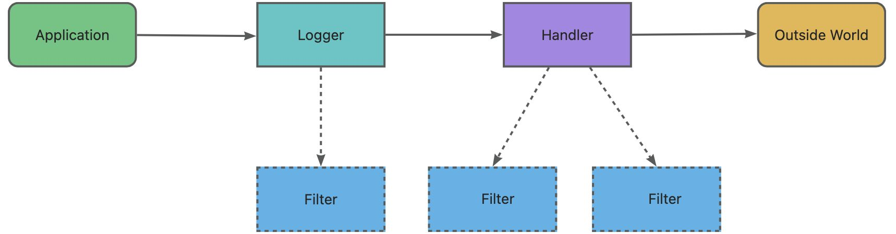
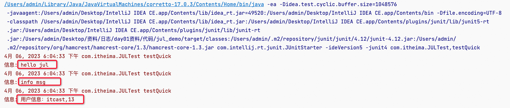
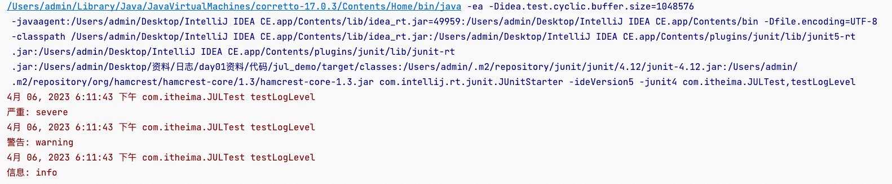
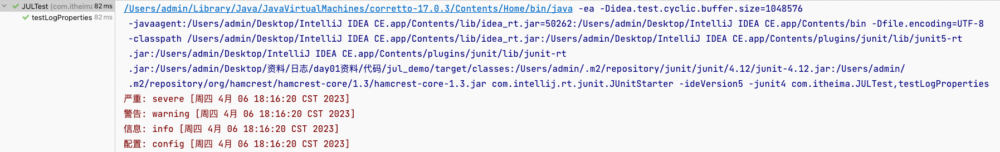
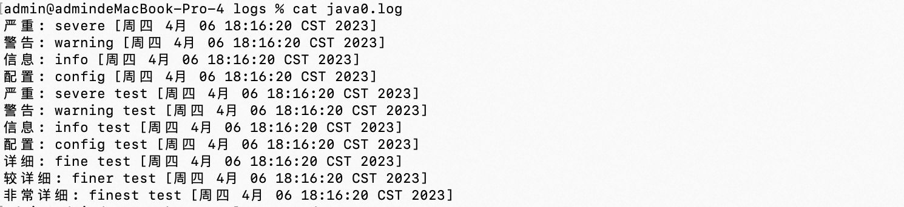
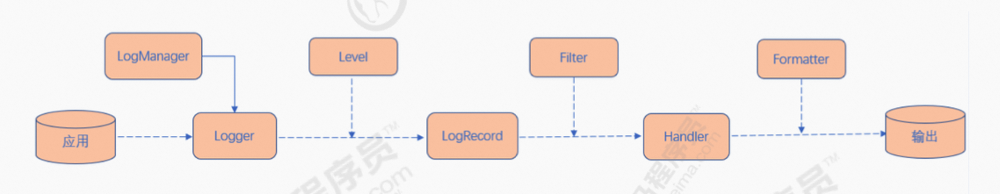

**笔记来源：**[**黑马程序员java日志框架教程，全面深入学习多种java日志框架**](https://www.bilibili.com/video/BV1iJ411H74S/?p=10&spm_id_from=pageDriver&vd_source=e8046ccbdc793e09a75eb61fe8e84a30)

****

**前言：学习目标** 

1. 日志的作用和目的 
2. 日志的框架 
3. JUL的使用 
4. LOG4J的使用 
5. JCL的使用 

# 1 日志的概念
## 1.1 日志文件 
日志文件是用于记录系统操作事件的文件集合，可分为事件日志和消息日志。具有处理历史数据、诊断问题的追踪以及理解系统的活动等重要作用。

在计算机中，日志文件是记录在操作系统或其他软件运行中发生的事件或在通信软件的不同用户之间的消息的文件。记录是保持日志的行为。在最简单的情况下，消息被写入单个日志文件。

许多操作系统，软件框架和程序包括日志系统。广泛使用的日志记录标准是在因特网工程任务组（IETF）RFC5424中定义的syslog。 syslog标准使专用的标准化子系统能够生成，过滤，记录和分析日 志消息。

### 1.1.1 调试日志
软件开发中，我们经常需要去调试程序，做一些信息，状态的输出便于我们查询程序的运行状况。为了让我们能够更加灵活和方便的控制这些调试的信息，所有我们需要专业的日志技术。java中寻找bug会 需要重现。调试也就是debug 可以在程序运行中暂停程序运行，可以查看程序在运行中的情况。日志主要是为了更方便的去重现问题。

### 1.1.2 系统日志
系统日志是记录系统中硬件、软件和系统问题的信息，同时还可以监视系统中发生的事件。用户可以通过它来检查错误发生的原因，或者寻找受到攻击时攻击者留下的痕迹。系统日志包括系统日志、应用程序日志和安全日志。

系统日志的价值  
系统日志策略可以在故障刚刚发生时就向你发送警告信息，系统日志帮助你在最短的时间内发现问题。

系统日志是一种非常关键的组件，因为系统日志可以让你充分了解自己的环境。这种系统日志信息对于决定故障的根本原因或者缩小系统攻击范围来说是非常关键的，因为系统日志可以让你了解故障或者袭击发生之前的所有事件。为虚拟化环境制定一套良好的系统日志策略也是至关重要的，因为系统日志需要和许多不同的外部组件进行关联。良好的系统日志可以防止你从错误的角度分析问题，避免浪费宝贵的排错时间。另外一种原因是借助于系统日志，管理员很有可能会发现一些之前从未意识到的问题，在几乎所有刚刚部署系统日志的环境当中。 

# 2 JAVA日志框架 
问题: 

1. 控制日志输出的内容和格式 
2. 控制日志输出的位置 
3. 日志优化：异步日志，日志文件的归档和压
4. 日志系统的维护 
5. 面向接口开发 -- 日志的门面

## 2.1 为什么要用日志框架
因为软件系统发展到今天已经很复杂了，特别是服务器端软件，涉及到的知识，内容，问题太多。在某 些方面使用别人成熟的框架，就相当于让别人帮你完成一些基础工作，你只需要集中精力完成系统的业 务逻辑设计。而且框架一般是成熟，稳健的，他可以处理系统很多细节问题，比如，事务处理，安全 性，数据流控制等问题。还有框架一般都经过很多人使用，所以结构很好，所以扩展性也很好，而且它 是不断升级的，你可以直接享受别人升级代码带来的好处。  


## 2.2 现有的日志框架
日志门面

+ JCL（Jakarta Commons Logging）
+ slf4j（Simple Logging Facade for Java）

日志实现 

+ JUL（Java util logging）
+ logback
+ log4j
+ log4j2 

# 3 JUL 
JUL全称Java util Logging是java原生的日志框架，使用时不需要另外引用第三方类库，相对其他日志框架使用方便，学习简单，能够在小型应用中灵活使用。 

## 3.1 JUL入门
### 3.1.1 架构介绍 


Loggers：被称为记录器，应用程序通过获取Logger对象，调用其API来来发布日志信息。Logger 通常时应用程序访问日志系统的入口程序。 

Appenders：也被称为Handlers，每个Logger都会关联一组Handlers，Logger会将日志交给关联 Handlers处理，由Handlers负责将日志做记录。Handlers在此是一个抽象，其具体的实现决定了 日志记录的位置可以是控制台、文件、网络上的其他日志服务或操作系统日志等。 

Layouts：也被称为Formatters，它负责对日志事件中的数据进行转换和格式化。Layouts决定了 数据在一条日志记录中的最终形式。 

Level：每条日志消息都有一个关联的日志级别。该级别粗略指导了日志消息的重要性和紧迫，可以将Level和Loggers，Appenders做关联以便于我们过滤消息。 

Filters：过滤器，根据需要定制哪些信息会被记录，哪些信息会被放过。

总结一下就是：用户使用Logger来进行日志记录，Logger持有若干个Handler，日志的输出操作是由Handler完成的。 在Handler在输出日志前，会经过Filter的过滤，判断哪些日志级别过滤放行哪些拦截，Handler会将日 志内容输出到指定位置(日志文件、控制台等)。Handler在输出日志时会使用Layout，将输出内容进行排版。

### 3.1.2 入门案例
```java
public class JULTest {
	@Test  
	public void testQuick() throws Exception {
		// 1.创建日志记录器对象
		Logger logger = Logger.getLogger("com.itheima.log.JULTest"); 
        // 2.日志记录输出
		logger.info("hello jul");
        logger.log(Level.INFO, "info msg");
		String name = "jack";
		Integer age = 18;
		logger.log(Level.INFO, "用户信息:{0},{1}", new Object[]{name, age});
	} 
}
```

输出



## 3.2 日志的级别 
JUL中定义的日志级别

+ **java.util.logging.Level** 中定义了日志的级别: 
    - SEVERE(最高值) 
    - WARNING
    - INFO (默认级别) 
    - CONFIG
    - FINE
    - FINER
    - FINEST(最低值) 
+ 还有两个特殊的级别: 
    - OFF，可用来关闭日志记录。 
    - ALL，启用所有消息的日志记录。  

```java
/*
 * Copyright (c) 2000, 2021, Oracle and/or its affiliates. All rights reserved.
 * DO NOT ALTER OR REMOVE COPYRIGHT NOTICES OR THIS FILE HEADER.
 *
 * This code is free software; you can redistribute it and/or modify it
 * under the terms of the GNU General Public License version 2 only, as
 * published by the Free Software Foundation.  Oracle designates this
 * particular file as subject to the "Classpath" exception as provided
 * by Oracle in the LICENSE file that accompanied this code.
 *
 * This code is distributed in the hope that it will be useful, but WITHOUT
 * ANY WARRANTY; without even the implied warranty of MERCHANTABILITY or
 * FITNESS FOR A PARTICULAR PURPOSE.  See the GNU General Public License
 * version 2 for more details (a copy is included in the LICENSE file that
 * accompanied this code).
 *
 * You should have received a copy of the GNU General Public License version
 * 2 along with this work; if not, write to the Free Software Foundation,
 * Inc., 51 Franklin St, Fifth Floor, Boston, MA 02110-1301 USA.
 *
 * Please contact Oracle, 500 Oracle Parkway, Redwood Shores, CA 94065 USA
 * or visit www.oracle.com if you need additional information or have any
 * questions.
 */

package java.util.logging;

import java.io.Serial;
import java.lang.ref.Reference;
import java.lang.ref.ReferenceQueue;
import java.lang.ref.WeakReference;
import java.security.AccessController;
import java.security.PrivilegedAction;
import java.util.ArrayList;
import java.util.Collections;
import java.util.HashMap;
import java.util.List;
import java.util.Locale;
import java.util.Map;
import java.util.Optional;
import java.util.ResourceBundle;
import java.util.function.Function;
import jdk.internal.loader.ClassLoaderValue;
import jdk.internal.access.JavaUtilResourceBundleAccess;
import jdk.internal.access.SharedSecrets;

/**
 * The Level class defines a set of standard logging levels that
 * can be used to control logging output.  The logging Level objects
 * are ordered and are specified by ordered integers.  Enabling logging
 * at a given level also enables logging at all higher levels.
 * <p>
 * Clients should normally use the predefined Level constants such
 * as Level.SEVERE.
 * <p>
 * The levels in descending order are:
 * <ul>
 * <li>SEVERE (highest value)
 * <li>WARNING
 * <li>INFO
 * <li>CONFIG
 * <li>FINE
 * <li>FINER
 * <li>FINEST  (lowest value)
 * </ul>
 * In addition there is a level OFF that can be used to turn
 * off logging, and a level ALL that can be used to enable
 * logging of all messages.
 * <p>
 * It is possible for third parties to define additional logging
 * levels by subclassing Level.  In such cases subclasses should
 * take care to chose unique integer level values and to ensure that
 * they maintain the Object uniqueness property across serialization
 * by defining a suitable readResolve method.
 *
 * @since 1.4
 */

public class Level implements java.io.Serializable {
    private static final String defaultBundle =
        "sun.util.logging.resources.logging";

    // Calling SharedSecrets.getJavaUtilResourceBundleAccess()
    // forces the initialization of ResourceBundle.class, which
    // can be too early if the VM has not finished booting yet.
    private static final class RbAccess {
        static final JavaUtilResourceBundleAccess RB_ACCESS =
            SharedSecrets.getJavaUtilResourceBundleAccess();
    }


    /**
     * OFF is a special level that can be used to turn off logging.
     * This level is initialized to <CODE>Integer.MAX_VALUE</CODE>.
     */
    public static final Level OFF = new Level("OFF",Integer.MAX_VALUE, defaultBundle);

    /**
     * SEVERE is a message level indicating a serious failure.
     * <p>
     * In general SEVERE messages should describe events that are
     * of considerable importance and which will prevent normal
     * program execution.   They should be reasonably intelligible
     * to end users and to system administrators.
     * This level is initialized to <CODE>1000</CODE>.
     */
    public static final Level SEVERE = new Level("SEVERE",1000, defaultBundle);

    /**
     * WARNING is a message level indicating a potential problem.
     * <p>
     * In general WARNING messages should describe events that will
     * be of interest to end users or system managers, or which
     * indicate potential problems.
     * This level is initialized to <CODE>900</CODE>.
     */
    public static final Level WARNING = new Level("WARNING", 900, defaultBundle);

    /**
     * INFO is a message level for informational messages.
     * <p>
     * Typically INFO messages will be written to the console
     * or its equivalent.  So the INFO level should only be
     * used for reasonably significant messages that will
     * make sense to end users and system administrators.
     * This level is initialized to <CODE>800</CODE>.
     */
    public static final Level INFO = new Level("INFO", 800, defaultBundle);

    /**
     * CONFIG is a message level for static configuration messages.
     * <p>
     * CONFIG messages are intended to provide a variety of static
     * configuration information, to assist in debugging problems
     * that may be associated with particular configurations.
     * For example, CONFIG message might include the CPU type,
     * the graphics depth, the GUI look-and-feel, etc.
     * This level is initialized to <CODE>700</CODE>.
     */
    public static final Level CONFIG = new Level("CONFIG", 700, defaultBundle);

    /**
     * FINE is a message level providing tracing information.
     * <p>
     * All of FINE, FINER, and FINEST are intended for relatively
     * detailed tracing.  The exact meaning of the three levels will
     * vary between subsystems, but in general, FINEST should be used
     * for the most voluminous detailed output, FINER for somewhat
     * less detailed output, and FINE for the  lowest volume (and
     * most important) messages.
     * <p>
     * In general the FINE level should be used for information
     * that will be broadly interesting to developers who do not have
     * a specialized interest in the specific subsystem.
     * <p>
     * FINE messages might include things like minor (recoverable)
     * failures.  Issues indicating potential performance problems
     * are also worth logging as FINE.
     * This level is initialized to <CODE>500</CODE>.
     */
    public static final Level FINE = new Level("FINE", 500, defaultBundle);

    /**
     * FINER indicates a fairly detailed tracing message.
     * By default logging calls for entering, returning, or throwing
     * an exception are traced at this level.
     * This level is initialized to <CODE>400</CODE>.
     */
    public static final Level FINER = new Level("FINER", 400, defaultBundle);

    /**
     * FINEST indicates a highly detailed tracing message.
     * This level is initialized to <CODE>300</CODE>.
     */
    public static final Level FINEST = new Level("FINEST", 300, defaultBundle);

    /**
     * ALL indicates that all messages should be logged.
     * This level is initialized to <CODE>Integer.MIN_VALUE</CODE>.
     */
    public static final Level ALL = new Level("ALL", Integer.MIN_VALUE, defaultBundle);

    private static final Level[] standardLevels = {
        OFF, SEVERE, WARNING, INFO, CONFIG, FINE, FINER, FINEST, ALL
    };
	...
}

```

虽然我们测试了7个日志级别但是默认只实现info以上的级别

```java
@Test  
public void testLogLevel() throws Exception { 
	// 1.获取日志对象
	Logger logger = Logger.getLogger("com.itheima.log.QuickTest"); 

	// 2.日志记录输出
	logger.severe("severe");
	logger.warning("warning");
	logger.info("info");// 默认日志输出级别
	
// 比info高的级别进行控制台输出，比info低的这些级别将进行过滤
	logger.config("cofnig");
	logger.fine("fine");
	logger.finer("finer");
	logger.finest("finest");
}
```

输出

  
自定义日志级别配置

```java
   // 自定义日志级别
    @Test
    public void testLogConfig()throws Exception{
        // 1.获取日志记录器对象
        Logger logger = Logger.getLogger("com.itheima.JULTest");

		// 一、自定义日志级别
        // a.关闭系统默认配置
        logger.setUseParentHandlers(false);

        // 创建ConsolHhandler 控制台输出
        ConsoleHandler consoleHandler = new ConsoleHandler();

        // 创建简单格式转换对象
        SimpleFormatter simpleFormatter = new SimpleFormatter();

        // 进行关联
        consoleHandler.setFormatter(simpleFormatter);
        logger.addHandler(consoleHandler);


        // 配置日志具体级别
        logger.setLevel(Level.ALL);
        consoleHandler.setLevel(Level.ALL);


        // 场景FileHandler  文件输出
        FileHandler fileHandler = new FileHandler("/logs/jul.log");

        // 进行关联
        fileHandler.setFormatter(simpleFormatter);
        logger.addHandler(fileHandler);

        // 2.日志记录输出
        logger.severe("severe");
        logger.warning("warning");
        logger.info("info"); // 默认日志输出级别
        logger.config("config");
        logger.fine("fine");
        logger.finer("finer");
        logger.finest("finest");
	}
```

## 3.3 Logger之间的父子关系
JUL中Logger之间存在父子关系，这种父子关系通过树状结构存储，JUL在初始化时会创建一个顶层 RootLogger作为所有Logger父Logger，存储上作为树状结构的根节点。并父子关系通过路径来关联。

```java
    // Logger对象父子关系
    @Test
    public void testLogParent()throws Exception{

        Logger logger1 = Logger.getLogger("com.itheima");
        Logger logger2 = Logger.getLogger("com");

        // 测试
        System.out.println(logger1.getParent() == logger2);
        // 所有日志记录器的顶级父元素 LogManager$RootLogger，name ""
        System.out.println("logger2 Parent:"+logger2.getParent() + ",name:" + logger2.getParent().getName());

        // 关闭默认配置
        logger2.setUseParentHandlers(false);

        // 设置logger2日志级别
        // 自定义配置日志级别
        // 创建ConsolHhandler 控制台输出
        ConsoleHandler consoleHandler = new ConsoleHandler();

        // 创建简单格式转换对象
        SimpleFormatter simpleFormatter = new SimpleFormatter();

        // 进行关联
        consoleHandler.setFormatter(simpleFormatter);
        logger2.addHandler(consoleHandler);


        // 配置日志具体级别
        logger2.setLevel(Level.ALL);
        consoleHandler.setLevel(Level.ALL);

        logger1.severe("severe");
        logger1.warning("warning");
        logger1.info("info");
        logger1.config("config");
        logger1.fine("fine");
        logger1.finer("finer");
        logger1.finest("finest");
    }
```

## 3.4 日志的配置文件 
默认配置文件路径`$JAVAHOME\jre\lib\logging.properties`

```java
	// 加载自定义配置文件
    @Test
    public void testLogProperties()throws Exception{

        // 读取配置文件，通过类加载器
        InputStream ins = JULTest.class.getClassLoader().getResourceAsStream("logging.properties");
        // 创建LogManager
        LogManager logManager = LogManager.getLogManager();
        // 通过LogManager加载配置文件
        logManager.readConfiguration(ins);

        // 创建日志记录器
    	// 这个logger对象用的是自定义的配置，所以走的是properties文件里面的配置
        Logger logger = Logger.getLogger("com.itheima");
        logger.severe("severe");
        logger.warning("warning");
        logger.info("info");
        logger.config("config");
        logger.fine("fine");
        logger.finer("finer");
        logger.finest("finest");


        Logger logger2 = Logger.getLogger("test");
    	// 这个对象没有自定义的配置，所以走的是父元素的配置，也就是顶级元素的配置，所以走的是properties中的通用配置
        logger2.severe("severe test");
        logger2.warning("warning test");
        logger2.info("info test");
        logger2.config("config test");
        logger2.fine("fine test");
        logger2.finer("finer test");
        logger2.finest("finest test");

    }
```

配置文件：logging.properties

```properties
# 46. RootLogger 顶级父元素指定的默认处理器为：ConsoleHandler
handlers= java.util.logging.FileHandler

# 47. RootLogger 顶级父元素默认的日志级别为：ALL
.level= ALL

# 48. 自定义 Logger 使用
com.itheima.handlers = java.util.logging.ConsoleHandler
com.itheima.level = CONFIG
# 49. 关闭默认配置,对于此Logger对象使用，对于其他的Logger对象还是走顶级的RootLogger对象
com.itheima.useParentHanlders = false


# 50. 向日志文件输出的 handler 对象
# 51. 指定日志文件路径 /logs/java0.log
java.util.logging.FileHandler.pattern = /Users/admin/logs/java%u.log
# 52. 指定日志文件内容大小
java.util.logging.FileHandler.limit = 50000
# 53. 指定日志文件数量
java.util.logging.FileHandler.count = 1
# 54. 指定 handler 对象日志消息格式对象
java.util.logging.FileHandler.formatter = java.util.logging.SimpleFormatter
# 55. 指定以追加方式添加日志内容
java.util.logging.FileHandler.append = true


# 56. 向控制台输出的 handler 对象
# 57. 指定 handler 对象的日志级别
java.util.logging.ConsoleHandler.level = ALL
# 58. 指定 handler 对象的日志消息格式对象
java.util.logging.ConsoleHandler.formatter = java.util.logging.SimpleFormatter
# 59. 指定 handler 对象的字符集
java.util.logging.ConsoleHandler.encoding = UTF-8

# 60. 指定日志消息格式
java.util.logging.SimpleFormatter.format = %4$s: %5$s [%1$tc]%n
```

输出

控制台



log文件

  


## 3.5 日志原理解析 
1. 初始化LogManager
    1. LogManager加载logging.properties配置
    2. 添加Logger到LogManager 
2. 从单例LogManager获取Logger
3. 设置级别Level，并指定日志记录LogRecord 
4. Filter提供了日志级别之外更细粒度的控制
5. Handler是用来处理日志输出位置
6. Formatter是用来格式化LogRecord的



