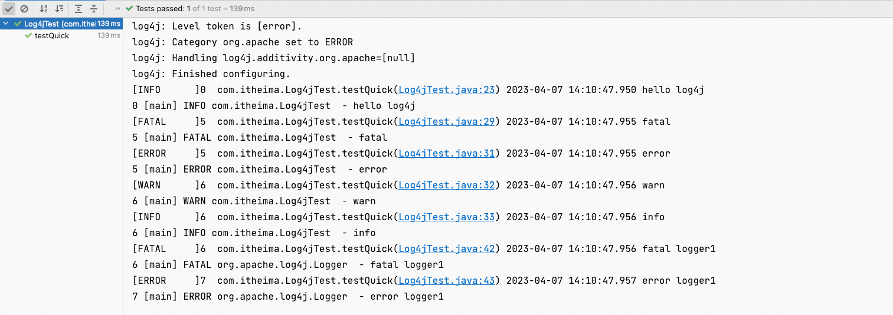
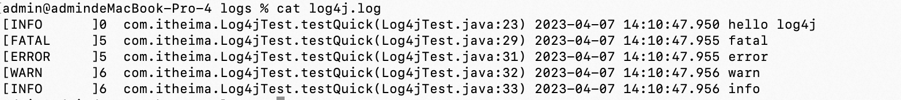

**笔记来源**：[黑马程序员java日志框架教程，全面深入学习多种java日志框架](https://www.bilibili.com/video/BV1iJ411H74S/?p=10&spm_id_from=pageDriver&vd_source=e8046ccbdc793e09a75eb61fe8e84a30)

------

**前言**：Log4j是Apache下的一款开源的日志框架，通过在项目中使用 Log4J，我们可以控制日志信息输出到控 制台、文件、甚至是数据库中。我们可以控制每一条日志的输出格式，通过定义日志的输出级别，可以 更灵活的控制日志的输出过程。方便项目的调试。  

官方网站：[Log4J官网](https://logging.apache.org/log4j/1.2/)

# 1 Log4J入门

1. 建立maven工程 
2. 添加依赖

```xml
<!--log4j-->
<dependency>
    <groupId>log4j</groupId>
    log4j</artifactId>
    <version>1.2.17</version>
</dependency>

<dependency>
    <groupId>junit</groupId>
    junit</artifactId>
    <version>4.12</version>
</dependency>
```

3. Java代码

```java
public class Log4jTest {
    @Test
	public void testQuick() throws Exception { 
        // 初始化系统配置，不需要配置文件
        BasicConfigurator.configure();

        // 创建日志记录器对象
		Logger logger = Logger.getLogger(Log4jTest.class); 
        // 日志记录输出
		logger.info("hello log4j");


		// 日志级别 
		logger.fatal("fatal"); // 严重错误，一般会造成系统崩溃和终止运行
		logger.error("error"); // 错误信息，但不会影响系统运行
		logger.warn("warn");   // 警告信息，可能会发生问题
		logger.info("info");   // 程序运行信息，数据库的连接、网络、IO操作等
		logger.debug("debug"); // 调试信息，一般在开发阶段使用，记录程序的变量、参数等
		logger.trace("trace"); // 追踪信息，记录程序的所有流程信息
	} 
}
```

4. 日志的级别：每个Logger都被了一个日志级别(log level)，用来控制日志信息的输出。日志级别从高到低分为:

   - **fatal** 指出每个严重的错误事件将会导致应用程序的退出。
   - **error** 指出虽然发生错误事件，但仍然不影响系统的继续运行。
   - **warn** 表明会出现潜在的错误情形。
   - **info** 一般和在粗粒度级别上，强调应用程序的运行全程。
   - **debug** 一般用于细粒度级别上，对调试应用程序非常有帮助。
   - **trace** 是程序追踪，可以用于输出程序运行中的变量，显示执行的流程。
   - **OFF**，可用来关闭日志记录。
   - **ALL**，启用所有消息的日志记录。

   注：一般只使用4个级别，优先级从高到低为 ERROR > WARN > INFO > DEBUG 

# 2 Log4j组件

Log4J 主要由 Loggers (日志记录器)、Appenders(输出端)和 Layout(日志格式化器)组成。其中 

- Loggers 控制日志的输出级别与日志是否输出;
- Appenders 指定日志的输出方式(输出到控制台、文件 等);
- Layout 控制日志信息的输出格式。

## 2.1 Loggers

日志记录器，负责收集处理日志记录，实例的命名就是类“XX”的full quailied name(类的全限定名)， Logger的名字大小写敏感，其命名有继承机制

例如:name为org.apache.commons的logger会继承name为org.apache的logger。

Log4J中有一个特殊的logger叫做“root”，他是所有logger的根，也就意味着其他所有的logger都会直接 或者间接地继承自root。root logger可以用Logger.getRootLogger()方法获取。

但是，自log4j 1.2版以来， Logger 类已经取代了 Category 类。对于熟悉早期版本的log4j的人来说， Logger 类可以被视为 Category 类的别名。

## 2.2 Appenders

Appender 用来指定日志输出到哪个地方，可以同时指定日志的输出目的地。Log4j 常用的输出目的地 有以下几种:

| 输出端类型                    | 作用                                       |
| ------------------------ | ---------------------------------------- |
| ConsoleAppender          | 将日志输出到控制台                                |
| FileAppender             | 将日志输出到文件中                                |
| DailyRollingFileAppender | 将日志输出到一个日志文件，并且每天输出到一个新的文件               |
| RollingFileAppender      | 将日志信息输出到一个日志文件，并且指定文件的尺寸，当文件大小达到指定尺寸时，会自动把文件改名，同时产生一个新的文件 |
| JDBCAppender             | 把日志信息保存到数据库中                             |

## 2.3 Layouts

布局器 Layouts用于控制日志输出内容的格式，让我们可以使用各种需要的格式输出日志。Log4j常用Layouts：

| 格式化器类型        | 作用                                       |
| ------------- | ---------------------------------------- |
| HTMLLayout    | 格式化日志输出为HTML表格形式                         |
| SimpleLayout  | 简单的日志输出格式化，打印的日志格式为(info - message)      |
| PatternLayout | 最强大的格式化期，可以根据自定义格式输出日志，如果没有指定转换格式，就是用默认的转换格式 |

# 3 Layout的格式

在 log4j.properties 配置文件中，我们定义了日志输出级别与输出端，在输出端中分别配置日志的输出格式。

log4j 采用类似 C 语言的 printf 函数的打印格式格式化日志信息，具体的占位符及其含义如下:

- **%m**	输出代码中指定的日志信息
  - **%p** 输出优先级，及 DEBUG、INFO 等
  - **%n** 换行符(Windows平台的换行符为 "\n"，Unix 平台为 "\n")
  - **%r**  输出自应用启动到输出该 log 信息耗费的毫秒数
  - **%c ** 输出打印语句所属的类的全名
  - **%t** 输出产生该日志的线程全名
  - **%d**  输出服务器当前时间，默认为 ISO8601，也可以指定格式，如:%d{yyyy年MM月dd日HH:mm:ss}
  - **%l**  输出日志时间发生的位置，包括类名、线程、及在代码中的行数。如:Test.main(Test.java:10)
  - **%F**  输出日志消息产生时所在的文件名称
  - **%L**  输出代码中的行号 %% 输出一个 "%" 字符 

可以在 % 与字符之间加上修饰符来控制最小宽度、最大宽度和文本的对其方式。如:

- **%5c**          输出category名称，最小宽度是5，category<5，默认的情况下右对齐
- **%-5c**         输出category名称，最小宽度是5，category<5，"-"号指定左对齐,会有空格
- **%.5c**        输出category名称，最大宽度是5，category>5，就会将左边多出的字符截掉，<5不会有空
- **%20.30c** category名称<20补空格，并且右对齐，>30字符，就从左边交远销出的字符截掉

# 4 Appender的输出

控制台 文件 数据库

```properties
# 62. 指定 RootLogger 顶级父元素默认配置信息
# 63. 指定日志级别=trace，使用的 apeender 为=console
log4j.rootLogger = trace,console


# 64. 指定控制台日志输出的 appender
log4j.appender.console = org.apache.log4j.ConsoleAppender
# 65. 指定消息格式 layout
log4j.appender.console.layout = org.apache.log4j.PatternLayout
# 66. 指定消息格式的内容
log4j.appender.console.layout.conversionPattern = [%-10p]%r  %l %d{yyyy-MM-dd HH:mm:ss.SSS} %m%n

# 67. %m   输出代码中指定的日志信息
# 68. %p   输出优先级，及 DEBUG、INFO 等
# 69. %n   换行符（Windows平台的换行符为 "\n"，Unix 平台为 "\n"）
# 70. %r   输出自应用启动到输出该 log 信息耗费的毫秒数
# 71. %c   输出打印语句所属的类的全名
# 72. %t   输出产生该日志的线程全名
# 73. %d   输出服务器当前时间，默认为 ISO8601，也可以指定格式，如：%d{yyyy年MM月dd日 HH:mm:ss}
# 74. %l   输出日志时间发生的位置，包括类名、线程、及在代码中的行数。如：Test.main(Test.java:10)
# 75. %F   输出日志消息产生时所在的文件名称
# 76. %L   输出代码中的行号
# 77. %%   输出一个 "%" 字符

# 78. 日志文件输出的 appender 对象
log4j.appender.file = org.apache.log4j.FileAppender
# 79. 指定消息格式 layout
log4j.appender.file.layout = org.apache.log4j.PatternLayout
# 80. 指定消息格式的内容
log4j.appender.file.layout.conversionPattern = [%-10p]%r  %l %d{yyyy-MM-dd HH:mm:ss.SSS} %m%n
# 81. 指定日志文件保存路径
log4j.appender.file.file = /logs/log4j.log
# 82. 指定日志文件的字符集
log4j.appender.file.encoding = UTF-8


# 83. 按照文件大小拆分的 appender 对象
# 84. 日志文件输出的 appender 对象
log4j.appender.rollingFile = org.apache.log4j.RollingFileAppender
# 85. 指定消息格式 layout
log4j.appender.rollingFile.layout = org.apache.log4j.PatternLayout
# 86. 指定消息格式的内容
log4j.appender.rollingFile.layout.conversionPattern = [%-10p]%r  %l %d{yyyy-MM-dd HH:mm:ss.SSS} %m%n
# 87. 指定日志文件保存路径
log4j.appender.rollingFile.file = /logs/log4j.log
# 88. 指定日志文件的字符集
log4j.appender.rollingFile.encoding = UTF-8
# 89. 指定日志文件内容的大小
log4j.appender.rollingFile.maxFileSize = 1MB 
# 90. 指定日志文件的数量
log4j.appender.rollingFile.maxBackupIndex = 10


# 91. 按照时间规则拆分的 appender 对象
log4j.appender.dailyFile = org.apache.log4j.DailyRollingFileAppender
# 92. 指定消息格式 layout
log4j.appender.dailyFile.layout = org.apache.log4j.PatternLayout
# 93. 指定消息格式的内容
log4j.appender.dailyFile.layout.conversionPattern = [%-10p]%r  %l %d{yyyy-MM-dd HH:mm:ss.SSS} %m%n
# 94. 指定日志文件保存路径
log4j.appender.dailyFile.file = /logs/log4j.log
# 95. 指定日志文件的字符集
log4j.appender.dailyFile.encoding = UTF-8
# 96. 指定日期拆分规则
log4j.appender.dailyFile.datePattern = '.'yyyy-MM-dd-HH-mm-ss


#mysql
log4j.appender.logDB=org.apache.log4j.jdbc.JDBCAppender
log4j.appender.logDB.layout=org.apache.log4j.PatternLayout
log4j.appender.logDB.Driver=com.mysql.jdbc.Driver
log4j.appender.logDB.URL=jdbc:mysql://localhost:3306/test
log4j.appender.logDB.User=root
log4j.appender.logDB.Password=root
log4j.appender.logDB.Sql=INSERT INTO log(project_name,create_date,level,category,file_name,thread_name,line,all_category,message) values('itcast','%d{yyyy-MM-dd HH:mm:ss}','%p','%c','%F','%t','%L','%l','%m')
```

# 5 案例

log4j.properties

```properties
# 97. 指定 RootLogger 顶级父元素默认配置信息
# 98. 指定日志级别=trace，使用的 apeender 为=console
log4j.rootLogger = trace,console

# 99. 自定义 logger 对象设置
log4j.logger.com.itheima = info,rollingFile
log4j.logger.org.apache = error

# 100. 指定控制台日志输出的 appender
log4j.appender.console = org.apache.log4j.ConsoleAppender
# 101. 指定消息格式 layout
log4j.appender.console.layout = org.apache.log4j.PatternLayout
# 102. 指定消息格式的内容
log4j.appender.console.layout.conversionPattern = [%-10p]%r  %l %d{yyyy-MM-dd HH:mm:ss.SSS} %m%n


# 103. %m   输出代码中指定的日志信息
# 104. %p   输出优先级，及 DEBUG、INFO 等
# 105. %n   换行符（Windows平台的换行符为 "\n"，Unix 平台为 "\n"）
# 106. %r   输出自应用启动到输出该 log 信息耗费的毫秒数
# 107. %c   输出打印语句所属的类的全名
# 108. %t   输出产生该日志的线程全名
# 109. %d   输出服务器当前时间，默认为 ISO8601，也可以指定格式，如：%d{yyyy年MM月dd日 HH:mm:ss}
# 110. %l   输出日志时间发生的位置，包括类名、线程、及在代码中的行数。如：Test.main(Test.java:10)
# 111. %F   输出日志消息产生时所在的文件名称
# 112. %L   输出代码中的行号
# 113. %%   输出一个 "%" 字符

# 114. 日志文件输出的 appender 对象
log4j.appender.file = org.apache.log4j.FileAppender
# 115. 指定消息格式 layout
log4j.appender.file.layout = org.apache.log4j.PatternLayout
# 116. 指定消息格式的内容
log4j.appender.file.layout.conversionPattern = [%-10p]%r  %l %d{yyyy-MM-dd HH:mm:ss.SSS} %m%n
# 117. 指定日志文件保存路径
log4j.appender.file.file = /Users/admin/logs/log4j.log
# 118. 指定日志文件的字符集
log4j.appender.file.encoding = UTF-8


# 119. 按照文件大小拆分的 appender 对象
# 120. 日志文件输出的 appender 对象
log4j.appender.rollingFile = org.apache.log4j.RollingFileAppender
# 121. 指定消息格式 layout
log4j.appender.rollingFile.layout = org.apache.log4j.PatternLayout
# 122. 指定消息格式的内容
log4j.appender.rollingFile.layout.conversionPattern = [%-10p]%r  %l %d{yyyy-MM-dd HH:mm:ss.SSS} %m%n
# 123. 指定日志文件保存路径
log4j.appender.rollingFile.file = /Users/admin/logs/log4j.log
# 124. 指定日志文件的字符集
log4j.appender.rollingFile.encoding = UTF-8
# 125. 指定日志文件内容的大小
log4j.appender.rollingFile.maxFileSize = 1MB 
# 126. 指定日志文件的数量
log4j.appender.rollingFile.maxBackupIndex = 10


# 127. 按照时间规则拆分的 appender 对象
log4j.appender.dailyFile = org.apache.log4j.DailyRollingFileAppender
# 128. 指定消息格式 layout
log4j.appender.dailyFile.layout = org.apache.log4j.PatternLayout
# 129. 指定消息格式的内容
log4j.appender.dailyFile.layout.conversionPattern = [%-10p]%r  %l %d{yyyy-MM-dd HH:mm:ss.SSS} %m%n
# 130. 指定日志文件保存路径
log4j.appender.dailyFile.file = /Users/admin/logs/log4j.log
# 131. 指定日志文件的字符集
log4j.appender.dailyFile.encoding = UTF-8
# 132. 指定日期拆分规则
log4j.appender.dailyFile.datePattern = '.'yyyy-MM-dd-HH-mm-ss


#mysql
log4j.appender.logDB=org.apache.log4j.jdbc.JDBCAppender
log4j.appender.logDB.layout=org.apache.log4j.PatternLayout
log4j.appender.logDB.Driver=com.mysql.jdbc.Driver
log4j.appender.logDB.URL=jdbc:mysql://localhost:3306/test
log4j.appender.logDB.User=root
log4j.appender.logDB.Password=root
log4j.appender.logDB.Sql=INSERT INTO log(project_name,create_date,level,category,file_name,thread_name,line,all_category,message) values('itcast','%d{yyyy-MM-dd HH:mm:ss}','%p','%c','%F','%t','%L','%l','%m')
```

Java代码

```java
package com.itheima;

import org.apache.log4j.BasicConfigurator;
import org.apache.log4j.Logger;
import org.apache.log4j.helpers.LogLog;
import org.junit.Test;

public class Log4jTest {

    // 快速入门
    @Test
    public void testQuick()throws Exception{

        // 开启 log4j 内置日志记录
        LogLog.setInternalDebugging(true);

        // 初始化配置信息，在入门案例中暂不使用配置文件
        BasicConfigurator.configure();

        // 获取日志记录器对象
        Logger logger = Logger.getLogger(Log4jTest.class);
        // 日志记录输出
        logger.info("hello log4j");


        //for (int i = 0; i < 10000; i++) {

        // 日志级别
        logger.fatal("fatal"); // 严重错误，一般会造成系统崩溃并终止运行

        logger.error("error"); // 错误信息，不会影响系统运行
        logger.warn("warn");   // 警告信息，可能会发生问题
        logger.info("info");   // 运行信息，数据连接、网络连接、IO 操作等等
        logger.debug("debug"); // 调试信息，一般在开发中使用，记录程序变量参数传递信息等等

        logger.trace("trace"); // 追踪信息，记录程序所有的流程信息
        //}


        // 再创建一个日志记录器对象
        Logger logger1 = Logger.getLogger(Logger.class);
        logger1.fatal("fatal logger1"); // 严重错误，一般会造成系统崩溃并终止运行
        logger1.error("error logger1"); // 错误信息，不会影响系统运行
        logger1.warn("warn logger1");   // 警告信息，可能会发生问题
        logger1.info("info logger1");   // 运行信息，数据连接、网络连接、IO 操作等等
        logger1.debug("debug logger1"); // 调试信息，一般在开发中使用，记录程序变量参数传递信息等等
        logger1.trace("trace logger1"); // 追踪信息，记录程序所有的流程信息

    }
}
```

POM.xml

```xml
<dependencies>
  <!--log4j-->
  <dependency>
    <groupId>log4j</groupId>
    log4j</artifactId>
    <version>1.2.17</version>
  </dependency>

  <dependency>
    <groupId>junit</groupId>
    junit</artifactId>
    <version>4.12</version>
  </dependency>

  <dependency>
    <groupId>mysql</groupId>
    mysql-connector-java</artifactId>
    <version>5.1.47</version>
  </dependency>
</dependencies>
```

控制台输出



我们发现logger和logger1对象的日志输出都在控制台上有输出

log4j.log 



我们发现日志文件中，只有logger对象的日志记录，那是因为我们自定义配置了logger对象com.heim，而logger对象是`Logger logger = Logger.getLogger(Log4jTest.class);`

而Log4jTest类是在com.heim包下的，而logger1对象是`Logger logger1 = Logger.getLogger(Logger.class);`而Logger类是属于`org.apache.log4j`，而org.apache我们只配置了日志级别error，没有配置日志输出，所以它用的是顶级父类rootLogger的输出，rootLogger的输出位置配置的是console，所以logger1只在控制台位置输出。

```properties
log4j.rootLogger = trace,console

# 133. 自定义 logger 对象设置
log4j.logger.com.itheima = info,rollingFile
log4j.logger.org.apache = error
```

配置自定义logger对象的作用，我们可以将自己服务内的日志记录在日志文件中，而系统和开源框架中的日志只在控制台中输出即可。

