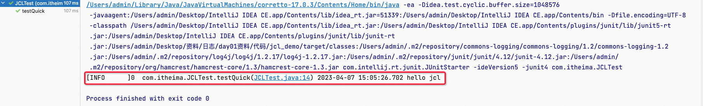
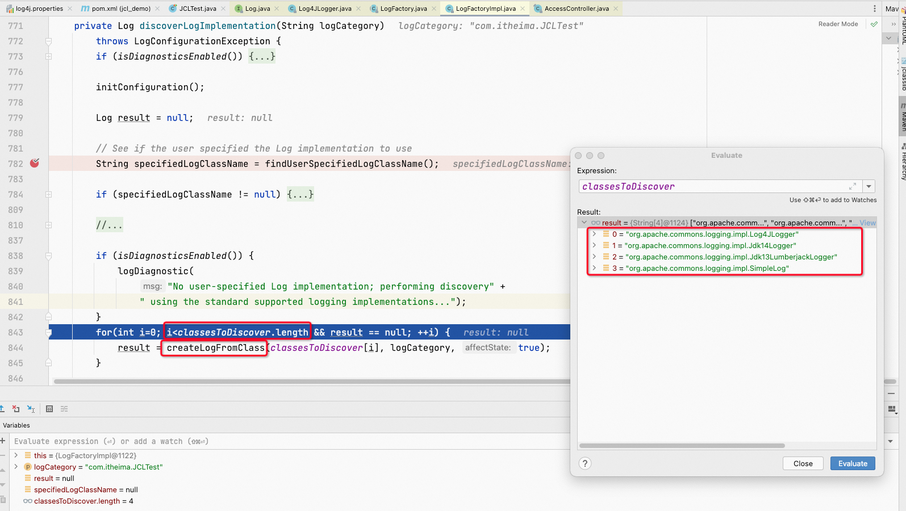

笔记来源：[黑马程序员java日志框架教程，全面深入学习多种java日志框架](https://www.bilibili.com/video/BV1iJ411H74S/?p=10&spm_id_from=pageDriver&vd_source=e8046ccbdc793e09a75eb61fe8e84a30)

前言：全称为Jakarta Commons Logging，是Apache提供的一个通用日志API。  

它是为所有的Java日志实现提供一个统一的接口，它自身也提供一个日志的实现，但是功能非常常弱 (SimpleLog)。所以一般不会单独使用它。他允许开发人员使用不同的具体日志实现工具: Log4J，Jdk 自带的日志(JUL)  

JCL 有两个基本的抽象类：Log（基本记录器）和LogFactory（负责创建Log实例）。


# 1 JCL入门 

1. 建立maven工程 
2. 添加依赖 

```xml
<dependency>
    <groupId>commons-logging</groupId>
    commons-logging</artifactId>
    <version>1.2</version>
</dependency>
```

3. 入门代码

```java
package com.itheima;

import org.apache.commons.logging.Log;
import org.apache.commons.logging.LogFactory;
import org.junit.Test;

public class JCLTest {

    @Test
    public void testQuick()throws Exception{
        // 获取 log日志记录器对象
        Log log = LogFactory.getLog(JCLTest.class);
        // 日志记录输出
        log.info("hello jcl");
    }
}
```

4. 输出


这是JUL的日志格式，说明JCL底层默认使用的是JUL

5. 加入注解

```xml
<dependency>
    <groupId>log4j</groupId>
    log4j</artifactId>
    <version>1.2.17</version>
</dependency>
```

6. 配置文件：log4j.properties

```properties
# 134. 指定 RootLogger 顶级父元素默认配置信息
# 135. 指定日志级别=trace，使用的 apeender 为=console
log4j.rootLogger = trace,console


# 136. 指定控制台日志输出的 appender
log4j.appender.console = org.apache.log4j.ConsoleAppender
# 137. 指定消息格式 layout
log4j.appender.console.layout = org.apache.log4j.PatternLayout
# 138. 指定消息格式的内容
log4j.appender.console.layout.conversionPattern = [%-10p]%r  %l %d{yyyy-MM-dd HH:mm:ss.SSS} %m%n
```

7. 输出




我们为什么要使用日志门面: 

1. 面向接口开发，不再依赖具体的实现类。减少代码的耦合 
2. 项目通过导入不同的日志实现类，可以灵活的切换日志框架 
3. 统一API，方便开发者学习和使用 
4. 统一配置便于项目日志的管理 

# 2 JCL原理 
1. 通过LogFactory动态加载Log实现类 


2.  日志门面支持的日志实现数组 

    a. 获取接口Log具体的实现类


​	b. 创建具体的实现类


​	c. 发现有哪些可以创建的实现类


​	d. 推断使用哪个是实现类




由于classesToDiscover是一个有数组，是有顺序的，所以先判断是否有Log4J，如果没有的话再走JDK14的JUL

​	e. 利用反射去创建Log的对象


获取具体的日志实现：我们发现JCL只支持JUL和Log4J，那么如果是其他的日志实现类，比如LogBack，那么该怎么办？我们继续往下看

