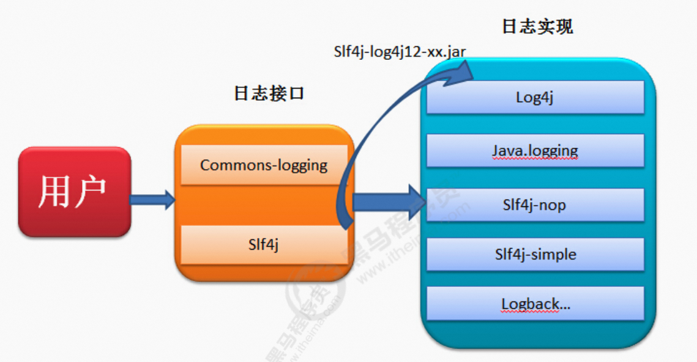

笔记来源：[**黑马程序员java日志框架教程，全面深入学习多种java日志框架**](https://www.bilibili.com/video/BV1iJ411H74S/?p=10&spm_id_from=pageDriver&vd_source=e8046ccbdc793e09a75eb61fe8e84a30)

------

# 1. 日志门面
当我们的系统变的更加复杂的时候，我们的日志就容易发生混乱。随着系统开发的进行，可能会更新不 同的日志框架，造成当前系统中存在不同的日志依赖，让我们难以统一的管理和控制。就算我们强制要 求所有的模块使用相同的日志框架，系统中也难以避免使用其他类似spring,mybatis等其他的第三方框 架，它们依赖于我们规定不同的日志框架，而且他们自身的日志系统就有着不一致性，依然会出来日志体系的混乱。

所以我们需要借鉴JDBC的思想，为日志系统也提供一套门面，那么我们就可以面向这些接口规范来开发，避免了直接依赖具体的日志框架。这样我们的系统在日志中，就存在了日志的门面和日志的实现。 

常见的日志门面：

- JCL

+ slf4j

常见的日志实现:

+ JUL

+ log4j

+ logback

+ log4j2 

  ​

  ​								日志门面和日志实现的关系 		



日志框架出现的历史顺序：log4j ->JUL-> JCL -> slf4j -> logback -> log4j2

# 2 SLF4J的使用
简单日志门面（Simple Logging Facade For Java）SLF4J主要是为了给Java日志访问提供一套标准、规范 的API框架，其主要意义在于提供接口，具体的实现可以交由其他日志框架，例如log4j和logback等。 当然slf4j自己也提供了功能较为简单的实现，但是一般很少用到。对于一般的Java项目而言，日志框架 会选择slf4j-api作为门面，配上具体的实现框架(log4j、logback等)，中间使用桥接器完成桥接。 

官方网站：[SLF4J](https://www.slf4j.org/)

SLF4J是目前市面上最流行的日志门面。现在的项目中，基本上都是使用SLF4J作为我们的日志系统。 

SLF4J日志门面主要提供两大功能：

1. 日志框架的绑定
2. 日志框架的桥接

## 2.1 SLF4J入门
1. 添加依赖 

```xml
<!-- slf4j 日志门面 -->
<dependency>
    <groupId>org.slf4j</groupId>
    slf4j-api</artifactId>
    <version>1.7.26</version>
</dependency>

<!-- slf4j 内置的简单实现-->
<dependency>
    <groupId>org.slf4j</groupId>
    slf4j-simple</artifactId>
    <version>1.7.21</version>
</dependency>
```

2. 编写代码

```java
package com.itheima;

import org.junit.Test;
import org.slf4j.Logger;
import org.slf4j.LoggerFactory;

public class Slf4jTest {

    public static final Logger LOGGER = LoggerFactory.getLogger(Slf4jTest.class);

    // 快速入门
    @Test
    public void test01()throws Exception{
        // 日志输出
        LOGGER.error("error");
        LOGGER.warn("wring");
        LOGGER.info("info"); // 默认级别
        LOGGER.debug("debug");
        LOGGER.trace("trace");

        // 使用占位符输出日志信息
        String name = "itheima";
        Integer age = 14;
        LOGGER.info("用户：{},{}",name,age);

        // 将系统的异常信息输出
        try {
            int i = 1/0;
        } catch (Exception e) {
           // e.printStackTrace();
            LOGGER.error("出现异常：",e);

        }
    }
}
```

3. 输出


为什么要使用SLF4J作为日志门面？

1. 使用SLF4J框架，可以在部署时迁移到所需的日志记录框架。
2. SLF4J提供了对所有流行的日志框架的绑定，例如log4j，JUL，Simple logging和NOP。因此可以在部署时切换到任何这些流行的框架。  
3. 无论使用哪种绑定，SLF4J都支持参数化日志记录消息。由于SLF4J将应用程序和日志记录框架分离， 因此可以轻松编写独立于日志记录框架的应用程序。而无需担心用于编写应用程序的日志记录框架。 
4. SLF4J提供了一个简单的Java工具，称为迁移器。使用此工具，可以迁移现有项目，这些项目使用日志 框架(如Jakarta Commons Logging（JCL）或log4j或Java.util.logging（JUL）到SLF4J。 

## 2.2 绑定日志的实现(Binding) 
如前所述，SLF4J支持各种日志框架。SLF4J发行版附带了几个称为“SLF4J绑定”的jar文件，每个绑定对应一个受支持的框架。

使用slf4j的日志绑定流程：

1. 添加slf4j-api的依赖
2. 使用slf4j的API在项目中进行统一的日志记录
3. 绑定具体的日志实现框架
    1. 绑定已经实现了slf4j的日志框架,直接添加对应依赖，如LogBack
    2. ​绑定没有实现slf4j的日志框架,先添加日志的适配器,再添加实现类的依赖
4. slf4j有且仅有一个日志实现框架的绑定（如果出现多个默认使用第一个依赖日志实现）

通过maven引入常见的日志实现框架：

```xml
<!--slf4j core 使用slf4j必須添加--> 
<dependency>
    <groupId>org.slf4j</groupId>
    slf4j-api</artifactId>
    <version>1.7.27</version>
</dependency>


<!-- log4j-->
<!-- log4j适配器-->
<dependency>
    <groupId>org.slf4j</groupId>
    slf4j-log4j12</artifactId>
    <version>1.7.27</version>
</dependency>
<!-- log4j具体日志实现-->
<dependency>
    <groupId>log4j</groupId>
    log4j</artifactId>
    <version>1.2.17</version>
</dependency>


<!-- jul -->
<!-- jul适配器，由于jul是jdk默认实现的，因此不需要导入jul具体实现 -->
<dependency>
    <groupId>org.slf4j</groupId>
    slf4j-jdk14</artifactId>
    <version>1.7.27</version>
</dependency>

<!--jcl -->
<dependency>
    <groupId>org.slf4j</groupId>
    slf4j-jcl</artifactId>
    <version>1.7.27</version>
</dependency>

<!-- nop -->
<dependency>
    <groupId>org.slf4j</groupId>
    slf4j-nop</artifactId>
    <version>1.7.27</version>
</dependency>

       
<!--logback 日志实现，出现的比slf4j迟，所以不需要适配器，直接日志实现就行-->
<dependency>
    <groupId>ch.qos.logback</groupId>
    logback-classic</artifactId>
    <version>1.2.3</version>
</dependency>
```

要切换日志框架，只需替换类路径上的slf4j绑定。例如，要从java.util.logging切换到log4j，只需将 slf4j-jdk14-1.7.27.jar替换为slf4j-log4j12-1.7.27.jar即可。 

SLF4J不依赖于任何特殊的类装载。实际上，每个SLF4J绑定 都是硬连线的 以使用一个且只有 一个特定的日志记录框架。例如，slf4j-log4j12-1.7.27.jar绑定在编译时绑定以使用log4j。在您的代码 中，除了slf4j-api-1.7.27.jar ，您只需将您选择的一个且只有一个绑定放到相应的类路径位置。不要在类路径上放置多个绑定。以下是一般概念的图解说明。		

 	

浅蓝色为SLF4J门面，深蓝色为日志具体实现，青色为适配器			 				

## 2.3 桥接旧的日志框架(Bridging) 
通常，您依赖的某些组件依赖于SLF4J以外的日志记录API。您也可以假设这些组件在不久的将来不会切换到SLF4J。为了解决这种情况，SLF4J附带了几个桥接模块，这些模块将对log4j，JCL和 java.util.logging API的调用重定向，就好像它们是对SLF4J API一样。 

桥接解决的是项目中日志的遗留问题，当系统中存在之前的日志API，可以通过桥接转换到slf4j的实现

1. 先去除之前老的日志框架的依赖
2. 添加SLF4J提供的桥接组件
3. 为项目添加SLF4J的具体实现


迁移的方式: 如果我们要使用SLF4J的桥接器，替换原有的日志框架，那么我们需要做的第一件事情，就是删除掉原有项目中的日志框架的依赖。然后替换成SLF4J提供的桥接器。

```xml
<!-- log4j-->
<dependency>
    <groupId>org.slf4j</groupId>
    log4j-over-slf4j</artifactId>
    <version>1.7.27</version>
</dependency>

<!-- jul -->
<dependency>
    <groupId>org.slf4j</groupId>
    jul-to-slf4j</artifactId>
    <version>1.7.27</version>
</dependency>

<!--jcl -->
<dependency>
    <groupId>org.slf4j</groupId>
    jcl-over-slf4j</artifactId>
    <version>1.7.27</version>
</dependency>
```

注意问题: 

1. jcl-over-slf4j.jar和 slf4j-jcl.jar不能同时部署。前一个jar文件将导致JCL将日志系统的选择委托给 SLF4J，后一个jar文件将导致SLF4J将日志系统的选择委托给JCL，从而导致无限循环
2. log4j-over-slf4j.jar和slf4j-log4j12.jar不能同时出现
3. jul-to-slf4j.jar和slf4j-jdk14.jar不能同时出现
4. 所有的桥接都只对Logger日志记录器对象有效，如果程序中调用了内部的配置类或者是Appender,Filter等对象，将无法产生效果。 

## 2.4 SLF4J原理解析
1. SLF4J通过LoggerFactory加载日志具体的实现对象。
2. LoggerFactory在初始化的过程中，会通过performInitialization()方法绑定具体的日志实现。
3. 在绑定具体实现的时候，通过类加载器，加载org/slf4j/impl/StaticLoggerBinder.class
4. 所以，只要是一个日志实现框架，在org.slf4j.impl包中提供一个自己的StaticLoggerBinder类，在其中提供具体日志实现的LoggerFactory就可以被SLF4J所加载

