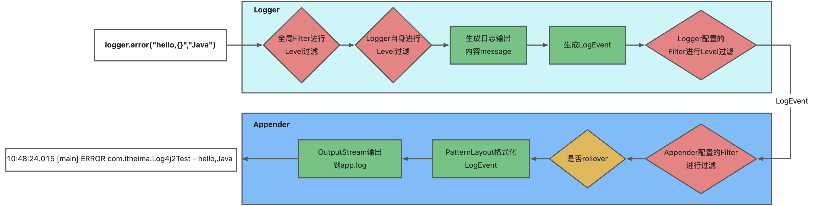
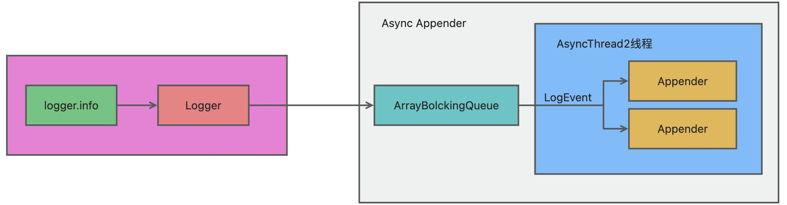
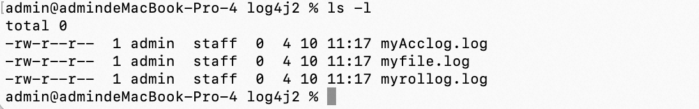
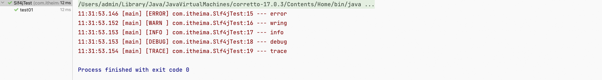
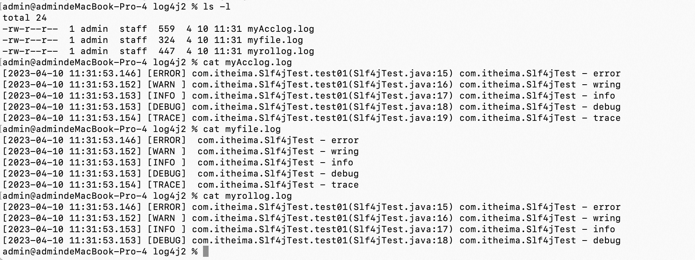
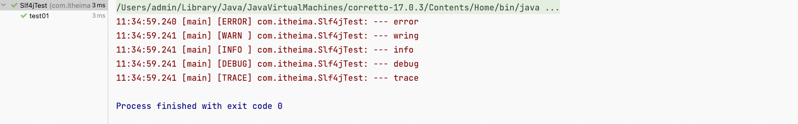
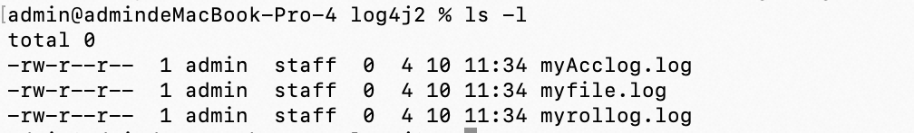

**<font style="color:#DF2A3F;">笔记来源：</font>**[**<font style="color:#DF2A3F;">黑马程序员java日志框架教程，全面深入学习多种java日志框架</font>**](https://www.bilibili.com/video/BV1iJ411H74S/?p=10&spm_id_from=pageDriver&vd_source=e8046ccbdc793e09a75eb61fe8e84a30)

**<font style="color:#DF2A3F;"></font>**

<font style="color:#2F8EF4;">前言</font>  
Apache Log4J2是对Log4j的升级版，参考了logback的一些优秀的设计，并且修复了一些问题，因此带来了一些重大的提升，主要有：

+ 异常处理，在logback中，Appender中的异常不会被应用感知到，但是在log4j2中，提供了一些异常处理机制。
+ 性能提升， log4j2相较于log4j 和logback都具有很明显的性能提升，后面会有官方测试的数据。 
+ 自动重载配置，参考了logback的设计，当然会提供自动刷新参数配置，最实用的就是我们在生产 上可以动态的修改日志的级别而不需要重启应用。 
+ 无垃圾机制，log4j2在大部分情况下，都可以使用其设计的一套无垃圾机制，避免频繁的日志收集 导致的jvm gc。

官网: 

[Log4j – Apache Log4j™ 2](https://logging.apache.org/log4j/2.x/)

 

# 1 Log4j2入门
目前市面上最主流的日志门面就是SLF4J，虽然Log4j2也是日志门面，因为它的日志实现功能非常强大，性能优越。所以大家一般还是将Log4j2看作是日志的实现，Slf4j + Log4j2应该是未来的大势所趋。

1. 添加依赖    

```xml
<!-- Log4j2 门面API--> 
<dependency>
    <groupId>org.apache.logging.log4j</groupId>
    log4j-api</artifactId>
    <version>2.11.1</version>
</dependency>

<!-- Log4j2 日志实现 --> <dependency>
    <groupId>org.apache.logging.log4j</groupId>
    log4j-core</artifactId>
    <version>2.11.1</version>
</dependency>
```

2. Java代码

```java
public class Log4j2Test {
    // 定义日志记录器对象
    public static final Logger LOGGER = LogManager.getLogger(Log4j2Test.class);
	
    @Test
    public void testQuick() throws Exception {
        LOGGER.fatal("fatal");
        LOGGER.error("error");
        LOGGER.warn("warn");
        LOGGER.info("info");
        LOGGER.debug("debug");
        LOGGER.trace("trace");
} }
```

3.  <font style="color:rgb(20.000000%, 20.000000%, 20.000000%);">使用slf4j作为日志的门面,使用log4j2作为日志的实现 </font>

```xml
<!-- Log4j2 门面API--> 
<dependency>
    <groupId>org.apache.logging.log4j</groupId>
    log4j-api</artifactId>
    <version>2.11.1</version>
</dependency>

<!-- Log4j2 日志实现 --> 
<dependency>
    <groupId>org.apache.logging.log4j</groupId>
    log4j-core</artifactId>
    <version>2.11.1</version>
</dependency>

<!--使用slf4j作为日志的门面,使用log4j2来记录日志 --> 
<dependency>
    <groupId>org.slf4j</groupId>
    slf4j-api</artifactId>
    <version>1.7.25</version>
</dependency>

<!--为slf4j绑定日志实现 log4j2的适配器 --> 
<dependency>
    <groupId>org.apache.logging.log4j</groupId>
    log4j-slf4j-impl</artifactId>
    <version>2.10.0</version>
</dependency>
```

# 177. <font style="color:rgb(20.000000%, 20.000000%, 20.000000%);">2 Log4j2配置</font>
<font style="color:rgb(20.000000%, 20.000000%, 20.000000%);">log4j2默认加载classpath下的 log4j2.xml 文件中的配置。 </font>

```xml
<?xml version="1.0" encoding="UTF-8"?>
<Configuration status="warn" monitorInterval="5">
  
    <properties>
        <property name="LOG_HOME">D:/logs</property>
    </properties>

  	<Appenders>
        <Console name="Console" target="SYSTEM_OUT">
            <PatternLayout pattern="%d{HH:mm:ss.SSS} [%t] [%-5level] %c{36}:%L --- %m%n" />
        </Console>
        
      <File name="file" fileName="${LOG_HOME}/myfile.log">
            <PatternLayout pattern="[%d{yyyy-MM-dd HH:mm:ss.SSS}] [%-5level] %l %c{36} - %m%n" />
      </File>
        
      <RandomAccessFile name="accessFile" fileName="${LOG_HOME}/myAcclog.log">
            <PatternLayout pattern="[%d{yyyy-MM-dd HH:mm:ss.SSS}] [%-5level] %l %c{36} - %m%n" />
      </RandomAccessFile>
        
      <RollingFile name="rollingFile" fileName="${LOG_HOME}/myrollog.log"
                     filePattern="D:/logs/

$$

$$


$$

$$


$$

$$


$$

$$


$$

$$


$$

$$


$$

$$


$$

$$


{date:yyyy-MM-dd}/myrollog-%d{yyyy-MM-dd-HH-mm}-%i.log">
            <ThresholdFilter level="debug" onMatch="ACCEPT" onMismatch="DENY" />
            <PatternLayout pattern="[%d{yyyy-MM-dd HH:mm:ss.SSS}] [%-5level] %l %c{36} - %msg%n" />
            <Policies>
                <OnStartupTriggeringPolicy />
                <SizeBasedTriggeringPolicy size="10 MB" />
                <TimeBasedTriggeringPolicy />
						</Policies>
            <DefaultRolloverStrategy max="30" />
      </RollingFile>
    </Appenders>
  
    <Loggers>
        <Root level="trace">
            <AppenderRef ref="Console" />
        </Root>
    </Loggers>
</Configuration>
```

# 3 Log4j2异步日志 
异步日志：log4j2最大的特点就是异步日志，其性能的提升主要也是从异步日志中受益，我们来看看如何使用 log4j2的异步日志。  


同步日志



异步日志



Log4j2提供了两种实现日志的方式，一个是通过AsyncAppender，一个是通过AsyncLogger，分别对应前面我们说的Appender组件和Logger组件。  
注意：配置异步日志需要添加依赖

```xml
<!--异步日志依赖--> 
<dependency>
    <groupId>com.lmax</groupId>
    disruptor</artifactId>
    <version>3.3.4</version>
</dependency>
```

<font style="color:rgb(20.000000%, 20.000000%, 20.000000%);">AsyncAppender方式 </font>

```xml
<?xml version="1.0" encoding="UTF-8"?>
<Configuration status="warn">
    <properties>
        <property name="LOG_HOME">D:/logs</property>
    </properties>
    
    <Appenders>
        <File name="file" fileName="${LOG_HOME}/myfile.log">
            <PatternLayout>
                <Pattern>%d %p %c{1.} [%t] %m%n</Pattern>
            </PatternLayout>
        </File>
        <Async name="Async">
            <AppenderRef ref="file"/>
        </Async>
    </Appenders>
    
    <Loggers>
        <Root level="error">
            <AppenderRef ref="Async"/>
        </Root>
    </Loggers>
</Configuration>

```

AsyncLogger方式  
AsyncLogger才是log4j2 的重头戏，也是官方推荐的异步方式。它可以使得调用Logger.log返回的更快。你可以有两种选择

+ 全局异步
+ 混合异步。 

全局异步就是，所有的日志都异步的记录，在配置文件上不用做任何改动，只需要添加一个log4j2.component.properties 配置

```properties
 Log4jContextSelector=org.apache.logging.log4j.core.async.AsyncLoggerContextSelector
```

混合异步就是，你可以在应用中同时使用同步日志和异步日志，这使得日志的配置方式更加灵活。

```xml
<?xml version="1.0" encoding="UTF-8"?>
<Configuration status="WARN">
    <properties>
        <property name="LOG_HOME">D:/logs</property>
    </properties>
    
    <Appenders>
        <File name="file" fileName="${LOG_HOME}/myfile.log">
            <PatternLayout>
                <Pattern>%d %p %c{1.} [%t] %m%n</Pattern>
            </PatternLayout>
        </File>
        <Async name="Async">
            <AppenderRef ref="file"/>
        </Async>
    </Appenders>
    
    <Loggers>
        <AsyncLogger name="com.itheima" level="trace"
            includeLocation="false" additivity="false">
            <AppenderRef ref="file"/>
        </AsyncLogger>
        
        <Root level="info" includeLocation="true">
            <AppenderRef ref="file"/>
        </Root>
        
    </Loggers>
</Configuration>
```

<font style="color:rgb(20.000000%, 20.000000%, 20.000000%);">如上配置: com.itheima 日志是异步的，root日志是同步的。 </font>

使用异步日志需要注意的问题:

1. 如果使用异步日志，AsyncAppender、AsyncLogger和全局日志，不要同时出现。性能会和 AsyncAppender一致，降至最低。
2. 设置includeLocation=false ，打印位置信息会急剧降低异步日志的性能，比同步日志还要慢。

# 4 案例精讲
```xml
<?xml version="1.0" encoding="UTF-8"?>
<!--
    status="warn" 日志框架本身的输出日志级别
    monitorInterval="5" 自动加载配置文件的间隔时间，不低于 5 秒
-->
<Configuration status="ERROR" monitorInterval="5">

    <!--
        集中配置属性进行管理
        使用时通过:${name}
    -->
    <properties>
        <property name="LOG_HOME">/Users/admin/logs/log4j2</property>
    </properties>

    <!--日志处理-->
    <Appenders>
        <!--控制台输出 appender-->
        <Console name="Console" target="SYSTEM_ERR">
            <PatternLayout pattern="%d{HH:mm:ss.SSS} [%t] [%-5level] %c{36}:%L --- %m%n" />
        </Console>

        <!--日志文件输出 appender-->
        <File name="file" fileName="${LOG_HOME}/myfile.log">
            <PatternLayout pattern="[%d{yyyy-MM-dd HH:mm:ss.SSS}] [%-5level] %l %c{36} - %m%n" />
        </File>

        <!--<Async name="Async">-->
            <!--<AppenderRef ref="file"/>-->
        <!--</Async>-->

        <!--使用随机读写刘的日志文件输出 appender，性能提高-->
        <RandomAccessFile name="accessFile" fileName="${LOG_HOME}/myAcclog.log">
            <PatternLayout pattern="[%d{yyyy-MM-dd HH:mm:ss.SSS}] [%-5level] %l %c{36} - %m%n" />
        </RandomAccessFile>

        <!--按照一定规则拆分的日志文件的 appender-->
        <RollingFile name="rollingFile" fileName="${LOG_HOME}/myrollog.log"
                     filePattern="/logs/

$$

$$


$$

$$


$$

$$


$$

$$


$$

$$


$$

$$


$$

$$


$$

$$


{date:yyyy-MM-dd}/myrollog-%d{yyyy-MM-dd-HH-mm}-%i.log">
            <!--日志级别过滤器-->
            <ThresholdFilter level="debug" onMatch="ACCEPT" onMismatch="DENY" />
            <!--日志消息格式-->
            <PatternLayout pattern="[%d{yyyy-MM-dd HH:mm:ss.SSS}] [%-5level] %l %c{36} - %msg%n" />
            <Policies>
                <!--在系统启动时，出发拆分规则，生产一个新的日志文件-->
                <OnStartupTriggeringPolicy />
                <!--按照文件大小拆分，10MB -->
                <SizeBasedTriggeringPolicy size="10 MB" />
                <!--按照时间节点拆分，规则根据filePattern定义的-->
                <TimeBasedTriggeringPolicy />
            </Policies>
            <!--在同一个目录下，文件的个数限定为 30 个，超过进行覆盖-->
            <DefaultRolloverStrategy max="30" />
        </RollingFile>

    </Appenders>

    <!--logger 定义-->
    <Loggers>


        <!--自定义异步 logger 对象
            includeLocation="false" 关闭日志记录的行号信息
            additivity="false" 不在继承 rootlogger 对象
        -->
<!--        <AsyncLogger name="com.itheima" level="trace" includeLocation="false" additivity="false">-->
<!--            <AppenderRef ref="Console"/>-->
<!--        </AsyncLogger>-->


        <!--使用 rootLogger 配置 日志级别 level="trace"-->
        <Root level="trace">
            <!--指定日志使用的处理器-->
            <AppenderRef ref="Console" />

            <!--使用异步 appender-->
<!--            <AppenderRef ref="Async" />-->
        </Root>
    </Loggers>
</Configuration>
```

```java
package com.itheima;

import org.junit.Test;
import org.slf4j.Logger;
import org.slf4j.LoggerFactory;

public class Slf4jTest {

    public static final Logger LOGGER = LoggerFactory.getLogger(Slf4jTest.class);

    // 快速入门
    @Test
    public void test01()throws Exception{
        // 日志输出
        LOGGER.error("error");
        LOGGER.warn("wring");
        LOGGER.info("info");
        LOGGER.debug("debug");
        LOGGER.trace("trace");

    }
}
```

控制台输出


产生的三个文件



产生的三个文件都为空，因为我们没有在rootlogger下面引用这仨个Appender

接下来我们引用一下

```xml
<?xml version="1.0" encoding="UTF-8"?>
<!--
    status="warn" 日志框架本身的输出日志级别
    monitorInterval="5" 自动加载配置文件的间隔时间，不低于 5 秒
-->
<Configuration status="ERROR" monitorInterval="5">

    <!--
        集中配置属性进行管理
        使用时通过:${name}
    -->
    <properties>
        <property name="LOG_HOME">/Users/admin/logs/log4j2</property>
    </properties>

    <!--日志处理-->
    <Appenders>
        <!--控制台输出 appender-->
        <Console name="Console" target="SYSTEM_ERR">
            <PatternLayout pattern="%d{HH:mm:ss.SSS} [%t] [%-5level] %c{36}:%L --- %m%n" />
        </Console>

        <!--日志文件输出 appender-->
        <File name="file" fileName="${LOG_HOME}/myfile.log">
            <PatternLayout pattern="[%d{yyyy-MM-dd HH:mm:ss.SSS}] [%-5level] %l %c{36} - %m%n" />
        </File>

        <Async name="Async">
            <AppenderRef ref="file"/>
        </Async>

        <!--使用随机读写刘的日志文件输出 appender，性能提高-->
        <RandomAccessFile name="accessFile" fileName="${LOG_HOME}/myAcclog.log">
            <PatternLayout pattern="[%d{yyyy-MM-dd HH:mm:ss.SSS}] [%-5level] %l %c{36} - %m%n" />
        </RandomAccessFile>

        <!--按照一定规则拆分的日志文件的 appender-->
        <RollingFile name="rollingFile" fileName="${LOG_HOME}/myrollog.log"
                     filePattern="/logs/

$$

$$


$$

$$


$$

$$


$$

$$


$$

$$


$$

$$


$$

$$


$$

$$


{date:yyyy-MM-dd}/myrollog-%d{yyyy-MM-dd-HH-mm}-%i.log">
            <!--日志级别过滤器-->
            <ThresholdFilter level="debug" onMatch="ACCEPT" onMismatch="DENY" />
            <!--日志消息格式-->
            <PatternLayout pattern="[%d{yyyy-MM-dd HH:mm:ss.SSS}] [%-5level] %l %c{36} - %msg%n" />
            <Policies>
                <!--在系统启动时，出发拆分规则，生产一个新的日志文件-->
                <OnStartupTriggeringPolicy />
                <!--按照文件大小拆分，10MB -->
                <SizeBasedTriggeringPolicy size="10 MB" />
                <!--按照时间节点拆分，规则根据filePattern定义的-->
                <TimeBasedTriggeringPolicy />
            </Policies>
            <!--在同一个目录下，文件的个数限定为 30 个，超过进行覆盖-->
            <DefaultRolloverStrategy max="30" />
        </RollingFile>

    </Appenders>

    <!--logger 定义-->
    <Loggers>


        <!--自定义异步 logger 对象
            includeLocation="false" 关闭日志记录的行号信息
            additivity="false" 不在继承 rootlogger 对象
        -->
<!--        <AsyncLogger name="com.itheima" level="trace" includeLocation="false" additivity="false">-->
<!--            <AppenderRef ref="Console"/>-->
<!--        </AsyncLogger>-->


        <!--使用 rootLogger 配置 日志级别 level="trace"-->
        <Root level="trace">
            <!--指定日志使用的处理器-->
            <AppenderRef ref="Console" />
            <AppenderRef ref="accessFile" />
            <AppenderRef ref="rollingFile" />

            <!--使用异步 appender-->
            <AppenderRef ref="Async" />
        </Root>
    </Loggers>
</Configuration>
```

控制台输出



三个文件输出

 

接下来我们自定义一个logger对象

```xml
<?xml version="1.0" encoding="UTF-8"?>
<!--
    status="warn" 日志框架本身的输出日志级别
    monitorInterval="5" 自动加载配置文件的间隔时间，不低于 5 秒
-->
<Configuration status="ERROR" monitorInterval="5">

    <!--
        集中配置属性进行管理
        使用时通过:${name}
    -->
    <properties>
        <property name="LOG_HOME">/Users/admin/logs/log4j2</property>
    </properties>

    <!--日志处理-->
    <Appenders>
        <!--控制台输出 appender-->
        <Console name="Console" target="SYSTEM_ERR">
            <PatternLayout pattern="%d{HH:mm:ss.SSS} [%t] [%-5level] %c{36}:%L --- %m%n" />
        </Console>

        <!--日志文件输出 appender-->
        <File name="file" fileName="${LOG_HOME}/myfile.log">
            <PatternLayout pattern="[%d{yyyy-MM-dd HH:mm:ss.SSS}] [%-5level] %l %c{36} - %m%n" />
        </File>

        <Async name="Async">
            <AppenderRef ref="file"/>
        </Async>

        <!--使用随机读写刘的日志文件输出 appender，性能提高-->
        <RandomAccessFile name="accessFile" fileName="${LOG_HOME}/myAcclog.log">
            <PatternLayout pattern="[%d{yyyy-MM-dd HH:mm:ss.SSS}] [%-5level] %l %c{36} - %m%n" />
        </RandomAccessFile>

        <!--按照一定规则拆分的日志文件的 appender-->
        <RollingFile name="rollingFile" fileName="${LOG_HOME}/myrollog.log"
                     filePattern="/logs/

$$

$$


$$

$$


$$

$$


$$

$$


$$

$$


$$

$$


$$

$$


$$

$$


{date:yyyy-MM-dd}/myrollog-%d{yyyy-MM-dd-HH-mm}-%i.log">
            <!--日志级别过滤器-->
            <ThresholdFilter level="debug" onMatch="ACCEPT" onMismatch="DENY" />
            <!--日志消息格式-->
            <PatternLayout pattern="[%d{yyyy-MM-dd HH:mm:ss.SSS}] [%-5level] %l %c{36} - %msg%n" />
            <Policies>
                <!--在系统启动时，出发拆分规则，生产一个新的日志文件-->
                <OnStartupTriggeringPolicy />
                <!--按照文件大小拆分，10MB -->
                <SizeBasedTriggeringPolicy size="10 MB" />
                <!--按照时间节点拆分，规则根据filePattern定义的-->
                <TimeBasedTriggeringPolicy />
            </Policies>
            <!--在同一个目录下，文件的个数限定为 30 个，超过进行覆盖-->
            <DefaultRolloverStrategy max="30" />
        </RollingFile>

    </Appenders>

    <!--logger 定义-->
    <Loggers>


        <!--自定义异步 logger 对象
            includeLocation="false" 关闭日志记录的行号信息
            additivity="false" 不在继承 rootlogger 对象
        -->
        <AsyncLogger name="com.itheima" level="trace" includeLocation="false" additivity="false">
            <AppenderRef ref="Console"/>
        </AsyncLogger>


        <!--使用 rootLogger 配置 日志级别 level="trace"-->
        <Root level="trace">
            <!--指定日志使用的处理器-->
            <AppenderRef ref="Console" />
            <AppenderRef ref="accessFile" />
            <AppenderRef ref="rollingFile" />

            <!--使用异步 appender-->
            <AppenderRef ref="Async" />
        </Root>
    </Loggers>
</Configuration>
```

控制台输出



文件输出



