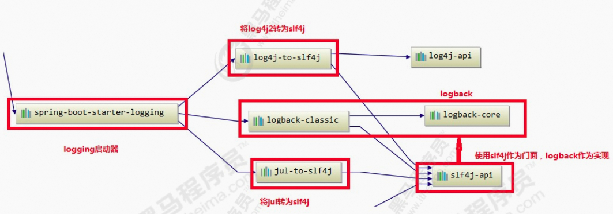

**笔记来源：**[**黑马程序员java日志框架教程，全面深入学习多种java日志框架**](https://www.bilibili.com/video/BV1iJ411H74S/?p=10&spm_id_from=pageDriver&vd_source=e8046ccbdc793e09a75eb61fe8e84a30)

------


# 1 SpringBoot中的日志设计
springboot框架在企业中的使用越来越普遍，springboot日志也是开发中常用的日志系统。springboot默认就是使用SLF4J作为日志门面，logback作为日志实现来记录日志。 

springboot中的日志

```xml
<dependency>
    spring-boot-starter-logging</artifactId>
    <groupId>org.springframework.boot</groupId>
</dependency>
```

依赖关系图:

  
总结：

1. springboot 底层默认使用logback作为日志实现。
2. 使用了SLF4J作为日志门面
3. 将JUL也转换成slf4j
4. 也可以使用log4j2作为日志门面，但是最终也是通过slf4j调用logback

# 2 SpringBoot日志使用 
在springboot中测试打印日志

```java
package com.itheima.springboot_log;

import org.apache.logging.log4j.LogManager;
import org.junit.jupiter.api.Test;
import org.slf4j.Logger;
import org.slf4j.LoggerFactory;
import org.springframework.boot.test.context.SpringBootTest;

@SpringBootTest
class SpringbootLogApplicationTests {

    // 声明日志记录器对象
    public static final Logger LOGGER = LoggerFactory.getLogger(SpringbootLogApplicationTests.class);

    @Test
    public void contextLoads() {
        // 打印日志信息
        LOGGER.error("error");
        LOGGER.warn("warn");
        LOGGER.info("info"); // 默认日志级别
        LOGGER.debug("debug");
        LOGGER.trace("trace");
    }
}

```

修改默认日志配置

```properties
logging.level.com.itheima=trace
# 178. 在控制台输出的日志的格式 同logback
logging.pattern.console=%d{yyyy-MM-dd} [%thread] [%-5level] %logger{50} -%msg%n
# 179. 指定文件中日志输出的格式
logging.file=D:/logs/springboot.log
logging.pattern.file=%d{yyyy-MM-dd} [%thread] %-5level %logger{50} - %msg%n
```

指定配置：给类路径下放上每个日志框架自己的配置文件；SpringBoot就不使用默认配置的了

| 日志框架    | 配置文件                             |
| ------- | -------------------------------- |
| Logback | `logback-spring.xm``logback.xml` |
| Log4j2  | `log4j2-spring.xml``log4j2.xml`  |
| JUL     | `logging.properties`             |


logback.xml:直接就被日志框架识别了 

使用SpringBoot解析日志配置  
logback-spring.xml：由SpringBoot解析日志配置

```xml
<encoder class="ch.qos.logback.classic.encoder.PatternLayoutEncoder">
        <springProfile name="dev">
              <pattern>${pattern}</pattern>
        </springProfile>
  
        <springProfile name="pro">
              <pattern>%d{yyyyMMdd:HH:mm:ss.SSS} [%thread] %-5level %msg%n</pattern>
        </springProfile>
</encoder>
```

application.properties

```properties
spring.profiles.active=dev
```

将日志切换为log4j2

```xml
<dependency>
    <groupId>org.springframework.boot</groupId>
  	spring-boot-starter-web</artifactId>
    <exclusions>
<!--排除logback--> 
      <exclusion>
            spring-boot-starter-logging</artifactId>
            <groupId>org.springframework.boot</groupId>
        </exclusion>
    </exclusions>
</dependency>

<!-- 添加log4j2 --> 
<dependency>
    <groupId>org.springframework.boot</groupId>
    spring-boot-starter-log4j2</artifactId>
</dependency>
  
```

