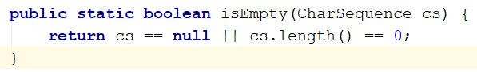

## 引入jar包
```xml
<dependency>
  <groupId>org.apache.commons</groupId>
  commons-lang3</artifactId>
  <version>3.11</version>
</dependency>
```


## isEmpty
```java
System.out.println(StringUtils.isEmpty(null));		//true
System.out.println(StringUtils.isEmpty(""));		//true
System.out.println(StringUtils.isEmpty("     "));	//false
System.out.println(StringUtils.isEmpty("aaa"));		//false
//  isNotEmpty 相当于!isEmpty,两者刚好取反
```


## isNotEmpty
```java
System.out.println(StringUtils.isNotEmpty(null));	//false
System.out.println(StringUtils.isNotEmpty(""));		//false
System.out.println(StringUtils.isNotEmpty("     "));//true
System.out.println(StringUtils.isNotEmpty("aaa"));	//true
```

判断逻辑为字符串为null，或者字符串的长度为0，源码如下：  



## isAllEmpty 
全部为空

```java
System.out.println(StringUtils.isAllEmpty(null, null));		//ture
System.out.println(StringUtils.isAllEmpty("", ""));			//true
System.out.println(StringUtils.isAllEmpty("   ", "   "));	//false
System.out.println(StringUtils.isAllEmpty("aaa", "bbb"));	//false
System.out.println(StringUtils.isAllEmpty("aaa", ""));		//false
```


## isAnyEmpty
通俗理解就是传入的字符串有一个为空就是true

```java
System.out.println(StringUtils.isAnyEmpty(null, null));		//ture
System.out.println(StringUtils.isAnyEmpty("", ""));			//true
System.out.println(StringUtils.isAnyEmpty("   ", "   "));	//false
System.out.println(StringUtils.isAnyEmpty("aaa", "bbb"));	//false
System.out.println(StringUtils.isAnyEmpty("aaa", ""));		//true
```


## isNoneEmpty 
通俗理解就是传入的字符串有一个为空就是false

```java
System.out.println(StringUtils.isNoneEmpty(null, null));			//false
System.out.println(StringUtils.isNoneEmpty("", ""));				//false
System.out.println(StringUtils.isNoneEmpty("   ", "   "));			//true
System.out.println(StringUtils.isNoneEmpty("aaa", "bbb"));			//true
System.out.println(StringUtils.isNoneEmpty("aaa", ""));				//false
```

isAnyEmpty和 isNoneEmpty刚好是取反的


## isBlank
```java
System.out.println(StringUtils.isBlank(null));						//true
System.out.println(StringUtils.isBlank(""));						//true
System.out.println(StringUtils.isBlank("     "));					//true
System.out.println(StringUtils.isBlank("aaa"));						//false
//  isNotBlank是 !isBlank，两者刚好是取反的
```


## isNotBlank
```java
System.out.println(StringUtils.isNotBlank(null));					//false
System.out.println(StringUtils.isNotBlank(""));						//false
System.out.println(StringUtils.isNotBlank("     "));				//false
System.out.println(StringUtils.isNotBlank("aaa"));					//true
```

注意与isEmpty的区别，在处理多个空格的空字符串时候是由差异的


## isAllBlank 
全部为空

```java
System.out.println(StringUtils.isAllBlank(null, null));				//true
System.out.println(StringUtils.isAllBlank("", ""));					//true
System.out.println(StringUtils.isAllBlank("   ", "   "));			//true
System.out.println(StringUtils.isAllBlank("aaa", "bbb"));			//false
```


## isAnyBlank 
通俗理解就是传入的字符串有一个为空就是ture

```java
System.out.println(StringUtils.isAnyBlank(null, null));					//ture
System.out.println(StringUtils.isAnyBlank("", ""));						//ture
System.out.println(StringUtils.isAnyBlank("   ", "   "));				//ture
System.out.println(StringUtils.isAnyBlank("aaa", ""));					//ture
System.out.println(StringUtils.isAnyBlank("aaa", "bbb"));				//false
```


## isNoneBlank 
通俗理解就是传入的字符串有一个为空就是false

```java
System.out.println(StringUtils.isNoneBlank(null, null));			//false
System.out.println(StringUtils.isNoneBlank("", ""));				//false
System.out.println(StringUtils.isNoneBlank("   ", "   "));			//false
System.out.println(StringUtils.isNoneBlank("aaa", ""));				//false
System.out.println(StringUtils.isNoneBlank("aaa", "bbb"));			//true
```

isNoneBlank 和 isAnyBlank刚好是取反的

