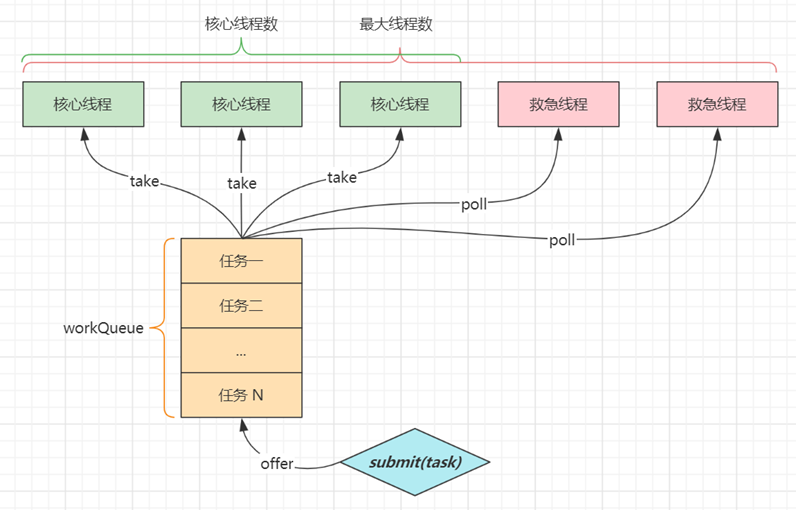
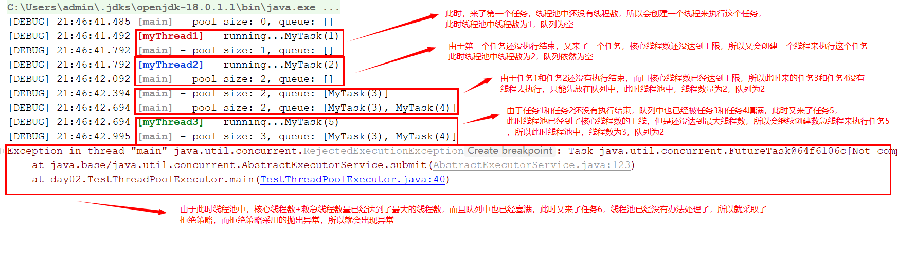
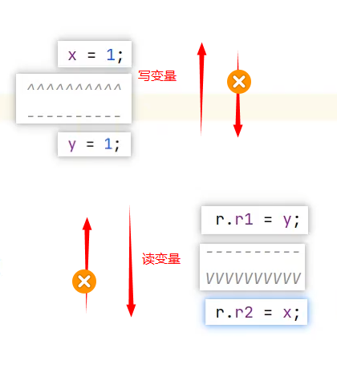
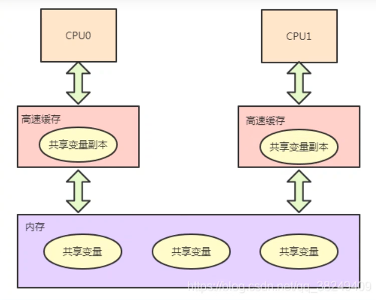

**笔记来源：**[**Java八股文面试题视频教程，Java面试八股文宝典（含阿里、腾迅大厂java面试真题，java数据结构，java并发，jvm等最新java面试真题）**](https://www.bilibili.com/video/BV15b4y117RJ/?spm_id_from=333.337.search-card.all.click&vd_source=e8046ccbdc793e09a75eb61fe8e84a30)

------


## 1. 线程状态
**要求**

+ 掌握 Java 线程六种状态
+ 掌握 Java 线程状态转换
+ 能理解五种状态与六种状态两种说法的区别


**六种状态及转换**


分别是

+ 新建 

    >- 当一个线程对象被创建，但还未调用 start 方法时处于**新建**状态
    >- 此时未与操作系统底层线程关联

+ 可运行 

    >- 调用了 start 方法，就会由**新建**进入**可运行**
    >- 此时与底层线程关联，由操作系统调度执行

+ 终结 

    >线程内代码已经执行完毕，由**可运行**进入**终结** 
    >
    >此时会取消与底层线程关联

+ 阻塞 

    >- 当获取锁失败后，由**可运行**进入 Monitor 的阻塞队列**阻塞**，此时不占用 cpu 时间
    >- 当持锁线程释放锁时，会按照一定规则唤醒阻塞队列中的**阻塞**线程，唤醒后的线程进入**可运行**状态

+ 等待 

    >- 当获取锁成功后，但由于条件不满足，调用了 wait() 方法，此时从**可运行**状态释放锁进入 Monitor 等待集合**等待**，同样不占用 cpu 时间
    >- 当其它持锁线程调用 notify() 或 notifyAll() 方法，会按照一定规则唤醒等待集合中的**等待**线程，恢复为**可运行**状态

+ 有时限等待 

    >- 当获取锁成功后，但由于条件不满足，调用了 wait(long) 方法，此时从**可运行**状态释放锁进入 Monitor 等待集合进行**有时限等待**，同样不占用 cpu 时间
    >- 当其它持锁线程调用 notify() 或 notifyAll() 方法，会按照一定规则唤醒等待集合中的**有时限等待**线程，恢复为**可运行**状态，并重新去竞争锁
    >- 如果等待超时，也会从**有时限等待**状态恢复为**可运行**状态，并重新去竞争锁
    >- 还有一种情况是调用 sleep(long) 方法也会从**可运行**状态进入**有时限等待**状态，但与 Monitor 无关，不需要主动唤醒，超时时间到自然恢复为**可运行**状态

+ 其它情况（只需了解）

    >- 可以用` interrupt()`  方法打断**等待**、**有时限等待**的线程，让它们恢复为**可运行**状态
    >- `park`  `unpark`  等方法也可以让线程等待和唤醒


**五种状态**

五种状态的说法来自于操作系统层面的划分  


+ 运行态：分到 cpu 时间，能真正执行线程内代码的

+ 就绪态：有资格分到 cpu 时间，但还未轮到它的

+ 阻塞态：没资格分到 cpu 时间的 

    > - 涵盖了 java 状态中提到的**阻塞**、**等待**、**有时限等待**
    > - 多出了阻塞 I/O，指线程在调用阻塞 I/O 时，实际活由 I/O 设备完成，此时线程无事可做，只能干等

+ 新建与终结态：与 java 中同名状态类似，不再啰嗦


## 2. 线程池
**要求**

+ 掌握线程池的 7 大核心参数


**七大参数**

1. corePoolSize 核心线程数目 - 池中会保留的最多线程数

2. maximumPoolSize 最大线程数目 - 核心线程+救急线程的最大数目

3. keepAliveTime 生存时间 - 救急线程的生存时间，生存时间内没有新任务，此线程资源会释放

4. unit 时间单位 - 救急线程的生存时间单位，如秒、毫秒等

5. workQueue - 当没有空闲核心线程时，新来任务会加入到此队列排队，队列满会创建救急线程执行任务

6. threadFactory 线程工厂 - 可以定制线程对象的创建，例如设置线程名字、是否是守护线程等

7. handler 拒绝策略 - 当所有线程都在繁忙，workQueue 也放满时，会触发拒绝策略 

    > 1. 抛异常 `java.util.concurrent.ThreadPoolExecutor.AbortPolicy` 
    > 2. 由调用者执行任务`java.util.concurrent.ThreadPoolExecutor.CallerRunsPolicy` 
    > 3. 丢弃任务 `java.util.concurrent.ThreadPoolExecutor.DiscardPolicy` 
    > 4. 丢弃最早排队任务 `java.util.concurrent.ThreadPoolExecutor.DiscardOldestPolicy` 




**代码说明** 

```java
package day02;

import org.slf4j.Logger;

import java.lang.reflect.Field;
import java.util.ArrayList;
import java.util.List;
import java.util.concurrent.*;
import java.util.concurrent.atomic.AtomicInteger;
import java.util.stream.Collectors;
import java.util.stream.IntStream;

import static day02.LoggerUtils.*;
//启动JVM加入如下参数:
// --add-opens java.base/java.util.concurrent=ALL-UNNAMED
public class TestThreadPoolExecutor {

    public static void main(String[] args) throws InterruptedException {
        AtomicInteger c = new AtomicInteger(1);
        ArrayBlockingQueue<Runnable> queue = new ArrayBlockingQueue<>(2);
        ThreadPoolExecutor threadPool = new ThreadPoolExecutor(
                2,
                3,
                0,
                TimeUnit.MILLISECONDS,
                queue,
                r -> new Thread(r, "myThread" + c.getAndIncrement()),
                new ThreadPoolExecutor.DiscardOldestPolicy());
        showState(queue, threadPool);
        threadPool.submit(new MyTask("1", 3600000));
        showState(queue, threadPool);
        threadPool.submit(new MyTask("2", 3600000));
        showState(queue, threadPool);
        threadPool.submit(new MyTask("3"));
        showState(queue, threadPool);
        threadPool.submit(new MyTask("4"));
        showState(queue, threadPool);
        threadPool.submit(new MyTask("5", 3600000));
        showState(queue, threadPool);
        threadPool.submit(new MyTask("6"));
        showState(queue, threadPool);
    }

    private static void showState(ArrayBlockingQueue<Runnable> queue, ThreadPoolExecutor threadPool) {
        try {
            Thread.sleep(300);
        } catch (InterruptedException e) {
            e.printStackTrace();
        }
        List<Object> tasks = new ArrayList<>();
        for (Runnable runnable : queue) {
            try {
                Field callable = FutureTask.class.getDeclaredField("callable");
                callable.setAccessible(true);
                Object adapter = callable.get(runnable);
                Class<?> clazz = Class.forName("java.util.concurrent.Executors$RunnableAdapter");
                Field task = clazz.getDeclaredField("task");
                task.setAccessible(true);
                Object o = task.get(adapter);
                tasks.add(o);
            } catch (Exception e) {
                e.printStackTrace();
            }
        }
        main.debug("pool size: {}, queue: {}", threadPool.getPoolSize(), tasks);
    }

    static class MyTask implements Runnable {
        private final String name;
        private final long duration;

        public MyTask(String name) {
            this(name, 0);
        }

        public MyTask(String name, long duration) {
            this.name = name;
            this.duration = duration;
        }

        @Override
        public void run() {
            try {
                LoggerUtils.get("myThread").debug("running..." + this);
                Thread.sleep(duration);
            } catch (InterruptedException e) {
                e.printStackTrace();
            }
        }

        @Override
        public String toString() {
            return "MyTask(" + name + ")";
        }
    }
}
```



## 3. wait vs sleep
**要求：** 能够说出二者区别


**简单记忆：** 一个共同点，三个不同点

共同点：`wait()`  `wait(long ` 和 `sleep(long)`  的效果都是让当前线程暂时放弃 CPU 的使用权，进入阻塞状态


不同点：

+  方法归属不同 

    >- `sleep(long)`  是 Thread 的静态方法
    >- 而 `wait()`  `wait(long)`  都是 Object 的成员方法，每个对象都有

+  醒来时机不同 

    >- 执行 `sleep(long)`  和 `wait(long)` 的线程都会在等待相应毫秒后醒来
    >- `wait(long)`  和 `wait()`  还可以被 notify 唤醒，`wait()`  如果不唤醒就一直等下去
    >- 它们都可以被打断唤醒

+  锁特性不同（重点） 

    >- wait 方法的调用必须先获取 wait 对象的锁，而 sleep 则无此限制
    >- wait 方法执行后会释放对象锁，允许其它线程获得该对象锁（我放弃 cpu，但你们还可以用）
    >- 而 sleep 如果在 synchronized 代码块中执行，并不会释放对象锁（我放弃 cpu，你们也用不了）

代码演示：

```java
package day02;

import static day02.LoggerUtils.*;

public class WaitVsSleep {
    static final Object LOCK = new Object();

    public static void main(String[] args) throws InterruptedException {
        sleeping();
    }

    private static void illegalWait() throws InterruptedException {
        //wait 方法的调用必须先获取 wait 对象的锁，而 sleep 则无此限制
        LOCK.wait();
    }

    private static void waiting() throws InterruptedException {
        Thread t1 = new Thread(() -> {
            synchronized (LOCK) {
                try {
                    LoggerUtils.get("t").debug("waiting...");
                    //wait 方法执行后会释放对象锁，允许其它线程获得该对象锁（我放弃 cpu，但你们还可以用）
                    LOCK.wait(5000L);
                } catch (InterruptedException e) {
                    LoggerUtils.get("t").debug("interrupted...");
                    e.printStackTrace();
                }
            }
        }, "t1");
        t1.start();

        Thread.sleep(100);
        synchronized (LOCK) {
            main.debug("other...");
        }

    }

    private static void sleeping() throws InterruptedException {
        Thread t1 = new Thread(() -> {
            synchronized (LOCK) {
                try {
                    get("t").debug("sleeping...");
                    //而 sleep 如果在 synchronized 代码块中执行，并不会释放对象锁（我放弃 cpu，你们也用不了）
                    Thread.sleep(5000L);
                } catch (InterruptedException e) {
                    get("t").debug("interrupted...");
                    e.printStackTrace();
                }
            }
        }, "t1");
        t1.start();

        Thread.sleep(100);
        //它们都可以被打断唤醒
//        t1.interrupt();
        synchronized (LOCK) {
            main.debug("other...");
        }
    }
}
```


## 4. lock vs synchronized
**要求**

+ 掌握 lock 与 synchronized 的区别
+ 理解 ReentrantLock 的公平、非公平锁
+ 理解 ReentrantLock 中的条件变量


不同点：从三个层面分析

+ 语法层面 

    > - synchronized 是关键字，源码在 jvm 中，用 c++ 语言实现
    > - Lock 是接口，源码由 jdk 提供，用 java 语言实现
    > - 使用 synchronized 时，退出同步代码块锁会自动释放，而使用 Lock 时，需要手动调用 unlock 方法释放锁

+ 功能层面 

    >- 二者均属于悲观锁、都具备基本的互斥、同步、锁重入功能
    >- Lock 提供了许多 synchronized 不具备的功能，例如获取等待状态、公平锁、可打断、可超时、多条件变量
    >- Lock 有适合不同场景的实现，如 ReentrantLock， ReentrantReadWriteLock

+ 性能层面 

    >- 在没有竞争时，synchronized 做了很多优化，如偏向锁、轻量级锁，性能不赖
    >- 在竞争激烈时，Lock 的实现通常会提供更好的性能

    ​


**公平锁的相关特点：** 

+ 公平锁的公平体现 

    >- **已经处在阻塞队列**中的线程（不考虑超时）始终都是公平的，先进先出
    >- 公平锁是指**未处于阻塞队列**中的线程来争抢锁，如果队列不为空，则老实到队尾等待
    >- 非公平锁是指**未处于阻塞队列**中的线程来争抢锁，与队列头唤醒的线程去竞争，谁抢到算谁的

+ 公平锁会降低吞吐量，一般不用


**ReentrantLock 中的条件变量：**

+ ReentrantLock 中的条件变量功能类似于普通 synchronized 的 wait，notify，用在当线程获得锁后，发现条件不满足时，临时等待的链表结构
+ 与 synchronized 的等待集合不同之处在于，ReentrantLock 中的条件变量可以有多个，可以实现更精细的等待、唤醒控制


**代码说明**

```java
package day02;

import java.io.IOException;
import java.lang.reflect.Field;
import java.util.*;
import java.util.concurrent.TimeUnit;
import java.util.concurrent.locks.AbstractQueuedSynchronizer;
import java.util.concurrent.locks.Condition;
import java.util.concurrent.locks.ReentrantLock;
import java.util.stream.Collectors;
import java.util.stream.IntStream;
import java.util.stream.Stream;

import static day02.LoggerUtils.*;
//添加下面这个命令到VM中
// --add-opens java.base/java.util.concurrent=ALL-UNNAMED --add-opens java.base/java.util.concurrent.locks=ALL-UNNAMED
public class TestReentrantLock {
    static final MyReentrantLock LOCK = new MyReentrantLock(true);

    static Condition c1 = LOCK.newCondition("c1");
    static Condition c2 = LOCK.newCondition("c2");

    static volatile boolean stop = false;

    public static void main(String[] args) throws InterruptedException, IOException {
        learnLock();
    }

    private static void learnLock() throws InterruptedException {
        System.out.println(LOCK);
        new MyThread(() -> {
            LOCK.lock();
            get("t").debug("acquire lock...");
        }, "t1").start();

        Thread.sleep(100);
        new MyThread(() -> {
            LOCK.lock();
            get("t").debug("acquire lock...");
        }, "t2").start();

        Thread.sleep(100);
        new MyThread(() -> {
            LOCK.lock();
            get("t").debug("acquire lock...");
        }, "t3").start();

        Thread.sleep(100);
        new MyThread(() -> {
            LOCK.lock();
            get("t").debug("acquire lock...");
        }, "t4").start();
    }

    private static void fairVsUnfair() throws InterruptedException {
        new MyThread(() -> {
            LOCK.lock();
            get("t").debug("acquire lock...");
            sleep1s();
            LOCK.unlock();
        }, "t1").start();

        Thread.sleep(100);
        new MyThread(() -> {
            LOCK.lock();
            get("t").debug("acquire lock...");
            sleep1s();
            LOCK.unlock();
        }, "t2").start();

        Thread.sleep(100);
        new MyThread(() -> {
            LOCK.lock();
            get("t").debug("acquire lock...");
            sleep1s();
            LOCK.unlock();
        }, "t3").start();

        Thread.sleep(100);
        new MyThread(() -> {
            LOCK.lock();
            get("t").debug("acquire lock...");
            sleep1s();
            LOCK.unlock();
        }, "t4").start();

        get("t").debug("{}", LOCK);

        while (!stop) {
            new Thread(() -> {
                try {
                    boolean b = LOCK.tryLock(10, TimeUnit.MILLISECONDS);
                    if (b) {
                        System.out.println(Thread.currentThread().getName() + " acquire lock...");
                        stop = true;
                        sleep1s();
                        LOCK.unlock();
                    }
                } catch (InterruptedException e) {
                    e.printStackTrace();
                }
            }).start();
        }
    }

    private static void sleep1s() {
        try {
            Thread.sleep(1000);
        } catch (InterruptedException e) {
            e.printStackTrace();
        }
    }

    private static class MyReentrantLock extends ReentrantLock {
        private final Map<String, Condition> conditions = new HashMap<>();

        public MyReentrantLock(boolean fair) {
            super(fair);
        }

        public Condition newCondition(String name) {
            Condition condition = super.newCondition();
            conditions.put(name, condition);
            return condition;
        }

        @Override
        public String toString() {
            StringBuilder sb = new StringBuilder(512);
            String queuedInfo = getQueuedInfo();
            List<String> all = new ArrayList<>();
            all.add(String.format("| owner[%s] state[%s]", this.getOwner(), this.getState()));
            all.add(String.format("| blocked queue %s", queuedInfo));
            for (Map.Entry<String, Condition> entry : this.conditions.entrySet()) {
                String waitingInfo = getWaitingInfo(entry.getValue());
                all.add(String.format("| waiting queue [%s] %s", entry.getKey(), waitingInfo));
            }
            int maxLength = all.stream().map(String::length).max(Comparator.naturalOrder()).orElse(100);
            for (String s : all) {
                sb.append(s);
                String space = IntStream.range(0, maxLength - s.length() + 7).mapToObj(i -> " ").collect(Collectors.joining(""));
                sb.append(space).append("|
");
            }
            sb.deleteCharAt(sb.length() - 1);
            String line1 = IntStream.range(0, maxLength ).mapToObj(i -> "-").collect(Collectors.joining(""));
            sb.insert(0, String.format("%n| Lock %s|%n", line1));
            maxLength += 6;
            String line3 = IntStream.range(0, maxLength).mapToObj(i -> "-").collect(Collectors.joining(""));
            sb.append(String.format("%n|%s|", line3));
            return sb.toString();
        }

        private Object getState() {
            try {
                Field syncField = ReentrantLock.class.getDeclaredField("sync");
                Class<?> aqsClass = Class.forName("java.util.concurrent.locks.AbstractQueuedSynchronizer");
                Field stateField = aqsClass.getDeclaredField("state");
                syncField.setAccessible(true);
                AbstractQueuedSynchronizer sync = (AbstractQueuedSynchronizer) syncField.get(this);
                stateField.setAccessible(true);
                return stateField.get(sync);
            } catch (Exception e) {
                e.printStackTrace();
                throw new RuntimeException(e);
            }
        }

        private String getWaitingInfo(Condition condition) {
            List<String> result = new ArrayList<>();
            try {
                Field firstWaiterField = AbstractQueuedSynchronizer.ConditionObject.class.getDeclaredField("firstWaiter");
                Class<?> conditionNodeClass = Class.forName("java.util.concurrent.locks.AbstractQueuedSynchronizer$ConditionNode");
                Class<?> nodeClass = Class.forName("java.util.concurrent.locks.AbstractQueuedSynchronizer$Node");
                Field waiterField = nodeClass.getDeclaredField("waiter");
                Field statusField = nodeClass.getDeclaredField("status");
                Field nextWaiterField = conditionNodeClass.getDeclaredField("nextWaiter");
                firstWaiterField.setAccessible(true);
                waiterField.setAccessible(true);
                statusField.setAccessible(true);
                nextWaiterField.setAccessible(true);
                Object fistWaiter = firstWaiterField.get(condition);
                while (fistWaiter != null) {
                    Object waiter = waiterField.get(fistWaiter);
                    Object status = statusField.get(fistWaiter);
                    result.add(String.format("([%s]%s)", status, waiter));
                    fistWaiter = nextWaiterField.get(fistWaiter);
                }
            } catch (Exception e) {
                e.printStackTrace();
            }
            return String.join("->", result);
        }

        private String getQueuedInfo() {
            List<String> result = new ArrayList<>();
            try {
                Field syncField = ReentrantLock.class.getDeclaredField("sync");
                Field headField = AbstractQueuedSynchronizer.class.getDeclaredField("head");
                Class<?> nodeClass = Class.forName("java.util.concurrent.locks.AbstractQueuedSynchronizer$Node");
                Field waiterField = nodeClass.getDeclaredField("waiter");
                Field statusField = nodeClass.getDeclaredField("status");
                Field nextField = nodeClass.getDeclaredField("next");
                syncField.setAccessible(true);
                AbstractQueuedSynchronizer sync = (AbstractQueuedSynchronizer) syncField.get(this);
                waiterField.setAccessible(true);
                statusField.setAccessible(true);
                nextField.setAccessible(true);
                headField.setAccessible(true);
                Object head = headField.get(sync);
                while (head != null) {
                    Object waiter = waiterField.get(head);
                    Object status = statusField.get(head);
                    result.add(String.format("({%s}%s)", status, waiter));
                    head = nextField.get(head);
                }
            } catch (Exception e) {
                e.printStackTrace();
            }
            return String.join("->", result);
        }
    }

    static class MyThread extends Thread {
        public MyThread(Runnable target, String name) {
            super(target, name);
        }

        @Override
        public String toString() {
            return this.getName();
        }
    }
}
```


## 5. volatile
**要求**

+ 掌握线程安全要考虑的三个问题
+ 掌握 volatile 能解决哪些问题


线程安全要考虑的三个问题：

- **原子性** 

  > - 起因：多线程下，不同线程的**指令发生了交错**导致的共享变量的读写混乱
  > - 解决：用悲观锁或乐观锁解决，volatile 并不能解决原子性


- **可见性** 

  >- 起因：由于**编译器优化、或缓存优化、或 CPU 指令重排序优化**导致的对共享变量所做的修改另外的线程看不到
  >- 解决：用 volatile 修饰共享变量，能够防止编译器等优化发生，让一个线程对共享变量的修改对另一个线程可见


- **有序性** 

  > - 起因：由于**编译器优化、或缓存优化、或 CPU 指令重排序优化**导致指令的实际执行顺序与编写顺序不一致
  > - 解决：用 volatile 修饰共享变量会在读、写共享变量时加入不同的屏障，阻止其他读写操作越过屏障，从而达到阻止重排序的效果


注意： 
- **volatile 变量写**加的屏障是阻止上方其它写操作越过屏障排到 **volatile 变量写**之下
- **volatile 变量读**加的屏障是阻止下方其它读操作越过屏障排到 **volatile 变量读**之上
- volatile 读写加入的屏障只能防止同一线程内的指令重排  
  


**代码说明：** 演示原子性

```java
package day02.threadsafe;

import day02.LoggerUtils;

import java.util.concurrent.CountDownLatch;

// 原子性例子

/**

 t1 10
 0: getstatic
                 t2
                 0: getstatic 10
                 3: iconst_5
                 4: isub
                 5: putstatic
                    5
 3: iconst_5
 4: iadd
 5: putstatic
 15
 
 */
public class AddAndSubtract {

    static volatile int balance = 10;

    public static void subtract() {
        int b = balance;
        b -= 5;
        balance = b;
    }

    public static void add() {
        int b = balance;
        b += 5;
        balance = b;
    }

    public static void main(String[] args) throws InterruptedException {
        CountDownLatch latch = new CountDownLatch(2);
        new Thread(() -> {
            subtract();
            latch.countDown();
        }).start();
        new Thread(() -> {
            add();
            latch.countDown();
        }).start();
        latch.await();
        LoggerUtils.get().debug("{}", balance);
    }
}
```


演示可见性

```java
package day02.threadsafe;


import static day02.LoggerUtils.get;

// 可见性例子，加到VM中，表示禁用JIT优化
// -Xint
public class ForeverLoop {
    static volatile boolean stop = false;

    public static void main(String[] args) {
        new Thread(() -> {
            try {
                Thread.sleep(100);
            } catch (InterruptedException e) {
                e.printStackTrace();
            }
            stop = true;
            get().debug("modify stop to true...");
        }).start();

        new Thread(() -> {
            try {
                Thread.sleep(200);
            } catch (InterruptedException e) {
                e.printStackTrace();
            }
            get().debug("{}", stop);
        }).start();

        new Thread(() -> {
            try {
                Thread.sleep(200);
            } catch (InterruptedException e) {
                e.printStackTrace();
            }
            get().debug("{}", stop);
        }).start();

        foo();
    }

    static void foo() {
        int i = 0;
        while (!stop) {
            i++;
        }
        get().debug("stopped... c:{}", i);
    }
}
```


  
上图从java内存模型来解释不可见性问题，其实是不准确的。

注意：本例经实践检验是编译器优化导致的可见性问题


演示有序性

```java
package day02.threadsafe;

import org.openjdk.jcstress.annotations.*;
import org.openjdk.jcstress.infra.results.II_Result;

// 有序性例子
// java -XX:+UnlockDiagnosticVMOptions -XX:+LogCompilation -jar jcstress.jar -t day02.threadsafe.Reordering.Case1
// java -XX:+UnlockDiagnosticVMOptions -XX:+LogCompilation -jar jcstress.jar -t day02.threadsafe.Reordering.Case2
// java -XX:+UnlockDiagnosticVMOptions -XX:+LogCompilation -jar jcstress.jar -t day02.threadsafe.Reordering.Case3
public class Reordering {
    @JCStressTest
    @Outcome(id = {"0, 0", "1, 1", "0, 1"}, expect = Expect.ACCEPTABLE, desc = "ACCEPTABLE")
    @Outcome(id = "1, 0", expect = Expect.ACCEPTABLE_INTERESTING, desc = "INTERESTING")
    @State
    public static class Case1 {
        int x;
        int y;

        @Actor
        public void actor1() {
            x = 1;
            y = 1;
        }

        @Actor
        public void actor2(II_Result r) {
            r.r1 = y;
            r.r2 = x;
        }
    }

    @JCStressTest
    @Outcome(id = {"0, 0", "1, 1", "0, 1"}, expect = Expect.ACCEPTABLE, desc = "ACCEPTABLE")
    @Outcome(id = "1, 0", expect = Expect.FORBIDDEN, desc = "FORBIDDEN")
    @State
    public static class Case2 {
        int x;
        volatile int y;

        @Actor
        public void actor1() {
            x = 1;
            y = 1;
        }

        @Actor
        public void actor2(II_Result r) {
            r.r1 = y;
            r.r2 = x;
        }
    }

    @JCStressTest
    @Outcome(id = {"0, 0", "1, 1", "0, 1"}, expect = Expect.ACCEPTABLE, desc = "ACCEPTABLE")
    @Outcome(id = "1, 0", expect = Expect.ACCEPTABLE_INTERESTING, desc = "ACCEPTABLE_INTERESTING")
    @State
    public static class Case3 {
        volatile int x;
        int y;

        @Actor
        public void actor1() {
            x = 1;
            y = 1;
        }

        @Actor
        public void actor2(II_Result r) {
            r.r1 = y;
            r.r2 = x;
        }
    }
}
```

需要打成 jar 包后测试，还需要加入以下jar包

```xml
<?xml version="1.0" encoding="UTF-8"?>
<project xmlns="http://maven.apache.org/POM/4.0.0"
         xmlns:xsi="http://www.w3.org/2001/XMLSchema-instance"
         xsi:schemaLocation="http://maven.apache.org/POM/4.0.0 http://maven.apache.org/xsd/maven-4.0.0.xsd">
    <modelVersion>4.0.0</modelVersion>

    <groupId>org.example</groupId>
    interview</artifactId>
    <version>1.0-SNAPSHOT</version>

    <properties>
        <maven.compiler.source>16</maven.compiler.source>
        <maven.compiler.target>16</maven.compiler.target>
    </properties>

    <dependencies>
        <dependency>
            <groupId>org.springframework</groupId>
            spring-test</artifactId>
            <version>5.3.6</version>
        </dependency>
        <dependency>
            <groupId>org.springframework</groupId>
            spring-context</artifactId>
            <version>5.3.6</version>
        </dependency>
        <dependency>
            <groupId>org.springframework</groupId>
            spring-jdbc</artifactId>
            <version>5.3.6</version>
        </dependency>
        <dependency>
            <groupId>org.openjdk.jol</groupId>
            jol-core</artifactId>
            <version>0.15</version>
        </dependency>
        <dependency>
            <groupId>com.fasterxml.jackson.core</groupId>
            jackson-databind</artifactId>
            <version>2.12.3</version>
        </dependency>
        <dependency>
            <groupId>ch.qos.logback</groupId>
            logback-classic</artifactId>
            <version>1.2.3</version>
        </dependency>
        <dependency>
            <groupId>org.openjdk.jcstress</groupId>
            jcstress-core</artifactId>
            <version>0.14</version>
        </dependency>
        <dependency>
            <groupId>mysql</groupId>
            mysql-connector-java</artifactId>
            <version>5.1.48</version>
        </dependency>
        <dependency>
            <groupId>org.apache.lucene</groupId>
            lucene-core</artifactId>
            <version>4.0.0</version>
        </dependency>
        <dependency>
            <groupId>com.alibaba</groupId>
            druid</artifactId>
            <version>1.1.17</version>
        </dependency>
        <dependency>
            <groupId>org.apache.commons</groupId>
            commons-dbcp2</artifactId>
            <version>2.8.0</version>
        </dependency>
        <dependency>
            <groupId>org.codehaus.groovy</groupId>
            groovy-all</artifactId>
            <version>3.0.8</version>
            <type>pom</type>
        </dependency>
        <dependency>
            <groupId>com.squareup.okhttp3</groupId>
            okhttp</artifactId>
            <version>4.9.1</version>
        </dependency>
        <dependency>
            <groupId>cn.hutool</groupId>
            hutool-all</artifactId>
            <version>4.5.1</version>
        </dependency>
    </dependencies>
    <build>
        <plugins>
            <plugin>
                <groupId>org.apache.maven.plugins</groupId>
                maven-compiler-plugin</artifactId>
                <version>3.8.1</version>
                <configuration>
                    <compilerArgument>--add-exports=java.base/jdk.internal.misc=ALL-UNNAMED</compilerArgument>
                </configuration>
            </plugin>
            <plugin>
                <groupId>org.apache.maven.plugins</groupId>
                maven-shade-plugin</artifactId>
                <version>2.2</version>
                <executions>
                    <execution>
                        <id>main</id>
                        <phase>package</phase>
                        <goals>
                            <goal>shade</goal>
                        </goals>
                        <configuration>
                            <finalName>jcstress</finalName>
                            <transformers>
                                <transformer
                                        implementation="org.apache.maven.plugins.shade.resource.ManifestResourceTransformer">
                                    <mainClass>org.openjdk.jcstress.Main</mainClass>
                                </transformer>
                                <transformer
                                        implementation="org.apache.maven.plugins.shade.resource.AppendingTransformer">
                                    <resource>META-INF/TestList</resource>
                                </transformer>
                            </transformers>
                        </configuration>
                    </execution>
                </executions>
            </plugin>
        </plugins>
    </build>
</project>
```


## 6. 悲观锁 vs 乐观锁


**要求：** 掌握悲观锁和乐观锁的区别


**对比悲观锁与乐观锁**

+  悲观锁的代表是 synchronized 和 Lock 锁

    >- 其核心思想是【线程只有占有了锁，才能去操作共享变量，每次只有一个线程占锁成功，获取锁失败的线程，都得停下来等待】
    >- 线程从运行到阻塞、再从阻塞到唤醒，涉及线程上下文切换，如果频繁发生，影响性能
    >- 实际上，线程在获取 synchronized 和 Lock 锁时，如果锁已被占用，都会做几次重试操作，减少阻塞的机会

+  乐观锁的代表是 AtomicInteger，使用 cas 来保证原子性 

    >- 其核心思想是【无需加锁，每次只有一个线程能成功修改共享变量，其它失败的线程不需要停止，不断重试直至成功】
    >- 由于线程一直运行，不需要阻塞，因此不涉及线程上下文切换
    >- 它需要多核 cpu 支持，且线程数不应超过 cpu 核数


**代码说明：** 演示了分别使用乐观锁和悲观锁解决原子赋值

```java
package day02;


import jdk.internal.misc.Unsafe;
//将下面命令加到VM中去
// --add-opens java.base/jdk.internal.misc=ALL-UNNAMED
public class SyncVsCas {
    static final Unsafe U = Unsafe.getUnsafe();
    static final long BALANCE = U.objectFieldOffset(Account.class, "balance");

    static class Account {
        volatile int balance = 10;
    }

    private static void showResult(Account account, Thread t1, Thread t2) {
        try {
            t1.start();
            t2.start();
            t1.join();
            t2.join();
            LoggerUtils.get().debug("{}", account.balance);
        } catch (InterruptedException e) {
            e.printStackTrace();
        }
    }

    public static void sync(Account account) {
        Thread t1 = new Thread(() -> {
            synchronized (account) {
                int old = account.balance;
                int n = old - 5;
                account.balance = n;
            }
        },"t1");

        Thread t2 = new Thread(() -> {
            synchronized (account) {
                int o = account.balance;
                int n = o + 5;
                account.balance = n;
            }
        },"t2");

        showResult(account, t1, t2);
    }

    public static void cas(Account account) {
        Thread t1 = new Thread(() -> {
            while (true) {
                int o = account.balance;
                int n = o - 5;
                if (U.compareAndSetInt(account, BALANCE, o, n)) {
                    break;
                }
            }
        },"t1");

        Thread t2 = new Thread(() -> {
            while (true) {
                int o = account.balance;
                int n = o + 5;
                if (U.compareAndSetInt(account, BALANCE, o, n)) {
                    break;
                }
            }
        },"t2");

        showResult(account, t1, t2);
    }

    private static void basicCas(Account account) {
        while (true) {
            int o = account.balance;
            int n = o + 5;
            if(U.compareAndSetInt(account, BALANCE, o, n)){
                break;
            }
        }
        System.out.println(account.balance);
    }

    public static void main(String[] args) {
        Account account = new Account();
        cas(account);
    }


}
```


## 7. Hashtable vs ConcurrentHashMap
**要求**

+ 掌握 Hashtable 与 ConcurrentHashMap 的区别
+ 掌握


更形象的演示，见资料中的 `hash-demo.jar` ，运行需要 jdk14 以上环境，进入 jar 包目录，执行下面命令

```plain
java -jar --add-exports java.base/jdk.internal.misc=ALL-UNNAMED hash-demo.jar
```


问题一：Hashtable 对比 ConcurrentHashMap

>- Hashtable 与 ConcurrentHashMap 都是线程安全的 Map 集合
>- Hashtable 并发度低，整个 Hashtable 对应一把锁，同一时刻，只能有一个线程操作它
>- ConcurrentHashMap 并发度高，整个 ConcurrentHashMap 对应多把锁，只要线程访问的是不同锁，那么不会冲突


问题二：ConcurrentHashMap 在不同版本的实现区别：

- **ConcurrentHashMap 1.7** 

  >- 数据结构：**Segment(大数组) + HashEntry(小数组) + 链表**， 每个 Segment 对应一把锁，如果多个线程访问不同的 Segment，则不会冲突
  >
  >- 并发度：Segment 数组大小即并发度，决定了同一时刻最多能有多少个线程并发访问。Segment 数组不能扩容，意味着并发度在 ConcurrentHashMap 创建时就固定了
  >
  >- 索引计算
  >
  >  + 假设大数组长度是 2^m，key 在大数组内的索引是 key 的二次 hash 值的高 m 位
  >  + 假设小数组长度是 2^n，key 在小数组内的索引是 key 的二次 hash 值的低 n 位
  >
  >- 扩容：每个小数组的扩容相对独立，小数组在超过扩容因子时会触发扩容，每次扩容翻倍
  >
  >- Segment[0] 原型：首次创建其它小数组时，会以此原型为依据，数组长度，扩容因子都会以原型为准

- **ConcurrentHashMap 1.8** 

  > - 数据结构：**Node 数组 + 链表或红黑树** ，数组的每个头节点作为锁，如果多个线程访问的头节点不同，则不会冲突。首次生成头节点时如果发生竞争，利用 cas 而非 syncronized，进一步提升性能
  >
  > - 并发度：Node 数组有多大，并发度就有多大，与 1.7 不同，Node 数组可以扩容
  >
  > - 扩容条件：Node 数组满 3/4 时就会扩容
  >
  > - 扩容单位：以链表为单位从后向前迁移链表，迁移完成的将旧数组头节点替换为 ForwardingNode
  >
  > - 扩容时并发 get 
  >
  >   >根据是否为 ForwardingNode 来决定是在新数组查找还是在旧数组查找，不会阻塞
  >   >
  >   >如果链表长度超过 1，则需要对节点进行复制（创建新节点），怕的是节点迁移后 next 指针改变
  >   >
  >   >如果链表最后几个元素扩容后索引不变，则节点无需复制
  >
  > - 扩容时并发 put 
  >
  >   >如果 put 的线程与扩容线程操作的链表是同一个，put 线程会阻塞
  >   >
  >   >如果 put 的线程操作的链表还未迁移完成，即头节点不是 ForwardingNode，则可以并发执行
  >   >
  >   >如果 put 的线程操作的链表已经迁移完成，即头结点是 ForwardingNode，则可以协助扩容
  >
  > - 与 1.7 相比是懒惰初始化
  >
  > - capacity 代表预估的元素个数，capacity / factory 来计算出初始数组大小，需要贴近 2^n 
  >
  > - loadFactor 只在计算初始数组大小时被使用，之后扩容固定为 3/4
  >
  > - 超过树化阈值时的扩容问题，如果容量已经是 64，直接树化，否则在原来容量基础上做 3 轮扩容


## 8. ThreadLocal


**要求**

+ 掌握 ThreadLocal 的作用与原理
+ 掌握 ThreadLocal 的内存释放时机


**ThreadLocal 的作用：** 

> - ThreadLocal 可以实现【资源对象】的线程隔离，让每个线程各用各的【资源对象】，避免争用引发的线程安全问题
> - ThreadLocal 同时实现了线程内的资源共享


**ThreadLocal 的原理：** 每个线程内有一个 ThreadLocalMap 类型的成员变量，用来存储资源对象

>- 调用 set 方法，就是以 ThreadLocal 自己作为 key，资源对象作为 value，放入当前线程的 ThreadLocalMap 集合中
>- 调用 get 方法，就是以 ThreadLocal 自己作为 key，到当前线程中查找关联的资源值
>- 调用 remove 方法，就是以 ThreadLocal 自己作为 key，移除当前线程关联的资源值


ThreadLocalMap 的一些特点

>- key 的 hash 值统一分配
>- 初始容量 16，扩容因子 2/3，扩容容量翻倍
>- key 索引冲突后用开放寻址法解决冲突


**弱引用 key：** ThreadLocalMap 中的 key 被设计为弱引用，原因如下：Thread 可能需要长时间运行（如线程池中的线程），如果 key 不再使用，需要在内存不足（GC）时释放其占用的内存


**ThreadLocal 的内存释放时机**

+ 被动 GC 释放 key ：仅是让 key 的内存释放，关联 value 的内存并不会释放

+ 懒惰被动释放 value 

    >- get key 时，发现是 null key，则释放其 value 内存
    >- set key 时，会使用启发式扫描，清除临近的 null key 的 value 内存，启发次数与元素个数，是否发现 null key 有关

+ 主动 remove 释放 key，value 

    >- 会同时释放 key，value 的内存，也会清除临近的 null key 的 value 内存
    >- 推荐使用它，因为一般使用 ThreadLocal 时都把它作为静态变量（即强引用），因此无法被动依靠 GC 回收

