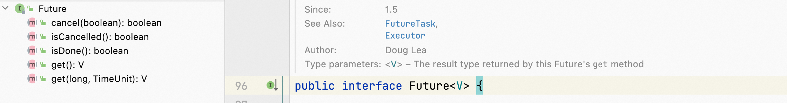
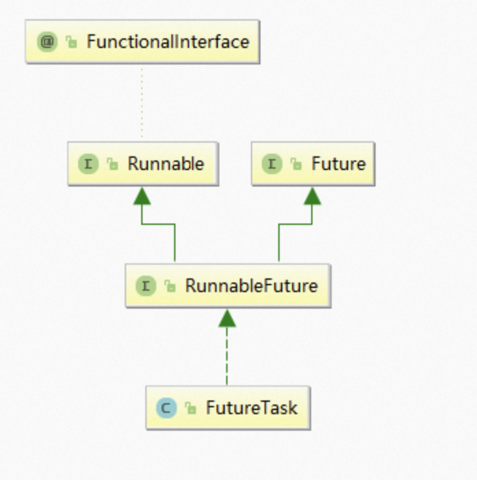

**笔记来源：**[**尚硅谷JUC并发编程（对标阿里P6-P7）**](https://www.bilibili.com/video/BV1ar4y1x727?p=1&vd_source=e8046ccbdc793e09a75eb61fe8e84a30)

# 1 Future接口介绍
Future接口（FutureTask实现类）定义了操作异步任务执行一些方法，如获取异步任务的执行结果、取消任务的执行、判断任务是否被取消、判断任务执行是否完毕等。（异步：可以被叫停，可以被取消）

一句话：Future接口可以为主线程开一个分支任务，专门为主线程处理耗时和费力的复杂业务。

比如主线程让一个子线程去执行任务，子线程可能比较耗时，启动子线程开始执行任务后，主线程就去做其他事情了，过了一会才去获取子任务的执行结果。老师在上课，但是口渴，于是让班长这个线程去买水，自己可以继续上课，实现了异步任务。

Future是Java5新加的一个接口，他提供了一种异步并行计算的功能。

如果主线程需要执行一个很耗时的计算任务，我们就可以通过Future把这个任务放到异步线程中执行。主线程继续处理其他任务或者先行结束，再通过Future获取计算结果。

目的：异步多线程任务执行且有返回结果。

三个特点：多线程/有返回/异步任务（班长作为老师去买水作为新启动的异步多线程任务且买到水有结果返回）

# 2 FutureTask
## 2.1 FutureTask的架构
FutureTask的架构图如下，不仅是实现了Future接口，还实现了FutureTask的接口。

所以说上面提到的三个特点：多线程/有返回/异步任务，此时FutureTask已经满足了两个：多线程，异步任务。那么如何实现有返回呢？

