**笔记来源：**[**尚硅谷JUC并发编程（对标阿里P6-P7）**](https://www.bilibili.com/video/BV1ar4y1x727?p=1&vd_source=e8046ccbdc793e09a75eb61fe8e84a30)  

# 1 Future接口介绍  
Future接口（FutureTask实现类）定义了操作异步任务执行一些方法，如获取异步任务的执行结果、取消任务的执行、判断任务是否被取消、判断任务执行是否完毕等。（异步：可以被叫停，可以被取消）  


一句话：Future接口可以为主线程开一个分支任务，专门为主线程处理耗时和费力的复杂业务。

比如主线程让一个子线程去执行任务，子线程可能比较耗时，启动子线程开始执行任务后，主线程就去做其他事情了，过了一会才去获取子任务的执行结果。老师在上课，但是口渴，于是让班长这个线程去买水，自己可以继续上课，实现了异步任务。

Future是Java5新加的一个接口，他提供了一种异步并行计算的功能。

如果主线程需要执行一个很耗时的计算任务，我们就可以通过Future把这个任务放到异步线程中执行。主线程继续处理其他任务或者先行结束，再通过Future获取计算结果。

目的：异步多线程任务执行且有返回结果。

三个特点：多线程/有返回/异步任务（班长作为老师去买水作为新启动的异步多线程任务且买到水有结果返回）  

# 2 FutureTask  
## 2.1 FutureTask的架构  
FutureTask的架构图如下，不仅是实现了Future接口，还实现了FutureTask的接口。

所以说上面提到的三个特点：多线程/有返回/异步任务，此时FutureTask已经满足了两个：多线程，异步任务。那么如何实现有返回呢？  


我们来看看FutureTask里面的方法吧  

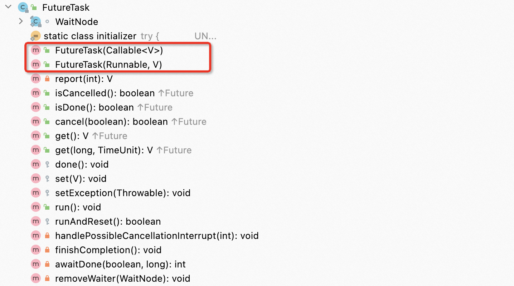

这里面的两个构造方法，其中有一个是Callable接口，我们来看看Callable接口，它是满足我们有返回这个需求的。  

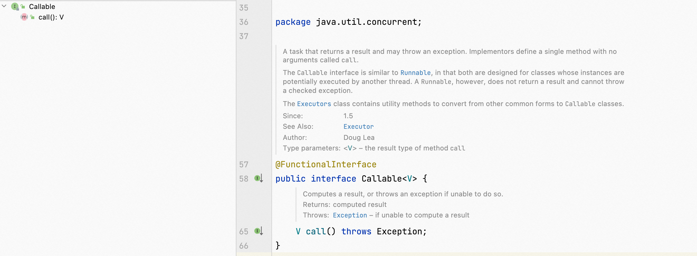

所以说，FutureTask这个实现类可以满足上面说的三个特点：多线程/有返回/异步任务  

我们再来看看，既然FutureTask作为Runable接口的实现类，那么将来异步任务必然是在其run方法里面执行的，我们来看看其run方法    

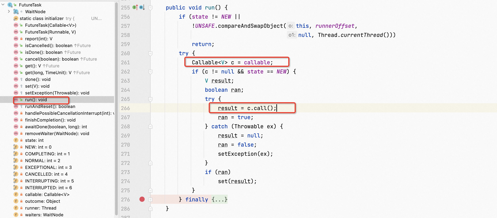

我们发现，在其run方法里面，是调用Callable接口的call方法的，所以我们的异步任务其实是写在call方法里面的  

FutureTask的初步使用    

```java
package com.bilibili.juc.cf;

import java.util.concurrent.*;

public class CompletableFutureDemo
{
    public static void main(String[] args) throws ExecutionException, InterruptedException
    {
        FutureTask<String> futureTask = new FutureTask<>(new MyThread());

        Thread t1 = new Thread(futureTask,"t1");
        t1.start();

        System.out.println(futureTask.get());
    }
}

class MyThread implements Callable<String>
{
    @Override
    public String call() throws Exception
    {
        System.out.println("-----come in call() " );
        return "hello Callable";
    }
}
```

打印出    

```java
-----come in call() 
hello Callable
```

针对上面的代码，我们来分析FutureTask的优缺点  

优点：Future结合线程池异步多线程任务配合，能够显著的提高程序的执行效率  

```java
package com.bilibili.juc.cf;

import java.util.concurrent.*;

public class FutureThreadPoolDemo
{
    public static void main(String[] args) throws ExecutionException, InterruptedException
    {
        //3个任务，目前开启多个异步任务线程来处理，请问耗时多少？

        ExecutorService threadPool = Executors.newFixedThreadPool(3);

        long startTime = System.currentTimeMillis();

        FutureTask<String> futureTask1 = new FutureTask<String>(() -> {
            try { TimeUnit.MILLISECONDS.sleep(500); } catch (InterruptedException e) { e.printStackTrace(); }
            return "task1 over";
        });
        threadPool.submit(futureTask1);

        FutureTask<String> futureTask2 = new FutureTask<String>(() -> {
            try { TimeUnit.MILLISECONDS.sleep(300); } catch (InterruptedException e) { e.printStackTrace(); }
            return "task2 over";
        });
        threadPool.submit(futureTask2);

        System.out.println(futureTask1.get());
        System.out.println(futureTask2.get());

        try { TimeUnit.MILLISECONDS.sleep(300); } catch (InterruptedException e) { e.printStackTrace(); }

        long endTime = System.currentTimeMillis();
        System.out.println("----costTime: "+(endTime - startTime) +" 毫秒");


        System.out.println(Thread.currentThread().getName()+"\t -----end");
        threadPool.shutdown();


    }

    private static void m1()
    {
        //3个任务，目前只有一个线程main来处理，请问耗时多少？

        long startTime = System.currentTimeMillis();
        //暂停毫秒
        try { TimeUnit.MILLISECONDS.sleep(500); } catch (InterruptedException e) { e.printStackTrace(); }
        try { TimeUnit.MILLISECONDS.sleep(300); } catch (InterruptedException e) { e.printStackTrace(); }
        try { TimeUnit.MILLISECONDS.sleep(300); } catch (InterruptedException e) { e.printStackTrace(); }

        long endTime = System.currentTimeMillis();
        System.out.println("----costTime: "+(endTime - startTime) +" 毫秒");

        System.out.println(Thread.currentThread().getName()+"\t -----end");
    }
}
```

缺点  

+ get()方法引起阻塞：一旦调用get()方法求结果，如果计算没有完成容易导致程序阻塞。
+ idDone()轮训：轮训的方式会耗费无谓的CPU资源，而且也不见得能及时的得到计算结果，如果想要异步获取结果，通常都会以轮训的方式去获取结果，尽量不要阻塞。

```java
package com.bilibili.juc.cf;

import java.util.concurrent.ExecutionException;
import java.util.concurrent.FutureTask;
import java.util.concurrent.TimeUnit;
import java.util.concurrent.TimeoutException;

public class FutureAPIDemo
{
    public static void main(String[] args) throws ExecutionException, InterruptedException, TimeoutException
    {
        FutureTask<String> futureTask = new FutureTask<String>( () -> {
            System.out.println(Thread.currentThread().getName()+"\t -----come in");
            try { TimeUnit.SECONDS.sleep(5); } catch (InterruptedException e) { e.printStackTrace(); }
            return "task over";
        });
        Thread t1 = new Thread(futureTask, "t1");
        t1.start();

        System.out.println(Thread.currentThread().getName()+"\t ----忙其它任务了");

        //System.out.println(futureTask.get());
        //System.out.println(futureTask.get(3,TimeUnit.SECONDS));

        while(true)
        {
            if(futureTask.isDone())
            {
                System.out.println(futureTask.get());
                break;
            }else{
                //暂停毫秒
                try { TimeUnit.MILLISECONDS.sleep(500); } catch (InterruptedException e) { e.printStackTrace(); }
                System.out.println("正在处理中，不要再催了，越催越慢 ，再催熄火");
            }
        }
    }
}

/**
 *	1 get容易导致阻塞，一般建议放在程序后面，一旦调用不见不散，非要等到结果才会离开，不管你是否计算完成，容易程序堵塞。
 *	2 假如我不愿意等待很长时间，我希望过时不候，可以自动离开.
 */
```

结论：Future对于结果的获取不是很友好，只能通过阻塞或者轮训的方式得到任务的结果。  

想完成一些复杂的任务，对于简单的业务场景使用Future完全可以，但是一些复杂的需求，比如：

+  回调通知：应对Future的完成时间，完成了可以告诉我，也就是我们的回调通知，通过轮训的方式去判断任务是否完成，这样非常占CPU，而且代码也不优雅。
+  创建异步任务：这个需求，Future配合线程池可以完成
+  多个任务前后依赖可以组合处理（水煮鱼）
    - 想将多个异步任务的计算结果组合起来，后一个异步任务的计算结果需要前一个异步任务的值，将两个或多个异步任务计算合成一个异步计算，这几个异步计算相互独立，同时后面这个又依赖前一个处理的结果
+  对计算速度选最快的：当Future集合中某一个任务最快结束时，返回结果，返回第一名处理结果。

针对于上述的特殊需求，使用Future之前提供的那点API就囊中羞涩，处理起来不够优雅，这时候还是让CompletableFuture以声明式的方式优雅的处理这些需求，Future能干的，CompletableFuture都能干。

# 3 CompletableFuture  
## 3.1 CompletableFuture结构  
CompletableFuture为什么出现呢？  

Future的get方法在计算完成之前会一直处在阻塞状态下，isDone方法容易耗费CPU资源，对于真正的异步处理我们是希望可以通过传入回调函数，在Future结束时候自动调用该回调函数，这样我们就不用等待结果。    

阻塞的方式和异步编程的设计理念想违背，而轮询的方式会消耗无谓的CPU资源，因此JDK8设计出CompletableFuture。  

CompletableFuture提供了一种观察者模式类似的机制，可以让任务执行完成后通知监听的一方。  

CompletableFuture类架构图    

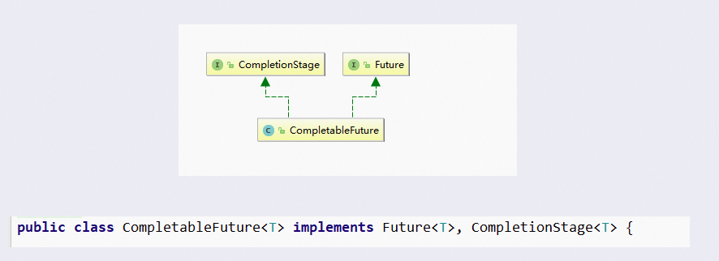

先来看看这个CompletionStage    

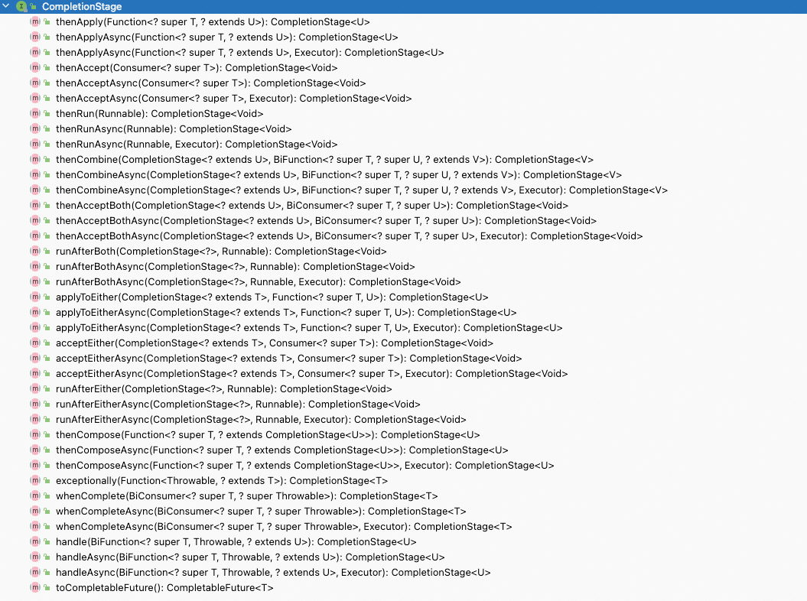

有这么多的方法，要远远的比Future复杂的多。那么CompletionStage是什么呢？  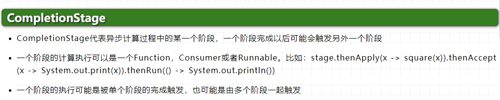

代表异步计算过程中的某一个阶段，一个阶段完成以后可能会触发另外一个阶段，有些类似Linux系统的管道分隔符传参数。  

CompletableFuture    

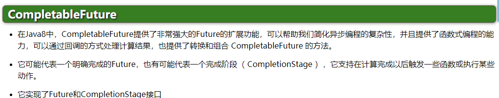

## 3.2 创建异步任务  
可以看到使用构造方法可以创建一个不完整的CompletableFuture，官方不推荐    

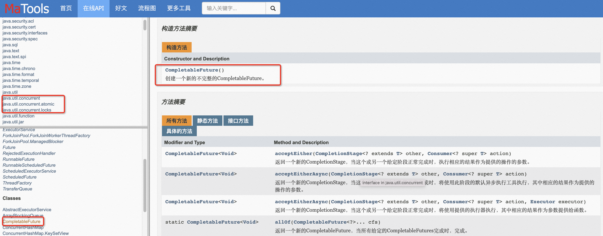

### 3.2.1 四个静态方法    
可以使用下面四个静态方法来创建异步任务    

+ runAsync：无返回值    
    - > `public static CompletableFuture<Void> runAsync(Runnable runnable)`：返回一个新的CompletableFuture，它在运行给定操作后由运行在 `ForkJoinPool.commonPool()`中的任务异步完成。  

    - > `static CompletableFuture<Void> runAsync(Runnable runnable, Executor executor)`：返回一个新的CompletableFuture，它在运行给定操作之后由在给定执行程序中运行的任务异步完成。  

+ supplyAsync：有返回值    
    - > `static <U> CompletableFuture<U> supplyAsync(Supplier<U> supplier)`：返回一个新的CompletableFuture，它通过在 `ForkJoinPool.commonPool()`中运行的任务与通过调用给定的供应商获得的值异步完成。  

    - > `static <U> CompletableFuture<U> supplyAsync(Supplier<U> supplier, Executor executor)`：返回一个新的CompletableFuture，由给定执行器中运行的任务异步完成，并通过调用给定的供应商获得的值。   

上面的Executor executor参数说明：没有指定Executor，直接使用默认的ForkJoinPool.commonPool()作为它的线程池执行异步代码，如果制定线程池，则使用我们自定义的或者特别指定的线程池执行异步代码。  

代码示例：

先看看Supplier函数式接口的用法    

```java
public static void testSupplier(){
    String test = test(new Supplier<String>() {
        @Override
        public String get() {
            return "hello";
        }
    });
    System.out.println(test);

    String test2 = test(() -> "hello");
    System.out.println(test2);
}
public static String test(Supplier<String> supplier){
    String s = supplier.get();
    return s;
}
```

创建异步任务    

```java
package com.bilibili.juc.cf;

import java.util.concurrent.*;
import java.util.function.Supplier;

public class CompletableFutureBuildDemo
{
    public static void main(String[] args) throws ExecutionException, InterruptedException
    {
        ExecutorService threadPool = Executors.newFixedThreadPool(3);
    	//无返回值
        CompletableFuture<Void> completableFuture = CompletableFuture.runAsync(() -> {
            System.out.println(Thread.currentThread().getName());
            //暂停几秒钟线程
            try { TimeUnit.SECONDS.sleep(1); } catch (InterruptedException e) { e.printStackTrace(); }
        },threadPool);

        System.out.println(completableFuture.get());

        //有返回值
        CompletableFuture<String> completableFuture2 = CompletableFuture.supplyAsync(() -> {
            System.out.println(Thread.currentThread().getName());
            //暂停几秒钟线程
            try { TimeUnit.SECONDS.sleep(1); } catch (InterruptedException e) { e.printStackTrace(); }
            return "hello supplyAsync";
        },threadPool);
        System.out.println(completableFuture2.get());
        threadPool.shutdown();
    }
}
```

那么它是如何减少阻塞和轮询的呢？从Java8开始引入了CompletableFuture，它是Future的功能增强版，减少阻塞和轮询，可以传入回调对象，当异步任务完成或者发生异常时，自动调用回调对象的回调方法。  

代码如下    

```java
package com.bilibili.juc.cf;

import java.util.concurrent.*;

/**
 * @auther zzyy
 * @create 2022-01-16 16:53
 */
public class CompletableFutureUseDemo
{
    public static void main(String[] args) throws ExecutionException, InterruptedException
    {

        ExecutorService threadPool = Executors.newFixedThreadPool(3);

        try
        {
            CompletableFuture.supplyAsync(() -> {
                System.out.println(Thread.currentThread().getName() + "----come in");
                int result = ThreadLocalRandom.current().nextInt(10);
                try { TimeUnit.SECONDS.sleep(1); } catch (InterruptedException e) { e.printStackTrace(); }
                System.out.println("-----1秒钟后出结果：" + result);
                if(result > 2)
                {
                    int i=10/0;
                }
                return result;
            },threadPool).whenComplete((v,e) -> {
                if (e == null) {
                    System.out.println("-----计算完成，更新系统UpdateValue："+v);
                }
            }).exceptionally(e -> {
                e.printStackTrace();
                System.out.println("异常情况："+e.getCause()+"\t"+e.getMessage());
                return null;
            });

            System.out.println(Thread.currentThread().getName()+"线程先去忙其它任务");
        }catch (Exception e){
            e.printStackTrace();
        }finally {
            threadPool.shutdown();
        }

        //主线程不要立刻结束，否则CompletableFuture默认使用的线程池会立刻关闭：暂停3秒钟线程
        //也可以换成自己自定义的线程池来解决这个问题，不用ForkJoinPool默认的线程池
        //try { TimeUnit.SECONDS.sleep(3); } catch (InterruptedException e) { e.printStackTrace(); }

    }

    private static void future1() throws InterruptedException, ExecutionException
    {
        CompletableFuture<Integer> completableFuture = CompletableFuture.supplyAsync(() -> {
            System.out.println(Thread.currentThread().getName() + "----come in");
            int result = ThreadLocalRandom.current().nextInt(10);
            try {
                TimeUnit.SECONDS.sleep(1);
            } catch (InterruptedException e) {
                e.printStackTrace();
            }
            System.out.println("-----1秒钟后出结果：" + result);
            return result;
        });

        System.out.println(Thread.currentThread().getName()+"线程先去忙其它任务");

        System.out.println(completableFuture.get());
    }
}
```

CompletableFuture的优点：  

+  异步任务结束时，会自动回调某个对象的方法；  
+  主线程设置好回调后，不再关心异步任务的执行，异步任务之间可以顺序的执行；  
+  异步任务出错时，会自动回调某个对象的方法；  

# 4 案例精讲  
复习函数式编程：[Java8：Lambda表达式](https://www.yuque.com/u21918439/java/wifqx4)  

几大函数式接口    

+ Runnable：无参数，无返回值  
+ Function：接受一个参数，并且有返回值  
+ Consumer：接受一个参数，无返回值  
+ BiConsumer：接受两个参数，无返回值  
+ Supplier：没有参数，有一个返回值    

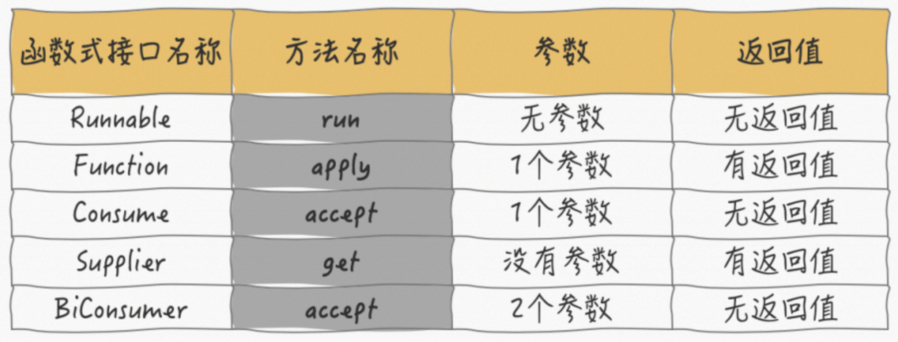

代码如下：  

```java
package com.bilibili.juc;

import java.util.function.BiConsumer;
import java.util.function.Consumer;
import java.util.function.Function;
import java.util.function.Supplier;

public class Test {

    public static void main(String[] args) {
        testRunnable(new Runnable() {
            @Override
            public void run() {

            }
        });
        testConsumer(new Consumer() {
            @Override
            public void accept(Object o) {

            }
        });
        testFunction(new Function<String, Integer>() {
            @Override
            public Integer apply(String s) {
                return 1;
            }
        });
        testSupplier(new Supplier<String>() {
            @Override
            public String get() {
                return "hello";
            }
        });
        testBiConsumer(new BiConsumer<String, String>() {
            @Override
            public void accept(String s, String s2) {
                
            }
        });
    }
    

    public static void testRunnable(Runnable runnable){
    }
    public static void testConsumer(Consumer consumer){
    }
    public static void testFunction(Function<String,Integer> function){
    }
    public static void testSupplier(Supplier<String> supplier){
    }
    public static void testBiConsumer(BiConsumer<String,String> biConsumer){
    }
}
```

get方法和join方法的区别：两者在功能上并无太大区别，都是获得异步任务的结果，只是get会在代码检查时抛出异常，join在代码书写阶段不会出现任何异常。  

```java
package com.bilibili.juc;

import java.util.concurrent.CompletableFuture;
import java.util.concurrent.ExecutionException;
import java.util.function.Supplier;

public class TestGetAndJoin {

    public static void main(String[] args) throws ExecutionException, InterruptedException {
        CompletableFuture<String> stringCompletableFuture = CompletableFuture.supplyAsync(new Supplier<String>() {
            @Override
            public String get() {
                return "hello";
            }
        });
        System.out.println(stringCompletableFuture.get());
    }
    public static void testJoin(){
        CompletableFuture<String> stringCompletableFuture = CompletableFuture.supplyAsync(new Supplier<String>() {
            @Override
            public String get() {
                return "hello";
            }
        });
        System.out.println(stringCompletableFuture.join());
    }
}
```

**案例使用：**在实际生产开发中，先功能，再性能    

> 需求说明：  
>
> - 同一款产品，同时搜索出同款产品在各大电商平台的售价  
> - 同一款产品，工时搜索出本产品在同一个电商平台下，各个入驻卖家售价是多少    
>
> 输出返回：出来结果是同款产品在不同地方的价格清单列表，返回一个List  
>
> - 《MySQL》 in jd price is 88.05  
> - 《MySQL》 in dangdang price is 86.11  
> - 《MySQL》 in taobao price is 90.43  
>
> 解决方案：比对同一个商品在各个平台上的价格，要求获取一个清单列表  
>
> - step by step：按部就班，查完京东，再查淘宝，再查当当...  
> - all in：万箭齐发，一口气多线程异步任务同时查询...  


代码如下：  

```java
package com.bilibili.juc.cf;

import lombok.*;
import lombok.experimental.Accessors;

import java.awt.print.Book;
import java.math.BigDecimal;
import java.util.ArrayList;
import java.util.Arrays;
import java.util.List;
import java.util.concurrent.CompletableFuture;
import java.util.concurrent.ExecutionException;
import java.util.concurrent.ThreadLocalRandom;
import java.util.concurrent.TimeUnit;
import java.util.stream.Collectors;

/**
 *
 * 案例说明：电商比价需求，模拟如下情况：
 *
 * 1 需求：
 *   1.1 同一款产品，同时搜索出同款产品在各大电商平台的售价;
 *   1.2 同一款产品，同时搜索出本产品在同一个电商平台下，各个入驻卖家售价是多少
 *
 * 2 输出：出来结果希望是同款产品的在不同地方的价格清单列表，返回一个List<String>
 *  《mysql》 in jd price is 88.05
 *  《mysql》 in dangdang price is 86.11
 *  《mysql》 in taobao price is 90.43
 *
 * 3 技术要求
 *   3.1 函数式编程
 *   3.2 链式编程
 *   3.3 Stream流式计算
 */
public class CompletableFutureMallDemo
{
    static List<NetMall> list = Arrays.asList(
            new NetMall("jd"),
            new NetMall("dangdang"),
            new NetMall("taobao"),
            new NetMall("pdd"),
            new NetMall("tmall")
    );

    /**
     * step by step 一家家搜查
     * List<NetMall> ----->map------> List<String>
     * @param list
     * @param productName
     * @return
     */
    public static List<String> getPrice(List<NetMall> list,String productName)
    {
        //《mysql》 in taobao price is 90.43
        return list
                .stream()
                .map(netMall ->
                        String.format(productName + " in %s price is %.2f",
                                netMall.getNetMallName(),
                                netMall.calcPrice(productName)))
                .collect(Collectors.toList());
    }

    /**
     * List<NetMall> ----->List<CompletableFuture<String>>------> List<String>
     * @param list
     * @param productName
     * @return
     */
    public static List<String> getPriceByCompletableFuture(List<NetMall> list,String productName)
    {
        return list.stream().map(netMall ->
                CompletableFuture.supplyAsync(() -> String.format(productName + " in %s price is %.2f",
                netMall.getNetMallName(),
                netMall.calcPrice(productName))))
                .collect(Collectors.toList())
                .stream()
                .map(s -> s.join())
                .collect(Collectors.toList());
    }


    public static void main(String[] args)
    {
        long startTime = System.currentTimeMillis();
        List<String> list1 = getPrice(list, "mysql");
        for (String element : list1) {
            System.out.println(element);
        }
        long endTime = System.currentTimeMillis();
        System.out.println("----costTime: "+(endTime - startTime) +" 毫秒");

        System.out.println("--------------------");

        long startTime2 = System.currentTimeMillis();
        List<String> list2 = getPriceByCompletableFuture(list, "mysql");
        for (String element : list2) {
            System.out.println(element);
        }
        long endTime2 = System.currentTimeMillis();
        System.out.println("----costTime: "+(endTime2 - startTime2) +" 毫秒");
    }
}

class NetMall
{
    @Getter
    private String netMallName;

    public NetMall(String netMallName)
    {
        this.netMallName = netMallName;
    }

    public double calcPrice(String productName)
    {
        try { TimeUnit.SECONDS.sleep(1); } catch (InterruptedException e) { e.printStackTrace(); }

        return ThreadLocalRandom.current().nextDouble() * 2 + productName.charAt(0);
    }
}
```

结果输出：  

```java
mysql in jd price is 109.73
mysql in dangdang price is 109.31
mysql in taobao price is 109.39
mysql in pdd price is 110.83
mysql in tmall price is 109.66
----costTime: 5152 毫秒


--------------------
mysql in jd price is 110.64
mysql in dangdang price is 110.57
mysql in taobao price is 109.93
mysql in pdd price is 109.90
mysql in tmall price is 110.44
----costTime: 1011 毫秒
```

# 5 CompletableFuture常用方法  
## 5.1 获得结果和触发计算  
+ 获得结果  
    - public T get()：不见不散  
    - public T get(long timeout, TimeUnit unit)：过时不候  
    - public T getNow(T valueIfAbsent)：没有计算完成的情况下，给我一个替代结果，立即获取结果不阻塞，计算完，返回计算完成后的结果，没计算完，返回设定的valueIfAbsent值  
    - public T join()：同get方法  
+ 主动触发计算  
    - public boolean complete(T value)：是否打断get方法，立即返回括号里的值  

代码如下：  

```java
package com.bilibili.juc.cf;

import java.util.concurrent.CompletableFuture;
import java.util.concurrent.ExecutionException;
import java.util.concurrent.TimeUnit;
import java.util.concurrent.TimeoutException;


public class CompletableFutureAPIDemo
{
    public static void main(String[] args) throws ExecutionException, InterruptedException, TimeoutException {
        group1();
    }

    /**
     * 获得结果和触发计算
     * @throws InterruptedException
     * @throws ExecutionException
     */
    private static void group1() throws InterruptedException, ExecutionException, TimeoutException {
        CompletableFuture<String> completableFuture = CompletableFuture.supplyAsync(() -> {
            //暂停几秒钟线程
            try {
                TimeUnit.SECONDS.sleep(1);
            } catch (InterruptedException e) {
                e.printStackTrace();
            }
            return "abc";
        });

        System.out.println(completableFuture.get());
        System.out.println(completableFuture.get(2L,TimeUnit.SECONDS));
        System.out.println(completableFuture.join());

        //暂停几秒钟线程
        try { TimeUnit.SECONDS.sleep(2); } catch (InterruptedException e) { e.printStackTrace(); }

        System.out.println(completableFuture.getNow("xxx"));
        System.out.println(completableFuture.complete("completeValue")+"\t"+completableFuture.get());
    }
}

```

上述代码执行结果如下  

```java
abc
abc
abc
abc
false	abc
```

如果将completableFuture任务的花费时间改为3s，而下面的主线程只愿意等1s，如下：  

```java
package com.bilibili.juc.cf;

import java.util.concurrent.CompletableFuture;
import java.util.concurrent.ExecutionException;
import java.util.concurrent.TimeUnit;
import java.util.concurrent.TimeoutException;

public class CompletableFutureAPIDemo
{
    public static void main(String[] args) throws ExecutionException, InterruptedException, TimeoutException {
        group1();
    }

    /**
     * 获得结果和触发计算
     * @throws InterruptedException
     * @throws ExecutionException
     */
    private static void group1() throws InterruptedException, ExecutionException, TimeoutException {
        CompletableFuture<String> completableFuture = CompletableFuture.supplyAsync(() -> {
            //暂停几秒钟线程
            try {
                TimeUnit.SECONDS.sleep(3);
            } catch (InterruptedException e) {
                e.printStackTrace();
            }
            return "abc";
        });

//        System.out.println(completableFuture.get());
//        System.out.println(completableFuture.get(2L,TimeUnit.SECONDS));
//        System.out.println(completableFuture.join());

        //暂停几秒钟线程
        try { TimeUnit.SECONDS.sleep(1); } catch (InterruptedException e) { e.printStackTrace(); }

        System.out.println(completableFuture.getNow("xxx"));
        System.out.println(completableFuture.complete("completeValue")+"\t"+completableFuture.get());
    }
}
```

输出如下：  

```java
xxx
true	completeValue
```

## 5.2 对计算结果进行处理  
两个方法：

+ thenApply：计算结果存在依赖关系，这两个线程串行化。由于存在依赖关系（当前步骤错，不走下一步），当前步骤有异常的话就叫停  
+ handle：计算结果存在依赖关系，这两个线程串行化，有异常也可以往下一步走，根据带的异常参数可以进一步处理  


thenApply代码： 

```java
package com.bilibili.juc.cf;

import java.util.concurrent.CompletableFuture;
import java.util.concurrent.ExecutorService;
import java.util.concurrent.Executors;
import java.util.concurrent.TimeUnit;

/**
 * @auther zzyy
 * @create 2022-01-17 16:36
 */
public class TestThenApply
{
    public static void main(String[] args)
    {
        ExecutorService threadPool = Executors.newFixedThreadPool(3);

        CompletableFuture.supplyAsync(() ->{
            //暂停几秒钟线程
            try { TimeUnit.SECONDS.sleep(1); } catch (InterruptedException e) { e.printStackTrace(); }
            System.out.println("111");
            return 1;
        },threadPool).thenApply((f) -> {
            //int i=10/0;
            System.out.println("222");
            return f + 2;
        }).thenApply((f) -> {
            System.out.println("333");
            return f + 3;
        }).whenComplete((v,e) -> {
            if (e == null) {
                System.out.println("----计算结果： "+v);
            }
        }).exceptionally(e -> {
            e.printStackTrace();
            System.out.println(e.getMessage());
            return null;
        });

        System.out.println(Thread.currentThread().getName()+"----主线程先去忙其它任务");

        threadPool.shutdown();
    }
}

```

输出

```java
111
222
333
----计算结果： 6
```

handle方法测试代码  

```java
package com.bilibili.juc.cf;

import java.util.concurrent.CompletableFuture;
import java.util.concurrent.ExecutorService;
import java.util.concurrent.Executors;
import java.util.concurrent.TimeUnit;

/**
 * @auther zzyy
 * @create 2022-01-17 16:36
 */
public class CompletableFutureAPI2Demo
{
    public static void main(String[] args)
    {
        ExecutorService threadPool = Executors.newFixedThreadPool(3);

        CompletableFuture.supplyAsync(() ->{
            //暂停几秒钟线程
            try { TimeUnit.SECONDS.sleep(1); } catch (InterruptedException e) { e.printStackTrace(); }
            System.out.println("111");
            return 1;
        },threadPool).handle((f,e) -> {
            //int i=10/0;
            System.out.println("222");
            return f + 2;
        }).handle((f,e) -> {
            System.out.println("333");
            return f + 3;
        }).whenComplete((v,e) -> {
            if (e == null) {
                System.out.println("----计算结果： "+v);
            }
        }).exceptionally(e -> {
            e.printStackTrace();
            System.out.println(e.getMessage());
            return null;
        });

        System.out.println(Thread.currentThread().getName()+"----主线程先去忙其它任务");

        threadPool.shutdown();
    }
}

```

输出  

```java
main----主线程先去忙其它任务
111
222
333
----计算结果： 6
```

## 5.2 对计算结果进行消费  
接受任务的处理结果，并消费处理，无返回结果  

主要看下面三个方法的区别：  

+ public CompletableFuture<Void> thenRun(Runnable action)：任务A执行完成后执行B，并且B不需要A的结果  
+ public CompletableFuture<Void> thenAccept(Consumer<? super T> action)：任务A执行完成后执行B，B需要A的结果，但是任务B无返回值  
+ public <U> CompletableFuture<U> thenApply(Function<? super T,? extends U> fn)：任务A执行完成后执行B，B需要A的结果，但是任务B有返回值  

代码如下：  

```java
package com.bilibili.juc.cf;

import java.util.concurrent.CompletableFuture;

/**
 * @auther zzyy
 * @create 2022-01-17 17:18
 */
public class CompletableFutureAPI3Demo
{
    public static void main(String[] args)
    {
        CompletableFuture.supplyAsync(() -> {
            return 1;
        }).thenApply(f ->{
            return f + 2;
        }).thenApply(f ->{
            return f + 3;
        }).thenAccept(System.out::println);

        System.out.println(CompletableFuture.supplyAsync(() -> "resultA").thenRun(() -> {}).join());
        CompletableFuture<Void> c = CompletableFuture.supplyAsync(() -> "resultA").thenAccept(r -> System.out.println(r));
        System.out.println(c.join());
        System.out.println(CompletableFuture.supplyAsync(() -> "resultA").thenApply(r -> r + " resultB").join());
    }
}

```

输出：

```java
6
null
resultA
null
resultA resultB
```

## 5.3 CompletableFuture线程池选择  
以thenRun和thenRunAsync为例，有什么区别呢？  

1. 没有传入自定义线程池，thenRun和thenRunAsync都使用ForkJoinPool  
2. 传入一个自定义的线程池，如果执行第一个任务的时候，传入了一个自定义的线程池  
    - 调用thenRun方法执行第二个任务时，则第二个任务和第一个任务是共用同一个线程池  
    - 调用thenRunAsync方法执行第二个任务时，则第一个任务使用的是自己传入的线程池，第二个任务使用的是ForkJoinPool线程池  
3. 有可能处理的太快，系统优化切换原则，直接使用main线程处理  
4. thenAccept和thenAcceptAsync，thenApply和thenApplyAsync等，他们之间的区别也是同理  

代码演示如下：  

调用thenRun方法执行第二个任务时，则第二个任务和第一个任务是共用同一个线程池  

```java
package com.bilibili.juc.cf;

import java.util.concurrent.*;

/**
 * @auther zzyy
 * @create 2022-01-17 17:45
 */
public class CompletableFutureWithThreadPoolDemo
{
    public static void main(String[] args)
    {
        ExecutorService threadPool = Executors.newFixedThreadPool(5);

        try
        {
            CompletableFuture<Void> completableFuture = CompletableFuture.supplyAsync(() -> {
                try { TimeUnit.MILLISECONDS.sleep(20); } catch (InterruptedException e) { e.printStackTrace(); }
                System.out.println("1号任务" + "\t" + Thread.currentThread().getName());
                return "abcd";
            },threadPool).thenRun(() -> {
                try { TimeUnit.MILLISECONDS.sleep(20); } catch (InterruptedException e) { e.printStackTrace(); }
                System.out.println("2号任务" + "\t" + Thread.currentThread().getName());
            }).thenRun(() -> {
                try { TimeUnit.MILLISECONDS.sleep(10); } catch (InterruptedException e) { e.printStackTrace(); }
                System.out.println("3号任务" + "\t" + Thread.currentThread().getName());
            }).thenRun(() -> {
                try { TimeUnit.MILLISECONDS.sleep(10); } catch (InterruptedException e) { e.printStackTrace(); }
                System.out.println("4号任务" + "\t" + Thread.currentThread().getName());
            });
            System.out.println(completableFuture.get(2L, TimeUnit.SECONDS));
        }catch (Exception e){
            e.printStackTrace();
        }finally {
            threadPool.shutdown();
        }
    }
}
```

输出

```java 
1号任务	pool-1-thread-1
2号任务	pool-1-thread-1
3号任务	pool-1-thread-1
4号任务	pool-1-thread-1
null
```


调用thenRunAsync方法执行第二个任务时，则第一个任务使用的是自己传入的线程池，第二个任务使用的是ForkJoinPool线程池

```java
package com.bilibili.juc.cf;

import java.util.concurrent.*;

/**
 * @auther zzyy
 * @create 2022-01-17 17:45
 */
public class CompletableFutureWithThreadPoolDemo
{
    public static void main(String[] args)
    {
        ExecutorService threadPool = Executors.newFixedThreadPool(5);

        try
        {
            CompletableFuture<Void> completableFuture = CompletableFuture.supplyAsync(() -> {
                try { TimeUnit.MILLISECONDS.sleep(20); } catch (InterruptedException e) { e.printStackTrace(); }
                System.out.println("1号任务" + "\t" + Thread.currentThread().getName());
                return "abcd";
            },threadPool).thenRunAsync(() -> {
                try { TimeUnit.MILLISECONDS.sleep(20); } catch (InterruptedException e) { e.printStackTrace(); }
                System.out.println("2号任务" + "\t" + Thread.currentThread().getName());
            }).thenRun(() -> {
                try { TimeUnit.MILLISECONDS.sleep(10); } catch (InterruptedException e) { e.printStackTrace(); }
                System.out.println("3号任务" + "\t" + Thread.currentThread().getName());
            }).thenRun(() -> {
                try { TimeUnit.MILLISECONDS.sleep(10); } catch (InterruptedException e) { e.printStackTrace(); }
                System.out.println("4号任务" + "\t" + Thread.currentThread().getName());
            });
            System.out.println(completableFuture.get(2L, TimeUnit.SECONDS));
        }catch (Exception e){
            e.printStackTrace();
        }finally {
            threadPool.shutdown();
        }
    }
}
```

输出  

```java
1号任务	pool-1-thread-1
2号任务	ForkJoinPool.commonPool-worker-1
3号任务	ForkJoinPool.commonPool-worker-1
4号任务	ForkJoinPool.commonPool-worker-1
null
```

有可能处理的太快，系统优化切换原则，直接使用main线程处理  

```java
package com.bilibili.juc.cf;

import java.util.concurrent.*;

/**
 * @auther zzyy
 * @create 2022-01-17 17:45
 */
public class CompletableFutureWithThreadPoolDemo
{
    public static void main(String[] args)
    {
        ExecutorService threadPool = Executors.newFixedThreadPool(5);

        try
        {
            CompletableFuture<Void> completableFuture = CompletableFuture.supplyAsync(() -> {
                //try { TimeUnit.MILLISECONDS.sleep(20); } catch (InterruptedException e) { e.printStackTrace(); }
                System.out.println("1号任务" + "\t" + Thread.currentThread().getName());
                return "abcd";
            },threadPool).thenRun(() -> {
                try { TimeUnit.MILLISECONDS.sleep(20); } catch (InterruptedException e) { e.printStackTrace(); }
                System.out.println("2号任务" + "\t" + Thread.currentThread().getName());
            }).thenRun(() -> {
                try { TimeUnit.MILLISECONDS.sleep(10); } catch (InterruptedException e) { e.printStackTrace(); }
                System.out.println("3号任务" + "\t" + Thread.currentThread().getName());
            }).thenRun(() -> {
                try { TimeUnit.MILLISECONDS.sleep(10); } catch (InterruptedException e) { e.printStackTrace(); }
                System.out.println("4号任务" + "\t" + Thread.currentThread().getName());
            });
            System.out.println(completableFuture.get(2L, TimeUnit.SECONDS));
        }catch (Exception e){
            e.printStackTrace();
        }finally {
            threadPool.shutdown();
        }
    }
}

```

输出  

```java
1号任务	pool-1-thread-1
2号任务	main
3号任务	main
4号任务	main
null
```

**源码分析： ** 

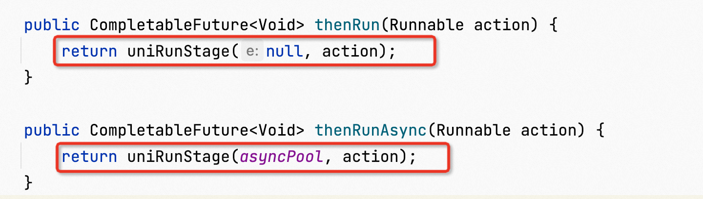

可以看到thenRun和thenRunAsync两个方法的区别，在于thenRunAsync传入了一个asyncPool参数  

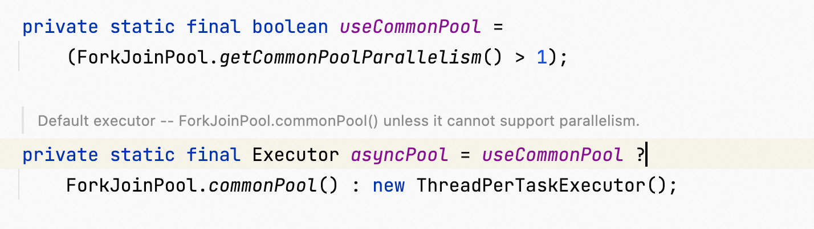

useCommonPool的判断条件基本都是true，所以三元运算符的结果基本都是ForkJoinPool.commonPool()。  

这样的话，调用thenRunAsync方法，第一个参数传入的都是ForkJoinPool。而thenRun传的是null，所以沿用的是任务的线程池，也就是我们自定义的线程池。  

## 5.4 对计算速度进行选用  
谁快用谁  

```java
package com.bilibili.juc.cf;

import java.util.concurrent.CompletableFuture;
import java.util.concurrent.TimeUnit;

/**
 * @auther zzyy
 * @create 2022-01-17 18:44
 */
public class CompletableFutureFastDemo
{
    public static void main(String[] args)
    {
        CompletableFuture<String> playA = CompletableFuture.supplyAsync(() -> {
            System.out.println("A come in");
            try { TimeUnit.SECONDS.sleep(3); } catch (InterruptedException e) { e.printStackTrace(); }
            return "playA";
        });

        CompletableFuture<String> playB = CompletableFuture.supplyAsync(() -> {
            System.out.println("B come in");
            try { TimeUnit.SECONDS.sleep(1); } catch (InterruptedException e) { e.printStackTrace(); }
            return "playB";
        });

        CompletableFuture<String> result = playA.applyToEither(playB, f -> {
            return f + " is winer";
        });

        System.out.println(Thread.currentThread().getName()+"\t"+"-----: "+result.join());
    }
}
```

输出  

```java
A come in
B come in
main	-----: playB is winer
```

## 5.5 对计算结果进行合并  
两个CompletionStage任务都完车后，最终把两个任务的结果一起交给thenCombine来处理，先完成的先等着，等待其他分支任务  

```java
package com.bilibili.juc.cf;

import java.util.concurrent.CompletableFuture;
import java.util.concurrent.TimeUnit;

/**
 * @auther zzyy
 * @create 2022-01-17 18:59
 */
public class CompletableFutureCombineDemo
{
    public static void main(String[] args)
    {
        CompletableFuture<Integer> completableFuture1 = CompletableFuture.supplyAsync(() -> {
            System.out.println(Thread.currentThread().getName() + "\t ---启动");
            //暂停几秒钟线程
            try {
                TimeUnit.SECONDS.sleep(1);
            } catch (InterruptedException e) {
                e.printStackTrace();
            }
            return 10;
        });

        CompletableFuture<Integer> completableFuture2 = CompletableFuture.supplyAsync(() -> {
            System.out.println(Thread.currentThread().getName() + "\t ---启动");
            //暂停几秒钟线程
            try {
                TimeUnit.SECONDS.sleep(2);
            } catch (InterruptedException e) {
                e.printStackTrace();
            }
            return 20;
        });

        CompletableFuture<Integer> result = completableFuture1.thenCombine(completableFuture2, (x, y) -> {
            System.out.println("-----开始两个结果合并");
            return x + y;
        });

        System.out.println(result.join());

    }
}

```

输出  

```java
ForkJoinPool.commonPool-worker-1	 ---启动
ForkJoinPool.commonPool-worker-2	 ---启动
-----开始两个结果合并
30
```

