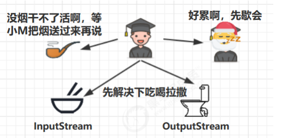
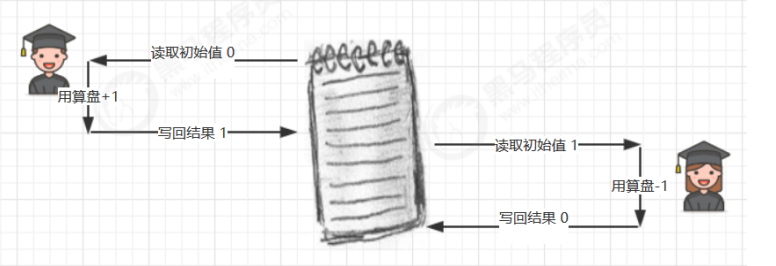
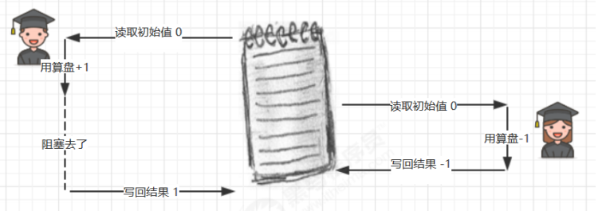
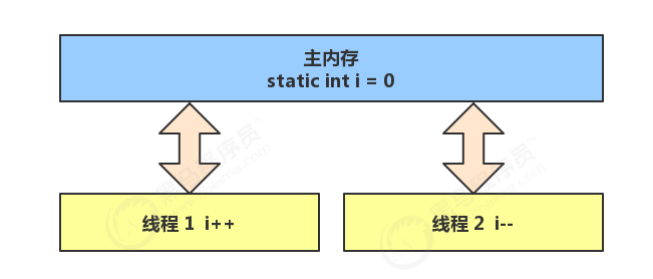
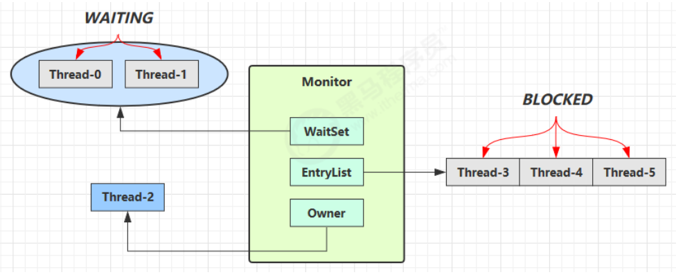

**笔记来源：**[**黑马程序员深入学习Java并发编程，JUC并发编程全套教程**](https://www.bilibili.com/video/BV16J411h7Rd/?spm_id_from=333.337.search-card.all.click&vd_source=e8046ccbdc793e09a75eb61fe8e84a30)

------


# 1 共享带来的问题
小故事：老王（操作系统）有一个功能强大的算盘（CPU），现在想把它租出去，赚一点外快


小南、小女（线程）来使用这个算盘来进行一些计算，并按照时间给老王支付费用，但小南不能一天24小时使用算盘，他经常要小憩一会（sleep），又或是去吃饭上厕所（阻塞 io 操作），有时还需要一根烟，没烟时思路全无（wait）这些情况统称为（阻塞）



在这些时候，算盘没利用起来（不能收钱了），老王觉得有点不划算，另外，小女也想用用算盘，如果总是小南占着算盘，让小女觉得不公平，于是老王灵机一动，想了个办法 [ 让他们每人用一会，轮流使用算盘 ]，这样当小南阻塞的时候，算盘可以分给小女使用，不会浪费，反之亦然，最近执行的计算比较复杂，需要存储一些中间结果，而学生们的脑容量（工作内存）不够，所以老王申请了一个笔记本（主存），把一些中间结果先记在本上，计算流程是这样的

  

但是由于分时系统，有一天还是发生了事故  
小南刚读取了初始值 0 做了个 +1 运算，还没来得及写回结果  
老王说 [ 小南，你的时间到了，该别人了，记住结果走吧 ]，于是小南念叨着 [ 结果是1，结果是1...] 不甘心地到一边待着去了（上下文切换）  
老王说 [ 小女，该你了 ]，小女看到了笔记本上还写着 0 做了一个 -1 运算，将结果 -1 写入笔记本  
这时小女的时间也用完了，老王又叫醒了小南：[小南，把你上次的题目算完吧]，小南将他脑海中的结果 1 写入了笔记本

  
小南和小女都觉得自己没做错，但笔记本里的结果是 1 而不是 0


## 1.1 Java 的体现
两个线程对初始值为 0 的静态变量一个做自增，一个做自减，各做 5000 次，结果是 0 吗？

```java
static int counter = 0;
public static void main(String[] args) throws InterruptedException { 
    Thread t1 = new Thread(() -> {
        for (int i = 0; i < 5000; i++) { 
            counter++;
        }
    }, "t1");
    Thread t2 = new Thread(() -> {
        for (int i = 0; i < 5000; i++) {
            counter--; 
        }
    }, "t2");
    t1.start();
    t2.start();
    t1.join();
    t2.join(); 
    log.debug("{}",counter);
}
```

## 1.2 问题分析
以上的结果可能是正数、负数、零。为什么呢？因为 Java 中对静态变量的自增，自减并不是原子操作，要彻底理解，必须从字节码来进行分析  
例如对于 i++ 而言（i 为静态变量），实际会产生如下的 JVM 字节码指令：

```java
getstatic i 	// 获取静态变量i的值
iconst_1 		// 准备常量1
iadd 			// 自增
putstatic i 	// 将修改后的值存入静态变量i
```

而对应 i-- 也是类似：

```java
getstatic i 	// 获取静态变量i的值
iconst_1 		// 准备常量1
isub 			// 自减
putstatic i 	// 将修改后的值存入静态变量i
```

而 Java 的内存模型如下，完成静态变量的自增，自减需要在主存和工作内存中进行数据交换：  


如果是单线程以上 8 行代码是顺序执行（不会交错）没有问题：


但多线程下这 8 行代码可能交错运行：

出现负数的情况：


出现正数的情况：


## 1.3 临界区 Critical Section
+ 一个程序运行多个线程本身是没有问题的
+ 问题出在多个线程访问共享资源 
    - 多个线程读共享资源其实也没有问题
    - 在多个线程对共享资源读写操作时发生指令交错，就会出现问题
+ 一段代码块内如果存在对共享资源的多线程读写操作，称这段代码块为**临界区**


例如，下面代码中的临界区

```java
static int counter = 0;
static void increment() 
// 临界区
{
    counter++; 
}
static void decrement() 
// 临界区
{
    counter--; 
}
```

## 1.4 竞态条件 Race Condition
多个线程在临界区内执行，由于代码的执行序列不同而导致结果无法预测，称之为发生了竞态条件

# 2 synchronized
[03-0 Synchronized的基础应用](https://www.yuque.com/chenguang201/java/dxqx0899dqrpu6ob)

# 3 变量的线程安全分析
[03-1 变量的线程安全分析](https://www.yuque.com/chenguang201/java/dvoacckhavp32drw)

# 4 习题
## 4.1 卖票练习
测试下面代码是否存在线程安全问题，并尝试改正

```java
public class ExerciseSell {
    public static void main(String[] args) {
        TicketWindow ticketWindow = new TicketWindow(2000);
        List<Thread> list = new ArrayList<>();
        // 用来存储买出去多少张票
        List<Integer> sellCount = new Vector<>();
        for (int i = 0; i < 2000; i++) {
            Thread t = new Thread(() -> {
                // 分析这里的竞态条件
                int count = ticketWindow.sell(randomAmount());
                sellCount.add(count);
            });
            list.add(t);
            t.start();
        }
        list.forEach((t) -> {
            try {
                t.join();
            } catch (InterruptedException e) {
                e.printStackTrace();
            }
        });
        // 买出去的票求和
        log.debug("selled count:{}",sellCount.stream().mapToInt(c -> c).sum());
        // 剩余票数
        log.debug("remainder count:{}", ticketWindow.getCount());
    }
    // Random 为线程安全
    static Random random = new Random();

    // 随机 1~5
    public static int randomAmount() {
        return random.nextInt(5) + 1;
    }
}
class TicketWindow {
    private int count;
    public TicketWindow(int count) {
        this.count = count;
    }


    public int getCount() {
        return count;
    }
    public int sell(int amount) {
        if (this.count >= amount) {
            this.count -= amount;
            return amount;
        } else {
            return 0;
        }
    }
}
```


## 4.2 转账练习
测试下面代码是否存在线程安全问题，并尝试改正

```java
public class ExerciseTransfer {
    public static void main(String[] args) throws InterruptedException {
        Account a = new Account(1000);
        Account b = new Account(1000);
        Thread t1 = new Thread(() -> {
            for (int i = 0; i < 1000; i++) {
                a.transfer(b, randomAmount());
            }
        }, "t1");

        Thread t2 = new Thread(() -> {
            for (int i = 0; i < 1000; i++) {
                b.transfer(a, randomAmount());
            }
        }, "t2");

        t1.start();
        t2.start();
        t1.join();
        t2.join();
        // 查看转账2000次后的总金额
        log.debug("total:{}",(a.getMoney() + b.getMoney()));
    }
    // Random 为线程安全
    static Random random = new Random();
    // 随机 1~100
    public static int randomAmount() {
        return random.nextInt(100) +1;
    }
}

class Account {
    private int money;
    public Account(int money) {
        this.money = money;
    }
    public int getMoney() {
        return money;
    }
    public void setMoney(int money) {
        this.money = money;
    }
    public void transfer(Account target, int amount) {
        if (this.money > amount) {
            this.setMoney(this.getMoney() - amount);
            target.setMoney(target.getMoney() + amount);
        }
    }
}
```

这样改正行不行，为什么？

```java
public synchronized void transfer(Account target, int amount) {
    if (this.money > amount) {
        this.setMoney(this.getMoney() - amount);
        target.setMoney(target.getMoney() + amount);
    }
}
```

# 5  Monitor 概念
## 5.1 Java 对象头
以 32 位虚拟机为例

**普通对象**

```ruby
| -------------------------------------------------------------- |     
|               Object Header (64 bits)                          |
| ------------------------------|--------------------------------|
| Mark Word (32 bits)           | Klass Word (32 bits)           |
| ------------------------------|--------------------------------|
```


**数组对象**

```ruby
|---------------------------------------------------------------------------------|
|                               Object Header (96 bits)                           |
| ---------------------------| ----------------------- | -------------------------|
| Mark Word(32bits)          | Klass Word(32bits)      | array length(32bits)     |
| ---------------------------| ----------------------- | -------------------------|
```


其中 Mark Word 结构为

```ruby

|----------------------------------------------------------------------|-----------------------------|
|                        Mark Word (32 bits)                           |          State              |
|----------------------------------------------------------------------| ----------------------------|
|        hashcode:25        |    age:4   |     biased_lock:0   |  01   |          Normal             |
|----------------------------------------------------------------------|-----------------------------|
|   thread:23   |  epoch:2  |    age:4   |     biased_lock:1   |  01   |          Biased             |
|----------------------------------------------------------------------| ----------------------------|
|               ptr_to_lock_record:30                          |  00   |      Lightweight Locked     |
|----------------------------------------------------------------------| ----------------------------|
|            ptr_to_heavyweight_monitor:30                     |  10   |      Heavyweight Locked     |
|----------------------------------------------------------------------|-----------------------------|
|                                                              |  11   |        Marked for GC        |
|----------------------------------------------------------------------|-----------------------------|
```


64 位虚拟机 Mark Word

```ruby
|-------------------------------------------------------------------------|--------------------------------|
|                       Mark Word (64 bits)                               |           State                | 
|-------------------------------------------------------------------------|--------------------------------|
|   unused:25 | hashcode:31 |  unused:1  | age:4 |  biased_lock:0  |  01  |           Normal               |
|-------------------------------------------------------------------------|--------------------------------|
|   thread:54 |   epoch:2   |  unused:1  | age:4 |  biased_lock:1  |  01  |           Biased               |
|-------------------------------------------------------------------------|--------------------------------|
|                    ptr_to_lock_record:62                         |  00  |       Lightweight Locked       |
|-------------------------------------------------------------------------|--------------------------------|
|                  ptr_to_heavyweight_monitor:62                   |  10  |       Heavyweight Locked       |
|-------------------------------------------------------------------------|--------------------------------|
|                                                                  |  11  |        Marked for GC           |
|-------------------------------------------------------------------------|--------------------------------|
```

## 5.2 Monitor原理
Monitor被翻译为**监视器**或**管程**

每个 Java 对象都可以关联一个 Monitor 对象，如果使用 synchronized 给对象上锁（重量级）之后，该对象头的Mark Word 中就被设置指向 Monitor 对象的指针

Monitor 结构如下：  


1. 刚开始 Monitor 中 Owner 为 null
2. 当 Thread-2 执行 synchronized(obj) 就会将 Monitor 的所有者 Owner 置为 Thread-2，Monitor中只能有一个 Owner
3. 在 Thread-2 上锁的过程中，如果 Thread-3，Thread-4，Thread-5 也来执行 synchronized(obj)，就会进入EntryList BLOCKED
4. Thread-2 执行完同步代码块的内容，然后唤醒 EntryList 中等待的线程来竞争锁，竞争的时是非公平的
5. 图中 WaitSet 中的 Thread-0，Thread-1 是之前获得过锁，但条件不满足进入 WAITING 状态的线程，后面讲wait-notify 时会分析

注意：synchronized 必须是进入同一个对象的 monitor 才有上述的效果。不加 synchronized 的对象不会关联监视器，不遵从以上规则

## 5.3 Synchronized 原理
[原理：Synchronized原理进阶](https://www.yuque.com/u21918439/java/ai6c05fgc7wqyqh4)

# 6 wait notify
[03-2 管程之wait notify](https://www.yuque.com/u21918439/java/cd2wdkoox9fgd167)

# 7 park unpark
[03-3 管程之park unpark](https://www.yuque.com/chenguang201/java/malg5qy6zusdvu19)

# 8 线程状态转换
[03-4 线程状态转换](https://www.yuque.com/chenguang201/java/nnzp2whdbla71gnp)

# 9 多把锁
多把不相干的锁相当于：一间大屋子有两个功能：睡觉、学习，互不相干。现在小南要学习，小女要睡觉，但如果只用一间屋子（一个对象锁）的话，那么并发度很低，解决方法是准备多个房间（多个对象锁）

```java
class BigRoom {

    public void sleep() {
        synchronized (this) {
            log.debug("sleeping 2 小时");
            Sleeper.sleep(2);
        }
    }

    public void study() {
        synchronized (this) {
            log.debug("study 1 小时");
            Sleeper.sleep(1);
        }
    }
}
```

执行

```java
BigRoom bigRoom = new BigRoom();

new Thread(() -> {
    bigRoom.compute();
},"小南").start();

new Thread(() -> {
    bigRoom.sleep();
},"小女").start();
```

某次结果

```java
12:13:54.471 [小南] c.BigRoom - study 1 小时
12:13:55.476 [小女] c.BigRoom - sleeping 2 小时
```


改进

```java
class BigRoom {
    
    private final Object studyRoom = new Object();
    private final Object bedRoom = new Object();

    public void sleep() {
        synchronized (bedRoom) {
            log.debug("sleeping 2 小时");
            Sleeper.sleep(2);
        }
    }

    public void study() {
        synchronized (studyRoom) {
            log.debug("study 1 小时");
            Sleeper.sleep(1);
        }
    }
}
```

某次执行结果

```java
12:15:35.069 [小南] c.BigRoom - study 1 小时
12:15:35.069 [小女] c.BigRoom - sleeping 2 小时
```

将锁的粒度细分

+ 好处：是可以增强并发度
+ 坏处：如果一个线程需要同时获得多把锁，就容易发生死锁

# 10 活跃性
[03-5 线程活跃性：死锁和活锁以及饥饿](https://www.yuque.com/chenguang201/java/xy6ydcty7p31qqk9)

# 11. ReentrantLock
[共享模型之管程：初识ReentrantLock](https://www.yuque.com/u21918439/java/bs94v2sgttx74heq)
