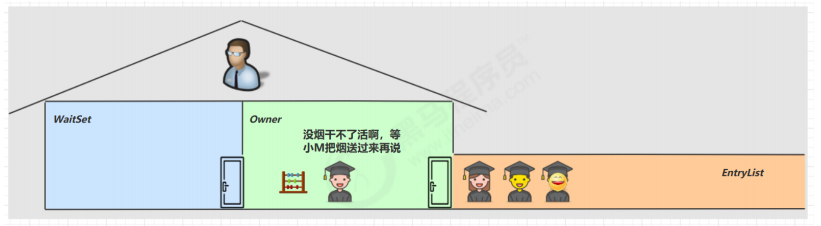
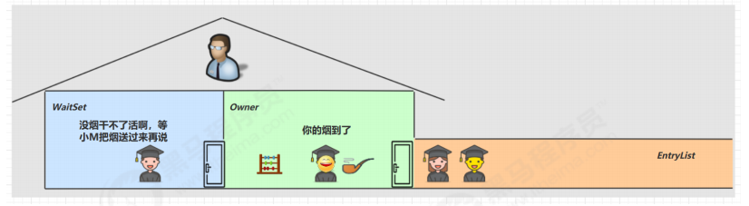
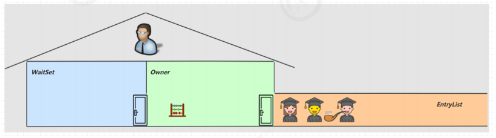
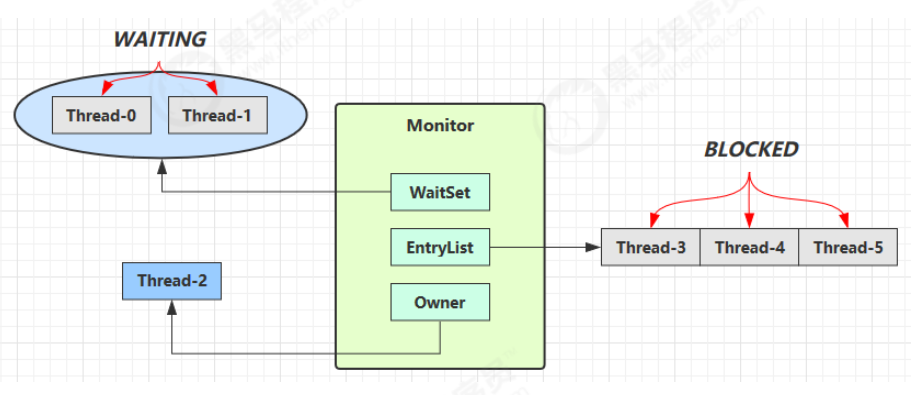
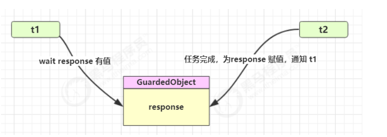
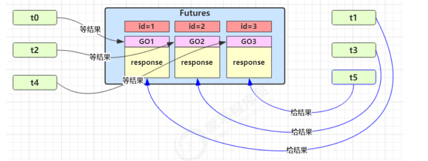
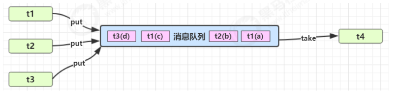

**<font style="color:#DF2A3F;">笔记来源：</font>**[**<font style="color:#DF2A3F;">黑马程序员深入学习Java并发编程，JUC并发编程全套教程</font>**](https://www.bilibili.com/video/BV16J411h7Rd/?spm_id_from=333.337.search-card.all.click&vd_source=e8046ccbdc793e09a75eb61fe8e84a30)

## 1 为什么需要 wait
小故事：由于条件不满足，小南不能继续进行计算，但小南如果一直占用着锁，其它人就得一直阻塞，效率太低



于是老王单开了一间休息室（调用 wait 方法），让小南到休息室（WaitSet）等着去了，但这时锁释放开，其它人可以由老王随机安排进屋，直到小M将烟送来，大叫一声 [ 你的烟到了 ] （调用 notify 方法）

  
小南于是可以离开休息室，重新进入竞争锁的队列



## 2 wait-notify原理


+ Owner 线程发现条件不满足，调用 wait 方法，即可进入 WaitSet 变为 WAITING 状态
+ BLOCKED 和 WAITING 的线程都处于阻塞状态，不占用 CPU 时间片
+ BLOCKED 线程会在 Owner 线程释放锁时唤醒
+ WAITING 线程会在 Owner 线程调用 notify 或 notifyAll 时唤醒，但唤醒后并不意味者立刻获得锁，仍需进入EntryList 重新竞争

## 3 API介绍
+ obj.wait() 让进入 object 监视器的线程到 waitSet 等待
+ obj.notify() 在 object 上正在 waitSet 等待的线程中挑一个唤醒
+ obj.notifyAll() 让 object 上正在 waitSet 等待的线程全部唤醒

它们都是线程之间进行协作的手段，都属于 Object 对象的方法。必须获得此对象的锁，才能调用这几个方法

```java
final static Object obj = new Object();

public static void main(String[] args) {
    
    new Thread(() -> {
        synchronized (obj) {
            log.debug("执行....");
            try {
                obj.wait(); // 让线程在obj上一直等待下去
            } catch (InterruptedException e) {
                e.printStackTrace();
            }
            log.debug("其它代码....");
        }
    }).start();

    new Thread(() -> {
        synchronized (obj) {
            log.debug("执行....");
            try {
                obj.wait(); // 让线程在obj上一直等待下去
            } catch (InterruptedException e) {
                e.printStackTrace();
            }
            log.debug("其它代码....");
        }
    }).start();

    // 主线程两秒后执行
    sleep(2);
    
    log.debug("唤醒 obj 上其它线程");
    
    synchronized (obj) {
        obj.notify(); // 唤醒obj上一个线程
        // obj.notifyAll(); // 唤醒obj上所有等待线程
    }
}
```

notify 的一种结果

```java
20:00:53.096 [Thread-0] c.TestWaitNotify - 执行.... 
20:00:53.099 [Thread-1] c.TestWaitNotify - 执行.... 
20:00:55.096 [main] c.TestWaitNotify - 唤醒 obj 上其它线程
20:00:55.096 [Thread-0] c.TestWaitNotify - 其它代码....
```


notifyAll 的结果

```java
19:58:15.457 [Thread-0] c.TestWaitNotify - 执行.... 
19:58:15.460 [Thread-1] c.TestWaitNotify - 执行.... 
19:58:17.456 [main] c.TestWaitNotify - 唤醒 obj 上其它线程
19:58:17.456 [Thread-1] c.TestWaitNotify - 其它代码.... 
19:58:17.456 [Thread-0] c.TestWaitNotify - 其它代码....
```

<font style="color:#E8323C;">wait()</font> 方法会释放对象的锁，进入 WaitSet 等待区，从而让其他线程就机会获取对象的锁。无限制等待，直到 notify 为止  
<font style="color:#E8323C;">wait(long n) </font>有时限的等待, 到 n 毫秒后结束等待，或是被 notify

## 4 wait-notify 的正确用法
开始之前先看看：**sleep(long n)** 和** wait(long n**) 的区别

1. sleep 是 Thread 方法，而 wait 是 Object 的方法
2. sleep 不需要强制和 synchronized 配合使用，但 wait 需要和 synchronized 一起用
3. sleep 在睡眠的同时，不会释放对象锁的，但 wait 在等待的时候会释放对象锁
4. 它们状态 TIMED_WAITING


**<font style="color:#E8323C;">案例一</font>**

```java
static final Object room = new Object();

static boolean hasCigarette = false;

static boolean hasTakeout = false;
```

思考下面的解决方案好不好，为什么？

```java
new Thread(() -> {
    synchronized (room) {
        log.debug("有烟没？[{}]", hasCigarette);
        if (!hasCigarette) {
            log.debug("没烟，先歇会！");
            sleep(2);
        }
        log.debug("有烟没？[{}]", hasCigarette);
        if (hasCigarette) {
            log.debug("可以开始干活了");
        }
    }
}, "小南").start();


for (int i = 0; i < 5; i++) {
    new Thread(() -> {
        synchronized (room) {
            log.debug("可以开始干活了");
        }
    }, "其它人").start();
}

sleep(1);

new Thread(() -> {
    // 这里能不能加 synchronized (room)？
    hasCigarette = true;
    log.debug("烟到了噢！");
}, "送烟的").start();
```

输出

```java
20:49:49.883 [小南] c.TestCorrectPosture - 有烟没？[false] 
20:49:49.887 [小南] c.TestCorrectPosture - 没烟，先歇会！
20:49:50.882 [送烟的] c.TestCorrectPosture - 烟到了噢！
20:49:51.887 [小南] c.TestCorrectPosture - 有烟没？[true] 
20:49:51.887 [小南] c.TestCorrectPosture - 可以开始干活了
20:49:51.887 [其它人] c.TestCorrectPosture - 可以开始干活了
20:49:51.887 [其它人] c.TestCorrectPosture - 可以开始干活了
20:49:51.888 [其它人] c.TestCorrectPosture - 可以开始干活了
20:49:51.888 [其它人] c.TestCorrectPosture - 可以开始干活了
20:49:51.888 [其它人] c.TestCorrectPosture - 可以开始干活了
```

其它干活的线程，都要一直阻塞，效率太低。小南线程必须睡足 2s 后才能醒来，就算烟提前送到，也无法立刻醒来，因为 sleep 不会释放锁。  
下面为什么不能加 synchronized (room)，加了 synchronized (room) 后，就好比小南在里面反锁了门睡觉，烟根本没法送进门，main 没加 synchronized 就好像 main 线程是翻窗户进来的。解决方法，使用 wait - notify 机制


**<font style="color:#E8323C;">案例二</font>**  
思考下面的实现行吗，为什么？

```java
new Thread(() -> {
    synchronized (room) {
        log.debug("有烟没？[{}]", hasCigarette);
        if (!hasCigarette) {
            log.debug("没烟，先歇会！");
            try {
                room.wait(2000);
            } catch (InterruptedException e) {
                e.printStackTrace();
            }
        }

        log.debug("有烟没？[{}]", hasCigarette);
        if (hasCigarette) {
            log.debug("可以开始干活了");
        }
    }
}, "小南").start();

for (int i = 0; i < 5; i++) {
    new Thread(() -> {
        synchronized (room) {
            log.debug("可以开始干活了");
        }
    }, "其它人").start();
}

sleep(1);

new Thread(() -> {
    synchronized (room) {
        hasCigarette = true;
        log.debug("烟到了噢！");
        room.notify();
    }
}, "送烟的").start();
```

输出

```java
20:51:42.489 [小南] c.TestCorrectPosture - 有烟没？[false] 
20:51:42.493 [小南] c.TestCorrectPosture - 没烟，先歇会！
20:51:42.493 [其它人] c.TestCorrectPosture - 可以开始干活了
20:51:42.493 [其它人] c.TestCorrectPosture - 可以开始干活了
20:51:42.494 [其它人] c.TestCorrectPosture - 可以开始干活了
20:51:42.494 [其它人] c.TestCorrectPosture - 可以开始干活了
20:51:42.494 [其它人] c.TestCorrectPosture - 可以开始干活了
20:51:43.490 [送烟的] c.TestCorrectPosture - 烟到了噢！
20:51:43.490 [小南] c.TestCorrectPosture - 有烟没？[true] 
20:51:43.490 [小南] c.TestCorrectPosture - 可以开始干活了
```

解决了其它干活的线程阻塞的问题。但如果有其它线程也在等待条件呢？

  
**<font style="color:#E8323C;">案例三</font>**

```java
new Thread(() -> {
    synchronized (room) {
        
        log.debug("有烟没？[{}]", hasCigarette);
        if (!hasCigarette) {
            log.debug("没烟，先歇会！");
            try {
                room.wait();
            } catch (InterruptedException e) {
                e.printStackTrace();
            }
        }
        log.debug("有烟没？[{}]", hasCigarette);

        if (hasCigarette) {
            log.debug("可以开始干活了");
        } else {
             log.debug("没干成活...");
        }
    }
}, "小南").start();

new Thread(() -> {
    synchronized (room) {
        Thread thread = Thread.currentThread();
        log.debug("外卖送到没？[{}]", hasTakeout);
        if (!hasTakeout) {
            log.debug("没外卖，先歇会！");
            try {
                room.wait();
            } catch (InterruptedException e) {
                e.printStackTrace();
            }
        }
        log.debug("外卖送到没？[{}]", hasTakeout);
        if (hasTakeout) {
            log.debug("可以开始干活了");
        } else {
            log.debug("没干成活...");
        }
     }
}, "小女").start();

sleep(1);

new Thread(() -> {
    synchronized (room) {
        hasTakeout = true;
        log.debug("外卖到了噢！");
        room.notify();
    }
}, "送外卖的").start();
```

输出

```java
20:53:12.173 [小南] c.TestCorrectPosture - 有烟没？[false] 
20:53:12.176 [小南] c.TestCorrectPosture - 没烟，先歇会！
20:53:12.176 [小女] c.TestCorrectPosture - 外卖送到没？[false] 
20:53:12.176 [小女] c.TestCorrectPosture - 没外卖，先歇会！
20:53:13.174 [送外卖的] c.TestCorrectPosture - 外卖到了噢！
20:53:13.174 [小南] c.TestCorrectPosture - 有烟没？[false] 
20:53:13.174 [小南] c.TestCorrectPosture - 没干成活...
```

notify 只能随机唤醒一个 WaitSet 中的线程，这时如果有其它线程也在等待，那么就可能唤醒不了正确的线程，称之为【虚假唤醒】。这里本来是送外卖的到了，唤醒的应该是需要外卖的，但是我们唤醒的却是需要烟的，事实上烟没到，所以是不对的。解决方法，改为 notifyAll


**<font style="color:#E8323C;">案例四</font>**

```java
new Thread(() -> {
    synchronized (room) {
        hasTakeout = true;
        log.debug("外卖到了噢！");
        room.notifyAll();
    }
}, "送外卖的").start();
```

输出

```java
20:55:23.978 [小南] c.TestCorrectPosture - 有烟没？[false] 
20:55:23.982 [小南] c.TestCorrectPosture - 没烟，先歇会！
20:55:23.982 [小女] c.TestCorrectPosture - 外卖送到没？[false] 
20:55:23.982 [小女] c.TestCorrectPosture - 没外卖，先歇会！
20:55:24.979 [送外卖的] c.TestCorrectPosture - 外卖到了噢！
20:55:24.979 [小女] c.TestCorrectPosture - 外卖送到没？[true] 
20:55:24.980 [小女] c.TestCorrectPosture - 可以开始干活了
20:55:24.980 [小南] c.TestCorrectPosture - 有烟没？[false] 
20:55:24.980 [小南] c.TestCorrectPosture - 没干成活...
```

用 notifyAll 倒是可以唤醒等烟的和等外卖的，但是我们仅仅是外卖到了，只需要唤醒等外卖的即可，等烟的不需要唤醒。但这里唤醒了，后续烟到了也无济于事，因为代码已经执行过了。所以使用 if + wait 判断仅有一次机会，一旦条件不成立，就没有重新判断的机会了。解决方法，用 while + wait，当条件不成立，再次 wait

**<font style="color:#E8323C;">案例五</font>**

将 if 改为 while。改动前：

```java
if (!hasCigarette) {
    log.debug("没烟，先歇会！");
    try {
        room.wait();
    } catch (InterruptedException e) {
        e.printStackTrace();
    }
}
```

改动后：

```java
while (!hasCigarette) {
    log.debug("没烟，先歇会！");
    try {
        room.wait();
    } catch (InterruptedException e) {
        e.printStackTrace();
    }
}
```

输出

```java
20:58:34.322 [小南] c.TestCorrectPosture - 有烟没？[false] 
20:58:34.326 [小南] c.TestCorrectPosture - 没烟，先歇会！
20:58:34.326 [小女] c.TestCorrectPosture - 外卖送到没？[false] 
20:58:34.326 [小女] c.TestCorrectPosture - 没外卖，先歇会！
20:58:35.323 [送外卖的] c.TestCorrectPosture - 外卖到了噢！
20:58:35.324 [小女] c.TestCorrectPosture - 外卖送到没？[true] 
20:58:35.324 [小女] c.TestCorrectPosture - 可以开始干活了
20:58:35.324 [小南] c.TestCorrectPosture - 没烟，先歇会！
```


所以语法为如下总结如下：

```java
synchronized(lock) {
    while(条件不成立) {
        lock.wait();
    }
    // 干活
}

//另一个线程
synchronized(lock) {
    lock.notifyAll();
}
```

## 5 同步模式之保护性暂停
### 5.1 定义
<font style="color:rgb(51,51,51);">即 Guarded Suspension，用在一个线程等待另一个线程的执行结果。要点：</font>

+ <font style="color:rgb(51,51,51);">有一个结果需要从一个线程传递到另一个线程，让他们关联同一个 GuardedObject </font>
+ <font style="color:rgb(51,51,51);">如果有结果不断从一个线程到另一个线程那么可以使用消息队列（见生产者/消费者） </font>
+ <font style="color:rgb(51,51,51);">JDK 中，join 的实现、Future 的实现，采用的就是此模式 </font>
+ <font style="color:rgb(51,51,51);">因为要等待另一方的结果，因此归类到同步模式</font>



### 5.2 实现
```java
class GuardedObject {
 	
    private Object response;
 	
    private final Object lock = new Object();
 	
    public Object get() {
		synchronized (lock) {
			// 条件不满足则等待
			while (response == null) {
				try {
					lock.wait();
				} catch (InterruptedException e) {
					e.printStackTrace();
				} 
            }
			return response; 
        }
    }
    
 	public void complete(Object response) {
		synchronized (lock) {
			// 条件满足，通知等待线程
			this.response = response;
			lock.notifyAll();
		}
 	}
}
```

### 5.3 应用
<font style="color:rgb(51,51,51);">一个线程等待另一个线程的执行结果</font>

```java
public static void main(String[] args) {
 	
    GuardedObject guardedObject = new GuardedObject();
 	
    new Thread(() -> {
		try {
			// 子线程执行下载
			List<String> response = download();
			log.debug("download complete...");
			guardedObject.complete(response);
		} catch (IOException e) {
			e.printStackTrace();
		}
 	}).start();
 	
    log.debug("waiting...");
 	
    // 主线程阻塞等待
 	Object response = guardedObject.get();
 	log.debug("get response: [{}] lines", ((List<String>) response).size());
}
```

<font style="color:rgb(51,51,51);">执行结果</font>

```java
08:42:18.568 [main] c.TestGuardedObject - waiting...
08:42:23.312 [Thread-0] c.TestGuardedObject - download complete...
08:42:23.312 [main] c.TestGuardedObject - get response: [3] lines
```

### 5.4 带超时版
<font style="color:rgb(51,51,51);">如果要控制超时时间呢</font><font style="color:rgb(51,51,51);"> </font>

```java
class GuardedObjectV2 {
 	
    private Object response;
 	
    private final Object lock = new Object();
    
    public Object get(long millis) {
		synchronized (lock) {
			
            // 1) 记录最初时间
			long begin = System.currentTimeMillis();
			
            // 2) 已经经历的时间
			long timePassed = 0;
			
            while (response == null) {
				// 4) 假设 millis 是 1000，结果在 400 时唤醒了，那么还有 600 要等
				long waitTime = millis - timePassed;
				log.debug("waitTime: {}", waitTime);
				if (waitTime <= 0) {
					log.debug("break...");
					break;
            	}
				try {
					lock.wait(waitTime);
				} catch (InterruptedException e) {
					e.printStackTrace();
				}
				// 3) 如果提前被唤醒，这时已经经历的时间假设为 400
				timePassed = System.currentTimeMillis() - begin;
				log.debug("timePassed: {}, object is null {}", timePassed, response == null);
			}
			return response; 
    	}
 	}
    
	public void complete(Object response) {
		synchronized (lock) {
			// 条件满足，通知等待线程
			this.response = response;
			log.debug("notify...");
			lock.notifyAll();
		}
 	}
}
```

<font style="color:rgb(51,51,51);"></font>

<font style="color:rgb(51,51,51);">测试没有超时的时候：</font>

```java
public static void main(String[] args) {
 	
    GuardedObjectV2 v2 = new GuardedObjectV2();
 	
    new Thread(() -> {
		sleep(1);
		v2.complete(null);
		
        sleep(1);
		v2.complete(Arrays.asList("a", "b", "c"));
 	}).start();
 	
    Object response = v2.get(2500);
 	
    if (response != null) {
		log.debug("get response: [{}] lines", ((List<String>) response).size());
    } else {
		log.debug("can't get response");
 	}
}
```

<font style="color:rgb(51,51,51);">输出</font>

```java
08:49:39.917 [main] c.GuardedObjectV2 - waitTime: 2500
08:49:40.917 [Thread-0] c.GuardedObjectV2 - notify...
08:49:40.917 [main] c.GuardedObjectV2 - timePassed: 1003, object is null true
08:49:40.917 [main] c.GuardedObjectV2 - waitTime: 1497
08:49:41.918 [Thread-0] c.GuardedObjectV2 - notify...
08:49:41.918 [main] c.GuardedObjectV2 - timePassed: 2004, object is null false
08:49:41.918 [main] c.TestGuardedObjectV2 - get response: [3] lines
```

<font style="color:rgb(51,51,51);"></font>

<font style="color:rgb(51,51,51);">测试超时的时候：</font>

```java
// 等待时间不足 
List<String> lines = v2.get(1500); 
```

<font style="color:rgb(51,51,51);">输出 </font>

```java
08:47:54.963 [main] c.GuardedObjectV2 - waitTime: 1500 
08:47:55.963 [Thread-0] c.GuardedObjectV2 - notify... 
08:47:55.963 [main] c.GuardedObjectV2 - timePassed: 1002, object is null true 
08:47:55.963 [main] c.GuardedObjectV2 - waitTime: 498 
08:47:56.461 [main] c.GuardedObjectV2 - timePassed: 1500, object is null true 
08:47:56.461 [main] c.GuardedObjectV2 - waitTime: 0 
08:47:56.461 [main] c.GuardedObjectV2 - break... 
08:47:56.461 [main] c.TestGuardedObjectV2 - can't get response 
08:47:56.963 [Thread-0] c.GuardedObjectV2 - notify...
```

### 5.5 join原理
<font style="color:rgb(51,51,51);">是调用者轮询检查线程 alive 状态 </font>

```java
t1.join(); 
```

<font style="color:rgb(51,51,51);"> 等价于下面的代码</font>

```java
synchronized (t1) {
 	// 调用者线程进入 t1 的 waitSet 等待, 直到 t1 运行结束
 	while (t1.isAlive()) {
 		t1.wait(0);
 	}
}
```

### 5.6 多任务版
<font style="color:rgb(51,51,51);">图中 Futures 就好比居民楼一层的信箱（每个信箱有房间编号），左侧的 t0，t2，t4 就好比等待邮件的居民，右 侧的 t1，t3，t5 就好比邮递员 </font>

<font style="color:rgb(51,51,51);">如果需要在多个类之间使用 GuardedObject 对象，作为参数传递不是很方便，因此设计一个用来解耦的中间类， 这样不仅能够解耦【结果等待者】和【结果生产者】，还能够同时支持多个任务的管理</font>



<font style="color:rgb(51,51,51);">新增 id 用来标识 Guarded Object</font>

```java
class GuardedObject {
 	// 标识 Guarded Object
 	private int id;
 	public GuardedObject(int id) {
 		this.id = id;
 	}
 
    public int getId() {
 		return id;
 	}
 	// 结果
 	private Object response;
 
    // 获取结果
 	// timeout 表示要等待多久 2000
 	public Object get(long timeout) {
 		synchronized (this) {
 			// 开始时间 15:00:00
 			long begin = System.currentTimeMillis();
 			// 经历的时间
 			long passedTime = 0;
 			while (response == null) {
 				// 这一轮循环应该等待的时间
 				long waitTime = timeout - passedTime;
 				// 经历的时间超过了最大等待时间时，退出循环
 				if (timeout - passedTime <= 0) {
 					break;
 				}
 				try {
 					this.wait(waitTime); // 虚假唤醒 15:00:01
 				} catch (InterruptedException e) {
 					e.printStackTrace();
                }
 				// 求得经历时间
 				passedTime = System.currentTimeMillis() - begin; // 15:00:02 1s
 			}
 			return response;
 		}
 	}
 
    // 产生结果
 	public void complete(Object response) {
 		synchronized (this) {
 			// 给结果成员变量赋值
 			this.response = response;
 			this.notifyAll();
 		}
 	}
}
```


<font style="color:rgb(51,51,51);">中间解耦类</font>

```java
class Mailboxes {
 	private static Map<Integer, GuardedObject> boxes = new Hashtable<>();
 	private static int id = 1;
 	// 产生唯一 id
 	private static synchronized int generateId() {
 		return id++;
 	}
 	public static GuardedObject getGuardedObject(int id) {
 		return boxes.remove(id);
 	}
 	public static GuardedObject createGuardedObject() {
 		GuardedObject go = new GuardedObject(generateId());
 		boxes.put(go.getId(), go);
 		return go;
 	}
 	public static Set<Integer> getIds() {
 		return boxes.keySet();
 	}
}

```

<font style="color:rgb(51,51,51);">业务相关类</font>

```java
class People extends Thread{
 	@Override
 	public void run() {
 		// 收信
 		GuardedObject guardedObject = Mailboxes.createGuardedObject();
 		log.debug("开始收信 id:{}", guardedObject.getId());
		Object mail = guardedObject.get(5000);
 		log.debug("收到信 id:{}, 内容:{}", guardedObject.getId(), mail);
 	}
}
```

```java
class Postman extends Thread {
 	private int id;
 	private String mail;
 	public Postman(int id, String mail) {
		this.id = id;
 		this.mail = mail;
 	}
 
    @Override
 	public void run() {
 		GuardedObject guardedObject = Mailboxes.getGuardedObject(id);
 		log.debug("送信 id:{}, 内容:{}", id, mail);
 		guardedObject.complete(mail);
 	}
}
```

<font style="color:rgb(51,51,51);">测试</font>

```java
public static void main(String[] args) throws InterruptedException {
 	for (int i = 0; i < 3; i++) {
 		new People().start();
 	}
 	Sleeper.sleep(1);
 	for (Integer id : Mailboxes.getIds()) {
 		new Postman(id, "内容" + id).start();
 	}
}
```

<font style="color:rgb(51,51,51);">某次运行结果</font>

```java
10:35:05.689 c.People [Thread-1] - 开始收信 id:3
10:35:05.689 c.People [Thread-2] - 开始收信 id:1
10:35:05.689 c.People [Thread-0] - 开始收信 id:2
10:35:06.688 c.Postman [Thread-4] - 送信 id:2, 内容:内容2
10:35:06.688 c.Postman [Thread-5] - 送信 id:1, 内容:内容1
10:35:06.688 c.People [Thread-0] - 收到信 id:2, 内容:内容2
10:35:06.688 c.People [Thread-2] - 收到信 id:1, 内容:内容1
10:35:06.688 c.Postman [Thread-3] - 送信 id:3, 内容:内容3
10:35:06.689 c.People [Thread-1] - 收到信 id:3, 内容:内容3
```

## 6 模式之生产者消费者
### 6.1 定义
要点：

+ 与前面的保护性暂停中的 GuardObject 不同，不需要产生结果和消费结果的线程一一对应
+ 消费队列可以用来平衡生产和消费的线程资源
+ 生产者仅负责产生结果数据，不关心数据该如何处理，而消费者专心处理结果数据
+ 消息队列是有容量限制的，满时不会再加入数据，空时不会再消耗数据
+ JDK 中各种阻塞队列，采用的就是这种模式

  


### 6.2 实现
```java
class Message {
	private int id;
	private Object message;
	
    public Message(int id, Object message) {
		this.id = id;
		this.message = message;
	}

    public int getId() {
		return id;
	}

    public Object getMessage() {
        return message;
    }
}

class MessageQueue {
	private LinkedList queue;
	private int capacity;

    public MessageQueue(int capacity) {
		this.capacity = capacity;
		queue = new LinkedList<>();
	}

    public Message take() {
		synchronized (queue) {
			while (queue.isEmpty()) {
				log.debug("没货了, wait");
				try {
					queue.wait();
				} catch (InterruptedException e) {
					e.printStackTrace();
				}
			}
			Message message = queue.removeFirst();
			queue.notifyAll();
			return message;
		}
	}
    
	public void put(Message message) {
		synchronized (queue) {
			while (queue.size() == capacity) {
				log.debug("库存已达上限, wait");
				try {
					queue.wait();
				} catch (InterruptedException e) {
					e.printStackTrace();
				}
			}
			queue.addLast(message);
			queue.notifyAll();
		}
	}
}

```

### 6.3 应用
```java
MessageQueue messageQueue = new MessageQueue(2);
// 4 个生产者线程, 下载任务
for (int i = 0; i < 4; i++) {
 	int id = i;
 	new Thread(() -> {
 		try {
        	log.debug("download...");
 			List<String> response = Downloader.download();
 			log.debug("try put message({})", id);
 			messageQueue.put(new Message(id, response));
 		} catch (IOException e) {
 			e.printStackTrace();
 		}
 	}, "生产者" + i).start();
}

// 1 个消费者线程, 处理结果
new Thread(() -> {
 	while (true) {
 		Message message = messageQueue.take();
 		List<String> response = (List<String>) message.getMessage();
 		log.debug("take message({}): [{}] lines", message.getId(), response.size());
 	}
}, "消费者").start();
```

某次运行结果。结果解读：

```java
10:48:38.070 [生产者3] c.TestProducerConsumer - download...
10:48:38.070 [生产者0] c.TestProducerConsumer - download...
10:48:38.070 [消费者] c.MessageQueue - 没货了, wait
10:48:38.070 [生产者1] c.TestProducerConsumer - download...
10:48:38.070 [生产者2] c.TestProducerConsumer - download...
10:48:41.236 [生产者1] c.TestProducerConsumer - try put message(1)
10:48:41.237 [生产者2] c.TestProducerConsumer - try put message(2)
10:48:41.236 [生产者0] c.TestProducerConsumer - try put message(0)
10:48:41.237 [生产者3] c.TestProducerConsumer - try put message(3)
10:48:41.239 [生产者2] c.MessageQueue - 库存已达上限, wait
10:48:41.240 [生产者1] c.MessageQueue - 库存已达上限, wait
10:48:41.240 [消费者] c.TestProducerConsumer - take message(0): [3] lines
10:48:41.240 [生产者2] c.MessageQueue - 库存已达上限, wait
10:48:41.240 [消费者] c.TestProducerConsumer - take message(3): [3] lines
10:48:41.240 [消费者] c.TestProducerConsumer - take message(1): [3] lines
10:48:41.240 [消费者] c.TestProducerConsumer - take message(2): [3] lines
10:48:41.240 [消费者] c.MessageQueue - 没货了, wait
```


