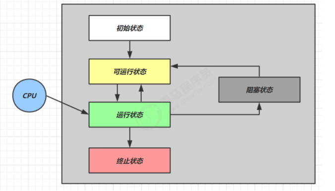
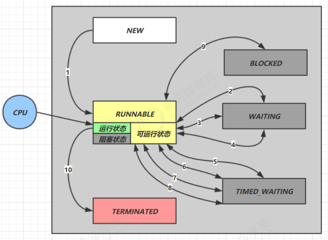
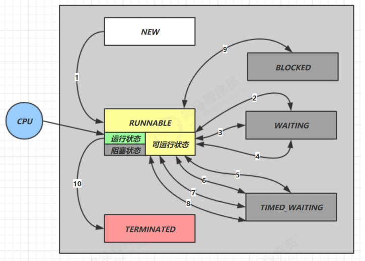

**笔记来源：**[**黑马程序员深入学习Java并发编程，JUC并发编程全套教程**](https://www.bilibili.com/video/BV16J411h7Rd/?spm_id_from=333.337.search-card.all.click&vd_source=e8046ccbdc793e09a75eb61fe8e84a30)

------


# 1 五种状态
这是从 **操作系统** 层面来描述的  


+ 【**初始状态**】仅是在语言层面创建了线程对象，还未与操作系统线程关联
+ 【**可运行状态**】（就绪状态）指该线程已经被创建（与操作系统线程关联），可以由 CPU 调度执行
+ 【**运行状态**】指获取了 CPU 时间片运行中的状态 
    - 当 CPU 时间片用完，会从【运行状态】转换至【可运行状态】，会导致线程的上下文切换
+ 【**阻塞状态**】 
    - 如果调用了阻塞 API，如 BIO 读写文件，这时该线程实际不会用到 CPU，会导致线程上下文切换，进入【阻塞状态】
    - 等 BIO 操作完毕，会由操作系统唤醒阻塞的线程，转换至【可运行状态】
    - 与【可运行状态】的区别是，对【阻塞状态】的线程来说只要它们一直不唤醒，调度器就一直不会考虑调度它们
+ 【**终止状态**】表示线程已经执行完毕，生命周期已经结束，不会再转换为其它状态

# 2 六种状态
这是从 **Java API** 层面来描述的：根据`Thread.State`枚举，分为六种状态  


+ NEW 线程刚被创建，但是还没有调用 start() 方法
+ RUNNABLE 当调用了 start() 方法之后，注意，Java API 层面的 RUNNABLE 状态涵盖了操作系统层面的【可运行状态】、【运行状态】和【阻塞状态】（由于 BIO 导致的线程阻塞，在 Java 里无法区分，仍然认为是可运行）
+ BLOCKED ， WAITING ， TIMED_WAITING 都是 Java API 层面对【阻塞状态】的细分，后面会在状态转换下面详述
+ TERMINATED 当线程代码运行结束

# 3 线程六种状态转换


假设有线程 Thread t

+  **情况1**： NEW --> RUNNABLE  
  当调用 `t.start()` 方法时，由 NEW --> RUNNABLE


+ **情况2**： RUNNABLE <--> WAITING。t 线程用`synchronized(obj)`获取了对象锁后 
    - 调用`obj.wait()`方法时，t 线程从：RUNNABLE --> WAITING

    - 调用`obj.notify()` `obj.notifyAll()` `t.interrupt()`  时 
        * 竞争锁成功，t 线程从：WAITING --> RUNNABLE
        * 竞争锁失败，t 线程从：WAITING --> BLOCKED

        ```java
        public class TestWaitNotify {
            
            final static Object obj = new Object();
            
            public static void main(String[] args) {
                
                new Thread(() -> {
                    synchronized (obj) {
                        log.debug("执行....");
                        try {
                            obj.wait();
                        } catch (InterruptedException e) {
                            e.printStackTrace();
                        }
                        log.debug("其它代码...."); // 断点
                    }
                },"t1").start();

                new Thread(() -> {
                    synchronized (obj) {
                        log.debug("执行....");
                        try {
                            obj.wait();
                        } catch (InterruptedException e) {
                            e.printStackTrace();
                        }
                        log.debug("其它代码...."); // 断点
                    }
                },"t2").start();
         
                sleep(0.5);
                log.debug("唤醒 obj 上其它线程");
                
                synchronized (obj) {
                    obj.notifyAll(); // 唤醒obj上所有等待线程 断点
                }
            }
        }
        ```


+ **情况3**： RUNNABLE <--> WAITING
    - 当前线程调用 `t.join()` 方法时，当前线程从：RUNNABLE --> WAITING。注意是当前线程在 t 线程对象的监视器上等待。
    - t 线程运行结束，或调用了当前线程的`interrupt()`时，当前线程从：WAITING --> RUNNABLE


+ **情况4**： RUNNABLE <--> WAITING
    - 当前线程调用`LockSupport.park()` 方法会让当前线程从：RUNNABLE --> WAITING
    - 调用`LockSupport.unpark(目标线程)` 或调用了线程的`interrupt()`，会让目标线程从：WAITING --> RUNNABLE


+  **情况5**： RUNNABLE <--> TIMED_WAITING。t 线程用`synchronized(obj)` 获取了对象锁后 
    - 调用`obj.wait(long n)`方法时，t 线程从：RUNNABLE --> TIMED_WAITING
    - t 线程等待时间超过了 n 毫秒，或调用`obj.notify()` `obj.notifyAll()` `t.interrupt()`时 
        * 竞争锁成功，t 线程从：TIMED_WAITING --> RUNNABLE
        * 竞争锁失败，t 线程从：TIMED_WAITING --> BLOCKED


+  **情况6：** RUNNABLE <--> TIMED_WAITING
    - 当前线程调用`t.join(long n)`方法时，当前线程从：RUNNABLE --> TIMED_WAITING。注意是当前线程在t 线程对象的监视器上等待
    - 当前线程等待时间超过了 n 毫秒，或 t 线程运行结束，或调用了当前线程的`interrupt()` 时，当前线程从：TIMED_WAITING --> RUNNABLE


+  **情况7**： RUNNABLE <--> TIMED_WAITING
    - 当前线程调用`Thread.sleep(long n)`，当前线程从：RUNNABLE --> TIMED_WAITING
    - 当前线程等待时间超过了 n 毫秒，当前线程从：TIMED_WAITING --> RUNNABLE


+  **情况8**： RUNNABLE <--> TIMED_WAITING
    - 当前线程调用`LockSupport.parkNanos(long nanos)` 或 `LockSupport.parkUntil(long millis)`时，当前线程从：RUNNABLE --> TIMED_WAITING
    - 调用`LockSupport.unpark(目标线程)` 或调用了线程的`interrupt()` ，或是等待超时，会让目标线程从：TIMED_WAITING--> RUNNABLE


+  **情况9**  ： RUNNABLE <--> BLOCKED 
    - t 线程用`synchronized(obj)`获取了对象锁时如果竞争失败，从：RUNNABLE --> BLOCKED
    - 持 obj 锁线程的同步代码块执行完毕，会唤醒该对象上所有 BLOCKED 的线程重新竞争，如果其中 t 线程竞争成功，从 BLOCKED --> RUNNABLE ，其它失败的线程仍然 BLOCKED


+  **情况10**： RUNNABLE <--> TERMINATED
    - 当前线程所有代码运行完毕，进入 TERMINATED


