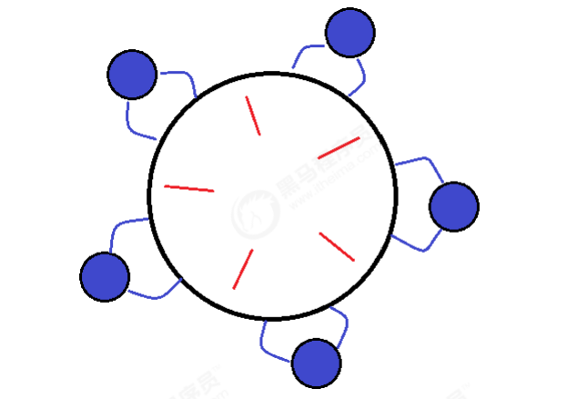

**笔记来源：**[**黑马程序员深入学习Java并发编程，JUC并发编程全套教程**](https://www.bilibili.com/video/BV16J411h7Rd/?spm_id_from=333.337.search-card.all.click&vd_source=e8046ccbdc793e09a75eb61fe8e84a30)

------


# 1 死锁
有这样的情况：一个线程需要同时获取多把锁，这时就容易发生死锁。t1 线程获得A对象锁，接下来想获取B对象的锁， t2 线程获得B对象锁，接下来想获取A对象的锁。

示例代码如下：

```java
Object A = new Object();
Object B = new Object();

Thread t1 = new Thread(() -> {
    synchronized (A) {
        log.debug("lock A");
        sleep(1);
        synchronized (B) {
            log.debug("lock B");
            log.debug("操作...");
        }
    }
}, "t1");

Thread t2 = new Thread(() -> {
    synchronized (B) {
        log.debug("lock B");
        sleep(0.5);
        synchronized (A) {
            log.debug("lock A");
            log.debug("操作...");
        }
    }
}, "t2");

t1.start();
t2.start();
```

结果输出：

```java
12:22:06.962 [t2] c.TestDeadLock - lock B 
12:22:06.962 [t1] c.TestDeadLock - lock A
```

# 2 定位死锁
检测死锁可以使用 jconsole工具，或者使用 jps 定位进程 id，再用 jstack 定位死锁，jstack可以查看各个线程的快照：

这几个命令的具体用法可以参考：

[22 JVM监控及诊断工具：命令行篇](https://www.yuque.com/chenguang201/java/f8e40c1070f6b6cca64bd31f3beeec0b)

[23 JVM监控及诊断工具：GUI篇](https://www.yuque.com/chenguang201/java/b43df8ebfa6ad50cd5978caf4da31052#YClHl)

```java
cmd > jps
Picked up JAVA_TOOL_OPTIONS: -Dfile.encoding=UTF-8
12320 Jps
22816 KotlinCompileDaemon
33200 TestDeadLock // JVM 进程
11508 Main
28468 Launcher
```

```java
cmd > jstack 33200
2022-09-03 12:39:34
Full thread dump Java HotSpot(TM) 64-Bit Server VM (25.40-b25 mixed mode):

"DestroyJavaVM" #14 prio=5 os_prio=0 tid=0x0000000003054000 nid=0x53ec waiting on condition [0x0000000000000000]
   java.lang.Thread.State: RUNNABLE

"t2" #13 prio=5 os_prio=0 tid=0x0000000020141000 nid=0x50ac waiting for monitor entry [0x0000000020a2e000]
   java.lang.Thread.State: BLOCKED (on object monitor)
        at com.ali.bingfa.TestSiSuo.lambda$main$1(TestSiSuo.java:34)
        - waiting to lock <0x000000076baae830> (a java.lang.Object)
        - locked <0x000000076baae840> (a java.lang.Object)
        at com.ali.bingfa.TestSiSuo$$Lambda$2/1389133897.run(Unknown Source)
        at java.lang.Thread.run(Thread.java:745)

"t1" #12 prio=5 os_prio=0 tid=0x0000000020140800 nid=0x4f94 waiting for monitor entry [0x000000002092f000]
   java.lang.Thread.State: BLOCKED (on object monitor)
        at com.ali.bingfa.TestSiSuo.lambda$main$0(TestSiSuo.java:19)
        - waiting to lock <0x000000076baae840> (a java.lang.Object)
        - locked <0x000000076baae830> (a java.lang.Object)
        at com.ali.bingfa.TestSiSuo$$Lambda$1/317574433.run(Unknown Source)
        at java.lang.Thread.run(Thread.java:745)

"Service Thread" #11 daemon prio=9 os_prio=0 tid=0x000000001e64d000 nid=0x5764 runnable [0x0000000000000000]
   java.lang.Thread.State: RUNNABLE

"C1 CompilerThread3" #10 daemon prio=9 os_prio=2 tid=0x000000001e5a5800 nid=0x3824 waiting on condition [0x0000000000000000]
   java.lang.Thread.State: RUNNABLE

"C2 CompilerThread2" #9 daemon prio=9 os_prio=2 tid=0x000000001e5a5000 nid=0x5790 waiting on condition [0x0000000000000000]
   java.lang.Thread.State: RUNNABLE

"C2 CompilerThread1" #8 daemon prio=9 os_prio=2 tid=0x000000001e5a3000 nid=0x2434 waiting on condition [0x0000000000000000]
   java.lang.Thread.State: RUNNABLE

"C2 CompilerThread0" #7 daemon prio=9 os_prio=2 tid=0x000000001e59f800 nid=0xfd8 waiting on condition [0x0000000000000000]
   java.lang.Thread.State: RUNNABLE

"Monitor Ctrl-Break" #6 daemon prio=5 os_prio=0 tid=0x000000001e578000 nid=0x4264 runnable [0x000000001fa2e000]
   java.lang.Thread.State: RUNNABLE
        at java.net.SocketInputStream.socketRead0(Native Method)
        at java.net.SocketInputStream.socketRead(SocketInputStream.java:116)
        at java.net.SocketInputStream.read(SocketInputStream.java:170)
        at java.net.SocketInputStream.read(SocketInputStream.java:141)
        at sun.nio.cs.StreamDecoder.readBytes(StreamDecoder.java:284)
        at sun.nio.cs.StreamDecoder.implRead(StreamDecoder.java:326)
        at sun.nio.cs.StreamDecoder.read(StreamDecoder.java:178)
        - locked <0x000000076bb8f6d0> (a java.io.InputStreamReader)
        at java.io.InputStreamReader.read(InputStreamReader.java:184)
        at java.io.BufferedReader.fill(BufferedReader.java:161)
        at java.io.BufferedReader.readLine(BufferedReader.java:324)
        - locked <0x000000076bb8f6d0> (a java.io.InputStreamReader)
        at java.io.BufferedReader.readLine(BufferedReader.java:389)
        at com.intellij.rt.execution.application.AppMainV2$1.run(AppMainV2.java:64)

"Attach Listener" #5 daemon prio=5 os_prio=2 tid=0x000000001e3f7800 nid=0x541c waiting on condition [0x0000000000000000]
   java.lang.Thread.State: RUNNABLE

"Signal Dispatcher" #4 daemon prio=9 os_prio=2 tid=0x000000001e442800 nid=0x566c runnable [0x0000000000000000]
   java.lang.Thread.State: RUNNABLE

"Finalizer" #3 daemon prio=8 os_prio=1 tid=0x000000000314c800 nid=0xdbc in Object.wait() [0x000000001f72f000]
   java.lang.Thread.State: WAITING (on object monitor)
        at java.lang.Object.wait(Native Method)
        - waiting on <0x000000076b786f58> (a java.lang.ref.ReferenceQueue$Lock)
        at java.lang.ref.ReferenceQueue.remove(ReferenceQueue.java:143)
        - locked <0x000000076b786f58> (a java.lang.ref.ReferenceQueue$Lock)
        at java.lang.ref.ReferenceQueue.remove(ReferenceQueue.java:164)
        at java.lang.ref.Finalizer$FinalizerThread.run(Finalizer.java:209)

"Reference Handler" #2 daemon prio=10 os_prio=2 tid=0x000000001ccfc800 nid=0x2484 in Object.wait() [0x000000001f62e000]
   java.lang.Thread.State: WAITING (on object monitor)
        at java.lang.Object.wait(Native Method)
        - waiting on <0x000000076b786998> (a java.lang.ref.Reference$Lock)
        at java.lang.Object.wait(Object.java:502)
        at java.lang.ref.Reference$ReferenceHandler.run(Reference.java:157)
        - locked <0x000000076b786998> (a java.lang.ref.Reference$Lock)

"VM Thread" os_prio=2 tid=0x000000001ccf7000 nid=0x108c runnable

"GC task thread#0 (ParallelGC)" os_prio=0 tid=0x0000000003069800 nid=0x1444 runnable

"GC task thread#1 (ParallelGC)" os_prio=0 tid=0x000000000306b000 nid=0x5b8 runnable

"GC task thread#2 (ParallelGC)" os_prio=0 tid=0x000000000306c800 nid=0x5788 runnable

"GC task thread#3 (ParallelGC)" os_prio=0 tid=0x000000000306e000 nid=0x1150 runnable

"GC task thread#4 (ParallelGC)" os_prio=0 tid=0x0000000003071800 nid=0x146c runnable

"GC task thread#5 (ParallelGC)" os_prio=0 tid=0x0000000003072800 nid=0x9c0 runnable

"GC task thread#6 (ParallelGC)" os_prio=0 tid=0x0000000003075800 nid=0x548 runnable

"GC task thread#7 (ParallelGC)" os_prio=0 tid=0x0000000003077000 nid=0x51e0 runnable

"GC task thread#8 (ParallelGC)" os_prio=0 tid=0x0000000003078000 nid=0x4834 runnable

"GC task thread#9 (ParallelGC)" os_prio=0 tid=0x0000000003079000 nid=0x5130 runnable

"VM Periodic Task Thread" os_prio=2 tid=0x000000001e650800 nid=0xf58 waiting on condition

JNI global references: 329


Found one Java-level deadlock:
=============================
"t2":
  waiting to lock monitor 0x0000000003149c58 (object 0x000000076baae830, a java.lang.Object),
  which is held by "t1"
"t1":
  waiting to lock monitor 0x000000000314c6f8 (object 0x000000076baae840, a java.lang.Object),
  which is held by "t2"

Java stack information for the threads listed above:
===================================================
"t2":
        at com.ali.bingfa.TestSiSuo.lambda$main$1(TestSiSuo.java:34)
        - waiting to lock <0x000000076baae830> (a java.lang.Object)
        - locked <0x000000076baae840> (a java.lang.Object)
        at com.ali.bingfa.TestSiSuo$$Lambda$2/1389133897.run(Unknown Source)
        at java.lang.Thread.run(Thread.java:745)
"t1":
        at com.ali.bingfa.TestSiSuo.lambda$main$0(TestSiSuo.java:19)
        - waiting to lock <0x000000076baae840> (a java.lang.Object)
        - locked <0x000000076baae830> (a java.lang.Object)
        at com.ali.bingfa.TestSiSuo$$Lambda$1/317574433.run(Unknown Source)
        at java.lang.Thread.run(Thread.java:745)

Found 1 deadlock.
```

避免死锁要注意加锁顺序。另外如果由于某个线程进入了死循环，导致其它线程一直等待，对于这种情况 linux 下可以通过 top 先定位到CPU 占用高的 Java 进程，再利用 `top -Hp 进程id` 来定位是哪个线程，最后再用 jstack 排查。

# 3 哲学家就餐问题


有五位哲学家，围坐在圆桌旁。他们只做两件事，思考和吃饭，思考一会吃口饭，吃完饭后接着思考。吃饭时要用两根筷子吃，桌上共有 5 根筷子，每位哲学家左右手边各有一根筷子。如果筷子被身边的人拿着，自己就得等待。


筷子类

```java
class Chopstick {
    String name;

    public Chopstick(String name) {
        this.name = name;
    }

    @Override
    public String toString() {
        return "筷子{" + name + '}';
    }
}
```

哲学家类

```java
class Philosopher extends Thread {
    Chopstick left;
    Chopstick right;

    public Philosopher(String name, Chopstick left, Chopstick right) {
        super(name);
        this.left = left;
        this.right = right;
    }

    private void eat() {
        log.debug("eating...");
        Sleeper.sleep(1);
    }
 
    @Override
    public void run() {
        while (true) {
            // 获得左手筷子
            synchronized (left) {
                // 获得右手筷子
                synchronized (right) {
                    // 吃饭
                    eat();
                }
                // 放下右手筷子
            }
            // 放下左手筷子
        }
    }
}
```

就餐

```java
Chopstick c1 = new Chopstick("1");
Chopstick c2 = new Chopstick("2");
Chopstick c3 = new Chopstick("3");
Chopstick c4 = new Chopstick("4");
Chopstick c5 = new Chopstick("5");

new Philosopher("苏格拉底", c1, c2).start();
new Philosopher("柏拉图", c2, c3).start();
new Philosopher("亚里士多德", c3, c4).start();
new Philosopher("赫拉克利特", c4, c5).start();
new Philosopher("阿基米德", c5, c1).start();
```


执行不多会，就执行不下去了

```java
12:33:15.575 [苏格拉底] c.Philosopher - eating... 
12:33:15.575 [亚里士多德] c.Philosopher - eating... 
12:33:16.580 [阿基米德] c.Philosopher - eating... 
12:33:17.580 [阿基米德] c.Philosopher - eating... 
// 卡在这里, 不向下运行
```


使用 jconsole 检测死锁，发现

```java
-------------------------------------------------------------------------
名称: 阿基米德
状态: cn.itcast.Chopstick@1540e19d (筷子1) 上的BLOCKED, 拥有者: 苏格拉底
总阻止数: 2, 总等待数: 1
堆栈跟踪:
cn.itcast.Philosopher.run(TestDinner.java:48)
 - 已锁定 cn.itcast.Chopstick@6d6f6e28 (筷子5)
-------------------------------------------------------------------------
名称: 苏格拉底
状态: cn.itcast.Chopstick@677327b6 (筷子2) 上的BLOCKED, 拥有者: 柏拉图
总阻止数: 2, 总等待数: 1
堆栈跟踪:
cn.itcast.Philosopher.run(TestDinner.java:48)
 - 已锁定 cn.itcast.Chopstick@1540e19d (筷子1)
-------------------------------------------------------------------------
名称: 柏拉图
状态: cn.itcast.Chopstick@14ae5a5 (筷子3) 上的BLOCKED, 拥有者: 亚里士多德
总阻止数: 2, 总等待数: 0
堆栈跟踪:
cn.itcast.Philosopher.run(TestDinner.java:48)
 - 已锁定 cn.itcast.Chopstick@677327b6 (筷子2)
-------------------------------------------------------------------------
名称: 亚里士多德
状态: cn.itcast.Chopstick@7f31245a (筷子4) 上的BLOCKED, 拥有者: 赫拉克利特
总阻止数: 1, 总等待数: 1
堆栈跟踪:
cn.itcast.Philosopher.run(TestDinner.java:48)
 - 已锁定 cn.itcast.Chopstick@14ae5a5 (筷子3)
-------------------------------------------------------------------------
名称: 赫拉克利特
状态: cn.itcast.Chopstick@6d6f6e28 (筷子5) 上的BLOCKED, 拥有者: 阿基米德
总阻止数: 2, 总等待数: 0
堆栈跟踪:
cn.itcast.Philosopher.run(TestDinner.java:48)
 - 已锁定 cn.itcast.Chopstick@7f31245a (筷子4)
```

这种线程没有按预期结束，执行不下去的情况，归类为【活跃性】问题，除了死锁以外，还有**活锁**和**饥饿者**两种情况。

# 4 活锁
活锁出现在两个线程互相改变对方的结束条件，最后谁也无法结束，例如

```java
public class TestLiveLock {
    
    static volatile int count = 10;
    static final Object lock = new Object();

    public static void main(String[] args) {
        new Thread(() -> {
            // 期望减到 0 退出循环
            while (count > 0) {
                sleep(0.2);
                count--;
                log.debug("count: {}", count);
            }
        }, "t1").start();

        new Thread(() -> {
            // 期望超过 20 退出循环
            while (count < 20) {
                sleep(0.2);
                count++;
                log.debug("count: {}", count);
            }
        }, "t2").start();
    }
}
```

# 5 饥饿
很多教程中把饥饿定义为，一个线程由于优先级太低，始终得不到 CPU 调度执行，也不能够结束，饥饿的情况不易演示，讲读写锁时会涉及饥饿问题

下面我讲一下我遇到的一个线程饥饿的例子，先来看看使用顺序加锁的方式解决之前的死锁问题


顺序加锁的解决方案


