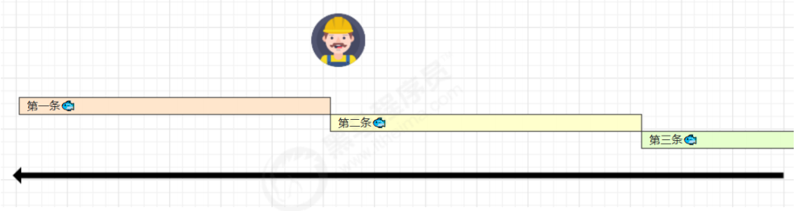
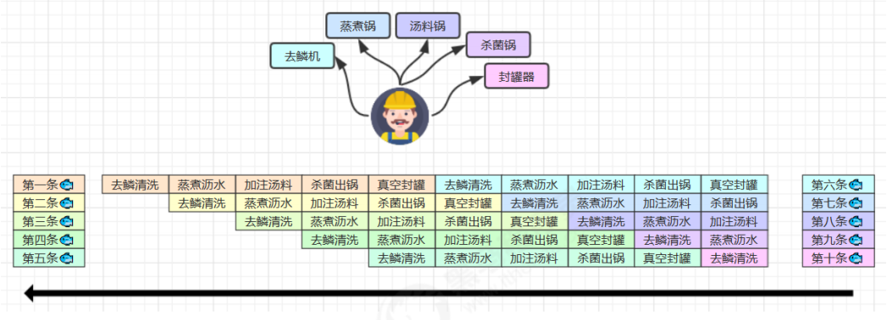
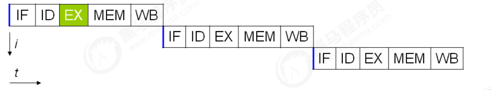
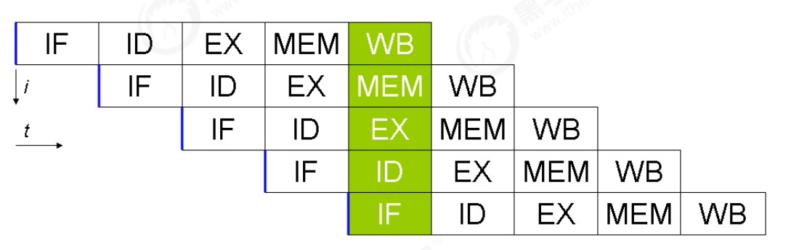
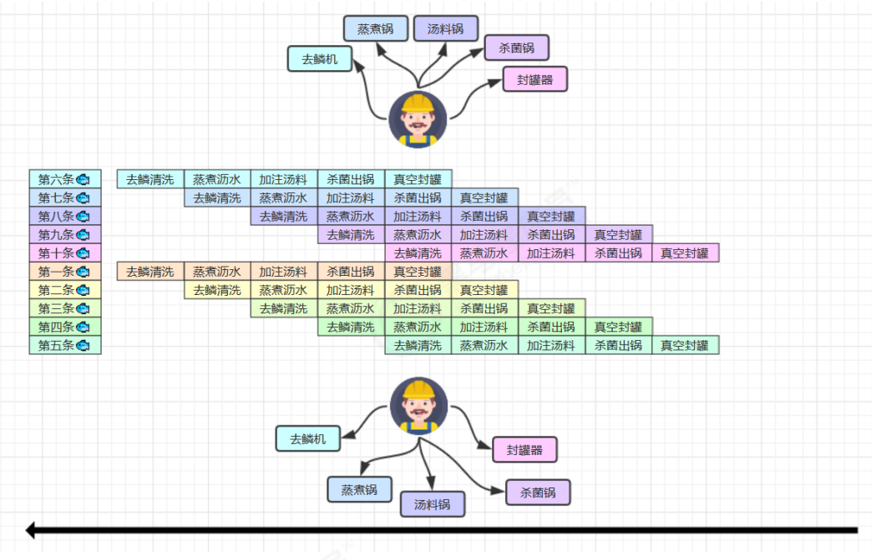
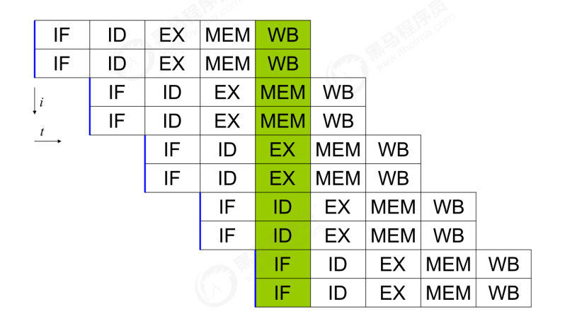
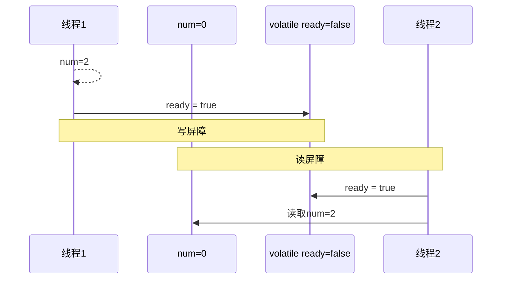
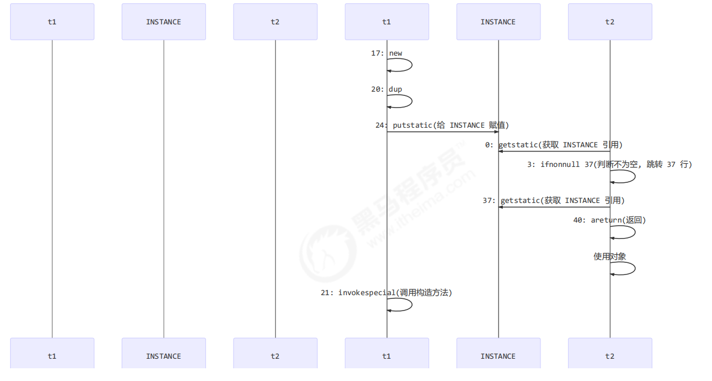
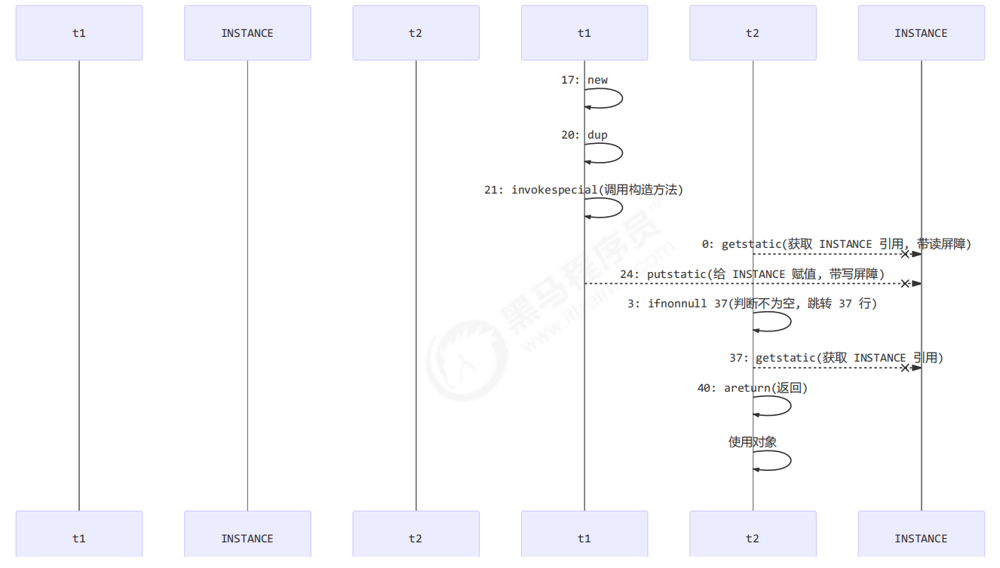

**笔记来源：**[**黑马程序员深入学习Java并发编程，JUC并发编程全套教程**](https://www.bilibili.com/video/BV16J411h7Rd/?spm_id_from=333.337.search-card.all.click&vd_source=e8046ccbdc793e09a75eb61fe8e84a30)

------

思考：JVM 会在不影响正确性的前提下，可以调整语句的执行顺序，思考下面一段代码

```java
static int i;
static int j;

// 在某个线程内执行如下赋值操作
i = ...; 
j = ...;
```

可以看到，至于是先执行 i 还是 先执行 j ，对最终的结果不会产生影响。所以，上面代码真正执行时，既可以是

```java
i = ...; 
j = ...;
```

也可以是

```java
j = ...;
i = ...;
```

这种特性称之为『指令重排』，多线程下『指令重排』会影响正确性。为什么要有重排指令这项优化呢？从 CPU执行指令的原理来理解一下吧

## 1 指令级并行原理
### 1.1 名词
**Clock Cycle Time：** 主频的概念大家接触的比较多，而 CPU 的 Clock Cycle Time（时钟周期时间），等于主频的倒数，意思是 CPU 能够识别的最小时间单位，比如说 4G 主频的 CPU 的 Clock Cycle Time 就是 0.25 ns，作为对比，我们墙上挂钟的Cycle Time 是 1s。例如，运行一条加法指令一般需要一个时钟周期时间

**CPI：** 有的指令需要更多的时钟周期时间，所以引出了 CPI （Cycles Per Instruction）指令平均时钟周期数

**IPC：** IPC（Instruction Per Clock Cycle） 即 CPI 的倒数，表示每个时钟周期能够运行的指令数

**CPU 执行时间：** 程序的 CPU 执行时间，即我们前面提到的 user + system 时间，可以用下面的公式来表示

```plain
程序 CPU 执行时间 = 指令数 * CPI * Clock Cycle Time
```

### 1.2 鱼罐头的故事
加工一条鱼需要 50 分钟，只能一条鱼、一条鱼顺序加工...  


可以将每个鱼罐头的加工流程细分为 5 个步骤：

+ 去鳞清洗 10分钟
+ 蒸煮沥水 10分钟
+ 加注汤料 10分钟
+ 杀菌出锅 10分钟
+ 真空封罐 10分钟



即使只有一个工人，最理想的情况是：他能够在 10 分钟内同时做好这 5 件事，因为对第一条鱼的真空装罐，不会影响对第二条鱼的杀菌出锅...

### 1.3 指令重排序优化
事实上，现代处理器会设计为一个时钟周期完成一条执行时间最长的 CPU 指令。为什么这么做呢？可以想到指令还可以再划分成一个个更小的阶段，例如，每条指令都可以分为： `取指令 - 指令译码 - 执行指令 - 内存访问 - 数据写回` 这 5 个阶段  



术语参考：

+ instruction fetch (IF)
+ instruction decode (ID)
+ execute (EX)
+ memory access (MEM)
+ register write back (WB)  


在不改变程序结果的前提下，这些指令的各个阶段可以通过重排序和组合来实现指令级并行，这一技术在 80's 中叶到 90's 中叶占据了计算架构的重要地位。

> 提示：分阶段，分工是提升效率的关键！
>


指令重排的前提是，重排指令不能影响结果，例如

```java
// 可以重排的例子
int a = 10; // 指令1
int b = 20; // 指令2
System.out.println( a + b );


// 不能重排的例子
int a = 10; // 指令1
int b = a - 5; // 指令2
```

### 1.4 支持流水线的处理器
现代 CPU 支持多级指令流水线，例如支持同时执行 `<font style="color:#E8323C;">取指令 - 指令译码 - 执行指令 - 内存访问 - 数据写回</font>` 的处理器，就可以称之为五级指令流水线。这时 CPU 可以在一个时钟周期内，同时运行五条指令的不同阶段（相当于一条执行时间最长的复杂指令），IPC = 1，本质上，流水线技术并不能缩短单条指令的执行时间，但它变相地提高了指令地吞吐率。

> 提示：奔腾四（Pentium 4）支持高达 35 级流水线，但由于功耗太高被废弃
>




### 1.5 SuperScalar 处理器
大多数处理器包含多个执行单元，并不是所有计算功能都集中在一起，可以再细分为整数运算单元、浮点数运算单元等，这样可以把多条指令也可以做到并行获取、译码等，CPU 可以在一个时钟周期内，执行多于一条指令，IPC > 1  
  


## **2 诡异的结果**
```java
int num = 0;
boolean ready = false;

// 线程1 执行此方法
public void actor1(I_Result r) {
    if(ready) {
        r.r1 = num + num;
    } else {
        r.r1 = 1;
    }
}

// 线程2 执行此方法
public void actor2(I_Result r) { 
    num = 2;
    ready = true; 
}
```

I_Result 是一个对象，有一个属性 r1 用来保存结果，问，可能的结果有几种？  
有同学这么分析

+ 情况1：线程1 先执行，这时 ready = false，所以进入 else 分支结果为 1
+ 情况2：线程2 先执行 num = 2，但没来得及执行 ready = true，线程1 执行，还是进入 else 分支，结果为1
+ 情况3：线程2 执行到 ready = true，线程1 执行，这回进入 if 分支，结果为 4（因为 num 已经执行过了）

但我告诉你，结果还有可能是 0 ，信不信吧！  
这种情况下是：线程2 执行 ready = true，切换到线程1，进入 if 分支，相加为 0，再切回线程2 执行 num = 2 相信很多人已经晕了  
这种现象叫做指令重排，是 JIT 编译器在运行时的一些优化，这个现象需要通过大量测试才能复现：  
借助 java 并发压测工具 `jcstress`。

 [https://wiki.openjdk.java.net/display/CodeTools/jcstress](https://wiki.openjdk.java.net/display/CodeTools/jcstress)

```java
mvn archetype:generate -DinteractiveMode=false -DarchetypeGroupId=org.openjdk.jcstress -DarchetypeArtifactId=jcstress-java-test-archetype -DarchetypeVersion=0.5 -DgroupId=cn.itcast -DartifactId=ordering -Dversion=1.0
```


创建 maven 项目，提供如下测试类

```java
@JCStressTest
@Outcome(id = {"1", "4"}, expect = Expect.ACCEPTABLE, desc = "ok")
@Outcome(id = "0", expect = Expect.ACCEPTABLE_INTERESTING, desc = "!!!!")
@State
public class ConcurrencyTest {
    int num = 0;
    boolean ready = false;

    @Actor
    public void actor1(I_Result r) {
        if(ready) {
            r.r1 = num + num;
        } else {
            r.r1 = 1;
        }
    }

    @Actor
    public void actor2(I_Result r) {
        num = 2;
        ready = true;
    }
}
```

执行

```java
mvn clean install 
java -jar target/jcstress.jar
```

会输出我们感兴趣的结果，摘录其中一次结果：

  
可以看到，出现结果为 0 的情况有 638 次，虽然次数相对很少，但毕竟是出现了。

## 3 解决方法
volatile 修饰的变量，可以禁用指令重排

```java
@JCStressTest
@Outcome(id = {"1", "4"}, expect = Expect.ACCEPTABLE, desc = "ok")
@Outcome(id = "0", expect = Expect.ACCEPTABLE_INTERESTING, desc = "!!!!")
@State
public class ConcurrencyTest {
    int num = 0;
    volatile boolean ready = false;

    @Actor
    public void actor1(I_Result r) {
        if(ready) {
            r.r1 = num + num;
        } else {
            r.r1 = 1;
        }
    }

    @Actor
    public void actor2(I_Result r) {
        num = 2;
        ready = true;
    }
}
```

结果为：

```java
*** INTERESTING tests 
 Some interesting behaviors observed. This is for the plain curiosity. 

 0 matching test results.
```

## 4 volatile原理
volatile 的底层实现原理是内存屏障，Memory Barrier（Memory Fence）

+ 对 volatile 变量的写指令后会加入写屏障
+ 对 volatile 变量的读指令前会加入读屏障

### 4.1 如何保证可见性
写屏障（sfence）保证在该屏障之前的，对共享变量的改动，都同步到主存当中

```java
public void actor2(I_Result r) {
    num = 2;
    ready = true; // ready 是 volatile 赋值带写屏障
    // 写屏障
}
```


而读屏障（lfence）保证在该屏障之后，对共享变量的读取，加载的是主存中最新数据

```java
public void actor1(I_Result r) {
    // 读屏障
    // ready 是 volatile 读取值带读屏障
    if(ready) {
        r.r1 = num + num;
    } else {
        r.r1 = 1;
    }
}
```


### 4.2 如何保证有序性
写屏障会确保指令重排序时，不会将写屏障之前的代码排在写屏障之后

```java
public void actor2(I_Result r) {
    num = 2;
    ready = true; // ready 是 volatile 赋值带写屏障
    // 写屏障
}
```


读屏障会确保指令重排序时，不会将读屏障之后的代码排在读屏障之前

```java
public void actor1(I_Result r) {
    // 读屏障
    // ready 是 volatile 读取值带读屏障
    if(ready) {
        r.r1 = num + num;
    } else {
        r.r1 = 1;
    }
}
```





还是那句话，不能解决指令交错：

+ 写屏障仅仅是保证之后的读能够读到最新的结果，但不能保证读跑到它前面去
+ 而有序性的保证也只是保证了本线程内相关代码不被重排序


### 4.3 double checked locking 问题
以著名的 double checked locking 单例模式为例

```java
public final class Singleton {
    private Singleton() { }
    private static Singleton INSTANCE = null;
    public static Singleton getInstance() {
        if(INSTANCE == null) { // t2
            // 首次访问会同步，而之后的使用没有 synchronized
            synchronized(Singleton.class) {
                if (INSTANCE == null) { // t1
                    INSTANCE = new Singleton();
                }
            }
        }
        return INSTANCE;
    }
}
```

以上的实现特点是：

+ 懒惰实例化
+ 首次使用 getInstance() 才使用 synchronized 加锁，后续使用时无需加锁
+ 有隐含的，但很关键的一点：第一个 if 使用了 INSTANCE 变量，是在同步块之外

但在多线程环境下，上面的代码是有问题的，getInstance 方法对应的字节码为：

```java
0: getstatic        #2              // Field INSTANCE:Lcn/itcast/n5/Singleton;
3: ifnonnull        37
6: ldc              #3              // class cn/itcast/n5/Singleton
8: dup
9: astore_0
10: monitorenter
11: getstatic       #2              // Field INSTANCE:Lcn/itcast/n5/Singleton;
14: ifnonnull       27
17: new             #3              // class cn/itcast/n5/Singleton
20: dup
21: invokespecial   #4              // Method "<init>":()V
24: putstatic       #2              // Field INSTANCE:Lcn/itcast/n5/Singleton;
27: aload_0
28: monitorexit
29: goto            37
32: astore_1
33: aload_0
34: monitorexit
35: aload_1
36: athrow
37: getstatic       #2              // Field INSTANCE:Lcn/itcast/n5/Singleton;
40: areturn
```

其中

+ 17 表示创建对象，将对象引用入栈 // new Singleton
+ 20 表示复制一份对象引用 // 引用地址
+ 21 表示利用一个对象引用，调用构造方法
+ 24 表示利用一个对象引用，赋值给 static INSTANCE


也许 jvm 会优化为：先执行 24，再执行 21。如果两个线程 t1，t2 按如下时间序列执行：  



关键在于 0: getstatic 这行代码在 monitor 控制之外，它就像之前举例中不守规则的人，可以越过 monitor 读取INSTANCE 变量的值


这时 t1 还未完全将构造方法执行完毕，如果在构造方法中要执行很多初始化操作，那么 t2 拿到的是将是一个未初始化完毕的单例


对 INSTANCE 使用 volatile 修饰即可，可以禁用指令重排，但要注意在 JDK 5 以上的版本的 volatile 才会真正有效


### 4.4 double-checked locking 解决


```java
public final class Singleton {
    private Singleton() { }
    private static volatile Singleton INSTANCE = null;
    public static Singleton getInstance() {
        // 实例没创建，才会进入内部的 synchronized代码块
        if (INSTANCE == null) {
            synchronized (Singleton.class) { // t2
                // 也许有其它线程已经创建实例，所以再判断一次
                if (INSTANCE == null) { // t1
                    INSTANCE = new Singleton();
                }
            }
        }
        return INSTANCE;
    }
}
```


字节码上看不出来 volatile 指令的效果

```java
// -------------------------------------> 加入对 INSTANCE 变量的读屏障
0: getstatic            #2                  // Field INSTANCE:Lcn/itcast/n5/Singleton;
3: ifnonnull            37
6: ldc                  #3                  // class cn/itcast/n5/Singleton
8: dup
9: astore_0
10: monitorenter -----------------------> 保证原子性、可见性
11: getstatic           #2                  // Field INSTANCE:Lcn/itcast/n5/Singleton;
14: ifnonnull           27
17: new                 #3                  // class cn/itcast/n5/Singleton
20: dup
21: invokespecial       #4                  // Method "<init>":()V
24: putstatic           #2                  // Field INSTANCE:Lcn/itcast/n5/Singleton;
// -------------------------------------> 加入对 INSTANCE 变量的写屏障
27: aload_0
28: monitorexit ------------------------> 保证原子性、可见性
29: goto                37
32: astore_1
33: aload_0
34: monitorexit
35: aload_1
36: athrow
37: getstatic           #2                  // Field INSTANCE:Lcn/itcast/n5/Singleton;
40: areturn
```


如上面的注释内容所示，读写 volatile 变量时会加入内存屏障（Memory Barrier（Memory Fence）），保证下面两点：

+ 可见性 
    - 写屏障（sfence）保证在该屏障之前的 t1 对共享变量的改动，都同步到主存当中
    - 而读屏障（lfence）保证在该屏障之后 t2 对共享变量的读取，加载的是主存中最新数据
+ 有序性 
    - 写屏障会确保指令重排序时，不会将写屏障之前的代码排在写屏障之后
    - 读屏障会确保指令重排序时，不会将读屏障之后的代码排在读屏障之前
+ 更底层是读写变量时使用 lock 指令来多核 CPU 之间的可见性与有序性




## 5 happens before
happens-before 规定了对共享变量的写操作对其它线程的读操作可见，它是可见性与有序性的一套规则总结，抛开以下 happens-before 规则，JMM 并不能保证一个线程对共享变量的写，对于其它线程对该共享变量的读可见


+ 线程解锁 m 之前对变量的写，对于接下来对 m 加锁的其它线程对该变量的读可见

  ```java
  static int x;
  static Object m = new Object();
  new Thread(()->{
      synchronized(m) {
          x = 10;
      }
  },"t1").start();

  new Thread(()->{
      synchronized(m) {
           System.out.println(x);
      }
  },"t2").start();
  ```


+ 线程对 volatile 变量的写，对接下来其它线程对该变量的读可见

  ```java
  volatile static int x;

  new Thread(()->{
      x = 10;
  },"t1").start();

  new Thread(()->{
      System.out.println(x);
  },"t2").start();
  ```


+ 线程 start 前对变量的写，对该线程开始后对该变量的读可见

  ```java
  static int x; 
  x = 10;
  new Thread(()->{
      System.out.println(x);
  },"t2").start();
  ```


+ 线程结束前对变量的写，对其它线程得知它结束后的读可见（比如其它线程调用 t1.isAlive() 或 t1.join()等待它结束）

  ```java
  static int x;
  Thread t1 = new Thread(()->{
      x = 10;
  },"t1");
  t1.start();

  t1.join();
  System.out.println(x);
  ```


+ 线程 t1 打断 t2（interrupt）前对变量的写，对于其他线程得知 t2 被打断后对变量的读可见（通过`t2.interrupted`  或 `t2.isInterrupted` ）

  ```java
  static int x;
  public static void main(String[] args) {
      Thread t2 = new Thread(()->{
          while(true) {
              if(Thread.currentThread().isInterrupted()) {
                  System.out.println(x);
                  break;
              }
          }
      },"t2");

      t2.start();

      new Thread(()->{
          sleep(1);
          x = 10;
          t2.interrupt();
      },"t1").start();

      while(!t2.isInterrupted()) {
          Thread.yield();
      }
      System.out.println(x);
  }
  ```


+ 对变量默认值（0，false，null）的写，对其它线程对该变量的读可见

+ 具有传递性，如果 x hb-> y 并且 y hb-> z 那么有 x hb-> z ，配合 volatile 的防指令重排，有下面的例子

  ```java
  volatile static int x;
  static int y;

  new Thread(()->{ 
      y = 10;
      x = 20;
  },"t1").start();

  new Thread(()->{
      // x=20 对 t2 可见, 同时 y=10 也对 t2 可见
      System.out.println(x); 
  },"t2").start();
  ```

> 变量都是指成员变量或静态成员变量
>


## 6 习题
### 6.1 balking模式习题
希望 doInit() 方法仅被调用一次，下面的实现是否有问题，为什么？

```java
public class TestVolatile {
    volatile boolean initialized = false;
    void init() {
        if (initialized) { 
            return;
        } 
        doInit();
        initialized = true;
     }
    private void doInit() {
    }
}
```

### 6.2 线程安全单例
单例模式有很多实现方法，饿汉、懒汉、静态内部类、枚举类，试分析每种实现下获取单例对象（即调用getInstance）时的线程安全，并思考注释中的问题

> 饿汉式：类加载就会导致该单实例对象被创建  
> 懒汉式：类加载不会导致该单实例对象被创建，而是首次使用该对象时才会创建
>

**实现1：** 

```java
// 问题1：为什么加 final
// 问题2：如果实现了序列化接口, 还要做什么来防止反序列化破坏单例
public final class Singleton implements Serializable {
    // 问题3：为什么设置为私有? 是否能防止反射创建新的实例?
    private Singleton() {}
    // 问题4：这样初始化是否能保证单例对象创建时的线程安全?
    private static final Singleton INSTANCE = new Singleton();
    // 问题5：为什么提供静态方法而不是直接将 INSTANCE 设置为 public, 说出你知道的理由
    public static Singleton getInstance() {
        return INSTANCE;
    }
    public Object readResolve() {
        return INSTANCE;
    }
}
```


**实现2：** 

```java
// 问题1：枚举单例是如何限制实例个数的
// 问题2：枚举单例在创建时是否有并发问题
// 问题3：枚举单例能否被反射破坏单例
// 问题4：枚举单例能否被反序列化破坏单例
// 问题5：枚举单例属于懒汉式还是饿汉式
// 问题6：枚举单例如果希望加入一些单例创建时的初始化逻辑该如何做
enum Singleton { 
    INSTANCE; 
}
```


**实现3：** 

```java
public final class Singleton {
    private Singleton() { }
    private static Singleton INSTANCE = null;
    // 分析这里的线程安全, 并说明有什么缺点
    public static synchronized Singleton getInstance() {
        if( INSTANCE != null ){
            return INSTANCE;
        } 
        INSTANCE = new Singleton();
        return INSTANCE;
    }
}
```


**实现4：DCL** 

```java
public final class Singleton {
    private Singleton() { }
    // 问题1：解释为什么要加 volatile ?
    private static volatile Singleton INSTANCE = null;
 
    // 问题2：对比实现3, 说出这样做的意义 
    public static Singleton getInstance() {
        if (INSTANCE != null) { 
            return INSTANCE;
        }

        synchronized (Singleton.class) { 
            // 问题3：为什么还要在这里加为空判断, 之前不是判断过了吗
            if (INSTANCE != null) { // t2 
                return INSTANCE;
            }
            INSTANCE = new Singleton(); 
            return INSTANCE;
        } 
    }
}
```


**实现5：** 

```java
public final class Singleton {
    private Singleton() { }
    // 问题1：属于懒汉式还是饿汉式
    private static class LazyHolder {
        static final Singleton INSTANCE = new Singleton();
    }
    // 问题2：在创建时是否有并发问题
    public static Singleton getInstance() {
        return LazyHolder.INSTANCE;
    }
}
```

