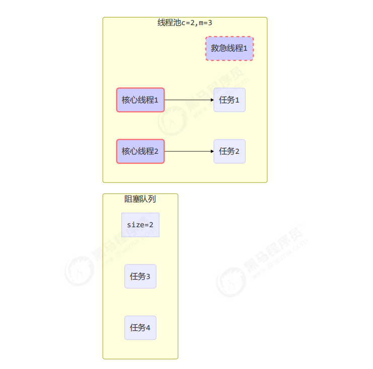
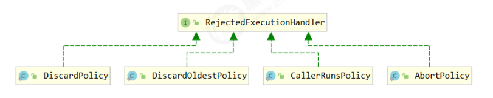
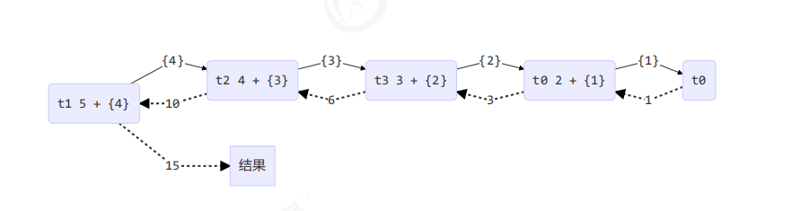
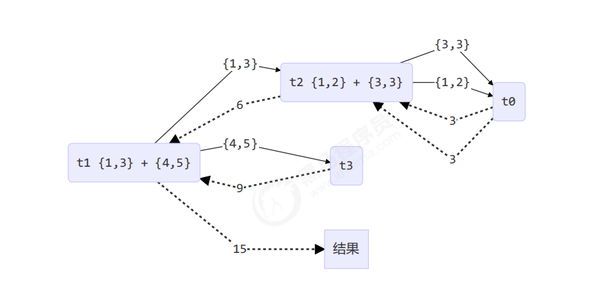

**<font style="color:#DF2A3F;">笔记来源：</font>**[**<font style="color:#DF2A3F;">黑马程序员深入学习Java并发编程，JUC并发编程全套教程</font>**](https://www.bilibili.com/video/BV16J411h7Rd/?spm_id_from=333.337.search-card.all.click&vd_source=e8046ccbdc793e09a75eb61fe8e84a30)

# 1 自定义线程池
① 自定义拒绝策略接口

```java
@FunctionalInterface // 拒绝策略
interface RejectPolicy<T> {
    void reject(BlockingQueue<T> queue, T task);
}
```


② 自定义任务队列

```java
class BlockingQueue<T> {
    // 1. 任务队列
    private Deque<T> queue = new ArrayDeque<>();
 
    // 2. 锁
    private ReentrantLock lock = new ReentrantLock();
    
    // 3. 生产者条件变量
    private Condition fullWaitSet = lock.newCondition();
 
    // 4. 消费者条件变量
    private Condition emptyWaitSet = lock.newCondition();
    
    // 5. 容量
    private int capcity;
    
    public BlockingQueue(int capcity) {
        this.capcity = capcity;
    }
 
    // 带超时阻塞获取
    public T poll(long timeout, TimeUnit unit) {
        lock.lock();
        try {
            // 将 timeout 统一转换为 纳秒
            long nanos = unit.toNanos(timeout);
            while (queue.isEmpty()) {
                try {
                    // 返回值是剩余时间
                    if (nanos <= 0) {
                        return null;
                    }
                    nanos = emptyWaitSet.awaitNanos(nanos);
                }catch (InterruptedException e) {
                    e.printStackTrace();
                }
            }

            T t = queue.removeFirst();
            fullWaitSet.signal();
            return t;
        } finally {
            lock.unlock();
        }
    }
 
    // 阻塞获取
    public T take() {
        lock.lock();
        try {
            while (queue.isEmpty()) {
                try {
                    emptyWaitSet.await();
                } catch (InterruptedException e) {
                    e.printStackTrace();
                }
            }
 
            T t = queue.removeFirst();
            fullWaitSet.signal();
            return t;
        } finally {
            lock.unlock();
        }
    }

    // 阻塞添加
    public void put(T task) {
        lock.lock();
        try {
            while (queue.size() == capcity) {
                try {
                    log.debug("等待加入任务队列 {} ...", task);
                    fullWaitSet.await();
                } catch (InterruptedException e) {
                    e.printStackTrace();
                }
            }
 
            log.debug("加入任务队列 {}", task);
            queue.addLast(task);
            emptyWaitSet.signal();
        } finally {
            lock.unlock();
        }
    }

    // 带超时时间阻塞添加
    public boolean offer(T task, long timeout, TimeUnit timeUnit) {
        lock.lock();
        try {
            long nanos = timeUnit.toNanos(timeout);
            while (queue.size() == capcity) {
                try {
                    if(nanos <= 0) {
                        return false;
                    }
                    log.debug("等待加入任务队列 {} ...", task);
                    nanos = fullWaitSet.awaitNanos(nanos);

                } catch (InterruptedException e) {
                    e.printStackTrace();
                }
            }
            log.debug("加入任务队列 {}", task);
            queue.addLast(task);
            emptyWaitSet.signal();
            return true;
        } finally {
            lock.unlock();
        }
    }

    public int size() {
        lock.lock();
        try {
            return queue.size();
        } finally {
            lock.unlock();
        }
    }

    public void tryPut(RejectPolicy<T> rejectPolicy, T task) {
        lock.lock();
        try {
            // 判断队列是否满
            if(queue.size() == capcity) {
                rejectPolicy.reject(this, task);
            } else { // 有空闲
                log.debug("加入任务队列 {}", task);
                queue.addLast(task);
                emptyWaitSet.signal();
            }
        } finally {
            lock.unlock();
        }
    }
}
```


③ 自定义线程池

```java
class ThreadPool {
    // 任务队列
     private BlockingQueue<Runnable> taskQueue;
 
    // 线程集合
    private HashSet<Worker> workers = new HashSet<>();
 
    // 核心线程数
    private int coreSize;
 
    // 获取任务时的超时时间
    private long timeout;
    private TimeUnit timeUnit;
 
    private RejectPolicy<Runnable> rejectPolicy;
 
    // 执行任务
    public void execute(Runnable task) {
        // 当任务数没有超过 coreSize 时，直接交给 worker 对象执行
        // 如果任务数超过 coreSize 时，加入任务队列暂存
        synchronized (workers) {
            if(workers.size() < coreSize) {
                Worker worker = new Worker(task);
                log.debug("新增 worker{}, {}", worker, task);
                workers.add(worker);
                worker.start();
            } else {
                // taskQueue.put(task);
                // 1) 死等
                // 2) 带超时等待
                // 3) 让调用者放弃任务执行
                // 4) 让调用者抛出异常
                // 5) 让调用者自己执行任务
                taskQueue.tryPut(rejectPolicy, task);
            }
        }
    }

    public ThreadPool(int coreSize, long timeout, TimeUnit timeUnit, int queueCapcity, RejectPolicy<Runnable> rejectPolicy) {
        this.coreSize = coreSize;
        this.timeout = timeout;
        this.timeUnit = timeUnit;
        this.taskQueue = new BlockingQueue<>(queueCapcity);
        this.rejectPolicy = rejectPolicy;
    }

    class Worker extends Thread{
        private Runnable task;
        public Worker(Runnable task) {
            this.task = task;
        }

        @Override
        public void run() {
            // 执行任务
            // 1) 当 task 不为空，执行任务
            // 2) 当 task 执行完毕，再接着从任务队列获取任务并执行
            // while(task != null || (task = taskQueue.take()) != null) {
            while(task != null || (task = taskQueue.poll(timeout, timeUnit)) != null) {
                try {
                    log.debug("正在执行...{}", task);
                    task.run();
                } catch (Exception e) {
                    e.printStackTrace();
                } finally {
                    task = null;
                }
            }
            synchronized (workers) {
                log.debug("worker 被移除{}", this);
                workers.remove(this);
            }
        }
    }
}

```

④ 测试

# 2 ThreadPoolExecutor


## 2.1 线程池状态
ThreadPoolExecutor 使用 int 的高 3 位来表示线程池状态，低 29 位表示线程数量

| 状态名 | 高3位 | 接收新任务 | 处理阻塞队列任务 | 说明 |
| --- | --- | --- | --- | --- |
| RUNNING | 111 | Y | Y | |
| SHUTDOWN | 000 | N | Y | 不会接收新任务，但会处理阻塞队列剩余任务 |
| STOP | 001 | N | N | 会中断正在执行的任务，并抛弃阻塞队列任务 |
| TIDYING | 010 | - | - | 任务全执行完毕，活动线程为 0 即将进入终结 |
| TERMINATED | 011 | - | - | 终结状态 |


从数字上比较，TERMINATED > TIDYING > STOP > SHUTDOWN > RUNNING  
这些信息存储在一个原子变量 ctl 中，目的是将线程池状态与线程个数合二为一，这样就可以用一次 cas 原子操作进行赋值

```java
// c 为旧值， ctlOf 返回结果为新值
ctl.compareAndSet(c, ctlOf(targetState, workerCountOf(c))));

// rs 为高 3 位代表线程池状态， wc 为低 29 位代表线程个数，ctl 是合并它们
private static int ctlOf(int rs, int wc) { return rs | wc; }
```

## 2.2 构造方法
```java
public ThreadPoolExecutor(int corePoolSize,
                          int maximumPoolSize,
                          long keepAliveTime,
                          TimeUnit unit,
                          BlockingQueue<Runnable> workQueue,
                          ThreadFactory threadFactory,
                          RejectedExecutionHandler handler)
```

+ corePoolSize 核心线程数目 (最多保留的线程数)
+ maximumPoolSize 最大线程数目
+ keepAliveTime 生存时间 - 针对救急线程
+ unit 时间单位 - 针对救急线程
+ workQueue 阻塞队列
+ threadFactory 线程工厂 - 可以为线程创建时起个好名字
+ handler 拒绝策略

**<font style="color:#E8323C;">工作方式</font>**




+ 线程池中刚开始没有线程，当一个任务提交给线程池后，线程池会创建一个新线程来执行任务。
+ 当线程数达到 corePoolSize 并没有线程空闲，这时再加入任务，新加的任务会被加入workQueue 队列排队，直到有空闲的线程。
+ 如果队列选择了有界队列，那么任务超过了队列大小时，会创建 maximumPoolSize - corePoolSize 数目的线程来救急。
+ 如果线程到达 maximumPoolSize 仍然有新任务这时会执行拒绝策略。拒绝策略 jdk 提供了 4 种实现，其它著名框架也提供了实现 
    - AbortPolicy 让调用者抛出 RejectedExecutionException 异常，这是默认策略
    - CallerRunsPolicy 让调用者运行任务
    - DiscardPolicy 放弃本次任务
    - DiscardOldestPolicy 放弃队列中最早的任务，本任务取而代之
    - Dubbo 的实现，在抛出 RejectedExecutionException 异常之前会记录日志，并 dump 线程栈信息，方便定位问题
    - Netty 的实现，是创建一个新线程来执行任务
    - ActiveMQ 的实现，带超时等待（60s）尝试放入队列，类似我们之前自定义的拒绝策略
    - PinPoint 的实现，它使用了一个拒绝策略链，会逐一尝试策略链中每种拒绝策略
+ 当高峰过去后，超过corePoolSize 的救急线程如果一段时间没有任务做，需要结束节省资源，这个时间由keepAliveTime 和 unit 来控制。



根据这个构造方法，JDK Executors 类中提供了众多工厂方法来创建各种用途的线程池

## 2.3 newFixedThreadPool


```java
public static ExecutorService newFixedThreadPool(int nThreads) {
    return new ThreadPoolExecutor(nThreads, nThreads,0L, TimeUnit.MILLISECONDS,new LinkedBlockingQueue<Runnable>());
}
```

**特点**

+ 核心线程数 == 最大线程数（没有救急线程被创建），因此也无需超时时间
+ 阻塞队列是无界的，可以放任意数量的任务

> 评价:适用于任务量已知，相对耗时的任务
>

## 2.4 newCachedThreadPool
```java
public static ExecutorService newCachedThreadPool() {
    return new ThreadPoolExecutor(0, Integer.MAX_VALUE,60L, TimeUnit.SECONDS,new SynchronousQueue<Runnable>());
}
```

**<font style="color:#E8323C;">特点</font>**

+ 核心线程数是 0， 最大线程数是 Integer.MAX_VALUE，救急线程的空闲生存时间是 60s，意味着全部都是救急线程（60s 后可以回收）,救急线程可以无限创建
+ 队列采用了 SynchronousQueue 实现特点是，它没有容量，没有线程来取是放不进去的（一手交钱、一手交货）

```java
SynchronousQueue<Integer> integers = new SynchronousQueue<>();
    new Thread(() -> {
        try {
            log.debug("putting {} ", 1);
            integers.put(1);
            log.debug("{} putted...", 1);
            log.debug("putting...{} ", 2);
            integers.put(2);
            log.debug("{} putted...", 2);
        } catch (InterruptedException e) {
            e.printStackTrace();
        }
    },"t1").start();

    sleep(1);

    new Thread(() -> {
        try {
            log.debug("taking {}", 1);
            integers.take();
        } catch (InterruptedException e) {
            e.printStackTrace();
        }
    },"t2").start();

    sleep(1);
    new Thread(() -> {
        try {
            log.debug("taking {}", 2);
            integers.take();
        } catch (InterruptedException e) {
            e.printStackTrace();
        }
    },"t3").start();
```

输出

```java
11:48:15.500 c.TestSynchronousQueue [t1] - putting 1 
11:48:16.500 c.TestSynchronousQueue [t2] - taking 1 
11:48:16.500 c.TestSynchronousQueue [t1] - 1 putted... 
11:48:16.500 c.TestSynchronousQueue [t1] - putting...2 
11:48:17.502 c.TestSynchronousQueue [t3] - taking 2 
11:48:17.503 c.TestSynchronousQueue [t1] - 2 putted...
```

> 评价 整个线程池表现为线程数会根据任务量不断增长，没有上限，当任务执行完毕，空闲 1分钟后释放线程。 适合任务数比较密集，但每个任务执行时间较短的情况
>

## 2.5 newSingleThreadExecutor
```java
public static ExecutorService newSingleThreadExecutor() {
    return new FinalizableDelegatedExecutorService(new ThreadPoolExecutor(1, 1, 0L, TimeUnit.MILLISECONDS, 
                                                    new LinkedBlockingQueue<Runnable>()));
}
```

**使用场景**：希望多个任务排队执行。线程数固定为 1，任务数多于 1 时，会放入无界队列排队。任务执行完毕，这唯一的线程也不会被释放。

**区别**

+ 自己创建一个单线程串行执行任务，如果任务执行失败而终止那么没有任何补救措施，而线程池还会新建一个线程，保证池的正常工作
+ Executors.newSingleThreadExecutor() 线程个数始终为1，不能修改 
    - FinalizableDelegatedExecutorService 应用的是装饰器模式，只对外暴露了 ExecutorService 接口，因此不能调用 ThreadPoolExecutor 中特有的方法
+ Executors.newFixedThreadPool(1) 初始时为1，以后还可以修改 
    - 对外暴露的是 ThreadPoolExecutor 对象，可以强转后调用 setCorePoolSize 等方法进行修改

## 2.6 提交任务
```java
// 执行任务
void execute(Runnable command);

// 提交任务 task，用返回值 Future 获得任务执行结果
<T> Future<T> submit(Callable<T> task);

// 提交 tasks 中所有任务
<T> List<Future<T>> invokeAll(Collection<? extends Callable<T>> tasks)throws InterruptedException;

// 提交 tasks 中所有任务，带超时时间
<T> List<Future<T>> invokeAll(Collection<? extends Callable<T>> tasks,
                              long timeout, TimeUnit unit)throws InterruptedException;

// 提交 tasks 中所有任务，哪个任务先成功执行完毕，返回此任务执行结果，其它任务取消
<T> T invokeAny(Collection<? extends Callable<T>> tasks)throws InterruptedException, ExecutionException;

// 提交 tasks 中所有任务，哪个任务先成功执行完毕，返回此任务执行结果，其它任务取消，带超时时间
<T> T invokeAny(Collection<? extends Callable<T>> tasks, long timeout, TimeUnit unit)
                throws InterruptedException, ExecutionException, TimeoutException;
```


## 2.7 关闭线程池
**<font style="color:#E8323C;">shutdown</font>**

```java
/*
线程池状态变为 SHUTDOWN
    - 不会接收新任务
    - 但已提交任务会执行完
    - 此方法不会阻塞调用线程的执行
*/
void shutdown();
```


```java
public void shutdown() {
    final ReentrantLock mainLock = this.mainLock;
    mainLock.lock();
    try {
        checkShutdownAccess();
        // 修改线程池状态
        advanceRunState(SHUTDOWN);
        // 仅会打断空闲线程
        interruptIdleWorkers();
        onShutdown(); // 扩展点 ScheduledThreadPoolExecutor
    } finally {
        mainLock.unlock();
    }
    // 尝试终结(没有运行的线程可以立刻终结，如果还有运行的线程也不会等)
    tryTerminate();
}
```

**<font style="color:#E8323C;">shutdownNow</font>**

```java
/*
线程池状态变为 STOP
    - 不会接收新任务
    - 会将队列中的任务返回
    - 并用 interrupt 的方式中断正在执行的任务
*/
List<Runnable> shutdownNow();
```


```java
public List<Runnable> shutdownNow() {
    List<Runnable> tasks;
    final ReentrantLock mainLock = this.mainLock;
    mainLock.lock();
    try {
        checkShutdownAccess();
        // 修改线程池状态
        advanceRunState(STOP);
        // 打断所有线程
        interruptWorkers();
        // 获取队列中剩余任务
        tasks = drainQueue();
    } finally {
        mainLock.unlock();
    }
    // 尝试终结
    tryTerminate();
    return tasks; 
}
```


**<font style="color:#E8323C;">其它方法</font>**

```java
// 不在 RUNNING 状态的线程池，此方法就返回 true
boolean isShutdown();

// 线程池状态是否是 TERMINATED
boolean isTerminated();

// 调用 shutdown 后，由于调用线程并不会等待所有任务运行结束，因此如果它想在线程池 TERMINATED 后做些事情，可以利用此方法等待
boolean awaitTermination(long timeout, TimeUnit unit) throws InterruptedException;
```


## 2.8 任务调度线程池
在『任务调度线程池』功能加入之前，可以使用 **<font style="color:#E8323C;">java.util.Timer </font>**来实现定时功能，Timer 的优点在于简单易用，但由于所有任务都是由同一个线程来调度，因此所有任务都是串行执行的，同一时间只能有一个任务在执行，前一个任务的延迟或异常都将会影响到之后的任务。

```java
public static void main(String[] args) {
    Timer timer = new Timer();
    TimerTask task1 = new TimerTask() {
        @Override
        public void run() {
            log.debug("task 1");
            sleep(2);
        }
    };

    TimerTask task2 = new TimerTask() {
        @Override
        public void run() {
            log.debug("task 2");
        }
    };

    // 使用 timer 添加两个任务，希望它们都在 1s 后执行
    // 但由于 timer 内只有一个线程来顺序执行队列中的任务，因此『任务1』的延时，影响了『任务2』的执行
    timer.schedule(task1, 1000);
    timer.schedule(task2, 1000);
}
```


输出

```java
20:46:09.444 c.TestTimer [main] - start... 
20:46:10.447 c.TestTimer [Timer-0] - task 1 
20:46:12.448 c.TestTimer [Timer-0] - task 2
```


**<font style="color:#E8323C;">使用 ScheduledExecutorService 改写</font>**

```java
ScheduledExecutorService executor = Executors.newScheduledThreadPool(2);
// 添加两个任务，希望它们都在 1s 后执行
executor.schedule(() -> {
    System.out.println("任务1，执行时间：" + new Date());
    try { 
        Thread.sleep(2000); 
    } catch (InterruptedException e) {}
}, 1000, TimeUnit.MILLISECONDS);

executor.schedule(() -> {
    System.out.println("任务2，执行时间：" + new Date());
}, 1000, TimeUnit.MILLISECONDS);
```


输出

```java
任务1，执行时间：Thu Jan 03 12:45:17 CST 2019 
任务2，执行时间：Thu Jan 03 12:45:17 CST 2019
```


scheduleAtFixedRate 例子

```java
ScheduledExecutorService pool = Executors.newScheduledThreadPool(1);
log.debug("start...");
pool.scheduleAtFixedRate(() -> {
    log.debug("running...");
}, 1, 1, TimeUnit.SECONDS);
```


输出

```java
21:45:43.167 c.TestTimer [main] - start... 
21:45:44.215 c.TestTimer [pool-1-thread-1] - running... 
21:45:45.215 c.TestTimer [pool-1-thread-1] - running... 
21:45:46.215 c.TestTimer [pool-1-thread-1] - running... 
21:45:47.215 c.TestTimer [pool-1-thread-1] - running...
```


**<font style="color:#E8323C;">scheduleAtFixedRate 例子（任务执行时间超过了间隔时间）</font>**

```java
ScheduledExecutorService pool = Executors.newScheduledThreadPool(1);
log.debug("start...");
pool.scheduleAtFixedRate(() -> {
    log.debug("running...");
    sleep(2);
}, 1, 1, TimeUnit.SECONDS);
```


输出分析：一开始，延时 1s，接下来，由于任务执行时间 > 间隔时间，间隔被『撑』到了 2s

```java
21:44:30.311 c.TestTimer [main] - start... 
21:44:31.360 c.TestTimer [pool-1-thread-1] - running... 
21:44:33.361 c.TestTimer [pool-1-thread-1] - running... 
21:44:35.362 c.TestTimer [pool-1-thread-1] - running... 
21:44:37.362 c.TestTimer [pool-1-thread-1] - running...
```


**<font style="color:#E8323C;">scheduleWithFixedDelay 例子</font>**

```java
ScheduledExecutorService pool = Executors.newScheduledThreadPool(1);
log.debug("start...");
pool.scheduleWithFixedDelay(()-> {
    log.debug("running...");
    sleep(2);
}, 1, 1, TimeUnit.SECONDS);
```


输出分析：一开始，延时 1s，scheduleWithFixedDelay 的间隔是 上一个任务结束 <-> 延时 <-> 下一个任务开始 所以间隔都是 3s

```java
21:40:55.078 c.TestTimer [main] - start... 
21:40:56.140 c.TestTimer [pool-1-thread-1] - running... 
21:40:59.143 c.TestTimer [pool-1-thread-1] - running... 
21:41:02.145 c.TestTimer [pool-1-thread-1] - running... 
21:41:05.147 c.TestTimer [pool-1-thread-1] - running...
```

> 评价:整个线程池表现为：线程数固定，任务数多于线程数时，会放入无界队列排队。任务执行完毕，这些线程也不会被释放。用来执行延迟或反复执行的任务
>


## 2.9 正确处理执行任务异常
**<font style="color:#E8323C;">方法1：主动捉异常</font>**

```java
ExecutorService pool = Executors.newFixedThreadPool(1);
pool.submit(() -> {
    try {
        log.debug("task1");
        int i = 1 / 0;
    } catch (Exception e) {
        log.error("error:", e);
    }
});
```


输出

```java
21:59:04.558 c.TestTimer [pool-1-thread-1] - task1 
21:59:04.562 c.TestTimer [pool-1-thread-1] - error: 
java.lang.ArithmeticException: / by zero 
    at cn.itcast.n8.TestTimer.lambda

$$

$$


$$

$$


$$

$$


$$

$$


main
$$

$$


$$

$$


$$

$$


$$

$$


0(TestTimer.java:28) 
    at java.util.concurrent.Executors$RunnableAdapter.call(Executors.java:511) 
    at java.util.concurrent.FutureTask.run(FutureTask.java:266) 
    at java.util.concurrent.ThreadPoolExecutor.runWorker(ThreadPoolExecutor.java:1149) 
    at java.util.concurrent.ThreadPoolExecutor$Worker.run(ThreadPoolExecutor.java:624) 
    at java.lang.Thread.run(Thread.java:748)
```


**<font style="color:#E8323C;">方法2：使用 Future</font>**

```java
ExecutorService pool = Executors.newFixedThreadPool(1);
Future<Boolean> f = pool.submit(() -> {
    log.debug("task1");
    int i = 1 / 0;
    return true;
});
log.debug("result:{}", f.get());
```


输出

```java
21:54:58.208 c.TestTimer [pool-1-thread-1] - task1 
Exception in thread "main" java.util.concurrent.ExecutionException: 
java.lang.ArithmeticException: / by zero 
    at java.util.concurrent.FutureTask.report(FutureTask.java:122) 
    at java.util.concurrent.FutureTask.get(FutureTask.java:192) 
    at cn.itcast.n8.TestTimer.main(TestTimer.java:31) 
Caused by: java.lang.ArithmeticException: / by zero 
    at cn.itcast.n8.TestTimer.lambda

$$

$$


$$

$$


$$

$$


$$

$$


main
$$

$$


$$

$$


$$

$$


$$

$$


0(TestTimer.java:28) 
    at java.util.concurrent.FutureTask.run(FutureTask.java:266) 
    at java.util.concurrent.ThreadPoolExecutor.runWorker(ThreadPoolExecutor.java:1149) 
    at java.util.concurrent.ThreadPoolExecutor$Worker.run(ThreadPoolExecutor.java:624) 
    at java.lang.Thread.run(Thread.java:748)
```

## 2.10 Tomcat 线程池
Tomcat 在哪里用到了线程池呢

+ LimitLatch 用来限流，可以控制最大连接个数，类似 J.U.C 中的 Semaphore 后面再讲
+ Acceptor 只负责【接收新的 socket 连接】
+ Poller 只负责监听 socket channel 是否有【可读的 I/O 事件】
+ 一旦可读，封装一个任务对象（socketProcessor），提交给 Executor 线程池处理
+ Executor 线程池中的工作线程最终负责【处理请求】


Tomcat 线程池扩展了 ThreadPoolExecutor，行为稍有不同

+ 如果总线程数达到 maximumPoolSize 
    - 这时不会立刻抛 RejectedExecutionException 异常
    - 而是再次尝试将任务放入队列，如果还失败，才抛出 RejectedExecutionException 异常

**<font style="color:#E8323C;">源码 tomcat-7.0.42</font>**

```java
public void execute(Runnable command, long timeout, TimeUnit unit) {
    submittedCount.incrementAndGet();
    try {
        super.execute(command);
    } catch (RejectedExecutionException rx) {
        if (super.getQueue() instanceof TaskQueue) {
            final TaskQueue queue = (TaskQueue)super.getQueue();
            try {
                if (!queue.force(command, timeout, unit)) {
                    submittedCount.decrementAndGet();
                    throw new RejectedExecutionException("Queue capacity is full.");
                }
            } catch (InterruptedException x) {
                submittedCount.decrementAndGet();
                Thread.interrupted();
                throw new RejectedExecutionException(x);
            }
        } else {
            submittedCount.decrementAndGet();
            throw rx;
        }
    }
}
```


```java
public boolean force(Runnable o, long timeout, TimeUnit unit) throws InterruptedException {
    if ( parent.isShutdown() ) 
        throw new RejectedExecutionException(
            "Executor not running, can't force a command into the queue"
        );
    return super.offer(o,timeout,unit); //forces the item onto the queue, to be used if the task is rejected
}
```


**<font style="color:#E8323C;">Connector 配置</font>**

| 配置项 | 默认值 | 说明 |
| --- | --- | --- |
| acceptorThreadCount | 1 | acceptor线程数量 |
| pollerThreadCount | 1 | poller线程数量 |
| minSpareThreads | 10 | 核心线程数，即 corePoolSize |
| maxThreads | 200 | 最大线程数，即 maximumPoolSize |
| executor | - | Executor 名称，用来引用下面的 Executor |


**<font style="color:#E8323C;">Executor 线程配置</font>**

| 配置项 | 默认值 | 说明 |
| --- | --- | --- |
| threadPriority | 5 | 线程优先级 |
| daemon | true | 是否守护线程 |
| minSpareThreads | 25 | 核心线程数，即 corePoolSize |
| maxThreads | 200 | 最大线程数，即 maximumPoolSize |
| maxIdleTime | 60000 | 线程生存时间，单位是毫秒，默认值即 1 分钟 |
| maxQueueSize | Integer.MAX_VALUE | 队列长度 |
| prestartminSpareThreads | false | 核心线程是否在服务器启动时启动 |


## 2.11 **<font style="color:rgb(255,165,0);"> </font>****<font style="color:#000000;">Worker Thread模式</font>**
## 2.12 定时任务的应用
# 3 Fork/Join
## 3.1 概念
Fork/Join 是 JDK 1.7 加入的新的线程池实现，它体现的是一种分治思想，适用于能够进行任务拆分的 cpu 密集型运算

所谓的任务拆分，是将一个大任务拆分为算法上相同的小任务，直至不能拆分可以直接求解。跟递归相关的一些计算，如归并排序、斐波那契数列、都可以用分治思想进行求解

Fork/Join 在分治的基础上加入了多线程，可以把每个任务的分解和合并交给不同的线程来完成，进一步提升了运算效率  
Fork/Join 默认会创建与 cpu 核心数大小相同的线程池


## 3.2 使用
提交给 Fork/Join 线程池的任务需要继承 RecursiveTask（有返回值）或 RecursiveAction（没有返回值），例如下面定义了一个对 1~n 之间的整数求和的任务

```java
@Slf4j(topic = "c.AddTask")
class AddTask1 extends RecursiveTask<Integer> {
    int n;
    public AddTask1(int n) {
        this.n = n;
    }
    @Override
    public String toString() {
        return "{" + n + '}';
    }
    @Override
    protected Integer compute() {
        // 如果 n 已经为 1，可以求得结果了
        if (n == 1) {
            log.debug("join() {}", n);
            return n;
        }
 
        // 将任务进行拆分(fork)
        AddTask1 t1 = new AddTask1(n - 1);
        t1.fork();
        log.debug("fork() {} + {}", n, t1);
 
        // 合并(join)结果
        int result = n + t1.join();
        log.debug("join() {} + {} = {}", n, t1, result);
        return result;
    }
}
```


然后提交给 ForkJoinPool 来执行

```java
public static void main(String[] args) {
    ForkJoinPool pool = new ForkJoinPool(4);
    System.out.println(pool.invoke(new AddTask1(5)));
}
```

结果

```java
[ForkJoinPool-1-worker-0] - fork() 2 + {1} 
[ForkJoinPool-1-worker-1] - fork() 5 + {4} 
[ForkJoinPool-1-worker-0] - join() 1 
[ForkJoinPool-1-worker-0] - join() 2 + {1} = 3 
[ForkJoinPool-1-worker-2] - fork() 4 + {3} 
[ForkJoinPool-1-worker-3] - fork() 3 + {2} 
[ForkJoinPool-1-worker-3] - join() 3 + {2} = 6 
[ForkJoinPool-1-worker-2] - join() 4 + {3} = 10 
[ForkJoinPool-1-worker-1] - join() 5 + {4} = 15 
15
```

用图来表示



改进

```java
class AddTask3 extends RecursiveTask<Integer> {
 
    int begin;
    int end;
    
    public AddTask3(int begin, int end) {
        this.begin = begin;
        this.end = end;
    }
    
    @Override
    public String toString() {
        return "{" + begin + "," + end + '}';
    }
 
    @Override
    protected Integer compute() {
        // 5, 5
        if (begin == end) {
            log.debug("join() {}", begin);
            return begin;
        }
 
        // 4, 5
        if (end - begin == 1) {
            log.debug("join() {} + {} = {}", begin, end, end + begin);
            return end + begin;
        }
 
        // 1 5
        int mid = (end + begin) / 2; // 3
        AddTask3 t1 = new AddTask3(begin, mid); // 1,3
        t1.fork();
        AddTask3 t2 = new AddTask3(mid + 1, end); // 4,5
        t2.fork();
        log.debug("fork() {} + {} = ?", t1, t2);
        int result = t1.join() + t2.join();
        log.debug("join() {} + {} = {}", t1, t2, result);
        return result;
    }
}
```


然后提交给 ForkJoinPool 来执行

```java
public static void main(String[] args) {
    ForkJoinPool pool = new ForkJoinPool(4);
    System.out.println(pool.invoke(new AddTask3(1, 10)));
}
```


结果

```java
[ForkJoinPool-1-worker-0] - join() 1 + 2 = 3 
[ForkJoinPool-1-worker-3] - join() 4 + 5 = 9 
[ForkJoinPool-1-worker-0] - join() 3 
[ForkJoinPool-1-worker-1] - fork() {1,3} + {4,5} = ? 
[ForkJoinPool-1-worker-2] - fork() {1,2} + {3,3} = ? 
[ForkJoinPool-1-worker-2] - join() {1,2} + {3,3} = 6 
[ForkJoinPool-1-worker-1] - join() {1,3} + {4,5} = 15 
15
```


用图来表示



