**<font style="color:#DF2A3F;">笔记来源：</font>**[**<font style="color:#DF2A3F;">黑马程序员深入学习Java并发编程，JUC并发编程全套教程</font>**](https://www.bilibili.com/video/BV16J411h7Rd/?spm_id_from=333.337.search-card.all.click&vd_source=e8046ccbdc793e09a75eb61fe8e84a30)

## 1 ReentrantReadWriteLock
当读操作远远高于写操作时，这时候使用 读写锁 让 读-读 可以并发，提高性能。 类似于数据库中的

```sql
select ...from ... lock in share mode
```


提供一个 数据容器类 内部分别使用读锁保护数据的 read() 方法，写锁保护数据的 write() 方法

```java
class DataContainer {
    private Object data;
    private ReentrantReadWriteLock rw = new ReentrantReadWriteLock();
    private ReentrantReadWriteLock.ReadLock r = rw.readLock();
    private ReentrantReadWriteLock.WriteLock w = rw.writeLock();

    public Object read() {
        log.debug("获取读锁...");
        r.lock();
        try {
            log.debug("读取");
            sleep(1);
            return data;
        } finally {
            log.debug("释放读锁...");
            r.unlock();
        }
    }
 
    public void write() {
        log.debug("获取写锁...");
        w.lock();
        try {
            log.debug("写入");
            sleep(1);
        } finally {
            log.debug("释放写锁...");
            w.unlock();
        }
    }
}
```


测试**<font style="color:#E8323C;">读锁-读锁</font>**可以并发

```java
DataContainer dataContainer = new DataContainer();
new Thread(() -> {
    dataContainer.read();
}, "t1").start();

new Thread(() -> {
    dataContainer.read();
}, "t2").start();
```


输出结果，从这里可以看到 Thread-0 锁定期间，Thread-1 的读操作不受影响

```java
14:05:14.341 c.DataContainer [t2] - 获取读锁... 
14:05:14.341 c.DataContainer [t1] - 获取读锁... 
14:05:14.345 c.DataContainer [t1] - 读取
14:05:14.345 c.DataContainer [t2] - 读取
14:05:15.365 c.DataContainer [t2] - 释放读锁... 
14:05:15.386 c.DataContainer [t1] - 释放读锁...
```


测试**<font style="color:#E8323C;">读锁-写锁 </font>**相互阻塞

```java
DataContainer dataContainer = new DataContainer();
new Thread(() -> {
    dataContainer.read();
}, "t1").start();

Thread.sleep(100);

new Thread(() -> {
    dataContainer.write();
}, "t2").start();
```


输出结果

```java
14:04:21.838 c.DataContainer [t1] - 获取读锁... 
14:04:21.838 c.DataContainer [t2] - 获取写锁... 
14:04:21.841 c.DataContainer [t2] - 写入
14:04:22.843 c.DataContainer [t2] - 释放写锁... 
14:04:22.843 c.DataContainer [t1] - 读取
14:04:23.843 c.DataContainer [t1] - 释放读锁...
```

**<font style="color:#E8323C;">写锁-写锁 </font>**也是相互阻塞的，这里就不测试了


注意事项

+ 读锁不支持条件变量
+ 重入时升级不支持：即持有读锁的情况下去获取写锁，会导致获取写锁永久等待

```java
r.lock();
try {
    // ...
    w.lock();
    try {
        // ...
    } finally{
        w.unlock();
    }
} finally{
    r.unlock();
}
```


+ 重入时降级支持：即持有写锁的情况下去获取读锁

```java
class CachedData {
    Object data;
    // 是否有效，如果失效，需要重新计算 data
    volatile boolean cacheValid;
    final ReentrantReadWriteLock rwl = new ReentrantReadWriteLock();
    void processCachedData() {
        rwl.readLock().lock();
        if (!cacheValid) {
            // 获取写锁前必须释放读锁
            rwl.readLock().unlock();
            rwl.writeLock().lock();
            try {
                // 判断是否有其它线程已经获取了写锁、更新了缓存, 避免重复更新
                if (!cacheValid) {
                    data = ...
                    cacheValid = true;
                }
             // 降级为读锁, 释放写锁, 这样能够让其它线程读取缓存
                rwl.readLock().lock();
            } finally {
                rwl.writeLock().unlock();
            }
        }
        // 自己用完数据, 释放读锁 
        try {
            use(data);
        } finally {
            rwl.readLock().unlock();
        }
    }
}
```

## 2 缓存
## 3 读写锁原理
### 3.1 图解流程
读写锁用的是同一个 Sycn 同步器，因此等待队列、state 等也是同一个

#### <font style="color:#000000;">3.1.1 t1 w.lock，t2 r.lock</font>
1） t1 成功上锁，流程与 ReentrantLock 加锁相比没有特殊之处，不同是写锁状态占了 state 的低 16 位，而读锁使用的是 state 的高 16 位  
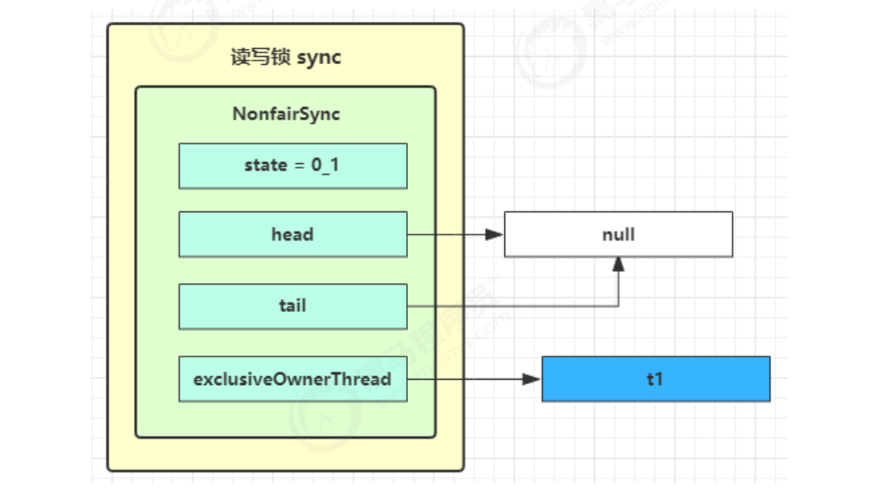


2）t2 执行 r.lock，这时进入读锁的 sync.acquireShared(1) 流程，首先会进入 tryAcquireShared 流程。如果有写锁占据，那么 tryAcquireShared 返回 -1 表示失败

tryAcquireShared 返回值表示

+ -1 表示失败
+ 0 表示成功，但后继节点不会继续唤醒
+ 正数表示成功，而且数值是还有几个后继节点需要唤醒，读写锁返回 1


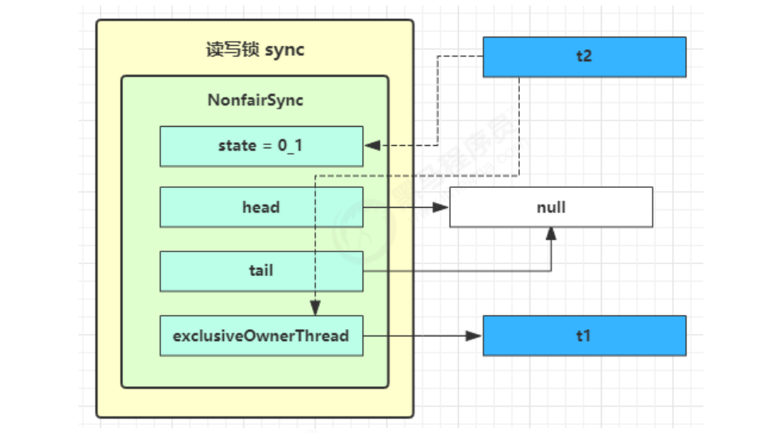


3）这时会进入 sync.doAcquireShared(1) 流程，首先也是调用 addWaiter 添加节点，不同之处在于节点被设置为Node.SHARED 模式而非 Node.EXCLUSIVE 模式，注意此时 t2 仍处于活跃状态  
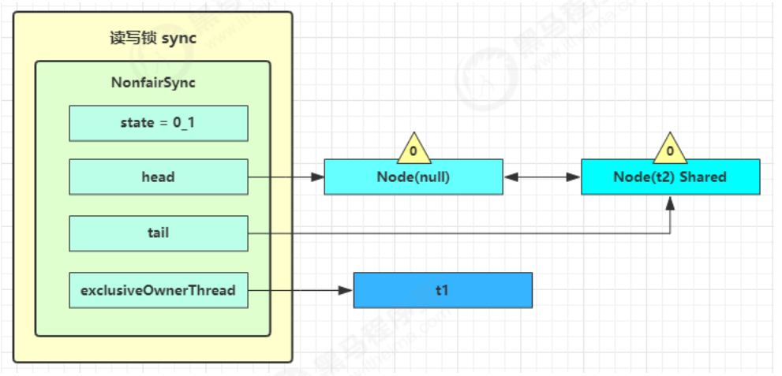


4）t2 会看看自己的节点是不是老二，如果是，还会再次调用 tryAcquireShared(1) 来尝试获取锁  
5）如果没有成功，在 doAcquireShared 内 `for (;;)` 循环一次，把前驱节点的 waitStatus 改为 -1，再 `for (;;)` 循环一次尝试 tryAcquireShared(1) 如果还不成功，那么在 parkAndCheckInterrupt() 处 park  
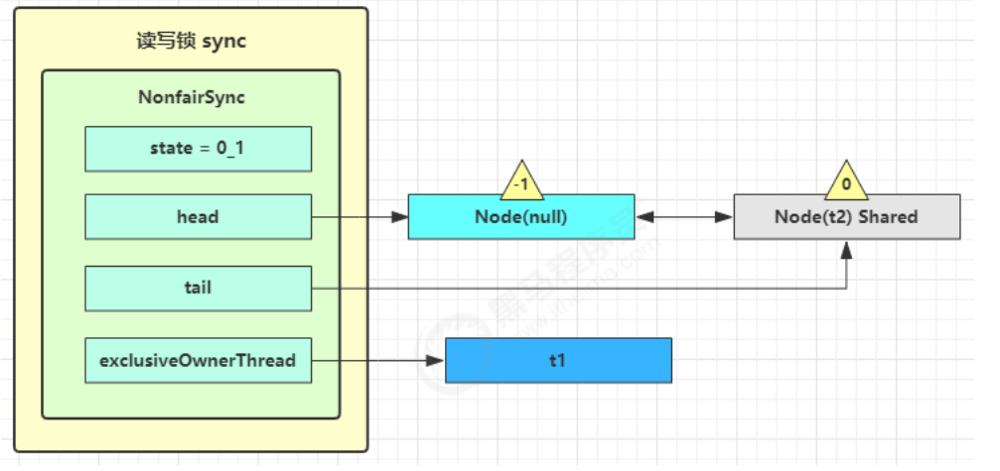

#### <font style="color:#000000;">3.1.2 t3 r.lock，t4 w.lock</font>
这种状态下，假设又有 t3 加读锁和 t4 加写锁，这期间 t1 仍然持有锁，就变成了下面的样子  
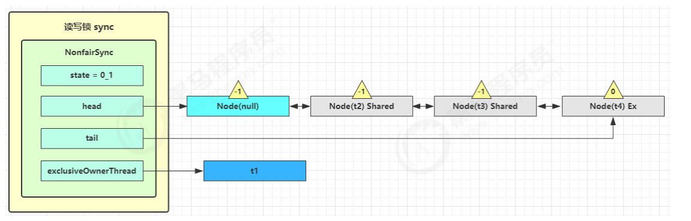

#### <font style="color:#000000;">3.1.3 t1 w.unlock</font>
这时会走到写锁的 sync.release(1) 流程，调用 sync.tryRelease(1) 成功，变成下面的样子  
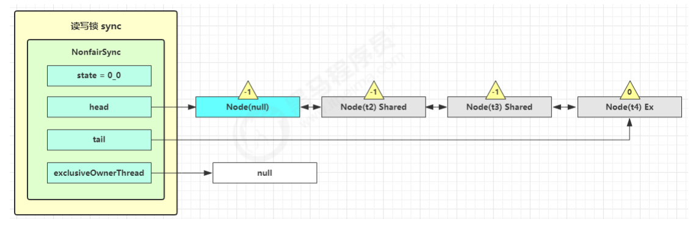

接下来执行唤醒流程 sync.unparkSuccessor，即让老二恢复运行，这时 t2 在 doAcquireShared 内parkAndCheckInterrupt() 处恢复运行

这回再来一次 `<font style="color:#E8323C;">for (;;)</font>` 执行 tryAcquireShared 成功则让读锁计数加一  
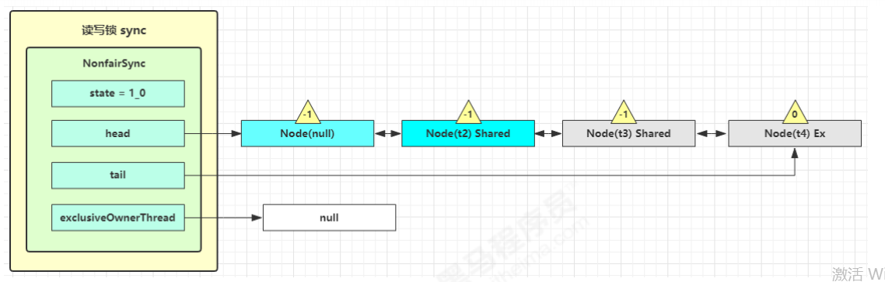


这时 t2 已经恢复运行，接下来 t2 调用 setHeadAndPropagate(node, 1)，它原本所在节点被置为头节点  
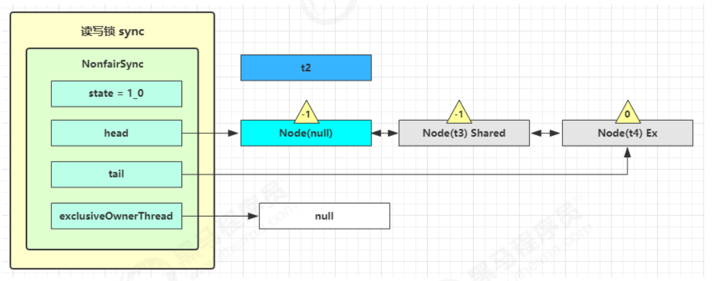


事情还没完，在 setHeadAndPropagate 方法内还会检查下一个节点是否是 shared，如果是则调用doReleaseShared() 将 head 的状态从 -1 改为 0 并唤醒老二，这时 t3 在 doAcquireShared 内parkAndCheckInterrupt() 处恢复运行  


这回再来一次`<font style="color:#E8323C;">for (;;)</font>` 执行 tryAcquireShared 成功则让读锁计数加一  


这时 t3 已经恢复运行，接下来 t3 调用 setHeadAndPropagate(node, 1)，它原本所在节点被置为头节点  
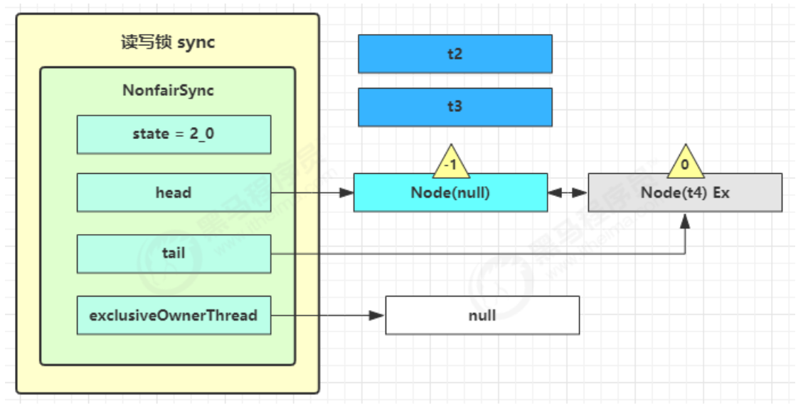

下一个节点不是 shared 了，因此不会继续唤醒 t4 所在节点

#### <font style="color:#000000;">3.1.4 t2 r.unlock，t3 r.unlock</font>
t2 进入 sync.releaseShared(1) 中，调用 tryReleaseShared(1) 让计数减一，但由于计数还不为零  
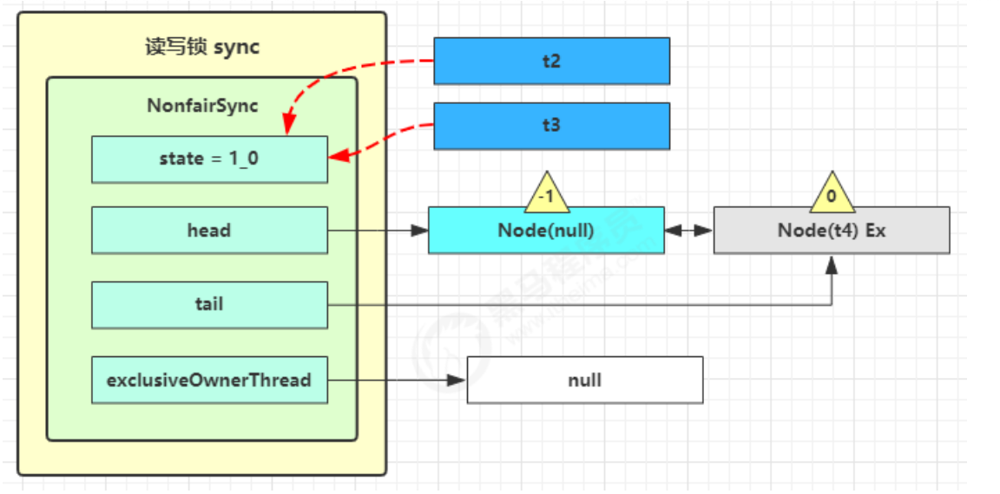


t3 进入 sync.releaseShared(1) 中，调用 tryReleaseShared(1) 让计数减一，这回计数为零了，进入doReleaseShared() 将头节点从 -1 改为 0 并唤醒老二，即  


之后 t4 在 acquireQueued 中 parkAndCheckInterrupt 处恢复运行，再次 `<font style="color:#E8323C;">for (;;)</font>` 这次自己是老二，并且没有其他竞争，tryAcquire(1) 成功，修改头结点，流程结束  
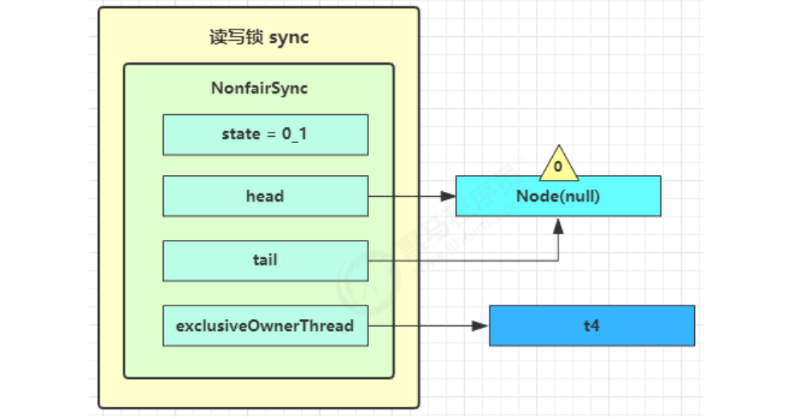


### 3.2 源码分析
#### 3.2.1 写锁上锁流程
```java
static final class NonfairSync extends Sync {
    // ... 省略无关代码

    // 外部类 WriteLock 方法, 方便阅读, 放在此处
    public void lock() {
        sync.acquire(1);
    }

    // AQS 继承过来的方法, 方便阅读, 放在此处
    public final void acquire(int arg) {
        if (
            // 尝试获得写锁失败
            !tryAcquire(arg) &&
            // 将当前线程关联到一个 Node 对象上, 模式为独占模式
            // 进入 AQS 队列阻塞
            acquireQueued(addWaiter(Node.EXCLUSIVE), arg)
        ) {
            selfInterrupt();
        }
    }

    // Sync 继承过来的方法, 方便阅读, 放在此处
    protected final boolean tryAcquire(int acquires) {
        // 获得低 16 位, 代表写锁的 state 计数
        Thread current = Thread.currentThread();
        int c = getState();
        int w = exclusiveCount(c);

        if (c != 0) {
            if (
                // c != 0 and w == 0 表示有读锁, 或者
                w == 0 ||
                // 如果 exclusiveOwnerThread 不是自己
                current != getExclusiveOwnerThread()
            ) {
                // 获得锁失败
                return false;
            }
            // 写锁计数超过低 16 位, 报异常
            if (w + exclusiveCount(acquires) > MAX_COUNT)
                throw new Error("Maximum lock count exceeded");
            // 写锁重入, 获得锁成功
            setState(c + acquires);
            return true;
        }
        if (
            // 判断写锁是否该阻塞, 或者
            writerShouldBlock() ||
            // 尝试更改计数失败
            !compareAndSetState(c, c + acquires)
        ) {
            // 获得锁失败
            return false;
        }
        // 获得锁成功
        setExclusiveOwnerThread(current);
        return true;
    }

    // 非公平锁 writerShouldBlock 总是返回 false, 无需阻塞
    final boolean writerShouldBlock() {
        return false;
    }
}
```

#### 3.3.2 写锁释放流程
```java
static final class NonfairSync extends Sync {
    // ... 省略无关代码

    // WriteLock 方法, 方便阅读, 放在此处
    public void unlock() {
        sync.release(1);
    }

    // AQS 继承过来的方法, 方便阅读, 放在此处
    public final boolean release(int arg) {
        // 尝试释放写锁成功

        if (tryRelease(arg)) {
            // unpark AQS 中等待的线程
            Node h = head;
            if (h != null && h.waitStatus != 0)
                unparkSuccessor(h);
            return true;
        }
        return false;
    }

    // Sync 继承过来的方法, 方便阅读, 放在此处
    protected final boolean tryRelease(int releases) {
        if (!isHeldExclusively())
            throw new IllegalMonitorStateException();
        int nextc = getState() - releases;
        // 因为可重入的原因, 写锁计数为 0, 才算释放成功
        boolean free = exclusiveCount(nextc) == 0;
        if (free) {
            setExclusiveOwnerThread(null);
        }
        setState(nextc);
        return free;
    }
}
```

#### 3.3.3 读锁上锁流程
```java
static final class NonfairSync extends Sync {

    // ReadLock 方法, 方便阅读, 放在此处
    public void lock() {
        sync.acquireShared(1);
    }

    // AQS 继承过来的方法, 方便阅读, 放在此处
    public final void acquireShared(int arg) {
        // tryAcquireShared 返回负数, 表示获取读锁失败
        if (tryAcquireShared(arg) < 0) {
            doAcquireShared(arg);
        }
    }

    // Sync 继承过来的方法, 方便阅读, 放在此处
    protected final int tryAcquireShared(int unused) {
        Thread current = Thread.currentThread();
        int c = getState();
        // 如果是其它线程持有写锁, 获取读锁失败
        if (
            exclusiveCount(c) != 0 &&
            getExclusiveOwnerThread() != current
        ) {
            return -1;
        }
        int r = sharedCount(c);
        if (
            // 读锁不该阻塞(如果老二是写锁，读锁该阻塞), 并且
            !readerShouldBlock() &&
            // 小于读锁计数, 并且
            r < MAX_COUNT &&
            // 尝试增加计数成功
            compareAndSetState(c, c + SHARED_UNIT)
         ) {
            // ... 省略不重要的代码
            return 1;
        }
        return fullTryAcquireShared(current);
    }

    // 非公平锁 readerShouldBlock 看 AQS 队列中第一个节点是否是写锁
    // true 则该阻塞, false 则不阻塞
    final boolean readerShouldBlock() {
        return apparentlyFirstQueuedIsExclusive();
    }

    // AQS 继承过来的方法, 方便阅读, 放在此处
    // 与 tryAcquireShared 功能类似, 但会不断尝试 for (;;) 获取读锁, 执行过程中无阻塞
    final int fullTryAcquireShared(Thread current) {
        HoldCounter rh = null;
        for (;;) {
            int c = getState();
            if (exclusiveCount(c) != 0) {
                if (getExclusiveOwnerThread() != current)
                    return -1;
            } else if (readerShouldBlock()) {
                 // ... 省略不重要的代码
            }
            if (sharedCount(c) == MAX_COUNT)
                throw new Error("Maximum lock count exceeded");
            if (compareAndSetState(c, c + SHARED_UNIT)) {
                // ... 省略不重要的代码
                return 1;
            }
        }
    }

    // AQS 继承过来的方法, 方便阅读, 放在此处
    private void doAcquireShared(int arg) {
        // 将当前线程关联到一个 Node 对象上, 模式为共享模式
        final Node node = addWaiter(Node.SHARED);
        boolean failed = true;
        try {
            boolean interrupted = false;
            for (;;) {
                final Node p = node.predecessor();
                if (p == head) {
                    // 再一次尝试获取读锁
                    int r = tryAcquireShared(arg);
                    // 成功
                    if (r >= 0) {
                        // ㈠
                        // r 表示可用资源数, 在这里总是 1 允许传播
                        //（唤醒 AQS 中下一个 Share 节点）
                        setHeadAndPropagate(node, r);
                        p.next = null; // help GC
                        if (interrupted)
                            selfInterrupt();
                        failed = false;
                        return;
                    }
                }
                if (
                    // 是否在获取读锁失败时阻塞（前一个阶段 waitStatus == Node.SIGNAL）
                    shouldParkAfterFailedAcquire(p, node) &&
                    // park 当前线程
                    parkAndCheckInterrupt()
                 ) {
                    interrupted = true;
                }
            }
        } finally {
            if (failed)
                cancelAcquire(node);
        }
    }

    // ㈠ AQS 继承过来的方法, 方便阅读, 放在此处
    private void setHeadAndPropagate(Node node, int propagate) {
        Node h = head; // Record old head for check below
        // 设置自己为 head
        setHead(node);

        // propagate 表示有共享资源（例如共享读锁或信号量）
        // 原 head waitStatus == Node.SIGNAL 或 Node.PROPAGATE
        // 现在 head waitStatus == Node.SIGNAL 或 Node.PROPAGATE
        if (propagate > 0 || h == null || h.waitStatus < 0 ||
            (h = head) == null || h.waitStatus < 0) {
            Node s = node.next;
            // 如果是最后一个节点或者是等待共享读锁的节点
            if (s == null || s.isShared()) {
                // 进入 ㈡
                doReleaseShared();
            }
        }
    }

    // ㈡ AQS 继承过来的方法, 方便阅读, 放在此处
    private void doReleaseShared() {
        // 如果 head.waitStatus == Node.SIGNAL ==> 0 成功, 下一个节点 unpark
        // 如果 head.waitStatus == 0 ==> Node.PROPAGATE, 为了解决 bug, 见后面分析
        for (;;) {
            Node h = head;
            // 队列还有节点
            if (h != null && h != tail) {
                int ws = h.waitStatus;
                if (ws == Node.SIGNAL) {
                    if (!compareAndSetWaitStatus(h, Node.SIGNAL, 0))
                        continue; // loop to recheck cases
                    // 下一个节点 unpark 如果成功获取读锁
                    // 并且下下个节点还是 shared, 继续 doReleaseShared
                    unparkSuccessor(h);
                }
                else if (ws == 0 &&
                    !compareAndSetWaitStatus(h, 0, Node.PROPAGATE))
                        continue; // loop on failed CAS
            }
        if (h == head) // loop if head changed
            break;
        }
    }
}
```

#### 3.3.4 读锁释放流程
```java
static final class NonfairSync extends Sync {
    // ReadLock 方法, 方便阅读, 放在此处
    public void unlock() {
        sync.releaseShared(1);
    }

    // AQS 继承过来的方法, 方便阅读, 放在此处
    public final boolean releaseShared(int arg) {
        if (tryReleaseShared(arg)) {
            doReleaseShared();
            return true;
        }
        return false;
    }

    // Sync 继承过来的方法, 方便阅读, 放在此处
    protected final boolean tryReleaseShared(int unused) {
        // ... 省略不重要的代码
        for (;;) {
            int c = getState();
            int nextc = c - SHARED_UNIT;
            if (compareAndSetState(c, nextc)) {
            // 读锁的计数不会影响其它获取读锁线程, 但会影响其它获取写锁线程
            // 计数为 0 才是真正释放
                return nextc == 0;
            }
        }
    }

    // AQS 继承过来的方法, 方便阅读, 放在此处
    private void doReleaseShared() {
        // 如果 head.waitStatus == Node.SIGNAL ==> 0 成功, 下一个节点 unpark
        // 如果 head.waitStatus == 0 ==> Node.PROPAGATE
        for (;;) {
            Node h = head;
            if (h != null && h != tail) {
                int ws = h.waitStatus;
                // 如果有其它线程也在释放读锁，那么需要将 waitStatus 先改为 0
                // 防止 unparkSuccessor 被多次执行
                if (ws == Node.SIGNAL) {
                    if (!compareAndSetWaitStatus(h, Node.SIGNAL, 0))
                        continue; // loop to recheck cases
                    unparkSuccessor(h);
                }
                // 如果已经是 0 了，改为 -3，用来解决传播性，见后文信号量 bug 分析
                else if (ws == 0 &&
                    !compareAndSetWaitStatus(h, 0, Node.PROPAGATE))
                    continue; // loop on failed CAS
            }
            if (h == head) // loop if head changed
                break;
            }
    }
}
```

## 4 StampedLock
该类自 JDK 8 加入，是为了进一步优化读性能，它的特点是在使用读锁、写锁时都必须配合【戳】使用  
**<font style="color:#E8323C;">加解读锁</font>**

```java
long stamp = lock.readLock();
lock.unlockRead(stamp);
```


**<font style="color:#E8323C;">加解写锁</font>**

```java
long stamp = lock.writeLock();
lock.unlockWrite(stamp);
```


乐观读，StampedLock 支持 tryOptimisticRead() 方法（乐观读），读取完毕后需要做一次 戳校验 如果校验通过，表示这期间确实没有写操作，数据可以安全使用，如果校验没通过，需要重新获取读锁，保证数据安全。

```java
long stamp = lock.tryOptimisticRead();
// 验戳
if(!lock.validate(stamp)){
    // 锁升级
}
```


提供一个 数据容器类 内部分别使用读锁保护数据的 read() 方法，写锁保护数据的 write() 方法

```java
class DataContainerStamped {
    private int data;

    private final StampedLock lock = new StampedLock();
 
    public DataContainerStamped(int data) {
        this.data = data;
    }
 
    public int read(int readTime) {
        long stamp = lock.tryOptimisticRead();
        log.debug("optimistic read locking...{}", stamp);
        sleep(readTime);
        if (lock.validate(stamp)) {
            log.debug("read finish...{}, data:{}", stamp, data);
            return data;
        }
        // 锁升级 - 读锁
        log.debug("updating to read lock... {}", stamp);
        try {
            stamp = lock.readLock();
            log.debug("read lock {}", stamp);
            sleep(readTime);
            log.debug("read finish...{}, data:{}", stamp, data);
            return data;
        } finally {
            log.debug("read unlock {}", stamp);
            lock.unlockRead(stamp);
        }
    }

    public void write(int newData) {
        long stamp = lock.writeLock();
        log.debug("write lock {}", stamp);
        try {
            sleep(2);
            this.data = newData;
        } finally {
            log.debug("write unlock {}", stamp);
            lock.unlockWrite(stamp);
        }
    }
}
```


测试**<font style="color:#E8323C;">读-读</font>**可以优化

```java
public static void main(String[] args) {
    DataContainerStamped dataContainer = new DataContainerStamped(1);
    new Thread(() -> {
        dataContainer.read(1);
    }, "t1").start();
    sleep(0.5);
    new Thread(() -> {
        dataContainer.read(0);
    }, "t2").start();
}
```


输出结果，可以看到实际没有加读锁

```java
15:58:50.217 c.DataContainerStamped [t1] - optimistic read locking...256 
15:58:50.717 c.DataContainerStamped [t2] - optimistic read locking...256 
15:58:50.717 c.DataContainerStamped [t2] - read finish...256, data:1 
15:58:51.220 c.DataContainerStamped [t1] - read finish...256, data:1
```


测试**<font style="color:#E8323C;">读-写</font>**时优化读补加读锁

```java
public static void main(String[] args) {
    DataContainerStamped dataContainer = new DataContainerStamped(1);
    new Thread(() -> {
        dataContainer.read(1);
    }, "t1").start();
    
    sleep(0.5);
    new Thread(() -> {
        dataContainer.write(100);
    }, "t2").start();
}
```


输出结果

```java
15:57:00.219 c.DataContainerStamped [t1] - optimistic read locking...256 
15:57:00.717 c.DataContainerStamped [t2] - write lock 384 
15:57:01.225 c.DataContainerStamped [t1] - updating to read lock... 256 
15:57:02.719 c.DataContainerStamped [t2] - write unlock 384 
15:57:02.719 c.DataContainerStamped [t1] - read lock 513 
15:57:03.719 c.DataContainerStamped [t1] - read finish...513, data:1000 
15:57:03.719 c.DataContainerStamped [t1] - read unlock 513
```

注意

> StampedLock 不支持条件变量  
StampedLock 不支持可重入
>


# 196. 
