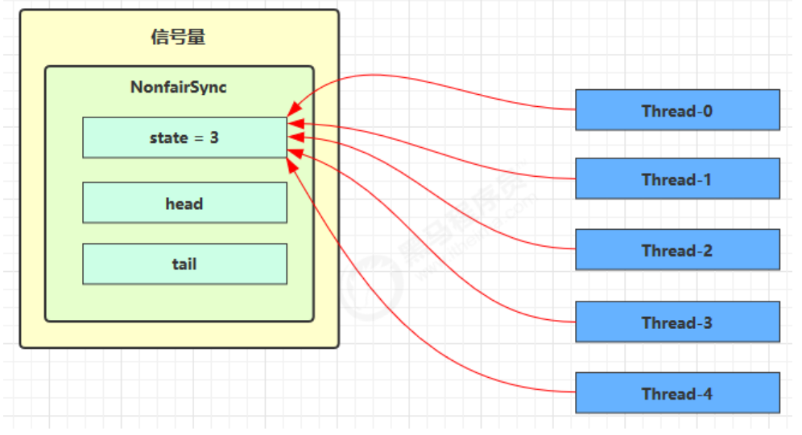

**笔记来源：**[**黑马程序员深入学习Java并发编程，JUC并发编程全套教程**](https://www.bilibili.com/video/BV16J411h7Rd/?spm_id_from=333.337.search-card.all.click&vd_source=e8046ccbdc793e09a75eb61fe8e84a30)

------

## 1 基本使用
[ˈsɛməˌfɔr] 信号量，用来限制能同时访问共享资源的线程上限。

```java
public static void main(String[] args) {
    // 1. 创建 semaphore 对象
    Semaphore semaphore = new Semaphore(3);
    // 2. 10个线程同时运行
    for (int i = 0; i < 10; i++) {
        new Thread(() -> {
            // 3. 获取许可
            try {
                semaphore.acquire();
            } catch (InterruptedException e) {
                e.printStackTrace();
            }
            try {
                log.debug("running...");
                sleep(1);
                log.debug("end...");
            } finally {
                // 4. 释放许可
                semaphore.release();
            }
        }).start();
    }
 }
```

输出

```java
07:35:15.485 c.TestSemaphore [Thread-2] - running... 
07:35:15.485 c.TestSemaphore [Thread-1] - running... 
07:35:15.485 c.TestSemaphore [Thread-0] - running... 
07:35:16.490 c.TestSemaphore [Thread-2] - end... 
07:35:16.490 c.TestSemaphore [Thread-0] - end... 
07:35:16.490 c.TestSemaphore [Thread-1] - end... 
07:35:16.490 c.TestSemaphore [Thread-3] - running... 
07:35:16.490 c.TestSemaphore [Thread-5] - running... 
07:35:16.490 c.TestSemaphore [Thread-4] - running... 
07:35:17.490 c.TestSemaphore [Thread-5] - end... 
07:35:17.490 c.TestSemaphore [Thread-4] - end... 
07:35:17.490 c.TestSemaphore [Thread-3] - end... 
07:35:17.490 c.TestSemaphore [Thread-6] - running... 
07:35:17.490 c.TestSemaphore [Thread-7] - running... 
07:35:17.490 c.TestSemaphore [Thread-9] - running... 
07:35:18.491 c.TestSemaphore [Thread-6] - end... 
07:35:18.491 c.TestSemaphore [Thread-7] - end... 
07:35:18.491 c.TestSemaphore [Thread-9] - end... 
07:35:18.491 c.TestSemaphore [Thread-8] - running... 
07:35:19.492 c.TestSemaphore [Thread-8] - end...
```

## 2 Semaphore应用
## 3 Semaphore原理
### 3.1 加锁解锁流程


Semaphore 有点像一个停车场，permits 就好像停车位数量，当线程获得了 permits 就像是获得了停车位，然后停车场显示空余车位减一

刚开始，permits（state）为 3，这时 5 个线程来获取资源  


假设其中 Thread-1，Thread-2，Thread-4 cas 竞争成功，而 Thread-0 和 Thread-3 竞争失败，进入 AQS 队列park 阻塞  


这时 Thread-4 释放了 permits，状态如下  


接下来 Thread-0 竞争成功，permits 再次设置为 0，设置自己为 head 节点，断开原来的 head 节点，unpark 接下来的 Thread-3 节点，但由于 permits 是 0，因此 Thread-3 在尝试不成功后再次进入 park 状态  


### 3.2 源码分析
```java
static final class NonfairSync extends Sync {
    private static final long serialVersionUID = -2694183684443567898L;
    NonfairSync(int permits) {
        // permits 即 state
        super(permits);
    }

    // Semaphore 方法, 方便阅读, 放在此处
    public void acquire() throws InterruptedException {
        sync.acquireSharedInterruptibly(1);
    }

    // AQS 继承过来的方法, 方便阅读, 放在此处
    public final void acquireSharedInterruptibly(int arg)
        throws InterruptedException {
        if (Thread.interrupted())
            throw new InterruptedException();
        if (tryAcquireShared(arg) < 0)
            doAcquireSharedInterruptibly(arg);
    }

    // 尝试获得共享锁
    protected int tryAcquireShared(int acquires) {
        return nonfairTryAcquireShared(acquires);
    }

    // Sync 继承过来的方法, 方便阅读, 放在此处
    final int nonfairTryAcquireShared(int acquires) {
        for (;;) {
            int available = getState();
            int remaining = available - acquires;
            if (
                // 如果许可已经用完, 返回负数, 表示获取失败, 进入 doAcquireSharedInterruptibly
                remaining < 0 ||
                // 如果 cas 重试成功, 返回正数, 表示获取成功
                compareAndSetState(available, remaining)
            ) {
                return remaining;
            }
        }
    }

    // AQS 继承过来的方法, 方便阅读, 放在此处
    private void doAcquireSharedInterruptibly(int arg) throws InterruptedException {
        final Node node = addWaiter(Node.SHARED);
        boolean failed = true;
        try {
            for (;;) {
                final Node p = node.predecessor();
                if (p == head) {
                    // 再次尝试获取许可
                    int r = tryAcquireShared(arg);
                    if (r >= 0) {
                        // 成功后本线程出队（AQS）, 所在 Node设置为 head
                        // 如果 head.waitStatus == Node.SIGNAL ==> 0 成功, 下一个节点 unpark
                        // 如果 head.waitStatus == 0 ==> Node.PROPAGATE
                        // r 表示可用资源数, 为 0 则不会继续传播
                        setHeadAndPropagate(node, r);
                        p.next = null; // help GC
                        failed = false;
                        return;
                    }
                }
                // 不成功, 设置上一个节点 waitStatus = Node.SIGNAL, 下轮进入 park 阻塞
                if (shouldParkAfterFailedAcquire(p, node) &&
                    parkAndCheckInterrupt())
                        throw new InterruptedException();
            }
        } finally {
            if (failed)
                cancelAcquire(node);
        }
    }

    // Semaphore 方法, 方便阅读, 放在此处
    public void release() {
        sync.releaseShared(1);
    }

    // AQS 继承过来的方法, 方便阅读, 放在此处
    public final boolean releaseShared(int arg) {
        if (tryReleaseShared(arg)) {
            doReleaseShared();
            return true;
        }
        return false;
    }

    // Sync 继承过来的方法, 方便阅读, 放在此处
    protected final boolean tryReleaseShared(int releases) {
        for (;;) {
            int current = getState();
            int next = current + releases;
            if (next < current) // overflow
                throw new Error("Maximum permit count exceeded");
            if (compareAndSetState(current, next))
                return true;
        }
    }
}
```

### 3.3 为什么要有PROPAGATE
早期有 bug。

releaseShared 方法

```java
public final boolean releaseShared(int arg) {
    if (tryReleaseShared(arg)) {
        Node h = head;
        if (h != null && h.waitStatus != 0)
            unparkSuccessor(h);
        return true;
    }
    return false;
}
```

doAcquireShared 方法

```java
private void doAcquireShared(int arg) {
    final Node node = addWaiter(Node.SHARED);
    boolean failed = true;
    try {
        boolean interrupted = false;
        for (;;) {
            final Node p = node.predecessor();
            if (p == head) {
                int r = tryAcquireShared(arg);
                if (r >= 0) {
                    // 这里会有空档
                    setHeadAndPropagate(node, r);
                    p.next = null; // help GC
                    if (interrupted)
                        selfInterrupt();
                    failed = false;
                    return;
                }
            }
            if (shouldParkAfterFailedAcquire(p, node) &&
                parkAndCheckInterrupt())
                    interrupted = true;
        }
    } finally {
        if (failed)
            cancelAcquire(node);
    }
}
```

setHeadAndPropagate 方法

```java
private void setHeadAndPropagate(Node node, int propagate) {
    setHead(node);
    // 有空闲资源
    if (propagate > 0 && node.waitStatus != 0) {
        Node s = node.next;
        // 下一个
        if (s == null || s.isShared())
            unparkSuccessor(node);
    }
}
```

假设存在某次循环中队列里排队的结点情况为 head(-1)->t1(-1)->t2(-1)  
假设存在将要信号量释放的 T3 和 T4，释放顺序为先 T3 后 T4

#### 3.3.1 正常流程  


#### 3.3.2 产生 bug 的情况  


修复前版本执行流程

1. T3 调用 releaseShared(1)，直接调用了 unparkSuccessor(head)，head 的等待状态从 -1 变为 0
2. T1 由于 T3 释放信号量被唤醒，调用 tryAcquireShared，假设返回值为 0（获取锁成功，但没有剩余资源量）
3. T4 调用 releaseShared(1)，此时 head.waitStatus 为 0（此时读到的 head 和 1 中为同一个head），不满足条件，因此不调用 unparkSuccessor(head)
4. T1 获取信号量成功，调用 setHeadAndPropagate 时，因为不满足 propagate > 0（2 的返回值也就是propagate（剩余资源量） == 0），从而不会唤醒后继结点， T2 线程得不到唤醒


#### 3.3.3 bug 修复后
```java
private void setHeadAndPropagate(Node node, int propagate) {
    Node h = head; // Record old head for check below
    // 设置自己为 head
    setHead(node);
 
    // propagate 表示有共享资源（例如共享读锁或信号量）
    // 原 head waitStatus == Node.SIGNAL 或 Node.PROPAGATE
    // 现在 head waitStatus == Node.SIGNAL 或 Node.PROPAGATE
    if (propagate > 0 || h == null || h.waitStatus < 0 ||
        (h = head) == null || h.waitStatus < 0) {
        Node s = node.next;
        // 如果是最后一个节点或者是等待共享读锁的节点
        if (s == null || s.isShared()) {
            doReleaseShared();
        }
    }
}

private void doReleaseShared() {
    // 如果 head.waitStatus == Node.SIGNAL ==> 0 成功, 下一个节点 unpark
    // 如果 head.waitStatus == 0 ==> Node.PROPAGATE
    for (;;) {
        Node h = head;
        if (h != null && h != tail) {
            int ws = h.waitStatus;
            if (ws == Node.SIGNAL) {
                if (!compareAndSetWaitStatus(h, Node.SIGNAL, 0))
                    continue; // loop to recheck cases
                unparkSuccessor(h);
            }
            else if (ws == 0 &&
                !compareAndSetWaitStatus(h, 0, Node.PROPAGATE))
                continue; // loop on failed CAS
        }
        if (h == head) // loop if head changed
            break;
    }
}
```


1. T3 调用 releaseShared()，直接调用了 unparkSuccessor(head)，head 的等待状态从 -1 变为 0
2. T1 由于 T3 释放信号量被唤醒，调用 tryAcquireShared，假设返回值为 0（获取锁成功，但没有剩余资源量）
3. T4 调用 releaseShared()，此时 head.waitStatus 为 0（此时读到的 head 和 1 中为同一个 head），调用doReleaseShared() 将等待状态置为 PROPAGATE（-3）
4. T1 获取信号量成功，调用 setHeadAndPropagate 时，读到 h.waitStatus < 0，从而调用doReleaseShared() 唤醒 T2

