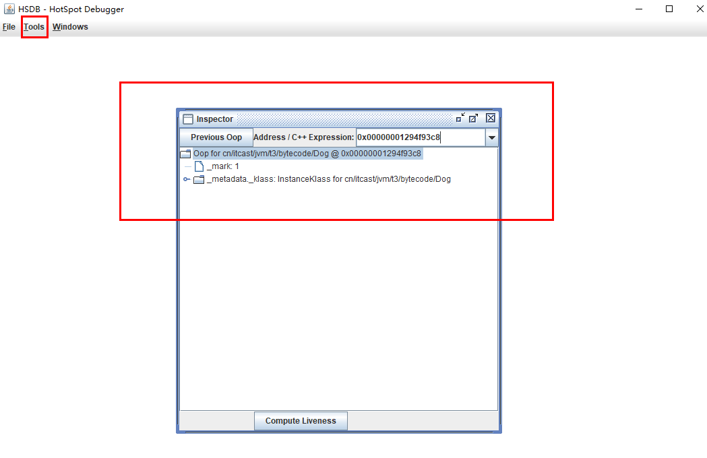

# 9. <font style="color:rgb(51,51,51);">1 入门 </font>
<font style="color:rgb(51,51,51);">接着类文件结构的内容，研究一下两组字节码指令，一个是</font>`<font style="color:rgb(51,51,51);">public cn.itcast.jvm.t5.HelloWorld();</font>`<font style="color:rgb(51,51,51);">构造方法的字节码指令</font>

```plain
2a b7 00 01 b1 
```

1. <font style="color:rgb(51,51,51);">2a => </font>_<font style="color:rgb(51,51,51);">aload_0 </font>_<font style="color:rgb(51,51,51);">加载 slot 0 的局部变量，即 this，做为下面的 </font>_<font style="color:rgb(51,51,51);">invokespecial</font>_<font style="color:rgb(51,51,51);">构造方法调用的参数 </font>
2. <font style="color:rgb(51,51,51);">b7 => </font>_<font style="color:rgb(51,51,51);">invokespecial</font>_<font style="color:rgb(51,51,51);">预备调用构造方法，哪个方法呢？ </font>
3. <font style="color:rgb(51,51,51);">00 01 引用常量池中 #1 项，即【 Method java/lang/Object."<init>":()V 】 </font>
4. <font style="color:rgb(51,51,51);">b1 表示返回 </font>

<font style="color:rgb(51,51,51);">另一个是</font>`<font style="color:rgb(51,51,51);">public static void main(java.lang.String[]);</font>`<font style="color:rgb(51,51,51);">主方法的字节码指令 </font>

```plain
b2 00 02 12 03 b6 00 04 b1 
```

1. <font style="color:rgb(51,51,51);">b2 => </font>_<font style="color:rgb(51,51,51);">getstatic</font>_<font style="color:rgb(51,51,51);">用来加载静态变量，哪个静态变量呢？ </font>
2. <font style="color:rgb(51,51,51);">00 02 引用常量池中 #2 项，即【Field java/lang/System.out:Ljava/io/PrintStream;】 </font>
3. <font style="color:rgb(51,51,51);">12 => </font>_<font style="color:rgb(51,51,51);">ldc </font>_<font style="color:rgb(51,51,51);">加载参数，哪个参数呢？ </font>
4. <font style="color:rgb(51,51,51);">03 引用常量池中 #3 项，即 【String hello world】 </font>
5. <font style="color:rgb(51,51,51);">b6 => </font>_<font style="color:rgb(51,51,51);">invokevirtual</font>_<font style="color:rgb(51,51,51);">预备调用成员方法，哪个方法呢？ </font>
6. <font style="color:rgb(51,51,51);">00 04 引用常量池中 #4 项，即【Method java/io/PrintStream.println:(Ljava/lang/String;)V】 </font>
7. <font style="color:rgb(51,51,51);">b1 表示返回 </font>

<font style="color:rgb(51,51,51);">请参考 </font>

[https://docs.oracle.com/javase/specs/jvms/se8/html/jvms-6.html#jvms-6.5](https://docs.oracle.com/javase/specs/jvms/se8/html/jvms-6.html#jvms-6.5)

# 10. <font style="color:rgb(51,51,51);">2 javap 工具 </font>
<font style="color:rgb(51,51,51);">自己分析类文件结构太麻烦了，Oracle 提供了 javap 工具来反编译 class 文件 </font>

```bash
javap -v F:\Thread_study\src\com
yima\JVM\day01\Main.class
```

```java
F:\Thread_study>javap -v F:\Thread_study\src\com
yima\JVM\day5\Demo1.class
Classfile /F:/Thread_study/src/com/nyima/JVM/day5/Demo1.class
  Last modified 2020-6-6; size 434 bytes
  MD5 checksum df1dce65bf6fb0b4c1de318051f4a67e
  Compiled from "Demo1.java"
public class com.nyima.JVM.day5.Demo1
  minor version: 0
  major version: 52
  flags: ACC_PUBLIC, ACC_SUPER
Constant pool:
   #1 = Methodref          #6.#15         // java/lang/Object."<init>":()V
   #2 = Fieldref           #16.#17        // java/lang/System.out:Ljava/io/PrintStream;
   #3 = String             #18            // hello world
   #4 = Methodref          #19.#20        // java/io/PrintStream.println:(Ljava/lang/String;)V
   #5 = Class              #21            // com/nyima/JVM/day5/Demo1
   #6 = Class              #22            // java/lang/Object
   #7 = Utf8               <init>
   #8 = Utf8               ()V
   #9 = Utf8               Code
  #10 = Utf8               LineNumberTable
  #11 = Utf8               main
  #12 = Utf8               ([Ljava/lang/String;)V
  #13 = Utf8               SourceFile
  #14 = Utf8               Demo1.java
  #15 = NameAndType        #7:#8          // "<init>":()V
  #16 = Class              #23            // java/lang/System
  #17 = NameAndType        #24:#25        // out:Ljava/io/PrintStream;
  #18 = Utf8               hello world
  #19 = Class              #26            // java/io/PrintStream
  #20 = NameAndType        #27:#28        // println:(Ljava/lang/String;)V
  #21 = Utf8               com/nyima/JVM/day5/Demo1
  #22 = Utf8               java/lang/Object
  #23 = Utf8               java/lang/System
  #24 = Utf8               out
  #25 = Utf8               Ljava/io/PrintStream;
  #26 = Utf8               java/io/PrintStream
  #27 = Utf8               println
  #28 = Utf8               (Ljava/lang/String;)V
{
  public com.nyima.JVM.day5.Demo1();
    descriptor: ()V
    flags: ACC_PUBLIC
    Code:
      stack=1, locals=1, args_size=1
         0: aload_0
         1: invokespecial #1                  // Method java/lang/Object."<init>":()V
         4: return
      LineNumberTable:
        line 7: 0

  public static void main(java.lang.String[]);
    descriptor: ([Ljava/lang/String;)V
    flags: ACC_PUBLIC, ACC_STATIC
    Code:
      stack=2, locals=1, args_size=1
         0: getstatic     #2                  // Field java/lang/System.out:Ljava/io/PrintStream;
         3: ldc           #3                  // String hello world
         5: invokevirtual #4                  // Method java/io/PrintStream.println:(Ljava/lang/String;)V

         8: return
      LineNumberTable:
        line 9: 0
        line 10: 8
}
```

# 11. <font style="color:rgb(51,51,51);">3 图解方法执行流程 </font>
**<font style="color:rgb(51,51,51);">1</font>****<font style="color:rgb(51,51,51);">）原始</font>****<font style="color:rgb(51,51,51);"> java </font>****<font style="color:rgb(51,51,51);">代码 </font>**

```java
package cn.itcast.jvm.t3.bytecode; 
/** 
* 演示 字节码指令 和 操作数栈、常量池的关系 
*/ 
public class Demo3_1 { 
    public static void main(String[] args) { 
        int a = 10; 
        int b = Short.MAX_VALUE + 1; 
        int c = a + b; 
        System.out.println(c); 
    } 
} 
```

**<font style="color:rgb(51,51,51);">2</font>****<font style="color:rgb(51,51,51);">）编译后的字节码文件 </font>**

```java
E:\code\testdemo-springcloud\eureka-server\src\test\java\cn\itcast\jvm\t3\bytecode>javap -v Demo3_1.class
Classfile /E:/code/testdemo-springcloud/eureka-server/src/test/java/cn/itcast/jvm/t3/bytecode/Demo3_1.class
  Last modified 2022-10-25; size 458 bytes
  MD5 checksum edffe805e9a12f64914f29ea61c5e055
  Compiled from "Demo3_1.java"
public class cn.itcast.jvm.t3.bytecode.Demo3_1
  minor version: 0
  major version: 52
  flags: ACC_PUBLIC, ACC_SUPER
Constant pool:
   #1 = Methodref          #7.#16         // java/lang/Object."<init>":()V
   #2 = Class              #17            // java/lang/Short
   #3 = Integer            32768
   #4 = Fieldref           #18.#19        // java/lang/System.out:Ljava/io/PrintStream;
   #5 = Methodref          #20.#21        // java/io/PrintStream.println:(I)V
   #6 = Class              #22            // cn/itcast/jvm/t3/bytecode/Demo3_1
   #7 = Class              #23            // java/lang/Object
   #8 = Utf8               <init>
   #9 = Utf8               ()V
  #10 = Utf8               Code
  #11 = Utf8               LineNumberTable
  #12 = Utf8               main
  #13 = Utf8               ([Ljava/lang/String;)V
  #14 = Utf8               SourceFile
  #15 = Utf8               Demo3_1.java
  #16 = NameAndType        #8:#9          // "<init>":()V
  #17 = Utf8               java/lang/Short
  #18 = Class              #24            // java/lang/System
  #19 = NameAndType        #25:#26        // out:Ljava/io/PrintStream;
  #20 = Class              #27            // java/io/PrintStream
  #21 = NameAndType        #28:#29        // println:(I)V
  #22 = Utf8               cn/itcast/jvm/t3/bytecode/Demo3_1
  #23 = Utf8               java/lang/Object
  #24 = Utf8               java/lang/System
  #25 = Utf8               out
  #26 = Utf8               Ljava/io/PrintStream;
  #27 = Utf8               java/io/PrintStream
  #28 = Utf8               println
  #29 = Utf8               (I)V
{
  public cn.itcast.jvm.t3.bytecode.Demo3_1();
    descriptor: ()V
    flags: ACC_PUBLIC
    Code:
      stack=1, locals=1, args_size=1
         0: aload_0
         1: invokespecial #1                  // Method java/lang/Object."<init>":()V
         4: return
      LineNumberTable:
        line 3: 0

  public static void main(java.lang.String[]);
    descriptor: ([Ljava/lang/String;)V
    flags: ACC_PUBLIC, ACC_STATIC
    Code:
      stack=2, locals=4, args_size=1
         0: bipush        10
         2: istore_1
         3: ldc           #3                  // int 32768
         5: istore_2
         6: iload_1
         7: iload_2
         8: iadd
         9: istore_3
        10: getstatic     #4                  // Field java/lang/System.out:Ljava/io/PrintStream;
        13: iload_3
        14: invokevirtual #5                  // Method java/io/PrintStream.println:(I)V
        17: return
      LineNumberTable:
        line 5: 0
        line 6: 3
        line 7: 6
        line 8: 10
        line 9: 17
}
```

**<font style="color:rgb(51,51,51);">3）常量池载入运行时常量池 </font>**


**<font style="color:rgb(51,51,51);">4</font>****<font style="color:rgb(51,51,51);">）方法字节码载入方法区 </font>**


**<font style="color:rgb(51,51,51);">5</font>****<font style="color:rgb(51,51,51);">）</font>****<font style="color:rgb(51,51,51);">main </font>****<font style="color:rgb(51,51,51);">线程开始运行，分配栈帧内存 </font>**

<font style="color:rgb(51,51,51);">（</font><font style="color:rgb(51,51,51);">stack=2</font><font style="color:rgb(51,51,51);">，</font><font style="color:rgb(51,51,51);">locals=4</font><font style="color:rgb(51,51,51);">） </font>


**<font style="color:rgb(51,51,51);">6）执行引擎开始执行字节码 </font>**

**<font style="color:rgb(51,51,51);">bipush 10 </font>**

+ <font style="color:rgb(51,51,51);">将一个 byte 压入操作数栈（其长度会补齐 4 个字节），类似的指令还有 </font>
+ <font style="color:rgb(51,51,51);">sipush 将一个 short 压入操作数栈（其长度会补齐 4 个字节） </font>
+ <font style="color:rgb(51,51,51);">ldc 将一个 int 压入操作数栈 </font>
+ <font style="color:rgb(51,51,51);">ldc2_w 将一个 long 压入操作数栈（分两次压入，因为 long 是 8 个字节） </font>
+ <font style="color:rgb(51,51,51);">这里小的数字都是和字节码指令存在一起，超过 short 范围的数字存入了常量池 </font>


**<font style="color:rgb(51,51,51);">istore_1 </font>**

+ <font style="color:rgb(51,51,51);">将操作数栈顶数据弹出，存入局部变量表的 slot 1</font>


**<font style="color:rgb(51,51,51);">ldc #3 </font>**

+ <font style="color:rgb(51,51,51);">从常量池加载 #3 数据到操作数栈 </font>
+ **<font style="color:rgb(51,51,51);">注意</font>**<font style="color:rgb(51,51,51);"> Short.MAX_VALUE 是 32767，所以 32768 = Short.MAX_VALUE + 1 实际是在编译期间计算好的 </font>


**<font style="color:rgb(51,51,51);">istore_2</font>**


**<font style="color:rgb(51,51,51);">iload_1 </font>**


**<font style="color:rgb(51,51,51);">iload_2</font>**


**<font style="color:rgb(51,51,51);">iadd </font>**


**<font style="color:rgb(51,51,51);">istore_3</font>**


**<font style="color:rgb(51,51,51);">getstatic #4</font>**


**<font style="color:rgb(51,51,51);">iload_3 </font>**


**<font style="color:rgb(51,51,51);">invokevirtual #5 </font>**

+ <font style="color:rgb(51,51,51);">找到常量池 #5 项 </font>
+ <font style="color:rgb(51,51,51);">定位到方法区 java/io/PrintStream.println:(I)V 方法 </font>
+ <font style="color:rgb(51,51,51);">生成新的栈帧（分配 locals、stack等） </font>
+ <font style="color:rgb(51,51,51);">传递参数，执行新栈帧中的字节码</font>


+ <font style="color:rgb(51,51,51);">执行完毕，弹出栈帧 </font>
+ <font style="color:rgb(51,51,51);">清除 main 操作数栈内容 </font>


**<font style="color:rgb(51,51,51);">return </font>**

+ <font style="color:rgb(51,51,51);">完成 main 方法调用，弹出 main 栈帧 </font>
+ <font style="color:rgb(51,51,51);">程序结束</font>


# 12. <font style="color:rgb(51,51,51);">4 练习：分析 i++ </font>
<font style="color:rgb(51,51,51);">目的：从字节码角度分析 </font><font style="color:rgb(51,51,51);">a++ </font><font style="color:rgb(51,51,51);">相关题目 </font>

<font style="color:rgb(51,51,51);">源码： </font>

```java
package cn.itcast.jvm.t3.bytecode; 
/** 
* 从字节码角度分析 a++ 相关题目 
*/ 
public class Demo3_2 { 
    public static void main(String[] args) { 
        int a = 10; 
        int b = a++ + ++a + a--; 
        System.out.println(a); 
        System.out.println(b); 
    } 
} 
```

<font style="color:rgb(51,51,51);">字节码： </font>

```java
admin@admindeMacBook-Pro-4 bytecode % javap -v Demo3_2.class 
Classfile /Users/admin/Desktop/code/mavenTest/src/main/java/cn/itcast/jvm/t3/bytecode/Demo3_2.class
  Last modified 2022年10月26日; size 447 bytes
  SHA-256 checksum 3c4201a9717927e924cf3cb5bdffb889e4d459a4ce66ef8229ed8ec1adce2c45
  Compiled from "Demo3_2.java"
public class cn.itcast.jvm.t3.bytecode.Demo3_2
  minor version: 0
  major version: 61
  flags: (0x0021) ACC_PUBLIC, ACC_SUPER
  this_class: #19                         // cn/itcast/jvm/t3/bytecode/Demo3_2
  super_class: #2                         // java/lang/Object
  interfaces: 0, fields: 0, methods: 2, attributes: 1
Constant pool:
   #1 = Methodref          #2.#3          // java/lang/Object."<init>":()V
   #2 = Class              #4             // java/lang/Object
   #3 = NameAndType        #5:#6          // "<init>":()V
   #4 = Utf8               java/lang/Object
   #5 = Utf8               <init>
   #6 = Utf8               ()V
   #7 = Fieldref           #8.#9          // java/lang/System.out:Ljava/io/PrintStream;
   #8 = Class              #10            // java/lang/System
   #9 = NameAndType        #11:#12        // out:Ljava/io/PrintStream;
  #10 = Utf8               java/lang/System
  #11 = Utf8               out
  #12 = Utf8               Ljava/io/PrintStream;
  #13 = Methodref          #14.#15        // java/io/PrintStream.println:(I)V
  #14 = Class              #16            // java/io/PrintStream
  #15 = NameAndType        #17:#18        // println:(I)V
  #16 = Utf8               java/io/PrintStream
  #17 = Utf8               println
  #18 = Utf8               (I)V
  #19 = Class              #20            // cn/itcast/jvm/t3/bytecode/Demo3_2
  #20 = Utf8               cn/itcast/jvm/t3/bytecode/Demo3_2
  #21 = Utf8               Code
  #22 = Utf8               LineNumberTable
  #23 = Utf8               main
  #24 = Utf8               ([Ljava/lang/String;)V
  #25 = Utf8               SourceFile
  #26 = Utf8               Demo3_2.java
{
  public cn.itcast.jvm.t3.bytecode.Demo3_2();
    descriptor: ()V
    flags: (0x0001) ACC_PUBLIC
    Code:
      stack=1, locals=1, args_size=1
         0: aload_0
         1: invokespecial #1                  // Method java/lang/Object."<init>":()V
         4: return
      LineNumberTable:
        line 3: 0

  public static void main(java.lang.String[]);
    descriptor: ([Ljava/lang/String;)V
    flags: (0x0009) ACC_PUBLIC, ACC_STATIC
    Code:
      stack=2, locals=3, args_size=1
         0: bipush        10
         2: istore_1
         3: iload_1
         4: iinc          1, 1
         7: iinc          1, 1
        10: iload_1
        11: iadd
        12: iload_1
        13: iinc          1, -1
        16: iadd
        17: istore_2
        18: getstatic     #7                  // Field java/lang/System.out:Ljava/io/PrintStream;
        21: iload_1
        22: invokevirtual #13                 // Method java/io/PrintStream.println:(I)V
        25: getstatic     #7                  // Field java/lang/System.out:Ljava/io/PrintStream;
        28: iload_2
        29: invokevirtual #13                 // Method java/io/PrintStream.println:(I)V
        32: return
      LineNumberTable:
        line 5: 0
        line 6: 3
        line 7: 18
        line 8: 25
        line 9: 32
}
```

<font style="color:rgb(51,51,51);">分析： </font>

+ <font style="color:rgb(51,51,51);">注意 iinc 指令是直接在局部变量 slot 上进行运算 </font>
+ <font style="color:rgb(51,51,51);">a++ 和 ++a 的区别是先执行 iload 还是 先执行 iinc</font>


# 13. <font style="color:rgb(51,51,51);">5 条件判断指令</font>
| <font style="color:rgb(51,51,51);">指令 </font> | **<font style="color:rgb(51,51,51);">助记符 </font>** | **<font style="color:rgb(51,51,51);">含义 </font>** |
| --- | --- | --- |
| <font style="color:rgb(51,51,51);">0x99 </font> | <font style="color:rgb(51,51,51);">ifeq </font> | <font style="color:rgb(51,51,51);">判断是否 == 0 </font> |
| <font style="color:rgb(51,51,51);">0x9a </font> | <font style="color:rgb(51,51,51);">ifne </font> | <font style="color:rgb(51,51,51);">判断是否 != 0 </font> |
| <font style="color:rgb(51,51,51);">0x9b </font> | <font style="color:rgb(51,51,51);">iflt </font> | <font style="color:rgb(51,51,51);">判断是否 < 0 </font> |
| <font style="color:rgb(51,51,51);">0x9c </font> | <font style="color:rgb(51,51,51);">ifge </font> | <font style="color:rgb(51,51,51);">判断是否 >= 0 </font> |
| <font style="color:rgb(51,51,51);">0x9d </font> | <font style="color:rgb(51,51,51);">ifgt </font> | <font style="color:rgb(51,51,51);">判断是否 > 0 </font> |
| <font style="color:rgb(51,51,51);">0x9e </font> | <font style="color:rgb(51,51,51);">ifle </font> | <font style="color:rgb(51,51,51);">判断是否 <= 0 </font> |
| <font style="color:rgb(51,51,51);">0x9f </font> | <font style="color:rgb(51,51,51);">if_icmpeq </font> | <font style="color:rgb(51,51,51);">两个int是否 == </font> |
| <font style="color:rgb(51,51,51);">0xa0 </font> | <font style="color:rgb(51,51,51);">if_icmpne </font> | <font style="color:rgb(51,51,51);">两个int是否 != </font> |
| <font style="color:rgb(51,51,51);">0xa1 </font> | <font style="color:rgb(51,51,51);">if_icmplt </font> | <font style="color:rgb(51,51,51);">两个int是否 < </font> |
| <font style="color:rgb(51,51,51);">0xa2 </font> | <font style="color:rgb(51,51,51);">if_icmpge </font> | <font style="color:rgb(51,51,51);">两个int是否 >= </font> |
| <font style="color:rgb(51,51,51);">0xa3 </font> | <font style="color:rgb(51,51,51);">if_icmpgt </font> | <font style="color:rgb(51,51,51);">两个int是否 > </font> |
| <font style="color:rgb(51,51,51);">0xa4 </font> | <font style="color:rgb(51,51,51);">if_icmple </font> | <font style="color:rgb(51,51,51);">两个int是否 <= </font> |
| <font style="color:rgb(51,51,51);">0xa5 </font> | <font style="color:rgb(51,51,51);">if_acmpeq </font> | <font style="color:rgb(51,51,51);">两个引用是否 == </font> |
| <font style="color:rgb(51,51,51);">0xa6 </font> | <font style="color:rgb(51,51,51);">if_acmpne </font> | <font style="color:rgb(51,51,51);">两个引用是否 != </font> |
| <font style="color:rgb(51,51,51);">0xc6 </font> | <font style="color:rgb(51,51,51);">ifnull </font> | <font style="color:rgb(51,51,51);">判断是否 == null </font> |
| <font style="color:rgb(51,51,51);">0xc7 </font> | <font style="color:rgb(51,51,51);">ifnonnull </font> | <font style="color:rgb(51,51,51);">判断是否 != null </font> |


<font style="color:rgb(51,51,51);">几点说明： </font>

+ <font style="color:rgb(51,51,51);">byte，short，char 都会按 int 比较，因为操作数栈都是 4 字节 </font>
+ <font style="color:rgb(51,51,51);">goto 用来进行跳转到指定行号的字节码 </font>

<font style="color:rgb(51,51,51);">源码： </font>

```java
public class Demo3_3 { 
    public static void main(String[] args) { 
        int a = 0; 
        if(a == 0) { 
            a = 10; 
        } else { 
            a = 20; 
        } 
    } 
}
```

<font style="color:rgb(51,51,51);">字节码： </font>

```java
 0: iconst_0 
 1: istore_1 
 2: iload_1 
 3: ifne 		12 
 6: bipush 		10 
 8: istore_1 
 9: goto 		15 
12: bipush 		20 
14: istore_1 
15: return 
```

<font style="color:rgb(119,119,119);">思考 </font>

<font style="color:rgb(119,119,119);">细心的同学应当注意到，以上比较指令中没有 long，flfloat，double 的比较，那么它们要比较怎么办？ </font>

<font style="color:rgb(119,119,119);">参考 </font><font style="color:rgb(65,131,196);">https://docs.oracle.com/javase/specs/jvms/se7/html/jvms-6.html#jvms-6.5.lcmp </font>

# 14. <font style="color:rgb(51,51,51);">6 循环控制指令 </font>
<font style="color:rgb(51,51,51);">其实循环控制还是前面介绍的那些指令，例如</font><font style="color:rgb(51,51,51);"> while </font><font style="color:rgb(51,51,51);">循环： </font>

```java
public class Demo3_4 { 
    public static void main(String[] args) { 
        int a = 0; 
        while (a < 10) { 
            a++; 
        } 
    } 
} 
```

<font style="color:rgb(51,51,51);">字节码是： </font>

```java
 0: iconst_0 
 1: istore_1 
 2: iload_1 
 3: bipush 		10 
 5: if_icmpge 	14 
 8: iinc 		1, 1 
11: goto 		2 
14: return 
```

<font style="color:rgb(51,51,51);">再比如</font><font style="color:rgb(51,51,51);"> do while </font><font style="color:rgb(51,51,51);">循环： </font>

```java
public class Demo3_5 { 
    public static void main(String[] args) { 
        int a = 0; 
        do { 
            a++; 
        } while (a < 10); 
    } 
}
```

<font style="color:rgb(51,51,51);">字节码是： </font>

```java
 0: iconst_0 
 1: istore_1 
 2: iinc 		1, 1 
 5: iload_1 
 6: bipush 		10 
 8: if_icmplt 	2 
11: return 
```

<font style="color:rgb(51,51,51);">最后再看看 for 循环： </font>

```java
public class Demo3_6 { 
    public static void main(String[] args) { 
        for (int i = 0; i < 10; i++) { 
        } 
    } 
} 
```

<font style="color:rgb(51,51,51);">字节码是： </font>

```java
 0: iconst_0 
 1: istore_1 
 2: iload_1 
 3: bipush 		10 
 5: if_icmpge 	14 
 8: iinc 		1, 1 
11: goto 		2 
14: return 
```

**<font style="color:rgb(119,119,119);">注意 </font>**

<font style="color:rgb(119,119,119);">比较 while 和 for 的字节码，你发现它们是一模一样的，殊途也能同归</font>

# 15. <font style="color:rgb(51,51,51);">7 练习 - 判断结果 </font>
<font style="color:rgb(51,51,51);">请从字节码角度分析，下列代码运行的结果： </font>

```java
public class Demo3_6_1 { 
    public static void main(String[] args) { 
        int i = 0; 
        int x = 0; 
        while (i < 10) { 
            x = x++; 
            i++; 
        } 
        System.out.println(x); // 结果是 0 
    } 
}
```

对应字节码：

```java
Classfile /Users/admin/Desktop/code/mavenTest/src/main/java/cn/itcast/jvm/t3/bytecode/Demo3_6_1.class
  Last modified 2022年10月26日; size 485 bytes
  SHA-256 checksum a58e9d6dcb3144646d9ad84dcd9dec2b8b895661892a6a4548c4ebade8552bbd
  Compiled from "Demo3_6_1.java"
public class cn.itcast.jvm.t3.bytecode.Demo3_6_1
  minor version: 0
  major version: 61
  flags: (0x0021) ACC_PUBLIC, ACC_SUPER
  this_class: #19                         // cn/itcast/jvm/t3/bytecode/Demo3_6_1
  super_class: #2                         // java/lang/Object
  interfaces: 0, fields: 0, methods: 2, attributes: 1
Constant pool:
   #1 = Methodref          #2.#3          // java/lang/Object."<init>":()V
   #2 = Class              #4             // java/lang/Object
   #3 = NameAndType        #5:#6          // "<init>":()V
   #4 = Utf8               java/lang/Object
   #5 = Utf8               <init>
   #6 = Utf8               ()V
   #7 = Fieldref           #8.#9          // java/lang/System.out:Ljava/io/PrintStream;
   #8 = Class              #10            // java/lang/System
   #9 = NameAndType        #11:#12        // out:Ljava/io/PrintStream;
  #10 = Utf8               java/lang/System
  #11 = Utf8               out
  #12 = Utf8               Ljava/io/PrintStream;
  #13 = Methodref          #14.#15        // java/io/PrintStream.println:(I)V
  #14 = Class              #16            // java/io/PrintStream
  #15 = NameAndType        #17:#18        // println:(I)V
  #16 = Utf8               java/io/PrintStream
  #17 = Utf8               println
  #18 = Utf8               (I)V
  #19 = Class              #20            // cn/itcast/jvm/t3/bytecode/Demo3_6_1
  #20 = Utf8               cn/itcast/jvm/t3/bytecode/Demo3_6_1
  #21 = Utf8               Code
  #22 = Utf8               LineNumberTable
  #23 = Utf8               main
  #24 = Utf8               ([Ljava/lang/String;)V
  #25 = Utf8               StackMapTable
  #26 = Utf8               SourceFile
  #27 = Utf8               Demo3_6_1.java
{
  public cn.itcast.jvm.t3.bytecode.Demo3_6_1();
    descriptor: ()V
    flags: (0x0001) ACC_PUBLIC
    Code:
      stack=1, locals=1, args_size=1
         0: aload_0
         1: invokespecial #1                  // Method java/lang/Object."<init>":()V
         4: return
      LineNumberTable:
        line 3: 0

  public static void main(java.lang.String[]);
    descriptor: ([Ljava/lang/String;)V
    flags: (0x0009) ACC_PUBLIC, ACC_STATIC
    Code:
      stack=2, locals=3, args_size=1
         0: iconst_0
         1: istore_1
         2: iconst_0
         3: istore_2
         4: iload_1
         5: bipush        10
         7: if_icmpge     21
        10: iload_2					//此处拿出来的是x为0，放在操作数栈里
        11: iinc          2, 1		//在局部变量表里对x进行自增操作
        14: istore_2				//将操作数栈里的0覆盖到局部变量表里的2号槽位，也就是覆盖掉x++的值，所以x永远会为0，这里也就体现出x++是先使用，再加加
        15: iinc          1, 1
        18: goto          4
        21: getstatic     #7                  // Field java/lang/System.out:Ljava/io/PrintStream;
        24: iload_2
        25: invokevirtual #13                 // Method java/io/PrintStream.println:(I)V
        28: return
      LineNumberTable:
        line 5: 0
        line 6: 2
        line 7: 4
        line 8: 10
        line 9: 15
        line 11: 21
        line 12: 28
      StackMapTable: number_of_entries = 2
        frame_type = 253 /* append */
          offset_delta = 4
          locals = [ int, int ]
        frame_type = 16 /* same */
}
SourceFile: "Demo3_6_1.java"
```

如果是`++x`呢？代码如下：

```java
package cn.itcast.jvm.t3.bytecode;

public class Demo3_6_1 {
    public static void main(String[] args) {
        int i = 0;
        int x = 0;
        while (i < 10) {
            x = ++x;  //此处改为++x
            i++;
        }
        System.out.println(x); // 结果是 10
    }
}
```

对应字节码如下：

```java
Classfile /Users/admin/Desktop/code/mavenTest/src/main/java/cn/itcast/jvm/t3/bytecode/Demo3_6_1.class
  Last modified 2022年10月26日; size 485 bytes
  SHA-256 checksum 3bd8d171feb413114a8352837e0ed9bdc1937515b1ece23d71205bc777b1e392
  Compiled from "Demo3_6_1.java"
public class cn.itcast.jvm.t3.bytecode.Demo3_6_1
  minor version: 0
  major version: 61
  flags: (0x0021) ACC_PUBLIC, ACC_SUPER
  this_class: #19                         // cn/itcast/jvm/t3/bytecode/Demo3_6_1
  super_class: #2                         // java/lang/Object
  interfaces: 0, fields: 0, methods: 2, attributes: 1
Constant pool:
   #1 = Methodref          #2.#3          // java/lang/Object."<init>":()V
   #2 = Class              #4             // java/lang/Object
   #3 = NameAndType        #5:#6          // "<init>":()V
   #4 = Utf8               java/lang/Object
   #5 = Utf8               <init>
   #6 = Utf8               ()V
   #7 = Fieldref           #8.#9          // java/lang/System.out:Ljava/io/PrintStream;
   #8 = Class              #10            // java/lang/System
   #9 = NameAndType        #11:#12        // out:Ljava/io/PrintStream;
  #10 = Utf8               java/lang/System
  #11 = Utf8               out
  #12 = Utf8               Ljava/io/PrintStream;
  #13 = Methodref          #14.#15        // java/io/PrintStream.println:(I)V
  #14 = Class              #16            // java/io/PrintStream
  #15 = NameAndType        #17:#18        // println:(I)V
  #16 = Utf8               java/io/PrintStream
  #17 = Utf8               println
  #18 = Utf8               (I)V
  #19 = Class              #20            // cn/itcast/jvm/t3/bytecode/Demo3_6_1
  #20 = Utf8               cn/itcast/jvm/t3/bytecode/Demo3_6_1
  #21 = Utf8               Code
  #22 = Utf8               LineNumberTable
  #23 = Utf8               main
  #24 = Utf8               ([Ljava/lang/String;)V
  #25 = Utf8               StackMapTable
  #26 = Utf8               SourceFile
  #27 = Utf8               Demo3_6_1.java
{
  public cn.itcast.jvm.t3.bytecode.Demo3_6_1();
    descriptor: ()V
    flags: (0x0001) ACC_PUBLIC
    Code:
      stack=1, locals=1, args_size=1
         0: aload_0
         1: invokespecial #1                  // Method java/lang/Object."<init>":()V
         4: return
      LineNumberTable:
        line 3: 0

  public static void main(java.lang.String[]);
    descriptor: ([Ljava/lang/String;)V
    flags: (0x0009) ACC_PUBLIC, ACC_STATIC
    Code:
      stack=2, locals=3, args_size=1
         0: iconst_0
         1: istore_1
         2: iconst_0
         3: istore_2
         4: iload_1
         5: bipush        10
         7: if_icmpge     21
        10: iinc          2, 1			//先在局部变量表里的2号槽位进行++
        13: iload_2						//然后将局部变量表里2号槽位的数据加载到操作数栈里
        14: istore_2					//再将操作数栈里数据放到局部变量表里2号槽位，相当于数据没做改变
        15: iinc          1, 1
        18: goto          4
        21: getstatic     #7                  // Field java/lang/System.out:Ljava/io/PrintStream;
        24: iload_2
        25: invokevirtual #13                 // Method java/io/PrintStream.println:(I)V
        28: return
      LineNumberTable:
        line 5: 0
        line 6: 2
        line 7: 4
        line 8: 10
        line 9: 15
        line 11: 21
        line 12: 28
      StackMapTable: number_of_entries = 2
        frame_type = 253 /* append */
          offset_delta = 4
          locals = [ int, int ]
        frame_type = 16 /* same */
}
```

# 16. <font style="color:rgb(51,51,51);">8 构造方法 </font>
**<font style="color:rgb(51,51,51);">1） </font>**`**<font style="color:rgb(51,51,51);"><cinit>()V</font>**`

```java
public class Demo3_8_1 { 
    static int i = 10; 
    static { 
        i = 20; 
    } 
    static { 
        i = 30; 
    } 
} 
```

<font style="color:rgb(51,51,51);">编译器会按从上至下的顺序，收集所有 static 静态代码块和静态成员赋值的代码，合并为一个特殊的方法 </font>`<font style="color:rgb(51,51,51);"><cinit>()V </font>`<font style="color:rgb(51,51,51);">： </font>

```java
 0: bipush 		10 
 2: putstatic 	#2 // Field i:I 
 5: bipush 		20 
 7: putstatic 	#2 // Field i:I 
10: bipush 		30 
12: putstatic 	#2 // Field i:I 
15: return 
```

`<font style="color:rgb(51,51,51);"><cinit>()V</font>`<font style="color:rgb(51,51,51);">方法会在类加载的初始化阶段被调用 </font>

**<font style="color:rgb(119,119,119);">练习 </font>**

<font style="color:rgb(119,119,119);">同学们可以自己调整一下</font><font style="color:rgb(119,119,119);"> static </font><font style="color:rgb(119,119,119);">变量和静态代码块的位置，观察字节码的改动 </font>

<font style="color:rgb(119,119,119);"></font>

**<font style="color:rgb(51,51,51);">2）</font>**`**<font style="color:rgb(51,51,51);"><init>()V</font>**`

```java
public class Demo3_8_2 { 
    private String a = "s1"; 
    
    { 
        b = 20; 
    } 
    
    private int b = 10; 
    
    { 
        a = "s2"; 
    }
    
    public Demo3_8_2(String a, int b) { 
        this.a = a; 
        this.b = b; 
    } 
    public static void main(String[] args) { 
        Demo3_8_2 d = new Demo3_8_2("s3", 30); 
        System.out.println(d.a); 
        System.out.println(d.b); 
    } 
} 
```

<font style="color:rgb(51,51,51);">编译器会按从上至下的顺序，收集所有 {} 代码块和成员变量赋值的代码，形成新的构造方法，但原始构造方法内的代码总是在最后 </font>

```java
admin@admindeMacBook-Pro-4 bytecode % javac Demo3_8_2.java    
admin@admindeMacBook-Pro-4 bytecode % javap -v Demo3_8_2.class 
Classfile /Users/admin/Desktop/code/mavenTest/src/main/java/cn/itcast/jvm/t3/bytecode/Demo3_8_2.class
  Last modified 2022年10月26日; size 671 bytes
  SHA-256 checksum 00efef725c1ae306cf1bab08e2eb2bbd5a6b6f45fc1f6747e9b3b76cd3f0ec6c
  Compiled from "Demo3_8_2.java"
public class cn.itcast.jvm.t3.bytecode.Demo3_8_2
  minor version: 0
  major version: 61
  flags: (0x0021) ACC_PUBLIC, ACC_SUPER
  this_class: #10                         // cn/itcast/jvm/t3/bytecode/Demo3_8_2
  super_class: #2                         // java/lang/Object
  interfaces: 0, fields: 2, methods: 2, attributes: 1
Constant pool:
   #1 = Methodref          #2.#3          // java/lang/Object."<init>":()V
   #2 = Class              #4             // java/lang/Object
   #3 = NameAndType        #5:#6          // "<init>":()V
   #4 = Utf8               java/lang/Object
   #5 = Utf8               <init>
   #6 = Utf8               ()V
   #7 = String             #8             // s1
   #8 = Utf8               s1
   #9 = Fieldref           #10.#11        // cn/itcast/jvm/t3/bytecode/Demo3_8_2.a:Ljava/lang/String;
  #10 = Class              #12            // cn/itcast/jvm/t3/bytecode/Demo3_8_2
  #11 = NameAndType        #13:#14        // a:Ljava/lang/String;
  #12 = Utf8               cn/itcast/jvm/t3/bytecode/Demo3_8_2
  #13 = Utf8               a
  #14 = Utf8               Ljava/lang/String;
  #15 = Fieldref           #10.#16        // cn/itcast/jvm/t3/bytecode/Demo3_8_2.b:I
  #16 = NameAndType        #17:#18        // b:I
  #17 = Utf8               b
  #18 = Utf8               I
  #19 = String             #20            // s2
  #20 = Utf8               s2
  #21 = String             #22            // s3
  #22 = Utf8               s3
  #23 = Methodref          #10.#24        // cn/itcast/jvm/t3/bytecode/Demo3_8_2."<init>":(Ljava/lang/String;I)V
  #24 = NameAndType        #5:#25         // "<init>":(Ljava/lang/String;I)V
  #25 = Utf8               (Ljava/lang/String;I)V
  #26 = Fieldref           #27.#28        // java/lang/System.out:Ljava/io/PrintStream;
  #27 = Class              #29            // java/lang/System
  #28 = NameAndType        #30:#31        // out:Ljava/io/PrintStream;
  #29 = Utf8               java/lang/System
  #30 = Utf8               out
  #31 = Utf8               Ljava/io/PrintStream;
  #32 = Methodref          #33.#34        // java/io/PrintStream.println:(Ljava/lang/String;)V
  #33 = Class              #35            // java/io/PrintStream
  #34 = NameAndType        #36:#37        // println:(Ljava/lang/String;)V
  #35 = Utf8               java/io/PrintStream
  #36 = Utf8               println
  #37 = Utf8               (Ljava/lang/String;)V
  #38 = Methodref          #33.#39        // java/io/PrintStream.println:(I)V
  #39 = NameAndType        #36:#40        // println:(I)V
  #40 = Utf8               (I)V
  #41 = Utf8               Code
  #42 = Utf8               LineNumberTable
  #43 = Utf8               main
  #44 = Utf8               ([Ljava/lang/String;)V
  #45 = Utf8               SourceFile
  #46 = Utf8               Demo3_8_2.java
{
  public cn.itcast.jvm.t3.bytecode.Demo3_8_2(java.lang.String, int);
    descriptor: (Ljava/lang/String;I)V
    flags: (0x0001) ACC_PUBLIC
    Code:
      stack=2, locals=3, args_size=3
         0: aload_0
         1: invokespecial #1                  // Method java/lang/Object."<init>":()V
         4: aload_0
         5: ldc           #7                  // String s1
         7: putfield      #9                  // Field a:Ljava/lang/String;
        10: aload_0
        11: bipush        20
        13: putfield      #15                 // Field b:I
        16: aload_0
        17: bipush        10
        19: putfield      #15                 // Field b:I
        22: aload_0
        23: ldc           #19                 // String s2
        25: putfield      #9                  // Field a:Ljava/lang/String;
        28: aload_0
        29: aload_1
        30: putfield      #9                  // Field a:Ljava/lang/String;
        33: aload_0
        34: iload_2
        35: putfield      #15                 // Field b:I
        38: return
      LineNumberTable:
        line 16: 0
        line 4: 4
        line 7: 10
        line 10: 16
        line 13: 22
        line 17: 28
        line 18: 33
        line 19: 38

  public static void main(java.lang.String[]);
    descriptor: ([Ljava/lang/String;)V
    flags: (0x0009) ACC_PUBLIC, ACC_STATIC
    Code:
      stack=4, locals=2, args_size=1
         0: new           #10                 // class cn/itcast/jvm/t3/bytecode/Demo3_8_2
         3: dup
         4: ldc           #21                 // String s3
         6: bipush        30
         8: invokespecial #23                 // Method "<init>":(Ljava/lang/String;I)V
        11: astore_1
        12: getstatic     #26                 // Field java/lang/System.out:Ljava/io/PrintStream;
        15: aload_1
        16: getfield      #9                  // Field a:Ljava/lang/String;
        19: invokevirtual #32                 // Method java/io/PrintStream.println:(Ljava/lang/String;)V
        22: getstatic     #26                 // Field java/lang/System.out:Ljava/io/PrintStream;
        25: aload_1
        26: getfield      #15                 // Field b:I
        29: invokevirtual #38                 // Method java/io/PrintStream.println:(I)V
        32: return
      LineNumberTable:
        line 21: 0
        line 22: 12
        line 23: 22
        line 24: 32
}
```

# 17. <font style="color:rgb(51,51,51);">9 方法调用 </font>
<font style="color:rgb(51,51,51);">看一下几种不同的方法调用对应的字节码指令 </font>

```java
public class Demo3_9 { 
    public Demo3_9() { } 
    
    private void test1() { } 
    
    private final void test2() { } 
    
    public void test3() { } 
    
    public static void test4() { } 
    
    public static void main(String[] args) { 
        Demo3_9 d = new Demo3_9(); 
        d.test1(); 
        d.test2(); 
        d.test3(); 
        d.test4(); 
        Demo3_9.test4(); 
    } 
} 
```

<font style="color:rgb(51,51,51);">字节码： </font>

```java
 0: new 			#2 	// class cn/itcast/jvm/t3/bytecode/Demo3_9 
 3: dup 
 4: invokespecial 	#3 	// Method "<init>":()V 
 7: astore_1 
 8: aload_1 
 9: invokespecial 	#4 	// Method test1:()V 
12: aload_1 
13: invokespecial 	#5 	// Method test2:()V 
16: aload_1 
17: invokevirtual 	#6 	// Method test3:()V 
20: aload_1 
21: pop 
22: invokestatic 	#7 	// Method test4:()V 
25: invokestatic 	#7 	// Method test4:()V 
28: return
```

+ <font style="color:rgb(51,51,51);">new 是创建【对象】，给对象分配堆内存，执行成功会将【对象引用】压入操作数栈 </font>
+ <font style="color:rgb(51,51,51);">dup 是赋值操作数栈栈顶的内容，本例即为【对象引用】，为什么需要两份引用呢，一个是要配合 invokespecial 调用该对象的构造方法 </font>`<font style="color:rgb(51,51,51);">"<init>":()V</font>`<font style="color:rgb(51,51,51);">（会消耗掉栈顶一个引用），另一个要配合 astore_1 赋值给局部变量 </font>
+ <font style="color:rgb(51,51,51);">最终方法（final），私有方法（private），构造方法都是由 invokespecial 指令来调用，属于静态绑定 </font>
+ <font style="color:rgb(51,51,51);">普通成员方法是由 invokevirtual 调用，属于动态绑定，即支持多态 </font>
+ <font style="color:rgb(51,51,51);">成员方法与静态方法调用的另一个区别是，执行方法前是否需要【对象引用】 </font>
+ <font style="color:rgb(51,51,51);">比较有意思的是 d.test4(); 是通过【对象引用】调用一个静态方法，可以看到在调用invokestatic 之前执行了 pop 指令，把【对象引用】从操作数栈弹掉了</font><font style="color:rgb(51,51,51);">😂</font><font style="color:rgb(51,51,51);"> </font>
+ <font style="color:rgb(51,51,51);">还有一个执行 invokespecial 的情况是通过 super 调用父类方法 </font>

# 18. <font style="color:rgb(51,51,51);">10 多态的原理 -HSDB</font>
```java
package cn.itcast.jvm.t3.bytecode; 

import java.io.IOException; 

/** 
* 演示多态原理，注意加上下面的 JVM 参数，禁用指针压缩 
* -XX:-UseCompressedOops -XX:-UseCompressedClassPointers 
*/ 
public class Demo3_10 { 
    public static void test(Animal animal) { 
        animal.eat(); 
        System.out.println(animal.toString()); 
    } 
    
    public static void main(String[] args) throws IOException { 
        test(new Cat()); 
        test(new Dog()); 
        System.in.read(); 
    } 
} 

abstract class Animal { 
    public abstract void eat(); 
    
    @Override 
    public String toString() { 
        return "我是" + this.getClass().getSimpleName(); 
    } 
} 

class Dog extends Animal { 
    
    @Override 
    public void eat() { 
        System.out.println("啃骨头"); 
    } 
} 

class Cat extends Animal { 
    
    @Override 
    public void eat() { 
        System.out.println("吃鱼"); 
    } 
}
```

**<font style="color:rgb(51,51,51);">1）运行代码 </font>**

<font style="color:rgb(51,51,51);">停在 </font>`<font style="color:rgb(51,51,51);">System.in.read()</font>`<font style="color:rgb(51,51,51);">方法上，这时运行 </font>`<font style="color:rgb(51,51,51);">jps</font>`<font style="color:rgb(51,51,51);"> 获取进程 id </font>


**<font style="color:rgb(51,51,51);">2</font>****<font style="color:rgb(51,51,51);">）运行</font>****<font style="color:rgb(51,51,51);"> HSDB </font>****<font style="color:rgb(51,51,51);">工具 </font>**

<font style="color:rgb(51,51,51);">进入 JDK 安装目录，执行   </font>

```java
java -cp ./lib/sa-jdi.jar sun.jvm.hotspot.HSDB
```

<font style="color:rgb(51,51,51);">进入图形界面 attach 进程 id  </font>


**<font style="color:rgb(51,51,51);">3</font>****<font style="color:rgb(51,51,51);">）查找某个对象 </font>**

<font style="color:rgb(51,51,51);">打开 </font>`<font style="color:rgb(51,51,51);">Tools</font>`<font style="color:rgb(51,51,51);"> -> </font>`<font style="color:rgb(51,51,51);">Find Object By Query</font>`<font style="color:rgb(51,51,51);"> </font>

<font style="color:rgb(51,51,51);">输入 </font>`<font style="color:rgb(51,51,51);">select d from cn.itcast.jvm.t3.bytecode.Dog d</font>`<font style="color:rgb(51,51,51);"> 点击 Execute 执行 </font>


**<font style="color:rgb(51,51,51);">4</font>****<font style="color:rgb(51,51,51);">）查看对象内存结构 </font>**

<font style="color:rgb(51,51,51);">点击超链接可以看到对象的内存结构，此对象没有任何属性，因此只有对象头的 16 字节，前 8 字节是 MarkWord，后 8 字节就是对象的 Class 指针，目前看不到它的实际地址 </font>


<font style="color:rgb(51,51,51);"></font>**<font style="color:rgb(51,51,51);">5）查看对象 Class 的内存地址 </font>**

<font style="color:rgb(51,51,51);">可以通过 Windows -> Console 进入命令行模式，执行</font>

```java
mem 0x00000001294f93c8 2
```

<font style="color:rgb(51,51,51);">mem </font><font style="color:rgb(51,51,51);">有两个参数，参数</font><font style="color:rgb(51,51,51);"> 1 </font><font style="color:rgb(51,51,51);">是对象地址，参数</font><font style="color:rgb(51,51,51);"> 2 </font><font style="color:rgb(51,51,51);">是查看</font><font style="color:rgb(51,51,51);"> 2 </font><font style="color:rgb(51,51,51);">行（即</font><font style="color:rgb(51,51,51);"> 16 </font><font style="color:rgb(51,51,51);">字节） </font>

<font style="color:rgb(51,51,51);">结果中第二行</font><font style="color:rgb(51,51,51);"> 0x000000001b7d4028 </font><font style="color:rgb(51,51,51);">即为</font><font style="color:rgb(51,51,51);"> Class </font><font style="color:rgb(51,51,51);">的内存地址 </font>


**<font style="color:rgb(51,51,51);">6</font>****<font style="color:rgb(51,51,51);">）查看类的</font>****<font style="color:rgb(51,51,51);"> vtable </font>**

+ <font style="color:rgb(51,51,51);">方法1：Alt+R 进入 Inspector 工具，输入刚才的 Class 内存地址，看到如下界面 </font>



+ <font style="color:rgb(51,51,51);">方法2：或者 Tools -> Class Browser 输入 Dog 查找，可以得到相同的结果 </font>


<font style="color:rgb(51,51,51);">无论通过哪种方法，都可以找到 Dog Class 的 vtable 长度为 6，意思就是 Dog 类有 6 个虚方法（多态相关的，fifinal，static 不会列入） </font>


<font style="color:rgb(51,51,51);">那么这 6 个方法都是谁呢？从 Class 的起始地址开始算，偏移 0x1b8 就是 vtable 的起始地址（前面的</font>0x000000001b7d4保持不变<font style="color:rgb(51,51,51);">），进行计算得到： </font>

```java
0x000000001b7d4028 
			   1b8 + 
--------------------- 
0x000000001b7d41e0
```


<font style="color:rgb(51,51,51);">通过 Windows -> Console 进入命令行模式，执行 </font>

```java
mem 0x000000001b7d41e0 6 
0x000000001b7d41e0: 0x000000001b3d1b10 
0x000000001b7d41e8: 0x000000001b3d15e8 
0x000000001b7d41f0: 0x000000001b7d35e8 
0x000000001b7d41f8: 0x000000001b3d1540 
0x000000001b7d4200: 0x000000001b3d1678 
0x000000001b7d4208: 0x000000001b7d3fa8 
```

<font style="color:rgb(51,51,51);">就得到了</font><font style="color:rgb(51,51,51);"> 6 </font><font style="color:rgb(51,51,51);">个虚方法的入口地址 </font>

**<font style="color:rgb(51,51,51);">7</font>****<font style="color:rgb(51,51,51);">）验证方法地址 </font>**

<font style="color:rgb(51,51,51);">通过</font><font style="color:rgb(51,51,51);"> Tools -> Class Browser </font><font style="color:rgb(51,51,51);">查看每个类的方法定义，比较可知 </font>

```java
Dog - public void eat() @0x000000001b7d3fa8 
Animal - public java.lang.String toString() @0x000000001b7d35e8; 
Object - protected void finalize() @0x000000001b3d1b10; 
Object - public boolean equals(java.lang.Object) @0x000000001b3d15e8; 
Object - public native int hashCode() @0x000000001b3d1540; 
Object - protected native java.lang.Object clone() @0x000000001b3d1678;
```

<font style="color:rgb(51,51,51);">对号入座，发现 </font>

+ <font style="color:rgb(51,51,51);">eat() 方法是 Dog 类自己的 </font>
+ <font style="color:rgb(51,51,51);">toString() 方法是继承 String 类的 </font>
+ <font style="color:rgb(51,51,51);">fifinalize() ，equals()，hashCode()，clone() 都是继承 Object 类的 </font>

**<font style="color:rgb(51,51,51);">8</font>****<font style="color:rgb(51,51,51);">）小结 </font>**

<font style="color:rgb(51,51,51);">当执行 invokevirtual 指令时：</font>

1. <font style="color:rgb(51,51,51);">先通过栈帧中的对象引用找到对象 </font>
2. <font style="color:rgb(51,51,51);">分析对象头，找到对象的实际 Class </font>
3. <font style="color:rgb(51,51,51);">Class 结构中有 vtable，它在类加载的链接阶段就已经根据方法的重写规则生成好了 </font>
4. <font style="color:rgb(51,51,51);">查表得到方法的具体地址 </font>
5. <font style="color:rgb(51,51,51);">执行方法的字节码 </font>

# 19. <font style="color:rgb(51,51,51);">11 异常处理 </font>
**<font style="color:rgb(51,51,51);">1）try-catch </font>**

```java
public class Demo3_11_1 { 
    public static void main(String[] args) { 
        int i = 0; 
        try { 
            i = 10; 
        } catch (Exception e) { 
            i = 20; 
        } 
    } 
} 
```

**<font style="color:rgb(119,119,119);">注意 </font>**

<font style="color:rgb(119,119,119);">为了抓住重点，下面的字节码省略了不重要的部分 </font>

```java
admin@admindeMacBook-Pro-4 bytecode % javac -g Demo3_11_1.java    //加上-g可生成所有信息，可以使用java -help查看
admin@admindeMacBook-Pro-4 bytecode % javap -v Demo3_11_1.class 
Classfile /Users/admin/Desktop/code/mavenTest/src/main/java/cn/itcast/jvm/t3/bytecode/Demo3_11_1.class
  Last modified 2022-10-26; size 591 bytes
  MD5 checksum d93c9bf6a3afb6bcc6b898dee986b4f7
  Compiled from "Demo3_11_1.java"
public class cn.itcast.jvm.t3.bytecode.Demo3_11_1
  minor version: 0
  major version: 52
  flags: ACC_PUBLIC, ACC_SUPER
Constant pool:
   #1 = Methodref          #4.#25         // java/lang/Object."<init>":()V
   #2 = Class              #26            // java/lang/Exception
   #3 = Class              #27            // cn/itcast/jvm/t3/bytecode/Demo3_11_1
   #4 = Class              #28            // java/lang/Object
   #5 = Utf8               <init>
   #6 = Utf8               ()V
   #7 = Utf8               Code
   #8 = Utf8               LineNumberTable
   #9 = Utf8               LocalVariableTable
  #10 = Utf8               this
  #11 = Utf8               Lcn/itcast/jvm/t3/bytecode/Demo3_11_1;
  #12 = Utf8               main
  #13 = Utf8               ([Ljava/lang/String;)V
  #14 = Utf8               e
  #15 = Utf8               Ljava/lang/Exception;
  #16 = Utf8               args
  #17 = Utf8               [Ljava/lang/String;
  #18 = Utf8               i
  #19 = Utf8               I
  #20 = Utf8               StackMapTable
  #21 = Class              #17            // "[Ljava/lang/String;"
  #22 = Class              #26            // java/lang/Exception
  #23 = Utf8               SourceFile
  #24 = Utf8               Demo3_11_1.java
  #25 = NameAndType        #5:#6          // "<init>":()V
  #26 = Utf8               java/lang/Exception
  #27 = Utf8               cn/itcast/jvm/t3/bytecode/Demo3_11_1
  #28 = Utf8               java/lang/Object
{
  public cn.itcast.jvm.t3.bytecode.Demo3_11_1();
    descriptor: ()V
    flags: ACC_PUBLIC
    Code:
      stack=1, locals=1, args_size=1
         0: aload_0
         1: invokespecial #1                  // Method java/lang/Object."<init>":()V
         4: return
      LineNumberTable:
        line 3: 0
      LocalVariableTable:
        Start  Length  Slot  Name   Signature
            0       5     0  this   Lcn/itcast/jvm/t3/bytecode/Demo3_11_1;

  public static void main(java.lang.String[]);
    descriptor: ([Ljava/lang/String;)V
    flags: ACC_PUBLIC, ACC_STATIC
    Code:
      stack=1, locals=3, args_size=1
         0: iconst_0
         1: istore_1
         2: bipush        10
         4: istore_1
         5: goto          12
         8: astore_2			//查看下面局部变量表的槽位，发现2号是Exception
         9: bipush        20
        11: istore_1
        12: return
      Exception table:
         from    to  target type
             2     5     8   Class java/lang/Exception  //检测2～5的指令，包头不包尾
      LineNumberTable:
        line 5: 0
        line 7: 2
        line 10: 5
        line 8: 8
        line 9: 9
        line 11: 12
      LocalVariableTable:
        Start  Length  Slot  Name   Signature
            9       3     2     e   Ljava/lang/Exception;
            0      13     0  args   [Ljava/lang/String;
            2      11     1     i   I
      StackMapTable: number_of_entries = 2
        frame_type = 255 /* full_frame */
          offset_delta = 8
          locals = [ class "[Ljava/lang/String;", int ]
          stack = [ class java/lang/Exception ]
        frame_type = 3 /* same */
}

```

+ <font style="color:rgb(51,51,51);">可以看到多出来一个 Exception table 的结构，[from, to) 是前闭后开的检测范围，一旦这个范围内的字节码执行出现异常，则通过 type 匹配异常类型，如果一致，进入 target 所指示行号 </font>
+ <font style="color:rgb(51,51,51);">8 行的字节码指令 astore_2 是将异常对象引用存入局部变量表的 slot 2 位置 </font>

**<font style="color:rgb(51,51,51);">2）多个 single-catch 块的情况 </font>**

```java
public class Demo3_11_2 { 
    public static void main(String[] args) { 
        int i = 0; 
        try {
            i = 10; 
        } catch (ArithmeticException e) { 
            i = 30; 
        } catch (NullPointerException e) { 
            i = 40; 
        } catch (Exception e) { 
            i = 50; 
        } 
    } 
} 
```

```java
admin@admindeMacBook-Pro-4 bytecode % javac -g Demo3_11_2.java 
admin@admindeMacBook-Pro-4 bytecode % javap -v Demo3_11_2.class
Classfile /Users/admin/Desktop/code/mavenTest/src/main/java/cn/itcast/jvm/t3/bytecode/Demo3_11_2.class
  Last modified 2022-10-26; size 819 bytes
  MD5 checksum b3e86e537320605dff95d34fe9ea4537
  Compiled from "Demo3_11_2.java"
public class cn.itcast.jvm.t3.bytecode.Demo3_11_2
  minor version: 0
  major version: 52
  flags: ACC_PUBLIC, ACC_SUPER
Constant pool:
   #1 = Methodref          #6.#31         // java/lang/Object."<init>":()V
   #2 = Class              #32            // java/lang/ArithmeticException
   #3 = Class              #33            // java/lang/NullPointerException
   #4 = Class              #34            // java/lang/Exception
   #5 = Class              #35            // cn/itcast/jvm/t3/bytecode/Demo3_11_2
   #6 = Class              #36            // java/lang/Object
   #7 = Utf8               <init>
   #8 = Utf8               ()V
   #9 = Utf8               Code
  #10 = Utf8               LineNumberTable
  #11 = Utf8               LocalVariableTable
  #12 = Utf8               this
  #13 = Utf8               Lcn/itcast/jvm/t3/bytecode/Demo3_11_2;
  #14 = Utf8               main
  #15 = Utf8               ([Ljava/lang/String;)V
  #16 = Utf8               e
  #17 = Utf8               Ljava/lang/ArithmeticException;
  #18 = Utf8               Ljava/lang/NullPointerException;
  #19 = Utf8               Ljava/lang/Exception;
  #20 = Utf8               args
  #21 = Utf8               [Ljava/lang/String;
  #22 = Utf8               i
  #23 = Utf8               I
  #24 = Utf8               StackMapTable
  #25 = Class              #21            // "[Ljava/lang/String;"
  #26 = Class              #32            // java/lang/ArithmeticException
  #27 = Class              #33            // java/lang/NullPointerException
  #28 = Class              #34            // java/lang/Exception
  #29 = Utf8               SourceFile
  #30 = Utf8               Demo3_11_2.java
  #31 = NameAndType        #7:#8          // "<init>":()V
  #32 = Utf8               java/lang/ArithmeticException
  #33 = Utf8               java/lang/NullPointerException
  #34 = Utf8               java/lang/Exception
  #35 = Utf8               cn/itcast/jvm/t3/bytecode/Demo3_11_2
  #36 = Utf8               java/lang/Object
{
  public cn.itcast.jvm.t3.bytecode.Demo3_11_2();
    descriptor: ()V
    flags: ACC_PUBLIC
    Code:
      stack=1, locals=1, args_size=1
         0: aload_0
         1: invokespecial #1                  // Method java/lang/Object."<init>":()V
         4: return
      LineNumberTable:
        line 3: 0
      LocalVariableTable:
        Start  Length  Slot  Name   Signature
            0       5     0  this   Lcn/itcast/jvm/t3/bytecode/Demo3_11_2;

  public static void main(java.lang.String[]);
    descriptor: ([Ljava/lang/String;)V
    flags: ACC_PUBLIC, ACC_STATIC
    Code:
      stack=1, locals=3, args_size=1
         0: iconst_0
         1: istore_1
         2: bipush        10
         4: istore_1
         5: goto          26
         8: astore_2
         9: bipush        30
        11: istore_1
        12: goto          26
        15: astore_2
        16: bipush        40
        18: istore_1
        19: goto          26
        22: astore_2
        23: bipush        50
        25: istore_1
        26: return
      Exception table:
         from    to  target type
             2     5     8   Class java/lang/ArithmeticException
             2     5    15   Class java/lang/NullPointerException
             2     5    22   Class java/lang/Exception
      LineNumberTable:
        line 5: 0
        line 7: 2
        line 14: 5
        line 8: 8
        line 9: 9
        line 14: 12
        line 10: 15
        line 11: 16
        line 14: 19
        line 12: 22
        line 13: 23
        line 15: 26
      LocalVariableTable:
        Start  Length  Slot  Name   Signature
            9       3     2     e   Ljava/lang/ArithmeticException;
           16       3     2     e   Ljava/lang/NullPointerException;
           23       3     2     e   Ljava/lang/Exception;
            0      27     0  args   [Ljava/lang/String;
            2      25     1     i   I
      StackMapTable: number_of_entries = 4
        frame_type = 255 /* full_frame */
          offset_delta = 8
          locals = [ class "[Ljava/lang/String;", int ]
          stack = [ class java/lang/ArithmeticException ]
        frame_type = 70 /* same_locals_1_stack_item */
          stack = [ class java/lang/NullPointerException ]
        frame_type = 70 /* same_locals_1_stack_item */
          stack = [ class java/lang/Exception ]
        frame_type = 3 /* same */
}

```

<font style="color:rgb(51,51,51);">因为异常出现时，只能进入 Exception table 中一个分支，所以局部变量表 slot 2 位置被共用 </font>

**<font style="color:rgb(51,51,51);"></font>**

**<font style="color:rgb(51,51,51);">3）multi-catch 的情况 </font>**

```java
public class Demo3_11_3 {
    public static void main(String[] args) { 
        try { 
            Method test = Demo3_11_3.class.getMethod("test"); 
            test.invoke(null); 
        } catch (NoSuchMethodException | IllegalAccessException | 
                 InvocationTargetException e) { 
            e.printStackTrace(); 
        } 
    } 
    public static void test() { 
        System.out.println("ok"); 
    } 
} 
```

```java
admin@admindeMacBook-Pro-4 bytecode % javac -g Demo3_11_3.java
admin@admindeMacBook-Pro-4 bytecode % javap -v Demo3_11_3.class
Classfile /Users/admin/Desktop/code/mavenTest/src/main/java/cn/itcast/jvm/t3/bytecode/Demo3_11_3.class
  Last modified 2022-10-26; size 1242 bytes
  MD5 checksum 0fc0954f0359722e47df8b0513bc16a8
  Compiled from "Demo3_11_3.java"
public class cn.itcast.jvm.t3.bytecode.Demo3_11_3
  minor version: 0
  major version: 52
  flags: ACC_PUBLIC, ACC_SUPER
Constant pool:
   #1 = Methodref          #6.#34         // java/lang/Object."<init>":()V
   #2 = Class              #35            // cn/itcast/jvm/t3/bytecode/Demo3_11_3
   #3 = String             #24            // test
   #4 = Class              #36            // java/lang/Class
   #5 = Methodref          #4.#37         // java/lang/Class.getMethod:(Ljava/lang/String;[Ljava/lang/Class;)Ljava/lang/reflect/Method;
   #6 = Class              #38            // java/lang/Object
   #7 = Methodref          #39.#40        // java/lang/reflect/Method.invoke:(Ljava/lang/Object;[Ljava/lang/Object;)Ljava/lang/Object;
   #8 = Class              #41            // java/lang/NoSuchMethodException
   #9 = Class              #42            // java/lang/IllegalAccessException
  #10 = Class              #43            // java/lang/reflect/InvocationTargetException
  #11 = Methodref          #44.#45        // java/lang/ReflectiveOperationException.printStackTrace:()V
  #12 = Fieldref           #46.#47        // java/lang/System.out:Ljava/io/PrintStream;
  #13 = String             #48            // ok
  #14 = Methodref          #49.#50        // java/io/PrintStream.println:(Ljava/lang/String;)V
  #15 = Utf8               <init>
  #16 = Utf8               ()V
  #17 = Utf8               Code
  #18 = Utf8               LineNumberTable
  #19 = Utf8               LocalVariableTable
  #20 = Utf8               this
  #21 = Utf8               Lcn/itcast/jvm/t3/bytecode/Demo3_11_3;
  #22 = Utf8               main
  #23 = Utf8               ([Ljava/lang/String;)V
  #24 = Utf8               test
  #25 = Utf8               Ljava/lang/reflect/Method;
  #26 = Utf8               e
  #27 = Utf8               Ljava/lang/ReflectiveOperationException;
  #28 = Utf8               args
  #29 = Utf8               [Ljava/lang/String;
  #30 = Utf8               StackMapTable
  #31 = Class              #51            // java/lang/ReflectiveOperationException
  #32 = Utf8               SourceFile
  #33 = Utf8               Demo3_11_3.java
  #34 = NameAndType        #15:#16        // "<init>":()V
  #35 = Utf8               cn/itcast/jvm/t3/bytecode/Demo3_11_3
  #36 = Utf8               java/lang/Class
  #37 = NameAndType        #52:#53        // getMethod:(Ljava/lang/String;[Ljava/lang/Class;)Ljava/lang/reflect/Method;
  #38 = Utf8               java/lang/Object
  #39 = Class              #54            // java/lang/reflect/Method
  #40 = NameAndType        #55:#56        // invoke:(Ljava/lang/Object;[Ljava/lang/Object;)Ljava/lang/Object;
  #41 = Utf8               java/lang/NoSuchMethodException
  #42 = Utf8               java/lang/IllegalAccessException
  #43 = Utf8               java/lang/reflect/InvocationTargetException
  #44 = Class              #51            // java/lang/ReflectiveOperationException
  #45 = NameAndType        #57:#16        // printStackTrace:()V
  #46 = Class              #58            // java/lang/System
  #47 = NameAndType        #59:#60        // out:Ljava/io/PrintStream;
  #48 = Utf8               ok
  #49 = Class              #61            // java/io/PrintStream
  #50 = NameAndType        #62:#63        // println:(Ljava/lang/String;)V
  #51 = Utf8               java/lang/ReflectiveOperationException
  #52 = Utf8               getMethod
  #53 = Utf8               (Ljava/lang/String;[Ljava/lang/Class;)Ljava/lang/reflect/Method;
  #54 = Utf8               java/lang/reflect/Method
  #55 = Utf8               invoke
  #56 = Utf8               (Ljava/lang/Object;[Ljava/lang/Object;)Ljava/lang/Object;
  #57 = Utf8               printStackTrace
  #58 = Utf8               java/lang/System
  #59 = Utf8               out
  #60 = Utf8               Ljava/io/PrintStream;
  #61 = Utf8               java/io/PrintStream
  #62 = Utf8               println
  #63 = Utf8               (Ljava/lang/String;)V
{
  public cn.itcast.jvm.t3.bytecode.Demo3_11_3();
    descriptor: ()V
    flags: ACC_PUBLIC
    Code:
      stack=1, locals=1, args_size=1
         0: aload_0
         1: invokespecial #1                  // Method java/lang/Object."<init>":()V
         4: return
      LineNumberTable:
        line 6: 0
      LocalVariableTable:
        Start  Length  Slot  Name   Signature
            0       5     0  this   Lcn/itcast/jvm/t3/bytecode/Demo3_11_3;

  public static void main(java.lang.String[]);
    descriptor: ([Ljava/lang/String;)V
    flags: ACC_PUBLIC, ACC_STATIC
    Code:
      stack=3, locals=2, args_size=1
         0: ldc           #2                  // class cn/itcast/jvm/t3/bytecode/Demo3_11_3
         2: ldc           #3                  // String test
         4: iconst_0
         5: anewarray     #4                  // class java/lang/Class
         8: invokevirtual #5                  // Method java/lang/Class.getMethod:(Ljava/lang/String;[Ljava/lang/Class;)Ljava/lang/reflect/Method;
        11: astore_1
        12: aload_1
        13: aconst_null
        14: iconst_0
        15: anewarray     #6                  // class java/lang/Object
        18: invokevirtual #7                  // Method java/lang/reflect/Method.invoke:(Ljava/lang/Object;[Ljava/lang/Object;)Ljava/lang/Object;
        21: pop
        22: goto          30
        25: astore_1
        26: aload_1
        27: invokevirtual #11                 // Method java/lang/ReflectiveOperationException.printStackTrace:()V
        30: return
      Exception table:
         from    to  target type
             0    22    25   Class java/lang/NoSuchMethodException
             0    22    25   Class java/lang/IllegalAccessException
             0    22    25   Class java/lang/reflect/InvocationTargetException
      LineNumberTable:
        line 9: 0
        line 10: 12
        line 14: 22
        line 11: 25
        line 13: 26
        line 15: 30
      LocalVariableTable:
        Start  Length  Slot  Name   Signature
           12      10     1  test   Ljava/lang/reflect/Method;
           26       4     1     e   Ljava/lang/ReflectiveOperationException;
            0      31     0  args   [Ljava/lang/String;
      StackMapTable: number_of_entries = 2
        frame_type = 89 /* same_locals_1_stack_item */
          stack = [ class java/lang/ReflectiveOperationException ]
        frame_type = 4 /* same */

  public static void test();
    descriptor: ()V
    flags: ACC_PUBLIC, ACC_STATIC
    Code:
      stack=2, locals=0, args_size=0
         0: getstatic     #12                 // Field java/lang/System.out:Ljava/io/PrintStream;
         3: ldc           #13                 // String ok
         5: invokevirtual #14                 // Method java/io/PrintStream.println:(Ljava/lang/String;)V
         8: return
      LineNumberTable:
        line 17: 0
        line 18: 8
}

```

**<font style="color:rgb(51,51,51);">4）finally </font>**

```java
public class Demo3_11_4 { 
    public static void main(String[] args) { 
        int i = 0; 
        try { 
            i = 10; 
        } catch (Exception e) { 
            i = 20; 
        } finally { 
            i = 30; 
        } 
    } 
} 
```

```java
admin@admindeMacBook-Pro-4 bytecode % javac -g Demo3_11_4.java 
admin@admindeMacBook-Pro-4 bytecode % javap -v Demo3_11_4.class
Classfile /Users/admin/Desktop/code/mavenTest/src/main/java/cn/itcast/jvm/t3/bytecode/Demo3_11_4.class
  Last modified 2022-10-26; size 671 bytes
  MD5 checksum 021fd81f785ea35eb5fc8d4d3c50ab3c
  Compiled from "Demo3_11_4.java"
public class cn.itcast.jvm.t3.bytecode.Demo3_11_4
  minor version: 0
  major version: 52
  flags: ACC_PUBLIC, ACC_SUPER
Constant pool:
   #1 = Methodref          #4.#26         // java/lang/Object."<init>":()V
   #2 = Class              #27            // java/lang/Exception
   #3 = Class              #28            // cn/itcast/jvm/t3/bytecode/Demo3_11_4
   #4 = Class              #29            // java/lang/Object
   #5 = Utf8               <init>
   #6 = Utf8               ()V
   #7 = Utf8               Code
   #8 = Utf8               LineNumberTable
   #9 = Utf8               LocalVariableTable
  #10 = Utf8               this
  #11 = Utf8               Lcn/itcast/jvm/t3/bytecode/Demo3_11_4;
  #12 = Utf8               main
  #13 = Utf8               ([Ljava/lang/String;)V
  #14 = Utf8               e
  #15 = Utf8               Ljava/lang/Exception;
  #16 = Utf8               args
  #17 = Utf8               [Ljava/lang/String;
  #18 = Utf8               i
  #19 = Utf8               I
  #20 = Utf8               StackMapTable
  #21 = Class              #17            // "[Ljava/lang/String;"
  #22 = Class              #27            // java/lang/Exception
  #23 = Class              #30            // java/lang/Throwable
  #24 = Utf8               SourceFile
  #25 = Utf8               Demo3_11_4.java
  #26 = NameAndType        #5:#6          // "<init>":()V
  #27 = Utf8               java/lang/Exception
  #28 = Utf8               cn/itcast/jvm/t3/bytecode/Demo3_11_4
  #29 = Utf8               java/lang/Object
  #30 = Utf8               java/lang/Throwable
{
  public cn.itcast.jvm.t3.bytecode.Demo3_11_4();
    descriptor: ()V
    flags: ACC_PUBLIC
    Code:
      stack=1, locals=1, args_size=1
         0: aload_0
         1: invokespecial #1                  // Method java/lang/Object."<init>":()V
         4: return
      LineNumberTable:
        line 3: 0
      LocalVariableTable:
        Start  Length  Slot  Name   Signature
            0       5     0  this   Lcn/itcast/jvm/t3/bytecode/Demo3_11_4;

  public static void main(java.lang.String[]);
    descriptor: ([Ljava/lang/String;)V
    flags: ACC_PUBLIC, ACC_STATIC
    Code:
      stack=1, locals=4, args_size=1
         0: iconst_0
         1: istore_1
         2: bipush        10
         4: istore_1
         5: bipush        30
         7: istore_1
         8: goto          27
        11: astore_2
        12: bipush        20
        14: istore_1
        15: bipush        30
        17: istore_1
        18: goto          27
        21: astore_3
        22: bipush        30
        24: istore_1
        25: aload_3
        26: athrow
        27: return
      Exception table:
         from    to  target type
             2     5    11   Class java/lang/Exception
             2     5    21   any		//剩余的异常类型，比如Error
            11    15    21   any		//剩余的异常类型，比如Error
      LineNumberTable:
        line 5: 0
        line 7: 2
        line 11: 5
        line 12: 8
        line 8: 11
        line 9: 12
        line 11: 15
        line 12: 18
        line 11: 21
        line 12: 25
        line 13: 27
      LocalVariableTable:
        Start  Length  Slot  Name   Signature
           12       3     2     e   Ljava/lang/Exception;
            0      28     0  args   [Ljava/lang/String;
            2      26     1     i   I
      StackMapTable: number_of_entries = 3
        frame_type = 255 /* full_frame */
          offset_delta = 11
          locals = [ class "[Ljava/lang/String;", int ]
          stack = [ class java/lang/Exception ]
        frame_type = 73 /* same_locals_1_stack_item */
          stack = [ class java/lang/Throwable ]
        frame_type = 5 /* same */
}
```

<font style="color:rgb(51,51,51);">可以看到 finally 中的代码被复制了 3 份，分别放入 try 流程，catch 流程以及 catch 剩余的异常类型流 程 </font>

# 20. <font style="color:rgb(51,51,51);">12 练习-finally 面试题 </font>
**<font style="color:rgb(51,51,51);">1）finally 出现了 return </font>**

<font style="color:rgb(51,51,51);">先问问自己，下面的题目输出什么？ </font>

```java
public class Demo3_12_2 { 
    public static void main(String[] args) { 
        int result = test(); 
        System.out.println(result); 
    } 
    public static int test() { 
        try { 
            return 10; 
        } finally { 
            return 20; 
        } 
    } 
} 
```

```java
admin@admindeMacBook-Pro-4 bytecode % javac -g Demo3_12_2.java 
admin@admindeMacBook-Pro-4 bytecode % javap -v Demo3_12_2.class
Classfile /Users/admin/Desktop/code/mavenTest/src/main/java/cn/itcast/jvm/t3/bytecode/Demo3_12_2.class
  Last modified 2022-10-26; size 717 bytes
  MD5 checksum 165f77189e75085b6471154bc5b40c64
  Compiled from "Demo3_12_2.java"
public class cn.itcast.jvm.t3.bytecode.Demo3_12_2
  minor version: 0
  major version: 52
  flags: ACC_PUBLIC, ACC_SUPER
Constant pool:
   #1 = Methodref          #6.#26         // java/lang/Object."<init>":()V
   #2 = Methodref          #5.#27         // cn/itcast/jvm/t3/bytecode/Demo3_12_2.test:()I
   #3 = Fieldref           #28.#29        // java/lang/System.out:Ljava/io/PrintStream;
   #4 = Methodref          #30.#31        // java/io/PrintStream.println:(I)V
   #5 = Class              #32            // cn/itcast/jvm/t3/bytecode/Demo3_12_2
   #6 = Class              #33            // java/lang/Object
   #7 = Utf8               <init>
   #8 = Utf8               ()V
   #9 = Utf8               Code
  #10 = Utf8               LineNumberTable
  #11 = Utf8               LocalVariableTable
  #12 = Utf8               this
  #13 = Utf8               Lcn/itcast/jvm/t3/bytecode/Demo3_12_2;
  #14 = Utf8               main
  #15 = Utf8               ([Ljava/lang/String;)V
  #16 = Utf8               args
  #17 = Utf8               [Ljava/lang/String;
  #18 = Utf8               result
  #19 = Utf8               I
  #20 = Utf8               test
  #21 = Utf8               ()I
  #22 = Utf8               StackMapTable
  #23 = Class              #34            // java/lang/Throwable
  #24 = Utf8               SourceFile
  #25 = Utf8               Demo3_12_2.java
  #26 = NameAndType        #7:#8          // "<init>":()V
  #27 = NameAndType        #20:#21        // test:()I
  #28 = Class              #35            // java/lang/System
  #29 = NameAndType        #36:#37        // out:Ljava/io/PrintStream;
  #30 = Class              #38            // java/io/PrintStream
  #31 = NameAndType        #39:#40        // println:(I)V
  #32 = Utf8               cn/itcast/jvm/t3/bytecode/Demo3_12_2
  #33 = Utf8               java/lang/Object
  #34 = Utf8               java/lang/Throwable
  #35 = Utf8               java/lang/System
  #36 = Utf8               out
  #37 = Utf8               Ljava/io/PrintStream;
  #38 = Utf8               java/io/PrintStream
  #39 = Utf8               println
  #40 = Utf8               (I)V
{
  public cn.itcast.jvm.t3.bytecode.Demo3_12_2();
    descriptor: ()V
    flags: ACC_PUBLIC
    Code:
      stack=1, locals=1, args_size=1
         0: aload_0
         1: invokespecial #1                  // Method java/lang/Object."<init>":()V
         4: return
      LineNumberTable:
        line 3: 0
      LocalVariableTable:
        Start  Length  Slot  Name   Signature
            0       5     0  this   Lcn/itcast/jvm/t3/bytecode/Demo3_12_2;

  public static void main(java.lang.String[]);
    descriptor: ([Ljava/lang/String;)V
    flags: ACC_PUBLIC, ACC_STATIC
    Code:
      stack=2, locals=2, args_size=1
         0: invokestatic  #2                  // Method test:()I
         3: istore_1
         4: getstatic     #3                  // Field java/lang/System.out:Ljava/io/PrintStream;
         7: iload_1
         8: invokevirtual #4                  // Method java/io/PrintStream.println:(I)V
        11: return
      LineNumberTable:
        line 5: 0
        line 6: 4
        line 7: 11
      LocalVariableTable:
        Start  Length  Slot  Name   Signature
            0      12     0  args   [Ljava/lang/String;
            4       8     1 result   I

  public static int test();
    descriptor: ()I
    flags: ACC_PUBLIC, ACC_STATIC
    Code:
      stack=1, locals=2, args_size=0
         0: bipush        10	// <- 10 放入栈顶
         2: istore_0			// 10 -> slot 0 (从栈顶移除了)
         3: bipush        20	// <- 20 放入栈顶
         5: ireturn				// 返回栈顶 int(20)
         6: astore_1			// catch any -> slot 1
         7: bipush        20	// <- 20 放入栈顶
         9: ireturn				// 返回栈顶 int(20)
      Exception table:
         from    to  target type
             0     3     6   any
      LineNumberTable:
        line 10: 0
        line 12: 3
      StackMapTable: number_of_entries = 1
        frame_type = 70 /* same_locals_1_stack_item */
          stack = [ class java/lang/Throwable ]
}

```

+ <font style="color:rgb(51,51,51);">由于 finally 中的 ireturn 被插入了所有可能的流程，因此返回结果肯定以 finally 的为准 </font>
+ <font style="color:rgb(51,51,51);">至于字节码中第 2 行，似乎没啥用，且留个伏笔，看下个例子 </font>
+ <font style="color:rgb(51,51,51);">跟上例中的 finally 相比，发现没有 athrow 了，这告诉我们：如果在 finally 中出现了 return，会吞掉异常</font><font style="color:rgb(51,51,51);">😱😱😱</font><font style="color:rgb(51,51,51);">，可以试一下下面的代码 </font>

```java
public class Demo3_12_1 { 
    public static void main(String[] args) { 
        int result = test(); 
        System.out.println(result); 
    } 
    public static int test() { 
        try {
            int i = 1/0; 
            return 10; 
        } finally { 
            return 20; 
        } 
    } 
} 
```

```java
admin@admindeMacBook-Pro-4 bytecode % javac -g Demo3_12_1.java 
admin@admindeMacBook-Pro-4 bytecode % javap -v Demo3_12_1.class
Classfile /Users/admin/Desktop/code/mavenTest/src/main/java/cn/itcast/jvm/t3/bytecode/Demo3_12_1.class
  Last modified 2022-10-26; size 747 bytes
  MD5 checksum 641d76b07bc25ee7a8cfbc3ff0de4520
  Compiled from "Demo3_12_1.java"
public class cn.itcast.jvm.t3.bytecode.Demo3_12_1
  minor version: 0
  major version: 52
  flags: ACC_PUBLIC, ACC_SUPER
Constant pool:
   #1 = Methodref          #6.#27         // java/lang/Object."<init>":()V
   #2 = Methodref          #5.#28         // cn/itcast/jvm/t3/bytecode/Demo3_12_1.test:()I
   #3 = Fieldref           #29.#30        // java/lang/System.out:Ljava/io/PrintStream;
   #4 = Methodref          #31.#32        // java/io/PrintStream.println:(I)V
   #5 = Class              #33            // cn/itcast/jvm/t3/bytecode/Demo3_12_1
   #6 = Class              #34            // java/lang/Object
   #7 = Utf8               <init>
   #8 = Utf8               ()V
   #9 = Utf8               Code
  #10 = Utf8               LineNumberTable
  #11 = Utf8               LocalVariableTable
  #12 = Utf8               this
  #13 = Utf8               Lcn/itcast/jvm/t3/bytecode/Demo3_12_1;
  #14 = Utf8               main
  #15 = Utf8               ([Ljava/lang/String;)V
  #16 = Utf8               args
  #17 = Utf8               [Ljava/lang/String;
  #18 = Utf8               result
  #19 = Utf8               I
  #20 = Utf8               test
  #21 = Utf8               ()I
  #22 = Utf8               i
  #23 = Utf8               StackMapTable
  #24 = Class              #35            // java/lang/Throwable
  #25 = Utf8               SourceFile
  #26 = Utf8               Demo3_12_1.java
  #27 = NameAndType        #7:#8          // "<init>":()V
  #28 = NameAndType        #20:#21        // test:()I
  #29 = Class              #36            // java/lang/System
  #30 = NameAndType        #37:#38        // out:Ljava/io/PrintStream;
  #31 = Class              #39            // java/io/PrintStream
  #32 = NameAndType        #40:#41        // println:(I)V
  #33 = Utf8               cn/itcast/jvm/t3/bytecode/Demo3_12_1
  #34 = Utf8               java/lang/Object
  #35 = Utf8               java/lang/Throwable
  #36 = Utf8               java/lang/System
  #37 = Utf8               out
  #38 = Utf8               Ljava/io/PrintStream;
  #39 = Utf8               java/io/PrintStream
  #40 = Utf8               println
  #41 = Utf8               (I)V
{
  public cn.itcast.jvm.t3.bytecode.Demo3_12_1();
    descriptor: ()V
    flags: ACC_PUBLIC
    Code:
      stack=1, locals=1, args_size=1
         0: aload_0
         1: invokespecial #1                  // Method java/lang/Object."<init>":()V
         4: return
      LineNumberTable:
        line 3: 0
      LocalVariableTable:
        Start  Length  Slot  Name   Signature
            0       5     0  this   Lcn/itcast/jvm/t3/bytecode/Demo3_12_1;

  public static void main(java.lang.String[]);
    descriptor: ([Ljava/lang/String;)V
    flags: ACC_PUBLIC, ACC_STATIC
    Code:
      stack=2, locals=2, args_size=1
         0: invokestatic  #2                  // Method test:()I
         3: istore_1
         4: getstatic     #3                  // Field java/lang/System.out:Ljava/io/PrintStream;
         7: iload_1
         8: invokevirtual #4                  // Method java/io/PrintStream.println:(I)V
        11: return
      LineNumberTable:
        line 5: 0
        line 6: 4
        line 7: 11
      LocalVariableTable:
        Start  Length  Slot  Name   Signature
            0      12     0  args   [Ljava/lang/String;
            4       8     1 result   I

  public static int test();
    descriptor: ()I
    flags: ACC_PUBLIC, ACC_STATIC
    Code:
      stack=2, locals=3, args_size=0
         0: iconst_1
         1: iconst_0
         2: idiv
         3: istore_0
         4: bipush        10
         6: istore_1
         7: bipush        20
         9: ireturn
        10: astore_2
        11: bipush        20
        13: ireturn
      Exception table:
         from    to  target type
             0     7    10   any
      LineNumberTable:
        line 10: 0
        line 11: 4
        line 13: 7
      LocalVariableTable:
        Start  Length  Slot  Name   Signature
            4       6     0     i   I
      StackMapTable: number_of_entries = 1
        frame_type = 74 /* same_locals_1_stack_item */
          stack = [ class java/lang/Throwable ]
}

```

**<font style="color:rgb(51,51,51);">2）finally 对返回值影响 </font>**

<font style="color:rgb(51,51,51);">同样问问自己，下面的题目输出什么？ </font>

```java
public class Demo3_12_2 { 
    public static void main(String[] args) { 
        int result = test(); 
        System.out.println(result); 
    } 
    public static int test() { 
        int i = 10; 
        try { 
            return i; 
        } finally { 
            i = 20; 
        } 
    } 
} //输出结果为10
```

```java
admin@admindeMacBook-Pro-4 bytecode % javac -g Demo3_12_3.java 
admin@admindeMacBook-Pro-4 bytecode % javap -v Demo3_12_3.class
Classfile /Users/admin/Desktop/code/mavenTest/src/main/java/cn/itcast/jvm/t3/bytecode/Demo3_12_3.class
  Last modified 2022-10-26; size 768 bytes
  MD5 checksum 15e1c8bdeb351ecb7b922d8feca323e0
  Compiled from "Demo3_12_3.java"
public class cn.itcast.jvm.t3.bytecode.Demo3_12_3
  minor version: 0
  major version: 52
  flags: ACC_PUBLIC, ACC_SUPER
Constant pool:
   #1 = Methodref          #6.#27         // java/lang/Object."<init>":()V
   #2 = Methodref          #5.#28         // cn/itcast/jvm/t3/bytecode/Demo3_12_3.test:()I
   #3 = Fieldref           #29.#30        // java/lang/System.out:Ljava/io/PrintStream;
   #4 = Methodref          #31.#32        // java/io/PrintStream.println:(I)V
   #5 = Class              #33            // cn/itcast/jvm/t3/bytecode/Demo3_12_3
   #6 = Class              #34            // java/lang/Object
   #7 = Utf8               <init>
   #8 = Utf8               ()V
   #9 = Utf8               Code
  #10 = Utf8               LineNumberTable
  #11 = Utf8               LocalVariableTable
  #12 = Utf8               this
  #13 = Utf8               Lcn/itcast/jvm/t3/bytecode/Demo3_12_3;
  #14 = Utf8               main
  #15 = Utf8               ([Ljava/lang/String;)V
  #16 = Utf8               args
  #17 = Utf8               [Ljava/lang/String;
  #18 = Utf8               result
  #19 = Utf8               I
  #20 = Utf8               test
  #21 = Utf8               ()I
  #22 = Utf8               i
  #23 = Utf8               StackMapTable
  #24 = Class              #35            // java/lang/Throwable
  #25 = Utf8               SourceFile
  #26 = Utf8               Demo3_12_3.java
  #27 = NameAndType        #7:#8          // "<init>":()V
  #28 = NameAndType        #20:#21        // test:()I
  #29 = Class              #36            // java/lang/System
  #30 = NameAndType        #37:#38        // out:Ljava/io/PrintStream;
  #31 = Class              #39            // java/io/PrintStream
  #32 = NameAndType        #40:#41        // println:(I)V
  #33 = Utf8               cn/itcast/jvm/t3/bytecode/Demo3_12_3
  #34 = Utf8               java/lang/Object
  #35 = Utf8               java/lang/Throwable
  #36 = Utf8               java/lang/System
  #37 = Utf8               out
  #38 = Utf8               Ljava/io/PrintStream;
  #39 = Utf8               java/io/PrintStream
  #40 = Utf8               println
  #41 = Utf8               (I)V
{
  public cn.itcast.jvm.t3.bytecode.Demo3_12_3();
    descriptor: ()V
    flags: ACC_PUBLIC
    Code:
      stack=1, locals=1, args_size=1
         0: aload_0
         1: invokespecial #1                  // Method java/lang/Object."<init>":()V
         4: return
      LineNumberTable:
        line 3: 0
      LocalVariableTable:
        Start  Length  Slot  Name   Signature
            0       5     0  this   Lcn/itcast/jvm/t3/bytecode/Demo3_12_3;

  public static void main(java.lang.String[]);
    descriptor: ([Ljava/lang/String;)V
    flags: ACC_PUBLIC, ACC_STATIC
    Code:
      stack=2, locals=2, args_size=1
         0: invokestatic  #2                  // Method test:()I
         3: istore_1
         4: getstatic     #3                  // Field java/lang/System.out:Ljava/io/PrintStream;
         7: iload_1
         8: invokevirtual #4                  // Method java/io/PrintStream.println:(I)V
        11: return
      LineNumberTable:
        line 5: 0
        line 6: 4
        line 7: 11
      LocalVariableTable:
        Start  Length  Slot  Name   Signature
            0      12     0  args   [Ljava/lang/String;
            4       8     1 result   I

  public static int test();
    descriptor: ()I
    flags: ACC_PUBLIC, ACC_STATIC
    Code:
      stack=1, locals=3, args_size=0
         0: bipush        10	// <- 10 放入栈顶
         2: istore_0			// 10 -> i
         3: iload_0				// <- i(10)
         4: istore_1			// 10 -> slot 1，暂存至 slot 1，目的是为了固定返回值
         5: bipush        20	// <- 20 放入栈顶
         7: istore_0			// 20 -> i
         8: iload_1				// <- slot 1(10) 载入 slot 1 暂存的值
         9: ireturn				// 返回栈顶的 int(10)
        10: astore_2
        11: bipush        20
        13: istore_0
        14: aload_2
        15: athrow
      Exception table:
         from    to  target type
             3     5    10   any
      LineNumberTable:
        line 9: 0
        line 11: 3
        line 13: 5
        line 11: 8
        line 13: 10
        line 14: 14
      LocalVariableTable:
        Start  Length  Slot  Name   Signature
            3      13     0     i   I
      StackMapTable: number_of_entries = 1
        frame_type = 255 /* full_frame */
          offset_delta = 10
          locals = [ int ]
          stack = [ class java/lang/Throwable ]
}

```

我们发现，如果我们在try中return了，在finally里面改变其值，是不会改变的，因为它对值另外做了一份保存。在返回的时候，返回的还是暂存的值。

# 21. <font style="color:rgb(51,51,51);">13 synchronized </font>
```java
public class Demo3_13 { 
    public static void main(String[] args) { 
        Object lock = new Object(); 
        synchronized (lock) { 
            System.out.println("ok"); 
        } 
    } 
} 
```

```java
admin@admindeMacBook-Pro-4 bytecode % javac -g Demo3_13.java   
admin@admindeMacBook-Pro-4 bytecode % javap -v Demo3_13.class 
Classfile /Users/admin/Desktop/code/mavenTest/src/main/java/cn/itcast/jvm/t3/bytecode/Demo3_13.class
  Last modified 2022-10-26; size 735 bytes
  MD5 checksum ea0db300c257be6630484f51b9cd9fd5
  Compiled from "Demo3_13.java"
public class cn.itcast.jvm.t3.bytecode.Demo3_13
  minor version: 0
  major version: 52
  flags: ACC_PUBLIC, ACC_SUPER
Constant pool:
   #1 = Methodref          #2.#26         // java/lang/Object."<init>":()V
   #2 = Class              #27            // java/lang/Object
   #3 = Fieldref           #28.#29        // java/lang/System.out:Ljava/io/PrintStream;
   #4 = String             #30            // ok
   #5 = Methodref          #31.#32        // java/io/PrintStream.println:(Ljava/lang/String;)V
   #6 = Class              #33            // cn/itcast/jvm/t3/bytecode/Demo3_13
   #7 = Utf8               <init>
   #8 = Utf8               ()V
   #9 = Utf8               Code
  #10 = Utf8               LineNumberTable
  #11 = Utf8               LocalVariableTable
  #12 = Utf8               this
  #13 = Utf8               Lcn/itcast/jvm/t3/bytecode/Demo3_13;
  #14 = Utf8               main
  #15 = Utf8               ([Ljava/lang/String;)V
  #16 = Utf8               args
  #17 = Utf8               [Ljava/lang/String;
  #18 = Utf8               lock
  #19 = Utf8               Ljava/lang/Object;
  #20 = Utf8               StackMapTable
  #21 = Class              #17            // "[Ljava/lang/String;"
  #22 = Class              #27            // java/lang/Object
  #23 = Class              #34            // java/lang/Throwable
  #24 = Utf8               SourceFile
  #25 = Utf8               Demo3_13.java
  #26 = NameAndType        #7:#8          // "<init>":()V
  #27 = Utf8               java/lang/Object
  #28 = Class              #35            // java/lang/System
  #29 = NameAndType        #36:#37        // out:Ljava/io/PrintStream;
  #30 = Utf8               ok
  #31 = Class              #38            // java/io/PrintStream
  #32 = NameAndType        #39:#40        // println:(Ljava/lang/String;)V
  #33 = Utf8               cn/itcast/jvm/t3/bytecode/Demo3_13
  #34 = Utf8               java/lang/Throwable
  #35 = Utf8               java/lang/System
  #36 = Utf8               out
  #37 = Utf8               Ljava/io/PrintStream;
  #38 = Utf8               java/io/PrintStream
  #39 = Utf8               println
  #40 = Utf8               (Ljava/lang/String;)V
{
  public cn.itcast.jvm.t3.bytecode.Demo3_13();
    descriptor: ()V
    flags: ACC_PUBLIC
    Code:
      stack=1, locals=1, args_size=1
         0: aload_0
         1: invokespecial #1                  // Method java/lang/Object."<init>":()V
         4: return
      LineNumberTable:
        line 3: 0
      LocalVariableTable:
        Start  Length  Slot  Name   Signature
            0       5     0  this   Lcn/itcast/jvm/t3/bytecode/Demo3_13;

  public static void main(java.lang.String[]);
    descriptor: ([Ljava/lang/String;)V
    flags: ACC_PUBLIC, ACC_STATIC
    Code:
      stack=2, locals=4, args_size=1
         0: new           #2                  	// new Object
         3: dup								  	// 复制一份，一份用于构造方法，一份在下面会用到
         4: invokespecial #1                  	// invokespecial <init>:()V
         7: astore_1						  	// lock引用 -> lock
         8: aload_1						      	// <- lock （synchronized开始）
         9: dup
        10: astore_2							// lock引用 -> slot 2
        11: monitorenter						// monitorenter(lock引用)
        12: getstatic     #3                	// <- System.out
        15: ldc           #4                  	// <- "ok"
        17: invokevirtual #5                  	// Method java/io/PrintStream.println:(Ljava/lang/String;)V
        20: aload_2								// <- slot 2(lock引用)
        21: monitorexit							// monitorexit(lock引用)
        22: goto          30
        25: astore_3							// any -> slot 3   捕捉到一场，存储到3号槽位
        26: aload_2								// <- slot 2(lock引用)
        27: monitorexit							// monitorexit(lock引用)
        28: aload_3
        29: athrow
        30: return
      Exception table:
         from    to  target type
            12    22    25   any
            25    28    25   any
      LineNumberTable:
        line 5: 0
        line 6: 8
        line 7: 12
        line 8: 20
        line 9: 30
      LocalVariableTable:
        Start  Length  Slot  Name   Signature
            0      31     0  args   [Ljava/lang/String;
            8      23     1  lock   Ljava/lang/Object;
      StackMapTable: number_of_entries = 2
        frame_type = 255 /* full_frame */
          offset_delta = 25
          locals = [ class "[Ljava/lang/String;", class java/lang/Object, class java/lang/Object ]
          stack = [ class java/lang/Throwable ]
        frame_type = 250 /* chop */
          offset_delta = 4
}

```

**<font style="color:rgb(119,119,119);">注意：</font>**<font style="color:rgb(119,119,119);">方法级别的 synchronized 不会在字节码指令中有所体现 </font>


