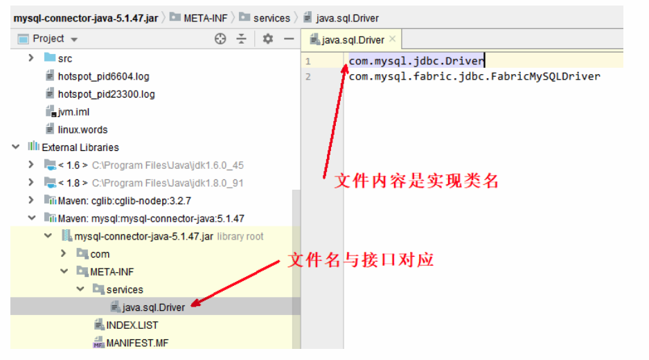

# 1 类加载阶段
## 1.1 加载
将类的字节码载入方法区中，内部采用 C++ 的 instanceKlass 描述 java 类，它的重要 field 有：

+ _java_mirror 即 java 的类镜像，例如对 String 来说，就是 String.class，作用是把 klass 暴露给 java 使用
+ _super 即父类
+ _fields 即成员变量
+ _methods 即方法
+ _constants 即常量池
+ _class_loader 即类加载器
+ _vtable 虚方法表
+ _itable 接口方法表

如果这个类还有父类没有加载，先加载父类  
加载和链接可能是交替运行的  
**注意**：instanceKlass 这样的【元数据】是存储在方法区（1.8 后的元空间内），但 _java_mirror是存储在堆中，可以通过前面介绍的 HSDB 工具查看

  


## 1.2 链接
### 1.2.1验证
验证类是否符合 JVM规范，安全性检查  
用 UE 等支持二进制的编辑器修改 HelloWorld.class 的**魔数**，在控制台运行

```java
E:\git\jvm\out\production\jvm>java cn.itcast.jvm.t5.HelloWorld
Error: A JNI error has occurred, please check your installation and try again
Exception in thread "main" java.lang.ClassFormatError: Incompatible magic value
3405691578 in class file cn/itcast/jvm/t5/HelloWorld
	at java.lang.ClassLoader.defineClass1(Native Method)
	at java.lang.ClassLoader.defineClass(ClassLoader.java:763)
	at java.security.SecureClassLoader.defineClass(SecureClassLoader.java:142)
	at java.net.URLClassLoader.defineClass(URLClassLoader.java:467)
	at java.net.URLClassLoader.access$100(URLClassLoader.java:73)
	at java.net.URLClassLoader$1.run(URLClassLoader.java:368)
    at java.net.URLClassLoader$1.run(URLClassLoader.java:362)
	at java.security.AccessController.doPrivileged(Native Method)
	at java.net.URLClassLoader.findClass(URLClassLoader.java:361)
	at java.lang.ClassLoader.loadClass(ClassLoader.java:424)
	at sun.misc.Launcher$AppClassLoader.loadClass(Launcher.java:331)
	at java.lang.ClassLoader.loadClass(ClassLoader.java:357)
	at sun.launcher.LauncherHelper.checkAndLoadMain(LauncherHelper.java:495)
```

###   
1.2.2 准备
为 static 变量分配空间，设置默认值

+ static 变量在 JDK 7 之前存储于 instanceKlass 末尾，从 JDK 7 开始，存储于 _java_mirror 末尾
+ static 变量分配空间和赋值是两个步骤，分配空间在准备阶段完成，赋值在初始化阶段完成
+ 如果 static 变量是 final 的基本类型，以及字符串常量，那么编译阶段值就确定了，赋值在准备阶段完成
+ 如果 static 变量是 final 的，但属于引用类型，那么赋值也会在初始化阶段完成  


### 1.2.3 解析
将常量池中的符号引用解析为直接引用

```java
package cn.itcast.jvm.t3.load;
/**

● 解析的含义
*/
public class Load2 {
    public static void main(String[] args) throws ClassNotFoundException,
    IOException {
        ClassLoader classloader = Load2.class.getClassLoader();
        // loadClass 方法不会导致类的解析和初始化
        Class<?> c = classloader.loadClass("cn.itcast.jvm.t3.load.C");
        // new C();
        System.in.read();
    }
}
class C {
    D d = new D();
}
class D {
}
```

## 1.3 初始化
`**<clint>()V**`**方法**  
初始化即调用 ()V ，虚拟机会保证这个类的『构造方法』的线程安全

  
**发生的时机**  
概括得说，类初始化是【懒惰的】

+ main 方法所在的类，总会被首先初始化
+ 首次访问这个类的静态变量或静态方法时
+ 子类初始化，如果父类还没初始化，会引发
+ 子类访问父类的静态变量，只会触发父类的初始化
+ Class.forName
+ new 会导致初始化

不会导致类初始化的情况

+ 访问类的 static final 静态常量（基本类型和字符串）不会触发初始化
+ 类对象.class 不会触发初始化
+ 创建该类的数组不会触发初始化
+ 类加载器的 loadClass 方法
+ Class.forName 的参数 2 为 false 时

实验

```java
class A {
    static int a = 0;
    static {
        System.out.println("a init");
    }
}
class B extends A {
    final static double b = 5.0;
    static boolean c = false;
    static {
        System.out.println("b init");
    }
}
```

验证（实验时请先全部注释，每次只执行其中一个）

```java
public class Load3 {
    static {
        System.out.println("main init");
    }
    public static void main(String[] args) throws ClassNotFoundException {
        // 1. 静态常量（基本类型和字符串）不会触发初始化
        System.out.println(B.b);
        // 2. 类对象.class 不会触发初始化
        System.out.println(B.class);
        // 3. 创建该类的数组不会触发初始化
        System.out.println(new B[0]);
        // 4. 不会初始化类 B，但会加载 B、A
        ClassLoader cl = Thread.currentThread().getContextClassLoader();
        cl.loadClass("cn.itcast.jvm.t3.B");
        // 5. 不会初始化类 B，但会加载 B、A
        ClassLoader c2 = Thread.currentThread().getContextClassLoader();
        Class.forName("cn.itcast.jvm.t3.B", false, c2);

        
        // 1. 首次访问这个类的静态变量或静态方法时
        System.out.println(A.a);
        // 2. 子类初始化，如果父类还没初始化，会引发
        System.out.println(B.c);
        // 3. 子类访问父类静态变量，只触发父类初始化
        System.out.println(B.a);
        // 4. 会初始化类 B，并先初始化类 A
        Class.forName("cn.itcast.jvm.t3.B");
    }
}
```

## 1.4 练习
从字节码分析，使用 a，b，c 这三个常量是否会导致 E 初始化

```java
public class Load4 {
    public static void main(String[] args) {
        System.out.println(E.a);//不会
        System.out.println(E.b);//不会
        System.out.println(E.c);//会
    }
}
class E {
    public static final int a = 10;
    public static final String b = "hello";
    public static final Integer c = 20;

    static {
        System.out.println("E init");
    }
}
```

典型应用 - 完成懒惰初始化单例模式

```java
public final class Singleton {
    private Singleton() { }
    // 内部类中保存单例
    private static class LazyHolder {
        static final Singleton INSTANCE = new Singleton();
    }
    // 第一次调用 getInstance 方法，才会导致内部类加载和初始化其静态成员
    public static Singleton getInstance() {
        return LazyHolder.INSTANCE;
    }
}
```

以上的实现特点是：

+ 懒惰实例化
+ 初始化时的线程安全是有保障的

# 2 类加载器
以 JDK 8 为例：

| 名称 | 加载哪的类 |   说明 |
| --- | --- | --- |
| Bootstrap ClassLoader |  JAVA_HOME/jre/lib |  无法直接访问 |
| Extension ClassLoader  | JAVA_HOME/jre/lib/ext | 上级为 Bootstrap，显示为 null |
| Application ClassLoader | classpath | 上级为 Extension |
| 自定义类加载器 |  自定义 | 上级为 Application |


## 2.1 启动类加载器
用 Bootstrap 类加载器加载类：

```java
package cn.itcast.jvm.t3.load;
public class F {
    static {
        System.out.println("bootstrap F init");
    }
}
```

执行

```java
package cn.itcast.jvm.t3.load;
public class Load5_1 {
    public static void main(String[] args) throws ClassNotFoundException {
        Class<?> aClass = Class.forName("cn.itcast.jvm.t3.load.F");
        System.out.println(aClass.getClassLoader());
    }
}
```

在控制台执行`java -Xbootclasspath/a:. cn.itcast.jvm.t3.load.Load5`

输出

```java
E:\git\jvm\out\production\jvm>java -Xbootclasspath/a:. cn.itcast.jvm.t3.load.Load5
bootstrap F init
null
```

+ -Xbootclasspath 表示设置 bootclasspath
+ 其中 /a:. 表示将当前目录追加至 bootclasspath 之后
+ 可以用这个办法替换核心类
    - java -Xbootclasspath:
    - java -Xbootclasspath/a:<追加路径>
    - java -Xbootclasspath/p:<追加路径>

## 2.2 扩展类加载器
```java
package cn.itcast.jvm.t3.load;
public class G {
    static {
        System.out.println("classpath G init");
    }
}
```

执行

```java
public class Load5_2 {
    public static void main(String[] args) throws ClassNotFoundException {
        Class<?> aClass = Class.forName("cn.itcast.jvm.t3.load.G");
        System.out.println(aClass.getClassLoader());
    }
}
```

输出

```java
classpath G init
sun.misc.Launcher$AppClassLoader@18b4aac2
```

写一个同名的类

```java
package cn.itcast.jvm.t3.load;
public class G {
    static {
        System.out.println("ext G init");
    }
}
```

打个 jar 包，执行命令`jar -cvf my.jar cn/itcast/jvm/t3/load/G.class`

```java
E:\git\jvm\out\production\jvm>jar -cvf my.jar cn/itcast/jvm/t3/load/G.class
已添加清单
正在添加: cn/itcast/jvm/t3/load/G.class(输入 = 481) (输出 = 322)(压缩了 33%)
```

将 jar 包拷贝到 JAVA_HOME/jre/lib/ext  
重新执行 Load5_2  
输出

```java
ext G init
sun.misc.Launcher$ExtClassLoader@29453f44
```

## 2.3 双亲委派模式 
所谓的双亲委派，就是指调用类加载器的 loadClass 方法时，查找类的规则 

注意：这里的双亲，翻译为上级似乎更为合适，因为它们并没有继承关系

```java
protected Class<?> loadClass(String name, boolean resolve)
    throws ClassNotFoundException {
    synchronized (getClassLoadingLock(name)) {
        // 1. 检查该类是否已经加载
        Class<?> c = findLoadedClass(name);
        if (c == null) {
            long t0 = System.nanoTime();
            try {
                if (parent != null) {
                    // 2. 有上级的话，委派上级 loadClass
                    c = parent.loadClass(name, false);
                } else {
                    // 3. 如果没有上级了（ExtClassLoader），则委派BootstrapClassLoader
                    c = findBootstrapClassOrNull(name);
                }
            } catch (ClassNotFoundException e) {
            }
            if (c == null) {
                long t1 = System.nanoTime();
                // 4. 每一层找不到，调用 findClass 方法（每个类加载器自己扩展）来加载
                c = findClass(name);
                // 5. 记录耗时
                sun.misc.PerfCounter.getParentDelegationTime().addTime(t1 - t0);
                sun.misc.PerfCounter.getFindClassTime().addElapsedTimeFrom(t1);
                sun.misc.PerfCounter.getFindClasses().increment();
            }
        }
        if (resolve) {
            resolveClass(c);
        }
        return c;
    }
}
```

例如：

```java
public class Load5_3 {
    public static void main(String[] args) throws ClassNotFoundException {
        Class<?> aClass = Load5_3.class.getClassLoader()
            .loadClass("cn.itcast.jvm.t3.load.H");
        System.out.println(aClass.getClassLoader());
    }
}
```

执行流程为：

1. `sun.misc.Launcher$AppClassLoader` //1 处， 开始查看已加载的类，结果没有
2. `sun.misc.Launcher

$$
AppClassLoader`// 2 处，委派上级`sun.misc.Launcher
$$
ExtClassLoader.loadClass()`
3. `sun.misc.Launcher$ExtClassLoader`// 1 处，查看已加载的类，结果没有
4. `sun.misc.Launcher$ExtClassLoader` // 3 处，没有上级了，则委派 BootstrapClassLoader查找
5. `BootstrapClassLoader` 是在 JAVA_HOME/jre/lib 下找 H 这个类，显然没有
6. `sun.misc.Launcher

$$
ExtClassLoader`// 4 处，调用自己的 findClass 方法，是在 `JAVA_HOME/jre/lib/ext `下找 H 这个类，显然没有，回到`sun.misc.Launcher
$$
AppClassLoader`的 // 2 处
7. 继续执行到`sun.misc.Launcher$AppClassLoader` // 4 处，调用它自己的 findClass 方法，在classpath 下查找，找到了

## 5.4 线程上下文类加载器
我们在使用 JDBC 时，都需要加载 Driver 驱动，不知道你注意到没有，不写

```java
Class.forName("com.mysql.jdbc.Driver")
```

也是可以让 `com.mysql.jdbc.Driver` 正确加载的，你知道是怎么做的吗？  
让我们追踪一下源码：

```java
public class DriverManager {
    // 注册驱动的集合
    private final static CopyOnWriteArrayList<DriverInfo> registeredDrivers = new CopyOnWriteArrayList<>();
    
    // 初始化驱动
    static {
        loadInitialDrivers();
        println("JDBC DriverManager initialized");
    }
```

先不看别的，看看 DriverManager 的类加载器：

```java
System.out.println(DriverManager.class.getClassLoader());
```

打印 null，表示它的类加载器是 Bootstrap ClassLoader，会到 JAVA_HOME/jre/lib 下搜索类，但JAVA_HOME/jre/lib 下显然没有`mysql-connector-java-5.1.47.jar`包，这样问题来了，在DriverManager 的静态代码块中，怎么能正确加载com.mysql.jdbc.Driver 呢？  
继续看 loadInitialDrivers() 方法：

```java
private static void loadInitialDrivers() {
    String drivers;
    try {
        drivers = AccessController.doPrivileged(new PrivilegedAction() {
                public String run() {
                    return System.getProperty("jdbc.drivers");
                }
        });
    } catch (Exception ex) {
        drivers = null;
    }
    // 1）使用 ServiceLoader 机制加载驱动，即 SPI
    AccessController.doPrivileged(new PrivilegedAction() {
        public Void run() {
            ServiceLoader loadedDrivers = ServiceLoader.load(Driver.class);
            Iterator driversIterator = loadedDrivers.iterator();
            try{
                while(driversIterator.hasNext()) {
                    driversIterator.next();
                }
            } catch(Throwable t) {
                // Do nothing
            }
            return null;
        }
    });
    println("DriverManager.initialize: jdbc.drivers = " + drivers);
    
    // 2）使用 jdbc.drivers 定义的驱动名加载驱动
    if (drivers == null || drivers.equals("")) {
        return;
    }
    String[] driversList = drivers.split(":");
    println("number of Drivers:" + driversList.length);
    for (String aDriver : driversList) {
        try {
            println("DriverManager.Initialize: loading " + aDriver);
            // 这里的 ClassLoader.getSystemClassLoader() 就是应用程序类加载器
            Class.forName(aDriver, true, ClassLoader.getSystemClassLoader());
        } catch (Exception ex) {
            println("DriverManager.Initialize: load failed: " + ex);
        }
    }
}
```

  
先看 2）发现它最后是使用 Class.forName 完成类的加载和初始化，关联的是应用程序类加载器，因此可以顺利完成类加载  
再看 1）它就是大名鼎鼎的 Service Provider Interface （SPI）

约定如下，在 jar 包的 META-INF/services 包下，以接口全限定名名为文件，文件内容是实现类名称  
  
这样就可以使用

```java
ServiceLoader<接口类型> allImpls = ServiceLoader.load(接口类型.class);
Iterator<接口类型> iter = allImpls.iterator();
while(iter.hasNext()) {
	iter.next();
}
```

来得到实现类，体现的是【面向接口编程+解耦】的思想，在下面一些框架中都运用了此思想：

+ JDBC
+ Servlet 初始化器
+ Spring 容器
+ Dubbo（对 SPI 进行了扩展）

接着看 ServiceLoader.load 方法：

```java
public static  ServiceLoader load(Class service) {
    // 获取线程上下文类加载器
    ClassLoader cl = Thread.currentThread().getContextClassLoader();
	return ServiceLoader.load(service, cl);
}
```

线程上下文类加载器是当前线程使用的类加载器，默认就是应用程序类加载器，它内部又是由Class.forName 调用了线程上下文类加载器完成类加载，具体代码在 ServiceLoader 的内部类LazyIterator 中：

```java
private S nextService() {
    if (!hasNextService())
        throw new NoSuchElementException();
    String cn = nextName;
    nextName = null;
    Class<?> c = null;
    try {
        c = Class.forName(cn, false, loader);
    } catch (ClassNotFoundException x) {
        fail(service, "Provider " + cn + " not found");
    }
    if (!service.isAssignableFrom(c)) {
        fail(service, "Provider " + cn + " not a subtype");
    }
    try {
        S p = service.cast(c.newInstance());
        providers.put(cn, p);
        return p;
    } catch (Throwable x) {
        fail(service,
             "Provider " + cn + " could not be instantiated",
             x);
    }
    throw new Error(); // This cannot happen
}
```

## 5.5 自定义类加载器
问问自己，什么时候需要自定义类加载器  
1）想加载非 classpath 随意路径中的类文件  
2）都是通过接口来使用实现，希望解耦时，常用在框架设计  
3）这些类希望予以隔离，不同应用的同名类都可以加载，不冲突，常见于 tomcat 容器

  
步骤：

1. 继承 ClassLoader 父类
2. 要遵从双亲委派机制，重写 findClass 方法  
注意不是重写 loadClass 方法，否则不会走双亲委派机制
3. 读取类文件的字节码
4. 调用父类的 defineClass 方法来加载类
5. 使用者调用该类加载器的 loadClass 方法

示例：

代码如下：

```java
package cn.itcast.jvm.t3.load;

import java.io.ByteArrayOutputStream;
import java.io.IOException;
import java.nio.file.Files;
import java.nio.file.Paths;

public class Load7 {
    public static void main(String[] args) throws Exception {
        MyClassLoader classLoader = new MyClassLoader();
        Class<?> c1 = classLoader.loadClass("MapImpl1");
        Class<?> c2 = classLoader.loadClass("MapImpl1");
        System.out.println(c1 == c2);

        MyClassLoader classLoader2 = new MyClassLoader();
        Class<?> c3 = classLoader2.loadClass("MapImpl1");
        System.out.println(c1 == c3);

        c1.newInstance();
        //第一个是true，第二个 是false，判断两个对象是否相等，不仅要判断hashcode eaquls，还要判断是否由同一个类加载器加载的
    }
}

class MyClassLoader extends ClassLoader {

    @Override // name 就是类名称
    protected Class<?> findClass(String name) throws ClassNotFoundException {
        String path = "e:\\myclasspath\\" + name + ".class";

        try {
            ByteArrayOutputStream os = new ByteArrayOutputStream();
            Files.copy(Paths.get(path), os);

            // 得到字节数组
            byte[] bytes = os.toByteArray();

            // byte[] -> *.class
            return defineClass(name, bytes, 0, bytes.length);

        } catch (IOException e) {
            e.printStackTrace();
            throw new ClassNotFoundException("类文件未找到", e);
        }
    }
}

```

