# 1 如何判断对象可以回收
通常由两种方法可以判断对象是否为垃圾对象：

+ 引用计数法
+ 可达性分析算法


## 1.1 引用计数法：
`**定义**`：给对象中添加一个引用计数器，每当有一个地方引用它时，计数器就加1，当引用失效时，计数器值就减1，任何时刻计数器为0的对象就是不可能再被使用的  
`**优点**`：实现简单，效率很高。  
`**弊端**`：循环引用时，两个对象的计数都为1，导致两个对象都无法被释放  
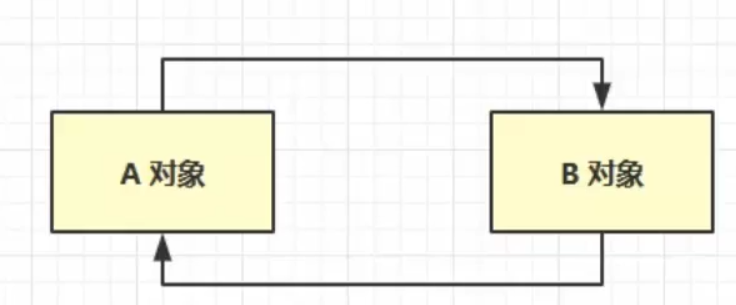

## 1.2 可达性分析算法
+ JVM中的垃圾回收器通过可达性分析来探索所有存活的对象
+ 扫描堆中的对象，看能否沿着GC Root对象为起点的引用链找到该对象，如果找不到，则表示可以回收
+ 可以作为GC Root的对象

> 虚拟机栈（栈帧中的本地变量表）中引用的对象。　  
方法区中类静态属性引用的对象  
方法区中常量引用的对象  
本地方法栈中JNI（即一般说的Native方法）引用的对象
>

 

## 1.3 五种引用


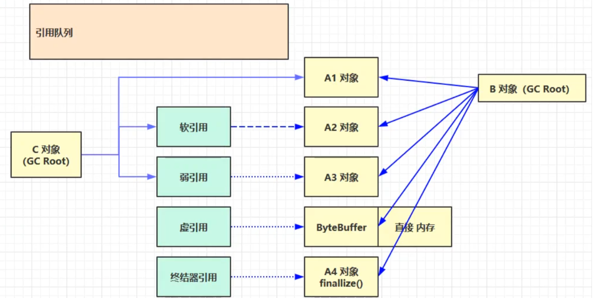


**强引用**

> 只有GC Root都不引用该对象时，才会回收强引用对象  
如上图B、C对象都不引用A1对象时，A1对象才会被回收
>


**软引用**

> 当GC Root指向软引用对象时，在内存不足时，会回收软引用所引用的对象  
如上图如果B对象不再引用A2对象且内存不足时，软引用所引用的A2对象就会被回收
>

软引用的使用

```java
public class Demo1 {
    public static void main(String[] args) {
        final int _4M = 4*1024*1024;
        //使用软引用对象 list和SoftReference是强引用，而SoftReference和byte数组则是软引用
        List<SoftReference<byte[]>> list = new ArrayList<>();
        SoftReference<byte[]> ref= new SoftReference<>(new byte[_4M]);
    }
}
```

如果在垃圾回收时发现内存不足，在回收软引用所指向的对象时，**软引用本身不会被清理**  
如果想要清理软引用，**需要使用引用队列**

```java
public class Demo1 {
    public static void main(String[] args) {
        final int _4M = 4*1024*1024;
        //使用引用队列，用于移除引用为空的软引用对象
        ReferenceQueue<byte[]> queue = new ReferenceQueue<>();
        //使用软引用对象 list和SoftReference是强引用，而SoftReference和byte数组则是软引用
        List<SoftReference<byte[]>> list = new ArrayList<>();
        SoftReference<byte[]> ref= new SoftReference<>(new byte[_4M]);

        //遍历引用队列，如果有元素，则移除
        Reference<? extends byte[]> poll = queue.poll();
        while(poll != null) {
            //引用队列不为空，则从集合中移除该元素
            list.remove(poll);
            //移动到引用队列中的下一个元素
            poll = queue.poll();
        }
    }
}
```

大概思路为：查看引用队列中有无软引用，如果有，则将该软引用从存放它的集合中移除（这里为一个list集合）


**弱引用**

> 只有弱引用引用该对象时，在垃圾回收时，无论内存是否充足，都会回收弱引用所引用的对象  
如上图如果B对象不再引用A3对象，则A3对象会被回收  
弱引用的使用和软引用类似，只是将 SoftReference 换为了 WeakReference
>

弱引用代码演示：

```java
package cn.itcast.jvm.t2;

import java.lang.ref.Reference;
import java.lang.ref.ReferenceQueue;
import java.lang.ref.SoftReference;
import java.lang.ref.WeakReference;
import java.util.ArrayList;
import java.util.List;

/**
* 演示弱引用
* -Xmx20m -XX:+PrintGCDetails -verbose:gc
*/
public class Demo2_5 {
    private static final int _4MB = 4 * 1024 * 1024;

    public static void main(String[] args) {
        //  list --> WeakReference --> byte[]
        List<WeakReference<byte[]>> list = new ArrayList<>();
        for (int i = 0; i < 10; i++) {
            WeakReference<byte[]> ref = new WeakReference<>(new byte[_4MB]);
            list.add(ref);
            for (WeakReference<byte[]> w : list) {
                System.out.print(w.get()+" ");
            }
            System.out.println();

        }
        System.out.println("循环结束：" + list.size());
    }
}
```


**终结器引用**  
所有的类都继承自Object类，Object类有一个finalize方法。当某个对象不再被其他的对象所引用时，会先将终结器引用对象放入引用队列中，然后根据终结器引用对象找到它所引用的对象，然后调用该对象的finalize方法。调用以后，该对象就可以被垃圾回收了  
如上图，B对象不再引用A4对象。这是终结器对象就会被放入引用队列中，引用队列会根据它，找到它所引用的对象。然后调用被引用对象的finalize方法。调用以后，该对象就可以被垃圾回收了


**引用队列**

> 软引用和弱引用可以配合引用队列  
在弱引用和虚引用所引用的对象被回收以后，会将这些引用放入引用队列中，方便一起回收这些软/弱引用对象  
虚引用和终结器引用必须配合引用队列  
虚引用和终结器引用在使用时会关联一个引用队列
>


# 2 垃圾回收算法
## 2.1 标记-清除算法


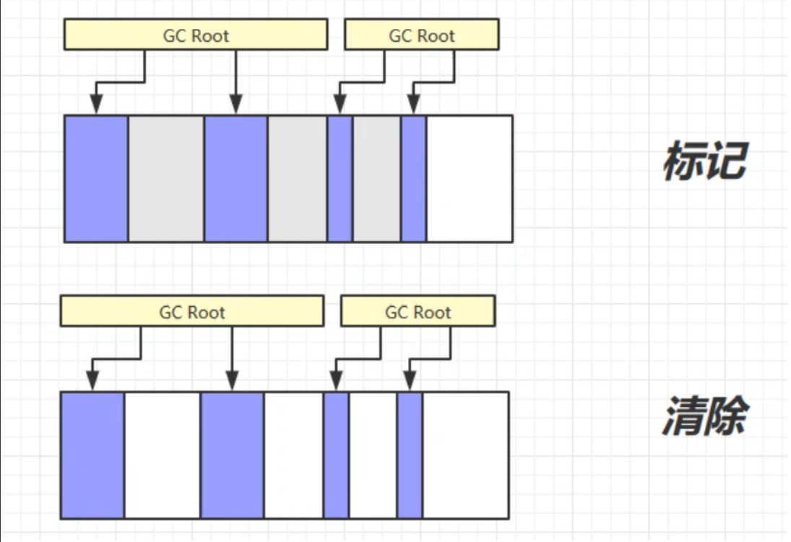  
**定义**：标记清除算法顾名思义，是指在虚拟机执行垃圾回收的过程中，先采用标记算法确定可回收对象，然后垃圾收集器根据标识清除相应的内容，给堆内存腾出相应的空间

这里的腾出内存空间并不是将内存空间的字节清0，而是记录下这段内存的起始结束地址，下次分配内存的时候，会直接覆盖这段内存  
**缺点**：容易产生大量的内存碎片，可能无法满足大对象的内存分配，一旦导致无法分配对象，那就会导致jvm启动gc，一旦启动gc，我们的应用程序就会暂停，这就导致应用的响应速度变慢


## 2.2 标记-整理算法


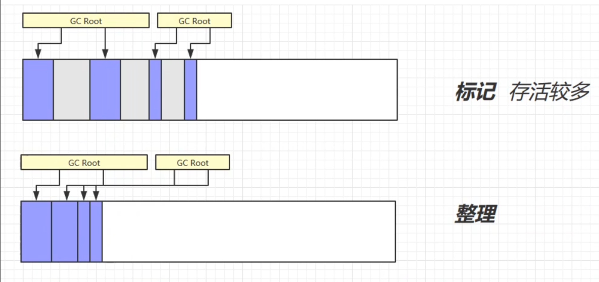  
**标记-整理** 会将不被GC Root引用的对象回收，清楚其占用的内存空间。然后整理剩余的对象，可以有效避免因内存碎片而导致的问题，但是因为整体需要消耗一定的时间，所以效率较低


## 2.3 复制算法


  
  
  
  
将内存分为等大小的两个区域，FROM和TO（TO中为空）。先将被GC Root引用的对象从FROM放入TO中，再回收不被GC Root引用的对象。然后交换FROM和TO。这样也可以避免内存碎片的问题，但是会占用双倍的内存空间。


# 3 分代回收


  
**回收流程**  
新创建的对象都被放在了新生代的伊甸园中  
  
当伊甸园中的内存不足时，就会进行一次垃圾回收，这时的回收叫做 Minor GC  
Minor GC 会将伊甸园和幸存区FROM存活的对象先复制到 幸存区 TO中， 并让其寿命加1，再交换两个幸存区  
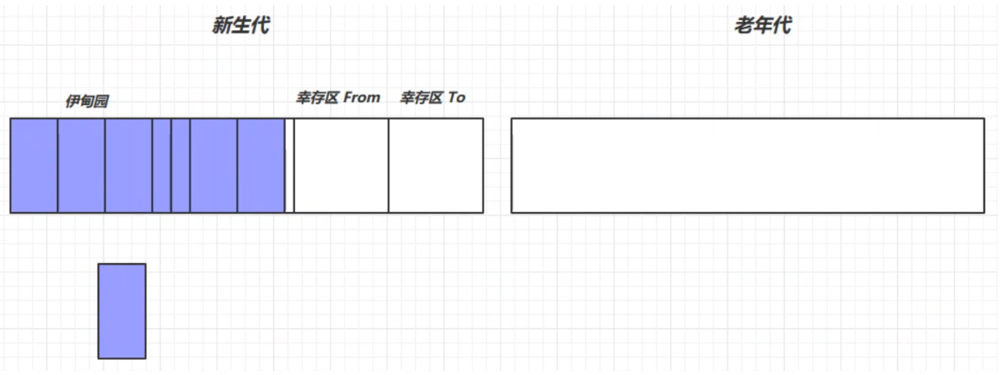  
  
  
再次创建对象，若新生代的伊甸园又满了，则会再次触发 Minor GC（会触发 stop the world， 暂停其他用户线程，只让垃圾回收线程工作），这时不仅会回收伊甸园中的垃圾，还会回收幸存区中的垃圾，再将活跃对象复制到幸存区TO中。回收以后会交换两个幸存区，并让幸存区中的对象寿命加1  
  
如果幸存区中的对象的寿命超过某个阈值（最大为15，4bit），就会被放入老年代中  
  
如果新生代老年代中的内存都满了，就会先触发Minor GC，再触发Full GC，扫描新生代和老年代中所有不再使用的对象并回收，如果回收结束后，还是放不下，则会抛出堆内存溢出异常。


**GC 分析**

+  大对象处理策略  
当遇到一个较大的对象时，就算新生代的伊甸园为空，也无法容纳该对象时，会将该对象直接晋升为老年代 
+  线程内存溢出  
某个线程的内存溢出了而抛异常（out of memory），不会让其他的线程结束运行  
这是因为当一个线程抛出OOM异常后，它所占据的内存资源会全部被释放掉，从而不会影响其他线程的运行，进程依然正常 


# 4 垃圾回收器
## 4.1 相关概念
`**并行收集**`：指多条垃圾收集线程并行工作，但此时**用户线程仍处于等待状态**。

`**并发收集**`：指用户线程与垃圾收集线程**同时工作**（不一定是并行的可能会交替执行）。**用户程序在继续运行**，而垃圾收集程序运行在另一个CPU上

`**吞吐量**`：即CPU用于**运行用户代码的时间**与CPU**总消耗时间**的比值（吞吐量 = 运行用户代码时间 / ( 运行用户代码时间 + 垃圾收集时间 )），也就是。例如：虚拟机共运行100分钟，垃圾收集器花掉1分钟，那么吞吐量就是99%


## 4.2 串行
+ 单线程
+ 内存较小，个人电脑（CPU核数较少）

`<font style="color:rgb(51,51,51);">-XX:+UseSerialGC = Serial + SerialOld</font>`


**安全点**：让其他线程都在这个点停下来，以免垃圾回收时移动对象地址，使得其他线程找不到被移动的对象

因为是串行的，所以只有一个垃圾回收线程。且在该线程执行回收工作时，其他线程进入**阻塞**状态


`**<font style="color:#E8323C;">Serial 收集器</font>**`

Serial收集器是最基本的、发展历史最悠久的收集器

**特点：**单线程、简单高效（与其他收集器的单线程相比），采用**复制算法**。对于限定单个CPU的环境来说，Serial收集器由于没有线程交互的开销，专心做垃圾收集自然可以获得最高的单线程手机效率。收集器进行垃圾回收时，必须暂停其他所有的工作线程，直到它结束（Stop The World）


`**<font style="color:#E8323C;">ParNew 收集器</font>**`

ParNew收集器其实就是Serial收集器的多线程版本

**特点**：多线程、ParNew收集器默认开启的收集线程数与CPU的数量相同，在CPU非常多的环境中，可以使用-XX:ParallelGCThreads参数来限制垃圾收集的线程数。和Serial收集器一样存在Stop The World问题


`**<font style="color:#E8323C;">Serial Old 收集器</font>**`

Serial Old是Serial收集器的老年代版本

**特点**：同样是单线程收集器，采用**标记-整理算法**


## 4.3 吞吐量优先
+ 多线程
+ 堆内存较大，多核CPU
+ 单位时间内，STW（stop the world，停掉其他所有工作线程）时间最短
+ **JDK1.8默认使用**的垃圾回收器

`<font style="color:rgb(51,51,51);">-XX:+UseParallelGC ~ -XX:+UseParallelOldGC </font>`

`<font style="color:rgb(51,51,51);">-XX:+UseAdaptiveSizePolicy </font>`

`<font style="color:rgb(51,51,51);">-XX:GCTimeRatio=ratio </font>`

`<font style="color:rgb(51,51,51);">-XX:MaxGCPauseMillis=ms </font>`

`<font style="color:rgb(51,51,51);">-XX:ParallelGCThreads=n</font>`


`**<font style="color:#E8323C;">Parallel Scavenge 收集器</font>**`

与吞吐量关系密切，故也称为吞吐量优先收集器

**特点**：属于新生代收集器也是采用**复制算法**的收集器（用到了新生代的幸存区），又是并行的多线程收集器（与ParNew收集器类似）

该收集器的目标是达到一个可控制的吞吐量。还有一个值得关注的点是：**GC自适应调节策略**（与ParNew收集器最重要的一个区别）

**GC自适应调节策略**：Parallel Scavenge收集器可设置`-XX:+UseAdptiveSizePolicy`参数。当开关打开时**不需要**手动指定新生代的大小（-Xmn）、Eden与Survivor区的比例（-XX:SurvivorRation）、晋升老年代的对象年龄（-XX:PretenureSizeThreshold）等，虚拟机会根据系统的运行状况收集性能监控信息，动态设置这些参数以提供最优的停顿时间和最高的吞吐量，这种调节方式称为GC的自适应调节策略。


Parallel Scavenge收集器使用两个参数控制吞吐量：

+ XX:MaxGCPauseMillis 控制最大的垃圾收集停顿时间
+ XX:GCRatio 直接设置吞吐量的大小


`**<font style="color:#E8323C;">Parallel Old 收集器</font>**`

是Parallel Scavenge收集器的老年代版本

**特点**：多线程，采用**标记-整理算法**（老年代没有幸存区）


## 4.4 响应时间优先
+ 多线程
+ 堆内存较大，多核CPU
+ 尽可能让单次STW时间变短（尽量不影响其他线程运行）


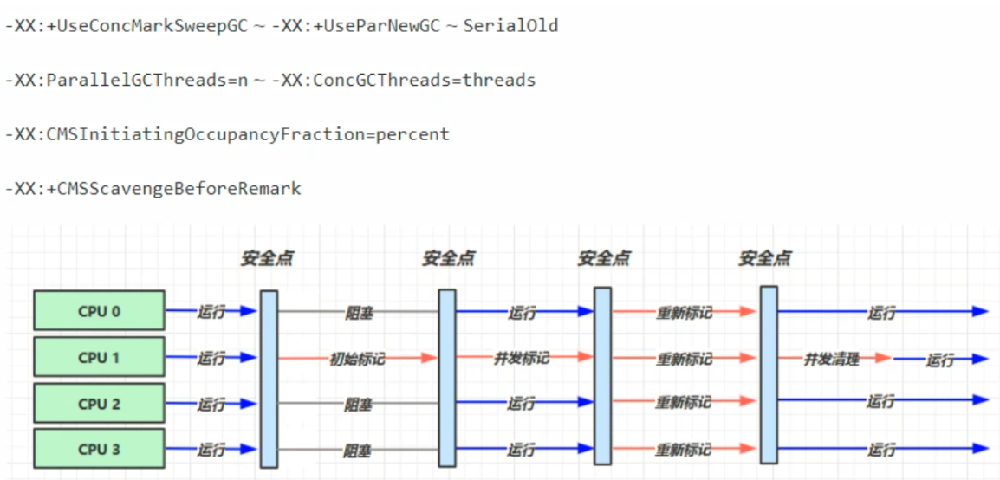


`**<font style="color:#E8323C;">CMS 收集器</font>**`

Concurrent Mark Sweep，一种以获取**最短回收停顿时间**为目标的**老年代**收集器

**特点**：基于**标记-清除算法**实现。并发收集、低停顿，但是会产生内存碎片

**应用场景**：适用于注重服务的响应速度，希望系统停顿时间最短，给用户带来更好的体验等场景下。如web程序、b/s服务

**CMS收集器的运行过程分为下列4步：**

1. **初始标记**：标记GC Roots能直接到的对象。速度很快但是**仍存在Stop The World问题**
2. **并发标记**：进行GC Roots Tracing 的过程，找出存活对象且用户线程可并发执行
3. **重新标记**：为了**修正并发标记期间**因用户程序继续运行而导致标记产生变动的那一部分对象的标记记录。仍然存在Stop The World问题
4. **并发清除**：对标记的对象进行清除回收

CMS收集器的内存回收过程是与用户线程一起**并发执行**的


## 4.5 G1收集器
**定义**：

Garbage First

JDK 9以后默认使用，而且替代了CMS 收集器

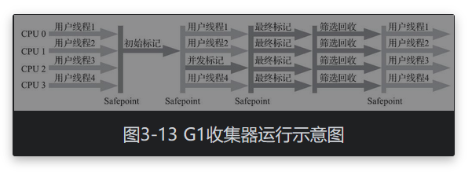

**适用场景**

+ 同时注重吞吐量和低延迟（响应时间）
+ 超大堆内存（内存大的），会将堆内存划分为多个**大小相等**的区域
+ 整体上是**标记-整理**算法，两个区域之间是**复制**算法


**相关参数**：JDK8 并不是默认开启的，所需要参数开启  
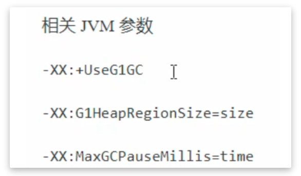


**G1垃圾回收阶段**

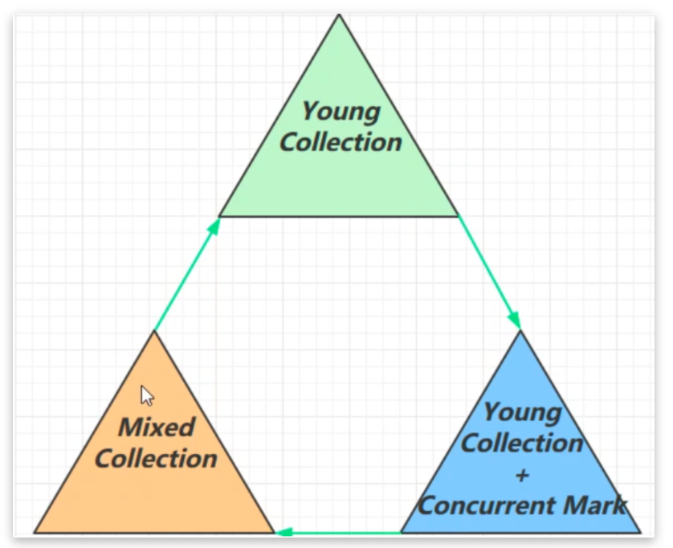


新生代伊甸园垃圾回收—–>内存不足，新生代回收+并发标记—–>回收新生代伊甸园、幸存区、老年代内存——>新生代伊甸园垃圾回收(重新开始)

Young Collection  
分区算法region

分代是按对象的生命周期划分，分区则是将堆空间划分连续几个不同小区间，每一个小区间独立回收，可以控制一次回收多少个小区间，方便控制 GC 产生的停顿时间

+ E：伊甸园
+ S：幸存区
+ O：老年代


会STW  
  
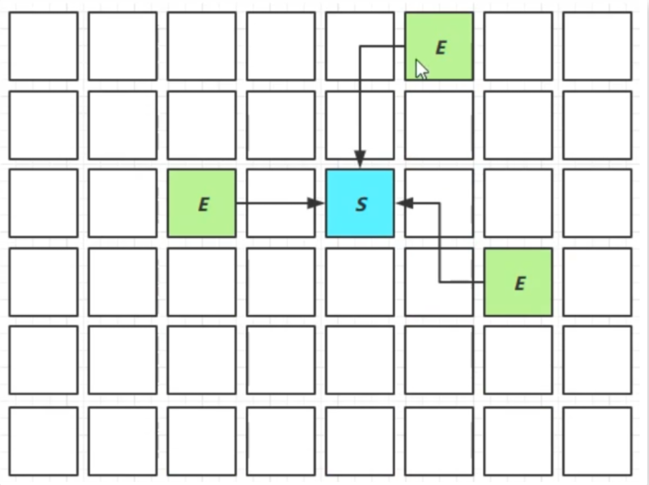  
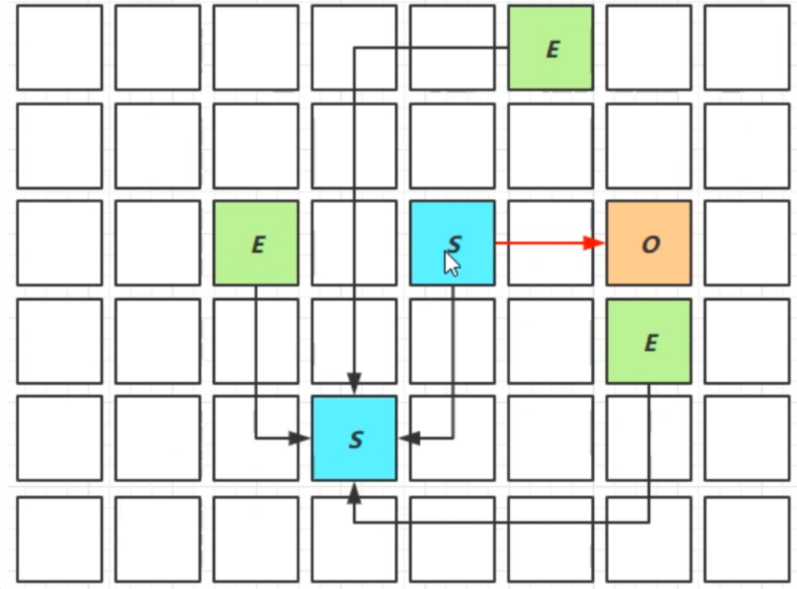


Young Collection + CM  
CM：并发标记

+ 在 Young GC 时会对 GC Root 进行初始标记
+ 在老年代占用堆内存的比例达到阈值时，对进行并发标记（不会STW），阈值可以根据用户来进行设定  
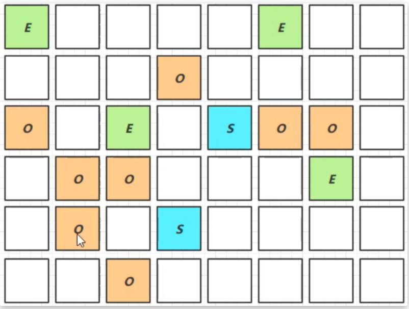


Mixed Collection  
会对E S O 进行全面的回收


最终标记  
拷贝存活  
`-XX:MaxGCPauseMills:xxx` 用于指定最长的停顿时间


问：为什么有的老年代被拷贝了，有的没拷贝？  
因为指定了最大停顿时间，如果对所有老年代都进行回收，耗时可能过高。为了保证时间不超过设定的停顿时间，会回收最有价值的老年代（回收后，能够得到更多内存）

  
Full GC  
G1在老年代内存不足时（老年代所占内存超过阈值）

+ 如果垃圾产生速度慢于垃圾回收速度，不会触发Full GC，还是并发地进行清理
+ 如果垃圾产生速度快于垃圾回收速度，便会触发Full GC


Young Collection 跨代引用

+ 新生代回收的跨代引用（老年代引用新生代）问题


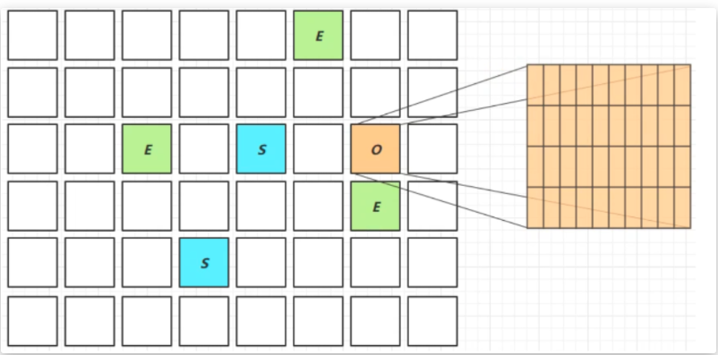  
- 卡表与Remembered Set


+ Remembered Set 存在于E中，用于保存新生代对象对应的脏卡 
    - 脏卡：O被划分为多个区域（一个区域512K），如果该区域引用了新生代对象，则该区域被称为脏卡
+ 在引用变更时通过post-write barried + dirty card queue
+ concurrent refinement threads 更新 Remembered Set


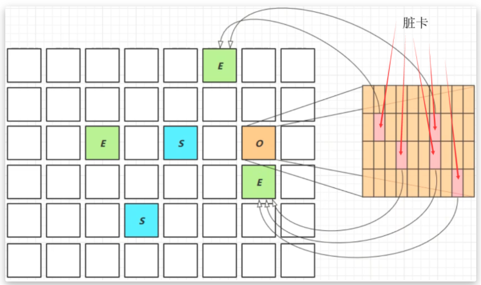


Remark  
重新标记阶段  
在垃圾回收时，收集器处理对象的过程中  
黑色：已被处理，需要保留的 灰色：正在处理中的 白色：还未处理的


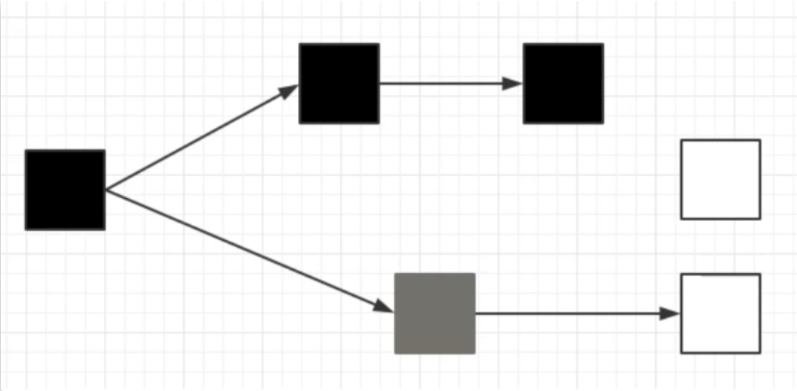  
但是在并发标记过程中，有可能A被处理了以后未引用C，但该处理过程还未结束，在处理过程结束之前A引用了C，这时就会用到remark


过程如下

+ 之前C未被引用，这时A引用了C，就会给C加一个写屏障，写屏障的指令会被执行，将C放入一个队列当中，并将C变为 处理中 状态
+ 在并发标记阶段结束以后，重新标记阶段会STW，然后将放在该队列中的对象重新处理，发现有强引用引用它，就会处理它


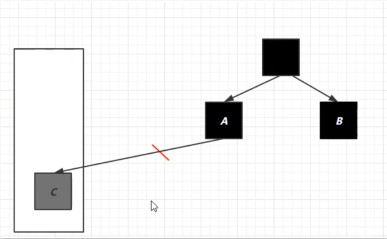


`JDK 8u20 字符串去重`


过程  
将所有新分配的字符串（底层是char[]）放入一个队列,当新生代回收时，G1并发检查是否有重复的字符串,如果字符串的值一样，就让他们引用同一个字符串对象  
注意，其与String.intern的区别intern关注的是字符串对象，字符串去重关注的是char[]，在JVM内部，使用了不同的字符串标


优点与缺点


+ 节省了大量内存
+ 新生代回收时间略微增加，导致略微多占用CPU


`JDK 8u40 并发标记类卸载`  
在并发标记阶段结束以后，就能知道哪些类不再被使用。如果一个类加载器的所有类都不在使用，则卸载它所加载的所有类


`JDK 8u60 回收巨型对象`  
一个对象大于region的一半时，就称为巨型对象，G1不会对巨型对象进行拷贝，回收时被优先考虑  
G1会跟踪老年代所有incoming引用，如果老年代incoming引用为0的巨型对象就可以在新生代垃圾回收时处理掉  
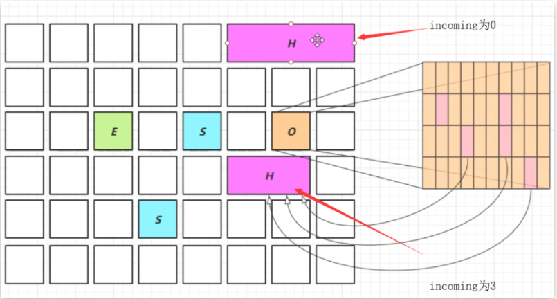


# 5 GC调优
查看虚拟机参数命令

```properties
java -XX:+PrintFlagsFinal -version | findstr "GC"
```

其中findstr是window下的过滤指令，mac和linux可以用grep

输出：

```properties
		uintx AdaptiveSizeMajorGCDecayTimeScale        = 10                                        {product} {default}
     uint ConcGCThreads                            = 2                                         {product} {ergonomic}
     bool DisableExplicitGC                        = false                                     {product} {default}
     bool ExplicitGCInvokesConcurrent              = false                                     {product} {default}
    uintx G1MixedGCCountTarget                     = 8                                         {product} {default}
    uintx G1PeriodicGCInterval                     = 0                                      {manageable} {default}
     bool G1PeriodicGCInvokesConcurrent            = true                                      {product} {default}
   double G1PeriodicGCSystemLoadThreshold          = 0.000000                               {manageable} {default}
    uintx GCDrainStackTargetSize                   = 64                                        {product} {ergonomic}
    uintx GCHeapFreeLimit                          = 2                                         {product} {default}
    uintx GCLockerEdenExpansionPercent             = 5                                         {product} {default}
    uintx GCPauseIntervalMillis                    = 201                                       {product} {default}
    uintx GCTimeLimit                              = 98                                        {product} {default}
    uintx GCTimeRatio                              = 12                                        {product} {default}
     bool HeapDumpAfterFullGC                      = false                                  {manageable} {default}
     bool HeapDumpBeforeFullGC                     = false                                  {manageable} {default}
   size_t HeapSizePerGCThread                      = 43620760                                  {product} {default}
    uintx MaxGCMinorPauseMillis                    = 18446744073709551615                      {product} {default}
    uintx MaxGCPauseMillis                         = 200                                       {product} {default}
      int ParGCArrayScanChunk                      = 50                                        {product} {default}
    uintx ParallelGCBufferWastePct                 = 10                                        {product} {default}
     uint ParallelGCThreads                        = 8                                         {product} {default}
     bool PrintGC                                  = false                                     {product} {default}
     bool PrintGCDetails                           = false                                     {product} {default}
     bool ScavengeBeforeFullGC                     = false                                     {product} {default}
    ccstr ShenandoahGCHeuristics                   = adaptive                                  {product} {default}
    ccstr ShenandoahGCMode                         = satb                                      {product} {default}
     bool UseAdaptiveSizeDecayMajorGCCost          = true                                      {product} {default}
     bool UseAdaptiveSizePolicyWithSystemGC        = false                                     {product} {default}
     bool UseDynamicNumberOfGCThreads              = true                                      {product} {default}
     bool UseG1GC                                  = true                                      {product} {ergonomic}
     bool UseGCOverheadLimit                       = true                                      {product} {default}
     bool UseMaximumCompactionOnSystemGC           = true                                      {product} {default}
     bool UseParallelGC                            = false                                     {product} {default}
     bool UseSerialGC                              = false                                     {product} {default}
     bool UseShenandoahGC                          = false                                     {product} {default}
     bool UseZGC                                   = false                                     {product} {default}

```

可以根据参数去查询具体的信息


**调优领域**：

+ 内存
+ 锁竞争
+ CPU占用
+ IO
+ GC


**确定目标**  
低延迟/高吞吐量？ 选择合适的垃圾回收器

+ CMS G1 ZGC 都是低延迟的
+ ParallelGC 是高吞吐量的
+ Zing 是个虚拟机的名字，不是oracle的，了解就行


最快的GC是不发生GC，这句话怎么理解？如果程序经常性的发生GC，应该从以下方面考虑：  
首先排除减少因为自身编写的代码而引发的内存问题

+ 查看Full GC前后的内存占用，考虑以下几个问题 
    - 数据是不是太多？
        * 比如: `resultSet = statement.executeQuery(select * from 大表)`
    - 数据表示是否太臃肿 
        * 对象图
        * 对象大小
    - 是否存在内存泄漏


**新生代调优**

+ 新生代的特点 
    - 所有的new操作分配内存都是非常廉价的 
        * TLAB
    - 死亡对象回收零代价
    - 大部分对象用过即死（朝生夕死）
    - MInor GC 所用时间远小于Full GC
+ 新生代内存越大越好么？ 
    - 不是 
        * 新生代内存太小：频繁触发Minor GC，会STW，会使得吞吐量下降
        * 新生代内存太大：老年代内存占比有所降低，会更频繁地触发Full GC。而且触发Minor GC时，清理新生代所花费的时间会更长
        * 新生代内存设置为内容纳[并发量*(请求-响应)]的数据为宜


**幸存区调优**

+ 幸存区需要能够保存【当前活跃对象+需要晋升的对象】
+ 晋升阈值配置得当，让长时间存活的对象尽快晋升


**老年代调优**

以CMS为例

+ CMS的老年代内存越大越好
+ 先尝试不做调优，如果没有Full GC那么暂时不用老年代调优，先尝试调优新生代
+ 观察发生Full GC时老年代内存占用，将老年代内存预设调大1/4～1/3


**调优案例：**

案例一：Full GC和Minor GC频繁

```properties
分析：遇到这种问题，GC特别频繁，说明内存空间紧张，究竟是哪一部分空间紧张呢，进一步分析，如果是新生代的空间紧张，那么业务高峰期来临时候，
		 大量对象被创建，很快就把新生代空间塞满了，塞满了会造成一个后果，幸存区空间紧张了，对象的晋升阈值就会降低，导致很多本来生存周期很
		 短的对象也会被晋升到老年代去，导致老年代存储了很多这种生存周期很短的对象，进一步引发老年代的Full GC的频繁发生。
解决：尝试增加新生代内存，新生代内存充裕了，增加了幸存区的空间，那么也相当于增加了晋升的阈值，这样就可以保证生命周期较短的对象尽可能的
		 不进入老年代，老年代也不会频繁引发Full GC。
```

案例二：请求高峰期发生Full GC，单次暂停时间特别长（CMS）

```properties
分析：
解决：
```

案例三：老年代充裕的情况下，发生Full GC（CMS jdk1.7）

```properties

```

