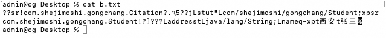

**笔记来源：**[**黑马程序员Java设计模式详解， 23种Java设计模式（图解+框架源码分析+实战）**](https://www.bilibili.com/video/BV1Np4y1z7BU?p=2&vd_source=e8046ccbdc793e09a75eb61fe8e84a30)

## 1 概述
用一个已经创建的实例作为原型，通过复制该原型对象来创建一个和原型对象相同的新对象。

## 2 结构
原型模式包含如下角色：

+ 抽象原型类：规定了具体原型对象必须实现的的 clone() 方法。
+ 具体原型类：实现抽象原型类的 clone() 方法，它是可被复制的对象。
+ 访问类：使用具体原型类中的 clone() 方法来复制新的对象。

接口类图如下：


## 3 实现
原型模式的克隆分为浅克隆和深克隆。

**浅克隆** ：创建一个新对象，**新对象的属性和原来对象完全相同**，对于非基本类型属性，仍指向原有属性所指向的对象的内存地址。

**深克隆** ：创建一个新对象，**属性中引用的其他对象也会被克隆**，不再指向原有对象地址。

Java中的 Object 类中提供了 `clone()` 方法来实现浅克隆。 Cloneable 接口是上面的类图中的抽象原型类，而实现了 Cloneable 接口的子实现类就是具体的原型类。代码如下：

**Realizetype（具体的原型类）：**

```java
public class Realizetype implements Cloneable { // 此处的Cloneable就是原型图中的Prototype

    public Realizetype() {
        System.out.println("具体的原型对象创建完成！");
    }

    @Override
    protected Realizetype clone() throws CloneNotSupportedException {
        System.out.println("具体原型复制成功！");
        return (Realizetype) super.clone();
    }
}
```

**PrototypeTest（测试访问类）：**

```java
public class PrototypeTest {
    public static void main(String[] args) throws CloneNotSupportedException {
        Realizetype r1 = new Realizetype();
        Realizetype r2 = r1.clone();

        System.out.println("对象r1和r2是同一个对象？" + (r1 == r2));
    }
}
```

输出：

```java
具体的原型对象创建完成！
具体原型复制成功！
对象r1和r2是同一个对象？false
```

## 4 案例
**用原型模式生成“三好学生”奖状**

同一学校的“三好学生”奖状除了获奖人姓名不同，其他都相同，可以使用原型模式复制多个“三好学生”奖状出来，然后在修改奖状上的名字即可。

类图如下：


代码如下：

```java
//奖状类
public class Citation implements Cloneable {
    private String name;

    public void setName(String name) {
        this.name = name;
    }

    public String getName() {
        return (this.name);
    }

    public void show() {
        System.out.println(name + "同学：在2020学年第一学期中表现优秀，被评为三好学生。特发此状！");
    }

    @Override
    public Citation clone() throws CloneNotSupportedException {
        return (Citation) super.clone();
    }
}

//测试访问类
public class CitationTest {
    public static void main(String[] args) throws CloneNotSupportedException {
        Citation c1 = new Citation();
        c1.setName("张三");

        //复制奖状
        Citation c2 = c1.clone();
        //将奖状的名字修改李四
        c2.setName("李四");

        c1.show();
        c2.show();
    }
}
```

输出：

```java
张三同学：在2020学年第一学期中表现优秀，被评为三好学生。特发此状！
李四同学：在2020学年第一学期中表现优秀，被评为三好学生。特发此状！
```

## 5 使用场景
+ 对象的创建非常复杂，可以使用原型模式快捷的创建对象。
+ 性能和安全要求比较高。

## 6 扩展（深克隆）
将上面的“三好学生”奖状的案例中Citation类的name属性修改为Student类型的属性。代码如下：

```java
//奖状类
public class Citation implements Cloneable {
    
    private Student stu;

    public Student getStu() {
        return stu;
    }

    public void setStu(Student stu) {
        this.stu = stu;
    }

    void show() {
        System.out.println(stu.getName() + "同学：在2020学年第一学期中表现优秀，被评为三好学生。特发此状！");
    }

    @Override
    public Citation clone() throws CloneNotSupportedException {
        return (Citation) super.clone();
    }
}

//学生类
public class Student {
    private String name;
    private String address;

    public Student(String name, String address) {
        this.name = name;
        this.address = address;
    }

    public Student() {
    }

    public String getName() {
        return name;
    }

    public void setName(String name) {
        this.name = name;
    }

    public String getAddress() {
        return address;
    }

    public void setAddress(String address) {
        this.address = address;
    }
}

//测试类
public class CitationTest {
    public static void main(String[] args) throws CloneNotSupportedException {

        Citation c1 = new Citation();
        Student stu = new Student("张三", "西安");
        c1.setStu(stu);

        //复制奖状
        Citation c2 = c1.clone();
        //获取c2奖状所属学生对象
        Student stu1 = c2.getStu();
        stu1.setName("李四");

        //判断stu对象和stu1对象是否是同一个对象
        System.out.println("stu和stu1是同一个对象？" + (stu == stu1));

        c1.show();
        c2.show();
    }
}
```

运行结果为：

```java
stu和stu1是同一个对象？true
李四同学：在2020学年第一学期中表现优秀，被评为三好学生。特发此状！
李四同学：在2020学年第一学期中表现优秀，被评为三好学生。特发此状！
```

说明：`stu`对象和`stu1`对象是同一个对象，但是 c1 和 c2 不是一个对象，就会产生将 stu1 对象中 name 属性值改为“李四”，两个Citation（奖状）对象中显示的都是李四。这就是浅克隆的效果，对具体原型类（Citation）中的引用类型的属性进行引用的复制。这种情况需要使用深克隆，而进行深克隆需要使用对象流。代码如下：

```java
public class CitationTest1 {
    public static void main(String[] args) throws Exception {
        Citation c1 = new Citation();
        Student stu = new Student("张三", "西安");
        c1.setStu(stu);

        //创建对象输出流对象
        ObjectOutputStream oos = new ObjectOutputStream(new FileOutputStream("/Users/admin/Desktop/b.txt"));
        //将c1对象写出到文件中
        oos.writeObject(c1);
        oos.close();

        //创建对象出入流对象
        ObjectInputStream ois = new ObjectInputStream(new FileInputStream("/Users/admin/Desktop/b.txt"));
        //读取对象
        Citation c2 = (Citation) ois.readObject();
        //获取c2奖状所属学生对象
        Student stu1 = c2.getStu();
        stu1.setName("李四");

        //判断stu对象和stu1对象是否是同一个对象
        System.out.println("stu和stu1是同一个对象？" + (stu == stu1));

        c1.show();
        c2.show();
    }
}
```

运行结果为：

```java
stu和stu1是同一个对象？false
张三同学：在2020学年第一学期中表现优秀，被评为三好学生。特发此状！
李四同学：在2020学年第一学期中表现优秀，被评为三好学生。特发此状！
```

`b.txt`  文件的内容如下：



注意：Citation 类和 Student 类必须实现Serializable接口，否则会抛 NotSerializableException 异常。


