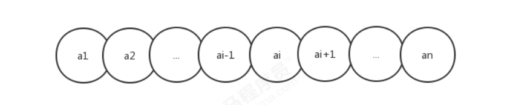
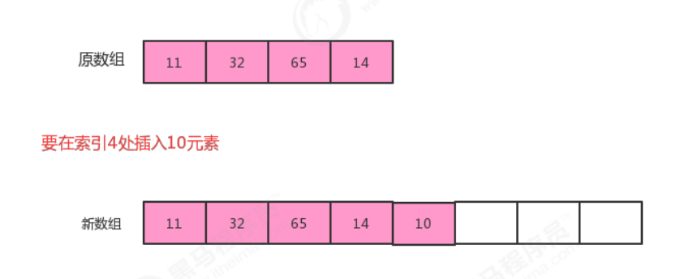
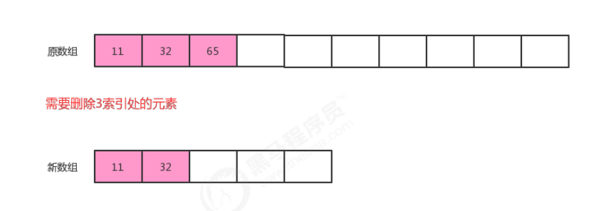

**<font style="color:#DF2A3F;">笔记来源：</font>**[**<font style="color:#DF2A3F;">黑马程序员Java数据结构与java算法全套教程，数据结构+算法教程全资料发布，包含154张java数据结构图</font>**](https://www.bilibili.com/video/BV1iJ411E7xW?p=2&vd_source=e8046ccbdc793e09a75eb61fe8e84a30)

# 1 线性表
线性表是最基本、最简单、也是最常用的一种数据结构。一个线性表是n个具有相同特性的数据元素的有限序列。


**前驱元素**：若A元素在B元素的前面，则称A为B的前驱元素  
**后继元素**：若B元素在A元素的后面，则称B为A的后继元素


**线性表的特征**：数据元素之间具有一种“一对一”的逻辑关系。

+ 第一个数据元素没有前驱，这个数据元素被称为头结点；
+ 最后一个数据元素没有后继，这个数据元素被称为尾结点；
+ 除了第一个和最后一个数据元素外，其他数据元素有且仅有一个前驱和一个后继。


如果把线性表用数学语言来定义，则可以表示为(a1,...ai-1, ai, ai+1,...an)，ai-1领先于ai,ai领先于ai+1，称ai-1是ai的前驱元素，ai+1是ai的后继元素



**线性表的分类：**  
线性表中数据存储的方式可以是顺序存储，也可以是链式存储，按照数据的存储方式不同，可以把线性表分为`<font style="color:#E8323C;">顺序表</font>`和`<font style="color:#E8323C;">链表</font>`。

# 2 顺序表
顺序表是在计算机内存中以数组的形式保存的线性表，线性表的顺序存储是指用一组地址连续的存储单元，依次存储线性表中的各个元素、使得线性表中再逻辑结构上响铃的数据元素存储在相邻的物理存储单元中，即通过数据元素物理存储的相邻关系来反映数据元素之间逻辑上的相邻关系。


## 2.1 顺序表的实现
### 顺序表API设计
| **类名** | **SequenceList** |
| --- | --- |
| 构造方法 | SequenceList(int capacity)：创建容量为capacity的SequenceList对象 |
| 成员方法 | 1.public void clear()：空置线性表    2.publicboolean isEmpty()：判断线性表是否为空，是返回true，否返回false   3.public int length():获取线性表中元素的个数   4.public T get(int i):读取并返回线性表中的第i个元素的值   5.public void insert(int i,T t)：在线性表的第i个元素之前插入一个值为t的数据元素。   6.public void insert(T t):向线性表中添加一个元素t   7.public T remove(int i):删除并返回线性表中第i个数据元素。   8.public int indexOf(T t):返回线性表中首次出现的指定的数据元素的位序号，若不存在，则返回-1。 |
| 成员变量 | 1.private T[ ] eles：存储元素的数组   2.private int N:当前线性表的长度 |


顺序表的代码实现：

```java
//顺序表代码 
public class SequenceList<T> { 
    //存储元素的数组 
    private T[] eles; 
    
    //记录当前顺序表中的元素个数 
    private int N; 
    
    //构造方法 
    public SequenceList(int capacity){ 
        eles = (T[])new Object[capacity]; 
        N=0; 
    }
    
    //将一个线性表置为空表 
    public void clear(){ 
        N=0; 
    }
    
    //判断当前线性表是否为空表 
    public boolean isEmpty(){ 
        return N==0; 
    }
    
    //获取线性表的长度 
    public int length(){ 
        return N; 
    }
    
    //获取指定位置的元素 
    public T get(int i){ 
        if (i<0 || i>=N){ 
            throw new RuntimeException("当前元素不存在！"); 
        }
        return eles[i]; 
    }
    
    //向线型表中添加元素t 
    public void insert(T t){ 
        if (N==eles.length){ 
            throw new RuntimeException("当前表已满"); 
        }
        eles[N++] = t; 
    }
    
    //在i元素处插入元素t 
    public void insert(int i,T t){ 
        if (i==eles.length){ 
            throw new RuntimeException("当前表已满"); 
        }
        if (i<0 || i>N){ 
            throw new RuntimeException("插入的位置不合法"); 
        }
        //把i位置空出来，i位置及其后面的元素依次向后移动一位 
        for (int index=N;index>i;index--){ 
            eles[index]=eles[index-1]; 
        }
        //把t放到i位置处 
        eles[i]=t; 
        
        //元素数量+1 
        N++; 
    }
    //删除指定位置i处的元素，并返回该元素 
    public T remove(int i){ 
        if (i<0 || i>N-1){ 
            throw new RuntimeException("当前要删除的元素不存在"); 
        }
        //记录i位置处的元素 
        T result = eles[i]; 
        
        //把i位置后面的元素都向前移动一位 
        for (int index=i;index<N-1;index++){ 
            eles[index]=eles[index+1]; 
        
        }
        //当前元素数量-1 
        N--; 
        return result; 
    }
    
    //查找t元素第一次出现的位置 
    public int indexOf(T t){ 
        if(t==null){ 
            throw new RuntimeException("查找的元素不合法"); 
        }
        for (int i = 0; i < N; i++) { 
            if (eles[i].equals(t)){ 
                return i; 
            } 
        }
        return -1; 
    } 
}
//测试代码 
public class SequenceListTest { 
    public static void main(String[] args) { 
        //创建顺序表对象 
        SequenceList<String> sl = new SequenceList<>(10); 
        
        //测试插入 
        sl.insert("姚明"); 
        sl.insert("科比"); 
        sl.insert("麦迪"); 
        sl.insert(1,"詹姆斯"); 
        
        //测试获取 
        String getResult = sl.get(1); 
        System.out.println("获取索引1处的结果为："+getResult); 
        
        //测试删除 
        String removeResult = sl.remove(0); 
        System.out.println("删除的元素是："+removeResult); 
        
        //测试清空 
        sl.clear(); 
        System.out.println("清空后的线性表中的元素个数为:"+sl.length()); 
    } 
}
```


## 2.2 顺序表的遍历
一般作为容器存储数据，都需要向外部提供遍历的方式，因此我们需要给顺序表提供遍历方式。

在java中，遍历集合的方式一般都是用的是foreach循环，如果想让我们的SequenceList也能支持foreach循环，则需要做如下操作：  
1.让SequenceList实现Iterable接口，重写iterator方法；  
2.在SequenceList内部提供一个内部类SIterator,实现Iterator接口，重写hasNext方法和next方法；

  
代码：

```java
//顺序表代码 
import java.util.Iterator; 
public class SequenceList<T> implements Iterable<T>{ 
    //存储元素的数组 
    private T[] eles; 

    //记录当前顺序表中的元素个数 
    private int N; 
    
    //构造方法 
    public SequenceList(int capacity){ 
        eles = (T[])new Object[capacity]; 
        N=0; 
    }
    
    //将一个线性表置为空表 
    public void clear(){ 
        N=0; 
    }
    
    //判断当前线性表是否为空表 
    public boolean isEmpty(){ 
        return N==0; 
    }
    
    //获取线性表的长度 
    public int length(){ 
        return N; 
    }

    //获取指定位置的元素 
    public T get(int i){ 
        if (i<0 || i>=N){ 
            throw new RuntimeException("当前元素不存在！"); 
        }
        return eles[i];
    }

    //向线型表中添加元素t 
    public void insert(T t){ 
        if (N==eles.length){ 
            throw new RuntimeException("当前表已满"); 
        }
        eles[N++] = t; 
    } 

    //在i元素处插入元素t 
    public void insert(int i,T t){ 
        if (i==eles.length){ 
            throw new RuntimeException("当前表已满"); 
        }
        if (i<0 || i>N){ 
            throw new RuntimeException("插入的位置不合法"); 
        }
        //把i位置空出来，i位置及其后面的元素依次向后移动一位 
        for (int index=N;index>i;index--){ 
            eles[index]=eles[index-1]; 
        }
        //把t放到i位置处 
        eles[i]=t; 
        //元素数量+1 
        N++; 
    }
    //删除指定位置i处的元素，并返回该元素 
    public T remove(int i){ 
        if (i<0 || i>N-1){ 
            throw new RuntimeException("当前要删除的元素不存在"); 
        }
        //记录i位置处的元素 
        T result = eles[i]; 
        //把i位置后面的元素都向前移动一位 
        for (int index=i;index<N-1;index++){ 
            eles[index]=eles[index+1]; 
        }
        //当前元素数量-1 
        N--; 
        return result;
    }
    //查找t元素第一次出现的位置 
    public int indexOf(T t){ 
        if(t==null){ 
            throw new RuntimeException("查找的元素不合法");
        }
        for (int i = 0; i < N; i++) { 
            if (eles[i].equals(t)){ 
                return i; 
            } 
        }
        return -1; 
    }
    //打印当前线性表的元素 
    public void showEles(){ 
        for (int i = 0; i < N; i++) { 
            System.out.print(eles[i]+" "); 
        }
        System.out.println(); 
    }
    
    @Override 
    public Iterator iterator() { 
        return new SIterator(); 
    }
    
    private class SIterator implements Iterator{ 
        private int cur; 
        public SIterator(){ 
            this.cur=0; 
        }
        
        @Override 
        public boolean hasNext() { 
            return cur<N; 
        }
        
        @Override 
        public T next() { 
            return eles[cur++]; 
        } 
    } 
}

//测试代码 
public class Test { 
    public static void main(String[] args) throws Exception { 
        SequenceList<String> squence = new SequenceList<>(5); 
        
        //测试遍历 
        squence.insert(0, "姚明"); 
        squence.insert(1, "科比"); 
        squence.insert(2, "麦迪"); 
        squence.insert(3, "艾佛森"); 
        squence.insert(4, "卡特"); 
        
        for (String s : squence) { 
            System.out.println(s); 
        } 
    } 
}
```

## 2.3 顺序表的容量可变


在之前的实现中，当我们使用SequenceList时，先new SequenceList(5)创建一个对象，创建对象时就需要指定容器的大小，初始化指定大小的数组来存储元素，当我们插入元素时，如果已经插入了5个元素，还要继续插入数据，则会报错，就不能插入了。这种设计不符合容器的设计理念，因此我们在设计顺序表时，应该考虑它的容量的伸缩性。

考虑容器的容量伸缩性，其实就是改变存储数据元素的数组的大小，那我们需要考虑什么时候需要改变数组的大小？

1.添加元素时：  
添加元素时，应该检查当前数组的大小是否能容纳新的元素，如果不能容纳，则需要创建新的容量更大的数组，我们这里创建一个是原数组两倍容量的新数组存储元素。



2.移除元素时：  
移除元素时，应该检查当前数组的大小是否太大，比如正在用100个容量的数组存储10个元素，这样就会造成内存空间的浪费，应该创建一个容量更小的数组存储元素。如果我们发现数据元素的数量不足数组容量的1/4，则创建  
一个是原数组容量的1/2的新数组存储元素。



顺序表的容量可变代码：

```java
//顺序表代码 
public class SequenceList<T> implements Iterable<T>{ 
    
    //存储元素的数组
    private T[] eles; 
    
    //记录当前顺序表中的元素个数 
    private int N; 
    
    //构造方法 
    public SequenceList(int capacity){ 
        eles = (T[])new Object[capacity]; 
        N=0; 
    }
    //将一个线性表置为空表 
    public void clear(){ 
        N=0; 
    }
    //判断当前线性表是否为空表 
    public boolean isEmpty(){ 
        return N==0;
    }
    //获取线性表的长度 
    public int length(){ 
        return N; 
    }
    //获取指定位置的元素 
    public T get(int i){ 
        if (i<0 || i>=N){ 
            throw new RuntimeException("当前元素不存在！"); 
        }
        return eles[i]; 
    }
    //向线型表中添加元素t 
    public void insert(T t){ 
        if (N==eles.length){ 
            resize(eles.length*2); 
        }
        eles[N++] = t; 
    }
    //在i元素处插入元素t 
    public void insert(int i,T t){ 
        if (i<0 || i>N){ 
            throw new RuntimeException("插入的位置不合法"); 
        }
        //元素已经放满了数组，需要扩容 
        if (N==eles.length){ 
            resize(eles.length*2); 
        }
        //把i位置空出来，i位置及其后面的元素依次向后移动一位 
        for (int index=N-1;index>i;index--){ 
            eles[index]=eles[index-1]; 
        }
        //把t放到i位置处 
        eles[i]=t; 
        //元素数量+1 
        N++; 
    }
    
    //删除指定位置i处的元素，并返回该元素 
    public T remove(int i){ 
        if (i<0 || i>N-1){ 
            throw new RuntimeException("当前要删除的元素不存在"); 
        }
        //记录i位置处的元素 
        T result = eles[i]; 
        //把i位置后面的元素都向前移动一位 
        for (int index=i;index<N-1;index++){ 
            eles[index]=eles[index+1]; 
        }
        //当前元素数量-1 
        N--; 
        //当元素已经不足数组大小的1/4,则重置数组的大小 
        if (N>0 && N<eles.length/4){ 
            resize(eles.length/2); 
        }
        return result;
    }
    
    //查找t元素第一次出现的位置 
    public int indexOf(T t){ 
        if(t==null){ 
            throw new RuntimeException("查找的元素不合法"); 
        }
        for (int i = 0; i < N; i++) { 
            if (eles[i].equals(t)){ 
                return i; 
            } 
        }
        return -1; 
    }
    //打印当前线性表的元素 
    public void showEles(){ 
        for (int i = 0; i < N; i++) { 
            System.out.print(eles[i]+" "); 
        }
        System.out.println(); 
    }
    
    @Override 
    public Iterator iterator() { 
        return new SIterator(); 
    }
    
    private class SIterator implements Iterator{ 
        private int cur; 
        
        public SIterator(){ 
            this.cur=0; 
        }
        
        @Override 
        public boolean hasNext() { 
            return cur<N; 
        }
        
        @Override 
        public T next() { 
            return eles[cur++]; 
        } 
    }
    
    //改变容量 
    private void resize(int newSize){ 
        //记录旧数组 
        T[] temp = eles; 
        //创建新数组 
        eles = (T[]) new Object[newSize]; 
        
        //把旧数组中的元素拷贝到新数组 
        for (int i = 0; i < N; i++) {
             eles[i] = temp[i]; 
        } 
    }
    
    public int capacity(){ 
        return eles.length; 
    } 
}

//测试代码 
public class Test { 
    public static void main(String[] args) throws Exception { 
        SequenceList<String> squence = new SequenceList<>(5); 
        
        //测试遍历 
        squence.insert(0, "姚明"); 
        squence.insert(1, "科比"); 
        squence.insert(2, "麦迪"); 
        squence.insert(3, "艾佛森"); 
        squence.insert(4, "卡特"); 
        System.out.println(squence.capacity()); 
        squence.insert(5,"aa"); 

        System.out.println(squence.capacity()); 
        squence.insert(5,"aa"); 
        squence.insert(5,"aa"); 
        squence.insert(5,"aa"); 
        squence.insert(5,"aa"); 
        squence.insert(5,"aa"); 
        System.out.println(squence.capacity()); 
        
        squence.remove(1); 
        squence.remove(1); 
        squence.remove(1); 
        squence.remove(1); 
        squence.remove(1); 
        squence.remove(1); 
        squence.remove(1); 
        System.out.println(squence.capacity()); 
    } 
}
```

## 2.4 顺序表的时间复杂度
<font style="color:#E8323C;">get(i)</font>:不难看出，不论数据元素量N有多大，只需要一次eles[i]就可以获取到对应的元素，所以时间复杂度为O(1);  
<font style="color:#E8323C;">insert(int i,T t)</font>:每一次插入，都需要把i位置后面的元素移动一次，随着元素数量N的增大，移动的元素也越多，时间复杂为O(n);  
<font style="color:#E8323C;">remove(int i)</font>:每一次删除，都需要把i位置后面的元素移动一次，随着数据量N的增大,移动的元素也越多，时间复杂度为O(n);

由于顺序表的底层由数组实现，数组的长度是固定的，所以在操作的过程中涉及到了容器扩容操作。这样会导致顺序表在使用过程中的时间复杂度不是线性的，在某些需要扩容的结点处，耗时会突增，尤其是元素越多，这个问题越明显

## <font style="color:rgb(51,51,51);">2.5 java中ArrayList实现 </font>
<font style="color:rgb(51,51,51);">java</font><font style="color:rgb(51,51,51);">中</font><font style="color:rgb(51,51,51);">ArrayList</font><font style="color:rgb(51,51,51);">集合的底层也是一种顺序表，使用数组实现，同样提供了增删改查以及扩容等功能。 </font>

<font style="color:rgb(51,51,51);">1.</font><font style="color:rgb(51,51,51);">是否用数组实现； </font>

<font style="color:rgb(51,51,51);">2.</font><font style="color:rgb(51,51,51);">有没有扩容操作； </font>

<font style="color:rgb(51,51,51);">3.有没有提供遍历方式；</font>

