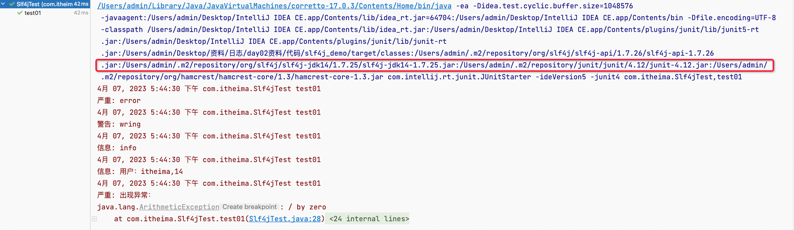

笔记来源：[**黑马程序员java日志框架教程，全面深入学习多种java日志框架**](https://www.bilibili.com/video/BV1iJ411H74S/?p=10&spm_id_from=pageDriver&vd_source=e8046ccbdc793e09a75eb61fe8e84a30)

------

# 1. 日志门面
当我们的系统变的更加复杂的时候，我们的日志就容易发生混乱。随着系统开发的进行，可能会更新不 同的日志框架，造成当前系统中存在不同的日志依赖，让我们难以统一的管理和控制。就算我们强制要 求所有的模块使用相同的日志框架，系统中也难以避免使用其他类似spring,mybatis等其他的第三方框 架，它们依赖于我们规定不同的日志框架，而且他们自身的日志系统就有着不一致性，依然会出来日志体系的混乱。

所以我们需要借鉴JDBC的思想，为日志系统也提供一套门面，那么我们就可以面向这些接口规范来开发，避免了直接依赖具体的日志框架。这样我们的系统在日志中，就存在了日志的门面和日志的实现。 

常见的日志门面：`JCL` `slf4j` 

常见的日志实现：`JUL` `log4j` `logback` `log4j2` 

日志门面和日志实现的关系： 		


日志框架出现的历史顺序：log4j ->JUL-> JCL -> slf4j -> logback -> log4j2

# 2 SLF4J的使用
简单日志门面（Simple Logging Facade For Java）SLF4J主要是为了给Java日志访问提供一套标准、规范 的API框架，其主要意义在于提供接口，具体的实现可以交由其他日志框架，例如log4j和logback等。 当然slf4j自己也提供了功能较为简单的实现，但是一般很少用到。对于一般的Java项目而言，日志框架 会选择slf4j-api作为门面，配上具体的实现框架(log4j、logback等)，中间使用桥接器完成桥接。 

官方网站：[SLF4J](https://www.slf4j.org/)

SLF4J是目前市面上最流行的日志门面。现在的项目中，基本上都是使用SLF4J作为我们的日志系统。 

SLF4J日志门面主要提供两大功能：

1. 日志框架的绑定
2. 日志框架的桥接

## 2.1 SLF4J入门
1. 添加依赖 

   ```xml
   <!-- slf4j 日志门面 -->
   <dependency>
       <groupId>org.slf4j</groupId>
       <artifactId>slf4j-api</artifactId>
       <version>1.7.26</version>
   </dependency>

   <!-- slf4j 内置的简单实现-->
   <dependency>
       <groupId>org.slf4j</groupId>
       <artifactId>slf4j-simple</artifactId>
       <version>1.7.21</version>
   </dependency>
   ```


2. 编写代码

   ```java
   package com.itheima;

   import org.junit.Test;
   import org.slf4j.Logger;
   import org.slf4j.LoggerFactory;

   public class Slf4jTest {

       public static final Logger LOGGER = LoggerFactory.getLogger(Slf4jTest.class);

       // 快速入门
       @Test
       public void test01()throws Exception{
           // 日志输出
           LOGGER.error("error");
           LOGGER.warn("wring");
           LOGGER.info("info"); // 默认级别
           LOGGER.debug("debug");
           LOGGER.trace("trace");

           // 使用占位符输出日志信息
           String name = "itheima";
           Integer age = 14;
           LOGGER.info("用户：{},{}",name,age);

           // 将系统的异常信息输出
           try {
               int i = 1/0;
           } catch (Exception e) {
              // e.printStackTrace();
               LOGGER.error("出现异常：",e);

           }
       }
   }
   ```


3. 输出


为什么要使用SLF4J作为日志门面？

1. 使用SLF4J框架，可以在部署时迁移到所需的日志记录框架。
2. SLF4J提供了对所有流行的日志框架的绑定，例如log4j，JUL，Simple logging和NOP。因此可以在部署时切换到任何这些流行的框架。  
3. 无论使用哪种绑定，SLF4J都支持参数化日志记录消息。由于SLF4J将应用程序和日志记录框架分离， 因此可以轻松编写独立于日志记录框架的应用程序。而无需担心用于编写应用程序的日志记录框架。 
4. SLF4J提供了一个简单的Java工具，称为迁移器。使用此工具，可以迁移现有项目，这些项目使用日志 框架(如Jakarta Commons Logging（JCL）或log4j或Java.util.logging（JUL）到SLF4J。 

## 2.2 绑定日志的实现(Binding) 
如前所述，SLF4J支持各种日志框架。SLF4J发行版附带了几个称为“SLF4J绑定”的jar文件，每个绑定对应一个受支持的框架。

使用slf4j的日志绑定流程：

1. 添加slf4j-api的依赖
2. 使用slf4j的API在项目中进行统一的日志记录
3. 绑定具体的日志实现框架
    1. 绑定已经实现了slf4j的日志框架,直接添加对应依赖，如LogBack
    2. ​绑定没有实现slf4j的日志框架,先添加日志的适配器,再添加实现类的依赖
4. slf4j有且仅有一个日志实现框架的绑定（如果出现多个默认使用第一个依赖日志实现）

通过maven引入常见的日志实现框架：

```xml
<!--slf4j core 使用slf4j必須添加--> 
<dependency>
    <groupId>org.slf4j</groupId>
    <artifactId>slf4j-api</artifactId>
    <version>1.7.27</version>
</dependency>


<!-- log4j-->
<!-- log4j适配器-->
<dependency>
    <groupId>org.slf4j</groupId>
    <artifactId>slf4j-log4j12</artifactId>
    <version>1.7.27</version>
</dependency>
<!-- log4j具体日志实现-->
<dependency>
    <groupId>log4j</groupId>
    <artifactId>log4j</artifactId>
    <version>1.2.17</version>
</dependency>


<!-- jul -->
<!-- jul适配器，由于jul是jdk默认实现的，因此不需要导入jul具体实现 -->
<dependency>
    <groupId>org.slf4j</groupId>
    <artifactId>slf4j-jdk14</artifactId>
    <version>1.7.27</version>
</dependency>

<!--jcl -->
<dependency>
    <groupId>org.slf4j</groupId>
    <artifactId>slf4j-jcl</artifactId>
    <version>1.7.27</version>
</dependency>

<!-- nop -->
<dependency>
    <groupId>org.slf4j</groupId>
    <artifactId>slf4j-nop</artifactId>
    <version>1.7.27</version>
</dependency>

       
<!--logback 日志实现，出现的比slf4j迟，所以不需要适配器，直接日志实现就行-->
<dependency>
    <groupId>ch.qos.logback</groupId>
    <artifactId>logback-classic</artifactId>
    <version>1.2.3</version>
</dependency>
```

要切换日志框架，只需替换类路径上的slf4j绑定。例如，要从`java.util.logging` 切换到log4j，只需将`slf4j-jdk14-1.7.27.jar` 替换为`slf4j-log4j12-1.7.27.jar` 即可。 

SLF4J不依赖于任何特殊的类装载。实际上，每个SLF4J绑定 都是硬连线的 以使用一个且只有 一个特定的日志记录框架。例如，`slf4j-log4j12-1.7.27.jar` 绑定在编译时绑定以使用log4j。在您的代码 中，除了`slf4j-api-1.7.27.jar`  ，您只需将您选择的一个且只有一个绑定放到相应的类路径位置。不要在类路径上放置多个绑定。以下是一般概念的图解说明。		

 	

浅蓝色为SLF4J门面，深蓝色为日志具体实现，青色为适配器			 				

## 2.3 桥接旧的日志框架(Bridging) 
通常，您依赖的某些组件依赖于SLF4J以外的日志记录API。您也可以假设这些组件在不久的将来不会切换到SLF4J。为了解决这种情况，SLF4J附带了几个桥接模块，这些模块将对log4j，JCL和`java.util.logging`  API的调用重定向，就好像它们是对SLF4J API一样。 

桥接解决的是项目中日志的遗留问题，当系统中存在之前的日志API，可以通过桥接转换到slf4j的实现

1. 先去除之前老的日志框架的依赖
2. 添加SLF4J提供的桥接组件
3. 为项目添加SLF4J的具体实现


迁移的方式: 如果我们要使用SLF4J的桥接器，替换原有的日志框架，那么我们需要做的第一件事情，就是删除掉原有项目中的日志框架的依赖。然后替换成SLF4J提供的桥接器。

```xml
<!-- log4j-->
<dependency>
    <groupId>org.slf4j</groupId>
    <artifactId>log4j-over-slf4j</artifactId>
    <version>1.7.27</version>
</dependency>

<!-- jul -->
<dependency>
    <groupId>org.slf4j</groupId>
    <artifactId>jul-to-slf4j</artifactId>
    <version>1.7.27</version>
</dependency>

<!--jcl -->
<dependency>
    <groupId>org.slf4j</groupId>
    <artifactId>jcl-over-slf4j</artifactId>
    <version>1.7.27</version>
</dependency>
```

注意问题: 

1. `jcl-over-slf4j.jar` 和 `slf4j-jcl.jar` 不能同时部署。前一个jar文件将导致JCL将日志系统的选择委托给 SLF4J，后一个jar文件将导致SLF4J将日志系统的选择委托给JCL，从而导致无限循环
2. `log4j-over-slf4j.jar` 和`slf4j-log4j12.jar` 不能同时出现
3. `jul-to-slf4j.jar` 和`slf4j-jdk14.jar` 不能同时出现
4. 所有的桥接都只对Logger日志记录器对象有效，如果程序中调用了内部的配置类或者是Appender，Filter等对象，将无法产生效果。 

## 2.4 SLF4J原理解析
1. SLF4J通过LoggerFactory加载日志具体的实现对象。
2. LoggerFactory在初始化的过程中，会通过`performInitialization()` 方法绑定具体的日志实现。
3. 在绑定具体实现的时候，通过类加载器，加载`org/slf4j/impl/StaticLoggerBinder.class` 
4. 所以，只要是一个日志实现框架，在`org.slf4j.impl` 包中提供一个自己的StaticLoggerBinder类，在其中提供具体日志实现的LoggerFactory就可以被SLF4J所加载

# 3 具体案例
## 3.1 只加slf4j日志门面
```xml
<!-- slf4j 日志门面 -->
<dependency>
	<groupId>org.slf4j</groupId>
    <artifactId>slf4j-api</artifactId>
    <version>1.7.26</version>
</dependency>
```

输出


任何级别的日志都没打印出来

## 3.2 slf4j-simple默认实现
```xml
<!-- slf4j 日志门面 -->
<dependency>
    <groupId>org.slf4j</groupId>
    <artifactId>slf4j-api</artifactId>
    <version>1.7.26</version>
</dependency>

<!-- slf4j 内置的简单实现-->
<dependency>
    <groupId>org.slf4j</groupId>
    <artifactId>slf4j-simple</artifactId>
    <version>1.7.21</version>
</dependency>
```

输出


## 3.3 logback
```xml
<!-- slf4j 日志门面 -->
<dependency>
    <groupId>org.slf4j</groupId>
    <artifactId>slf4j-api</artifactId>
    <version>1.7.26</version>
</dependency>

<!--logback 日志实现-->
<dependency>
    <groupId>ch.qos.logback</groupId>
    <artifactId>logback-classic</artifactId>
    <version>1.2.3</version>
</dependency>
```


logback-classic包中包含logback-core包，所以不需要再倒入logback-core


## 3.4 nop
```xml
<!--nop 日志开关-->
<dependency>
	<groupId>org.slf4j</groupId>
    <artifactId>slf4j-nop</artifactId>
    <version>1.7.25</version>
</dependency>
```

输出


## 3.5 JUL实现
```xml
<!-- slf4j 日志门面 -->
<dependency>
    <groupId>org.slf4j</groupId>
    <artifactId>slf4j-api</artifactId>
    <version>1.7.26</version>
</dependency>

<!--绑定 jul 日志实现，需要导入适配器 -->
<dependency>
    <groupId>org.slf4j</groupId>
    <artifactId>slf4j-jdk14</artifactId>
    <version>1.7.25</version>
</dependency>
```

输出



## 3.6 Log4J
```xml
<!-- slf4j 日志门面 -->
<dependency>
    	<groupId>org.slf4j</groupId>
      <artifactId>slf4j-api</artifactId>
      <version>1.7.26</version>
</dependency>


<!--绑定 log4j 日志实现，需要导入适配器-->
<dependency>
      <groupId>org.slf4j</groupId>
      <artifactId>slf4j-log4j12</artifactId>
      <version>1.7.12</version>
</dependency>

<dependency>
       <groupId>log4j</groupId>
       <artifactId>log4j</artifactId>
       <version>1.2.17</version>
</dependency>
```

log4j.properties

```properties
# 141. 指定 RootLogger 顶级父元素默认配置信息
# 142. 指定日志级别=trace，使用的 apeender 为=console
log4j.rootLogger = trace,console

# 143. 自定义 logger 对象设置
log4j.logger.com.itheima = info,rollingFile
log4j.logger.org.apache = error

# 144. 指定控制台日志输出的 appender
log4j.appender.console = org.apache.log4j.ConsoleAppender
# 145. 指定消息格式 layout
log4j.appender.console.layout = org.apache.log4j.PatternLayout
# 146. 指定消息格式的内容
log4j.appender.console.layout.conversionPattern = [%-10p]%r  %l %d{yyyy-MM-dd HH:mm:ss.SSS} %m%n


# 147. %m   输出代码中指定的日志信息
# 148. %p   输出优先级，及 DEBUG、INFO 等
# 149. %n   换行符（Windows平台的换行符为 "\n"，Unix 平台为 "\n"）
# 150. %r   输出自应用启动到输出该 log 信息耗费的毫秒数
# 151. %c   输出打印语句所属的类的全名
# 152. %t   输出产生该日志的线程全名
# 153. %d   输出服务器当前时间，默认为 ISO8601，也可以指定格式，如：%d{yyyy年MM月dd日 HH:mm:ss}
# 154. %l   输出日志时间发生的位置，包括类名、线程、及在代码中的行数。如：Test.main(Test.java:10)
# 155. %F   输出日志消息产生时所在的文件名称
# 156. %L   输出代码中的行号
# 157. %%   输出一个 "%" 字符

# 158. 日志文件输出的 appender 对象
log4j.appender.file = org.apache.log4j.FileAppender
# 159. 指定消息格式 layout
log4j.appender.file.layout = org.apache.log4j.PatternLayout
# 160. 指定消息格式的内容
log4j.appender.file.layout.conversionPattern = [%-10p]%r  %l %d{yyyy-MM-dd HH:mm:ss.SSS} %m%n
# 161. 指定日志文件保存路径
log4j.appender.file.file = /Users/admin/logs/log4j.log
# 162. 指定日志文件的字符集
log4j.appender.file.encoding = UTF-8


# 163. 按照文件大小拆分的 appender 对象
# 164. 日志文件输出的 appender 对象
log4j.appender.rollingFile = org.apache.log4j.RollingFileAppender
# 165. 指定消息格式 layout
log4j.appender.rollingFile.layout = org.apache.log4j.PatternLayout
# 166. 指定消息格式的内容
log4j.appender.rollingFile.layout.conversionPattern = [%-10p]%r  %l %d{yyyy-MM-dd HH:mm:ss.SSS} %m%n
# 167. 指定日志文件保存路径
log4j.appender.rollingFile.file = /Users/admin/logs/log4j.log
# 168. 指定日志文件的字符集
log4j.appender.rollingFile.encoding = UTF-8
# 169. 指定日志文件内容的大小
log4j.appender.rollingFile.maxFileSize = 1MB 
# 170. 指定日志文件的数量
log4j.appender.rollingFile.maxBackupIndex = 10


# 171. 按照时间规则拆分的 appender 对象
log4j.appender.dailyFile = org.apache.log4j.DailyRollingFileAppender
# 172. 指定消息格式 layout
log4j.appender.dailyFile.layout = org.apache.log4j.PatternLayout
# 173. 指定消息格式的内容
log4j.appender.dailyFile.layout.conversionPattern = [%-10p]%r  %l %d{yyyy-MM-dd HH:mm:ss.SSS} %m%n
# 174. 指定日志文件保存路径
log4j.appender.dailyFile.file = /Users/admin/logs/log4j.log
# 175. 指定日志文件的字符集
log4j.appender.dailyFile.encoding = UTF-8
# 176. 指定日期拆分规则
log4j.appender.dailyFile.datePattern = '.'yyyy-MM-dd-HH-mm-ss


#mysql
log4j.appender.logDB=org.apache.log4j.jdbc.JDBCAppender
log4j.appender.logDB.layout=org.apache.log4j.PatternLayout
log4j.appender.logDB.Driver=com.mysql.jdbc.Driver
log4j.appender.logDB.URL=jdbc:mysql://localhost:3306/test
log4j.appender.logDB.User=root
log4j.appender.logDB.Password=root
log4j.appender.logDB.Sql=INSERT INTO log(project_name,create_date,level,category,file_name,thread_name,line,all_category,message) values('itcast','%d{yyyy-MM-dd HH:mm:ss}','%p','%c','%F','%t','%L','%l','%m')
```

输出


## 3.7 桥接器的使用
原本项目使用的是log4j，现在打算使用Slf4j和logback，则

```xml
<dependencies>
    <!-- slf4j 日志门面 -->
    <dependency>
        <groupId>org.slf4j</groupId>
        <artifactId>slf4j-api</artifactId>
        <version>1.7.26</version>
    </dependency>


    <!--logback 日志实现，引入logback的具体实现-->
    <dependency>
        <groupId>ch.qos.logback</groupId>
        <artifactId>logback-classic</artifactId>
        <version>1.2.3</version>
    </dependency>


    <!--配置 log4j 的桥接器，引入log4j的桥接器-->
    <dependency>
        <groupId>org.slf4j</groupId>
        <artifactId>log4j-over-slf4j</artifactId>
        <version>1.7.25</version>
    </dependency>

	
    <!-- 原本的log4j的适配器和log4j具体实现注释掉
    <dependency>
        <groupId>org.slf4j</groupId>
        <artifactId>slf4j-log4j12</artifactId>
        <version>1.7.12</version>
    </dependency>

    <dependency>
        <groupId>log4j</groupId>
        <artifactId>log4j</artifactId>
        <version>1.2.17</version>
    </dependency>
    -->

</dependencies>
```

代码不需要做任何改动。输出


日志已经改为logback的输出了

## 3.8 同时引入桥接器和适配器引发的问题
```xml
<dependencies>
        <!-- slf4j 日志门面 -->
        <dependency>
            <groupId>org.slf4j</groupId>
            <artifactId>slf4j-api</artifactId>
            <version>1.7.26</version>
        </dependency>


        <!--配置 log4j 的桥接器-->
        <dependency>
            <groupId>org.slf4j</groupId>
            <artifactId>log4j-over-slf4j</artifactId>
            <version>1.7.25</version>
        </dependency>

        
        <!--绑定 log4j 日志实现，需要导入适配器-->
        <dependency>
            <groupId>org.slf4j</groupId>
            <artifactId>slf4j-log4j12</artifactId>
            <version>1.7.12</version>
        </dependency>

        <dependency>
            <groupId>log4j</groupId>
            <artifactId>log4j</artifactId>
            <version>1.2.17</version>
        </dependency>


        <!-- junit 单元测试-->
        <dependency>
            <groupId>junit</groupId>
            <artifactId>junit</artifactId>
            <version>4.12</version>
        </dependency>
</dependencies>
```

现象：


原因分析：


