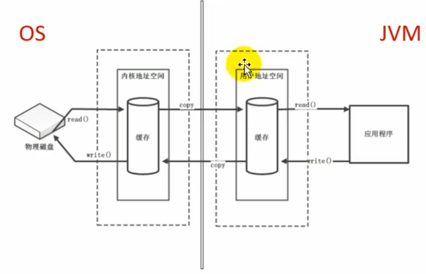
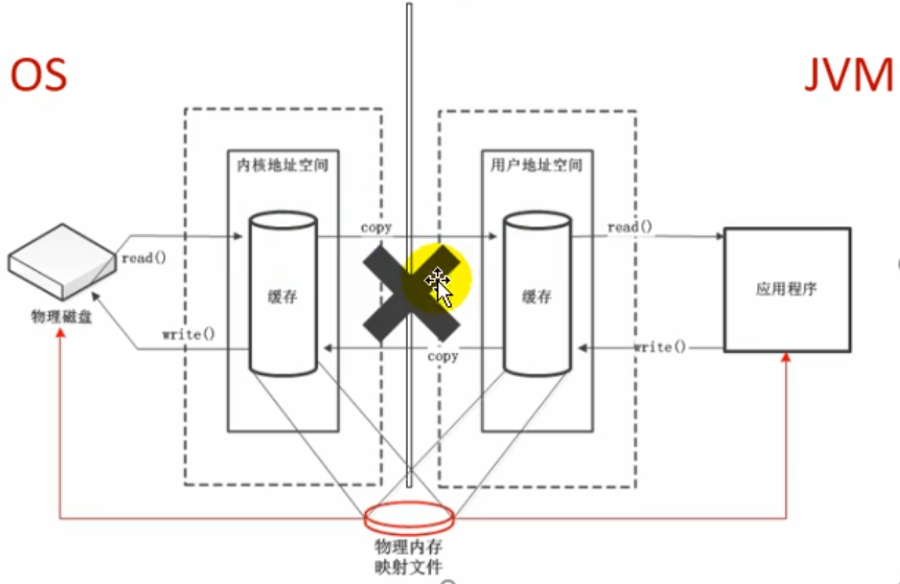
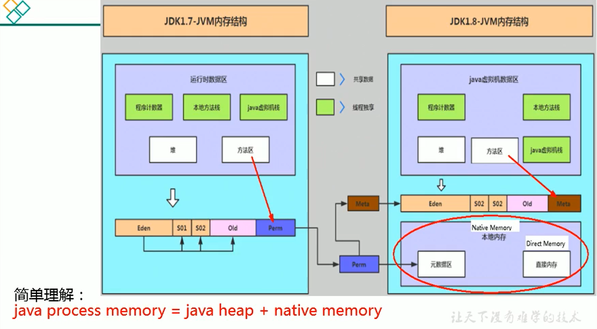

# 1 直接内存概述
不是虚拟机运行时数据区的一部分，也不是《Java 虚拟机规范》中定义的内存区域。直接内存是在 Java 堆外的、直接向系统申请的内存区间。来源于 NIO，通过存在堆中的 DirectByteBuffer 操作 Native 内存。通常，访问直接内存的速度会优于 Java 堆，即读写性能高。

+ 因此出于性能考虑，读写频繁的场合可能会考虑使用直接内存。
+ Java 的 NIO 库允许 Java 程序使用直接内存，用于数据缓冲区

```java
package com.atguigu.java;

import java.nio.ByteBuffer;
import java.util.Scanner;

/**
 *  IO                  NIO (New IO / Non-Blocking IO)
 *  byte[] / char[]     Buffer
 *  Stream              Channel
 *
 * 查看直接内存的占用与释放
 * @author shkstart  shkstart@126.com
 * @create 2020  0:22
 */
public class BufferTest {
    private static final int BUFFER = 1024 * 1024 * 1024;//1GB

    public static void main(String[] args){
        //直接分配本地内存空间
        ByteBuffer byteBuffer = ByteBuffer.allocateDirect(BUFFER);
        System.out.println("直接内存分配完毕，请求指示！");

        Scanner scanner = new Scanner(System.in);
        scanner.next();

        System.out.println("直接内存开始释放！");
        byteBuffer = null;
        System.gc();
        scanner.next();
    }
}

```

## 1.1 非直接缓存区
使用 IO 读写文件，需要与磁盘交互，需要由用户态切换到内核态。在内核态时，需要两份内存存储重复数据，效率低。



## 1.2 直接缓存区
使用 NIO 时，操作系统划出的直接缓存区可以被 java 代码直接访问，只有一份。NIO 适合对大文件的读写操作。



直接缓冲区和非直接缓冲区效率比对：

```java
package com.atguigu.java;

import java.io.FileInputStream;
import java.io.FileOutputStream;
import java.io.IOException;
import java.nio.ByteBuffer;
import java.nio.channels.FileChannel;

/**
 * @author shkstart  shkstart@126.com
 * @create 2020  0:04
 */
public class BufferTest1 {

    private static final String TO = "F:\\test\\异界BD中字.mp4";
    private static final int _100Mb = 1024 * 1024 * 100;

    public static void main(String[] args) {
        long sum = 0;
        String src = "F:\\test\\异界BD中字.mp4";
        for (int i = 0; i < 3; i++) {
            String dest = "F:\\test\\异界BD中字_" + i + ".mp4";
//            sum += io(src,dest);//54606
            sum += directBuffer(src,dest);//50244
        }

        System.out.println("总花费的时间为：" + sum );
    }

    private static long directBuffer(String src,String dest) {
        long start = System.currentTimeMillis();

        FileChannel inChannel = null;
        FileChannel outChannel = null;
        try {
            inChannel = new FileInputStream(src).getChannel();
            outChannel = new FileOutputStream(dest).getChannel();

            ByteBuffer byteBuffer = ByteBuffer.allocateDirect(_100Mb);
            while (inChannel.read(byteBuffer) != -1) {
                byteBuffer.flip();//修改为读数据模式
                outChannel.write(byteBuffer);
                byteBuffer.clear();//清空
            }
        } catch (IOException e) {
            e.printStackTrace();
        } finally {
            if (inChannel != null) {
                try {
                    inChannel.close();
                } catch (IOException e) {
                    e.printStackTrace();
                }

            }
            if (outChannel != null) {
                try {
                    outChannel.close();
                } catch (IOException e) {
                    e.printStackTrace();
                }

            }
        }

        long end = System.currentTimeMillis();
        return end - start;

    }

    private static long io(String src,String dest) {
        long start = System.currentTimeMillis();

        FileInputStream fis = null;
        FileOutputStream fos = null;
        try {
            fis = new FileInputStream(src);
            fos = new FileOutputStream(dest);
            byte[] buffer = new byte[_100Mb];
            while (true) {
                int len = fis.read(buffer);
                if (len == -1) {
                    break;
                }
                fos.write(buffer, 0, len);
            }
        } catch (IOException e) {
            e.printStackTrace();
        } finally {
            if (fis != null) {
                try {
                    fis.close();
                } catch (IOException e) {
                    e.printStackTrace();
                }

            }
            if (fos != null) {
                try {
                    fos.close();
                } catch (IOException e) {
                    e.printStackTrace();
                }

            }
        }

        long end = System.currentTimeMillis();
        return end - start;
    }
}

```

使用直接内存也可能导致 OutOfMemoryError 异常

```java
package com.atguigu.java;

import java.nio.ByteBuffer;
import java.util.ArrayList;

/**
 * 本地内存的OOM:  OutOfMemoryError: Direct buffer memory
 *
 * @author shkstart  shkstart@126.com
 * @create 2020  0:09
 */
public class BufferTest2 {
    private static final int BUFFER = 1024 * 1024 * 20;//20MB

    public static void main(String[] args) {
        ArrayList<ByteBuffer> list = new ArrayList<>();

        int count = 0;
        try {
            while(true){
                ByteBuffer byteBuffer = ByteBuffer.allocateDirect(BUFFER);
                list.add(byteBuffer);
                count++;
                try {
                    Thread.sleep(100);
                } catch (InterruptedException e) {
                    e.printStackTrace();
                }
            }
        } finally {
            System.out.println(count);
        }

    }
}

```

```java
Exception in thread "main" java.lang.OutOfMemoryError: Direct buffer memory
	at java.nio.Bits.reserveMemory(Bits.java:695)
	at java.nio.DirectByteBuffer.<init>(DirectByteBuffer.java:123)
	at java.nio.ByteBuffer.allocateDirect(ByteBuffer.java:311)
	at com.atguigu.java.BufferTest2.main(BufferTest2.java:21)
```

由于直接内存在 Java 堆外，因此它的大小不会直接受限于`-Xmx`指定的最大堆大小，但是系统内存是有限的，Java 堆和直接内存的总和依然受限于操作系统能给出的最大内存。

+ 分配回收成本较高
+ 不受 JVM 内存回收管理

直接内存大小可以通过`-XX:MaxDirectMemorySize=10m`设置。如果不指定，默认与堆的最大值-Xmx 参数值一致

```java
package com.atguigu.java;

import sun.misc.Unsafe;

import java.lang.reflect.Field;

/**
 * -Xmx20m -XX:MaxDirectMemorySize=10m
 * @author shkstart  shkstart@126.com
 * @create 2020  0:36
 */
public class MaxDirectMemorySizeTest {
    private static final long _1MB = 1024 * 1024;

    public static void main(String[] args) throws IllegalAccessException {
        Field unsafeField = Unsafe.class.getDeclaredFields()[0];
        unsafeField.setAccessible(true);
        Unsafe unsafe = (Unsafe)unsafeField.get(null);
        while(true){
            unsafe.allocateMemory(_1MB);
        }

    }
}
```



