笔记来源：[尚硅谷 JVM 全套教程，百万播放，全网巅峰（宋红康详解 java 虚拟机）](https://www.bilibili.com/video/BV1PJ411n7xZ)

# 1 String 的基本特性
+ String 字符串，使用一对`""`引起来表示。
+ String 声明为 final 的，不可被继承。
+ String 实现了 Serializable 接口：表示字符串是支持序列化的。
+ String 实现了 Comparable 接口：表示 string 可以比较大小。
+ String 在 jdk8 及以前内部定义了 final char[] value 用于存储字符串数据。JDK9 时改为 byte[]。

## 1.1 String在Jdk9 中存储结构变更
官网地址：[JEP 254: Compact Strings (java.net)](http://openjdk.java.net/jeps/254)

> ## Motivation
> The current implementation of the `String` class stores characters in a `char` array, using two bytes (sixteen bits) for each character. Data gathered from many different applications indicates that strings are a major component of heap usage and, moreover, that most `String` objects contain only Latin-1 characters. Such characters require only one byte of storage, hence half of the space in the internal `char` arrays of such `String` objects is going unused.
>
> ## Description
> We propose to change the internal representation of the `String` class from a UTF-16 `char` array to a `byte` array plus an encoding-flag field. The new `String` class will store characters encoded either as ISO-8859-1/Latin-1 (one byte per character), or as UTF-16 (two bytes per character), based upon the contents of the string. The encoding flag will indicate which encoding is used.
>
> String-related classes such as `AbstractStringBuilder`, `StringBuilder`, and `StringBuffer` will be updated to use the same representation, as will the HotSpot VM's intrinsic string operations.
>
> This is purely an implementation change, with no changes to existing public interfaces. There are no plans to add any new public APIs or other interfaces.
>
> The prototyping work done to date confirms the expected reduction in memory footprint, substantial reductions of GC activity, and minor performance regressions in some corner cases.
>

****

**动机**

目前 String 类的实现将字符存储在一个 char 数组中，每个字符使用两个字节（16 位）。从许多不同的应用中收集到的数据表明，字符串是堆使用的主要组成部分，此外，大多数字符串对象只包含 Latin-1 字符。这些字符只需要一个字节的存储空间，因此这些字符串对象的内部字符数组中有一半的空间没有被使用。

****

**说明**

我们建议将 String 类的内部表示方法从 UTF-16 字符数组改为字节数组加编码标志域。新的 String 类将根据字符串的内容，以 ISO-8859-1/Latin-1（每个字符一个字节）或 UTF-16（每个字符两个字节）的方式存储字符编码。编码标志将表明使用的是哪种编码。


与字符串相关的类，如<font style="color:#FFFFFF;background-color:#FFFFFF;">AbstractStringBuilder、StringBuilder 和 StringBuffer 将被更新以使用相同的表示方法，HotSpot VM 的内在字符串操作也是如此。</font><font style="color:#FFFFFF;background-color:#FFFFFF;">。。</font>

这纯粹是一个实现上的变化，对现有的公共接口没有变化。目前没有计划增加任何新的公共 API 或其他接口。

迄今为止所做的原型设计工作证实了内存占用的预期减少，GC 活动的大幅减少，以及在某些角落情况下的轻微性能倒退。

结论：String 再也不用 char[] 来存储了，改成了 byte [] 加上编码标记，节约了一些空间

```java
public final class String implements java.io.Serializable, Comparable<String>, CharSequence {
    @Stable
    private final byte[] value;
}
```

## 1.2 String 的基本特性
String：代表不可变的字符序列。简称：不可变性。

+ 当对字符串重新赋值时，需要重写指定内存区域赋值，不能使用原有的 value 进行赋值。
+ 当对现有的字符串进行连接操作时，也需要重新指定内存区域赋值，不能使用原有的 value 进行赋值。
+ 当调用 string 的 replace()方法修改指定字符或字符串时，也需要重新指定内存区域赋值，不能使用原有的 value 进行赋值。 

```java
package com.atguigu.java;

import org.junit.Test;

/**
 * String的基本使用:体现String的不可变性
 *
 * @author shkstart  shkstart@126.com
 * @create 2020  23:42
 */
public class StringTest1 {
    @Test
    public void test1() {
        String s1 = "abc";//字面量定义的方式，"abc"存储在字符串常量池中
        String s2 = "abc";
        s1 = "hello";

        System.out.println(s1 == s2);//判断地址：true  --> false

        System.out.println(s1);//
        System.out.println(s2);//abc

    }

    @Test
    public void test2() {
        String s1 = "abc";
        String s2 = "abc";
        s2 += "def";
        System.out.println(s2);//abcdef
        System.out.println(s1);//abc
    }

    @Test
    public void test3() {
        String s1 = "abc";
        String s2 = s1.replace('a', 'm');
        System.out.println(s1);//abc
        System.out.println(s2);//mbc
    }
}

```

通过字面量的方式（区别于 new）给一个字符串赋值，此时的字符串值声明在字符串常量池中。


字符串常量池是不会存储相同内容的字符串的

String 的 String Pool 是一个固定大小的 Hashtable（不会扩容），默认值大小长度是 1009。如果放进 String Pool 的 String 非常多，就会造成 Hash 冲突严重，从而导致链表会很长，而链表长了后直接会造成的影响就是当调用 String.intern 时性能会大幅下降。

使用`-XX:StringTablesize=1009`可设置 StringTable 的长度

+ 在 jdk6 中 StringTable 是固定的，就是 1009 的长度，所以如果常量池中的字符串过多就会导致效率下降很快。StringTablesize 设置没有要求
+ 在 jdk7 中，StringTable 的长度默认值是 60013，StringTablesize 设置没有要求
+ 在 JDK8 中，设置 StringTable 长度的话，1009 是可以设置的最小值

```java
package com.atguigu.java;

import java.io.BufferedReader;
import java.io.FileReader;
import java.io.IOException;

/**
 *  -XX:StringTableSize=1009
 * @author shkstart  shkstart@126.com
 * @create 2020  23:53
 */
public class StringTest2 {
    public static void main(String[] args) {
        //测试StringTableSize参数
        System.out.println("我来打个酱油");
        try {
            Thread.sleep(1000000);
        } catch (InterruptedException e) {
            e.printStackTrace();
        }

        BufferedReader br = null;
        try {
            br = new BufferedReader(new FileReader("words.txt"));
            long start = System.currentTimeMillis();
            String data;
            while((data = br.readLine()) != null){
                data.intern(); //如果字符串常量池中没有对应data的字符串的话，则在常量池中生成
            }

            long end = System.currentTimeMillis();

            System.out.println("花费的时间为：" + (end - start));//1009:143ms  100009:47ms
        } catch (IOException e) {
            e.printStackTrace();
        } finally {
            if(br != null){
                try {
                    br.close();
                } catch (IOException e) {
                    e.printStackTrace();
                }

            }
        }
    }
}


```

```java
package com.atguigu.java;

import java.io.FileWriter;
import java.io.IOException;

/**
 * 产生10万个长度不超过10的字符串，包含a-z,A-Z
 * @author shkstart  shkstart@126.com
 * @create 2020  23:58
 */
public class GenerateString {
    public static void main(String[] args) throws IOException {
        FileWriter fw =  new FileWriter("words.txt");

        for (int i = 0; i < 100000; i++) {
            //1 - 10
           int length = (int)(Math.random() * (10 - 1 + 1) + 1);
            fw.write(getString(length) + "
");
        }

        fw.close();
    }

    public static String getString(int length){
        String str = "";
        for (int i = 0; i < length; i++) {
            //65 - 90, 97-122
            int num = (int)(Math.random() * (90 - 65 + 1) + 65) + (int)(Math.random() * 2) * 32;
            str += (char)num;
        }
        return str;
    }
}

```

# 2 String 的内存分配
在 Java 语言中有 8 种基本数据类型和一种比较特殊的类型 String。这些类型为了使它们在运行过程中速度更快、更节省内存，都提供了一种常量池的概念。

常量池就类似一个 Java 系统级别提供的缓存。8 种基本数据类型的常量池都是系统协调的，String 类型的常量池比较特殊。它的主要使用方法有两种。

+ 直接使用双引号声明出来的 String 对象会直接存储在常量池中。比如：`String  info="hello"`
+ 如果不是用双引号声明的 String 对象，可以使用 String 提供的 intern()方法。这个后面重点谈

Java 6 及以前，字符串常量池存放在永久代

Java 7 中 Oracle 的工程师对字符串池的逻辑做了很大的改变，即将字符串常量池的位置调整到 Java 堆内

+ 所有的字符串都保存在堆（Heap）中，和其他普通对象一样，这样可以让你在进行调优应用时仅需要调整堆大小就可以了。
+ 字符串常量池概念原本使用得比较多，但是这个改动使得我们有足够的理由让我们重新考虑在 Java 7 中使用`String.intern()`。

Java8 元空间，字符串常量在堆

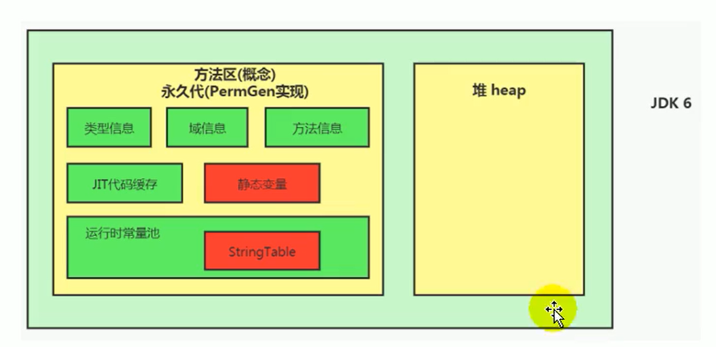

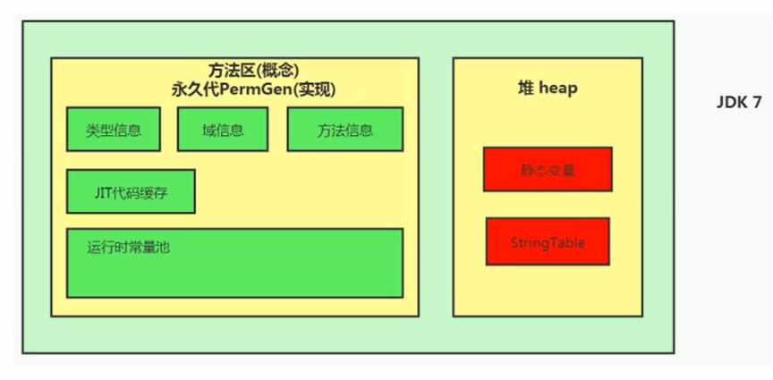

```java
package com.atguigu.java;

import java.util.HashSet;
import java.util.Set;

/**
 * jdk6中：
 * -XX:PermSize=6m -XX:MaxPermSize=6m -Xms6m -Xmx6m
 *
 * jdk8中：
 * -XX:MetaspaceSize=6m -XX:MaxMetaspaceSize=6m -Xms6m -Xmx6m
 * @author shkstart  shkstart@126.com
 * @create 2020  0:36
 */
public class StringTest3 {
    public static void main(String[] args) {
        //使用Set保持着常量池引用，避免full gc回收常量池行为
        Set<String> set = new HashSet<String>();
        //在short可以取值的范围内足以让6MB的PermSize或heap产生OOM了。
        short i = 0;
        while(true){
            set.add(String.valueOf(i++).intern());
        }
    }
}

```

在JDK6中报如下错：永久代溢出

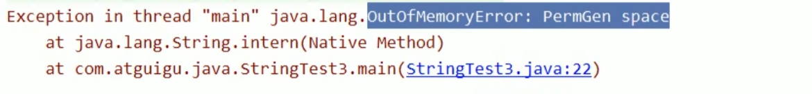

在JDK8中报如下错：堆溢出

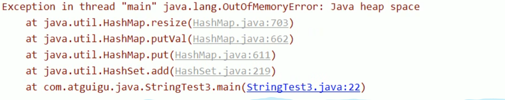

**StringTable 为什么要调整？**

①permSize比较小

②永久代垃圾回收频率较低

官网地址：[Java SE 7 Features and Enhancements (oracle.com)](https://www.oracle.com/java/technologies/javase/jdk7-relnotes.html#jdk7changes)

> **Synopsis:** In JDK 7, interned strings are no longer allocated in the permanent generation of the Java heap, but are instead allocated in the main part of the Java heap (known as the young and old generations), along with the other objects created by the application. This change will result in more data residing in the main Java heap, and less data in the permanent generation, and thus may require heap sizes to be adjusted. Most applications will see only relatively small differences in heap usage due to this change, but larger applications that load many classes or make heavy use of the `String.intern()` method will see more significant differences.
>

简介：在 JDK 7 中，内部字符串不再分配在 Java 堆的永久代中，而是分配在 Java 堆的主要部分（称为年轻代和老年代），与应用程序创建的其他对象一起。这种变化将导致更多的数据驻留在主 Java 堆中，而更少的数据在永久代中，因此可能需要调整堆的大小。大多数应用程序将看到由于这一变化而导致的堆使用的相对较小的差异，但加载许多类或大量使用 String.intern()方法的大型应用程序将看到更明显的差异。

# 3 String 的基本操作
案例一：

```java
package com.atguigu.java1;

import org.junit.Test;

import javax.annotation.processing.SupportedSourceVersion;
import java.sql.SQLOutput;

/**
 * @author shkstart  shkstart@126.com
 * @create 2020  0:49
 */
public class StringTest4 {
    public static void main(String[] args) {
        System.out.println();
        System.out.println("1");//2770
        System.out.println("2");
        System.out.println("3");
        System.out.println("4");
        System.out.println("5");
        System.out.println("6");
        System.out.println("7");
        System.out.println("8");
        System.out.println("9");
        System.out.println("10");//2779
        
        //如下的字符串"1" 到 "10"不会再次加载
        System.out.println("1");//2780
        System.out.println("2");//2780
        System.out.println("3");
        System.out.println("4");
        System.out.println("5");
        System.out.println("6");
        System.out.println("7");
        System.out.println("8");
        System.out.println("9");
        System.out.println("10");//2780
    }
}


```

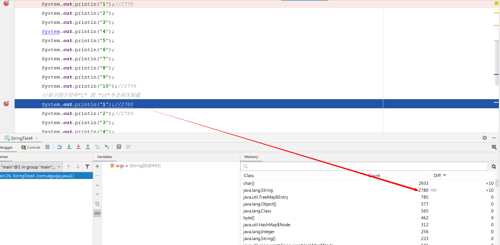


后面的10个打印不会再往字符串常量池里面添加重复的值

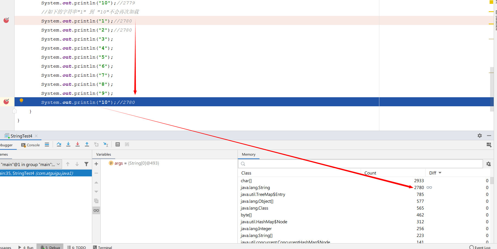


Java 语言规范里要求完全相同的字符串字面量，应该包含同样的 Unicode 字符序列（包含同一份码点序列的常量），并且必须是指向同一个 String 类实例。

```java
class Memory {
    public static void main(String[] args) {//line 1
        int i= 1;//line 2
        Object obj = new Object();//line 3
        Memory mem = new Memory();//Line 4
        mem.foo(obj);//Line 5
    }//Line 9
    private void foo(Object param) {//line 6
        String str = param.toString();//line 7
        System.out.println(str);
    }//Line 8
}
```

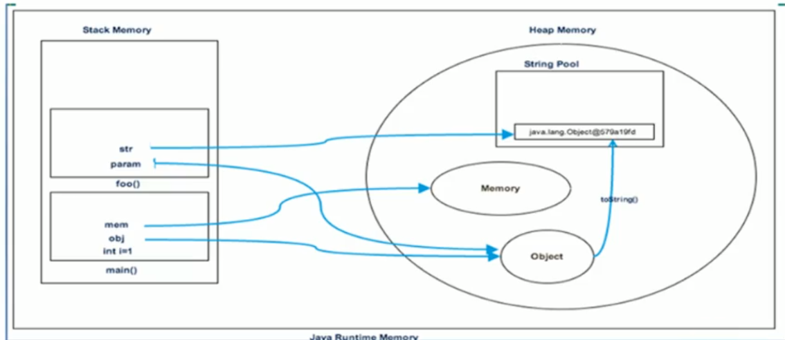

# 4 字符串拼接操作
+ 常量与常量的拼接结果在常量池，原理是编译期优化
+ 常量池中不会存在相同内容的变量
+ 只要其中有一个是变量，结果就在堆中。变量拼接的原理是 StringBuilder
+ 如果拼接的结果调用 intern()方法，则主动将常量池中还没有的字符串对象放入池中，并返回此对象地址

****

**举例 1**

```java
package com.atguigu.java1;

import org.junit.Test;

/**
 * 字符串拼接操作
 * @author shkstart  shkstart@126.com
 * @create 2020  0:59
 */
public class StringTest5 {
    @Test
    public void test1(){
        String s1 = "a" + "b" + "c";//编译期优化： 通过idea直接看对应的反编译的class文件，会显示 String s1 = "abc"; 说明做了代码优化
        String s2 = "abc"; //"abc"一定是放在字符串常量池中，将此地址赋给s2
        /*
         * 最终.java编译成.class,再执行.class
         * String s1 = "abc";
         * String s2 = "abc"
         */
        System.out.println(s1 == s2); //true   有上述可知，s1和s2实际上指向字符串常量池中的同一个值
        System.out.println(s1.equals(s2)); //true
    }

    @Test
    public void test2(){
        String s1 = "javaEE";
        String s2 = "hadoop";

        String s3 = "javaEEhadoop";
        String s4 = "javaEE" + "hadoop";//编译期优化
        //如果拼接符号的前后出现了变量，则相当于在堆空间中new String()，具体的内容为拼接的结果：javaEEhadoop
        String s5 = s1 + "hadoop";
        String s6 = "javaEE" + s2;
        String s7 = s1 + s2;

        System.out.println(s3 == s4);//true
        System.out.println(s3 == s5);//false
        System.out.println(s3 == s6);//false
        System.out.println(s3 == s7);//false
        System.out.println(s5 == s6);//false
        System.out.println(s5 == s7);//false
        System.out.println(s6 == s7);//false
        //intern():判断字符串常量池中是否存在javaEEhadoop值，如果存在，则返回常量池中javaEEhadoop的地址；
        //如果字符串常量池中不存在javaEEhadoop，则在常量池中加载一份javaEEhadoop，并返回次对象的地址。
        String s8 = s6.intern();
        System.out.println(s3 == s8);//true
    }

    @Test
    public void test3(){
        String s1 = "a";
        String s2 = "b";
        String s3 = "ab";
        /*
        如下的s1 + s2 的执行细节：(变量s是我临时定义的）
        ① StringBuilder s = new StringBuilder();
        ② s.append("a")
        ③ s.append("b")
        ④ s.toString()  --> 约等于 new String("ab")

        补充：在jdk5.0之后使用的是StringBuilder,在jdk5.0之前使用的是StringBuffer
         */
        String s4 = s1 + s2;//
        System.out.println(s3 == s4);//false
    }
    /*
    1. 字符串拼接操作不一定使用的是StringBuilder!
       如果拼接符号左右两边都是字符串常量或常量引用，则仍然使用编译期优化，即非StringBuilder的方式。
    2. 针对于final修饰类、方法、基本数据类型、引用数据类型的量的结构时，能使用上final的时候建议使用上。
     */
    @Test
    public void test4(){
        final String s1 = "a";
        final String s2 = "b";
        String s3 = "ab";
        String s4 = s1 + s2;
        System.out.println(s3 == s4);//true
    }
    //练习：
    @Test
    public void test5(){
        String s1 = "javaEEhadoop";
        String s2 = "javaEE";
        String s3 = s2 + "hadoop";
        System.out.println(s1 == s3);//false

        final String s4 = "javaEE";//s4:常量
        String s5 = s4 + "hadoop";
        System.out.println(s1 == s5);//true

    }
}

```

**字节码调度分析**

我们拿例 4 的字节码进行查看，可以发现`s1 + s2`实际上是 new 了一个 StringBuilder 对象，并使用了 append 方法将 s1 和 s2 添加进来，最后调用了 toString 方法赋给 s4

```shell
 0 ldc #2 
 2 astore_1
 3 ldc #3 <b>
 5 astore_2
 6 ldc #4 
 8 astore_3
 9 new #5 <java/lang/StringBuilder>
12 dup
13 invokespecial #6 <java/lang/StringBuilder.<init>>
16 aload_1
17 invokevirtual #7 <java/lang/StringBuilder.append>
20 aload_2
21 invokevirtual #7 <java/lang/StringBuilder.append>
24 invokevirtual #8 <java/lang/StringBuilder.toString>
27 astore 4
29 getstatic #9 <java/lang/System.out>
32 aload_3
33 aload 4
35 if_acmpne 42 (+7)
38 iconst_1
39 goto 43 (+4)
42 iconst_0
43 invokevirtual #10 <java/io/PrintStream.println>
46 return
```

****

**字符串拼接操作性能对比**

```java
/*
    体会执行效率：通过StringBuilder的append()的方式添加字符串的效率要远高于使用String的字符串拼接方式！
    详情：① StringBuilder的append()的方式：自始至终中只创建过一个StringBuilder的对象
          使用String的字符串拼接方式：创建过多个StringBuilder和String的对象
         ② 使用String的字符串拼接方式：内存中由于创建了较多的StringBuilder和String的对象，内存占用更大；如果进行GC，需要花费额外的时间。

     改进的空间：在实际开发中，如果基本确定要前前后后添加的字符串长度不高于某个限定值highLevel的情况下,建议使用构造器实例化：
               StringBuilder s = new StringBuilder(highLevel);//new char[highLevel]
*/
public class Test{    
    public static void main(String[] args) {        
        int times = 50000;        
        // String        
        long start = System.currentTimeMillis();        
        testString(times);        
        long end = System.currentTimeMillis();        
        System.out.println("String: " + (end-start) + "ms");        
        
        // StringBuilder        
        start = System.currentTimeMillis();       
        testStringBuilder(times);        
        end = System.currentTimeMillis();        
        System.out.println("StringBuilder: " + (end-start) + "ms");       
        
        // StringBuffer        
        start = System.currentTimeMillis();        
        testStringBuffer(times);        
        end = System.currentTimeMillis();       
        System.out.println("StringBuffer: " + (end-start) + "ms");    }    
    
    public static void testString(int times) {        
        String str = "";        
        for (int i = 0; i < times; i++) {            
            str += "test";        //每次循环都会创建一个StringBuilder、String
        }    
    }    
    
    public static void testStringBuilder(int times) {        
        StringBuilder sb = new StringBuilder();        
        for (int i = 0; i < times; i++) {            
            sb.append("test");         //只需要创建一个StringBuilder
        }    
    }    
    
    public static void testStringBuffer(int times) {        
        StringBuffer sb = new StringBuffer();        
        for (int i = 0; i < times; i++) {           
            sb.append("test");        
        }    
    }
}
// 结果String: 7963ms   StringBuilder: 1msStringBuffer: 4ms
```

本实验进行 5 万次循环，String 拼接方式的时间是 StringBuilder.append 方式的约 8000 倍，StringBuffer.append()方式的时间是 StringBuilder.append()方式的约 4 倍

可以看到，通过 StringBuilder 的 append 方式的速度，要比直接对 String 使用“+”拼接的方式快的不是一点半点

那么，在实际开发中，对于需要多次或大量拼接的操作，在不考虑线程安全问题时，我们就应该尽可能使用 StringBuilder 进行 append 操作

除此之外，还有那些操作能够帮助我们提高字符串方面的运行效率呢？

StringBuilder 空参构造器的初始化大小为 16。那么，如果提前知道需要拼接 String 的个数，就应该直接使用带参构造器指定 capacity，以减少扩容的次数（扩容的逻辑可以自行查看源代码）

```java
/** 
* Constructs a string builder with no characters in it and an 
* initial capacity of 16 characters. 
*/
public StringBuilder() {    
    super(16);}
/** 
* Constructs a string builder with no characters in it and an 
* initial capacity specified by the {@code capacity} argument. 
* 
* @param      capacity  the initial capacity. 
* @throws     NegativeArraySizeException  if the {@code capacity} 
*             argument is less than {@code 0}. 
*/
public StringBuilder(int capacity) {    
    super(capacity);
}
```

# 5 intern()的使用
官方 API 文档中的解释

> public String intern()
>
> Returns a canonical representation for the string object.
>
> A pool of strings, initially empty, is maintained privately by the class `String`.
>
> When the intern method is invoked, if the pool already contains a string equal to this `String` object as determined by the `[equals(Object)](https://docs.oracle.com/javase/8/docs/api/java/lang/String.html#equals-java.lang.Object-)` method, then the string from the pool is returned. Otherwise, this `String` object is added to the pool and a reference to this `String` object is returned.
>
> It follows that for any two strings `s` and `t`, `s.intern() == t.intern()` is `true` if and only if `s.equals(t)` is `true`.
>
> All literal strings and string-valued constant expressions are interned. String literals are defined in section 3.10.5 of the The Java™ Language Specification.
>
> + **Returns:**  
a string that has the same contents as this string, but is guaranteed to be from a pool of unique strings.
>

当调用 intern 方法时，如果池子里已经包含了一个与这个 String 对象相等的字符串，正如 equals(Object)方法所确定的，那么池子里的字符串会被返回。否则，这个 String 对象被添加到池中，并返回这个 String 对象的引用。

由此可见，对于任何两个字符串 s 和 t，当且仅当 s.equals(t)为真时，`s.intern() == t.intern()`为真。

所有字面字符串和以字符串为值的常量表达式都是 interned。

返回一个与此字符串内容相同的字符串，但保证是来自一个唯一的字符串池。


intern 是一个 native 方法，调用的是底层 C 的方法

```java
public native String intern();
```


如果不是用双引号声明的 String 对象，可以使用 String 提供的 intern 方法，它会从字符串常量池中查询当前字符串是否存在，若不存在就会将当前字符串放入常量池中。

```java
String myInfo = new string("I love atguigu").intern();
```

也就是说，如果在任意字符串上调用 String.intern 方法，那么其返回结果所指向的那个类实例，必须和直接以常量形式出现的字符串实例完全相同。因此，下列表达式的值必定是 true

```java
("a"+"b"+"c").intern() == "abc"
```

通俗点讲，Interned string 就是确保字符串在内存里只有一份拷贝，这样可以节约内存空间，加快字符串操作任务的执行速度。注意，这个值会被存放在字符串内部池（String Intern Pool）

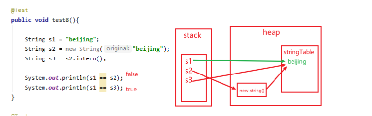

## 5.1 intern的使用
**JDK6 vs JDK7/8**

面试题1：

```java
package com.atguigu.java2;

/**
 * 题目：
 * new String("ab")会创建几个对象？看字节码，就知道是两个。
 *     一个对象是：new关键字在堆空间创建的
 *     另一个对象是：字符串常量池中的对象"ab"。 字节码指令：ldc
 *
 *
 * 思考：
 * new String("a") + new String("b")呢？
 *  对象1：new StringBuilder()
 *  对象2： new String("a")
 *  对象3： 常量池中的"a"
 *  对象4： new String("b")
 *  对象5： 常量池中的"b"
 *
 *  深入剖析： StringBuilder的toString():
 *      对象6 ：new String("ab")
 *       强调一下，toString()的调用，在字符串常量池中，没有生成"ab"
 *
 * @author shkstart  shkstart@126.com
 * @create 2020  20:38
 */
public class StringNewTest {
    public static void main(String[] args) {
        String str = new String("ab");

        String str2 = new String("a") + new String("b");
    }
}

```

举例2：

```java
package com.atguigu.java2;

import org.junit.Test;

/**
 * 如何保证变量s指向的是字符串常量池中的数据呢？
 * 有两种方式：
 * 方式一： String s = "shkstart";//字面量定义的方式
 * 方式二： 调用intern()
 *         String s = new String("shkstart").intern();
 *         String s = new StringBuilder("shkstart").toString().intern();
 *
 * @author shkstart  shkstart@126.com
 * @create 2020  18:49
 */
public class StringIntern {
    public static void main(String[] args) {

        String s = new String("1");
        s.intern();//调用此方法之前，字符串常量池中已经存在了"1"
        String s2 = "1";
        System.out.println(s == s2);//jdk6：false   jdk7/8：false
    	//此时s指的是new String的地址，s2指的是常量池中的地址

        String s3 = new String("1") + new String("1");//s3变量记录的地址为：new String("11")
        //执行完上一行代码以后，字符串常量池中，是否存在"11"呢？答案：不存在！！
        s3.intern();//在字符串常量池中生成"11"。如何理解：jdk6:创建了一个新的对象"11",也就有新的地址。
                                            //         jdk7:此时常量中并没有创建"11",而是创建一个指向堆空间中new String("11")的地址

        //在jdk6的时候，执行这个步骤的时候，此时常量池里没有11，所以将值复制一份，放在永久代里的常量池中，并返回常量池的地址。
        //下一行s4 在执行的时候，由于常量池里已经有了11，所以直接返回的是常量池里的地址，这与在堆中的s3并不相等，所以是false

        //在jdk7之后，执行这个步骤的时候，此时常量池里没有11，则将s3的引用复制一份，放在堆中的常量池中，并返回的是s3的地址
        //下一行s4在执行的时候，由于常量池里已经有了11，所以直接返回的是常量池里的地址，此时的值正好是上个步骤里将s3引用放进去的值，所以s3和s4相等。
        String s4 = "11";//s4变量记录的地址：使用的是上一行代码代码执行时，在常量池中生成的"11"的地址
        System.out.println(s3 == s4);//jdk6：false  jdk7/8：true
    }


}

```

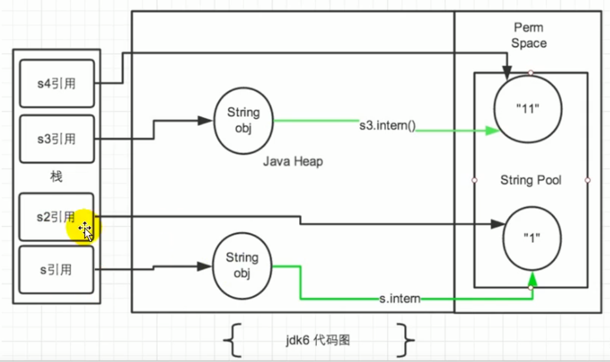

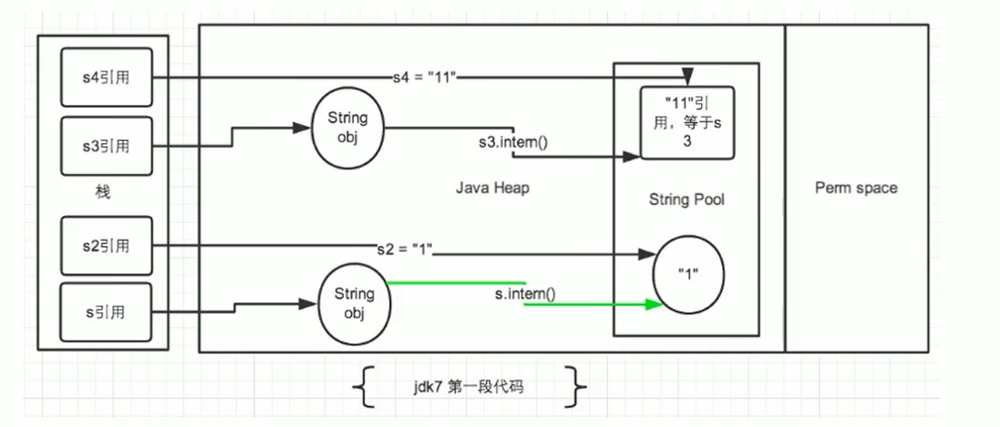

再看如下一段代码：

```java
package com.atguigu.java2;

/**
 * @author shkstart  shkstart@126.com
 * @create 2020  22:10
 */
public class StringIntern1 {
    public static void main(String[] args) {
        //StringIntern.java中练习的拓展：
        String s3 = new String("1") + new String("1");//new String("11")  
        //执行完上一行代码以后，字符串常量池中，是否存在"11"呢？答案：不存在！！
        String s4 = "11";//在字符串常量池中生成对象"11"
        String s5 = s3.intern(); //尝试将s3中的11放入常量池里，此时常量池里已经有11了，是s4时候放的，则此时返回的地址是s4的，赋给s5。所以s4和s5是同一个地址。
        System.out.println(s3 == s4);//false
        System.out.println(s5 == s4);//true
    }
    
}
```

总结 String 的 intern()的使用：

JDK1.6 中，将这个字符串对象尝试放入串池。

+ 如果串池中有，则并不会放入。返回已有的串池中的对象的地址
+ 如果没有，会把此**对象复制一份**，放入串池，并返回串池中的对象地址

JDK1.7 起，将这个字符串对象尝试放入串池。

+ 如果串池中有，则并不会放入。返回已有的串池中的对象的地址
+ 如果没有，则会把**对象的引用地址**复制一份，放入串池，并返回串池中的引用地址

**练习 1**

```java
package com.atguigu.java2;

/**
 * @author shkstart  shkstart@126.com
 * @create 2020  20:17
 */
public class StringExer1 {
    public static void main(String[] args) {
        String s = new String("a") + new String("b");//new String("ab")
        //在上一行代码执行完以后，字符串常量池中并没有"ab"

        String s2 = s.intern();//jdk6中：在串池中创建一个字符串"ab"
                               //jdk8中：串池中没有创建字符串"ab",而是创建一个引用，指向new String("ab")，将此引用返回

        System.out.println(s2 == "ab");//jdk6:true  jdk8:true
        System.out.println(s == "ab");//jdk6:false  jdk8:true
    }
}

```

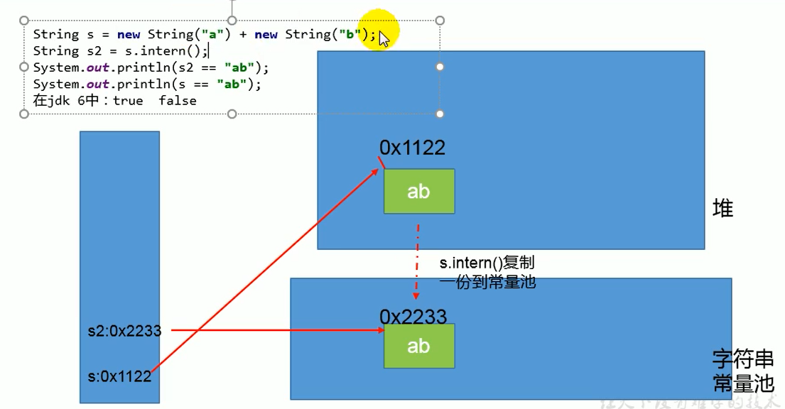

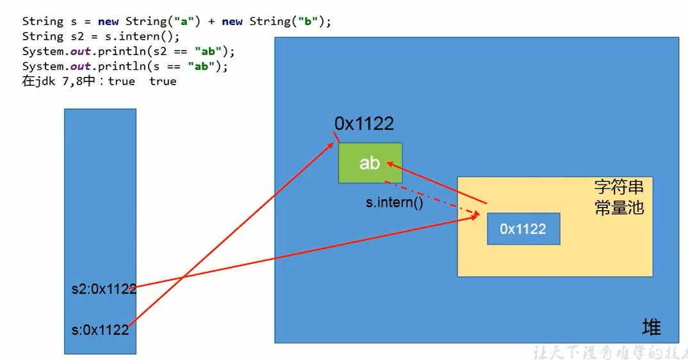

**练习 2**

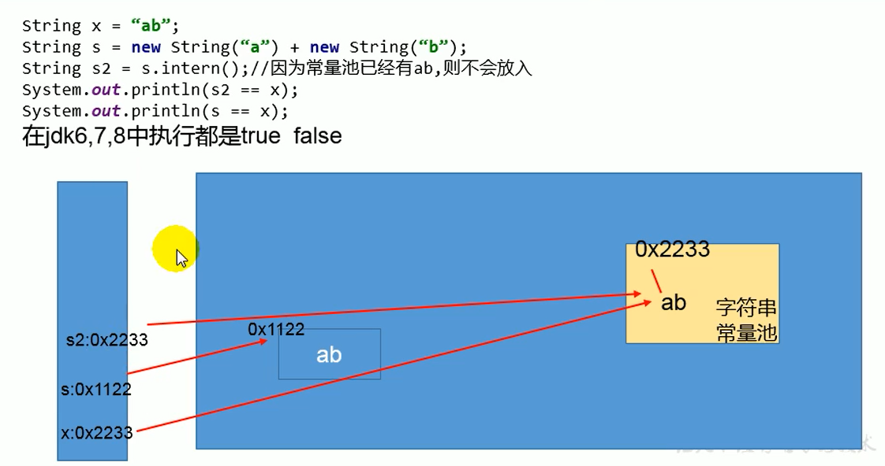

## 5.2 intern的效率测试
从空间角度来考虑

我们通过测试一下，使用了 intern 和不使用的时候，其实相差还挺多的

```java
package com.atguigu.java2;

import java.util.Random;

/**
 * 使用intern()测试执行效率：空间使用上
 *
 * 结论：对于程序中大量存在存在的字符串，尤其其中存在很多重复字符串时，使用intern()可以节省内存空间。
 *
 *
 * @author shkstart  shkstart@126.com
 * @create 2020  21:17
 */
public class StringIntern2 {
    static final int MAX_COUNT = 1000 * 10000;
    static final String[] arr = new String[MAX_COUNT];

    public static void main(String[] args) {
        Integer[] data = new Integer[]{1,2,3,4,5,6,7,8,9,10};

        long start = System.currentTimeMillis();
        for (int i = 0; i < MAX_COUNT; i++) {
//            arr[i] = new String(String.valueOf(data[i % data.length]));
            arr[i] = new String(String.valueOf(data[i % data.length])).intern();

        }
        long end = System.currentTimeMillis();
        System.out.println("花费的时间为：" + (end - start));

        try {
            Thread.sleep(1000000);
        } catch (InterruptedException e) {
            e.printStackTrace();
        }
        System.gc();
    }
}

```

**结论**：对于程序中大量使用存在的字符串时，尤其存在很多已经重复的字符串时，使用 intern()方法能够节省内存空间。

大的网站平台，需要内存中存储大量的字符串。比如社交网站，很多人都存储：北京市、海淀区等信息。这时候如果字符串都调用 intern()方法，就会很明显降低内存的大小。

# 6 StringTable的垃圾回收
```java
package com.atguigu.java3;

/**
 * String的垃圾回收:
 * -Xms15m -Xmx15m -XX:+PrintStringTableStatistics -XX:+PrintGCDetails
 *
 * @author shkstart  shkstart@126.com
 * @create 2020  21:27
 */
public class StringGCTest {
    public static void main(String[] args) {
        for (int j = 0; j < 100000; j++) {
            String.valueOf(j).intern();
        }
    }
}

```

运行结果

```java
[GC (Allocation Failure) [PSYoungGen: 4096K->488K(4608K)] 4096K->848K(15872K), 0.0024927 secs] [Times: user=0.00 sys=0.00, real=0.00 secs] 
Heap
 PSYoungGen      total 4608K, used 3971K [0x00000000ffb00000, 0x0000000100000000, 0x0000000100000000)
  eden space 4096K, 85% used [0x00000000ffb00000,0x00000000ffe66fa8,0x00000000fff00000)
  from space 512K, 95% used [0x00000000fff00000,0x00000000fff7a020,0x00000000fff80000)
  to   space 512K, 0% used [0x00000000fff80000,0x00000000fff80000,0x0000000100000000)
 ParOldGen       total 11264K, used 360K [0x00000000ff000000, 0x00000000ffb00000, 0x00000000ffb00000)
  object space 11264K, 3% used [0x00000000ff000000,0x00000000ff05a000,0x00000000ffb00000)
 Metaspace       used 3345K, capacity 4496K, committed 4864K, reserved 1056768K
  class space    used 361K, capacity 388K, committed 512K, reserved 1048576K
SymbolTable statistics:
Number of buckets       :     20011 =    160088 bytes, avg   8.000
Number of entries       :     13677 =    328248 bytes, avg  24.000
Number of literals      :     13677 =    578592 bytes, avg  42.304
Total footprint         :           =   1066928 bytes
Average bucket size     :     0.683
Variance of bucket size :     0.684
Std. dev. of bucket size:     0.827
Maximum bucket size     :         6
StringTable statistics:
Number of buckets       :     60013 =    480104 bytes, avg   8.000
Number of entries       :     64901 =   1557624 bytes, avg  24.000
Number of literals      :     64901 =   3692496 bytes, avg  56.894
Total footprint         :           =   5730224 bytes
Average bucket size     :     1.081
Variance of bucket size :     0.836
Std. dev. of bucket size:     0.914
Maximum bucket size     :         5
```

# 7 G1 中的 String 去重操作
官网地址：[JEP 192: String Deduplication in G1 (java.net)](http://openjdk.java.net/jeps/192)

> ## Motivation
> Many large-scale Java applications are currently bottlenecked on memory. Measurements have shown that roughly 25% of the Java heap live data set in these types of applications is consumed by `String` objects. Further, roughly half of those `String` objects are duplicates, where duplicates means `string1.equals(string2)` is true. Having duplicate `String` objects on the heap is, essentially, just a waste of memory. This project will implement automatic and continuous `String` deduplication in the G1 garbage collector to avoid wasting memory and reduce the memory footprint.
>

目前，许多大规模的 Java 应用程序在内存上遇到了瓶颈。测量表明，在这些类型的应用程序中，大约 25%的 Java 堆实时数据集被`String'对象所消耗。此外，这些 "String "对象中大约有一半是重复的，其中重复意味着 "string1.equals(string2) "是真的。在堆上有重复的`String'对象，从本质上讲，只是一种内存的浪费。这个项目将在 G1 垃圾收集器中实现自动和持续的`String'重复数据删除，以避免浪费内存，减少内存占用。


注意这里说的重复，指的是在堆中的数据，而不是常量池中的，因为常量池中的本身就不会重复

背景：对许多 Java 应用（有大的也有小的）做的测试得出以下结果：

+ 堆存活数据集合里面 string 对象占了 25%
+ 堆存活数据集合里面重复的 string 对象有 13.5%
+ string 对象的平均长度是 45


许多大规模的 Java 应用的瓶颈在于内存，测试表明，在这些类型的应用里面，Java 堆中存活的数据集合差不多 25%是 String 对象。更进一步，这里面差不多一半 string 对象是重复的，重复的意思是说： `stringl.equals(string2)= true`。堆上存在重复的 String 对象必然是一种内存的浪费。这个项目将在 G1 垃圾收集器中实现自动持续对重复的 string 对象进行去重，这样就能避免浪费内存。

**实现**

1. 当垃圾收集器工作的时候，会访问堆上存活的对象。对每一个访问的对象都会检查是否是候选的要去重的 String 对象
2. 如果是，把这个对象的一个引用插入到队列中等待后续的处理。一个去重的线程在后台运行，处理这个队列。处理队列的一个元素意味着从队列删除这个元素，然后尝试去重它引用的 string 对象。
3. 使用一个 hashtable 来记录所有的被 String 对象使用的不重复的 char 数组。当去重的时候，会查这个 hashtable，来看堆上是否已经存在一个一模一样的 char 数组。
4. 如果存在，String 对象会被调整引用那个数组，释放对原来的数组的引用，最终会被垃圾收集器回收掉。
5. 如果查找失败，char 数组会被插入到 hashtable，这样以后的时候就可以共享这个数组了。

**命令行选项**

```shell
# 2. 开启String去重，默认是不开启的，需要手动开启。 
UseStringDeduplication(bool)  

# 3. 打印详细的去重统计信息 
PrintStringDeduplicationStatistics(bool)  

# 4. 达到这个年龄的String对象被认为是去重的候选对象
StringpeDuplicationAgeThreshold(uintx)
```

