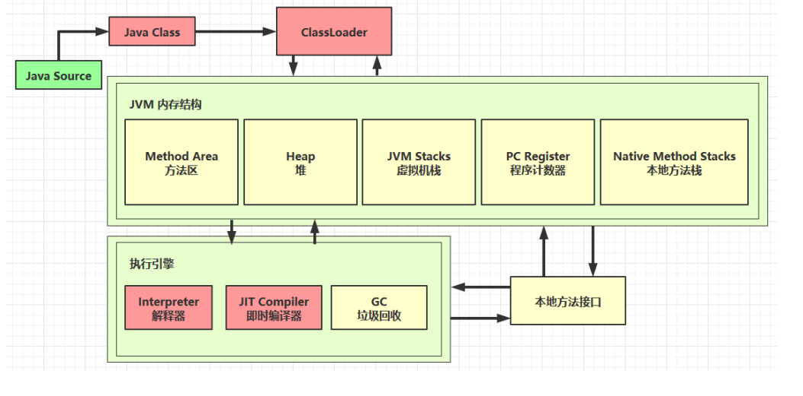

架构图

[0_引言.pdf](https://www.yuque.com/attachments/yuque/0/2022/pdf/22334924/1666704560982-a53dc68b-2c07-40e2-85fa-83a31e7de4f9.pdf)[1_内存结构.pdf](https://www.yuque.com/attachments/yuque/0/2022/pdf/22334924/1666704561032-8083d5a0-dc29-4447-9be1-cd589822d1b2.pdf)[2_垃圾回收.pdf](https://www.yuque.com/attachments/yuque/0/2022/pdf/22334924/1666704560969-26ba1416-bc3a-4cff-88f7-375ed303cf66.pdf)[3_类加载与字节码技术.pdf](https://www.yuque.com/attachments/yuque/0/2022/pdf/22334924/1666704560987-ffd9a6ae-7813-4add-a707-8b5b5ef13f9c.pdf)[4_内存模型.pdf](https://www.yuque.com/attachments/yuque/0/2022/pdf/22334924/1666704561009-a237bd7a-85d0-4adf-aac4-b26e573631c6.pdf)  


<font style="color:rgb(51,51,51);">一个简单的 HelloWorld.java</font>

```java
package cn.itcast.jvm.t5;
// HelloWorld 示例
public class HelloWorld {
	public static void main(String[] args) {
		System.out.println("hello world");
	}
}
```

<font style="color:rgb(51,51,51);">执行</font>`<font style="color:rgb(51,51,51);">javac -parameters -d . HellowWorld.java</font>`

<font style="color:rgb(51,51,51);">编译为 HelloWorld.class 后是这个样子的：</font>

```properties
0000000 ca fe ba be 00 00 00 34 00 23 0a 00 06 00 15 09 
0000020 00 16 00 17 08 00 18 0a 00 19 00 1a 07 00 1b 07 
0000040 00 1c 01 00 06 3c 69 6e 69 74 3e 01 00 03 28 29 
0000060 56 01 00 04 43 6f 64 65 01 00 0f 4c 69 6e 65 4e 
0000100 75 6d 62 65 72 54 61 62 6c 65 01 00 12 4c 6f 63 
0000120 61 6c 56 61 72 69 61 62 6c 65 54 61 62 6c 65 01 
0000140 00 04 74 68 69 73 01 00 1d 4c 63 6e 2f 69 74 63 
0000160 61 73 74 2f 6a 76 6d 2f 74 35 2f 48 65 6c 6c 6f 
0000200 57 6f 72 6c 64 3b 01 00 04 6d 61 69 6e 01 00 16 
0000220 28 5b 4c 6a 61 76 61 2f 6c 61 6e 67 2f 53 74 72 
0000240 69 6e 67 3b 29 56 01 00 04 61 72 67 73 01 00 13 
0000260 5b 4c 6a 61 76 61 2f 6c 61 6e 67 2f 53 74 72 69 
0000300 6e 67 3b 01 00 10 4d 65 74 68 6f 64 50 61 72 61 
0000320 6d 65 74 65 72 73 01 00 0a 53 6f 75 72 63 65 46 
0000340 69 6c 65 01 00 0f 48 65 6c 6c 6f 57 6f 72 6c 64
0000360 2e 6a 61 76 61 0c 00 07 00 08 07 00 1d 0c 00 1e 
0000400 00 1f 01 00 0b 68 65 6c 6c 6f 20 77 6f 72 6c 64 
0000420 07 00 20 0c 00 21 00 22 01 00 1b 63 6e 2f 69 74 
0000440 63 61 73 74 2f 6a 76 6d 2f 74 35 2f 48 65 6c 6c 
0000460 6f 57 6f 72 6c 64 01 00 10 6a 61 76 61 2f 6c 61 
0000500 6e 67 2f 4f 62 6a 65 63 74 01 00 10 6a 61 76 61 
0000520 2f 6c 61 6e 67 2f 53 79 73 74 65 6d 01 00 03 6f 
0000540 75 74 01 00 15 4c 6a 61 76 61 2f 69 6f 2f 50 72 
0000560 69 6e 74 53 74 72 65 61 6d 3b 01 00 13 6a 61 76 
0000600 61 2f 69 6f 2f 50 72 69 6e 74 53 74 72 65 61 6d 
0000620 01 00 07 70 72 69 6e 74 6c 6e 01 00 15 28 4c 6a 
0000640 61 76 61 2f 6c 61 6e 67 2f 53 74 72 69 6e 67 3b 
0000660 29 56 00 21 00 05 00 06 00 00 00 00 00 02 00 01 
0000700 00 07 00 08 00 01 00 09 00 00 00 2f 00 01 00 01 
0000720 00 00 00 05 2a b7 00 01 b1 00 00 00 02 00 0a 00 
0000740 00 00 06 00 01 00 00 00 04 00 0b 00 00 00 0c 00 
0000760 01 00 00 00 05 00 0c 00 0d 00 00 00 09 00 0e 00 
0001000 0f 00 02 00 09 00 00 00 37 00 02 00 01 00 00 00 
0001020 09 b2 00 02 12 03 b6 00 04 b1 00 00 00 02 00 0a 
0001040 00 00 00 0a 00 02 00 00 00 06 00 08 00 07 00 0b 
0001060 00 00 00 0c 00 01 00 00 00 09 00 10 00 11 00 00 
0001100 00 12 00 00 00 05 01 00 10 00 00 00 01 00 13 00 
0001120 00 00 02 00 14
```


根据 JVM 规范，类文件结构如下

```plain
ClassFile {
	u4 magic;
	u2 minor_version;
	u2 major_version;
	u2 constant_pool_count;
	cp_info constant_pool[constant_pool_count-1];
	u2 access_flags;
	u2 this_class;
	u2 super_class;
	u2 interfaces_count;
	u2 interfaces[interfaces_count];
	u2 fields_count;
	field_info fields[fields_count];
	u2 methods_count;
	method_info methods[methods_count];
	u2 attributes_count;
	attribute_info attributes[attributes_count];
}
```


# 1 魔数
u4 magic  
0～3字节，表示它是否是【class】类型的文件  
0000000 `<font style="color:#E8323C;">ca fe ba be</font>` 00 00 00 34 00 23 0a 00 06 00 15 09


# 2 版本
u2 minor_version;  
u2 major_version;

4～7字节，表示类的版本，00 34（52），34是16进制的，换成10进制就是52，表示java8，51就是java7，53就是jdk9等。  
0000000 ca fe ba be `<font style="color:#E8323C;">00 00 00 34</font>` 00 23 0a 00 06 00 15 09  


# 3 常量池
| **<font style="color:rgb(51,51,51);">Constant Type </font>** | **<font style="color:rgb(51,51,51);">Value </font>** |
| --- | --- |
| <font style="color:rgb(51,51,51);">CONSTANT_Class </font> | <font style="color:rgb(51,51,51);">7 </font> |
| <font style="color:rgb(51,51,51);">CONSTANT_Fieldref </font> | <font style="color:rgb(51,51,51);">9 </font> |
| <font style="color:rgb(51,51,51);">CONSTANT_Methodref </font> | <font style="color:rgb(51,51,51);">10 </font> |
| <font style="color:rgb(51,51,51);">CONSTANT_InterfaceMethodref</font> | <font style="color:rgb(51,51,51);">11 </font> |
| <font style="color:rgb(51,51,51);">CONSTANT_String </font> | <font style="color:rgb(51,51,51);">8 </font> |
| <font style="color:rgb(51,51,51);">CONSTANT_Integer </font> | <font style="color:rgb(51,51,51);">3 </font> |
| <font style="color:rgb(51,51,51);">CONSTANT_Float </font> | <font style="color:rgb(51,51,51);">4 </font> |
| <font style="color:rgb(51,51,51);">CONSTANT_Long </font> | <font style="color:rgb(51,51,51);">5 </font> |
| <font style="color:rgb(51,51,51);">CONSTANT_Double </font> | <font style="color:rgb(51,51,51);">6 </font> |
| <font style="color:rgb(51,51,51);">CONSTANT_NameAndType </font> | <font style="color:rgb(51,51,51);">12 </font> |
| <font style="color:rgb(51,51,51);">CONSTANT_Utf8 </font> | <font style="color:rgb(51,51,51);">1 </font> |
| <font style="color:rgb(51,51,51);">CONSTANT_MethodHandle </font> | <font style="color:rgb(51,51,51);">15 </font> |
| <font style="color:rgb(51,51,51);">CONSTANT_MethodType </font> | <font style="color:rgb(51,51,51);">16 </font> |
| <font style="color:rgb(51,51,51);">CONSTANT_InvokeDynamic </font> | <font style="color:rgb(51,51,51);">18</font> |


<font style="color:rgb(51,51,51);">8~9 </font><font style="color:rgb(51,51,51);">字节，表示常量池长度，</font><font style="color:rgb(51,51,51);">00 23 </font><font style="color:rgb(51,51,51);">（</font><font style="color:rgb(51,51,51);">35</font><font style="color:rgb(51,51,51);">） 表示常量池有</font><font style="color:rgb(51,51,51);"> #1~#34</font><font style="color:rgb(51,51,51);">项，注意</font><font style="color:rgb(51,51,51);"> #0 </font><font style="color:rgb(51,51,51);">项不计入，也没有值 </font>

<font style="color:rgb(51,51,51);">0000000 ca fe ba be 00 00 00 34 </font>`<font style="color:rgb(255,0,0);">00 23</font>`<font style="color:rgb(51,51,51);"> 0a 00 06 00 15 09 </font>

<font style="color:rgb(51,51,51);"></font>

**<font style="color:rgb(51,51,51);">第#1项</font>**<font style="color:rgb(51,51,51);"> 0a 表示一个 Method 信息，00 06 和 00 15（21） 表示它引用了常量池中 #6 和 #21 项来获得这个方法的【所属类】和【方法名】 </font>

<font style="color:rgb(51,51,51);">0000000 ca fe ba be 00 00 00 34 00 23 </font>`<font style="color:rgb(255,0,0);">0a 00 06 00 15</font>`<font style="color:rgb(51,51,51);"> 09 </font>

<font style="color:rgb(51,51,51);"></font>

**<font style="color:rgb(51,51,51);">第#2项</font>**<font style="color:rgb(51,51,51);"> 09 表示一个 Field 信息，00 16（22）和 00 17（23） 表示它引用了常量池中 #22 和 # 23 项来获得这个成员变量的【所属类】和【成员变量名】 </font>

<font style="color:rgb(51,51,51);">0000000 ca fe ba be 00 00 00 34 00 23 0a 00 06 00 15 </font><font style="color:rgb(255,0,0);">09 </font>

<font style="color:rgb(51,51,51);">0000020 </font><font style="color:rgb(255,0,0);">00 16 00 17</font><font style="color:rgb(51,51,51);"> 08 00 18 0a 00 19 00 1a 07 00 1b 07 </font>

<font style="color:rgb(51,51,51);"></font>

**<font style="color:rgb(51,51,51);">第#3项</font>**<font style="color:rgb(51,51,51);"> 08 表示一个字符串常量名称，00 18（24）表示它引用了常量池中 #24 项 </font>

<font style="color:rgb(51,51,51);">0000020 00 16 00 17 </font><font style="color:rgb(255,0,0);">08 00 18</font><font style="color:rgb(51,51,51);"> 0a 00 19 00 1a 07 00 1b 07</font>

<font style="color:rgb(51,51,51);"></font>

**<font style="color:rgb(51,51,51);">第#4项</font>**<font style="color:rgb(51,51,51);"> 0a 表示一个 Method 信息，00 19（25） 和 00 1a（26） 表示它引用了常量池中 #25 和 #26 项来获得这个方法的【所属类】和【方法名】 </font>

<font style="color:rgb(51,51,51);">0000020 00 16 00 17 08 00 18 </font><font style="color:rgb(255,0,0);">0a 00 19 00 1a</font><font style="color:rgb(51,51,51);"> 07 00 1b 07</font>

<font style="color:rgb(51,51,51);"></font>

**<font style="color:rgb(51,51,51);">第#5项</font>**<font style="color:rgb(51,51,51);"> 07 表示一个 Class 信息，00 1b（27） 表示它引用了常量池中 #27 项 </font>

<font style="color:rgb(51,51,51);">0000020 00 16 00 17 08 00 18 0a 00 19 00 1a </font><font style="color:rgb(255,0,0);">07 00 1b</font><font style="color:rgb(51,51,51);"> 07 </font>

<font style="color:rgb(51,51,51);"></font>

**<font style="color:rgb(51,51,51);">第#6项</font>**<font style="color:rgb(51,51,51);"> 07 表示一个 Class 信息，00 1c（28） 表示它引用了常量池中 #28 项 </font>

<font style="color:rgb(51,51,51);">0000020 00 16 00 17 08 00 18 0a 00 19 00 1a 07 00 1b </font><font style="color:rgb(255,0,0);">07 </font>

<font style="color:rgb(51,51,51);">0000040 </font><font style="color:rgb(255,0,0);">00 1c</font><font style="color:rgb(51,51,51);"> 01 00 06 3c 69 6e 69 74 3e 01 00 03 28 29 </font>

<font style="color:rgb(51,51,51);"></font>

**<font style="color:rgb(51,51,51);">第#7项</font>**<font style="color:rgb(51,51,51);"> 01 表示一个 utf8 串，00 06 表示长度，3c 69 6e 69 74 3e 是【 <init> 】 </font>

<font style="color:rgb(51,51,51);">0000040 00 1c </font><font style="color:rgb(255,0,0);">01 00 06 3c 69 6e 69 74 3e </font><font style="color:rgb(51,51,51);">01 00 03 28 29 </font>

<font style="color:rgb(51,51,51);"></font>

**<font style="color:rgb(51,51,51);">第#8项</font>**<font style="color:rgb(51,51,51);"> 01 表示一个 utf8 串，00 03 表示长度，28 29 56 是【()V】其实就是表示无参、无返回值 </font>

<font style="color:rgb(51,51,51);">0000040 00 1c 01 00 06 3c 69 6e 69 74 3e </font><font style="color:rgb(255,0,0);">01 00 03 28 29 </font>

<font style="color:rgb(51,51,51);">0000060 </font><font style="color:rgb(255,0,0);">56 </font><font style="color:rgb(51,51,51);">01 00 04 43 6f 64 65 01 00 0f 4c 69 6e 65 4e </font>

<font style="color:rgb(51,51,51);"></font>

**<font style="color:rgb(51,51,51);">第#9项</font>**<font style="color:rgb(51,51,51);"> 01 表示一个 utf8 串，00 04 表示长度，43 6f 64 65 是【Code】 </font>

<font style="color:rgb(51,51,51);">0000060 56 </font><font style="color:rgb(255,0,0);">01 00 04 43 6f 64 65</font><font style="color:rgb(51,51,51);"> 01 00 0f 4c 69 6e 65 4e </font>

<font style="color:rgb(51,51,51);"></font>

**<font style="color:rgb(51,51,51);">第#10项</font>**<font style="color:rgb(51,51,51);"> 01 表示一个 utf8 串，00 0f（15） 表示长度，4c 69 6e 65 4e 75 6d 62 65 72 54 61 62 6c 65 是【LineNumberTable】 </font>

<font style="color:rgb(51,51,51);">0000060 56 01 00 04 43 6f 64 65 </font><font style="color:rgb(255,0,0);">01 00 0f 4c 69 6e 65 4e </font>

<font style="color:rgb(51,51,51);">0000100 </font><font style="color:rgb(255,0,0);">75 6d 62 65 72 54 61 62 6c 65</font><font style="color:rgb(51,51,51);"> 01 00 12 4c 6f 63 </font>

<font style="color:rgb(51,51,51);"></font>

**<font style="color:rgb(51,51,51);">第#11项</font>**<font style="color:rgb(51,51,51);"> 01 表示一个 utf8 串，00 12（18） 表示长度，4c 6f 63 61 6c 56 61 72 69 61 62 6c 65 54 61 62 6c 65是【LocalVariableTable】 </font>

<font style="color:rgb(51,51,51);">0000100 75 6d 62 65 72 54 61 62 6c 65 </font><font style="color:rgb(255,0,0);">01 00 12 4c 6f 63 </font>

<font style="color:rgb(51,51,51);">0000120 </font><font style="color:rgb(255,0,0);">61 6c 56 61 72 69 61 62 6c 65 54 61 62 6c 65</font><font style="color:rgb(51,51,51);"> 01 </font>

<font style="color:rgb(51,51,51);"></font>

**<font style="color:rgb(51,51,51);">第#12项</font>**<font style="color:rgb(51,51,51);"> 01 表示一个 utf8 串，00 04 表示长度，74 68 69 73 是【this】</font>

<font style="color:rgb(51,51,51);">0000120 61 6c 56 61 72 69 61 62 6c 65 54 61 62 6c 65 </font><font style="color:rgb(255,0,0);">01 </font>

<font style="color:rgb(51,51,51);">0000140 </font><font style="color:rgb(255,0,0);">00 04 74 68 69 73</font><font style="color:rgb(51,51,51);"> 01 00 1d 4c 63 6e 2f 69 74 63 </font>

<font style="color:rgb(51,51,51);"></font>

**<font style="color:rgb(51,51,51);">第#13</font>**<font style="color:rgb(51,51,51);">项 01 表示一个 utf8 串，00 1d（29） 表示长度，是【Lcn/itcast/jvm/t5/HelloWorld;】 </font>

<font style="color:rgb(51,51,51);">0000140 00 04 74 68 69 73 </font><font style="color:rgb(255,0,0);">01 00 1d 4c 63 6e 2f 69 74 63 </font>

<font style="color:rgb(51,51,51);">0000160 </font><font style="color:rgb(255,0,0);">61 73 74 2f 6a 76 6d 2f 74 35 2f 48 65 6c 6c 6f</font>

<font style="color:rgb(51,51,51);">0000200 </font><font style="color:rgb(255,0,0);">57 6f 72 6c 64 3b</font><font style="color:rgb(51,51,51);"> 01 00 04 6d 61 69 6e 01 00 16 </font>

<font style="color:rgb(51,51,51);"></font>

**<font style="color:rgb(51,51,51);">第#14项</font>**<font style="color:rgb(51,51,51);"> 01 表示一个 utf8 串，00 04 表示长度，74 68 69 73 是【main】 </font>

<font style="color:rgb(51,51,51);">0000200 57 6f 72 6c 64 3b </font><font style="color:rgb(255,0,0);">01 00 04 6d 61 69 6e</font><font style="color:rgb(51,51,51);"> 01 00 16 </font>

<font style="color:rgb(51,51,51);"></font>

**<font style="color:rgb(51,51,51);">第#15项</font>**<font style="color:rgb(51,51,51);"> 01 表示一个 utf8 串，00 16（22） 表示长度，是【([Ljava/lang/String;)V】其实就是参数为字符串数组，无返回值 </font>

<font style="color:rgb(51,51,51);">0000200 57 6f 72 6c 64 3b 01 00 04 6d 61 69 6e </font><font style="color:rgb(255,0,0);">01 00 16 </font>

<font style="color:rgb(51,51,51);">0000220 </font><font style="color:rgb(255,0,0);">28 5b 4c 6a 61 76 61 2f 6c 61 6e 67 2f 53 74 72 </font>

<font style="color:rgb(51,51,51);">0000240 </font><font style="color:rgb(255,0,0);">69 6e 67 3b 29 56</font><font style="color:rgb(51,51,51);"> 01 00 04 61 72 67 73 01 00 13 </font>

<font style="color:rgb(51,51,51);"></font>

**<font style="color:rgb(51,51,51);">第#16项</font>**<font style="color:rgb(51,51,51);"> 01 表示一个 utf8 串，00 04 表示长度，是【args】 </font>

<font style="color:rgb(51,51,51);">0000240 69 6e 67 3b 29 56 </font><font style="color:rgb(255,0,0);">01 00 04 61 72 67 73</font><font style="color:rgb(51,51,51);"> 01 00 13 </font>

<font style="color:rgb(51,51,51);"></font>

**<font style="color:rgb(51,51,51);">第#17项</font>**<font style="color:rgb(51,51,51);"> 01 表示一个 utf8 串，00 13（19） 表示长度，是【[Ljava/lang/String;】 </font>

<font style="color:rgb(51,51,51);">0000240 69 6e 67 3b 29 56 01 00 04 61 72 67 73 </font><font style="color:rgb(255,0,0);">01 00 13 </font>

<font style="color:rgb(51,51,51);">0000260 </font><font style="color:rgb(255,0,0);">5b 4c 6a 61 76 61 2f 6c 61 6e 67 2f 53 74 72 69 </font>

<font style="color:rgb(51,51,51);">0000300 </font><font style="color:rgb(255,0,0);">6e 67 3b</font><font style="color:rgb(51,51,51);"> 01 00 10 4d 65 74 68 6f 64 50 61 72 61 </font>

<font style="color:rgb(51,51,51);"></font>

**<font style="color:rgb(51,51,51);">第#18项</font>**<font style="color:rgb(51,51,51);"> 01 表示一个 utf8 串，00 10（16） 表示长度，是【MethodParameters】 </font>

<font style="color:rgb(51,51,51);">0000300 6e 67 3b </font><font style="color:rgb(255,0,0);">01 00 10 4d 65 74 68 6f 64 50 61 72 61 </font>

<font style="color:rgb(51,51,51);">0000320 </font><font style="color:rgb(255,0,0);">6d 65 74 65 72 73</font><font style="color:rgb(51,51,51);"> 01 00 0a 53 6f 75 72 63 65 46 </font>

<font style="color:rgb(51,51,51);"></font>

**<font style="color:rgb(51,51,51);">第#19项</font>**<font style="color:rgb(51,51,51);"> 01 表示一个 utf8 串，00 0a（10） 表示长度，是【SourceFile】 </font>

<font style="color:rgb(51,51,51);">0000320 6d 65 74 65 72 73 </font><font style="color:rgb(255,0,0);">01 00 0a 53 6f 75 72 63 65 46 </font>

<font style="color:rgb(51,51,51);">0000340 </font><font style="color:rgb(255,0,0);">69 6c 65</font><font style="color:rgb(51,51,51);"> 01 00 0f 48 65 6c 6c 6f 57 6f 72 6c 64 </font>

<font style="color:rgb(51,51,51);"></font>

**<font style="color:rgb(51,51,51);">第#20项</font>**<font style="color:rgb(51,51,51);"> 01 表示一个 utf8 串，00 0f（15） 表示长度，是【HelloWorld.java】 </font>

<font style="color:rgb(51,51,51);">0000340 69 6c 65 </font><font style="color:rgb(255,0,0);">01 00 0f 48 65 6c 6c 6f 57 6f 72 6c 64 </font>

<font style="color:rgb(51,51,51);">0000360 </font><font style="color:rgb(255,0,0);">2e 6a 61 76 61</font><font style="color:rgb(51,51,51);"> 0c 00 07 00 08 07 00 1d 0c 00 1e </font>

<font style="color:rgb(51,51,51);"></font>

**<font style="color:rgb(51,51,51);">第#21项</font>**<font style="color:rgb(51,51,51);"> 0c 表示一个 【名+类型】，00 07 00 08 引用了常量池中 #7 #8 两项 </font>

<font style="color:rgb(51,51,51);">0000360 2e 6a 61 76 61 </font><font style="color:rgb(255,0,0);">0c 00 07 00 08</font><font style="color:rgb(51,51,51);"> 07 00 1d 0c 00 1e </font>

<font style="color:rgb(51,51,51);"></font>

**<font style="color:rgb(51,51,51);">第#22项</font>**<font style="color:rgb(51,51,51);"> 07 表示一个 Class 信息，00 1d（29） 引用了常量池中 #29 项 </font>

<font style="color:rgb(51,51,51);">0000360 2e 6a 61 76 61 0c 00 07 00 08 </font><font style="color:rgb(255,0,0);">07 00 1d</font><font style="color:rgb(51,51,51);"> 0c 00 1e</font>

<font style="color:rgb(51,51,51);"></font>

**<font style="color:rgb(51,51,51);">第#23项</font>**<font style="color:rgb(51,51,51);"> 0c 表示一个 【名+类型】，00 1e（30） 00 1f （31）引用了常量池中 #30 #31 两项 </font>

<font style="color:rgb(51,51,51);">0000360 2e 6a 61 76 61 0c 00 07 00 08 07 00 1d </font><font style="color:rgb(255,0,0);">0c 00 1e </font>

<font style="color:rgb(51,51,51);">0000400 </font><font style="color:rgb(255,0,0);">00 1f</font><font style="color:rgb(51,51,51);"> 01 00 0b 68 65 6c 6c 6f 20 77 6f 72 6c 64 </font>

<font style="color:rgb(51,51,51);"></font>

**<font style="color:rgb(51,51,51);">第#24项</font>**<font style="color:rgb(51,51,51);"> 01 表示一个 utf8 串，00 0b（11） 表示长度，是【hello world】 </font>

<font style="color:rgb(51,51,51);">0000400 00 1f </font><font style="color:rgb(255,0,0);">01 00 0b 68 65 6c 6c 6f 20 77 6f 72 6c 64 </font>

<font style="color:rgb(255,0,0);"></font>

**<font style="color:rgb(51,51,51);">第#25项</font>**<font style="color:rgb(51,51,51);"> 07 表示一个 Class 信息，00 20（32） 引用了常量池中 #32 项 </font>

<font style="color:rgb(51,51,51);">0000420 </font><font style="color:rgb(255,0,0);">07 00 20</font><font style="color:rgb(51,51,51);"> 0c 00 21 00 22 01 00 1b 63 6e 2f 69 74 </font>

<font style="color:rgb(51,51,51);"></font>

**<font style="color:rgb(51,51,51);">第#26项</font>**<font style="color:rgb(51,51,51);"> 0c 表示一个 【名+类型】，00 21（33） 00 22（34）引用了常量池中 #33 #34 两项 </font>

<font style="color:rgb(51,51,51);">0000420 07 00 20 </font><font style="color:rgb(255,0,0);">0c 00 21 00 22</font><font style="color:rgb(51,51,51);"> 01 00 1b 63 6e 2f 69 74 </font>

<font style="color:rgb(51,51,51);"></font>

**<font style="color:rgb(51,51,51);">第#27项</font>**<font style="color:rgb(51,51,51);"> 01 表示一个 utf8 串，00 1b（27） 表示长度，是【cn/itcast/jvm/t5/HelloWorld】 </font>

<font style="color:rgb(51,51,51);">0000420 07 00 20 0c 00 21 00 22 </font><font style="color:rgb(255,0,0);">01 00 1b 63 6e 2f 69 74 </font>

<font style="color:rgb(51,51,51);">0000440 </font><font style="color:rgb(255,0,0);">63 61 73 74 2f 6a 76 6d 2f 74 35 2f 48 65 6c 6c </font>

<font style="color:rgb(51,51,51);">0000460 </font><font style="color:rgb(255,0,0);">6f 57 6f 72 6c 64</font><font style="color:rgb(51,51,51);"> 01 00 10 6a 61 76 61 2f 6c 61 </font>

<font style="color:rgb(51,51,51);"></font>

**<font style="color:rgb(51,51,51);">第#28项</font>**<font style="color:rgb(51,51,51);"> 01 表示一个 utf8 串，00 10（16） 表示长度，是【java/lang/Object】 </font>

<font style="color:rgb(51,51,51);">0000460 6f 57 6f 72 6c 64 </font><font style="color:rgb(255,0,0);">01 00 10 6a 61 76 61 2f 6c 61 </font>

<font style="color:rgb(51,51,51);">0000500 </font><font style="color:rgb(255,0,0);">6e 67 2f 4f 62 6a 65 63 74</font><font style="color:rgb(51,51,51);"> 01 00 10 6a 61 76 61 </font>

<font style="color:rgb(51,51,51);"></font>

**<font style="color:rgb(51,51,51);">第#29项</font>**<font style="color:rgb(51,51,51);"> 01 表示一个 utf8 串，00 10（16） 表示长度，是【java/lang/System】 </font>

<font style="color:rgb(51,51,51);">0000500 6e 67 2f 4f 62 6a 65 63 74 </font><font style="color:rgb(255,0,0);">01 00 10 6a 61 76 61 </font>

<font style="color:rgb(51,51,51);">0000520 </font><font style="color:rgb(255,0,0);">2f 6c 61 6e 67 2f 53 79 73 74 65 6d</font><font style="color:rgb(51,51,51);"> 01 00 03 6f </font>

<font style="color:rgb(51,51,51);"></font>

**<font style="color:rgb(51,51,51);">第#30项</font>**<font style="color:rgb(51,51,51);"> 01 表示一个 utf8 串，00 03 表示长度，是【out】 </font>

<font style="color:rgb(51,51,51);">0000520 2f 6c 61 6e 67 2f 53 79 73 74 65 6d </font><font style="color:rgb(255,0,0);">01 00 03 6f </font>

<font style="color:rgb(51,51,51);">0000540 </font><font style="color:rgb(255,0,0);">75 74</font><font style="color:rgb(51,51,51);"> 01 00 15 4c 6a 61 76 61 2f 69 6f 2f 50 72 </font>

<font style="color:rgb(51,51,51);"></font>

**<font style="color:rgb(51,51,51);">第#31项</font>**<font style="color:rgb(51,51,51);"> 01 表示一个 utf8 串，00 15（21） 表示长度，是【Ljava/io/PrintStream;】 </font>

<font style="color:rgb(51,51,51);">0000540 75 74 </font><font style="color:rgb(255,0,0);">01 00 15 4c 6a 61 76 61 2f 69 6f 2f 50 72 </font>

<font style="color:rgb(51,51,51);">0000560 </font><font style="color:rgb(255,0,0);">69 6e 74 53 74 72 65 61 6d 3b</font><font style="color:rgb(51,51,51);"> 01 00 13 6a 61 76</font>

<font style="color:rgb(51,51,51);"></font>

**<font style="color:rgb(51,51,51);">第#32项</font>**<font style="color:rgb(51,51,51);"> 01 表示一个 utf8 串，00 13（19） 表示长度，是【java/io/PrintStream】 </font>

<font style="color:rgb(51,51,51);">0000560 69 6e 74 53 74 72 65 61 6d 3b </font><font style="color:rgb(255,0,0);">01 00 13 6a 61 76 </font>

<font style="color:rgb(51,51,51);">0000600 </font><font style="color:rgb(255,0,0);">61 2f 69 6f 2f 50 72 69 6e 74 53 74 72 65 61 6d </font>

<font style="color:rgb(255,0,0);"></font>

**<font style="color:rgb(51,51,51);">第#33项</font>**<font style="color:rgb(51,51,51);"> 01 表示一个 utf8 串，00 07 表示长度，是【println】 </font>

<font style="color:rgb(51,51,51);">0000620 </font><font style="color:rgb(255,0,0);">01 00 07 70 72 69 6e 74 6c 6e</font><font style="color:rgb(51,51,51);"> 01 00 15 28 4c 6a </font>

<font style="color:rgb(51,51,51);"></font>

**<font style="color:rgb(51,51,51);">第#34项</font>**<font style="color:rgb(51,51,51);"> 01 表示一个 utf8 串，00 15（21） 表示长度，是【(Ljava/lang/String;)V】 </font>

<font style="color:rgb(51,51,51);">0000620 01 00 07 70 72 69 6e 74 6c 6e </font><font style="color:rgb(255,0,0);">01 00 15 28 4c 6a </font>

<font style="color:rgb(51,51,51);">0000640 </font><font style="color:rgb(255,0,0);">61 76 61 2f 6c 61 6e 67 2f 53 74 72 69 6e 67 3b </font>

<font style="color:rgb(51,51,51);">0000660 </font><font style="color:rgb(255,0,0);">29 56</font><font style="color:rgb(51,51,51);"> 00 21 00 05 00 06 00 00 00 00 00 02 00 01</font>

<font style="color:rgb(51,51,51);"></font>

# 5. <font style="color:rgb(51,51,51);">4 访问标识与继承信息 </font>
<font style="color:rgb(51,51,51);">21 </font><font style="color:rgb(51,51,51);">表示该</font><font style="color:rgb(51,51,51);"> class </font><font style="color:rgb(51,51,51);">是一个类，公共的 </font>

<font style="color:rgb(51,51,51);">0000660 29 56 </font><font style="color:rgb(255,0,0);">00 21</font><font style="color:rgb(51,51,51);"> 00 05 00 06 00 00 00 00 00 02 00 01 </font>

<font style="color:rgb(51,51,51);">05 </font><font style="color:rgb(51,51,51);">表示根据常量池中</font><font style="color:rgb(51,51,51);"> #5 </font><font style="color:rgb(51,51,51);">找到本类全限定名 </font>

<font style="color:rgb(51,51,51);">0000660 29 56 00 21 </font><font style="color:rgb(255,0,0);">00 05</font><font style="color:rgb(51,51,51);"> 00 06 00 00 00 00 00 02 00 01 </font>

<font style="color:rgb(51,51,51);">06 </font><font style="color:rgb(51,51,51);">表示根据常量池中</font><font style="color:rgb(51,51,51);"> #6 </font><font style="color:rgb(51,51,51);">找到父类全限定名 </font>

<font style="color:rgb(51,51,51);">0000660 29 56 00 21 00 05 </font><font style="color:rgb(255,0,0);">00 06</font><font style="color:rgb(51,51,51);"> 00 00 00 00 00 02 00 01 </font>

<font style="color:rgb(51,51,51);">表示接口的数量，本类为</font><font style="color:rgb(51,51,51);"> 0 </font>

<font style="color:rgb(51,51,51);">0000660 29 56 00 21 00 05 00 06 </font><font style="color:rgb(255,0,0);">00 00</font><font style="color:rgb(51,51,51);"> 00 00 00 02 00 01</font>

| **<font style="color:rgb(51,51,51);">Flag Name </font>** | **<font style="color:rgb(51,51,51);">Value </font>** | **<font style="color:rgb(51,51,51);">Interpretation </font>** |
| --- | --- | --- |
| <font style="color:rgb(51,51,51);">ACC_PUBLIC </font> | <font style="color:rgb(51,51,51);">0x0001 </font> | <font style="color:rgb(51,51,51);">Declared public ; may be accessed from outside its package. </font> |
| <font style="color:rgb(51,51,51);">ACC_FINAL </font> | <font style="color:rgb(51,51,51);">0x0010 </font> | <font style="color:rgb(51,51,51);">Declared final ; no subclasses allowed. </font> |
| <font style="color:rgb(51,51,51);">ACC_SUPER </font> | <font style="color:rgb(51,51,51);">0x0020 </font> | <font style="color:rgb(51,51,51);">Treat superclass methods specially when invoked by the </font>_<font style="color:rgb(51,51,51);">invokespecial</font>_<font style="color:rgb(51,51,51);"> instruction. </font> |
| <font style="color:rgb(51,51,51);">ACC_INTERFACE </font> | <font style="color:rgb(51,51,51);">0x0200 </font> | <font style="color:rgb(51,51,51);">Is an interface, not a class. </font> |
| <font style="color:rgb(51,51,51);">ACC_ABSTRACT </font> | <font style="color:rgb(51,51,51);">0x0400 </font> | <font style="color:rgb(51,51,51);">Declared abstract ; must not be instantiated. </font> |
| <font style="color:rgb(51,51,51);">ACC_SYNTHETIC </font> | <font style="color:rgb(51,51,51);">0x1000 </font> | <font style="color:rgb(51,51,51);">Declared synthetic; not present in the source code. </font> |
| <font style="color:rgb(51,51,51);">ACC_ANNOTATION </font> | <font style="color:rgb(51,51,51);">0x2000 </font> | <font style="color:rgb(51,51,51);">Declared as an annotation type. </font> |
| <font style="color:rgb(51,51,51);">ACC_ENUM </font> | <font style="color:rgb(51,51,51);">0x4000 </font> | <font style="color:rgb(51,51,51);">Declared as an enum type.</font> |


# 6. <font style="color:rgb(51,51,51);">5 Field 信息 </font>
<font style="color:rgb(51,51,51);">表示成员变量数量，本类为</font><font style="color:rgb(51,51,51);"> 0 </font>

<font style="color:rgb(51,51,51);">0000660 29 56 00 21 00 05 00 06 00 00 </font><font style="color:rgb(255,0,0);">00 00</font><font style="color:rgb(51,51,51);"> 00 02 00 01</font>

| **<font style="color:rgb(51,51,51);">FieldType </font>** | **<font style="color:rgb(51,51,51);">Type </font>** | **<font style="color:rgb(51,51,51);">Interpretation </font>** |
| --- | --- | --- |
| <font style="color:rgb(51,51,51);">B </font> | <font style="color:rgb(51,51,51);">byte </font> | <font style="color:rgb(51,51,51);">signed byte </font> |
| <font style="color:rgb(51,51,51);">C </font> | <font style="color:rgb(51,51,51);">char </font> | <font style="color:rgb(51,51,51);">Unicode character code point in the Basic Multilingual Plane, encoded with UTF-16 </font> |
| <font style="color:rgb(51,51,51);">D </font> | <font style="color:rgb(51,51,51);">double </font> | <font style="color:rgb(51,51,51);">double-precision flfloating-point value </font> |
| <font style="color:rgb(51,51,51);">F </font> | <font style="color:rgb(51,51,51);">float </font> | <font style="color:rgb(51,51,51);">single-precision flfloating-point value </font> |
| <font style="color:rgb(51,51,51);">I </font> | <font style="color:rgb(51,51,51);">int </font> | <font style="color:rgb(51,51,51);">integer </font> |
| <font style="color:rgb(51,51,51);">J </font> | <font style="color:rgb(51,51,51);">long </font> | <font style="color:rgb(51,51,51);">long integer </font> |
| <font style="color:rgb(51,51,51);">L  </font>_<font style="color:rgb(51,51,51);">ClassName </font>_<font style="color:rgb(51,51,51);">; </font> | <font style="color:rgb(51,51,51);">reference </font> | <font style="color:rgb(51,51,51);">an instance of class </font>_<font style="color:rgb(51,51,51);">ClassName </font>_ |
| <font style="color:rgb(51,51,51);">S </font> | <font style="color:rgb(51,51,51);">short </font> | <font style="color:rgb(51,51,51);">signed short </font> |
| <font style="color:rgb(51,51,51);">Z </font> | <font style="color:rgb(51,51,51);">boolean </font> | <font style="color:rgb(51,51,51);">true or false </font> |
| <font style="color:rgb(51,51,51);">[ </font> | <font style="color:rgb(51,51,51);">reference </font> | <font style="color:rgb(51,51,51);">one array dimension </font> |


# 7. <font style="color:rgb(51,51,51);">6 Method 信息 </font>
<font style="color:rgb(51,51,51);">表示方法数量，本类为</font><font style="color:rgb(51,51,51);"> 2 </font>

<font style="color:rgb(51,51,51);">0000660 29 56 00 21 00 05 00 06 00 00 00 00 </font><font style="color:rgb(255,0,0);">00 02</font><font style="color:rgb(51,51,51);"> 00 01 </font>


构造方法

<font style="color:rgb(51,51,51);">0000660 29 56 00 21 00 05 00 06 00 00 00 00 00 02 </font><font style="color:rgb(255,0,0);">00 01 </font>

<font style="color:rgb(51,51,51);">0000700 </font><font style="color:rgb(0,0,255);">00 07 </font><font style="color:rgb(0,128,0);">00 08 </font><font style="color:#FFEC3D;background-color:#FFFFFF;">00 01</font><font style="color:rgb(255,255,0);"> </font><font style="color:rgb(255,0,0);">00 09 00 00 00 2f 00 01 00 01 </font>

<font style="color:rgb(51,51,51);">0000720 </font><font style="color:rgb(255,0,0);">00 00 00 05 2a b7 00 01 b1 00 00 00 02 00 0a 00 </font>

<font style="color:rgb(51,51,51);">0000740 </font><font style="color:rgb(255,0,0);">00 00 06 00 01 00 00 00 04 00 0b 00 00 00 0c 00 </font>

<font style="color:rgb(51,51,51);">0000760 </font><font style="color:rgb(255,0,0);">01 00 00 00 05 00 0c 00 0d 00 00</font><font style="color:rgb(51,51,51);"> 00 09 00 0e 00 </font>

<font style="color:rgb(51,51,51);">一个方法由 访问修饰符，名称，参数描述，方法属性数量，方法属性组成 </font>

+ <font style="color:rgb(51,51,51);">红色代表访问修饰符（本类中是 public） </font>
+ <font style="color:rgb(51,51,51);">蓝色代表引用了常量池 #07 项作为方法名称 </font>
+ <font style="color:rgb(51,51,51);">绿色代表引用了常量池 #08 项作为方法参数描述 </font>
+ <font style="color:rgb(51,51,51);">黄色代表方法属性数量，本方法是 1 </font>
+ <font style="color:rgb(51,51,51);">红色代表方法属性 </font>
    - <font style="color:rgb(51,51,51);">00 09 表示引用了常量池 #09 项，发现是【Code】属性 </font>
    - <font style="color:rgb(51,51,51);">00 00 00 2f 表示此属性的长度是 47 </font>
    - <font style="color:rgb(51,51,51);">00 01 表示【操作数栈】最大深度 </font>
    - <font style="color:rgb(51,51,51);">00 01 表示【局部变量表】最大槽（slot）数</font>
    - <font style="color:rgb(51,51,51);">00 00 00 05 表示字节码长度，本例是 5 </font>
    - <font style="color:rgb(51,51,51);">2a b7 00 01 b1 是字节码指令 </font>
    - <font style="color:rgb(51,51,51);">00 00 00 02 表示方法细节属性数量，本例是 2 </font>
    - <font style="color:rgb(51,51,51);">00 0a 表示引用了常量池 #10 项，发现是【LineNumberTable】属性 </font>
        * <font style="color:rgb(51,51,51);">00 00 00 06 表示此属性的总长度，本例是 6 </font>
        * <font style="color:rgb(51,51,51);">00 01 表示【LineNumberTable】长度 </font>
        * <font style="color:rgb(51,51,51);">00 00 表示【字节码】行号 00 04 表示【java 源码】行号 </font>
    - <font style="color:rgb(51,51,51);">00 0b 表示引用了常量池 #11 项，发现是【LocalVariableTable】属性 </font>
        * <font style="color:rgb(51,51,51);">00 00 00 0c 表示此属性的总长度，本例是 12 </font>
        * <font style="color:rgb(51,51,51);">00 01 表示【LocalVariableTable】长度 </font><font style="color:rgb(51,51,51);background-color:#FFFFFF;"></font>
        * <font style="color:rgb(51,51,51);">00 00 表示局部变量生命周期开始，相对于字节码的偏移量 </font>
        * <font style="color:rgb(51,51,51);">00 05 表示局部变量覆盖的范围长度 </font>
        * <font style="color:rgb(51,51,51);">00 0c 表示局部变量名称，本例引用了常量池 #12 项，是【this】 </font>
        * <font style="color:rgb(51,51,51);">00 0d 表示局部变量的类型，本例引用了常量池 #13 项，是【Lcn/itcast/jvm/t5/HelloWorld;】 </font>
        * <font style="color:rgb(51,51,51);">00 00 表示局部变量占有的槽位（slot）编号，本例是 0 </font>


Main方法

<font style="color:rgb(51,51,51);">0000760 01 00 00 00 05 00 0c 00 0d 00 00 </font><font style="color:rgb(255,0,0);">00 09 </font><font style="color:rgb(0,0,255);">00 0e </font><font style="color:rgb(0,128,0);">00 </font>

<font style="color:rgb(51,51,51);">0001000 </font><font style="color:rgb(0,128,0);">0f </font><font style="color:rgb(255,255,0);">00 02 </font><font style="color:rgb(255,0,0);">00 09 00 00 00 37 00 02 00 01 00 00 00 </font>

<font style="color:rgb(51,51,51);">0001020 </font><font style="color:rgb(255,0,0);">09 b2 00 02 12 03 b6 00 04 b1 00 00 00 02 00 0a </font>

<font style="color:rgb(51,51,51);">0001040 </font><font style="color:rgb(255,0,0);">00 00 00 0a 00 02 00 00 00 06 00 08 00 07 00 0b </font>

<font style="color:rgb(51,51,51);">0001060 </font><font style="color:rgb(255,0,0);">00 00 00 0c 00 01 00 00 00 09 00 10 00 11 00 00 </font>

+ <font style="color:rgb(51,51,51);">红色代表访问修饰符（本类中是 public static） </font>
+ <font style="color:rgb(51,51,51);">蓝色代表引用了常量池 #14 项作为方法名称 </font>
+ <font style="color:rgb(51,51,51);">绿色代表引用了常量池 #15 项作为方法参数描述 </font>
+ <font style="color:rgb(51,51,51);">黄色代表方法属性数量，本方法是 2 </font>
+ <font style="color:rgb(51,51,51);">红色代表方法属性（属性1） </font>
    - <font style="color:rgb(51,51,51);">00 09 表示引用了常量池 #09 项，发现是【Code】属性 </font>
    - <font style="color:rgb(51,51,51);">00 00 00 37 表示此属性的长度是 55 </font>
    - <font style="color:rgb(51,51,51);">00 02 表示【操作数栈】最大深度 </font>
    - <font style="color:rgb(51,51,51);">00 01 表示【局部变量表】最大槽（slot）数 </font>
    - <font style="color:rgb(51,51,51);">00 00 00 05 表示字节码长度，本例是 9 </font>
    - <font style="color:rgb(51,51,51);">b2 00 02 12 03 b6 00 04 b1 是字节码指令 </font>
    - <font style="color:rgb(51,51,51);">00 00 00 02 表示方法细节属性数量，本例是 2 </font>
    - <font style="color:rgb(51,51,51);">00 0a 表示引用了常量池 #10 项，发现是【LineNumberTable】属性 </font>
        * <font style="color:rgb(51,51,51);">00 00 00 0a 表示此属性的总长度，本例是 10 </font>
        * <font style="color:rgb(51,51,51);">00 02 表示【LineNumberTable】长度 </font>
        * <font style="color:rgb(51,51,51);">00 00 表示【字节码】行号 00 06 表示【java 源码】行号 </font>
        * <font style="color:rgb(51,51,51);">00 08 表示【字节码】行号 00 07 表示【java 源码】行号 </font>
    - <font style="color:rgb(51,51,51);">00 0b 表示引用了常量池 #11 项，发现是【LocalVariableTable】属性 </font>
        * <font style="color:rgb(51,51,51);">00 00 00 0c 表示此属性的总长度，本例是 12 </font>
        * <font style="color:rgb(51,51,51);">00 01 表示【LocalVariableTable】长度</font>
        * <font style="color:rgb(51,51,51);">00 00 表示局部变量生命周期开始，相对于字节码的偏移量 </font>
        * <font style="color:rgb(51,51,51);">00 09 表示局部变量覆盖的范围长度 </font>
        * <font style="color:rgb(51,51,51);">00 10 表示局部变量名称，本例引用了常量池 #16 项，是【args】 </font>
        * <font style="color:rgb(51,51,51);">00 11 表示局部变量的类型，本例引用了常量池 #17 项，是【[Ljava/lang/String;】 </font>
        * <font style="color:rgb(51,51,51);">00 00 表示局部变量占有的槽位（slot）编号，本例是 0 </font>


<font style="color:rgb(51,51,51);">红色代表方法属性（属性</font><font style="color:rgb(51,51,51);">2</font><font style="color:rgb(51,51,51);">） </font>

+ <font style="color:rgb(51,51,51);">00 12 表示引用了常量池 #18 项，发现是【MethodParameters】属性 </font>
    - <font style="color:rgb(51,51,51);">00 00 00 05 表示此属性的总长度，本例是 5 </font>
    - <font style="color:rgb(51,51,51);">01 参数数量 </font>
    - <font style="color:rgb(51,51,51);">00 10 表示引用了常量池 #16 项，是【args】 </font>
    - <font style="color:rgb(51,51,51);">00 00 访问修饰符 </font>

<font style="color:rgb(51,51,51);">0001100 </font><font style="color:rgb(255,0,0);">00 12 00 00 00 05 01 00 10 00 00</font><font style="color:rgb(51,51,51);"> 00 01 00 13 00 </font>

<font style="color:rgb(51,51,51);">0001120 00 00 02 00 14 </font>

<font style="color:rgb(51,51,51);"></font>

# 8. <font style="color:rgb(51,51,51);">7 附加属性 </font>
+ <font style="color:rgb(51,51,51);">00 01 表示附加属性数量 </font>
+ <font style="color:rgb(51,51,51);">00 13 表示引用了常量池 #19 项，即【SourceFile】 </font>
+ <font style="color:rgb(51,51,51);">00 00 00 02 表示此属性的长度 </font>
+ <font style="color:rgb(51,51,51);">00 14 表示引用了常量池 #20 项，即【HelloWorld.java】 </font>

<font style="color:rgb(51,51,51);">0001100 00 12 00 00 00 05 01 00 10 00 00 </font><font style="color:rgb(255,0,0);">00 01 00 13 00 </font>

<font style="color:rgb(51,51,51);">0001120 </font><font style="color:rgb(255,0,0);">00 00 02 00 14 </font>

<font style="color:rgb(51,51,51);">参考文献 </font>

[https://docs.oracle.com/javase/specs/jvms/se8/html/jvms-4.html](https://docs.oracle.com/javase/specs/jvms/se8/html/jvms-4.html)

