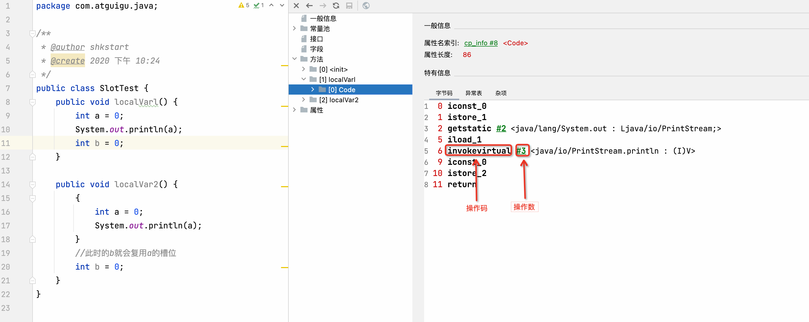

笔记来源：[尚硅谷JVM全套教程，百万播放，全网巅峰（宋红康详解java虚拟机）](https://www.bilibili.com/video/BV1PJ411n7xZ)


# 1 概述
+ Java字节码对于虚拟机，就好像汇编语言对于计算机，属于基本执行指令。
+ Java虚拟机的指令由 **一个字节长度的**、代表着某种特定操作含义的数字（称为操作码，Opcode）以及跟随其后的零至多个代表此操作所需参数（称为操作数，Operands）而构成。由于Java虚拟机采用面向操作数栈而不是面向寄存器的结构，所以大多数的指令都不包含操作数，只有一个操作码
+ 由于限制了Java虚拟机操作码的长度为一个字节（即0~255），这意味着指令集的操作码总数不可能超过256条
+ 官方文档： [https://docs.oracle.com/javase/specs/jvms/se8/html/jvms-6.html](https://docs.oracle.com/javase/specs/jvms/se8/html/jvms-6.html)
+ 熟悉虚拟机的指令对于动态字节码生成、反编译 Class 文件、 Class 文件修补都有着非常重要的价值。因此，阅读字节码作为了解 Java 虚拟机的基础技能，需要熟练掌握常见指令



## 1.1 执行模型
如果不考虑异常处理的话，那么Java虚拟机的解释器可以使用下面这个伪代码当做最基本的执行模型来理解

```java
do{
    自动计算PC寄存器的值加1;
    根据PC寄存器的指示位置，从字节码流中取出操作码;
    if(字节码存在操作数) 从字节码流中取出操作数;
    执行操作码所定义的操作;
}while(字节码长度>0)；
```


## 1.2 字节码与数据类型
在Java虚拟机的指令集中，大多数的指令都包含了其操作所对应的数据类型信息。例如，`iload`指令用于从局部变量表中加载`int`型的数据到操作数栈中，而`fload`指令加载的则是`float`类型的数据。

对于大部分与数据类型相关的字节码指令，它们的操作码助记符中都有特殊的字符来表明专门为哪种数据类型服务：

+ `i`代表对int类型的数据操作
+ `l`代表long
+ `s`代表short
+ `b`代表byte
+ `c`代表char
+ `f`代表float
+ `d`代表double


也有一些指令的助记符中没有明确地指明操作类型的字母，如`arraylength`指令，它没有代表数据类型的特殊字符，但操作数永远只能是一个数组类型的对象。


还有另外一些指令，如无条件跳转指令`goto`则是与数据类型无关的。


大部分的指令都没有支持整数类型byte、char和short，甚至没有任何指令支持boolean类型。编译器会在编译期或运行期将byte和short类型的数据带符号扩展（Sign-Extend）为相应的int类型数据，将boolean和char类型数据零位扩展（Zero-Extend）为相应的int类型数据。与之类似，在处理boolean、byte、short和char类型的数组时，也会转换为使用对应的int类型的字节码指令来处理。因此，大多数对于boolean、byte、short和char类型数据的操作，实际上都是使用相应的int类型作为运算类型。


## 1.3 指令分析


由于完全介绍和学习这些指令需要花费大量时间。为了让大家能够更快地熟悉和了解这些基本指令，这里将JVM中的字节码指令集按用途大致分成9类。

+ 加载与存储指令
+ 算术指令
+ 类型转换指令
+ 对象的创建与访问指令
+ 方法调用与返回指令
+ 操作数栈管理指令
+ 比较控制指令
+ 异常处理指令
+ 同步控制指令


（说在前面）在做值相关操作时：

+ 一个指令，可以从局部变量表、常量池、堆中对象、方法调用、系统调用中等取得数据，这些数据（可能是值，可能是对象的引用）被压入操作数栈。
+ 一个指令，也可以从操作数栈中取出一到多个值（pop多次），完成赋值、加减乘除、方法传参、系统调用等等操作。


# 2 加载与存储指令
**作用**：加载和存储指令用于将数据从栈帧的局部变量表和操作数栈之间来回传递。


**常用指令**

1. **局部变量压栈指令**将一个局部变量加载到操作数栈：`xload``xload_<n>`（其中x为i、l、f、d、a，n为0到3）
2. **常量入栈指令**将一个常量加载到操作数栈：`bipush``sipush``ldc``ldc_w``ldc2_w``aconst_null``iconst_m1``iconst_<i>``lconst_<l>``fconst_<f>``dconst_<d>`
3. **出栈装入局部变量表指令**将一个数值从操作数栈存储到局部变量表：`xstore、xstore_<n>`（其中x为i、l、f、d、a，n为0到3）；`xastore`（其中x为i、l、f、d、a、b、c、s）
4. 扩充局部变量表的访问索引的指令：`wide`。


上面所列举的指令助记符中，有一部分是以尖括号结尾的（例如iload_<n>）。这些指令助记符实际上代表了一组指令（例如iload_<n>代表了`iload_0、iload_1、iload_2`和`iload_3`这几个指令）。这几组指令都是某个带有一个操作数的通用指令（例如iload）的特殊形式，对于这若干组特殊指令来说，它们表面上没有操作数，不需要进行取操作数的动作，但操作数都隐含在指令中。


除此之外，它们的语义与原生的通用指令完全一致（例如`iload_0`的语义与操作数为0时的iload指令语义完全一致）。在尖括号之间的字母指定了指令隐含操作数的数据类型，<n>代表非负的整数，<i>代表是int类型数据，<l>代表long类型，<f>代表float类型，<d>代表double类型。


操作byte、char、short和boolean类型数据时，经常用int类型的指令来表示。


## 2.1 再谈操作数栈与局部变量表


**操作数栈（Operand Stacks）**

我们知道，Java字节码是Java虚拟机所使用的指令集。因此，它与Java虚拟机基于栈的计算模型是密不可分的。在解释执行过程中，每当为Java方法分配栈桢时，Java虚拟机往往需要开辟一块额外的空间作为操作数栈，来存放计算的操作数以及返回结果。


具体来说便是：执行每一条指令之前，Java虚拟机要求该指令的操作数已被压入操作数栈中。在执行指令时，Java虚拟机会将该指令所需的操作数弹出，并且将指令的结果重新压入栈中。

