# 1 什么是JVM
## 1.1 定义
Java Virtual Machine，JAVA程序的运行环境（JAVA二进制字节码的运行环境）

## 1.2 好处
+ 一次编写，到处运行
+ 自动内存管理，垃圾回收机制
+ 数组下标越界检查


**比较**：JVM JRE JDK的区别  
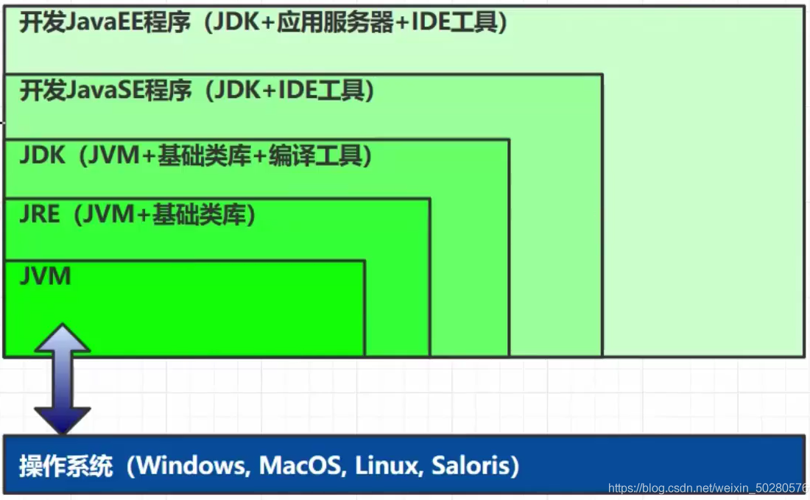


**学习 JVM 有什么用**？

> 面试必备  
中高级程序员必备  
想走的长远，就需要懂原理，比如：自动装箱、自动拆箱是怎么实现的，反射是怎么实现的，垃圾回收机制是怎么回事等等，JVM 是必须掌握的。
>


**常见的 JVM**  
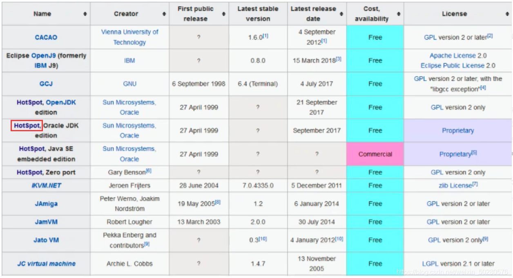  
我们主要学习的是 HotSpot 版本的虚拟机。


**JVM整体架构**  
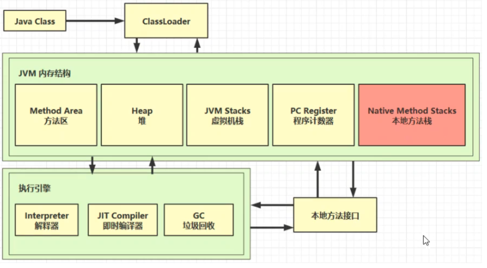


# 2 内存结构
## 2.1 程序计数器
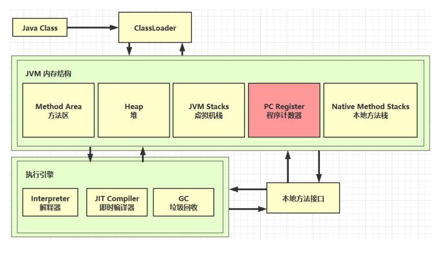

Program Counter Register 程序计数器（寄存器）

### 2.1.1 作用
+ 解释器会解释指令为机器码交给 cpu 执行，程序计数器会记录下一条指令的地址行号，这样下一次解释器会从程序计数器拿到指令然后进行解释执行。
+ 多线程的环境下，如果两个线程发生了上下文切换，那么程序计数器会记录线程下一行指令的地址行号，以便于接着往下执行

### 2.1.2 特点
+ 线程私有 
    - CPU会为每个线程分配时间片，当前线程的时间片使用完以后，CPU就会去执行另一个线程中的代码。
    - 程序计数器是`<font style="color:#E8323C;">每个线程所私有的</font>`，当另一个线程的时间片用完，又返回来执行当前线程的代码时，通过程序计数器可以知道应该执行哪一句指令。
+ 不会存在内存溢出

## 2.2 虚拟机栈
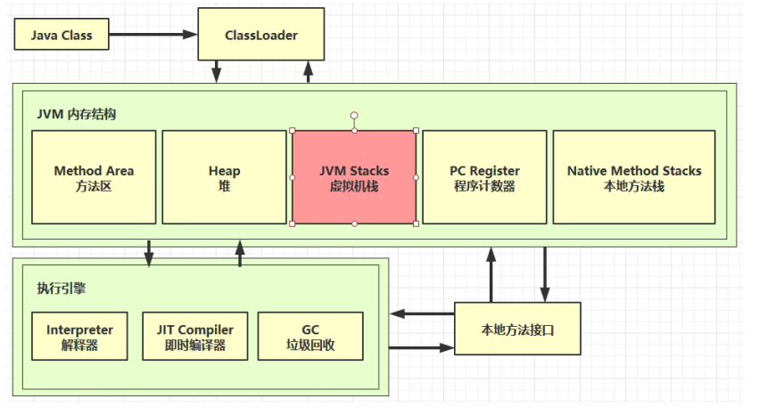

### 2.2.1 定义
+ 每个线程运行需要的内存空间，称为虚拟机栈
+ 每个栈由多个栈帧组成，对应着每次调用方法时所占用的内存
+ 每个线程只能有一个活动栈帧，对应着当前正在执行的方法

代码演示

```java
package com.ali.jvm;
public class Test {

    public static void main(String[] args) {
        method1();
    }
    private static void method1() {
        method2(1, 2);
    }
    private static int method2(int a, int b) {
        int c = a + b;
        return c;
    }
}
```


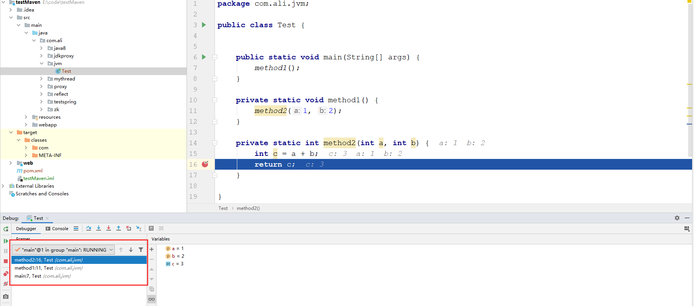  
在控制台中可以看到，主类中的方法在进入虚拟机栈的时候，符合栈的特点，每一个方法都是一个栈帧，最先进入的方法是main方法，所以main方法对应的栈帧压在最下面，最后进的方法是method2，所以method2对应的栈帧在最上面

### 2.2.2 问题辨析


**垃圾回收是否涉及栈内存？** 

不需要。因为虚拟机栈中是由一个个栈帧组成的，在方法执行完毕后，对应的栈帧就会被弹出栈。所以无需通过垃圾回收机制去回收内存。

 

**栈内存的分配越大越好吗？** 

不是。因为物理内存是一定的，栈内存越大，可以支持更多的递归调用，但是可执行的线程数就会越少。

 

**方法内的局部变量是否是线程安全的？** 

如果方法内局部变量没有逃离方法的作用范围，则是线程安全的  
如果如果局部变量引用了对象，并逃离了方法的作用范围，则需要考虑线程安全问题

 


### 2.2.3 栈内存溢出
Java.lang.stackOverflowError 栈内存溢出

发生原因

+ 虚拟机栈中，`<font style="color:#EB2F96;">栈帧过多（无限递归）</font>`
+ 每个`<font style="color:#EB2F96;">栈帧所占用过大</font>`


代码演示1：

```java
package cn.itcast.jvm.t1.stack;

/**
* 演示栈内存溢出 java.lang.StackOverflowError
* -Xss256k
*/
public class Demo1_2 {
    private static int count;

    public static void main(String[] args) {
        try {
            method1();
        } catch (Throwable e) {
            e.printStackTrace();
            System.out.println(count);
        }
    }
    private static void method1() {
        count++;
        method1();
    }
}
```

图上所示就是无限递归，当调用了一万八千多次之后，出现栈内存溢出  
  
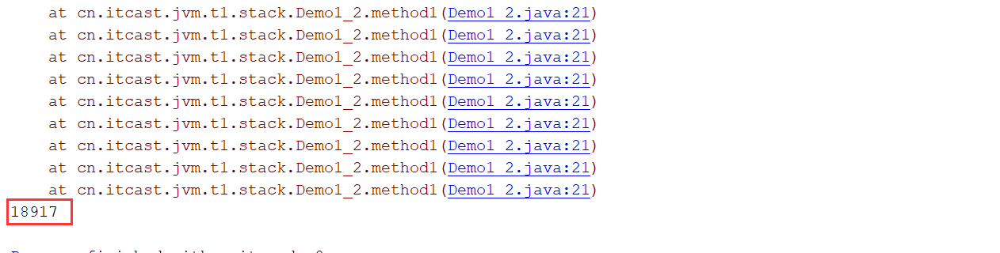


代码演示二：

```java
package cn.itcast.jvm.t1.stack;

import com.fasterxml.jackson.annotation.JsonIgnore;
import com.fasterxml.jackson.core.JsonProcessingException;
import com.fasterxml.jackson.databind.ObjectMapper;

import java.util.Arrays;
import java.util.List;

/**
* json 数据转换
*/
public class Demo1_19 {

    public static void main(String[] args) throws JsonProcessingException {
        Dept d = new Dept();
        d.setName("Market");

        Emp e1 = new Emp();
        e1.setName("zhang");
        e1.setDept(d);

        Emp e2 = new Emp();
        e2.setName("li");
        e2.setDept(d);

        d.setEmps(Arrays.asList(e1, e2));

        // { name: 'Market', emps: [{ name:'zhang', dept:{ name:'', emps: [ {}]} },] }
        ObjectMapper mapper = new ObjectMapper();
        System.out.println(mapper.writeValueAsString(d));
    }
}

class Emp {
    private String name;
    //    @JsonIgnore
    private Dept dept;

    public String getName() {
        return name;
    }

    public void setName(String name) {
        this.name = name;
    }

    public Dept getDept() {
        return dept;
    }

    public void setDept(Dept dept) {
        this.dept = dept;
    }
}
class Dept {
    private String name;
    private List<Emp> emps;

    public String getName() {
        return name;
    }

    public void setName(String name) {
        this.name = name;
    }

    public List<Emp> getEmps() {
        return emps;
    }

    public void setEmps(List<Emp> emps) {
        this.emps = emps;
    }
}
```


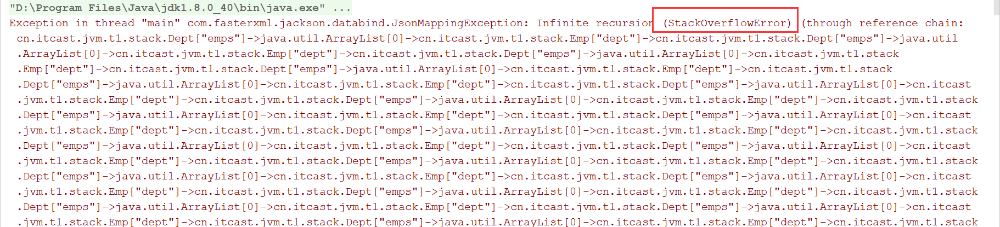


### 2.2.4 线程运行诊断


`**<font style="color:#EB2F96;">案例一</font>**`：CPU占用过高  
`解决方法`：Linux 环境下运行某些程序的时候，可能导致 CPU 的占用过高，这时需要定位占用 CPU 过高的线程

> 1. `<font style="color:#E8323C;">top</font>` 命令，查看是哪个进程占用 CPU 过高
> 2. `<font style="color:#E8323C;">ps H -eo pid,tid,%cpu | grep 进程id</font>`
>     1. tid是线程id的意思
>     2. 进程id是刚才通过 top 查到的进程号
>     3. 通过 ps 命令进一步查看是哪个线程占用 CPU 过高
> 3. `<font style="color:#E8323C;">jstack 进程id</font>` 
>     1. 通过查看进程中的线程id ，刚才通过 ps 命令看到的 tid 来对比定位，注意 jstack 查找出的线程 id 是 16 进制的，需要转换。
>


代码演示：

```java
package cn.itcast.jvm.t1.stack;

/**
* 演示 cpu 占用过高
*/
public class Demo1_16 {

    public static void main(String[] args) {
        new Thread(null, () -> {
            System.out.println("1...");
            while(true) {

            }
        }, "thread1").start();


        new Thread(null, () -> {
            System.out.println("2...");
            try {
                Thread.sleep(1000000L);
            } catch (InterruptedException e) {
                e.printStackTrace();
            }
        }, "thread2").start();

        new Thread(null, () -> {
            System.out.println("3...");
            try {
                Thread.sleep(1000000L);
            } catch (InterruptedException e) {
                e.printStackTrace();
            }
        }, "thread3").start();
    }
}
```

先用`javac`命令编译Demo1_16.java文件，然后在项目根目录下执行`nohup java cn.itcast.jvm.t1.stack.Demo1_16 &`命令，再用`top`命令查看  


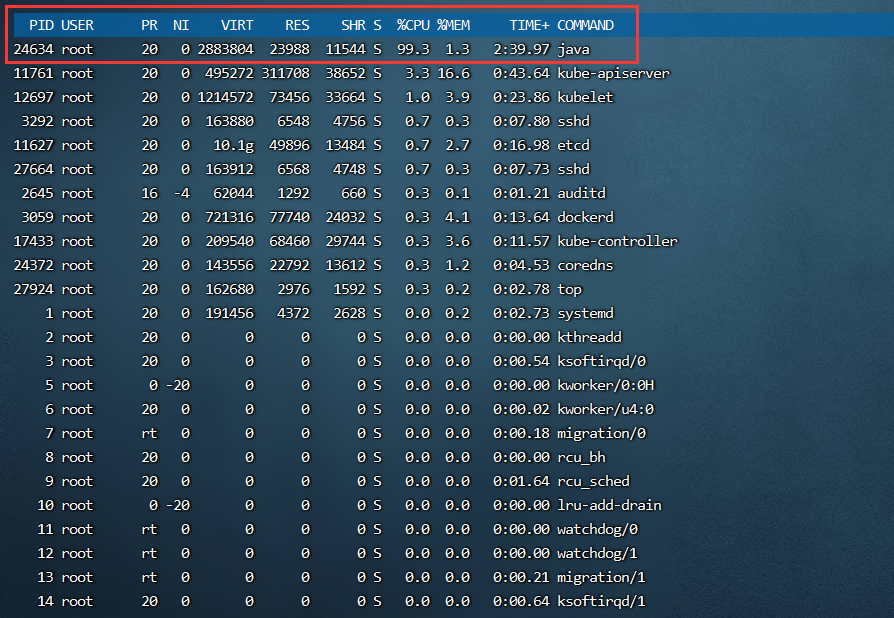  
再用`ps H -eo pid,tid,%cpu | grep 24634`命令，得到是线程`24662`的cpu占用率为98.9%  
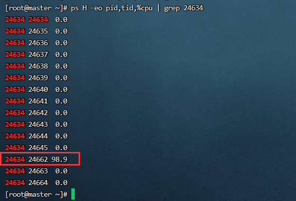  
再用命令`jstack 24634` 得到如下图：

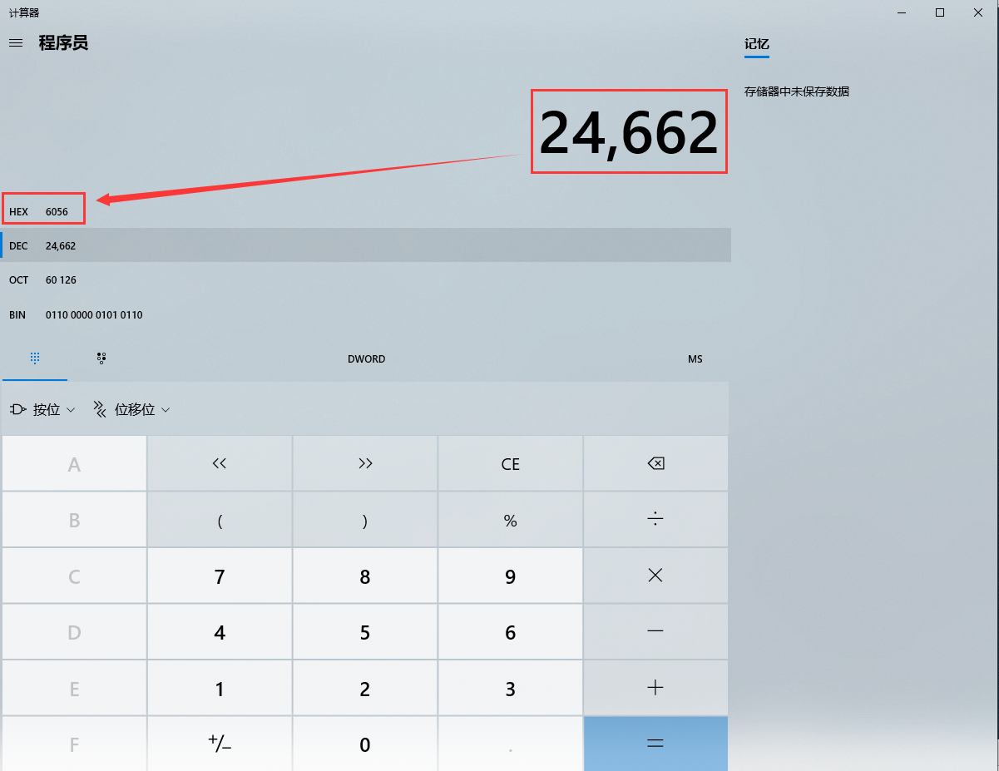


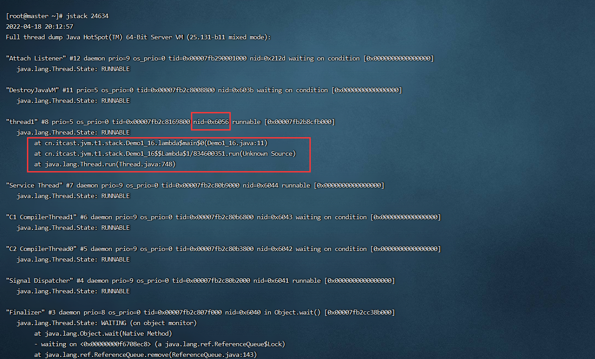


## 2.3 本地方法栈
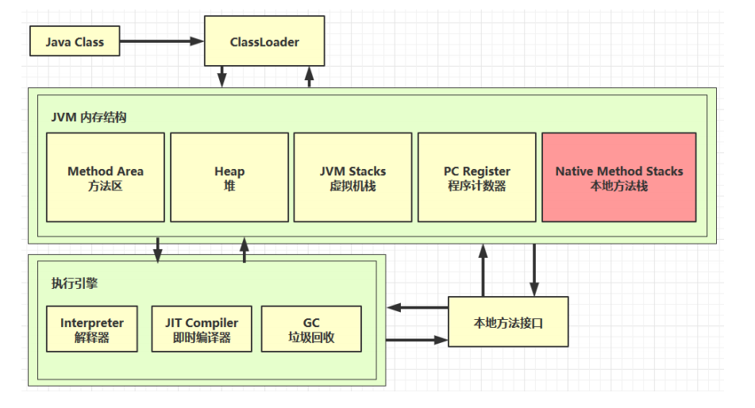

一些带有`**native关键字**`的方法就是需要JAVA去调用本地的C或者C++方法，因为JAVA有时候没法直接和操作系统底层交互，所以需要用到本地方法  
例如：Object类中由很多这样的方法  
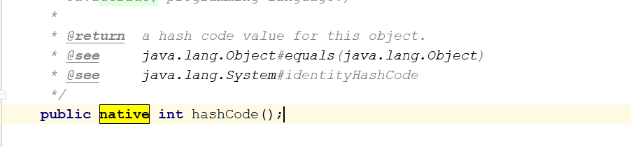


## 2.4 堆
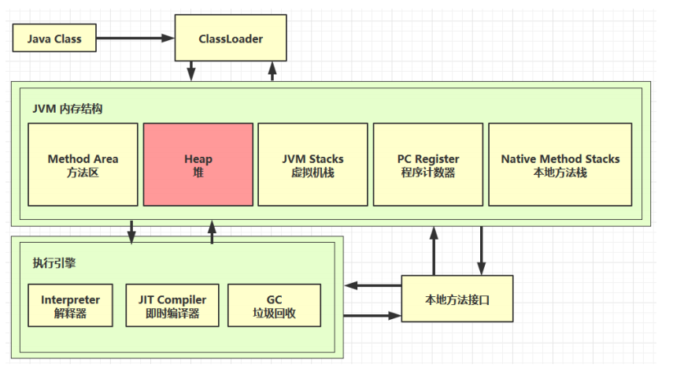

**定义**：通过new关键字创建的对象都会被放在堆内存  
**特点**：

+ 所有线程共享，堆内存中的对象都需要考虑线程安全问题
+ 有垃圾回收机制


**堆内存溢出**  
代码演示：

```java
package cn.itcast.jvm.t1.heap;

import java.util.ArrayList;
import java.util.List;

/**
* 演示堆内存溢出 java.lang.OutOfMemoryError: Java heap space
* -Xmx8m
*/
public class Demo1_5 {

    public static void main(String[] args) {
        int i = 0;
        try {
            List<String> list = new ArrayList<>();
            String a = "hello";
            while (true) {
                list.add(a); // hello, hellohello, hellohellohellohello ...
                a = a + a;  // hellohellohellohello
                i++;
            }
        } catch (Throwable e) {
            e.printStackTrace();
            System.out.println(i);
        }
    }
}
```


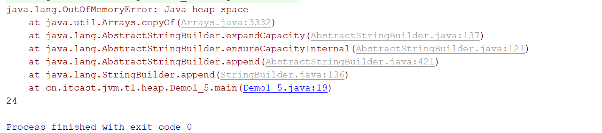  


**堆内存诊断的几种工具**

+ jps工具：查看当前系统中由哪些java进程
+ jmap工具：查看堆内存占用情况
+ jconsole工具：图形界面的，多功能的检测工具，可以连续监测
+ jvisualvm 工具


## 2.5 方法区
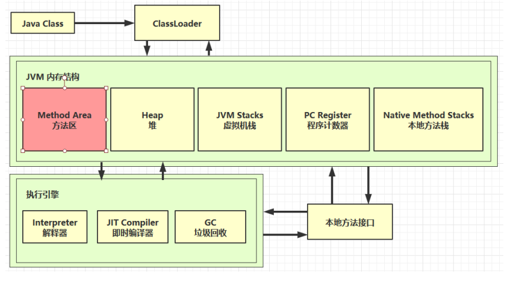

### 2.5.1 定义
Java 虚拟机有一个在所有 Java 虚拟机线程之间共享的方法区域。方法区域类似于用于传统语言的编译代码的存储区域，或者类似于操作系统进程中的“文本”段。它存储每个类的结构，例如运行时常量池、字段和方法数据，以及方法和构造函数的代码，包括特殊方法，用于类和实例初始化以及接口初始化方法区域是在虚拟机启动时创建的。尽管方法区域在逻辑上是堆的一部分，但简单的实现可能不会选择垃圾收集或压缩它。此规范不强制指定方法区的位置或用于管理已编译代码的策略。方法区域可以具有固定的大小，或者可以根据计算的需要进行扩展，并且如果不需要更大的方法区域，则可以收缩。方法区域的内存不需要是连续的！

### 2.5.2 组成
Hotspot 虚拟机 jdk1.6 1.7 1.8 内存结构图  
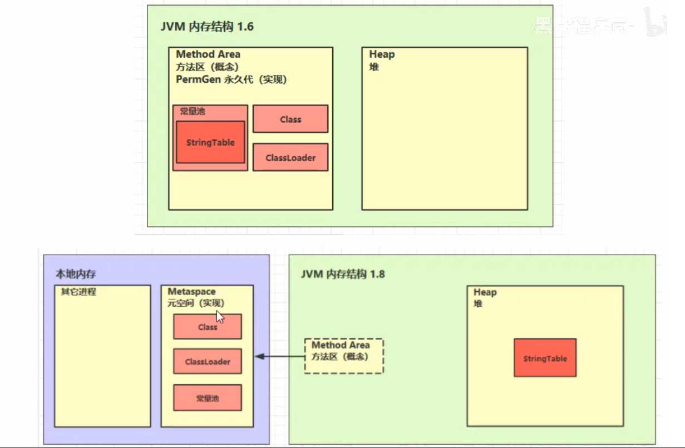


### 2.5.3 方法区内存溢出
+ 1.8 之前会导致永久代内存溢出  
使用 `<font style="color:#EB2F96;">-XX:MaxPermSize=8m</font>` 指定永久代内存大小
+ 1.8 之后会导致元空间内存溢出  
使用 `<font style="color:#EB2F96;">-XX:MaxMetaspaceSize=8m</font>`指定元空间大小


### 2.5.4 常量池
二进制字节码包含（类的基本信息，常量池，类方法定义，包含了虚拟机的指令）  
通过反编译来查看类的信息

① 获得对应类的.class文件  
输入 javac 对应类的绝对路径

```java
F:\JAVA\JDK8.0\bin>javac F:\Thread_study\src\com
yima\JVM\day01\Main.java
```

输入完成后，对应的目录下就会出现类的.class文件


② 在控制台输入 javap -v 类的绝对路径

```java
javap -v F:\Thread_study\src\com
yima\JVM\day01\Main.class
```


③ 然后能在控制台看到反编译以后类的信息了  
类的基本信息  
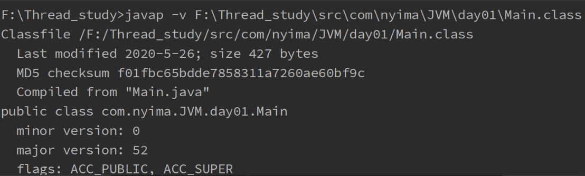  
常量池  
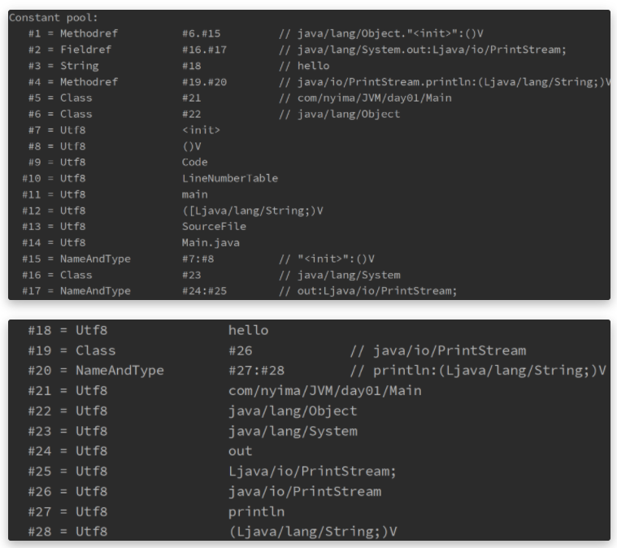  
虚拟机中执行编译的方法（框内的是真正编译执行的内容，#号的内容需要在常量池中查找）  


**<font style="color:#EB2F96;">运行时常量池</font>**

`**常量池**`：就是一张表（如上图中的constant pool），虚拟机指令根据这张常量表找到要执行的类名、方法名、参数类型、字面量信息  
`**运行时常量池**`：常量池是.class文件中的，当该**类被加载以后，它的常量池信息就会放入运行时常量池，并把里面的符号地址变为真实地址**


**<font style="color:#EB2F96;">常量池与串池的关系</font>**

串池StringTable  
特征：

+ 常量池中的字符串仅是符号，只有在被用到时才会转化为对象
+ 利用串池的机制，来避免重复创建字符串对象
+ 字符串变量拼接的原理是StringBuilder
+ 字符串常量拼接的原理是编译器优化
+ 可以使用intern方法，主动将串池中还没有的字符串对象放入串池中
+ 注意：无论是串池还是堆里面的字符串，都是对象

用来放字符串对象且里面的**元素不重复**

```java
public class StringTableStudy {
	public static void main(String[] args) {
		String a = "a"; 
		String b = "b";
		String ab = "ab";
	}
}
```


常量池中的信息，都会被加载到运行时常量池中，但这是a b ab 仅是常量池中的符号，还没有成为java字符串

```java
0: ldc           #2                  // String a
2: astore_1
3: ldc           #3                  // String b
5: astore_2
6: ldc           #4                  // String ab
8: astore_3
9: return
```


当执行到 ldc #2 时，会把符号 a 变为 “a” 字符串对象，并放入串池中（hashtable结构 不可扩容）  
当执行到 ldc #3 时，会把符号 b 变为 “b” 字符串对象，并放入串池中  
当执行到 ldc #4 时，会把符号 ab 变为 “ab” 字符串对象，并放入串池中  
最终StringTable [“a”, “b”, “ab”]

> 注意：字符串对象的创建都是懒惰的，只有当运行到那一行字符串且在串池中不存在的时候（如 ldc #2）时，该字符串才会被创建并放入串池中。
>


使用拼接字符串变量对象创建字符串的过程

```java
public class StringTableStudy {
	public static void main(String[] args) {
		String a = "a";
		String b = "b";
		String ab = "ab";
		//拼接字符串对象来创建新的字符串
		String ab2 = a+b; 
	}
}
```


反编译后的结果

```java
Code:
stack=2, locals=5, args_size=1
    0: ldc           #2                  // String a
2: astore_1
3: ldc           #3                  	// String b
5: astore_2
6: ldc           #4                  	// String ab
8: astore_3
9: new           #5                  	// class java/lang/StringBuilder
12: dup
13: invokespecial #6                  	// Method java/lang/StringBuilder."<init>":()V
16: aload_1
17: invokevirtual #7                  	// Method java/lang/StringBuilder.append:(Ljava/lang/String;)Ljava/lang/StringBuilder;
20: aload_2
21: invokevirtual #7                  	// Method java/lang/StringBuilder.append:(Ljava/lang/String;)Ljava/lang/StringBuilder;
24: invokevirtual #8                  	// Method java/lang/StringBuilder.toString:()Ljava/lang/String;
27: astore        4
29: return
```

通过拼接的方式来创建字符串的过程是：StringBuilder().append(“a”).append(“b”).toString()  
最后的toString方法的返回值是一个新的字符串，但字符串的值和拼接的字符串一致，但是两个不同的字符串，一个存在于串池之中，一个存在于堆内存之中


```java
String ab = "ab";
String ab2 = a+b;
//结果为false,因为ab是存在于串池之中，ab2是由StringBuffer的toString方法所返回的一个对象，存在于堆内存之中
System.out.println(ab == ab2);
```


使用拼接字符串常量对象的方法创建字符串

```java
public class StringTableStudy {
    public static void main(String[] args) {
        String a = "a";
        String b = "b";
        String ab = "ab";
        String ab2 = a+b;
        //使用拼接字符串的方法创建字符串
        String ab3 = "a" + "b";
    }
}
```


反编译后的结果

```java
 Code:
      stack=2, locals=6, args_size=1
         0: ldc           #2                  // String a
         2: astore_1
         3: ldc           #3                  // String b
         5: astore_2
         6: ldc           #4                  // String ab
         8: astore_3
         9: new           #5                  // class java/lang/StringBuilder
        12: dup
        13: invokespecial #6                  // Method java/lang/StringBuilder."<init>":()V
        16: aload_1
        17: invokevirtual #7                  // Method java/lang/StringBuilder.append:(Ljava/lang/String;)Ljava/lang/StringBuilder;
        20: aload_2
        21: invokevirtual #7                  // Method java/lang/StringBuilder.append:(Ljava/lang/String;)Ljava/lang/StringBuilder;
        24: invokevirtual #8                  // Method java/lang/StringBuilder.toString:()Ljava/lang/String;
        27: astore        4
        //ab3初始化时直接从串池中获取字符串
        29: ldc           #4                  // String ab
        31: astore        5
        33: return
```

+ 使用拼接字符串常量的方法来创建新的字符串时，因为内容是常量，javac在编译期会进行优化，结果已在编译期确定为ab，而创建ab的时候已经在串池中放入了“ab”，所以ab3直接从串池中获取值，所以进行的操作和 ab = “ab” 一致。
+ 使用拼接字符串变量的方法来创建新的字符串时，因为内容是变量，只能在运行期确定它的值，所以需要使用StringBuilder来创建


#### intern方法 1.8


调用字符串对象的intern方法，会将该字符串对象尝试放入到串池中


+ 如果串池中没有该字符串对象，则放入成功
+ 如果有该字符串对象，则放入失败  
无论放入是否成功，都会返回串池中的字符串对象


> 注意：此时如果调用intern方法成功，堆内存与串池中的字符串对象是同一个对象；如果失败，则不是同一个对象
>


例1

```java
public class Main {
    public static void main(String[] args) {
        //"a" "b" 被放入串池中，str则存在于堆内存之中
        String str = new String("a") + new String("b");
        //调用str的intern方法，这时串池中没有"ab"，则会将该字符串对象放入到串池中，此时堆内存与串池中的"ab"是同一个对象
        String st2 = str.intern();
        //给str3赋值，因为此时串池中已有"ab"，则直接将串池中的内容返回
        String str3 = "ab";
        //因为堆内存与串池中的"ab"是同一个对象，所以以下两条语句打印的都为true
        System.out.println(str == st2);
        System.out.println(str == str3);
    }
}
```


例2

```java
public class Main {
    public static void main(String[] args) {
        //此处创建字符串对象"ab"，因为串池中还没有"ab"，所以将其放入串池中
        String str3 = "ab";
        //"a" "b" 被放入串池中，str则存在于堆内存之中
        String str = new String("a") + new String("b");
        //此时因为在创建str3时，"ab"已存在与串池中，所以放入失败，但是会返回串池中的"ab"
        String str2 = str.intern();
        //false
        System.out.println(str == str2);
        //false
        System.out.println(str == str3);
        //true
        System.out.println(str2 == str3);
    }
}
```


#### intern方法 1.6


调用字符串对象的intern方法，会将该字符串对象尝试放入到串池中


+ 如果串池中没有该字符串对象，会将该字符串对象复制一份，再放入到串池中
+ 如果有该字符串对象，则放入失败  
无论放入是否成功，都会返回串池中的字符串对象


> 注意：此时无论调用intern方法成功与否，串池中的字符串对象和堆内存中的字符串对象都不是同一个对象
>


StringTable 垃圾回收  
StringTable在内存紧张时，会发生垃圾回收


StringTable调优  
1）因为StringTable是由HashTable实现的，所以可以适当增加HashTable桶的个数，来减少字符串放入串池所需要的时间  
`-XX:StringTableSize=xxxx`  
2）考虑是否需要将字符串对象入池  
可以通过intern方法减少重复入池


## 2.6 直接内存
+ 属于操作系统，常见于NIO操作时，用于数据缓冲区
+ 分配回收成本较高，但读写性能高
+ 不受JVM内存回收管理


文件读写流程:  
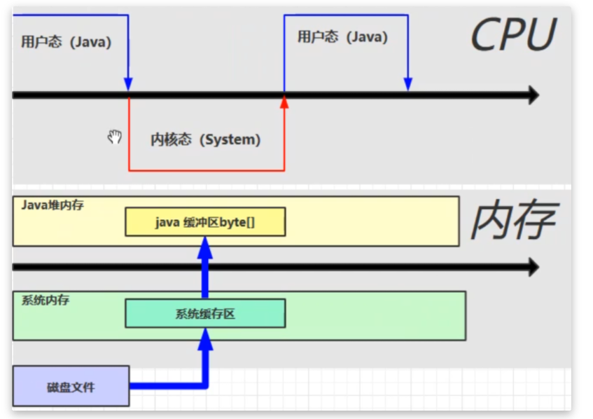  
使用了DirectBuffer:  
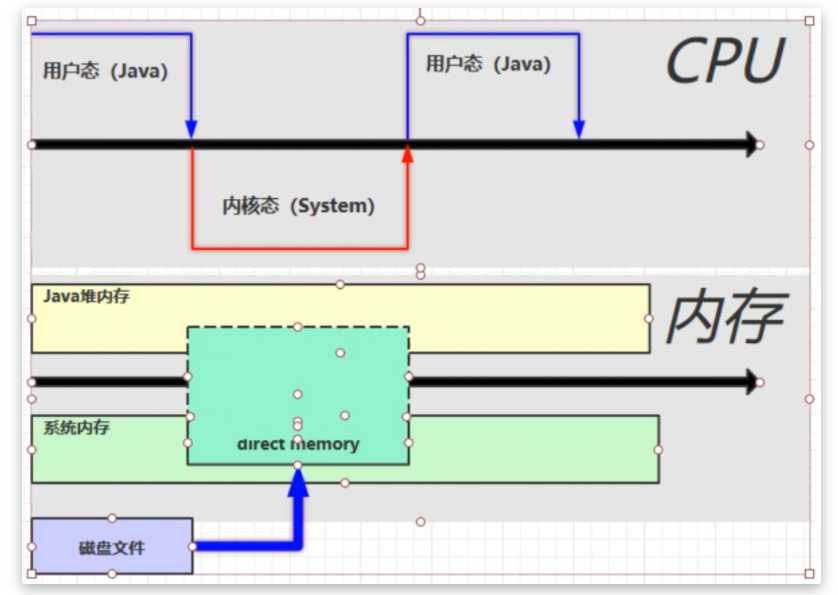  
直接内存是操作系统和Java代码都可以访问的一块区域，无需将代码从系统内存复制到Java堆内存，从而提高了效率  
释放原理  
直接内存的回收不是通过JVM的垃圾回收来释放的，而是通过unsafe.freeMemory来手动释放  
通过

```java
//通过ByteBuffer申请1M的直接内存
ByteBuffer byteBuffer = ByteBuffer.allocateDirect(_1M);
```


申请直接内存，但JVM并不能回收直接内存中的内容，它是如何实现回收的呢？  
allocateDirect的实现

```java
public static ByteBuffer allocateDirect(int capacity) {
    return new DirectByteBuffer(capacity);
}
```


DirectByteBuffer类

```java
DirectByteBuffer(int cap) {   // package-private
   
    super(-1, 0, cap, cap);
    boolean pa = VM.isDirectMemoryPageAligned();
    int ps = Bits.pageSize();
    long size = Math.max(1L, (long)cap + (pa ? ps : 0));
    Bits.reserveMemory(size, cap);

    long base = 0;
    try {
        base = unsafe.allocateMemory(size); //申请内存
    } catch (OutOfMemoryError x) {
        Bits.unreserveMemory(size, cap);
        throw x;
    }
    unsafe.setMemory(base, size, (byte) 0);
    if (pa && (base % ps != 0)) {
        // Round up to page boundary
        address = base + ps - (base & (ps - 1));
    } else {
        address = base;
    }
    cleaner = Cleaner.create(this, new Deallocator(base, size, cap)); //通过虚引用，来实现直接内存的释放，this为虚引用的实际对象
    att = null;
}
```


这里调用了一个Cleaner的create方法，且后台线程还会对虚引用的对象监测，如果虚引用的实际对象（这里是DirectByteBuffer）被回收以后，就会调用Cleaner的clean方法，来清除直接内存中占用的内存

```java
public void clean() {
       if (remove(this)) {
           try {
               this.thunk.run(); //调用run方法
           } catch (final Throwable var2) {
               AccessController.doPrivileged(new PrivilegedAction<Void>() {
                   public Void run() {
                       if (System.err != null) {
                           (new Error("Cleaner terminated abnormally", var2)).printStackTrace();
                       }

                       System.exit(1);
                       return null;
                   }
               });
           }
```


对应对象的run方法

```java
public void run() {
    if (address == 0) {
        // Paranoia
        return;
    }
    unsafe.freeMemory(address); //释放直接内存中占用的内存
    address = 0;
    Bits.unreserveMemory(size, capacity);
}
```


直接内存的回收机制总结

+ 使用了Unsafe类来完成直接内存的分配回收，回收需要主动调用freeMemory方法
+ ByteBuffer的实现内部使用了Cleaner（虚引用）来检测ByteBuffer。一旦ByteBuffer被垃圾回收，那么会由ReferenceHandler来调用Cleaner的clean方法调用freeMemory来释放内存

