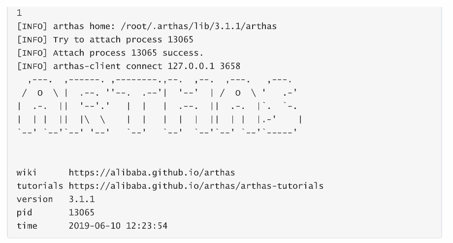

# 1 即时编译
## 1.1 分层编译（TieredCompilation）
先来个例子

```java
public class JIT1 {
    public static void main(String[] args) {
        for (int i = 0; i < 200; i++) {
            long start = System.nanoTime();
            for (int j = 0; j < 1000; j++) {
                new Object();
            }
            long end = System.nanoTime();
            System.out.printf("%d\t%d
",i,(end - start));
        }
    }
}
```

```java
0	59028
1	58233
2	45818
3	44093
4	42546
5	65791
6	43380
7	26173
8	32455
9	25052
10	24917
11	32560
12	40064
13	40577
14	42589
15	43008
16	49930
17	42601
18	36272
19	26315
20	59480
21	39777
22	40964
23	38979
24	40258
25	36950
26	43152
27	45393
28	49302
29	45288
30	43948
31	48568
32	133657
33	88518
34	46010
35	46068
36	55863
37	49931
38	44253
39	57264
40	47153
41	47659
42	45230
43	191617
44	508762
45	44888
46	41801
47	72912
48	47011
49	45289
50	53457
51	40001
52	52688
53	49616
54	60323
55	72496
56	64932
57	36613
58	60884
59	28578
60	39777
61	56570
62	63878
63	44510
64	46598
65	57416
66	42117
67	52975
68	42338
69	41716
70	38013
71	38840
72	34408
73	15416
74	18868
75	17576
76	17727
77	13684
78	56029
79	18095
80	16767
81	13834
82	26410
83	21249
84	16714
85	17256
86	19226
87	19123
88	17564
89	17319
90	18024
91	19663
92	47495
93	17634
94	23092
95	19234
96	18558
97	169143
98	18386
99	18310
100	18031
101	17705
102	24715
103	34894
104	15096
105	18130
106	17791
107	38036
108	32336
109	17193
110	18426
111	18552
112	16151
113	19484
114	17612
115	15043
116	18547
117	47226
118	15489
119	17921
120	16595
121	12711
122	17777
123	18461
124	15708
125	23101
126	18555
127	17040
128	15471
129	17037
130	17717
131	13737
132	16890
133	18867
134	17839
135	15043
136	18039
137	19149
138	41502
139	18004
140	25612
141	79004
142	49807
143	647
144	622
145	651
146	657
147	623
148	620
149	623
150	630
151	627
152	626
153	627
154	624
155	627
156	627
157	625
158	624
159	619
160	652
161	641
162	654
163	703
164	661
165	756
166	681
167	659
168	659
169	664
170	664
171	679
172	683
173	651
174	664
175	679
176	659
177	680
178	707
179	665
180	735
181	785
182	718
183	658
184	690
185	662
186	668
187	684
188	688
189	644
190	723
191	697
192	856
193	665
194	670
195	675
196	683
197	683
198	700
199	639
```

原因是什么呢？  
JVM 将执行状态分成了 5 个层次：

+ 0 层，解释执行（Interpreter）
+ 1 层，使用 C1 即时编译器编译执行（不带 profiling）
+ 2 层，使用 C1 即时编译器编译执行（带基本的 profiling）
+ 3 层，使用 C1 即时编译器编译执行（带完全的 profiling）
+ 4 层，使用 C2 即时编译器编译执行

profiling 是指在运行过程中收集一些程序执行状态的数据，例如【方法的调用次数】，【循环的回边次数】等

即时编译器（JIT）与解释器的区别

+ 解释器是将字节码解释为机器码，下次即使遇到相同的字节码，仍会执行重复的解释
+ JIT 是将一些字节码编译为机器码，并存入 Code Cache，下次遇到相同的代码，直接执行，无需再编译
+ 解释器是将字节码解释为针对所有平台都通用的机器码
+ JIT 会根据平台类型，生成平台特定的机器码

对于占据大部分的不常用的代码，我们无需耗费时间将其编译成机器码，而是采取解释执行的方式运行；另一方面，对于仅占据小部分的热点代码，我们则可以将其编译成机器码，以达到理想的运行速度。 执行效率上简单比较一下 `Interpreter < C1 < C2`，总的目标是发现热点代码（hotspot名称的由来），优化之。  
刚才的一种优化手段称之为【逃逸分析】，发现新建的对象是否逃逸。可以使用`-XX:-DoEscapeAnalysis`关闭逃逸分析，再运行刚才的示例观察结果  
参考资料：[https://docs.oracle.com/en/java/javase/12/vm/java-hotspot-virtual-machineperformance-enhancements.html#GUID-D2E3DC58-D18B-4A6C-8167-4A1DFB4888E4](https://docs.oracle.com/en/java/javase/12/vm/java-hotspot-virtual-machineperformance-enhancements.html#GUID-D2E3DC58-D18B-4A6C-8167-4A1DFB4888E4)

## 1.2 方法内联
Inlining

```java
private static int square(final int i) {
    return i * i;
}
```

```java
System.out.println(square(9));
```

如果发现 square 是热点方法，并且长度不太长时，会进行内联，所谓的内联就是把方法内代码拷贝、粘贴到调用者的位置：

```java
System.out.println(9 * 9);
```

还能够进行常量折叠（constant folding）的优化

```java
System.out.println(81);
```

实验：

```java
public class JIT2 {
    // -XX:+UnlockDiagnosticVMOptions -XX:+PrintInlining （解锁隐藏参数）打印inlining 信息
    // -XX:CompileCommand=dontinline,*JIT2.square 禁止某个方法 inlining
    // -XX:+PrintCompilation 打印编译信息
    public static void main(String[] args) {
        int x = 0;
        for (int i = 0; i < 500; i++) {
            long start = System.nanoTime();
            for (int j = 0; j < 1000; j++) {
                x = square(9);
            }
            long end = System.nanoTime();
            System.out.printf("%d\t%d\t%d
",i,x,(end - start));
        }
    }
    private static int square(final int i) {
        return i * i;
    }
}
```

##   
1.3 字段优化
JMH 基准测试请参考：[http://openjdk.java.net/projects/code-tools/jmh/](http://openjdk.java.net/projects/code-tools/jmh/)  
创建 maven 工程，添加依赖如下

```java
<dependency>
    <groupId>org.openjdk.jmh</groupId>
    jmh-core</artifactId>
    <version>${jmh.version}</version>
</dependency>
<dependency>
    <groupId>org.openjdk.jmh</groupId>
    jmh-generator-annprocess</artifactId>
    <version>${jmh.version}</version>
    <scope>provided</scope>
</dependency>
```

编写基准测试代码：

```java
package test;
import org.openjdk.jmh.annotations.*;
import org.openjdk.jmh.runner.Runner;
import org.openjdk.jmh.runner.RunnerException;
import org.openjdk.jmh.runner.options.Options;
import org.openjdk.jmh.runner.options.OptionsBuilder;
import java.util.Random;
import java.util.concurrent.ThreadLocalRandom;

@Warmup(iterations  = 2, time = 1) 
@Measurement(iterations  = 5, time = 1) 
@State(Scope.Benchmark)  
public class Benchmark1 {
    int[] elements = randomInts(1_000);
        
    private static int[] randomInts(int size) {
        Random random = ThreadLocalRandom.current();
        int[] values = new int[size];
        for (int i = 0; i < size; i++) {
            values[i] = random.nextInt();
        }
        return values;
    }
        
    @Benchmark  
    public void test1() {
        for (int i = 0; i < elements.length; i++) {
            doSum(elements[i]);
        }
    }
        
    @Benchmark  
    public void test2() {
        int[] local = this.elements;
        for (int i = 0; i < local.length; i++) {
            doSum(local[i]);
        }
    }
        
    @Benchmark  
    public void test3() {
        for (int element : elements) {
            doSum(element);
        }
    }
        
    static int sum = 0;
    
    @CompilerControl(CompilerControl.Mode.INLINE)
    static void doSum(int x) {
        sum += x;
    }
        
    public static void main(String[] args) throws RunnerException {
        Options opt = new OptionsBuilder()
            .include(Benchmark1.class.getSimpleName())
            .forks(1)
            .build();
        new Runner(opt).run();
    }
}
```

首先启用 doSum 的方法内联，测试结果如下（每秒吞吐量，分数越高的更好）：

```plain
Benchmark 						Mode 		Samples 		Score 				Score error 		Units
t.Benchmark1.test1 		thrpt 			5 		2420286.539 		390747.467 			ops/s
t.Benchmark1.test2 		thrpt 			5 		2544313.594 		91304.136 			ops/s
t.Benchmark1.test3 		thrpt 			5 		2469176.697 		450570.647 			ops/s
```

接下来禁用 doSum 方法内联

```java
@CompilerControl(CompilerControl.Mode.DONT_INLINE)
    static void doSum(int x) {
        sum += x;
}
```

测试结果如下：

```java
Benchmark 				Mode 		Samples 	Score 		Score error 	Units
t.Benchmark1.test1 		thrpt 		5 			296141.478 	63649.220 		ops/s
t.Benchmark1.test2 		thrpt 		5 			371262.351 	83890.984 		ops/s
t.Benchmark1.test3 		thrpt 		5 			368960.847 	60163.391 		ops/s
```

分析：  
在刚才的示例中，doSum 方法是否内联会影响 elements 成员变量读取的优化：  
如果 doSum 方法内联了，刚才的 test1 方法会被优化成下面的样子（伪代码）：

```java
@Benchmark  
public void test1() {
    // elements.length 首次读取会缓存起来 -> int[] local
    for (int i = 0; i < elements.length; i++) { // 后续 999 次 求长度 <- local
        sum += elements[i]; // 1000 次取下标 i 的元素 <- local
    }
}
```

可以节省 1999 次 Field 读取操作  
但如果 doSum 方法没有内联，则不会进行上面的优化  
练习：在内联情况下将 elements 添加 volatile 修饰符，观察测试结果  
  


# 2 反射优化
```java
package cn.itcast.jvm.t3.reflect;
import java.io.IOException;
import java.lang.reflect.InvocationTargetException;
import java.lang.reflect.Method;
public class Reflect1 {
    public static void foo() {
        System.out.println("foo...");
    }
    public static void main(String[] args) throws Exception {
        Method foo = Reflect1.class.getMethod("foo");
        for (int i = 0; i <= 16; i++) {
            System.out.printf("%d\t", i);
            foo.invoke(null);
        }
        System.in.read();
    }
}
```

foo.invoke 前面 0 ~ 15 次调用使用的是 MethodAccessor 的 NativeMethodAccessorImpl 实现  


```java
package sun.reflect;
import java.lang.reflect.InvocationTargetException;
import java.lang.reflect.Method;
import sun.reflect.misc.ReflectUtil;
class NativeMethodAccessorImpl extends MethodAccessorImpl {
    private final Method method;
    private DelegatingMethodAccessorImpl parent;
    private int numInvocations;
    
    NativeMethodAccessorImpl(Method method) {
        this.method = method;
    }
    
    public Object invoke(Object target, Object[] args)
    throws IllegalArgumentException, InvocationTargetException {
        // inflationThreshold 膨胀阈值，默认 15
        if (++this.numInvocations > ReflectionFactory.inflationThreshold()
            && !ReflectUtil.isVMAnonymousClass(this.method.getDeclaringClass()))
        {
            // 使用 ASM 动态生成的新实现代替本地实现，速度较本地实现快 20 倍左右
            MethodAccessorImpl generatedMethodAccessor =
                (MethodAccessorImpl)
                 (new MethodAccessorGenerator())
                 .generateMethod(
                     this.method.getDeclaringClass(),
                     this.method.getName(),
                     this.method.getParameterTypes(),
                     this.method.getReturnType(),
                     this.method.getExceptionTypes(),
                     this.method.getModifiers()
                 );
            this.parent.setDelegate(generatedMethodAccessor);
        }
        // 调用本地实现
        return invoke0(this.method, target, args);
    }
    void setParent(DelegatingMethodAccessorImpl parent) {
        this.parent = parent;
    }
    private static native Object invoke0(Method method, Object target, Object[]
                                         args);
}
```

当调用到第 16 次（从0开始算）时，会采用运行时生成的类代替掉最初的实现，可以通过 debug 得到类名为`sun.reflect.GeneratedMethodAccessor1`  
可以使用阿里的 arthas（阿尔萨斯） 工具：

arthas官网：[https://arthas.aliyun.com/doc/quick-start.html](https://arthas.aliyun.com/doc/quick-start.html)

```java
java -jar arthas-boot.jar
[INFO] arthas-boot version: 3.1.1
[INFO] Found existing java process, please choose one and hit RETURN.
```

选择对应的进程，回车表示分析该进程

  
再输入【jad + 类名】来进行反编译

```java
$ jad sun.reflect.GeneratedMethodAccessor1
ClassLoader:
	+-sun.reflect.DelegatingClassLoader@15db9742
    	+-sun.misc.Launcher$AppClassLoader@4e0e2f2a
        	+-sun.misc.Launcher$ExtClassLoader@2fdb006e
Location:

/*
* Decompiled with CFR 0_132.
*
* Could not load the following classes:
*  cn.itcast.jvm.t3.reflect.Reflect1
*/
package sun.reflect;
import cn.itcast.jvm.t3.reflect.Reflect1;
import java.lang.reflect.InvocationTargetException;
import sun.reflect.MethodAccessorImpl;
public class GeneratedMethodAccessor1
    extends MethodAccessorImpl {
/*
* Loose catch block
* Enabled aggressive block sorting
* Enabled unnecessary exception pruning
* Enabled aggressive exception aggregation
* Lifted jumps to return sites
*/
    public Object invoke(Object object, Object[] arrobject) throws InvocationTargetException {
        // 比较奇葩的做法，如果有参数，那么抛非法参数异常 
        block4 : {
            if (arrobject == null || arrobject.length == 0) break block4;
            throw new IllegalArgumentException();
        }
		try {
    		// 可以看到，已经是直接调用了😱😱😱 Reflect1.foo();
    		// 因为没有返回值
    		return null;
		}
		catch (Throwable throwable) {
    		throw new InvocationTargetException(throwable);
		}
		catch (ClassCastException | NullPointerException runtimeException) {
    		throw new IllegalArgumentException(Object.super.toString());
		} 
    }
}
Affect(row-cnt:1) cost in 1540 ms.
```

注意：通过查看 ReflectionFactory 源码可知

+ sun.reflect.noInflation 可以用来禁用膨胀（直接生成 GeneratedMethodAccessor1，但首次生成比较耗时，如果仅反射调用一次，不划算）
+ sun.reflect.inflationThreshold 可以修改膨胀阈值

