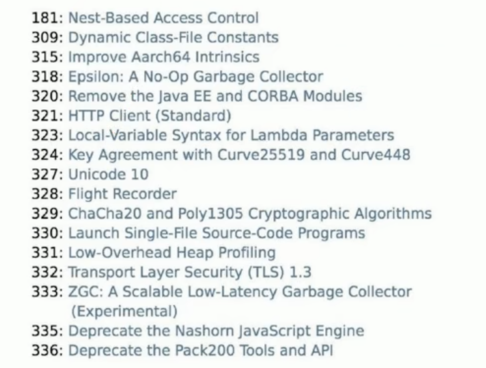
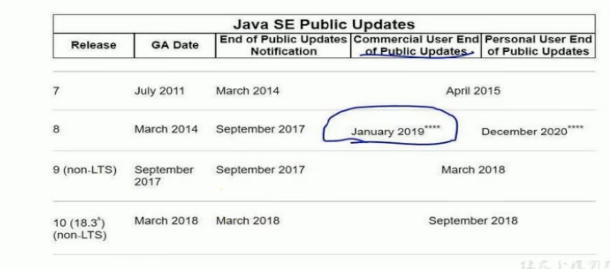
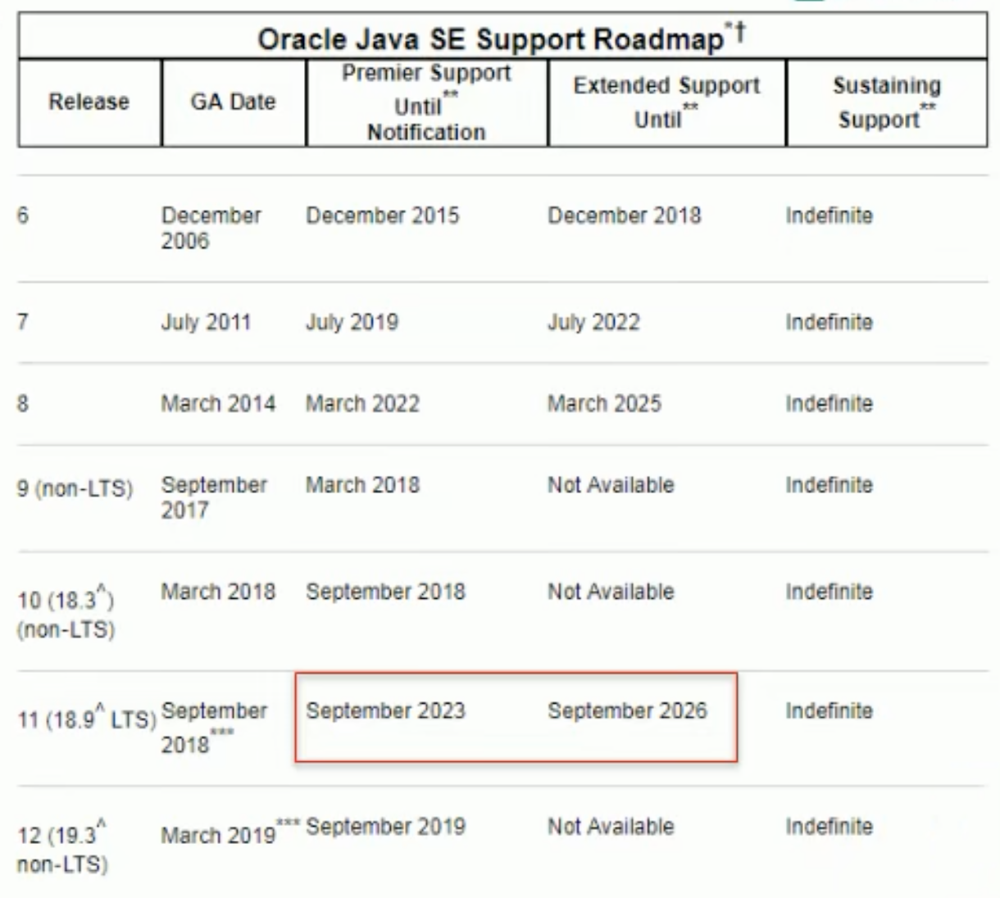
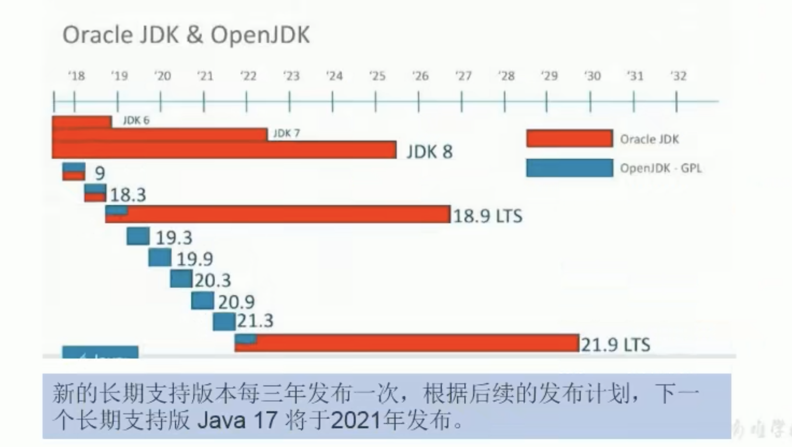
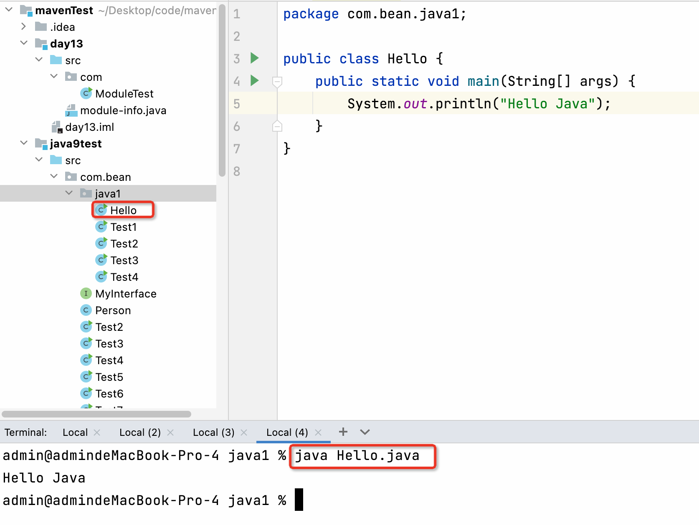

2018年9月26日，Oracle官方宣布Java 11正式发布，这是Java大版本周期变化后的第一个长期支持版本，非常值得关注。从官网即可下载，最新发布的Java 11将带来ZGC和Http Client等重要特性，一共包含17个JEP（JDK Enhancement Proposals，JDK增强提案），其实总共更新不止17个，只是我们更关注如下的17个JEP更新。



JDK 11将是一个企业不可忽视的版本，从时间节点来看，JDK11的发布正好处在JDK8免费更新到期的前夕，同时JDK9、10也陆续成为历史版本，下面是Oracle支持路线图：



JDK 11是一个长期支持版本（LTS，Long-Term-Support）

+ 对于企业来说，选择11将意味着长期的，可靠的，可预测的技术路线图。其中免费的OpenJDK11确定将得到OpenJDK社区的长期支持，LTS版本将是可以放心选择的版本。
+ 从JVM GC的角度，JDK11引入了两种新的GC，其中包括也许是划时代意义的ZGC，虽然目前还是实验特性，但是从能力上来看，这个JDK的一个巨大突破，为特定生产环境的苛刻需求提供了一个可能的选择。例如，对部分企业核心存储等产品，如果能够保证不超过10ms的GC暂停，可靠性会上一个大的台阶，这是过去我们进行GC调优几乎做不到的，是能与不能的问题。

按照官方的说法，新的发布周期会严格遵循时间点，将于每年的3月份和9月份发布，所以Java11的版本号是18.9（LTS）

不过与Java9和Java10这两个被称为“功能性的版本”不同，这两者只提供半年的技术支持，而Java11不仅提供了长期支持的服务，还将作为Java平台的参考实现。Oracle直到2023年9月都会为Java11提供技术支持，而布丁和安全警告等扩展支持将持续到2026年。





# 1 新增字符串处理方法
| 方法 | 描述 |
| --- | --- |
| `isBlank()` | 判断字符串是否为空白 |
| `strip()` | 去除首位空白 |
| `stripTrailing()` | 去除尾部空格 |
| `stripLeading()` | 去除首部空格 |
| `repeat(int i)` | 复制字符串 |
| `lines().count()` | 行数统计 |


```java
package com.bean.java1;

public class Test1 {

    public static void main(String[] args) {
        //判断字符串是否为空白
        System.out.println("   \t    \t  
  ".isBlank());

        //去除首位空白
        System.out.println("-----"+"   \t  abc  \t  
   ".strip()+"-----");
        System.out.println("-----"+"   \t  abc  \t  
   ".trim()+"-----");

        //去除尾部空格
        System.out.println("-----"+"   \t  abc  \t  
   ".stripTrailing()+"-----");

        //去除首部空格
        System.out.println("-----"+"   \t  abc  \t  
   ".stripLeading()+"-----");

        //复制字符串
        String s="abc";
        System.out.println(s.repeat(3));

        //行数统计
        String str="abc
defg";
        System.out.println(str.lines().count());

    }
}
```

# 2 Optinal加强
Optional也增加了几个非常酷的方法，现在可以很方便的将一个Optional转换为一个Stream，或者当一个空Optional时给它一个替代的。


```java
package com.bean.java1;

import java.util.Optional;

public class Test2 {
    public static void main(String[] args) {
        var optional = Optional.empty();
        System.out.println(optional.isPresent());//判断内部的value是否存在
        System.out.println(optional.isEmpty());//判断内部的value是否为空

        //optional = Optional.of("abc");
        //orElseThrow():value为空，则返回value，否则抛出异常NoSuchElementException
        //Object o = optional.orElseThrow();
        //System.out.println(o);

        Optional<String> op = Optional.of("hello");
        //op=Optional.empty();
        //or:value非空，则返回对应的optional；value为空，返回形参封装的optional
        Optional<Object> or = optional.or(() -> op);
        System.out.println(or);
    }
}
```

# 3 局部变量类型推断升级
在var上添加注解的语法格式，在jdk10中是不能实现的，在jdk11中加入了这样的语法。

```java
package com.bean.java1;

import java.util.Locale;
import java.util.function.Consumer;

public class Test3 {
    public static void main(String[] args) {

        //错误的形式：必须要有类型，可以加上var
        //Consumer<String> consumer=(@Deprecated  t)-> System.out.println(t.toUpperCase(Locale.ROOT));

        //正确的形式
        //使用var的好处是在使用Lambda表达式时候给参数加上注解，此语法在Java10是不支持的，在Java11才支持
        Consumer<String> consumer1=(@Deprecated var t)-> System.out.println(t.toUpperCase(Locale.ROOT));
        consumer1.accept("aaaa");
    }
}
```

# 4 全新的HTTP客户端API
HTTP，用于传输网页的协议，早在1997年就被采用在目前的1.1版本中，直到2015年，HTTP2才成为标准。

HTTP/1.1和HTTP2的主要区别是如何在客户端和服务器之间构建和传输数据。HTTP/1.1依赖于请求/响应周期，HTTP2允许服务器“push”数据，它可以发送比客户端请求更多的数据。这使得它可以优先处理并发送对于首先加载网页至关重要的数据。

这个Java9开始引入的一个处理HTTP请求的HTTP Client API，该API支持同步和异步，而在Java11中已经为正式可用状态，可以在`java.net`包中找到这个API。

它将替代仅使用于blocking模式的HttpURLConnection（HttpURLConnection是在HTTP 1.0的时代创建的，并使用了协议无关的方法），并提供对WebSocket和HTTP/2的支持。

```java
package com.bean.java1;

import java.io.IOException;
import java.net.URI;
import java.net.http.HttpClient;
import java.net.http.HttpRequest;
import java.net.http.HttpResponse;
import java.util.concurrent.CompletableFuture;

public class Test4 {
    //同步
    public static void main(String[] args) throws IOException, InterruptedException {
        HttpRequest request = HttpRequest.newBuilder(URI.create("http://www.baidu.com")).build();
        var httpClient = HttpClient.newHttpClient();
        HttpResponse.BodyHandler<String> stringBodyHandler = HttpResponse.BodyHandlers.ofString();
        HttpResponse<String> send = httpClient.send(request, stringBodyHandler);
        String body = send.body();
        System.out.println(body);
        test();
    }

	//异步
    public static void test(){
        HttpClient httpClient = HttpClient.newHttpClient();
        HttpRequest httpRequest = HttpRequest.newBuilder(URI.create("http://www.baidu.com")).build();
        HttpResponse.BodyHandler<String> stringBodyHandler = HttpResponse.BodyHandlers.ofString();

        CompletableFuture<HttpResponse<String>> sendAsync = httpClient.sendAsync(httpRequest, stringBodyHandler);
        HttpResponse<String> rep = sendAsync.join();
        String body = rep.body();
        System.out.println(body);
    }
}

```

# 5 更简化的编译运行程序
在过去如果我们需要运行一个Java程序，需要以下步骤

```java
javac Hello.java	//编译
java Hello			//运行
```

在我们的认知里面，运行一个Java源码必须要先编译，在运行两步执行动作，而在未来的Java 11版本中，通过一个java命令就直接搞定了，如下所示：

```java
java Hello.java
```



一个命令编译运行源代码的注意点：

+ 执行源文件的第一个类，第一个类必须包含主方法
+ 并且不可以使用其他源文件中的自定义类，本文件中的自定义类是可以使用的

如下：

```java
package com.bean.java1;

public class Hello {
    public static void main(String[] args) {
        Test test = new Test();
        Test1 test1 = new Test1();
        System.out.println("Hello Java");
    }
}

class Test{
    public static void main(String[] args) {
        System.out.println("Hello Test");//只会执行第一个类的main方法，所以这个是不会执行的
    }
}

```


