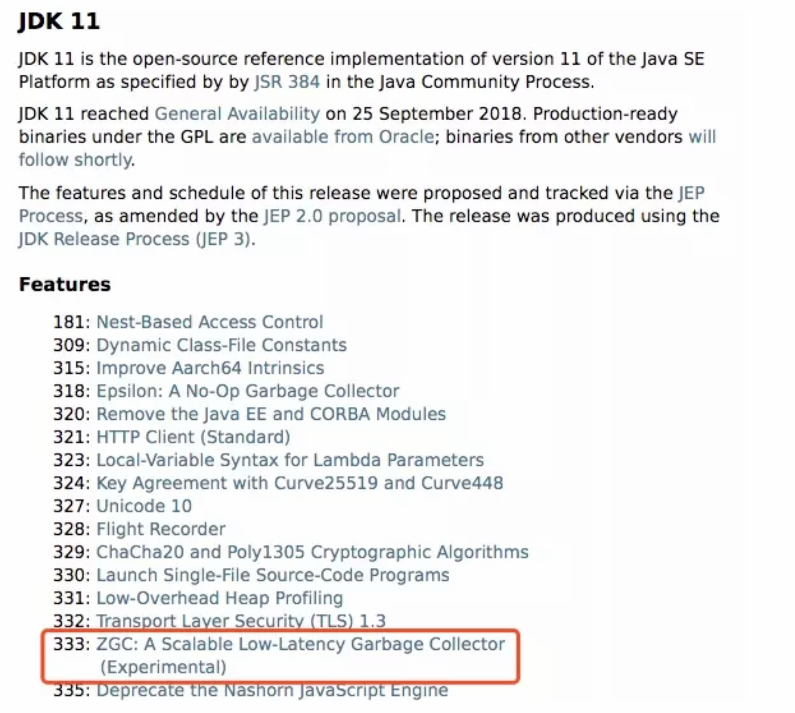

2019年9月17日，国际知名的OpenJDK开源社区发布了Java编程语言环境的最新版本OpenJDK13。

根据Oracle的统计信息，如上图所示，在所有为社区JDK 13有代码贡献的公司中，排名前五的为:Oracle、Red Hat、SAP、Google和龙芯。龙芯位列全球第5，全国第1，为社区贡献了几十个Patch。
```
Features:总共有5个新的JEP(JDK Enhancement Proposals): 
http://openjdk.java.net/projects/jdk/13/

各个 build 的更新说明可以查看: 
https://jdk.java.net/13/release-notes
```
Features
```
350:Dynamic CDS Archives		动态CDS档案
351:ZGC: Uncommit Unused Memory		ZGC:取消使用未使用的内存
353:Reimplement the Legacy Socket API 	重新实现旧版套接字API
354:Switch Expressions (Preview) 	switch表达式(预览)
355:Text Blocks (Preview)	文字块(预览)
```

# 1 switch表达式(预览)
在JDK 12中引入了Switch表达式作为预览特性。JDK 13提出了第二个switch表达式预览。JEP 354修改了这个特性， 它引入了yield语句，用于返回值。这意味着，switch表达式(返回值)应该使用yield, switch语句(不返回值)应该使用 break。

在 JDK 12中有一个，但是要进行一个更改:要从 switch 表达式中生成一个值 break，要删除with value语句以支持a yield 声明。目的是扩展，switch 以便它可以用作语句或表达式，因此两个表单既可以使用 case ... : 带有连贯符号的 传统标签，也可以使用新 case ... -> 标签，而不需要通过，还有一个新的语句用于从 switch 表达式中产生值。这些 更改将简化编码并为模式匹配做好准备。

在以前，我们想要在switch中返回内容，还是比较麻烦的，一般语法如下:
```java
@Test 
public void testSwitch1(){
    String x = "3";
    int i;
    switch (x) {
        case "1":
            i=1;
            break;
        case "2":
            i=2;
            break;
        default:
            i = x.length();
            break;
    }
    System.out.println(i);
}
```
在JDK13中使用以下语法:
```java
@Test  
public void testSwitch2(){
    String x = "3";
    int i = switch (x) {
        case "1" -> 1;
        case "2" -> 2;
        default -> {
            yield 3;
        } };
    System.out.println(i);
}
```
或者
```java
@Test  
public void testSwitch3() {
    String x = "3";
    int i = switch (x) {
        case "1":
            yield 1;
        case "2":
            yield 2;
        default:
            yield 3;
    }; 
    System.out.println(i);
}

```
在这之后，switch中就多了一个关键字用于跳出switch块了，那就是yield，他用于返回一个值。和return的区别在 于:return会直接跳出当前循环或者方法，而yield只会跳出当前switch块。

# 2 文本块(预览)
在JDK 12中引入了Raw String Literals特性，但在发布之前就放弃了。这个JEP与引入多行字符串文字(text block)在意义上是类似的。

这条新特性跟 Kotlin 里的文本块是类似的。

**现实问题**

在Java中，通常需要使用String类型表达HTML，XML，SQL或JSON等格式的字符串，在进行字符串赋值时需要进行 转义和连接操作，然后才能编译该代码，这种表达方式难以阅读并且难以维护。

文本块就是指多行字符串，例如一段格式化后的xml、json等。而有了文本块以后，用户不需要转义，Java能自动搞 定。因此，文本块将提高Java程序的可读性和可写性。

**目标**

简化跨越多行的字符串，避免对换行等特殊字符进行转义，简化编写Java程序。

增强Java程序中字符串的可读性。 

**举例**

会被自动转义，如有一段以下字符串:
```xml
<html>
  <body>
    <p>Hello, 尚硅谷</p> 
  </body>
</html>
```
将其复制到Java的字符串中，会展示成以下内容:
```xml
"<html>
" +
"		<body>
" +
"				<p>Hello, 尚硅谷</p>
" +
"		</body>
" +
"</html>
";
```
即被自动进行了转义，这样的字符串看起来不是很直观，在JDK 13中，就可以使用以下语法了:
```xml
""" 
<html>
  <body>
      <p>Hello, world</p>
  </body>
</html>
""";
```
使用`"""`作为文本块的开始符和结束符，在其中就可以放置多行的字符串，不需要进行任何转义。看起来就十分清爽了。 
```plsql
select employee_id,last_name,salary,department_id
from employees
where department_id in (40,50,60)
order by department_id asc
```
 原有方式:
```java
String query = "select employee_id,last_name,salary,department_id
" +
    "from employees
" +
    "where department_id in (40,50,60)
" +
    "order by department_id asc";
```
使用新特性:
```java
String newQuery = """
        select employee_id,last_name,salary,department_id
        from employees
        where department_id in (40,50,60)
        order by department_id asc
""";
```
	

具体使用 

1）基本使用

- 文本块是Java语言中的一种新文字。它可以用来表示任何字符串，并且提供更大的表现力和更少的复杂性。 
- 文本块由零个或多个字符组成，由开始和结束分隔符括起来。
   - 开始分隔符是由三个双引号字符(""")，后面可以跟零个或多个空格，最终以行终止符结束。文本块内容 以开始分隔符的行终止符后的第一个字符开始。 
   - 结束分隔符也是由三个双引号字符(""")表示，文本块内容以结束分隔符的第一个双引号之前的最后一个 字符结束。
- 文本块中的内容可以直接使用"，"，但不是必需的。 
- 文本块中的内容可以直接包括行终止符。允许在文本块中使用 
，但不是必需的。例如，文本块:
```java
"""
line1
line2
line3
"""
```
相当于:
```java
"line1
line2
line3
"
```
或者一个连接的字符串:
```java
"line1
" +
"line2
" +
"line3
"
```
如果字符串末尾不需要行终止符，则结束分隔符可以放在最后一行内容上。例如:
```java
"""
line1
line2
line3"""
```
相当于
```java
"line1
line2
line3"
```
文本块可以表示空字符串，但不建议这样做，因为它需要两行源代码:
```java
String empty = """
""";
```
以下示例是错误格式的文本块:
```java
String a = """"""; // 开始分隔符后没有行终止符 
String b = """ """; // 开始分隔符后没有行终止符 
String c = """
			"; 		//没有结束分隔符 
String d = """
		   abc \ def
		   """; 	// 含有未转义的反斜线(请参阅下面的转义处理)
```
在运行时，文本块将被实例化为String的实例，就像字符串一样。从文本块派生的String实例与从字符串派生的实例 是无法区分的。具有相同内容的两个文本块将引用相同的String实例，就像字符串一样。

此外，

2）编译器在编译时会删除掉这些多余的空格。 

下面这段代码中，我们用.来表示我们代码中的的空格，而这些位置的空格就是多余的。
```java
String html = """
..............<html>
..............		<body>
..............			<p>Hello, world</p>
..............		</body>
..............</html>
..............""";
```
 多余的空格还会出现在每一行的结尾，特别是当你从其他地方复制过来时，更容易出现这种情况，比如下面的代码:  	
```java
String html = """
..............<html>...
..............		<body>
..............			<p>Hello, world</p>...
..............		</body>..
..............</html>...
..............""";
```
这些多余的空格对于程序员来说是看不到的，但是他又是实际存在的，所以如果编译器不做处理，可能会导致程序员看到的两个文本块内容是一样的，但是这两个文本块却因为存在这种多余的空格而导致差异，比如哈希值不相等。

3）转义字符

允许开发人员使用 
，\f 和\r 来进行字符串的垂直格式化，使用 \b和 \t进行水平格式化。比如下面的代码是合法的:
```java
String html = """
              <html>

                  <body>

                      <p>Hello, world</p>

                  </body>

              </html>

			""";
```
请注意，在文本块内自由使用"是合法的。例如:
```java
String story = """
    "When I use a word," Humpty Dumpty said,
    in rather a scornful tone, "it means just what I
    choose it to mean - neither more nor less."
    "The question is," said Alice, "whether you
    can make words mean so many different things."
    "The question is," said Humpty Dumpty,
    "which is to be master - that's all."
    """;
```
但是，三个"字符的序列需要进行转义至少一个"以避免模仿结束分隔符:
```java
String code =
    """
    String text = \"""
        A text block inside a text block
	\"""; 
    """;
```


4）文本块连接 

可以在任何可以使用字符串的地方使用文本块。例如，文本块和字符串可以相互连接:
```java
String code = "public void print(Object o) {" +
              """
                  System.out.println(Objects.toString(o));
              }
			  """;
```
但是，涉及文本块的连接可能变得相当笨重。以下面文本块为基础:
```java
String code = """
    public void print(Object o) {
    	System.out.println(Objects.toString(o));
    }
    """;
```
假设我们想把上面的Object改为来自某一变量，我们可能会这么写:
```java
String code = """
              public void print(""" + type + """
               o) {
                  System.out.println(Objects.toString(o));
			  }。
    		  """;
```
可以发现这种写法可读性是非常差的，更简洁的替代方法是使用`String :: replace`或`String :: format`，比如:
```java
String code = """
              public void print($type o) {
                  System.out.println(Objects.toString(o));
              }
              """.replace("$type", type);
```
```java
String code = String.format("""
              public void print(%s o) {
                  System.out.println(Objects.toString(o));
              }
			  """, type);
```
另一个方法是使用`String :: formatted`，这是一个新方法，比如:
```java
String source = """
                public void print(%s object) {
                    System.out.println(Objects.toString(object));
                }
                """.formatted(type);
```


 

# 3 动态CDS档案(动态类数据共享归档)
CDS，是java 12的特性了，可以让不同 Java 进程之间共享一份类元数据，减少内存占用，它还能加快应用的启动速 度。而JDK13的这个特性支持在Java application执行之后进行动态archive。存档类将包括默认的基础层CDS存档 中不存在的所有已加载的应用程序和库类。也就是说，在Java 13中再使用AppCDS的时候，就不再需要这么复杂了。

该提案处于目标阶段，旨在提高AppCDS的可用性，并消除用户进行试运行以创建每个应用程序的类列表的需要。 使用示例:
```bash
# JVM退出时动态创建共享归档文件:导出jsa
java -XX:ArchiveClassesAtExit=hello.jsa -cp hello.jar Hello

# 用动态创建的共享归档文件运行应用:使用jsa
java -XX:SharedArchiveFile=hello.jsa -cp hello.jar Hello
```

# 4 ZGC:取消使用未使用的内存

## 4.1 G1和Shenandoah 
JVM的GC释放的内存会还给操作系统吗?

GC后的内存如何处置，其实是取决于不同的垃圾回收器。因为把内存还给OS，意味着要调整JVM的堆大小，这个过 程是比较耗费资源的。

- Java12的[346: Promptly Return Unused Committed Memory from G1](https://openjdk.org/jeps/346)新增了两个参数分别是 G1PeriodicGCInterval及G1PeriodicGCSystemLoadThreshold用于GC之后重新调整Java heap size，然后将多 余的内存归还给操作系统
- Java12的[189: Shenandoah: A Low-Pause-Time Garbage Collector (Experimental)](https://openjdk.org/jeps/189)拥有参数 -XX:ShenandoahUncommitDelay=来指定ZPage的page cache的失效时间，然后归还内存

HotSpot的G1和Shenandoah这两个GC已经提供了这种能力，并且对某些用户来说，非常有用。因此，Java13则给 ZGC新增归还unused heap memory给操作系统的特性。


## 4.2 ZGC的使用背景
在JDK 11中，Java引入了ZGC，这是一款可伸缩的低延迟垃圾收集器，但是当时只是实验性的。号称不管你开了多大 的堆内存，它都能保证在 10 毫秒内释放 JVM ，不让它停顿在那。但是，当时的设计是它不能把内存归还给操作系 统。对于比较关心内存占用的应用来说，肯定希望进程不要占用过多的内存空间了，所以这次增加了这个特性。



在Java 13中，JEP 351再次对ZGC做了增强，将没有使用的堆内存归还给操作系统。ZGC当前不能把内存归还给操作 系统，即使是那些很久都没有使用的内存，也只进不出。这种行为并不是对任何应用和环境都是友好的，尤其是那些 内存占用敏感的服务，例如:

1. 按需付费使用的容器环境;
2. 应用程序可能长时间闲置，并且和很多其他应用共享和竞争资源的环境;
3. 应用程序在执行期间有非常不同的堆空间需求，例如，可能在启动的时候所需的堆比稳定运行的时候需要更多的堆内存。 

## 4.3 使用细节
ZGC的堆由若干个Region组成，每个Region被称之为ZPage。每个Zpage与数量可变的已提交内存相关联。当ZGC压 缩堆的时候，ZPage就会释放，然后进入page cache，即ZPageCache。这些在page cache中的ZPage集合就表示没 有使用部分的堆，这部分内存应该被归还给操作系统。回收内存可以简单的通过从page cache中逐出若干个选好的 ZPage来实现，由于page cache是以LRU(Least recently used，最近最少使用)顺序保存ZPage的，并且按照尺寸 (小，中，大)进行隔离，因此逐出ZPage机制和回收内存相对简单了很多，主要挑战是设计关于何时从page cache中逐出ZPage的策略。

一个简单的策略就是设定一个超时或者延迟值，表示ZPage被驱逐前，能在page cache中驻留多长时间。这个超时时 间会有一个合理的默认值，也可以通过JVM参数覆盖它。Shenandoah GC用了一个类型的策略，默认超时时间是5分 钟，可以通过参数-XX:ShenandoahUncommitDelay = milliseconds覆盖默认值。

像上面这样的策略可能会运作得相当好。但是，用户还可以设想更复杂的策略:不需要添加任何新的命令行选项。例 如，基于GC频率或某些其他数据找到合适超时值的启发式算法。JDK13将使用哪种具体策略目前尚未确定。可能最 初只提供一个简单的超时策略，使用-XX:ZUncommitDelay = seconds选项，以后的版本会添加更复杂、更智能的 策略(如果可以的话)。

uncommit能力默认是开启的，但是无论指定何种策略，ZGC都不能把堆内存降到低于Xms。这就意味着，如果Xmx 和Xms相等的话，这个能力就失效了。-XX:-ZUncommit这个参数也能让这个内存管理能力失效。

# 5 重新实现旧版套接字API 
**现有问题**

重新实现了古老的 Socket 接口。现在已有的 java.net.Socket 和 java.net.ServerSocket 以及它们的实现类，都可以 回溯到 JDK 1.0 时代了。

- 它们的实现是混合了 Java 和 C 的代码的，维护和调试都很痛苦。
- 实现类还使用了线程栈作为 I/O 的缓冲，导致在某些情况下还需要增加线程栈的大小。 
- 支持异步关闭，此操作是通过使用一个本地的数据结构来实现的，这种方式这些年也带来了潜在的不稳定性和 跨平台移植问题。该实现还存在几个并发问题，需要彻底解决。

在未来的网络世界，要快速响应，不能阻塞本地方法线程，当前的实现不适合使用了。 

**新的实现类**

全新实现的 NioSocketImpl 来替换JDK1.0的PlainSocketImpl。

- 它便于维护和调试，与 NewI/O (NIO) 使用相同的 JDK 内部结构，因此不需要使用系统本地代码。 
- 它与现有的缓冲区缓存机制集成在一起，这样就不需要为 I/O 使用线程栈。
- 它使用 java.util.concurrent 锁，而不是 synchronized 同步方法，增强了并发能力。 
- 新的实现是Java 13中的默认实现，但是旧的实现还没有删除，可以通过设置系统属性 jdk.net.usePlainSocketImpl来切换到旧版本。

代码说明 

运行一个实例化Socket和ServerSocket的类将显示这个调试输出。这是默认的(新的)。
```java
Module java.base
Package java.net
Class SocketImpl
public abstract class SocketImpl implements SocketOptions {
    private static final boolean USE_PLAINSOCKETIMPL = usePlainSocketImpl();
    private static boolean usePlainSocketImpl() {
        PrivilegedAction pa = () ->
            NetProperties.get("jdk.net.usePlainSocketImpl");
        String s = AccessController.doPrivileged(pa);
        return (s != null) && !s.equalsIgnoreCase("false");
    }
    /**
	* Creates an instance of platform's SocketImpl
	*/
    @SuppressWarnings("unchecked")
    static <S extends SocketImpl & PlatformSocketImpl> S
    createPlatformSocketImpl(boolean server) {
        if (USE_PLAINSOCKETIMPL) {
            return (S) new PlainSocketImpl(server);
        } else {
            return (S) new NioSocketImpl(server);
        } 
    }
}
```
SocketImpl的USE_PLAINSOCKETIMPL取决于usePlainSocketImpl方法，而它会从NetProperties读取 dk.net.usePlainSocketImpl配置，如果不为null且不为false，则usePlainSocketImpl方法返回true; createPlatformSocketImpl会根据USE_PLAINSOCKETIMPL来创建PlainSocketImpl或者NioSocketImpl。

# 6 其他解读
上面列出的是大方面的特性，除此之外还有一些api的更新及废弃，主要见 JDK 13 Release Notes，这里举几个例子。

[https://jdk.java.net/13/release-notes](https://jdk.java.net/13/release-notes)

**增加项**

- 添加FileSystems.newFileSystem(Path, Map<String, ?>) Method
- 新的java.nio.ByteBuffer Bulk get/put Methods Transfer Bytes Without Regard to Buffer Position 
- 支持Unicode 12.1
- 添加-XX:SoftMaxHeapSize Flag，目前仅仅对ZGC起作用
- ZGC的最大heap大小增大到16TB

移除项

- 移除awt.toolkit System Property
- 移除Runtime Trace Methods
- 移除-XX:+AggressiveOpts
- 移除Two Comodo Root CA Certificates、Two DocuSign Root CA Certificates 
- 移除内部的com.sun.net.ssl包

废弃项

- 废弃-Xverify:none及-noverify 
- 废弃rmic Tool并准备移除 
- 废弃javax.security.cert并准备移除

已知问题

- 不再支持Windows 2019 Core Server
- 使用ZIP File System (zipfs) Provider来更新包含Uncompressed Entries的ZIP或JAR可能造成文件损坏 

其他事项

- GraphicsEnvironment.getCenterPoint()及getMaximumWindowBounds()已跨平台统一 
- 增强了JAR Manifest的Class-Path属性处理
- 针对Negatively Sized Argument，StringBuffer(CharSequence)及StringBuilder(CharSequence)会抛出 NegativeArraySizeException
- linux的默认进程启动机制已经使用posix_spawn
- Lookup.unreflectSetter(Field)针对static final fields会抛出IllegalAccessException 
- 使用了java.net.Socket.setSocketImplFactory及java.net.ServerSocket.setSocketFactory方法的要注意，要求 客户端及服务端要一致，不能一端使用自定义的factory一端使用默认的factory 
- SocketImpl的supportedOptions, getOption及setOption方法的默认实现发生了变化，默认的 supportedOptions返回空，而默认的getOption,及setOption方法抛出UnsupportedOperationException
- JNI NewDirectByteBuffer创建的Direct Buffer为java.nio.ByteOrder.BIG_ENDIAN 
- Base64.Encoder及Base64.Decoder可能抛出OutOfMemoryError
- 改进了Serial GC Young pause time report 
- 改进了MaxRAM及UseCompressedOops参数的行为

7 小结 

以上，就是JDK13中包含的主要特性。

- 语法层面，改进了Switch Expressions，新增了Text Blocks，二者皆处于Preview状态; 
- API层面主要使用NioSocketImpl来替换JDK1.0的PlainSocketImpl 
- GC层面则改进了ZGC，以支持Uncommit Unused Memory

而且，JDK13并不是LTS(长期支持)版本，如果你正在使用Java 8(LTS)或者Java 11(LTS)，暂时可以不必升级 到Java 13。

这些年很多 Java 粉丝已经讨厌写那些冗长难看的代码了，有些转投到高效的 Python 门下，有的转用 Kotlin，有的 去了新兴的 Go 那边。不过，Java 大叔凭着其广阔的领土，活跃高效的运转机构，以及其开放改革的心，还会有不少 的粉丝追随他的。

# 7 采用新版本 Java 的注意事项 
在采用新版本 Java 之前必须考虑的一些注意事项/风险。

注意1：被新版本系列“绑架”

如果采用了 Java 12 并使用新的语言特性或新的 API，这意味着实际上你已将项目绑定到 Java 的新版本系列。接下来你必须采用 Java 13, 14, 15, 16 和 17。

使用了新版本，每个版本的使用寿命为六个月，并且在发布后仅七个月就过时了。这是因为每个版本只有在六个月内 提供安全补丁，发布后1个月的第一个补丁和发布后4个月的第二个补丁。7个月后，下一组安全补丁会发布，但旧版 本不能获取更新。

因此，你要判断自身的开发流程是否允许升级 Java 版本，一个月的时间窗口方面会不会太狭窄?或者你是否愿意在 安全基线以下的Java版本上运行?

注意2：升级的“绊脚石”

实际使用中有很多阻止我们升级 Java 的因素，下面列出一些常见的:

- 发资源不足：你的团队可能会非常忙碌或规模太小，你能保证两年后从 Java 15 升级到 16 的开发时间吗? 
- 构建工具和 IDE:使用的 IDE 是否会在发布当天支持每个新版本?Maven? Gradle 呢? 如果不是，你有后备计划 吗?请记住，你只有1个月的时间来完成升级、测试并将其发布到生产环境中。此外还包括 Checkstyle， JaCoCo，PMD，SpotBugs 等等其他工具。
- 依赖关系:你的依赖关系是否都准备好用于每个新版本?请记住，它不仅仅是直接依赖项，而是技术堆栈中的 所有内容。字节码操作库尤其受到影响，例如 ByteBuddy 和 ASM。 
- 框架:这是另一种依赖，但是一个大而重要的依赖。在一个月的狭窄时间窗口内，Spring 会每六个月发布一个 新版本吗? Jakarta EE(以前的 Java EE)会吗?如果它们不这样做会怎么样?

现在，任何阻挡者的传统方法都是等待:在开始升级之前等待6到12个月，以便为工具，库和框架提供修复任何错误 的机会。

注意3：云 / 托管 / 部署

你是否可以控制代码在生产环境中的运行位置和方式?例如，如果你在 AWS(Amazon Web Service) Lambda 中 运行代码，则无法控制。AWS Lambda 没有采用 Java 9或10，甚至没有采用 Java 11。所以除非 AWS 提供公共保证 以支持每个新的 Java 版本，否则根本无法采用 Java 12。(我的工作假设是AWS Lambda仅支持主要的LTS版本，由 Amazon Corretto JDK公告支持。)

如何托管你的 CI 系统?Jenkins, Travis, Circle, Shippable, GitLab 会快速更新吗?如果不是，你会怎么做? 

注意4：为采用新版本进行规划

如果正在考虑采用新版本的 Java，建议你准备一份现在所依赖的所有内容的清单，或者可能在未来3年内会依赖的。 你需要保证该列表中的所有内容都能正常工作，并与新版本一起升级，或者如果该依赖项不再更新，请制定好计划。 以某位互联网开发者为例，他列的清单如下:

- Amazon AWS
- Eclipse
- IntelliJ
- Travis CI
- Shippable CI
- Maven
- Maven 插件(compile, jar, source, javadoc等) 
- Checkstyle, 以及相关的 IDE 插件和 maven 插件 
- JaCoCo, 以及相关的 IDE 插件和 maven 插件 
- PMD 和相关的 maven 插件
- SpotBugs 和相关的 maven 插件
- OSGi bundle metadata tool 
- Bytecode 工具(Byte buddy / ASM etc) 
- 超过 100 个 jar 包依赖项

说了这么多，当然不是鼓励大家不进行升级，新语言特性带来的好处以及性能增强会让开发者受益，但升级背后的风险也应该考虑进去。

注意5：其他第三方厂商的声明

Spring 框架已经在视频中表达了对 Java 12 的策略。关键部分是:
```
“Java 8 和 11 作为 LTS 版本会持续获得我们的正式支持，对于过渡版本，我们也会尽最大努力支持，但它们不会 
获得正式的生产环境支持。如果你升级到 Java 11，我们非常愿意和你合作，因为长期支持版本才是我们关注的重心， 
对于 Java 12 及更高版本我们会尽最大的努力。”
```
作为典型软件供应商的一个例子，Liferay 声明如下:
```
Liferay 已决定不会对 JDK 的每个主要版本进行认证。我们将选择遵循 Oracle 的主导并仅认证标记为 LTS 的版 本。 
																														—— Liferay 博客
```

个人的想法:
```
想象一下汽车制造商的类似行为:
● 每6个月重新设计和发布一次汽车
● 从2018年开始，每三年只提供一次完整的保修
● 如果客户购买2019型号并且在6个月内出现问题，他们必须等待并购买2020修复模型
● 2020型号是电动的，但你的城镇的基础设施还不支持电充等设备支持，更不用说座椅已经改变并导致腰痛 
● 不用担心，购买2020.3型号!
```


