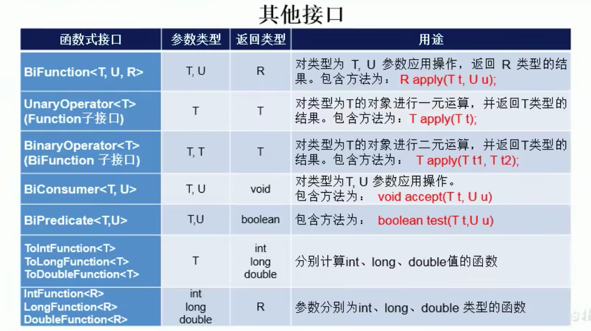

# 1 Lambda入门
## 1.1 介绍
Lambda是一个匿名函数，我们可以把Lambda表达式理解为是一段可以传递的代码（将代码像数据一样进行传递）。可以写出更简洁、更灵活的代码。作为一种更紧凑的代码风格，使Java的语言表达能力得到了提升。

## 1.2 语法
基础语法：

```java
Java8引入了一个新的操作符：->，该操作符称为箭头操作符或Lambda操作符，箭头操作符将Lambda表达式拆分为2部分
左侧：Lambda表达式的形参列表，其实就是接口中抽象方法的形参列表
右侧：Lambda表达式中所执行的功能，即Lambda体
```

Lambda表达式的本质：作为函数式接口的实例


语法格式1：无参数，无返回值：

```java
() -> System.out.println( "hello world" );
```

```java
public class test {
    public static void main(String[] args) {
        Runnable r = new Runnable() {
            @Override  
            public void run() {
                System.out.println("Hello World!");
            }
        };
        r.run();
        System.out.println("--------------------------------------");
        Runnable r1 = () -> {
            System.out.println("Hello Lambda");
        };
        r1.run();
    }
}
```

语法格式2：有一个参数，并且无返回值，小括号可省略不写，：

```java
public class test {
    public static void main(String[] args) {
        Consumer con = x -> {
            System.out.println(x);
        };
        con.accept("QWERTY");
    }
}
```

语法格式3：有2个以上的参数，有返回值，并且Lambda体中有多条返回值

```java
public class test {
    public static void main(String[] args) {
        Comparator com = (x,y) -> {
            System.out.println("函数式接口");
            return Integer.compare(x,y);
        };
    }
}
```

语法格式4：若Lambda体中只有一条语句，return和大括号都可省略不写

```java
public class test {
    public static void main(String[] args) {
        Comparator com = (x,y) -> Integer.compare(x,y);
    }
}
```

语法格式5：Lambda表达式的参数列表的数据类型可以省略不写，因为JVM编译器通过上下文推断出数据类型，即“类型推断”

```java
package cn.itcast.jvm.t3.bytecode;

import java.util.function.Consumer;

public class TestDemo {

    public static void main(String[] args) {

        Consumer<String> consumer=(String s1)->{
            System.out.println(s1);
        };
        consumer.accept("hello");

        Consumer<String> consumer2=(s2)->{
            System.out.println(s2);
        };
        consumer2.accept("java");
    }
}

```

总结：

+ 左边：lambda表达式形参列表类型可以省略（类型推断），如果形参列表只有一个参数，其一对括号也可省略
+ 右边：lambda体使用一对`{}`包裹，如果lambda体只有一条执行语句（可能是return语句），可以省略这一对`{}`和`return`关键字

注意：Lambda 表达式需要函数式接口的支持！

# 2 函数式接口
**函数式接口**：接口中只有一个抽象方法的接口，称为函数式接口，可以使用`@FunctionalInterface`修饰


如何理解函数式接口？

> Java从诞生之日起，就是一直倡导“一切皆对象”，在Java里面面向对象（OOP）编程时一切，但是随着python、scala等语言的兴起和新技术的挑战，Java不得不作出调整以便支持更加广泛的技术要求，即Java不但可以支持OOP，也可以支持OOF（面向函数编程）
>
> 在函数式编程语言当中，函数被当作一等公民对待，在将函数作为一等公民的编程语言中，Lambda表达式的类型时函数，但是在Java8中，有所不同，在Java8中，Lambda表达式是对象，而不是函数，他们必须依附于一类特别的对象类型，即函数式接口
>
> 简单的说，在Java8中，Lambda表达式就是一个函数式接口的实例，这就是Lambda表达式和函数式接口的关系，也就是说，只要一个对象是函数式接口的实例，那么该对象就可以用Lambda表达式来表示。
>

## 2.1 案例
案例1：简单运算

函数式运算接口

```java
@FunctionalInterface  
public interface MyFun {
    Integer getValue(Integer num);
}
```

测试类

```java
public class test {
    public static void main(String[] args) {
        Integer result = operation(10,x ->{
            return x * x;
        });
        System.out.println(result);
    }

    //operation方法，参数1为一Integer类型数据，参数2为一运算接口
    public static Integer operation(Integer num, MyFun myFun){
        return myFun.getValue(num);
    }
}
```


案例2：定制排序比较两个Employee，先按年龄比，年龄相同再按姓名比，使用Lambda作为参数传递

```java
@Data  
@AllArgsConstructor  
@NoArgsConstructor  
public class Employee {
	private String name;
	private int age;
	private Double salary;
}
```

测试类

```java
public class test {
    public static void main(String[] args) {
        List<Employee> list = Arrays.asList(
            new Employee("1号", 25, 5000.0),
            new Employee("2号", 35, 3000.0),
            new Employee("3号", 35, 2000.0),
            new Employee("4号", 35, 8000.0),
            new Employee("5号", 65, 1000.0)
        );
        Collections.sort(list,(e1,e2)->{
            if (e1.getAge() == e2.getAge()){
                return e1.getName().compareTo(e2.getName());
            }else {
                return -Integer.compare(e1.getAge(),e2.getAge());
            }
        });
        Iterator<Employee> iterator = list.iterator();
        while (iterator.hasNext()){
            System.out.println(iterator.next());
        }
    }
}
```

## 2.2 四大核心函数式接口
| 函数式接口 | 参数类型 | 返回值类型 | 用途 |
| --- | --- | --- | --- |
| Consumer<T>   消费型接口 | T | void | 对类型为T的对象应用操作，包含方法`void accept(T t);` |
| Supplier<T>       供给型接口 | 无 | T | 返回类型为T的对象，包含方法`T get();` |
| Function(T,R)    函数型接口 | T | R | 对类型为T的对象应用操作，并返回结果是R类型的对象，包含方法：`R apply(T t);` |
| Predicate<T>    断言型接口 | T | boolean | 确定类型为T的对象是否满足某种约束，并返回boolean值，包含方法：`boolean test(T t);` |


Consumer：消费型接口

```java
@Test  
public void test(){
    this.happy(1000,m -> {
        System.out.println("我消费了"+ m);
    });
}

public void happy(double money, Consumer con){
    con.accept(money);
}
```


Supplier：供给型接口

```java
@Test  
public void test(){
    List numList = this.getNumList(5, () -> (int) (Math.random() * 100));
    for (Integer integer : numList) {
        System.out.println(integer);
    }
}

//产生指定数量的整数
public List getNumList(int num, Supplier sup){
    List list = new ArrayList<>();
    for (int i = 0; i < num; i++) {
        list.add(sup.get());
    }
    return list;
}
```


Function(T,R)：函数型接口

```java
@Test 
public void test(){
	System.out.println(this.handler("str", str -> (str + "123")));
}

//处理字符串
public String handler(String str, Function<String,String> fun){
	return fun.apply(str);
}
```


Predicate：断言型接口

```java
@Test  
public void test(){
	List stringList = Arrays.asList("qwe", "123", "hello", "ranhaifeng", "asdasdsaewqewqe");
	List list = filterStr(stringList, s -> (s.length() > 3));
	for (String s : list) {
		System.out.println(s);
	}
}

//将满足条件的字符串放入集合
public List filterStr(List list, Predicate pre){
	List stringList = new ArrayList<>();
	for (String s : list) {
		if (pre.test(s)){
			stringList.add(s);
		}
	}
	return stringList;
}
```

其他接口



# 3 方法引用与构造器引用
## 3.1 方法引用
若 Lambda 体中的内容有方法已经实现了，我们可以使用方法引用，可以理解为方法引用是Lambda表达式的另外一种表现形式。

换句话说，方法引用就是Lambda表达式，也就是函数式接口的一个实例，通过方法的名字来指向一个方法，可以认为是Lambda表达式的一个语法糖

要求：接口的抽象方法的参数列表和返回值类型，必须与方法引用的方法的参数列表和返回值类型保持一致。主要针`对象::实例方法名`和`类::静态方法名`

格式：使用操作法`::`将类或者对象与方法名隔开来

主要有三种语法格式：

```java
对象::实例方法名
类::静态方法名
类::实例方法名
```

例子

```java
//对象::实例方法
@Test
public void test(){
    Consumer<String> con = x -> {
        System.out.println(x);
    }; 
    PrintStream out = System.out;
    Consumer<String> con1 = out::println;
    Consumer<String> con2 = System.out::println;
    con2.accept("qwe");
} 

//类::静态方法名
@Test
public void test(){
    int x;int y;
    Comparator<Integer> com = (x,y)-> Integer.compare(x,y);
    Comparator<Integer> com1 = Integer::compare;
}


// 类::实例方法名
@Test
public void test(){
    BiPredicate<String,String> bp = (x,y) -> x.equals(y);
    BiPredicate<String,String> bp2 = String::equals;
}
```

注意：

+ Lambda体中调用方法的参数列表与返回值类型，要与函数式接口中抽象方法的函数列表和返回值类型保持一致！
+ 若Lambda参数列表中的第一参数是实例方法的调用者，第二个参数是实例方法的参数时，可以使用`ClassName::method`，就是上面的`类::实例方法名`

## 3.2 构造器引用
和方法引用类似，需要调用的构造器的参数列表要与函数式接口中抽象方法的参数列表保持一致，抽象方法的返回值类型即为构造器所属的类的类型

```java
@Test
public void test(){
    Supplier<Object> sup = () -> new Object();
    Supplier<Object> sup2 = Object::new;

    //如果有多个构造器，如何判断是调用的实体类的哪个构造器呢？看下面的注意，即Function（T,R）内部的函数 R apply(T t) 是1个参数，那么就会调用是1个参数的构造器。
    Function<Integer,Employee> fun2 =Employee::new;
}
```

## 3.3 数组引用
可以把数组看作是一个特殊的类，则写法和构造器引用一样

```java
@Test
public void test(){
    Function<Integer,String[]> fun = x -> new String[x];

    Function<Integer,String[]> fun2 = String[]::new;
}
```


