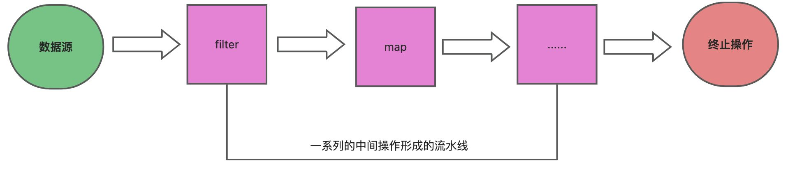
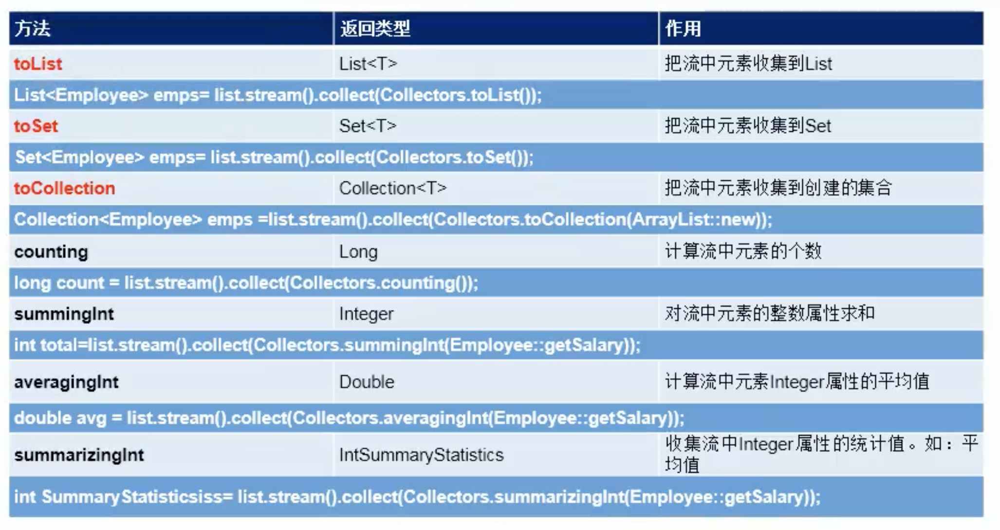
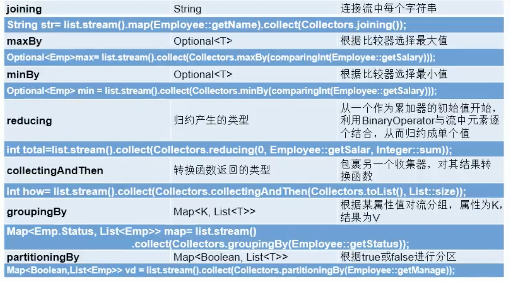
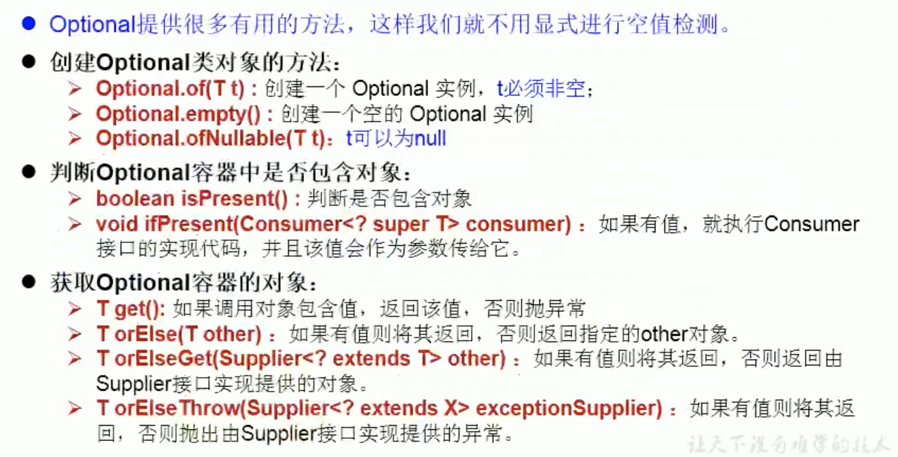

# 1 介绍
Java8中有两大最为重要的改变。第一个是 Lambda 表达式；另外一个则是`Stream API(java.util.stream)`。Stream是 Java8中处理集合的关键抽象概念，它可以指定你希望对集合进行的操作，可以执行非常复杂的查找、过滤和映射数据等操作。使用Stream API 对集合数据进行操作，就类似于使用 SQL执行的数据库查询。也可以使用Stream API来并行执行操作简而言之，Stream API提供了一种高效且易于使用的处理数据的方式。

为什么要用Stream API？

实际开发中，项目中多数数据都来自于mysql，oracle等，但现在数据源更多了，有mongdb，redis等，而这些nosql的数据就需要Java层面去处理了

Stream和Collection集合的区别：Collection是一种静态的内存数据结构，而Stream是有关计算的，前者是主要面向内存，存储在内存中，后者主要是面向CPU，通过CPU实现计算。

流(Stream)到底是什么呢?

是数据渠道，用于操作数据源（集合、数组等）所生成的元素序列。集合讲的是数据，Stream讲的是计算。

注意：

- Stream 自己不会存储元素。
- Stream不会改变源对象。相反，他们会返回一个持有结果的新Stream
- Stream操作是延迟执行的。这意味着他们会等到需要结果的时候才执行。

Stream操作的三个步骤

1. 创建Stream
   - 一个数据源（如集合、数组）获取一个流
2. 中间操作
   - 一个中间操作链，对数据源的数据进行处理
3. 终止操作
   - 一旦执行终止操作，就执行中间操作链，并产生结果，之后不会再被使用

流程图：




# 2 创建
Stream的创建
```java
@Test
public void test(){
    //1.可以通过Collection系列集合提供的stream()或parallelstream()
    List<String> list = Arrays.asList("1", "2", "3");
    Stream<String> stream = list.stream();

    //2.通过Arrays中的静态方法stream（）获取数组流
    int [] arr = new int[10];
    IntStream stream1 = Arrays.stream(arr);

    //3.通过Stream类中的静态方法of()
    Stream<String> stream2 = Stream.of("1", "2", "3");

    //4.创建无限流
    //迭代
    Stream<Integer> stream3 = Stream.iterate(0, x -> x + 2);
    stream3.limit(10).forEach(System.out::println);

    //生成
    Stream.generate(() -> Math.random()).limit(5).forEach(System.out::println);
}
```


# 3 中间操作
多个中间操作可以连接起来形成一个流水线，除非流水线上触发终止操作，否则中间操作不会执行任何的处理，而在终止操作时一次性全部处理，称为**惰性求值**。

## 3.1 筛选与切片
| 方法 | 描述 |
| --- | --- |
| filter(Predicate p) | 接收lambda，从流中排出某些元素 |
| distinct() | 筛选，通过流所生成的hashCode()和equals()去除重复元素 |
| limit(long maxSize) | 截断流，使其元素不超过给定元素 |
| skip(long n) | 跳过元素，返回一个扔掉了前n个元素的流，若流中元素不足n个，则返回一个空流，与limit(n)互补 |

1）filter：接收Lambda，从流中排除某些元素
```java
public class test {
    
    @Test  
    public void test(){
        List people = Arrays.asList(
            new Person("张三", 18, 9999.99),
            new Person("李四", 58, 5555.55),
            new Person("王五", 26, 3333.33),
            new Person("赵六", 36, 6666.66),
            new Person("田七", 12, 8888.88)
        );
        //中间操作	
        Stream<Person> stream = people.stream().filter(person -> {
            System.out.println("中间操作");
            return person.getAge() > 5;
        });
        //终止操作
        stream.forEach(System.out::println);
    }
```
2）limit：截断流，使其元素不超过给定数量
```java
//中间操作
people.stream().filter(person -> person.getScore() > 5000).limit(1).forEach(System.out::println);
```
3）skip(n)：跳过元素，返回一个扔掉了前n个元素的流，若流中元素不足n个，则返回一个空流，与limit互补
```java
//中间操作
people.stream().skip(2).forEach(System.out::println);
```
4）distinct：筛选，通过流所生成元素的hashcode（）和equals（）去除重复元素，要想实现成功，必须实体类实现重写这两个方法！
```java
//中间操作
people.stream().distinct().forEach(System.out::println);
```

## 3.2 映射
| 方法 | 描述 |
| --- | --- |
| map(Function f) | 接受一个函数作为参数，该函数会被应用到每个元素上，并将其映射成一个新的元素 |
| mapToDouble(ToDoubleFunction f) | 接受一个函数作为参数，该函数会被应用到每个元素上，产生一个新的DoubleStream |
| mapToInt(ToIntFunction f) | 接受一个函数作为参数，该函数会被应用到每个元素上，产生一个新的IntStream |
| mapToLong(ToLongFunction f) | 接受一个函数作为参数，该函数会被应用到每个元素上，产生一个新的LongStream |
| flatMap(Function f) | 接受一个函数作为参数，将流中的每个值都换成另一个流，然后把所有的流连接成一个流 |

1）map：接收Lambda ,将元素转换成其他形式或提取信息。接收一个函数作为参数，该函数会被应用到每个元素上，并将其映射成一个新的元素。
```java
@Test  
public void test() {
	List list = Arrays.asList("aaa", "bbb", "ccc", "ddd", "eee", "fff");
    list.stream().map(str -> str.toUpperCase(Locale.ROOT)).forEach(System.out::println);
}
```
2）flatMap：接收一个函数作为参数，将流中的每个值都换成另一个流，然后把所有流连接成一个流
```java
public class test {
    
    @Test  
    public void test() {
        List list = Arrays.asList("aaa", "bbb");
        list.stream().flatMap(test::filterCharacter).forEach(System.out::println);
    }

    public static Stream<Character> filterCharacter(String str){
        List<Character> list = new ArrayList<>();
        for (char c : str.toCharArray()) {
            list.add(c);
        }
        return list.stream();
    }
}
```
map和flatMap的区别有点类似于List里面的add方法和addAll方法。

## 3.3 排序
| 方法 | 描述 |
| --- | --- |
| sorted() | 产生一个新流，其中按自然顺序排序 |
| sorted(Comparator com) | 产生一个新流，其中按比较器顺序排序 |

```java
public class test {
    @Test  
    public void test(){

        //自然排序
        List list = Arrays.asList("aaa", "eee", "ddd", "bbb");
        list.stream().sorted().forEach(System.out::println);

        //定制排序
        List<Person> list1 = Arrays.asList(
            new Person("张三", 18, 2000.0),
            new Person("李四", 18, 5000.0),
            new Person("王五", 45, 8700.0),
            new Person("赵六", 42, 4200.0),
            new Person("陈七", 56, 13100.0)
        );
        list1.stream().sorted((p1,p2) -> {
            if (p1.getAge().equals(p2.getAge())){
                return p1.getSale().compareTo(p2.getSale());
            }else {
                return p1.getAge().compareTo(p2.getAge());
            }
        }).forEach(System.out::println);
    }
}
```

# 4 终止操作
终端操作会从流的流水线生成结果，其结果可以是任何不是流的值，例如：List、Integer甚至是void

流进行了终止操作之后，不能再次使用

## 4.1  查找与匹配
| 方法 | 描述 |
| --- | --- |
| allMatch(Predicate p) | 检查是否匹配所有元素 |
| anyMatch(Predicate p) | 检查是否至少匹配一个元素 |
| noneMatch(Predicate p) | 检查是否没有匹配所有元素 |
| findFirst() | 返回第一个元素 |
| findAny() | 返回当前流中的任意元素 |

```java
public class test {
    @Test  
    public void test(){
        List list = Arrays.asList(
            new Person("张三", 18, 2000.0, Person.Status.BUSY),
            new Person("李四", 18, 5000.0,Person.Status.FREE),
            new Person("王五", 45, 8700.0,Person.Status.VOCATION),
            new Person("赵六", 42, 4200.0,Person.Status.BUSY),
            new Person("陈七", 56, 13100.0,Person.Status.BUSY)
        );
        
        //allMatch 检查是否匹配所有元素，返回值为Boolean类型
        boolean b = list.stream().allMatch(e -> e.getStatus().equals(Person.Status.BUSY));
        System.out.println(b);  // false

        
        //anyMatch 检查是否匹配至少一个元素，返回值为Boolean类型
        boolean b1 = list.stream().anyMatch(e -> e.getStatus().equals(Person.Status.BUSY));
        System.out.println(b1); // true
        

        //noneMatch 检查是否没有匹配所有元素，返回值为Boolean类型
        boolean b2 = list.stream().noneMatch(e -> e.getStatus().equals(Person.Status.BUSY));
        System.out.println(b2); // false
        

        //findFirst 返回第一个元素
        //Optional 防止空指针异常的类型，如果first为null，可以使用.orelse()方法指定一个不为空的对象
        Optional<Person> op1 = list.stream()
            .sorted((e1, e2) -> Double.compare(e1.getSale(), e2.getSale())).findFirst();
        System.out.println(op1.get());	// Person(name=张三, age=18, sale=2000.0, status=BUSY)
        

        //findAny 返回当前流中的任意元素
        //parallelStream 并行流，多个进程同时去进行filter、findAny，谁先找到算谁的
        Optional<Person> op2 = list.parallelStream().filter(e -> e.getStatus().equals(Person.Status.FREE)).findAny();	
        System.out.println(op2.get());	// Person(name=李四, age=18, sale=5000.0, status=FREE)

        //count 返回流中元素的总个数
        long count = list.stream().count();
        System.out.println(count);	// 5

        //max 返回流中的最大值
        Optional<Person> max = list.stream().max((e1, e2) -> Double.compare(e1.getSale(), e2.getSale()));
        System.out.println(max.get());	// Person(name=陈七, age=56, sale=13100.0, status=BUSY)


        //min 返回流中的最小值
        //返回list中的最小工资数
        System.out.println(list.stream().map(Person::getSale).min(Double::compare).get());	// 2000.0
    }
}
```

## 4.2 归约
| 方法 | 描述 |
| --- | --- |
| reduce(T  iden, BinaryOperator b) | 可以将流中的元素反复结合起来，得到一个值，返回T |
| reduce(BinaryOperator b) | 可以将流中的元素反复结合起来，得到一个值，返回Optional<T> |

备注：map和reduce的连接通常称为map-reduce模式，因Google用它来进行网络搜索而出名。
```java
public class test {
    @Test  
    public void test(){
        List list = Arrays.asList(
            new Person("张三", 18, 2000.0, Person.Status.BUSY),
            new Person("李四", 18, 5000.0,Person.Status.FREE),
            new Person("王五", 45, 8700.0,Person.Status.VOCATION),
            new Person("赵六", 42, 4200.0,Person.Status.BUSY),
            new Person("陈七", 56, 13100.0,Person.Status.BUSY)
        );
        
        List list1 = Arrays.asList(1,2,3,4,5,6,7,8,9,10);
        //从0开始，0作为x，先取y=1，执行x+y=1，再将x作为1，y取流中下一个元素2，一直执行下去
        Integer sum = list1.stream().reduce(0, (x, y) -> x + y);
        
        System.out.println(sum);
        
        //上面那个返回值是Integer，是因为有起始值，不可能为空，而这条语句没有起始值，有可能为空！
        Optional<Double> reduce = list.stream().map(Person::getSale).reduce(Double::sum);
        System.out.println(reduce.get());
    }
}
```

## 4.3 收集
| 方法 | 描述 |
| --- | --- |
| collect(Collector c) | 将流转换为其他形式，接受一个Collector接口的实现，用于给Stream中元素做汇总的方法 |

Collector接口中方法的实现决定了如何对流进行收集的操作（如收集到List、Set、Map）。

另外，Collector实用类提供了很多静态方法，可以方便的创建常见收集器实例，具体方法和实例如下表：




```java
public class test {
    
    @Test  
    public void test(){
        List list = Arrays.asList(
            new Person("张三", 18, 2000.0, Person.Status.BUSY),
            new Person("张三", 18, 5000.0,Person.Status.FREE),
            new Person("王五", 45, 8700.0,Person.Status.VOCATION),
            new Person("赵六", 42, 4200.0,Person.Status.BUSY),
            new Person("陈七", 56, 13100.0,Person.Status.BUSY)
        );
        
        List<String> nameList = list.stream().map(Person::getName).collect(Collectors.toList());
        
        //放入set可以进行去重
        Set<String> collect = list.stream().map(Person::getName).collect(Collectors.toSet());
        
        //要想放入我们指定的收集器中，可以采取以下方式
        // Collectors.toCollection( xxx ::new) xxx为我们想要放入的集合类型
        // 例如：想将list中的人员name收集放入一个LinkedList中
        LinkedList<String> collect1 = list.stream().map(Person::getName).collect(Collectors.toCollection(LinkedList::new));

        //总数
        Long count = list.stream().collect(Collectors.counting());
        System.out.println(count);  // 5

        //平均值
        Double avg = list.stream().collect(Collectors.averagingDouble(Person::getSale));
        System.out.println(avg);    // 6600.0

        //总和
        Double sum = list.stream().collect(Collectors.summingDouble(Person::getSale));
        System.out.println(sum);    // 33000.0

        //最大值：最大salary的员工信息
        Optional<Person> max = list.stream().collect(Collectors.maxBy((e1, e2) -> Double.compare(e1.getSale(), e2.getSale())));
        System.out.println(max.get());  // Person(name=陈七, age=56, sale=13100.0, status=BUSY)

        //最小值：最小的salary
        Optional<Double> min = list.stream().map(Person::getSale).collect(Collectors.minBy(Double::compare));
        System.out.println(min.get());  // 2000.0
    }
}
```
分组
```java
public class test {
    @Test  
    public void test(){
        List list = Arrays.asList(
            new Person("张三", 18, 2000.0, Person.Status.BUSY),
            new Person("张三", 18, 5000.0,Person.Status.FREE),
            new Person("王五", 45, 8700.0,Person.Status.VOCATION),
            new Person("赵六", 42, 4200.0,Person.Status.BUSY),
            new Person("陈七", 56, 13100.0,Person.Status.BUSY)
        );
        
        //简单分组
        Map<Person.Status, List> map = list.stream().collect(Collectors.groupingBy(Person::getStatus));
        System.out.println(map);

        //	输出
        // {FREE=[Person(name=张三, age=18, sale=5000.0, status=FREE)],
        // 	BUSY=[Person(name=张三, age=18, sale=2000.0, status=BUSY), Person(name=赵六, age=42, sale=4200.0, status=BUSY), Person(name=陈七, age=56, sale=13100.0, status=BUSY)],
        // 	VOCATION=[Person(name=王五, age=45, sale=8700.0, status=VOCATION)]}
        
        //多级分组
        Map<Person.Status, Map<String, List<Person>>> map2 = list.stream().collect(Collectors.groupingBy(Person::getStatus, Collectors.groupingBy(e -> {
            if (e.getAge() <= 35) {
                return "青年";
            } else if (e.getAge() <= 50) {
                return "中年";
            } else {
                return "老年";
            }
        })));
        
        //{FREE={青年=[Person(name=张三, age=18, sale=5000.0, status=FREE)]},
        // BUSY={青年=[Person(name=张三, age=18, sale=2000.0, status=BUSY)], 老年=[Person(name=陈七, age=56, sale=13100.0, status=BUSY)], 中年=[Person(name=赵六, age=42, sale=4200.0, status=BUSY)]},
        // VOCATION={中年=[Person(name=王五, age=45, sale=8700.0, status=VOCATION)]}}
        System.out.println(map2);

    }
}
```
其他api
```java
public class test {
    @Test  
    public void test(){
        List list = Arrays.asList(
            new Person("张三", 18, 2000.0, Person.Status.BUSY),
            new Person("张三", 18, 5000.0,Person.Status.FREE),
            new Person("王五", 45, 8700.0,Person.Status.VOCATION),
            new Person("赵六", 42, 4200.0,Person.Status.BUSY),
            new Person("陈七", 56, 13100.0,Person.Status.BUSY)
        );
        
        //分区
        Map<Boolean, List> map = list.stream().collect(Collectors.partitioningBy(e -> e.getSale() > 9000.0));
        System.out.println(map);
        //{false=[Person(name=张三, age=18, sale=2000.0, status=BUSY), Person(name=张三, age=18, sale=5000.0, status=FREE), Person(name=王五, age=45, sale=8700.0, status=VOCATION), Person(name=赵六, age=42, sale=4200.0, status=BUSY)],
        // true=[Person(name=陈七, age=56, sale=13100.0, status=BUSY)]}
        
        //对数据进行统计
        DoubleSummaryStatistics dss = list.stream().collect(Collectors.summarizingDouble(Person::getSale));
        System.out.println(dss.getAverage());   // 6600.0
        System.out.println(dss.getCount());     // 5
        System.out.println(dss.getMax());       // 13100.0

        //对数据进行连接
        String str = list.stream().map(Person::getName).collect(Collectors.joining(",", "**", "=="));
        System.out.println(str);    // **张三,张三,王五,赵六,陈七==
    }
}
```

# 5 并行流与串行流
并行流就是把一个内容分成多个数据块，并用不同的线程分别处理每个数据块的流。Java 8 中将并行进行了优化，我们可以很容易的对数据进行并行操作。Stream API可以声明性地通过parallel() 与sequential()在并行流与顺序流之间进行切换。

Fork/Join框架：就是在必要的情况下，将一个大任务，进行拆分(fork)成若干个小任务（拆到不可再拆时），再将一个个的小任务运算的结果进行 join 汇总。

Fork/Join框架与传统线程池的区别：采用工作窃取模式(work-stealing）

当执行新的任务时它可以将其拆分分成更小的任务执行，并将小任务加到线程队列中，然后再从一个随机线程的队列中偷一个并把它放在自己的队列中。

相对于一般的线程池实现， fork/join框架的优势体现仕对其中包含的任务的处理方式上。在一般的线程池中，如果一个线程正在执行的任务由于某些原因无法继续运行，那么该线程会处于等待状态.而在fork/join框架实现中，如果某个子问题由于等待另外一个子问题的完成而无法继续运行。那么处理该子问题的线程会主动寻找其他尚未运行的子问题来执行，这种方式减少了线程的等待时间，提高了性能。
```java
public class ForkJoinCalculate extends RecursiveTask {
    
    private static final long serialVersionUID = 12313435L;
    private long start;
    private long end;

    private static final long THRESHOLD = 10000;

    public ForkJoinCalculate(long start,long end){
        this.start = start;
        this.end = end;
    }

    @Override
    protected Long compute() {
        
        long length = end - start;
        if (length <= THRESHOLD){
            long sum = 0;
            for (long i = start; i <= end ; i++) {
                sum+= i;
            }
            return sum;
        }else {
            long middle = (start + end )/2;
            ForkJoinCalculate left = new ForkJoinCalculate(start,middle);
            left.fork(); //拆分子任务,同时压入线程队列
            ForkJoinCalculate right = new ForkJoinCalculate(middle + 1,end);
            right.fork();
            return left.join() + right.join();
        }
    }
}
```
测试：
```java
public class test {
    
    @Test
    public void qwe(){
        Instant start = Instant.now();

        ForkJoinPool forkJoinPool = new ForkJoinPool();
        ForkJoinCalculate forkJoinCalculate = new ForkJoinCalculate(0, 10000000000L);
        Long sum = forkJoinPool.invoke(forkJoinCalculate);
        System.out.println(sum);

        Instant end = Instant.now();
        System.out.println("消耗时间：" + Duration.between(start,end).toMillis());   //5701

    }

    //普通for循环计算
    @Test
    public void test2(){
        Instant start = Instant.now();

        long sum = 0L;
        for (int i = 0; i < 10000000000L; i++) {
            sum += i;
        }
        System.out.println(sum);
        Instant end = Instant.now();

        System.out.println("消耗时间：" + Duration.between(start,end).toMillis());   //没跑出来

    }

    //java8并行流
    @Test
    public void test3(){
        Instant start = Instant.now();

        LongStream.rangeClosed(0,10000000000L)
            .parallel()
            .reduce(0,Long::sum);
        Instant end = Instant.now();

        System.out.println("消耗时间：" + Duration.between(start,end).toMillis());   //2145
    }
}
```
还是java8并行流快！

# 6 Optional容器
到目前为止，臭名昭著的空指针异常是导致JAVA应用程序失败的最常见原因。以前为了解决空指针异常，Google公司著名的Guava项目引入了Optinal类，Guava通过使用检查空值的方式来防止代码污染，它鼓励程序员写更干净的代码，收到Google Guava的启发，Optinal类已经成为Java8类库的一部分。

Optional<T>类(`java.util.Optional`)是一个容器类，它可以保存类型T的值，代码这个值存在，或者仅仅保存null，表示这个值不存在。原来用null表示一个值不存在，现在Optinal可以更好的表达这个概念，并且可以避免空指针异常。



这里只介绍基本的API，应用举例不展开，有兴趣的请查阅其它资料
```java
public class test {
    @Test
    public void test(){
        // Option.of(T t)：创建一个Optional实例
        Optional<Person> op = Optional.of(new Person());
        Person person = op.get();
        System.out.println(person); // Person(name=null, age=null, sale=null, status=null)
    }

    @Test
    public void test2(){
        // Option.empty()：创建一个Optional实例
        Optional<Object> op = Optional.empty();
        System.out.println(op.get());   // java.util.NoSuchElementException: No value present
    }

    @Test
    public void test3(){
        // Option.ofNullable(T t)：若t不为null,创建Optional实例,否则创建空实例
        Optional<Object> op = Optional.ofNullable(new Person());
        System.out.println(op.get());   // Person(name=null, age=null, sale=null, status=null)
    }

    @Test
    public void test4(){
        Optional<Person> op = Optional.ofNullable(new Person());
        // Option.isPresent()：判断是否包含值
        if (op.isPresent()){
            System.out.println(op.get());   // Person(name=null, age=null, sale=null, status=null)
        }
    }

    @Test
    public void test5(){
        Optional<Person> op = Optional.ofNullable(null);

        // Option.orElse(T t)：如果调用对象包含值，返回该值，否则返回t
        Person emp = op.orElse(new Person("qwe", 18, 2000.2, Person.Status.BUSY));
        System.out.println(emp);    // Person(name=qwe, age=18, sale=2000.2, status=BUSY)

    }

    @Test
    public void test6(){
        Optional<Person> op = Optional.ofNullable(null);

        //如果调用对象包含值，返回该值，否则返回s获取的值
        Person person = op.orElseGet(() -> new Person());
        System.out.println(person);     // Person(name=null, age=null, sale=null, status=null)
    }

    @Test
    public void test7(){
        Optional<Person> op = Optional.ofNullable(new Person("qwe", 18, 200.0, Person.Status.BUSY));

        // map(Function f)：如果有值对其处理,并返回处理后的Optional，否则返回Optional.empty()
        Optional<String> str = op.map(e -> e.getName());
        System.out.println(str.get());  // qwe

        // faltMap(Function mapper)：map类似,要求返回值必须是Optional，方法中必须用Optional包装
        Optional<String> str2 = op.flatMap(e -> Optional.of(e.getName()));
        System.out.println(str2.get());

    }
}
```

