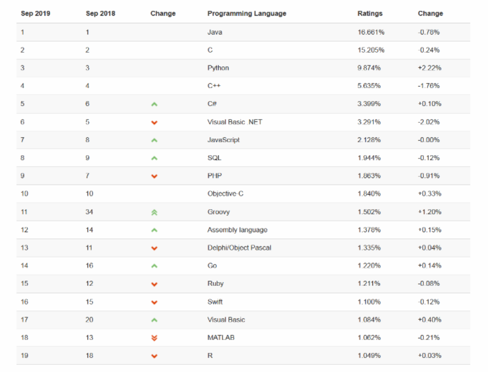
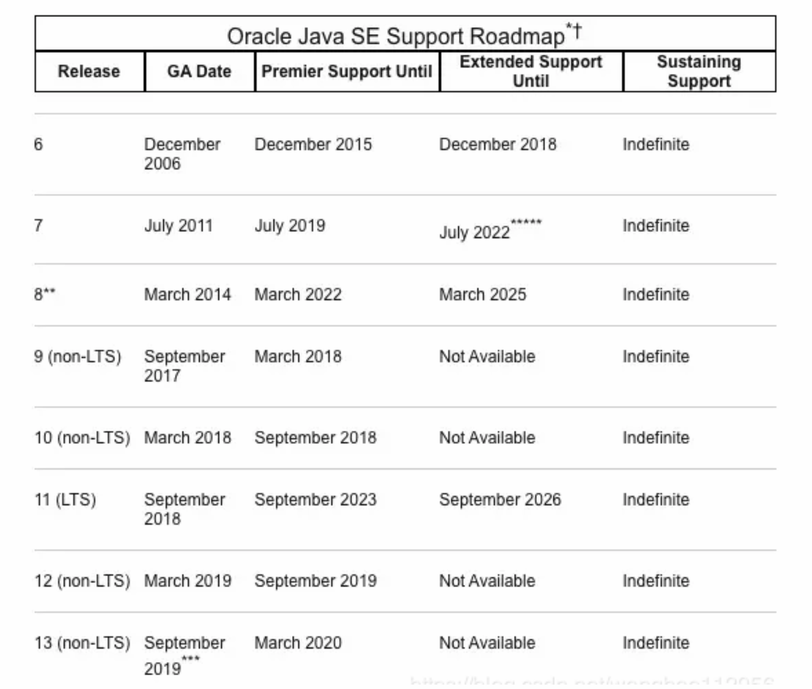
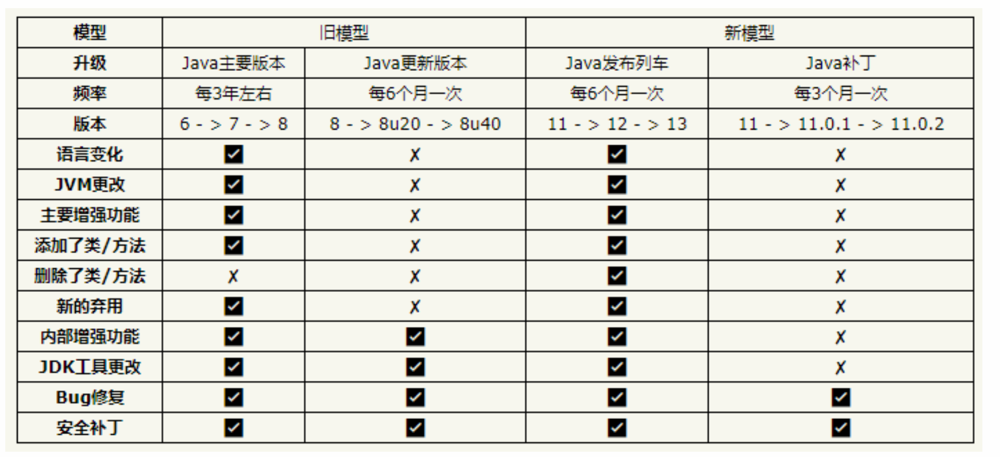
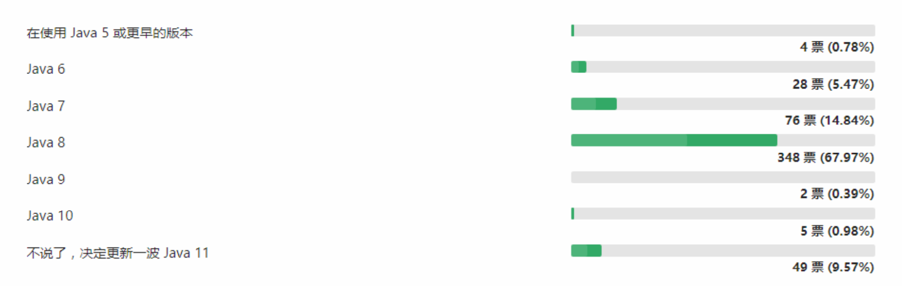

# 1 关于Java生态圈 
Java是目前应用最为广泛的软件开发平台之一。随着Java以及Java社区的不断壮大，Java 也早已不再是简简单单的一门计算机语言了，它更是一个平台、一种文化、一个社区。

**作为一个平台**，Java虚拟机扮演着举足轻重的作用。除了Java语言，任何一种能够被编译成字节码的计算机语言都属 于Java这个平台。Groovy、Scala、 JRuby、Kotlin等都是Java平台的一部分，它们依赖于Java虚拟机，同时，Java平台也因为它们变得更加丰富多彩。

**作为一种文化**，Java几乎成为了 “开源”的代名词。在Java程序中，有着数不清的开源软件和框架。如Tomcat、Struts、Hibernate、Spring等。就连JDK和JVM自身也有不少开源的实现，如OpenJDK、Apache Harmony。可以说，“共享”的精神在Java世界里体现得淋漓尽致。

**作为一个社区**，Java拥有全世界最多的技术拥护者和开源社区支持，有数不清的论坛和资料。从桌面应用软件、嵌入式开发到企业级应用、后台服务器、中间件，都可以看到Java的身影。其应用形式之复杂、参与人数之众多也令人咋舌。可以说，Java社区已经俨然成为了一个良好而庞大的生态系统。其实这才是Java最大的优势和财富。

看看最新的TIOBE 社区的语言热度排行榜:



Java 是最好的语言吗? 

不是，因为在每个领域都有更合适的编程语言。

- C 语言无疑是现代计算机软件编程语言的王者，几乎所有的操作系统都是 C 语言写成的。C++ 是面向对象的 C 语言，一直在不断的改进。
- JavaScript 是能运行在浏览器中的语言，丰富的前端界面离不开 Javascript 的功劳。近年来的 Node.js 又在后端占有一席之地。
- Python 用于系统管理，并通过高性能预编译的库，提供 API 来进行科学计算，文本处理等，是 Linux 必选的解释性语言。
- Ruby 强于 DSL(领域特定语言)，程序员可以定义丰富的语义来充分表达自己的思想。
- Erlang 就是为分布式计算设计的，能保证在大规模并发访问的情况下，保持强壮和稳定性。
- Go 语言内置了并发能力，可以编译成本地代码。当前新的网络相关项目，很大比例是由 Go 语言编写的，如 Docker、Kubernetes 等。
- 编写网页用 PHP，函数式编程有 Lisp，编写 iOS 程序有 Swift/Objective-C。

一句话概括，能留在排行榜之上的语言，都是好的语言，在其所在的领域能做到最好。 

Java 语言到底有什么优势?

- 其一，语法比较简单，学过计算机编程的开发者都能快速上手，Java是一门极好的初学者入门语言。和C/C++相比， Java在设计上有着绝对的优势，开发人员可以尽快从语言本身的复杂性中解脱出来，将更多的精力投向软件自身的业 务功能。
- 其二，在若干领域都有很强的竞争力，比如服务端编程，高性能网络程序，企业软件事务处理，分布式计算， Android 移动终端、嵌入式设备应用开发等等。

最重要的一点是符合工程学的需求，我们知道现代软件都是协同开发，那么代码可维护性，编译时检查，较为高效的运行效率，跨平台能力，丰富的 IDE，测试，项目管理工具配合。都使得 Java 成为企业软件公司的首选，也得到很多互联网公司的青睐。
- 其三，没有短板，容易从市场上找到 Java 软件工程师。软件公司选择 Java 作为主要开发语言，再在特定的领域使用其他语言协作编程，这样的组合选择，肯定是不会有大的问题。

所以综合而言，Java 语言全能方面是最好的。

随着 Java 每半年更新一次的脚步，Java 的新版本中也出现了越来越多与其他语言相似的特性，博采众长的 Java，还能继续保持生机。

但是，Java在不少地方依然受到了广大开发人员的诟病，它烦琐的语法经常受到Python等开发人员的耻笑。在语言的动态性上，甚至也远远不如和它年龄相仿的PHP语言。 但为了支持动态语言，Java虚拟机推出了新的函数调用指令 invokedynamic ，试图弥补Java在动态调用上的不足。


# 2 JDK各版本主要特性 
**JDK Version 1.0**

1996-01-23 Oak(橡树)
```java
初代版本，伟大的一个里程碑，但是是纯解释运行，使用外挂JIT，性能比较差，运行速度慢。
```

**JDK Version 1.1 **

1997-02-19
```java
JDBC(Java DataBase Connectivity); 
支持内部类;
RMI(Remote Method Invocation); 
反射;
Java Bean;
```

**JDK Version 1.2 **

1998-12-08 Playground(操场)
```java
集合框架;
JIT(Just In Time)编译器;
对打包的Java文件进行数字签名;
JFC(Java Foundation Classes), 包括Swing 1.0, 拖放和Java2D类库; 
Java插件; 
JDBC中引入可滚动结果集,BLOB,CLOB,批量更新和用户自定义类型; 
Applet中添加声音支持.
```
同时，Sun发布了 JSP/Servlet、EJB规范，以及将Java分成了 J2EE、J2SE和J2ME。 这表明了 Java开始向企业、桌面 应用和移动设备应用3大领域挺进。

**JDK Version 1.3 **

2000-05-08 Kestrel(红隼)
```java
Java Sound API;
jar文件索引; 
对Java的各个方面都做了大量优化和增强;
```
此时，Hotspot虚拟机成为Java的默认虚拟机。

**JDK Version 1.4 **

2002-02-13 Merlin(隼)
```java
断言;
XML处理; 
Java打印服务; 
Logging API; 
Java Web Start; 
JDBC 3.0 API; 
Preferences API; 
链式异常处理; 
支持IPV6;
支持正则表达式; 
引入Image I/O API
```
同时，古老的Classic虚拟机退出历史舞台。 一年后，Java平台的Scala正式发布，同年Groovy也加入了 Java阵营。

**JAVA 5 **

2004-09-30 Tiger(老虎)
```java
类型安全的枚举;
泛型;
自动装箱与自动拆箱; 
元数据(注解); 
增强循环,可以使用迭代方式; 
可变参数;
静态引入; 
Instrumentation;
```
同时JDK 1.5改名为J2SE 5.0。 

**JAVA 6**

2006-12-11 Mustang(野马)
```java
支持脚本语言;
JDBC 4.0 API;
Java Compiler API;
可插拔注解;
增加对Native PKI(Public Key Infrastructure), Java GSS(Generic Security Service),Kerberos和LDAP(Lightweight Directory Access Protocol)支持;
继承Web Services;
```

- 同年，Java开源并建立了 OpenJDK。顺理成章，Hotspot虚拟机也成为了 OpenJDK中的默认虚拟机。 
- 2007年，Java平台迎来了新伙伴Clojure。
- 2008 年，Oracle 收购了 BEA，得到了 JRockit 虚拟机。 
- 2009年，Twitter宣布把后台大部分程序从Ruby迁移到Scala，这是Java平台的又一次大规模应用。
- 2010年，Oracle收购了Sun，获得最具价值的Hotspot虚拟机。此时，Oracle拥有市场占用率最高的两款虚拟机 Hotspot和JRockit，并计划在未来对它们进行整合。

**JAVA 7**

2011-07-28 Dolphin(海豚)
```java
钻石型语法(在创建泛型对象时应用类型推断); 
支持try-with-resources(在一个语句块中捕获多种异常); 
switch语句块中允许以字符串作为分支条件;
引入Java NIO.2开发包;
在创建泛型对象时应用类型推断;
支持动态语言; 
数值类型可以用二进制字符串表示,并且可以在字符串表示中添加下划线; 
null值的自动处理;
```
在JDK 1.7中，正式启用了新的垃圾回收器G1，支持了64位系统的压缩指针。 

**JAVA 8**

2014-03-18
```markdown
Lambda 表达式 − Lambda允许把函数作为一个方法的参数(函数作为参数传递进方法中)。
方法引用 − 方法引用提供了非常有用的语法，可以直接引用已有Java类或对象(实例)的方法或构造器。与lambda联合使用，方法引用可以使语言的构造更紧凑简洁，减少冗余代码。
默认方法 − 默认方法就是一个在接口里面有了一个实现的方法。
新工具 − 新的编译工具，如:Nashorn引擎 jjs、 类依赖分析器jdeps。
Stream API −新添加的Stream API(java.util.stream) 把真正的函数式编程风格引入到Java中。 
Date Time API − 加强对日期与时间的处理。
Optional 类 − Optional 类已经成为 Java 8 类库的一部分，用来解决空指针异常。
Nashorn, JavaScript 引擎 − Java 8提供了一个新的Nashorn javascript引擎，它允许我们在JVM上运行特 定的javascript应用。
```

**JAVA 9 **

2017-09-22
```java
● 模块系统:模块是一个包的容器，Java 9 最大的变化之一是引入了模块系统(Jigsaw 项目)。 
● REPL (JShell):交互式编程环境。
● HTTP 2 客户端:HTTP/2标准是HTTP协议的最新版本，新的 HTTPClient API 支持 WebSocket 和 HTTP2 流 以及服务器推送特性。
● 改进的 Javadoc:Javadoc 现在支持在 API 文档中的进行搜索。另外，Javadoc 的输出现在符合兼容 HTML5 标准。
● 多版本兼容 JAR 包:多版本兼容 JAR 功能能让你创建仅在特定版本的 Java 环境中运行库程序时选择使用的 class 版本。
● 集合工厂方法:List，Set 和 Map 接口中，新的静态工厂方法可以创建这些集合的不可变实例。 
● 私有接口方法:在接口中使用private私有方法。我们可以使用 private 访问修饰符在接口中编写私有方法。
● 进程 API: 改进的 API 来控制和管理操作系统进程。引进 java.lang.ProcessHandle 及其嵌套接口 Info 来让开发者逃离时常因为要获取一个本地进程的 PID 而不得不使用本地代码的窘境。
● 改进的 Stream API:改进的 Stream API 添加了一些便利的方法，使流处理更容易，并使用收集器编写复杂的查 询。
● 改进 try-with-resources:如果你已经有一个资源是 final 或等效于 final 变量,您可以在 try-with- resources 语句中使用该变量，而无需在 try-with-resources 语句中声明一个新变量。
● 改进的弃用注解 @Deprecated:注解 @Deprecated  可以标记 Java API 状态，可以表示被标记的 API 将会被 移除，或者已经破坏。 
● 改进钻石操作符(Diamond Operator) :匿名类可以使用钻石操作符(Diamond Operator)。
● 改进 Optional 类:java.util.Optional 添加了很多新的有用方法，Optional 可以直接转为 stream。
● 多分辨率图像 API:定义多分辨率图像API，开发者可以很容易的操作和展示不同分辨率的图像了。
● 改进的 CompletableFuture API : CompletableFuture 类的异步机制可以在 ProcessHandle.onExit 方法退出时执行操作。
● 轻量级的 JSON API:内置了一个轻量级的JSON API
● 响应式流(Reactive Streams) API: Java 9中引入了新的响应式流 API 来支持 Java 9 中的响应式编程。
```

**JAVA 10 **

2018-03-21
```java
● JEP286，var 局部变量类型推断。
● JEP296，将原来用 Mercurial 管理的众多 JDK 仓库代码，合并到一个仓库中，简化开发和管理过程
● JEP304，统一的垃圾回收接口。
● JEP307，G1 垃圾回收器的并行完整垃圾回收，实现并行性来改善最坏情况下的延迟。
● JEP310，应用程序类数据 (AppCDS) 共享，通过跨进程共享通用类元数据来减少内存占用空间，和减少启动时间。
● JEP312，ThreadLocal 握手交互。在不进入到全局 JVM 安全点 (Safepoint) 的情况下，对线程执行回调。优 化可以只停止单个线程，而不是停全部线程或一个都不停。
● JEP313，移除 JDK 中附带的 javah 工具。可以使用 javac -h 代替。
● JEP314，使用附加的 Unicode 语言标记扩展。
● JEP317，能将堆内存占用分配给用户指定的备用内存设备。
● JEP317，使用 Graal 基于 Java 的编译器，可以预先把 Java 代码编译成本地代码来提升效能。
● JEP318，在 OpenJDK 中提供一组默认的根证书颁发机构证书。开源目前 Oracle 提供的的 Java SE 的根证 书，这样 OpenJDK 对开发人员使用起来更方便。
● JEP322，基于时间定义的发布版本，即上述提到的发布周期。版本号为 

$$
FEATURE.$INTERIM.$UPDATE.
$$
PATCH，分别是大版本，中间版本，升级包和补丁版本。
```

**JAVA 11 **

2018-09-25
```java
● 181: Nest-Based Access Control(基于嵌套的访问控制)
● 309: Dynamic Class-File Constants(动态的类文件常量)
● 315: Improve Aarch64 Intrinsics(改进 Aarch64 Intrinsics)
● 318: Epsilon: A No-Op Garbage Collector(Epsilon 垃圾回收器，又被称为"No-Op(无操作)"回收 器)
● 320: Remove the Java EE and CORBA Modules(移除 Java EE 和 CORBA 模块，JavaFX 也已被移除)
● 321: HTTP Client (Standard)
● 323: Local-Variable Syntax for Lambda Parameters(用于 Lambda 参数的局部变量语法)
● 324: Key Agreement with Curve25519 and Curve448(采用 Curve25519 和 Curve448 算法实现的密 钥协议)
● 327: Unicode 10
● 328: Flight Recorder(飞行记录仪)
● 329: ChaCha20 and Poly1305 Cryptographic Algorithms(实现 ChaCha20 和 Poly1305 加密算法) 
● 330: Launch Single-File Source-Code Programs(启动单个 Java 源代码文件的程序)
● 331: Low-Overhead Heap Profiling(低开销的堆分配采样方法) 
● 332: Transport Layer Security (TLS) 1.3(对 TLS 1.3 的支持)
● 333: ZGC: A Scalable Low-Latency Garbage Collector (Experimental)(ZGC:可伸缩的低延迟垃圾 回收器，处于实验性阶段)
● 335: Deprecate the Nashorn JavaScript Engine(弃用 Nashorn JavaScript 引擎) 
● 336: Deprecate the Pack200 Tools and API(弃用 Pack200 工具及其 API)
```


# 3 Java 发布计划

## 3.1 JDK 各版本支持周期


为了更快地迭代，Java的更新从传统的以**特性驱动**的发布周期，转变为以**时间驱动**的(6 个月为周期)发布模式 —— 每半年发布一个大版本，每个季度发布一个中间特性版本，并且承诺不会跳票。通过这样的方式，开发团队可以把一 些关键特性尽早合并到 JDK 之中，以快速得到开发者反馈，在一定程度上避免出现像 Java 9 这样两次被迫延迟发布 的窘况。

按照官方的说法，新的发布周期会严格遵循时间点，将于每年的3月份和9月份发布。所以 Java 11 的版本号是 18.9(LTS，long term support)。Oracle 直到2023年9月都会为 Java 11 提供技术支持，而补丁和安全警告等扩展支 持将持续到2026年。

新的长期支持版本每三年发布一次，根据后续的发布计划，下一个长期支持版 Java 17 将于2021年发布。 

## 3.2 版本升级的破坏性


Oracle 的官方观点认为:与 `Java 7->8->9`相比，`Java 9->10->11`的升级和 `8->8u20->8u40`更相似。

表格清楚地显示新模式下的 Java 版本发布都会包含许多变更，包括语言变更和 JVM 变更，这两者都会对 IDE、字节码库和框架产生重大影响。此外，不仅会新增其他 API，还会有 API 被删除(这在 Java 8 之前没有发生过)。

Oracle 的观点是，因为每个版本仅在前一个版本发布后的 6 个月推出，所以不会有太多新的“东西”，因此升级并不困 难。虽然如此，但这不是重点。重要的是升级是否有可能会破坏代码。很明显，从`11 -> 12 -> 13`开始，代码遭受破 坏的可能性要大于`8 -> 8u20 -> 8u40`。

`11 -> 12 -> 13` 与 `8u20 -> 8u40` 等这样的更新主要区别在于对字节码版本的更改以及对规范的更改，对字节码版本的 更改往往特别具有破坏性，大多数框架都大量使用与每个字节码版本密切相关的 ASM 或 ByteBuddy 等库。而`8u20 -> 8u40`仍然使用相同的 Java SE 规范，具有所有相同的类和方法，不同于从 Java 12 移动到 13。

除此之外，Oracle 的另一个声明也十分值得我们关注。声明透露出的消息是，如果坚持使用 Java 11 并计划在下一个 LTS 版本(即 Java 17)发布时再进行升级，开发者可能会发现自己的项目代码无法通过编译。所以请记住，Java 新的 开发规则现在声明可以在一个版本中弃用某个 API 方法，并在下一个版本中删除它。因此，一个方法可以在13中弃 用并在15中删除。有人从11升级到17只会找到一个从未见过弃用的已删除API。


## 3.3 目前企业JDK版本使用统计 
下图是开源中国 2018年09月统计的数据，样本512人



# 4 JDK的下载与安装
JDK下载页

[Download the Latest Java LTS Free](https://www.oracle.com/technetwork/java/javase/downloads/index.html)

