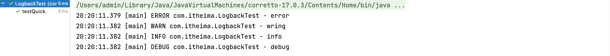
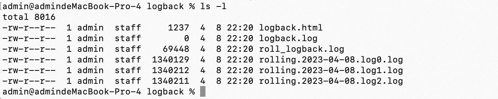
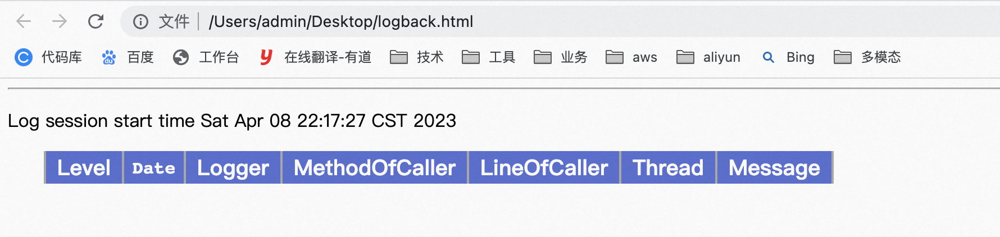
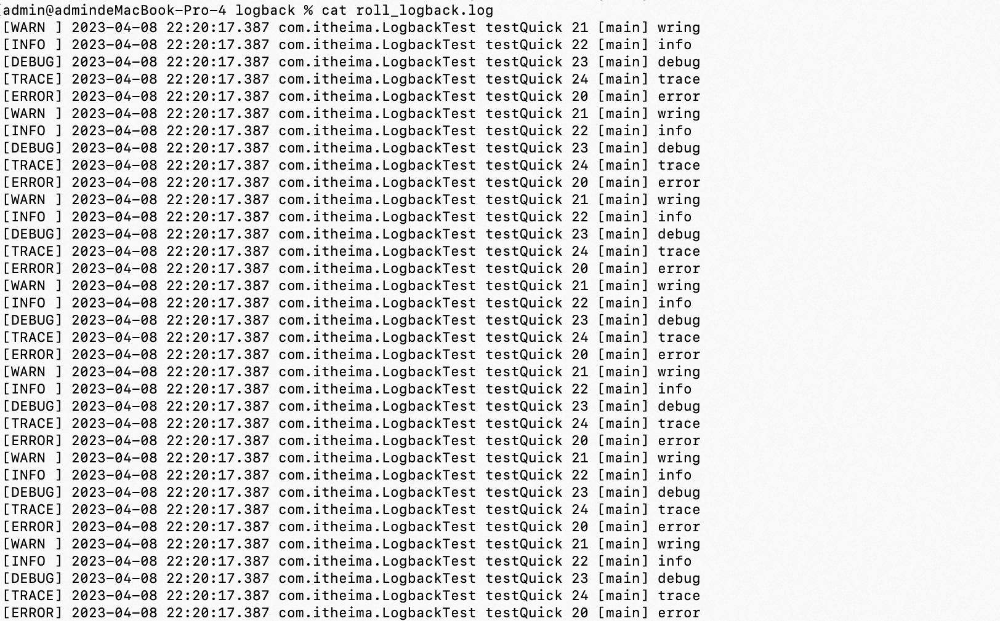
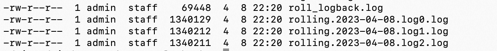
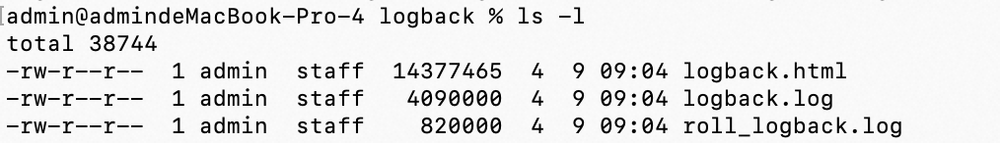
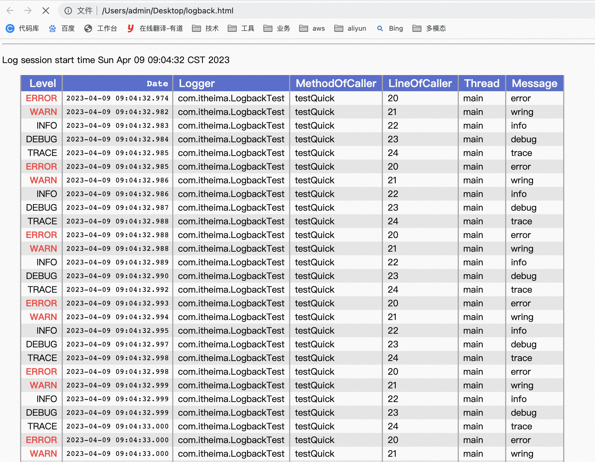
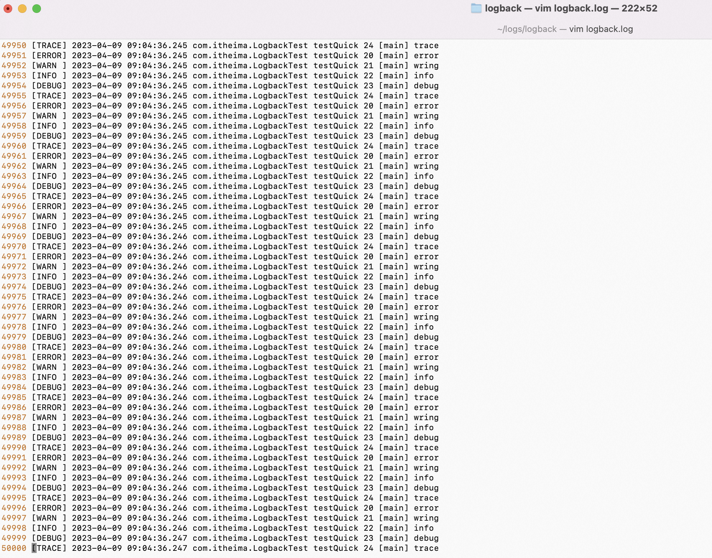
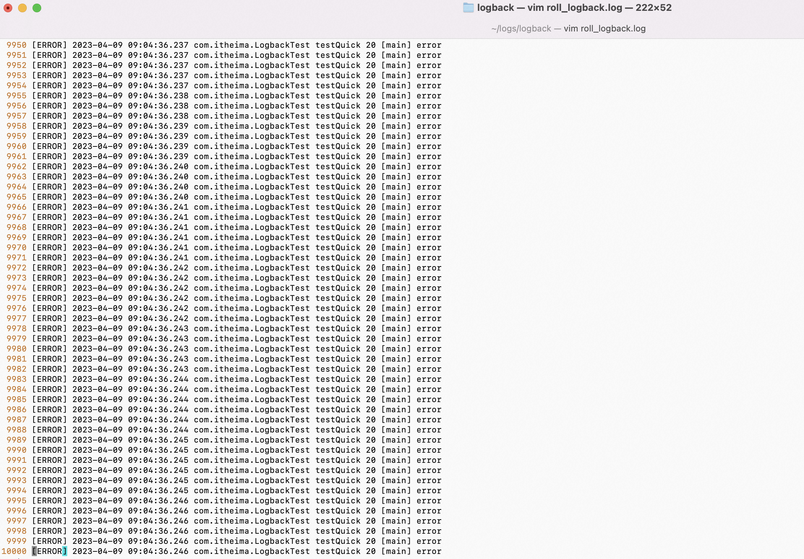
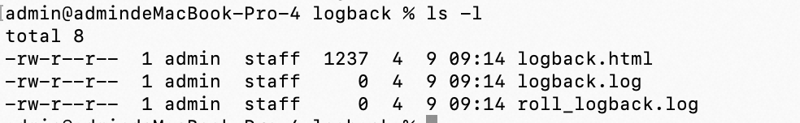

**<font style="color:#DF2A3F;">笔记来源：</font>**[**<font style="color:#DF2A3F;">黑马程序员java日志框架教程，全面深入学习多种java日志框架</font>**](https://www.bilibili.com/video/BV1iJ411H74S/?p=10&spm_id_from=pageDriver&vd_source=e8046ccbdc793e09a75eb61fe8e84a30)


前言

Logback是由log4j创始人设计的另一个开源日志组件，性能比log4j要好。  
官方网站：

[Logback Home](https://logback.qos.ch/index.html)

Logback主要分为三个模块：

+ logback-core：其它两个模块的基础模块 
+ logback-classic：它是log4j的一个改良版本，同时它完整实现了slf4j API 
+ logback-access：访问模块与Servlet容器集成提供通过Http来访问日志的功能

后续的日志代码都是通过SLF4J日志门面搭建日志系统，所以在代码是没有区别，主要是通过修改配置文件和pom.xml依赖

# 1 logback入门 
1. 添加依赖

```xml
<dependencies>
    <!--slf4j 日志门面-->
    <dependency>
        <groupId>org.slf4j</groupId>
        slf4j-api</artifactId>
        <version>1.7.26</version>
    </dependency>

    <!--logback 日志实现-->
    <dependency>
        <groupId>ch.qos.logback</groupId>
        logback-classic</artifactId>
        <version>1.2.3</version>
    </dependency>
    
    <!--junti 单元测试-->
    <dependency>
        <groupId>junit</groupId>
        junit</artifactId>
        <version>4.12</version>
    </dependency>
</dependencies>
```

2. java代码

```java
package com.itheima;

import org.junit.Test;
import org.slf4j.Logger;
import org.slf4j.LoggerFactory;

public class LogbackTest {

    public static final Logger LOGGER = LoggerFactory.getLogger(LogbackTest.class);

    // 快速入门
    @Test
    public void testQuick()throws Exception{
            // 日志输出
            LOGGER.error("error");
            LOGGER.warn("wring");
            LOGGER.info("info");
            LOGGER.debug("debug");// 默认级别
            LOGGER.trace("trace");
    }
}

```

3. 输出



# 2 logback配置 
logback会依次读取以下类型配置文件：

+ logback.groovy
+ logback-test.xml
+ logback.xml 

如果均不存在会采用默认配置


**logback组件之间的关系**

1. Logger：日志的记录器，把它关联到应用的对应的context上后，主要用于存放日志对象，也 可以定义日志类型、级别。
2. Appender：用于指定日志输出的目的地，目的地可以是控制台、文件、数据库等等。
3. Layout：负责把事件转换成字符串，格式化的日志信息的输出。在logback中Layout对象被封装在encoder中。 


**基本配置信息**

```xml
<?xml version="1.0" encoding="UTF-8"?>
<configuration>
	<!--
    	日志输出格式:
    	%-5level
        %d{yyyy-MM-dd HH:mm:ss.SSS}日期
     	%c类的完整名称
    	%M为method 
    	%L为行号 
    	%thread线程名称
    	%m或者%msg为信息
    	%n换行 
    -->
    <!--格式化输出:%d表示日期，%thread表示线程名，%-5level:级别从左显示5个字符宽度 %msg:日志消息，%n是换行符-->
    <property name="pattern" value="%d{yyyy-MM-dd HH:mm:ss.SSS} %c [%thread] %-5level  %msg%n"/>
    
    <!--
    	Appender：设置日志信息的去向,常用的有以下几个
    			  ch.qos.logback.core.ConsoleAppender (控制台)
				  ch.qos.logback.core.rolling.RollingFileAppender (文件大小到达指定尺 寸的时候产生一个新文件)
				  ch.qos.logback.core.FileAppender (文件)
	-->
	 
        <!--输出流对象 默认 System.out 改为 System.err--> 
        <target>System.err</target>
		<!--日志格式配置-->
        <encoder class="ch.qos.logback.classic.encoder.PatternLayoutEncoder">
            <pattern>${pattern}</pattern>
        </encoder>
	</appender>
	
    <!-- 
    	用来设置某一个包或者具体的某一个类的日志打印级别、以及指定。 
    	<loger>仅有一个name属性，一个可选的level和一个可选的addtivity属性 
    	name：用来指定受此logger约束的某一个包或者具体的某一个类。 
    	level：用来设置打印级别，大小写无关:TRACE, DEBUG, INFO, WARN, ERROR, ALL 和 OFF
    		   如果未设置此属性，那么当前logger将会继承上级的级别。 
    	additivity：是否向上级loger传递打印信息。默认是true。 
    	<logger>可以包含零个或多个元素，标识这个appender将会添加到这个logger 
    -->
	<!--
		root也是<logger>元素，但是它是根logger。默认debug 
    	level：用来设置打印级别，大小写无关:TRACE, DEBUG, INFO, WARN, ERROR, ALL 和 OFF
		<root>可以包含零个或多个元素，标识这个appender将会添加到这个logger。 
    -->
    <root level="ALL">
        
    </root>
</configuration>
```

 	 	 		

**<font style="color:rgb(20.000000%, 20.000000%, 20.000000%);">FileAppender配置</font>**

```xml
<?xml version="1.0" encoding="UTF-8"?>
<configuration>
    <!-- 自定义属性 可以通过${name}进行引用 -->
    <property name="pattern" value="[%-5level] %d{yyyy-MM-dd HH:mm:ss} %c %M %L [%thread] %m %n"/>
    
    <!--
    	日志输出格式: 
    		%d{pattern}日期
    		%m或者%msg为信息 
    		%M为method 
    		%L为行号
			%c类的完整名称 
    		%thread线程名称 
    		%n换行 
    		%-5level
    -->
    
    <!-- 日志文件存放目录 -->
    <property name="log_dir" value="d:/logs"></property>
    
    <!--控制台输出appender对象-->
    
        <!--输出流对象 默认 System.out 改为 System.err--> 
        <target>System.err</target>
        <!--日志格式配置-->
        <encoder class="ch.qos.logback.classic.encoder.PatternLayoutEncoder">
            <pattern>${pattern}</pattern>
        </encoder>
    </appender>
    
    <!--日志文件输出appender对象-->
    
        <!--日志格式配置-->
        <encoder class="ch.qos.logback.classic.encoder.PatternLayoutEncoder">
            <pattern>${pattern}</pattern>
        </encoder>
        <!--日志输出路径-->
        <file>${log_dir}/logback.log</file>
    </appender>
    
    <!-- 生成html格式appender对象 -->
    
        <!--日志格式配置-->
        <encoder class="ch.qos.logback.core.encoder.LayoutWrappingEncoder">
            <layout class="ch.qos.logback.classic.html.HTMLLayout">
                <pattern>%level%d{yyyy-MM-dd HH:mm:ss}%c%M%L%thread%m</pattern>
            </layout>
        </encoder>
        <!--日志输出路径-->
        <file>${log_dir}/logback.html</file>
    </appender>
    
    <!--RootLogger对象--> 
    <root level="all">
        
        
        
    </root>
</configuration>
```

<font style="color:rgb(20.000000%, 20.000000%, 20.000000%);"></font>

**<font style="color:rgb(20.000000%, 20.000000%, 20.000000%);">RollingFileAppender配置</font>**** **

```xml
<?xml version="1.0" encoding="UTF-8"?>
<configuration>
    <!-- 自定义属性 可以通过${name}进行引用 -->
    <property name="pattern" value="[%-5level] %d{yyyy-MM-dd HH:mm:ss} %c %M %L [%thread] %m %n"/>
    
    <!--
    	日志输出格式: 
    		%d{pattern}日期
    		%m或者%msg为信息 
    		%M为method 
    		%L为行号 
    		%c类的完整名称 
    		%thread线程名称 
    		%n换行
    		%-5level
    -->
    
    <!-- 日志文件存放目录 -->
    <property name="log_dir" value="d:/logs"></property>
    
    <!--控制台输出appender对象-->
    
        <!--输出流对象 默认 System.out 改为 System.err--> 
        <target>System.err</target>
        <!--日志格式配置-->
        <encoder class="ch.qos.logback.classic.encoder.PatternLayoutEncoder">
            <pattern>${pattern}</pattern>
        </encoder>
    </appender>
    
    <!-- 日志文件拆分和归档的appender对象-->
    
        <!--日志格式配置-->
        <encoder class="ch.qos.logback.classic.encoder.PatternLayoutEncoder">
            <pattern>${pattern}</pattern>
        </encoder>
        <!--日志输出路径--> 
        <file>${log_dir}/roll_logback.log</file> 
        <!--指定日志文件拆分和压缩规则--> 
        <rollingPolicy class="ch.qos.logback.core.rolling.SizeAndTimeBasedRollingPolicy"> 
            <!--通过指定压缩文件名称，来确定分割文件方式-->
            <fileNamePattern>${log_dir}/rolling.%d{yyyy-MM-dd}.log%i.gz</fileNamePattern>
            <!--文件拆分大小-->
            <maxFileSize>1MB</maxFileSize>
        </rollingPolicy>
    </appender>
    
    <!--RootLogger对象--> 
    <root level="all">
        
        
    </root>
    
</configuration>
```


**Filter和异步日志配置**

```xml
<?xml version="1.0" encoding="UTF-8"?>
<configuration>
    
    <!-- 自定义属性 可以通过${name}进行引用-->
    <property name="pattern" value="[%-5level] %d{yyyy-MM-dd HH:mm:ss} %c %M %L [%thread] %m %n"/>
    
    <!--
    	日志输出格式: 
    		%d{pattern}日期
    		%m或者%msg为信息 
    		%M为method 
    		%L为行号 
    		%c类的完整名称 
    		%thread线程名称 
    		%n换行
    		%-5level
    -->
    
    <!-- 日志文件存放目录 -->
    <property name="log_dir" value="d:/logs/"></property>
    
    <!--控制台输出appender对象-->
    
        <!--输出流对象 默认 System.out 改为 System.err--> 
        <target>System.err</target>
        <!--日志格式配置-->
        <encoder class="ch.qos.logback.classic.encoder.PatternLayoutEncoder">
            <pattern>${pattern}</pattern>
        </encoder>
    </appender>
    
    <!-- 日志文件拆分和归档的appender对象-->
    
        <!--日志格式配置-->
        <encoder class="ch.qos.logback.classic.encoder.PatternLayoutEncoder">
            <pattern>${pattern}</pattern>
        </encoder>
        <!--日志输出路径--> 
        <file>${log_dir}roll_logback.log</file> 
        <!--指定日志文件拆分和压缩规则--> 
        <rollingPolicy class="ch.qos.logback.core.rolling.SizeAndTimeBasedRollingPolicy"> 
            <!--通过指定压缩文件名称，来确定分割文件方式-->
            <fileNamePattern>${log_dir}rolling.%d{yyyy-MM-dd}.log%i.gz</fileNamePattern>
            <!--文件拆分大小-->
            <maxFileSize>1MB</maxFileSize>
        </rollingPolicy>
        <!--filter配置-->
        <filter class="ch.qos.logback.classic.filter.LevelFilter">
            <!--设置拦截日志级别--> 
            <level>error</level> 
            <onMatch>ACCEPT</onMatch>
            <onMismatch>DENY</onMismatch>
        </filter>
    </appender>
    
    <!--异步日志-->
    
        
    </appender>
    
    <!--RootLogger对象--> 
    <root level="all">
        
        
    </root>
    
    <!--自定义logger additivity表示是否从 rootLogger继承配置--> 
    <logger name="com.itheima" level="debug" additivity="false">
        
    </logger>
    
</configuration>
```

官方提供的log4j.properties转换成logback.xml 

[log4j.properties Translator](https://logback.qos.ch/translator/)

# 3 logback-access的使用 
logback-access模块与Servlet容器(如Tomcat和Jetty)集成，以提供HTTP访问日志功能。我们可以使  
用logback-access模块来替换tomcat的访问日志。

1. 将logback-access.jar与logback-core.jar复制到$TOMCAT_HOME/lib/目录下
2. 修改$TOMCAT_HOME/conf/server.xml中的Host元素中添加：

```xml
<Valve className="ch.qos.logback.access.tomcat.LogbackValve" />
```

3. logback默认会在$TOMCAT_HOME/conf下查找文件 logback-access.xml

```xml
<?xml version="1.0" encoding="UTF-8"?>
<configuration>
    <!-- always a good activate OnConsoleStatusListener -->
    <statusListener
        class="ch.qos.logback.core.status.OnConsoleStatusListener"/>
    
    <property name="LOG_DIR" value="${catalina.base}/logs"/>
    
    
        <file>${LOG_DIR}/access.log</file>
        <rollingPolicy
            class="ch.qos.logback.core.rolling.TimeBasedRollingPolicy">
            <fileNamePattern>access.%d{yyyy-MM-dd}.log.zip</fileNamePattern>
        </rollingPolicy>
        <encoder>
            <!-- 访问日志的格式 --> 
            <pattern>combined</pattern>
        </encoder>
    </appender>
    
    
</configuration>
```

4. 官方配置: 

[Logback-access](https://logback.qos.ch/access.html#configuration)

# 4 案例讲解
```java
package com.itheima;

import org.junit.Test;
import org.slf4j.Logger;
import org.slf4j.LoggerFactory;

public class LogbackTest {

    public static final Logger LOGGER = LoggerFactory.getLogger(LogbackTest.class);


    // 快速入门
    @Test
    public void testQuick()throws Exception{


        for (int i = 0; i < 10000; i++) {

            // 日志输出
            LOGGER.error("error");
            LOGGER.warn("wring");
            LOGGER.info("info");
            LOGGER.debug("debug");// 默认级别
            LOGGER.trace("trace");
        }

    }
}

```

```xml
<?xml version="1.0" encoding="UTF-8"?>
<configuration>

    <!--
        配置集中管理属性
        我们可以直接改属性的 value 值
        格式：${name}
    -->
    <property name="pattern" value="[%-5level] %d{yyyy-MM-dd HH:mm:ss.SSS} %c %M %L [%thread] %m%n"></property>
    <!--
    日志输出格式：
        %-5level
        %d{yyyy-MM-dd HH:mm:ss.SSS}日期
        %c类的完整名称
        %M为method
        %L为行号
        %thread线程名称
        %m或者%msg为信息
        %n换行
      -->
    <!--定义日志文件保存路径属性-->
    <property name="log_dir" value="/Users/admin/logs/logback"></property>


    <!--控制台日志输出的 appender-->
    
        <!--控制输出流对象 默认 System.out 改为 System.err-->
        <target>System.err</target>
        <!--日志消息格式配置-->
        <encoder class="ch.qos.logback.classic.encoder.PatternLayoutEncoder">
            <pattern>${pattern}</pattern>
        </encoder>
    </appender>

    <!--日志文件输出的 appender-->
    
        <!--日志文件保存路径-->
        <file>${log_dir}/logback.log</file>
        <!--日志消息格式配置-->
        <encoder class="ch.qos.logback.classic.encoder.PatternLayoutEncoder">
            <pattern>${pattern}</pattern>
        </encoder>
    </appender>

    <!--html 格式日志文件输出 appender-->
    
        <!--日志文件保存路径-->
        <file>${log_dir}/logback.html</file>
        <!--html 消息格式配置-->
        <encoder class="ch.qos.logback.core.encoder.LayoutWrappingEncoder">
            <layout class="ch.qos.logback.classic.html.HTMLLayout">
                <pattern>%-5level%d{yyyy-MM-dd HH:mm:ss.SSS}%c%M%L%thread%m</pattern>
            </layout>
        </encoder>
    </appender>


    <!--日志拆分和归档压缩的 appender 对象-->
    
        <!--日志文件保存路径-->
        <file>${log_dir}/roll_logback.log</file>
        <!--日志消息格式配置-->
        <encoder class="ch.qos.logback.classic.encoder.PatternLayoutEncoder">
            <pattern>${pattern}</pattern>
        </encoder>
        <!--指定拆分规则-->
        <rollingPolicy class="ch.qos.logback.core.rolling.SizeAndTimeBasedRollingPolicy">
            <!--按照时间和压缩格式声明拆分的文件名-->
            <fileNamePattern>${log_dir}/rolling.%d{yyyy-MM-dd}.log%i.log</fileNamePattern>
            <!--按照文件大小拆分-->
            <maxFileSize>1MB</maxFileSize>
        </rollingPolicy>
        <!--日志级别过滤器-->
<!--        <filter class="ch.qos.logback.classic.filter.LevelFilter">-->
<!--            &lt;!&ndash;日志过滤规则&ndash;&gt;-->
<!--            <level>ERROR</level>-->
<!--            <onMatch>ACCEPT</onMatch>-->
<!--            <onMismatch>DENY</onMismatch>-->
<!--        </filter>-->
    </appender>

    <!--异步日志-->
    
        <!--指定某个具体的 appender-->
        
    </appender>


    <!--root logger 配置-->
    <root level="ALL">
        
        
    </root>

    <!--自定义 looger 对象
        additivity="false" 自定义 logger 对象是否继承 rootLogger
     -->
<!--    <logger name="com.itheima" level="info" additivity="false">-->
<!--        -->
<!--    </logger>-->
</configuration>
```

生成的文件



其中logback.log文件为空，是因为我们在root里面没有引用name为file的appender

logback.html也为空，因为我们在root里面也没有引用name为htmlFile的appender，logback.html的内容为



roll_logback.log文件内容如下：



这个是rollFile这个appender生成的，其中还拆分出了以下三个文件



现在将配置文件改为

```xml
<?xml version="1.0" encoding="UTF-8"?>
<configuration>

    <!--
        配置集中管理属性
        我们可以直接改属性的 value 值
        格式：${name}
    -->
    <property name="pattern" value="[%-5level] %d{yyyy-MM-dd HH:mm:ss.SSS} %c %M %L [%thread] %m%n"></property>
    <!--
    日志输出格式：
        %-5level
        %d{yyyy-MM-dd HH:mm:ss.SSS}日期
        %c类的完整名称
        %M为method
        %L为行号
        %thread线程名称
        %m或者%msg为信息
        %n换行
      -->
    <!--定义日志文件保存路径属性-->
    <property name="log_dir" value="/Users/admin/logs/logback"></property>


    <!--控制台日志输出的 appender-->
    
        <!--控制输出流对象 默认 System.out 改为 System.err-->
        <target>System.err</target>
        <!--日志消息格式配置-->
        <encoder class="ch.qos.logback.classic.encoder.PatternLayoutEncoder">
            <pattern>${pattern}</pattern>
        </encoder>
    </appender>

    <!--日志文件输出的 appender-->
    
        <!--日志文件保存路径-->
        <file>${log_dir}/logback.log</file>
        <!--日志消息格式配置-->
        <encoder class="ch.qos.logback.classic.encoder.PatternLayoutEncoder">
            <pattern>${pattern}</pattern>
        </encoder>
    </appender>

    <!--html 格式日志文件输出 appender-->
    
        <!--日志文件保存路径-->
        <file>${log_dir}/logback.html</file>
        <!--html 消息格式配置-->
        <encoder class="ch.qos.logback.core.encoder.LayoutWrappingEncoder">
            <layout class="ch.qos.logback.classic.html.HTMLLayout">
                <pattern>%-5level%d{yyyy-MM-dd HH:mm:ss.SSS}%c%M%L%thread%m</pattern>
            </layout>
        </encoder>
    </appender>


    <!--日志拆分和归档压缩的 appender 对象-->
    
        <!--日志文件保存路径-->
        <file>${log_dir}/roll_logback.log</file>
        <!--日志消息格式配置-->
        <encoder class="ch.qos.logback.classic.encoder.PatternLayoutEncoder">
            <pattern>${pattern}</pattern>
        </encoder>
        <!--指定拆分规则-->
        <rollingPolicy class="ch.qos.logback.core.rolling.SizeAndTimeBasedRollingPolicy">
            <!--按照时间和压缩格式声明拆分的文件名-->
            <fileNamePattern>${log_dir}/rolling.%d{yyyy-MM-dd}.log%i.log</fileNamePattern>
            <!--按照文件大小拆分-->
            <maxFileSize>1MB</maxFileSize>
        </rollingPolicy>
        <!--日志级别过滤器-->
        <filter class="ch.qos.logback.classic.filter.LevelFilter">
            <!--日志过滤规则-->
            <level>ERROR</level>
            <onMatch>ACCEPT</onMatch>
            <onMismatch>DENY</onMismatch>
        </filter>
    </appender>

    <!--异步日志-->
    
        <!--指定某个具体的 appender-->
        
    </appender>


    <!--root logger 配置-->
    <root level="ALL">
        
        
        
        
    </root>

    <!--自定义 looger 对象
        additivity="false" 自定义 logger 对象是否继承 rootLogger
     -->
<!--    <logger name="com.itheima" level="info" additivity="false">-->
<!--        -->
<!--    </logger>-->
</configuration>
```

输出文件为：



先来看看logback.html文件



再来看看logback.log



刚好有5万行日志

最后我们来看看roll_logback.log 



由于我们配置了过滤器，所以此文件中只有error级别以上的日志，其他级别的都是没有的。

最后，我们再来看看自定义looger对象

```xml
<?xml version="1.0" encoding="UTF-8"?>
<configuration>

    <!--
        配置集中管理属性
        我们可以直接改属性的 value 值
        格式：${name}
    -->
    <property name="pattern" value="[%-5level] %d{yyyy-MM-dd HH:mm:ss.SSS} %c %M %L [%thread] %m%n"></property>
    <!--
    日志输出格式：
        %-5level
        %d{yyyy-MM-dd HH:mm:ss.SSS}日期
        %c类的完整名称
        %M为method
        %L为行号
        %thread线程名称
        %m或者%msg为信息
        %n换行
      -->
    <!--定义日志文件保存路径属性-->
    <property name="log_dir" value="/Users/admin/logs/logback"></property>


    <!--控制台日志输出的 appender-->
    
        <!--控制输出流对象 默认 System.out 改为 System.err-->
        <target>System.err</target>
        <!--日志消息格式配置-->
        <encoder class="ch.qos.logback.classic.encoder.PatternLayoutEncoder">
            <pattern>${pattern}</pattern>
        </encoder>
    </appender>

    <!--日志文件输出的 appender-->
    
        <!--日志文件保存路径-->
        <file>${log_dir}/logback.log</file>
        <!--日志消息格式配置-->
        <encoder class="ch.qos.logback.classic.encoder.PatternLayoutEncoder">
            <pattern>${pattern}</pattern>
        </encoder>
    </appender>

    <!--html 格式日志文件输出 appender-->
    
        <!--日志文件保存路径-->
        <file>${log_dir}/logback.html</file>
        <!--html 消息格式配置-->
        <encoder class="ch.qos.logback.core.encoder.LayoutWrappingEncoder">
            <layout class="ch.qos.logback.classic.html.HTMLLayout">
                <pattern>%-5level%d{yyyy-MM-dd HH:mm:ss.SSS}%c%M%L%thread%m</pattern>
            </layout>
        </encoder>
    </appender>


    <!--日志拆分和归档压缩的 appender 对象-->
    
        <!--日志文件保存路径-->
        <file>${log_dir}/roll_logback.log</file>
        <!--日志消息格式配置-->
        <encoder class="ch.qos.logback.classic.encoder.PatternLayoutEncoder">
            <pattern>${pattern}</pattern>
        </encoder>
        <!--指定拆分规则-->
        <rollingPolicy class="ch.qos.logback.core.rolling.SizeAndTimeBasedRollingPolicy">
            <!--按照时间和压缩格式声明拆分的文件名-->
            <fileNamePattern>${log_dir}/rolling.%d{yyyy-MM-dd}.log%i.log</fileNamePattern>
            <!--按照文件大小拆分-->
            <maxFileSize>1MB</maxFileSize>
        </rollingPolicy>
        <!--日志级别过滤器-->
        <filter class="ch.qos.logback.classic.filter.LevelFilter">
            <!--日志过滤规则-->
            <level>ERROR</level>
            <onMatch>ACCEPT</onMatch>
            <onMismatch>DENY</onMismatch>
        </filter>
    </appender>

    <!--异步日志-->
    
        <!--指定某个具体的 appender-->
        
    </appender>


    <!--root logger 配置-->
    <root level="ALL">
        
        
        
        
    </root>

    <!--自定义 looger 对象
        additivity="false" 自定义 logger 对象是否继承 rootLogger
     -->
    <logger name="com.itheima" level="info" additivity="false">
        
    </logger>
</configuration>
```

此时生成三个文件：



我们发现，三个文件都是空的，因为我们配置的logger对象是com.itheima，而且只在console上打印。且日志级别是info以上。

看下控制台，没有trace和debug级别的日志。


