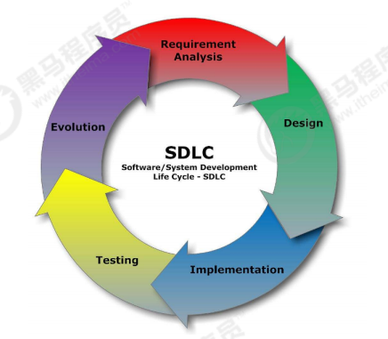
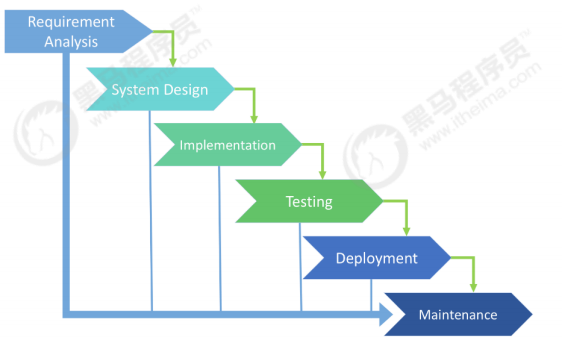
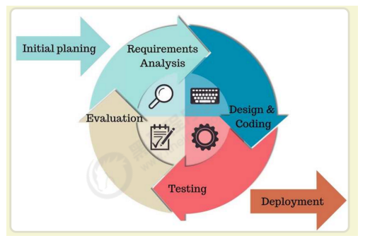
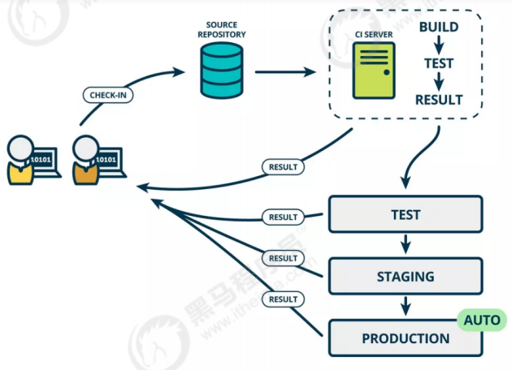
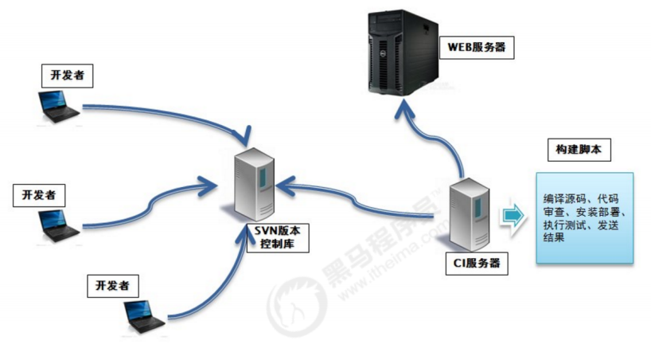

**笔记来源：**[08.Jenkins软件介绍_哔哩哔哩_bilibili](https://www.bilibili.com/video/BV1kJ411p7mV?spm_id_from=333.788.videopod.episodes&vd_source=e8046ccbdc793e09a75eb61fe8e84a30&p=8)

------

# 1 软件开发生命周期
软件开发生命周期又叫做 **SDLC**（Software Development Life Cycle），它是集合了计划、开发、测试 和部署过程的集合。如下图所示 ：

1. **需求分析**：这是生命周期的第一阶段，根据项目需求，团队执行一个可行性计划的分析。项目需求可能是公司内部或者客户提出的。这阶段主要是对信息的收集，也有可能是对现有项目的改善和重新做一个新的项目。 还要分析项目的预算多长，可以从哪方面受益及布局，这也是项目创建的目标。
2. **设计**：第二阶段就是设计阶段，系统架构和满意状态（就是要做成什么样子，有什么功能），和创建一个项目计划。计划可以使用图表，布局设计或者文者的方式呈现。
3. **实现**：第三阶段就是实现阶段，项目经理创建和分配工作给开者，开发者根据任务和在设计阶段定义的目标进行开发代码。依据项目的大小和复杂程度，可以需要数月或更长时间才能完成。
4. **测试**：测试人员进行代码测试 ，包括功能测试、代码测试、压力测试等。
5. **进化**：最后进阶段就是对产品不断的进化改进和维护阶段，根据用户的使用情况，可能需要对某功能进行修改，bug修复，功能增加等。

# 2 软件开发瀑布模型
**瀑布模型**是最著名和最常使用的软件开发模型。瀑布模型就是一系列的软件开发过程。它是由制造业繁 衍出来的。一个高度化的结构流程在一个方向上流动，有点像生产线一样。在瀑布模型创建之初，没有 其它开发的模型，有很多东西全靠开发人员去猜测，去开发。这样的模型仅适用于那些简单的软件开 发， 但是已经不适合现在的开发了。 

下图对软件开发模型的一个阐述。

**优势**：

> - 简单易用和理解
> - 当前一阶段完成后，您只需要去关注后续阶段。
> - 为项目提供了按阶段划分的检查节点

**劣势：**

>- 各个阶段的划分完全固定，阶段之间产生大量的文档，极大地增加了工作量。
>- 由于开发模型是线性的，用户只有等到整个过程的末期才能见到开发成果，从而增加了开发风险。
>- 瀑布模型的突出缺点是不适应用户需求的变化。

# 3 软件的敏捷开发
什么是敏捷开发？敏捷开发（Agile Development） 的核心是迭代开发（Iterative Development） 与 增量开发 （Incremental Development） 。

**何为迭代开发？**  对于大型软件项目，传统的开发方式是采用一个大周期（比如一年）进行开发，整个过程就是一次"大开发"；迭代开发的方式则不一样，它将开发过程拆分成多个小周期，即一次"大开发"变成多次"小开发"，每次小开发都是同样的流程，所以看上去就好像重复在做同样的步骤。 举例来说，SpaceX 公司想造一个大推力火箭，将人类送到火星。但是，它不是一开始就造大火箭，而 是先造一个最简陋的小火箭 Falcon 1。结果第一次发射就爆炸了，直到第四次发射，才成功进入轨 道。然后开发了中型火箭 Falcon 9，九年中发射了70次。最后才开发 Falcon 重型火箭。如果 SpaceX 不采用迭代开发，它可能直到现在还无法上天。

**何为增量开发？** 软件的每个版本，都会新增一个用户可以感知的完整功能。也就是说，按照新增功能来划分迭代。 举例来说，房产公司开发一个10栋楼的小区。如果采用增量开发的模式，该公司第一个迭代就是交付一 号楼，第二个迭代交付二号楼......每个迭代都是完成一栋完整的楼。而不是第一个迭代挖好10栋楼的地基，第二个迭代建好每栋楼的骨架，第三个迭代架设屋顶......

**敏捷开发如何迭代？** 虽然敏捷开发将软件开发分成多个迭代，但是也要求，每次迭代都是一个完整的软件开发周期，必须按照软件工程的方法论，进行正规的流程管理。

**敏捷开发有什么好处？**

+ **早期交付：** 敏捷开发的第一个好处，就是早期交付，从而大大降低成本。 还是以上一节的房产公司为例，如果按照传统的"瀑布开发模式"，先挖10栋楼的地基、再盖骨架、然后架设屋顶，每个阶段都等到前一个阶段完成后开始，可能需要两年才能一次性交付10栋楼。也就是说，如果不考虑预售，该项目必须等到两年后才能回款。 敏捷开发是六个月后交付一号楼，后面每两个月交付一栋楼。因此半年就能回款10%，后面每个月都会有现金流，资金压力就大大减轻了。
+ **降低风险：** 敏捷开发的第二个好处是，及时了解市场需求，降低产品不适用的风险。 请想一想，哪一种情况损失比较小：10栋楼都造好以后，才发现卖不出去，还是造好第一栋楼，就发现卖不出去，从而改进或停建后面9栋楼？

# 4 持续集成
## 4.1 什么是持续集成
持续集成（Continuous integration ， 简称 CI ）指的是，频繁地（一天多次）将代码集成到主干。 

**持续集成的目的，就是让产品可以快速迭代，同时还能保持高质量。** 它的核心措施是，代码集成到主干之前，必须通过自动化测试。只要有一个测试用例失败，就不能集成。

通过持续集成， 团队可以快速的从一个功能到另一个功能，简而言之，敏捷软件开发很大一部分都要归功于持续集成。

持续集成的流程：

根据持续集成的设计，代码从提交到生产，整个过程有以下几步。

1. 提交：流程的第一步，是开发者向代码仓库提交代码。所有后面的步骤都始于本地代码的一次提交（commit）。
2. 测试（第一轮）：代码仓库对commit操作配置了钩子（hook），只要提交代码或者合并进主干，就会跑自动化测试。
3. 构建：通过第一轮测试，代码就可以合并进主干，就算可以交付了。 交付后，就先进行构建（build），再进入第二轮测试。所谓构建，指的是将源码转换为可以运行的实际代码，比如安装依赖，配置各种资源（样式表、JS脚本、图片）等等。 
4. 测试（第二轮）：构建完成，就要进行第二轮测试。如果第一轮已经涵盖了所有测试内容，第二轮可以省略，当然，这时构建步骤也要移到第一轮测试前面。
5. 部署：过了第二轮测试，当前代码就是一个可以直接部署的版本（artifact）。将这个版本的所有文件打包存档，发到生产服务器。
6. 回滚：一旦当前版本发生问题，就要回滚到上一个版本的构建结果。最简单的做法就是修改一下符号链接，指向上一个版本的目录。

## 4.2 持续集成的组成要素
由以下要素构成：

+ 一个自动构建过程， 从检出代码、 编译构建、 运行测试、 结果记录、 测试统计等都是自动完成的， 无需人工干预。
+ 一个代码存储库，即需要版本控制软件来保障代码的可维护性，同时作为构建过程的素材库，一般使用 SVN 或 Git。 
+ 一个持续集成服务器， Jenkins 就是一个配置简单和使用方便的持续集成服务器。

**持续集成的好处**

+ 降低风险，由于持续集成不断去构建，编译和测试，可以很早期发现问题，所以修复的代价就少； 
+ 对系统健康持续检查，减少发布风险带来的问题； 
+ 减少重复性工作；
+ 持续部署，提供可部署单元包；
+ 持续交付可供使用的版本； 
+ 增强团队信心；

