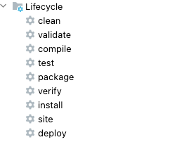

文章来自： 

[四十五图，一万五千字！一文让你走出迷雾玩转Maven！ - 掘金](https://juejin.cn/post/7238823745828405308?utm_source=gold_browser_extension)


**<font style="color:#DF2A3F;">引言</font>**

<font style="color:#117CEE;">Maven</font> 应该是大家的老熟客了，身为 Java 程序员，几乎每天都会跟他打交道。

不过有趣的是：很多伙伴对 Maven，似乎很熟，但又好像不熟；在理解上，处于似懂非懂的“量子纠缠态”，为什么这么说呢？原因很简单，要说不熟吧，偏偏每天都有所接触；要说熟吧，可是对许多高级功能又仅是一知半解。

正因如此，为了辅助大家从“量子纠缠态”中走出来，本文会从零开始，带着大家玩转 Maven 技术。

声明：如果基础够扎实的小伙伴，可以跳到 1.3 阶段（快速刷一遍当复习也行）。


Maven是专门用于构建、管理Java项目的工具，它为我们提供了标准化的项目结构，如下：

```java
├─ProjectName                 // 项目名称
│  ├─src                      // 根目录
│  │   ├─main                 // 主目录
│  │   │  ├─java              // Java源码目录
│  │   │  ├─resources         //配置文件目录
│  │   │  └─webapp            // Web文件目录
│  │   ├─test                 // 测试目录
│  │   │  ├─java              // Java测试代码目录
│  │   │  └─resources         // 测试资源目录
│  └─pom.xml                  // Maven项目核心配置文件
```

同时也提供了一套标准的构建流程：


从编译、测试、打包、发布……涵盖整个项目开发的全流程。

并且最重要的一点，它还提供了依赖（ Jar 包）管理功能，回想大家最初学 JavaEE 时，想要用到一个外部的工具包，必须先从网上找到对应的 Jar 文件，接着将其手动丢到项目的 lib 目录下，当项目需要依赖的外部包达到几十个、每个外部包还依赖其他包时，这个过程无疑很痛苦。

而这一切的一切，随着 Maven 的出现，从此不复存在。

## 1.1 Maven安装指南
使用 Maven 前，必须先安装它，这时可以先去到[Maven官网](https://link.juejin.cn/?target=https%3A%2F%2Fmaven.apache.org%2Fdownload.cgi)下载自己所需的版本：


下载进行解压后（不过解压的目录最好别带中文，否则后续会碰到一些问题），接着需要配置一下，总共分为四步。

1. 在系统环境中，新建一个 MAVEN_HOME 或 M2_HOME 的环境变量，值写成解压路径。
2. 找到Path变量并编辑，在其中新增一行，配置一下bin目录：

```bash
%M2_HOME%\bin
```

:::color1
其实安装许多软件，都要配置这一步，到底是为啥呢？因为任何软件的bin目录，通常会存放一些可执行的脚本/工具，如JDK的bin目录中，就存放着javac、javap、jstack……一系列工具。如果不在Path中配置bin，那想要使用这些工具，只能去到JDK安装目录下的bin目录，然后才能使用。

不过当大家在Path中配置了bin之后，这个配置就会对全局生效，任何位置执行javac这类指令，都可以从Path中，找到对应的bin目录位置，然后调用其中提供的工具。

:::

3. 找到Maven解压目录下的`conf/settings.xml`，然后点击编辑，找到`<localRepository>`标签，将其挪动到注释区域外，然后配置本地仓库位置：

```xml
<localRepository>自己选择一个空的本地目录（最好别带中文）</localRepository>
```

4. 由于 Apache 的官方镜像位于国外，平时拉取依赖比较慢，所以还需配置 Maven 国内的镜像源，这时在`settings.xml`文件中，先搜索 `<mirrors>`标签，接着在其中配置阿里云的镜像地址：

```xml
<mirror>  
    <id>alimaven</id>  
    <name>aliyun maven</name>  
    <url>http://maven.aliyun.com/nexus/content/groups/public/</url>
    <mirrorOf>central</mirrorOf>          
</mirror>
```

到这里，整个 Maven 安装流程全部结束，最后也可以在终端工具，执行`mvn -v`命令检测一下。

## 1.2 Maven入门指南
安装好Maven后，接着可以通过IDEA工具来创建 Maven 项目，不过要记得配置一下本地 Maven 及仓库位置：


在这里配置，是对全局生效，后续创建的所有 Maven 项目，都会使用这组配置。

### 1.2.1 IDEA创建Maven项目
接着就可以创建Maven项目，这个过程特别简单，先选择New Project：


这里选创建Maven项目，接着指定一下JDK，还可以选择是否使用骨架，选好后直接Next下一步：


这里需要写一下 GAV 坐标，稍微解释一下三个选项的含义：

+ GroupID：组织 ID，一般写公司的名称缩写；
+ ArtifactID：当前 Maven 工程的项目名字；
+ Version：当前 Maven 工程的版本。

接着点下一步，然后选择一下项目的存储位置，最后点击Finish创建即可：


这一步结束后，就得到了一个纯净版的 Maven 项目，然后可以基于 Maven 实现依赖管理。

### 1.2.2 Maven依赖管理
最简单的依赖管理，总共就只有三步，如下：

+ ①在`pom.xml`中，先写一个`<dependencies>`标签；
+ ②在`<dependencies>`标签中，使用`<dependency>`标签来导入依赖；
+ ③在`<dependency>`标签中，通过 GAV 坐标来导入依赖。

如果你不知道一个依赖的 GAV 该怎么写，可以去[仓库索引](https://link.juejin.cn/?target=https%3A%2F%2Fmvnrepository.com%2F)中搜索，现在写个坐标来感受一下：

```xml
<dependencies>
    <dependency>
        <groupId>org.springframework</groupId>
        spring-web</artifactId>
        <version>5.1.8.RELEASE</version>
    </dependency>
</dependencies>
```

引入 GAV 坐标后，依赖不会立马生效，需要手动刷新一下项目：


可以借助 IDEA 自带的 Maven 项目工具来进行刷新；也可以安装 Maven-Helper 插件，在项目上右键，然后通过 Run Maven 里的指令刷新。至此，大家就掌握了Maven的基本使用。

> PS：如果你本地仓库中有依赖，但忘了GAV坐标怎么写，通过IDEA工具，在pom.xml文件中按下alt+insert快捷键，接着点击Dependency，可以做到可视化快捷导入。
>

### 1.2.3 依赖范围管理
有时候，有些依赖我们并不希望一直有效，比如典型的 JUnit 测试包，对于这类 jar 包而言，最好只针对测试环境有效，而编译环境、运行环境中，因为用不到单元测试，所以有没有办法移除呢？这时可以通过`<scope>`标签来控制生效范围。例如：

```xml
<dependency>
    <groupId>org.springframework.boot</groupId>
    spring-boot-starter-test</artifactId>
    <version>2.1.8.RELEASE</version>
    <scope>test</scope>
</dependency>
```

该标签共有五种取值方式，每种取值对应着一种依赖范围，而不同的依赖范围，生效的环境（classpath）也并不同，如下表所示：

| 依赖范围 | 编译环境 | 测试环境 | 运行环境 |
| --- | --- | --- | --- |
| compile | 生效 | 生效 | 生效 |
| provided | 生效 | 生效 | 不生效 |
| system | 生效 | 生效 | 不生效 |
| runtime | 不生效 | 生效 | 生效 |
| test | 不生效 | 生效 | 不生效 |


项目引入的所有依赖，如果不显式指定依赖范围，默认是 compile，意味着所有环境下都生效，而一般的依赖包也无需更改，只有某些特殊的依赖，才需要手动配置一下。如：

+ Junit、spring-test 这类包，只在测试环境使用，所以配成 test；
+ Tomcat 内置 servlet-api 包，为了避免在运行环境冲突，应该配成 provided；
+ ……

同时， `<scope>`标签还可以通过自定义的方式来添加其他的 scope 范围，例如 Maven 插件中使用的 scope 值：

```xml
<dependency>
    <groupId>some.group</groupId>
    some-artifact</artifactId>
    <version>1.0</version>
    <scope>plugin</scope>
</dependency>
```

这里的 plugin 就是自定义的scope，表示该依赖只在Maven插件中生效。

最后，`<scope>`标签还有一类特殊、但很常用的取值范围，即import，但这个放在后面去讲。

## 1.3 Maven工作原理剖析
在Maven中，节点会分为工程、仓库两大类，工程是“依赖使用者”，仓库是“依赖提供者”，关系如下：


看着或许有点头大，要讲明白得先弄清里面三种仓库：

+ **中央仓库**：就是前面配置的镜像源，里面拥有海量的公共jar包资源；
+ **远程仓库**：也叫私服仓库，主要存储公司内部的jar包资源，这个后续会细说；
+ **本地仓库**：自己电脑本地的仓库，会在磁盘上存储jar包资源。


大致了解三种仓库的含义后，接着来梳理 Maven 的工作流程：

1. 项目通过 GAV 坐标引入依赖，首先会去本地仓库查找 jar 包；
2. 如果在本地仓库中找到了，直接把依赖载入到当前工程的 External Libraries 中；
3. 如果没找到，则去读取 `settings.xml` 文件，判断是否存在私服配置；
4. 如果有私服配置，根据配置的地址找到远程仓库，接着拉取依赖到本地仓库；
5. 如果远程仓库中没有依赖，根据私服配置去中央仓库拉取，然后放到私服、本地仓库；
6. 从远程或中央仓库中，把依赖下载到本地后，再重复第二步，把依赖载入到项目中。

上述六步便是 Maven 的完整工作流程，可能许多人没接触过私服，这个会放到后面聊。如果你的项目没配置 Maven 私服，那么第三步时，会直接从 `settings.xml`读取镜像源配置，直接去到中央仓库拉取依赖。

不过这里有个问题，拉取/引入依赖时，Maven 是怎么知道要找谁呢？答案是依靠 GAV 坐标，大家可以去观察一下本地仓库，当你引入一个依赖后，本地仓库中的目录，会跟你的 GAV 坐标一一对应，如：


无论是什么类型的仓库，都会遵循这个原则进行构建，所以，只要你书写了正确的GAV坐标，就一定能够找到所需的依赖，并将其载入到项目中。

## 1.4 Maven生命周期
通过IDEA工具的辅助，能很轻易看见 Maven 的九种 Lifecycle 命令，如下：



双击其中任何一个，都会执行相应的 Maven 构建动作，为啥 IDEA 能实现这个功能呢？道理很简单，因为IDEA封装了 Maven 提供的命令，如：点击图中的 clean，本质是在当前目录中，执行了 mvn clean 命令，下面解释一下每个命令的作用：

+ **clean**：清除当前工程编译后生成的文件（即删除 target 整个目录）；
+ **validate**：对工程进行基础验证，如工程结构、pom、资源文件等是否正确；
+ **compile**：对`src/main/java`目录下的源码进行编译（会生成 target 目录）；
+ **test**：编译并执行`src/test/java/`目录下的所有测试用例；
+ **package**：将当前项目打包，普通项目打 jar 包，webapp项目打 war 包；
+ **verify**：验证工程所有代码、配置进行是否正确，如类中代码的语法检测等；
+ **install**：将当前工程打包，然后安装到本地仓库，别人可通过GAV导入；
+ **site**：生成项目的概述、源码测试覆盖率、开发者列表等站点文档（需要额外配置）；
+ **deploy**：将当前工程对应的包，上传到远程仓库，提供给他人使用（私服会用）。

上述便是九个周期阶段命令的释义，而Maven总共划分了三套生命周期：


主要看 default 这套，该生命周期涵盖了构建过程中的检测、编译、测试、打包、验证、安装、部署每个阶段。

注意一点：同一生命周期内，执行后面的命令，前面的所有命令会自动执行！比如现在执行一条命令：

```bash
mvn test
```

test 命令位于 default 这个生命周期内，所以它会先执行 validate、compile 这两个阶段，然后才会真正执行 test 阶段。同时，还可以一起执行多个命令，如：

```bash
mvn clean install
```

这两个命令隶属于不同的周期，所以会这样执行：先执行 clean 周期里的`pre-clean``clean`，再执行 default 周期中，validate 到install 这个闭区间内的所有阶段。

从上面不难发现，default 是 Maven 的核心周期，但其实上面并没有给完整，因为官方定义的default一共包含23个小阶段，上面的图只列出了七个核心周期，对详细阶段感兴趣的可以自行了解。


Maven中只定义了三套生命周期，以及每套周期会包含哪些阶段，而每个阶段具体执行的操作，这会交给插件去干，也就是说：Maven插件会实现生命周期中的每个阶段，这也是大家为什么看到IDEA的 Lifecycle下 面，还会有个 Plugins 的原因：


当你双击 Lifecycle 中的某个生命周期阶段，实际会调用 Plugins 中对应的插件。在Shell窗口执行 mvn 命令时，亦是如此，因为插件对应的实现包，都会以 jar 包形式存储在本地仓库里。你有特殊的需求，也可以在`pom.xml`的`<build>`标签中，依靠`<plugins>`插件来导入。


