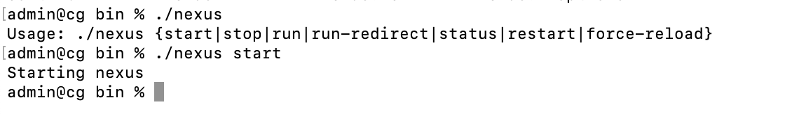
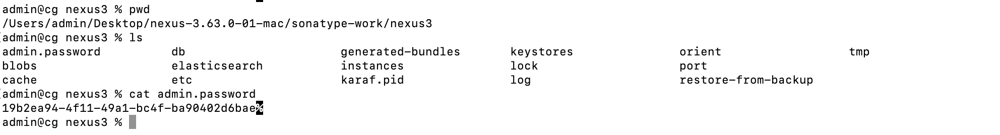
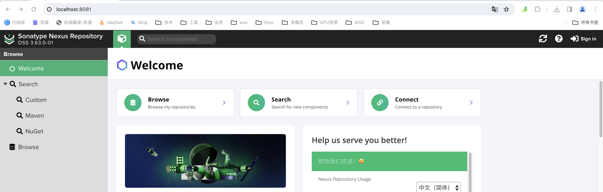
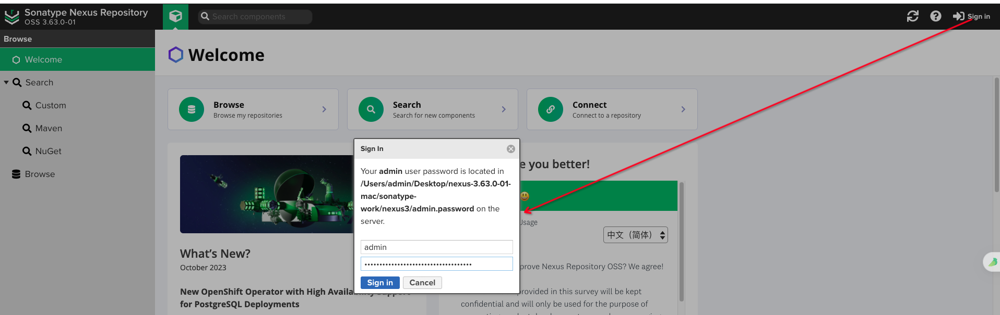
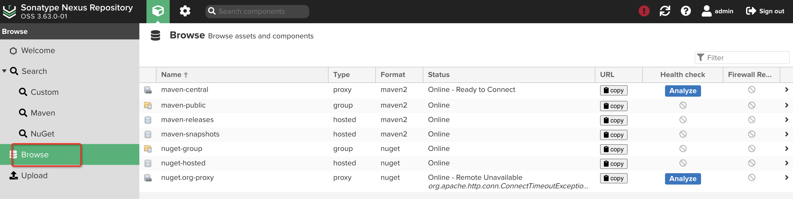
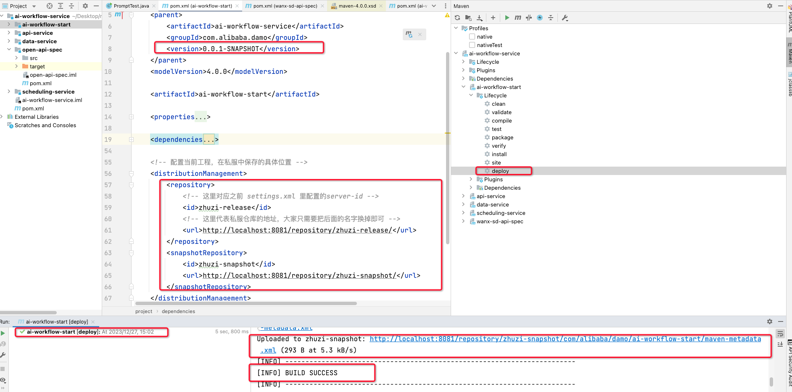
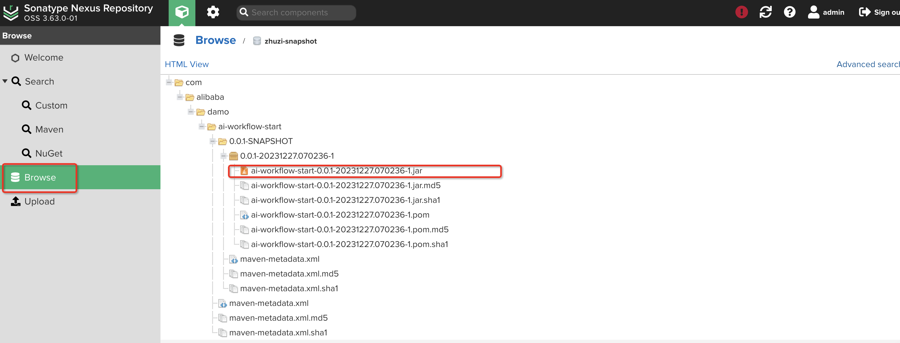

文章来自：

[四十五图，一万五千字！一文让你走出迷雾玩转Maven！ - 掘金](https://juejin.cn/post/7238823745828405308?utm_source=gold_browser_extension)

前面叨叨絮絮说了一大堆，最后就来聊聊 Maven 私服配置，为啥需要私服呢？

大家来设想这么个场景，假设你身在基建团队，主要负责研发各个业务开发组的公用组件，那么当你写完一个组件后，为了能让别的业务开发组用上，难道是先把代码打包，接着用U盘拷出来，给别人送过去嘛？有人说不至于，难道我不会直接发过去啊……

的确，用通讯软件发过去也行，但问题依旧在，假设你的组件升级了，又发一遍吗？所以，为了便于团队协作，搭建一个远程仓库很有必要，写完公用代码后，直接发布到远程仓库，别人需要用到时，直接从远程仓库拉取即可，而你升级组件后，只需要再发布一个新版本即可！

那远程仓库该怎么搭建呀？这就得用到 Maven 私服技术，最常用的就是基于 Nexus 来搭建。

## 3.1 Nexus私服搭建指南
Nexus 是 Sonatype 公司开源的一款私服产品，大家可以先去到

[Download](https://help.sonatype.com/repomanager3/product-information/download)

下载一下安装包，Nexus 同样是一款解压即用的工具，不过也要注意：解压的目录中不能存在中文，否则后面启动不起来。

解压完成后，会看到两个目录：

+ `nexus-x.x.x-xx`：里面会放Nexus启动时所需要的依赖、环境配置；
+ `sonatype-work`：存放Nexus运行时的工作数据，如存储上传的jar包等。

接着可以去到：

```bash
解压目录/nexus-x.x.x-xx/etc/nexus-default.properties
```

这个文件修改默认配置，默认端口号是 8081，如果你这个端口已被使用，就可以修改一下，否则通常不需要更改。接着可以去到解压目录的`bin`文件夹中，打开`cmd`终端，执行启动命令：

```bash
./nexus start
```

初次启动的过程会额外的慢，因为它需要初始化环境，创建工作空间、内嵌数据库等，直到看见这句提示：



此时才算启动成功，Nexus初次启动后，会在`sonatype-work`目录中生成一个`/nexus3/admin.password`文件，这里面存放着你的初始密码，默认账号就是`admin`，在浏览器输入：



```java
http://localhost:8081
```



访问 Nexus 界面，接着可以在网页上通过初始密码登录，登录后就会让你修改密码，改完后就代表 Nexus 搭建成功（不过要记住，改完密码记得重新登录一次，否则后面的操作会没有权限）。



## 3.2 Nexus私服仓库


登录成功后，点击`Browse`会看到一些默认仓库，这里稍微解释一下每个字段的含义。

+ Name：仓库的名字；
+ Type：仓库的类型；
+ Format：仓库的格式；
+ Status：仓库的状态；
+ URL：仓库的网络地址。

重点来说说仓库的分类，总共有四种类型：

| 类型 | 释义 | 作用 |
| --- | --- | --- |
| hosted | 宿主仓库 | 保存中央仓库中没有的资源，如自研组件 |
| proxy | 代理仓库 | 配置中央仓库，即镜像源，私服中没有时会去这个地址拉取 |
| group | 仓库组 | 用来对宿主、代理仓库分组，将多个仓库组合成一个对外服务 |
| virtual | 虚拟仓库 | 并非真实存在的仓库，类似于MySQL中的视图 |


仓库的关系如下：


本地的 Maven 需要配置私服地址，当项目需要的依赖，在本地仓库没有时，就会去到相应的宿主/远程仓库拉取；如果宿主仓库也没有，就会根据配置的代理仓库地址，去到中央仓库拉取，最后依次返回……。

## 3.3 Maven配置私服
Maven 想要使用私服，需要先修改`settings.xml`文件，我的建议是别直接改，先拷贝一份出来，接着来讲讲配置步骤。

1. 修改settings.xml里的镜像源配置，之前配的阿里云镜像不能用了，改成：

```xml
<mirror>
    <id>nexus-zhuzi</id>
    <mirrorOf>*</mirrorOf>
    <url>http://localhost:8081/repository/maven-public/</url>
</mirror>
```

2. 在私服中修改访问权限，允许匿名用户访问，如下：


3. 在 Nexus 私服中配置一下代理仓库地址，即配置镜像源：


将这个默认的中央仓库地址，改为国内的阿里云镜像：

```java
http://maven.aliyun.com/nexus/content/groups/public/
```

改完后记得拖动到最下方，点击`Save`保存一下即可。

4. 在 Maven 的`settings.xml`中，配置私服的账号密码：

```xml
<server>
  <id>zhuzi-release</id>
  <username>admin</username>
  <password>你的私服账号密码</password>
</server>

<server>
  <id>zhuzi-snapshot</id>
  <username>admin</username>
  <password>你的私服账号密码</password>
</server>
```

这两组配置，放到`<servers>`标签中的任何一处即可，这里可以先这样配置，看不懂没关系。

## 3.4 项目配置私服
前面配置好了本地 Maven 与私服的映射关系，接着要配置项目和私服的连接，说下流程。

1. 为项目创建对应的私服仓库，如果已有仓库，可以直接复用，创建步骤如下：


其中唯一值得一提的就是仓库格式，这里有三个可选项：

    - **Release**：稳定版，表示存放可以稳定使用的版本仓库；
    - **Snapshot**：快照版，代表存储开发阶段的版本仓库；
    - **Mixed**：混合版，不区分格式，表示混合存储代码的仓库。

为了规范性，我的建议是`Release``Snapshot`格式的仓库，各自都创建一个。

2. 在 Maven 工程的`pom.xml`文件中，配置对应的私服仓库地址，如下：

```xml
<!-- 配置当前工程，在私服中保存的具体位置 -->
<distributionManagement>
    <repository>
        <!-- 这里对应之前 settings.xml 里配置的server-id -->
        <id>zhuzi-release</id>
        <!-- 这里代表私服仓库的地址，大家只需要把后面的名字换掉即可 -->
        <url>http://localhost:8081/repository/zhuzi-release/</url>
    </repository>
    <snapshotRepository>
        <id>zhuzi-snapshot</id>
        <url>http://localhost:8081/repository/zhuzi-snapshot/</url>
    </snapshotRepository>
</distributionManagement>
```

3. 将当前项目发布到私服仓库，这里可以执行`mvn clean deploy`命令，也可以通过 IDEA 工具完成：


不过这里有一个细节要注意，由于配置了私服上的两个宿主仓库，一个为稳定仓库，另一个为快照仓库，所以发布时，默认会根据当前项目的`<version>`版本结尾，来选择上传到相应的仓库，例如上图中的结尾是`SNAPSHOT`，所以会被发布到快照仓库，如果结尾不是这个后缀时，就会被发布到`Release`仓库。



当发布完成后，大家就可以登录 Nexus 界面，找到对应的宿主仓库，查看相应的 jar 包信息啦！不过还有一点要注意：你要发布的包不能带有上级，即不能有 parent 依赖，否则在其他人在拉取该项目时，会找不到其父项目而构建失败。要解决这个问题，可以先将 parent 项目打包并上传至远程仓库，然后再发布依赖于该 parent 项目的子模块。



## 3.5 Nexus配置仓库组
前面在说仓库类型时，还提到过一个“仓库组”的概念，如果你目前所处的公司，是一个大型企业，不同团队都有着各自的宿主仓库，而你恰恰又需要用到其他团队的组件，这时难道需要在`pom.xml`中，将远程仓库地址先改为其他团队的地址吗？答案是不需要的，这时可以创建一个仓库组。


大家可以看到，图中的 Members 区域代表当前仓库组的成员，而这些成员会按照你排列的顺序，具备不同的优先级，越靠前的优先级越高。创建好仓库组后，接着可以去配置一下仓库组，这里有两种方式。

### 3.5.1 配置单个工程与仓库组的映射
这种方式只需修改`pom.xml`即可：

```xml
<repositories>
    <repository>
        <id>zhuzi-group</id>
        <!-- 配置仓库组的地址 -->
        <url>http://localhost:8081/repository/zhuzi-group/</url>
        <!-- 允许从中拉取稳定版的依赖 -->
        <releases>
            <enabled>true</enabled>
        </releases>
        <!-- 也允许从中拉取快照版的依赖 -->
        <snapshots>
            <enabled>true</enabled>
        </snapshots>
    </repository>
</repositories>

<pluginRepositories>
    <pluginRepository>
        <id>plugin-group</id>
        <url>http://localhost:8081/repository/zhuzi-group/</url>
        <releases>
            <enabled>true</enabled>
        </releases>
        <snapshots>
            <enabled>true</enabled>
        </snapshots>
    </pluginRepository>
</pluginRepositories>
```

在上述这组配置中，配置了`<repositories>``<pluginRepositories>`两个标签，分别是啥意思呢？很简单，第一个是普通依赖的仓库组地址，第二个是插件依赖的仓库组地址，前者针对于`pom.xml`中的`<dependency>`标签生效，后者针对`<plugin>`标签生效。

当你通过GAV坐标，引入一个依赖时，如果本地仓库中没找到，则会根据配置的仓库组地址，去到 Nexus 私服上拉取依赖。不过因为仓库组是由多个仓库组成的，所以拉取时，会根据仓库的优先级，依次搜索相应的依赖，第一个仓库将是最优先搜索的仓库。

### 3.5.2 配置本地Maven与仓库组的映射
上一种配置方式，只针对于单个Maven工程生效，如果你所有的Maven工程，都需要与Nexus私服上的仓库组绑定，这时就可以直接修改settings.xml文件，如下：

```xml
<profile>
	<id>zhuzi-group</id>
	<repositories>
		<repository>
			<id>nexus-maven</id>
			<url>http://localhost:8081/repository/zhuzi-group/</url>
			<releases>
				<enabled>true</enabled>
				<updatePolicy>always</updatePolicy>
			</releases>
			<snapshots>
				<enabled>true</enabled>
				<updatePolicy>always</updatePolicy>
			</snapshots>
		</repository>
	</repositories>
 
	<pluginRepositories>
		<pluginRepository>
			<id>nexus-maven</id>
			<url>http://localhost:8081/repository/zhuzi-group/</url>
			<releases>
				<enabled>true</enabled>
				<updatePolicy>always</updatePolicy>
			</releases>
			<snapshots>
				<enabled>true</enabled>
				<updatePolicy>always</updatePolicy>
			</snapshots>
		</pluginRepository>
	</pluginRepositories>
</profile>
```

这组配置要写在`<profiles>`标签里面，其他的与前一种方式没太大区别，唯一不同的是多了一个`<updatePolicy>`标签，该标签的作用是指定仓库镜像的更新策略，可选项如下：

+ `**always**`：每次需要Maven依赖时，都先尝试从远程仓库下载最新的依赖项；
+ `**daily**`：每天首次使用某个依赖时，从远程仓库中下载一次依赖项；
+ `**interval:X**`：每隔X个小时，下载一次远程仓库的依赖，X只能是整数；
+ `**never**`：仅使用本地仓库中已经存在的依赖项，不尝试从远程仓库中拉取。

Maven工程使用依赖时，首先会从本地仓库中查找所需的依赖项，如果本地仓库没有，则从配置的远程仓库下载这时会根据`<updatePolicy>`策略来决定是否需要从远程仓库下载依赖。

不过上述这样配置后，还无法让配置生效，如果想要生效，还得激活一下上述配置：

```xml

    <!-- 这里写前面配置的ID -->
	zhuzi-group</activeProfile>
</activeProfiles>
```

不过要记住，无论两种方式内的哪一种，都只允许从私服上拉取依赖，如果你的某个工程，想要打包发布到私服上，还是需要配置`3.4`阶段的`<distributionManagement>`标签。


**Maven 总结**：最后，对于 Maven 项目的命名，不同单词最好用`-`减号分割，而不是`_`下划线，毕竟`Spring``Apache`……的开源项目，都采用这种命名方式。不过，如果你要问我：“你为啥用`-`不用`_`”？别问，问就是我控几不住我寄几啊……更何况有句话说的好：知错不改，善莫大焉！

到这里，对于 Maven 常用的功能已经讲完了，掌握这些知识后，玩转 . Maven 的难度应该不大，不过 Maven 的功能远不仅如此，就光说`pom.xml`这个文件，可以配置的标签有几百个，本文仅讲到了几十个罢了。

