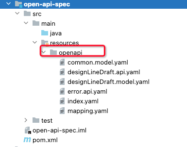
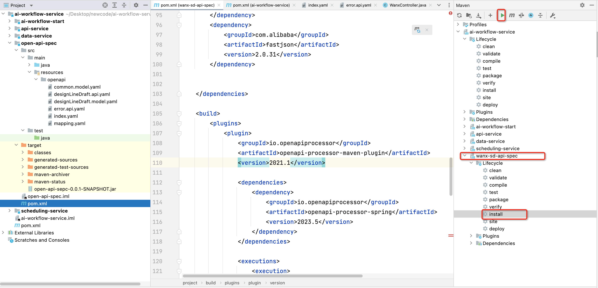
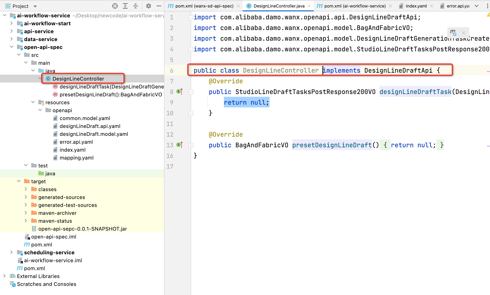

方案设计：利用Maven插件让OpenAPI自动生成控制接口，然后让自己编写的控制层Controller去继承自动生成的控制层接口。

参考文章：

[oap-maven :: openapi-processor](https://openapiprocessor.io/maven/2021.1/index.html)

[OpenAPI Specification - Version 3.0.3 | Swagger](https://swagger.io/specification/)

## 1 设计OpenAPI接口
OpenAPI接口的位置和架构

[index.yaml](https://www.yuque.com/attachments/yuque/0/2023/yaml/22334924/1703747376122-2591a002-2eea-4d23-905e-3f582bcd5986.yaml)

[mapping.yaml](https://www.yuque.com/attachments/yuque/0/2023/yaml/22334924/1703747376668-5f00552b-a32d-46b8-9ff6-50c9e7d05330.yaml)

[error.api.yaml](https://www.yuque.com/attachments/yuque/0/2023/yaml/22334924/1703747377087-6c5eb290-9947-4366-b2d2-df76cce1e37f.yaml)

[designLineDraft.model.yaml](https://www.yuque.com/attachments/yuque/0/2023/yaml/22334924/1703747376833-a91b8f2b-9662-4920-af05-e08b7dae7741.yaml)

[designLineDraft.api.yaml](https://www.yuque.com/attachments/yuque/0/2023/yaml/22334924/1703747377205-b998c378-bf1a-45a6-a6d6-f59f4b05094b.yaml)

[common.model.yaml](https://www.yuque.com/attachments/yuque/0/2023/yaml/22334924/1703747377183-a3d9c4fd-6236-4b7a-902b-051d84c91bb4.yaml)

## 2 添加POM依赖和Maven插件
[pom.xml](https://www.yuque.com/attachments/yuque/0/2023/xml/22334924/1703747486438-07bd36c1-a8b0-477b-9b72-b17fbd4f485c.xml)

## 3 打包生成接口

## 4 运用生成的接口

