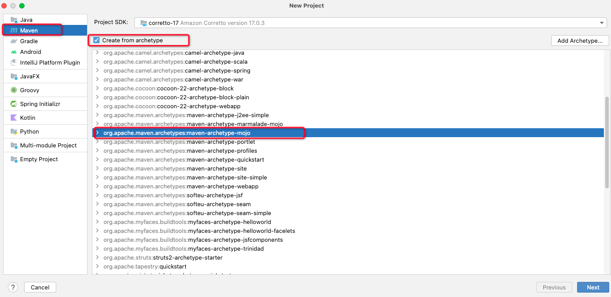

参考链接：

[Maven – Guide to Developing Java Plugins](https://maven.apache.org/guides/plugin/guide-java-plugin-development.html)

[【Maven】maven 插件开发实战 - 掘金](https://juejin.cn/post/6844904110244757517?searchId=202312271653223C9E96A5E1BC7FE25B52)

[Maven插件开发](https://blog.gmem.cc/maven-plugin-development)

前言：众所周知，Maven 实质上是一个插件执行框架，所有的工作都是通过插件完成的。包括我们日常使用到的类似`install``clean``deploy``compiler`等这些命令，其实底层都是一个一个的 maven 插件。

那么如何开发自己的插件呢？

# 1 Maven 插件的命名规范
在写一个项目之前，第一件事就是确定一个名称。Maven 插件也不例外。它有着自己的一套命名规范。但是规范很简单，一句话就可以概括：

+ 官方插件命名的格式为：`maven-xxx-plugin`
+ 非官方的插件命名为：`xxx-maven-plugin` 

是不是觉得很眼熟，没错，`spring-boot-starter`的命名也有类似的规范。好的，我们的第一个Maven 插件项目就叫`demo-test-maven-plugin`吧。

# 2 创建项目
名称起好了，下一步就是创建这个项目。如果你使用 IDEA 的话，那么创建十分的便捷，按如下步骤即可：

1. 选择`org.apache.maven.archetypes:maven-archetype-mojo`为骨架创建项目



2. 输入项目名


3. 选择 Maven，点击完成


# 3 分析项目文件
项目结构


可以看到生成的项目就是我们最最常见的 Maven 项目的结构，生成的文件也很少，一个`pom.xml`文件，一个`MyMojo`文件，简单介绍一下这两个文件


**pom.xml**

```xml
<project xmlns="http://maven.apache.org/POM/4.0.0" xmlns:xsi="http://www.w3.org/2001/XMLSchema-instance"
  xsi:schemaLocation="http://maven.apache.org/POM/4.0.0 http://maven.apache.org/maven-v4_0_0.xsd">
  <modelVersion>4.0.0</modelVersion>
  <groupId>com.ali</groupId>
  demo-test-maven-plugin</artifactId>
  <packaging>maven-plugin</packaging>
  <version>1.0-SNAPSHOT</version>
  <name>demo-test-maven-plugin Maven Mojo</name>
  <url>http://maven.apache.org</url>
  <dependencies>
    <dependency>
      <groupId>org.apache.maven</groupId>
      maven-plugin-api</artifactId>
      <version>2.0</version>
    </dependency>
    <dependency>
      <groupId>junit</groupId>
      junit</artifactId>
      <version>3.8.1</version>
      <scope>test</scope>
    </dependency>
  </dependencies>
</project>

```

首先生成的项目`pom.xml`中，自动依赖了两个项目，一个是`maven-plugin-api`，这个是开发 Maven 插件必须依赖的核心包。

另一个是单元测试时使用的`junit` 包。这两个没什么要注意的，真正要注意的是这个项目的 packaging，通常我遇到的`packaging`都是`jar``war``pom`，这里比较特殊是 `maven-plugin`。


**MyMojo.java**

```java
package com.ali;

/*
 * Copyright 2001-2005 The Apache Software Foundation.
 *
 * Licensed under the Apache License, Version 2.0 (the "License");
 * you may not use this file except in compliance with the License.
 * You may obtain a copy of the License at
 *
 *      http://www.apache.org/licenses/LICENSE-2.0
 *
 * Unless required by applicable law or agreed to in writing, software
 * distributed under the License is distributed on an "AS IS" BASIS,
 * WITHOUT WARRANTIES OR CONDITIONS OF ANY KIND, either express or implied.
 * See the License for the specific language governing permissions and
 * limitations under the License.
 */

import org.apache.maven.plugin.AbstractMojo;
import org.apache.maven.plugin.MojoExecutionException;

import java.io.File;
import java.io.FileWriter;
import java.io.IOException;

/**
 * Goal which touches a timestamp file.
 *
 * @goal touch
 * 
 * @phase process-sources
 */
public class MyMojo
    extends AbstractMojo
{
    /**
     * Location of the file.
     * @parameter expression="${project.build.directory}"
     * @required
     */
    private File outputDirectory;

    public void execute()
        throws MojoExecutionException
    {
        File f = outputDirectory;

        if ( !f.exists() )
        {
            f.mkdirs();
        }

        File touch = new File( f, "touch.txt" );

        FileWriter w = null;
        try
        {
            w = new FileWriter( touch );

            w.write( "touch.txt" );
        }
        catch ( IOException e )
        {
            throw new MojoExecutionException( "Error creating file " + touch, e );
        }
        finally
        {
            if ( w != null )
            {
                try
                {
                    w.close();
                }
                catch ( IOException e )
                {
                    // ignore
                }
            }
        }
    }
}

```

# 4 开发插件
**修改 pom.xml**

```xml
<project xmlns="http://maven.apache.org/POM/4.0.0" xmlns:xsi="http://www.w3.org/2001/XMLSchema-instance"
  xsi:schemaLocation="http://maven.apache.org/POM/4.0.0 http://maven.apache.org/maven-v4_0_0.xsd">
  <modelVersion>4.0.0</modelVersion>
  <groupId>com.ali</groupId>
  demo-test-maven-plugin</artifactId>
  <packaging>maven-plugin</packaging>
  <version>1.0-SNAPSHOT</version>
  <name>demo-test-maven-plugin Maven Mojo</name>
  <url>http://maven.apache.org</url>
  <properties>
    <project.build.sourceEncoding>UTF-8</project.build.sourceEncoding>
    <maven.compiler.source>8</maven.compiler.source>
    <maven.compiler.target>8</maven.compiler.target>
    <maven.compiler.compilerVersion>8</maven.compiler.compilerVersion>
  </properties>
  <dependencies>
    
    <dependency>
      <groupId>org.apache.maven</groupId>
      maven-plugin-api</artifactId>
      <version>3.9.0</version>
    </dependency>
 
    <dependency>
      <groupId>org.apache.maven.plugin-tools</groupId>
      maven-plugin-annotations</artifactId>
      <version>3.8.1</version>
      <scope>provided</scope>
    </dependency>
    
  </dependencies>

  <build>
    <plugins>
      <plugin>
        <groupId>org.apache.maven.plugins</groupId>
        maven-plugin-plugin</artifactId>
        <version>3.5.2</version>
      </plugin>
    </plugins>
  </build>
</project>

```

相较于默认的 pom.xml 文件，我们做了如下几个变动：

1. 升级`maven-plugin-api`的插件版本到 `3.9.0`。原生的 `2.0` 实在是太老了。
2. 添加 `maven-plugin-annotations` 这个依赖，有了这个依赖就可以直接使用注解了
3. 添加 `maven-plugin-plugin` 插件依赖，添加这个依赖主要是为了在 `jdk1.8` 能编译通过，否则会报错


**修改 MyMojo.java**

```java
package com.ali;


import org.apache.maven.plugin.AbstractMojo;
import org.apache.maven.plugin.MojoExecutionException;
import org.apache.maven.plugins.annotations.Mojo;
import org.apache.maven.plugins.annotations.Parameter;

import java.io.File;
import java.io.FileWriter;
import java.io.IOException;

@Mojo(name = "hello")
public class MyMojo extends AbstractMojo {

    @Parameter(name = "name", defaultValue = "kiwi")
    private String name;

    public void execute() throws MojoExecutionException{
        getLog().info("hello "+ name );
    }
}

```

回到示例上了，我们这个插件作用很简单，根据配置输出 `hello xxx`，如果没有配置就输出 `hello kiwi`。我们在写插件时，当然不会这样写，但是通过这个 demo，你就掌握了 Maven 插件的大部分知识，可以自己做一些很有趣的插件。

# 5 使用插件
首先上面我们的代码写完了，必须要`Install`一下，否则别的项目无法直接依赖，如果你还想给其它人使用，那还需上传到 Maven 仓库。  


在其他项目中加入该插件

```xml
<build>
  <plugins>
    <plugin>
      <groupId>com.ali</groupId>
      demo-test-maven-plugin</artifactId>
      <version>1.0-SNAPSHOT</version>
    </plugin>
  </plugins>
</build>
```

在我们想使用插件的项目中，添加如上配置，其中 plugin 中使用我们插件的  GAV 信息。  


**启动插件**：如果上面配置的都正确，那么在 IDEA 右侧的 Maven 中，你配置的项目的 Plugins 下会多了一个 `demo-test`（具体根据你插件项目的名称），而 `demo-test` 里面会有一个 `demo:hello`，其中这个`demo-test`对应你插件项目的名称，而`hello` 对应你插件的名称也就是 `@Mojo` 中的 `name` 。

  
好的，我们双击一下`demo:hello` 会输出如下日志：  
  
这样，我们的第一个 Maven 插件就好了。  


**配置参数**：可能你还记得，我们在写 `MyMojo` 的时候还指定了一个 `name` 属性，并且为它指定了一个 `Parameter`，这个如何使用。只要在依赖的插件下面添加 `configuration` 标签就可以了。

```xml
<build>
  <plugins>
    <plugin>
      <groupId>com.ali</groupId>
      demo-test-maven-plugin</artifactId>
      <version>1.0-SNAPSHOT</version>
      <configuration>
        <name>tom</name>
      </configuration>
    </plugin>

  </plugins>
</build>

```

其中 `configuration` 标签内的标签，对应你定义的参数名称，而且 IDEA 还有语法提示，很 nice。  
  
好的，我们再运行一下，结果如下：  
  
好的，大功告成。  


### 
