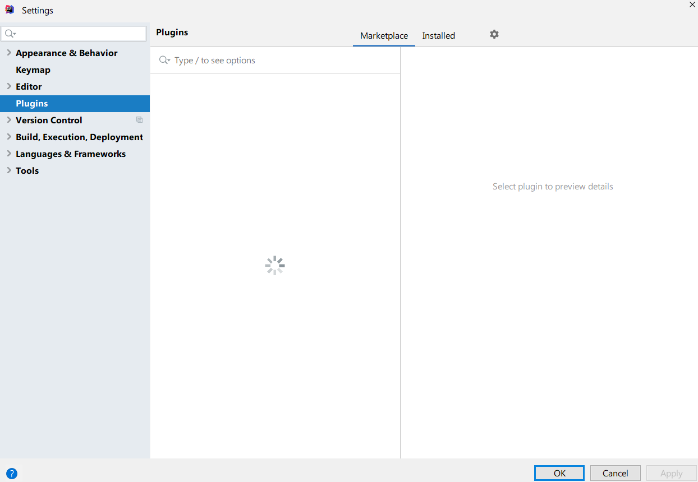

现象是：

操作步骤：

1. 打开设置 ;
2. 搜索框输入plugins;
3. 点击plugins;
4. 点齿轮按钮，选择HTTP Proxy settings;
5. 勾选 Auto detect proxy settings;
6. 勾选 Automatic proxy configuration URL
7. 输入 plugins.jetbrains.com
8. 以上步骤解决了就不用往下看了
9. 打开`C:\Windows\System32\drivers\etc\hosts` 末尾追加`13.226.159.106 plugins.jetbrains.com`
10. 重新打开idea的plugins插件列表出来了

