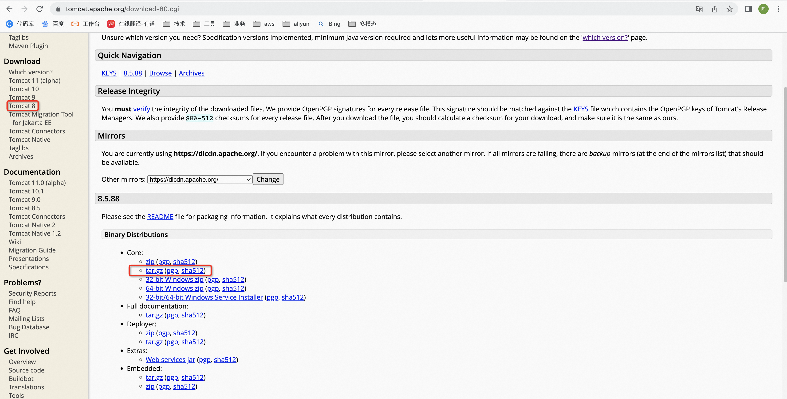
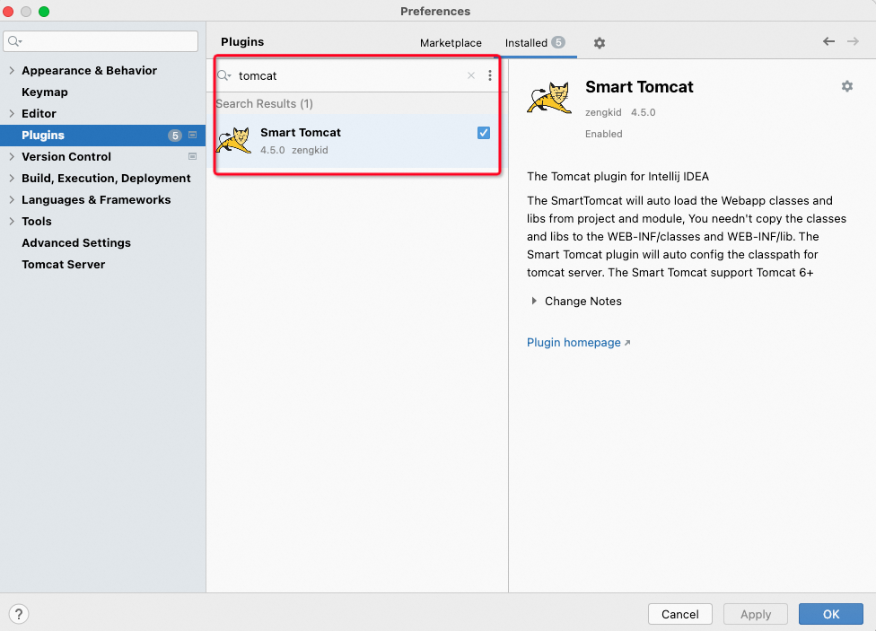
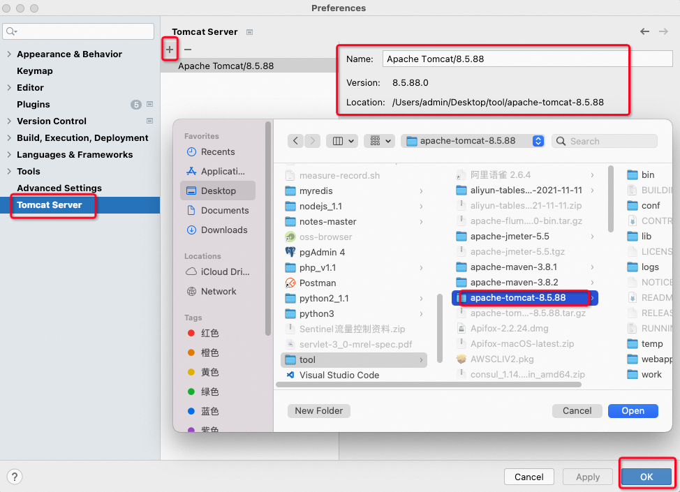
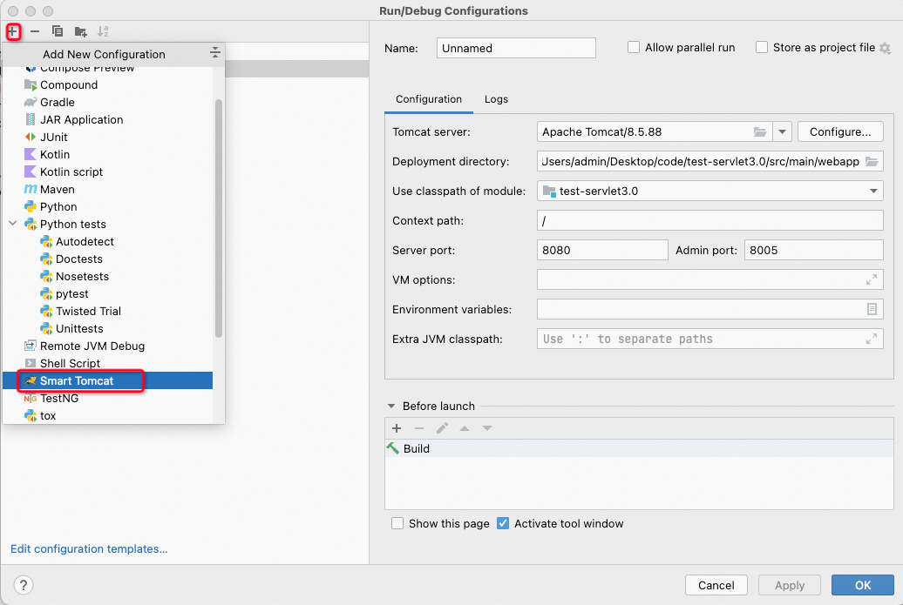
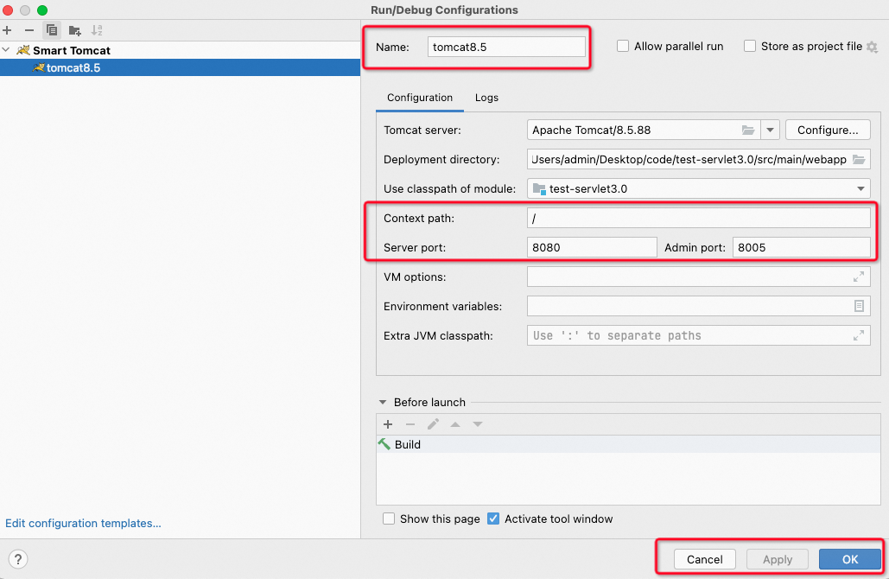

以mac为例，如下步骤：

1. 进入tomcat官网，下载tomcat

[Apache Tomcat® - Apache Tomcat 8 Software Downloads](https://tomcat.apache.org/download-80.cgi)

[apache-tomcat-8.5.88.tar.gz](https://www.yuque.com/attachments/yuque/0/2023/gz/22334924/1683523720015-44999767-4349-4f99-b8bf-c35b7debf3fe.gz)

2. 打开IDEA，下载插件

3. 将下载好tomcat，解压后，配置到IDEA中

4. 给具体的服务配置Tomcat
    1. edit configurations

    2. 添加tomcat，如果tomcat为灰色，则重启idea

    3. 修改name，首页路径即可使用

